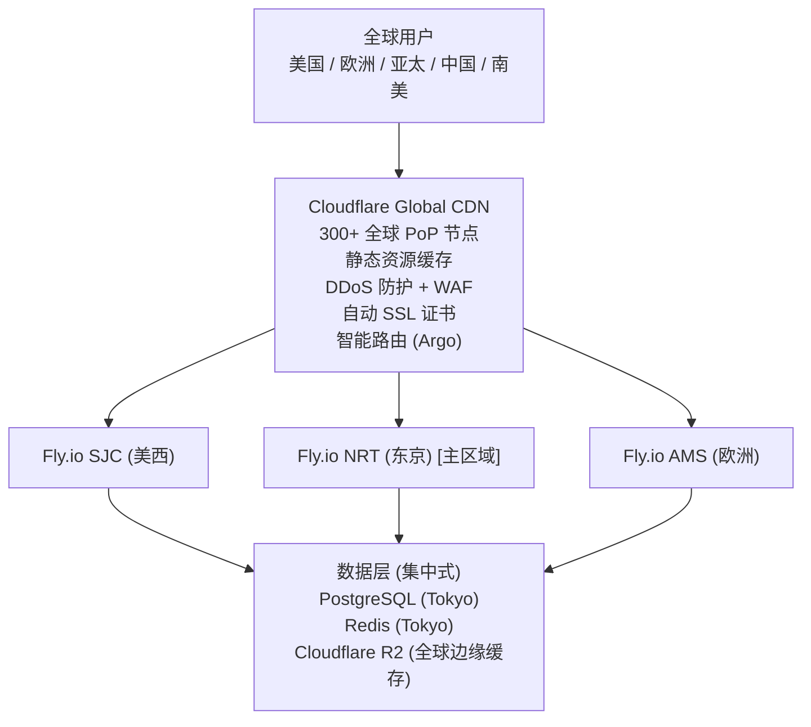
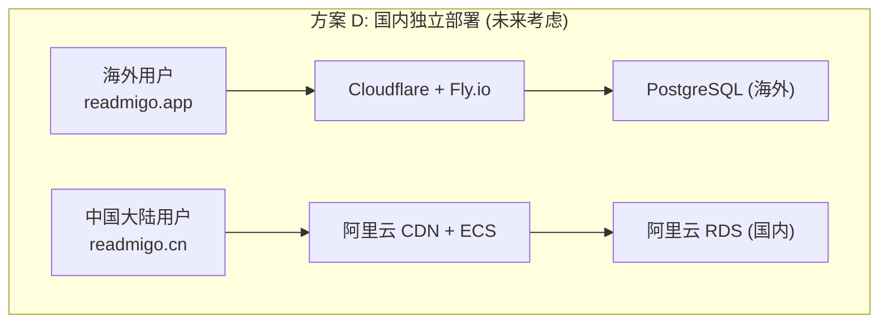
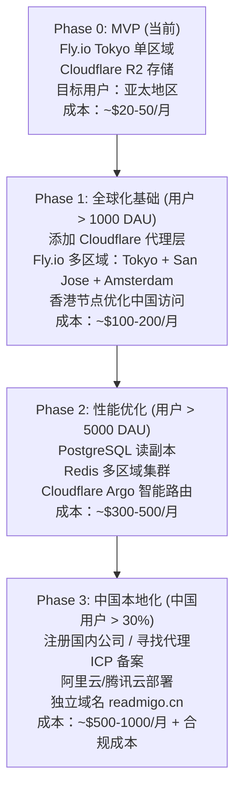
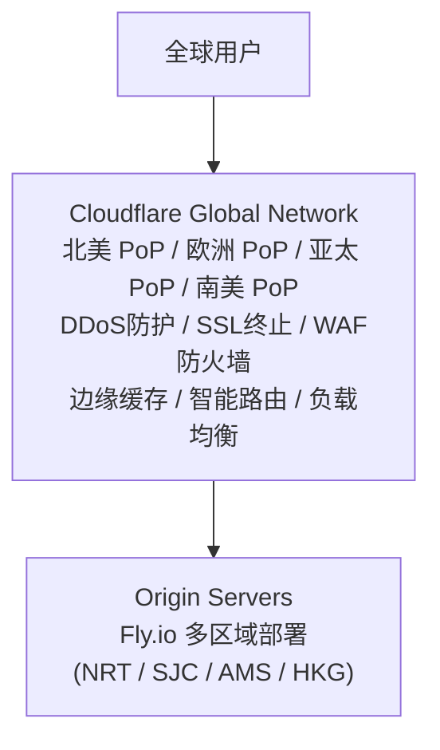

# 全球性能优化

### 16.0 全球部署策略概述

本节详细说明 Readmigo 如何服务全球用户（包括中国大陆用户）的部署架构和策略。

#### 16.0.1 当前部署现状

```
┌─────────────────────────────────────────────────────────────────────────┐
│                         当前架构 (2024)                                  │
├─────────────────────────────────────────────────────────────────────────┤
│                                                                         │
│  部署配置：                                                              │
│  ├── 平台：Fly.io                                                       │
│  ├── 区域：Tokyo (NRT) - 亚太主区域                                     │
│  ├── 实例：shared-cpu-1x, 512MB RAM                                     │
│  ├── 数据库：PostgreSQL (Fly.io 托管)                                   │
│  ├── 缓存：Redis (Fly.io 托管)                                          │
│  └── 存储：Cloudflare R2 (S3 兼容)                                      │
│                                                                         │
│  用户延迟估算：                                                          │
│  ┌─────────────────────────────────────────────────────────────────┐    │
│  │  地区              │  延迟 (RTT)    │  体验评级                  │    │
│  │  ─────────────────────────────────────────────────────────────  │    │
│  │  日本/韩国/台湾    │  < 50ms       │  ⭐⭐⭐⭐⭐ 优秀              │    │
│  │  东南亚            │  50-100ms     │  ⭐⭐⭐⭐ 良好                │    │
│  │  中国大陆          │  100-200ms    │  ⭐⭐⭐ 可用 (可能不稳定)    │    │
│  │  美国西海岸        │  100-120ms    │  ⭐⭐⭐⭐ 良好                │    │
│  │  美国东海岸        │  150-180ms    │  ⭐⭐⭐ 可接受               │    │
│  │  欧洲              │  200-280ms    │  ⭐⭐ 较慢                   │    │
│  └─────────────────────────────────────────────────────────────────┘    │
│                                                                         │
│  评估：当前架构适合亚太用户，但对欧美用户延迟较高                        │
│                                                                         │
└─────────────────────────────────────────────────────────────────────────┘
```

#### 16.0.2 全球多区域部署方案

**推荐架构：Phase 1 - Cloudflare + Fly.io 多区域**



优化后延迟：
┌───────────────────────────────────────────────────────────────┐
│  地区              │  优化后延迟    │  改善                   │
│  ─────────────────────────────────────────────────────────── │
│  日本/韩国/台湾    │  < 50ms       │  不变                   │
│  东南亚            │  50-80ms      │  提升 20%               │
│  中国大陆          │  80-150ms     │  提升 25% + 更稳定      │
│  美国              │  < 50ms       │  提升 60-70%            │
│  欧洲              │  < 50ms       │  提升 80%               │
└───────────────────────────────────────────────────────────────┘
```

#### 16.0.3 中国大陆用户支持策略



#### 16.0.4 渐进式部署路线图



#### 16.0.5 Fly.io 多区域配置

```toml
# fly.toml - 多区域配置示例

app = "readmigo-api"
primary_region = "nrt"  # Tokyo 作为主区域

[build]
  dockerfile = "Dockerfile"

[http_service]
  internal_port = 3000
  force_https = true
  auto_stop_machines = true
  auto_start_machines = true
  min_machines_running = 1

  # 多区域部署
  [[http_service.regions]]
  region = "nrt"   # Tokyo - 主区域，靠近数据库
  [[http_service.regions]]
  region = "sjc"   # San Jose - 美西
  [[http_service.regions]]
  region = "ams"   # Amsterdam - 欧洲
  [[http_service.regions]]
  region = "hkg"   # Hong Kong - 中国用户优化

[http_service.concurrency]
  type = "connections"
  hard_limit = 250
  soft_limit = 200

[[vm]]
  cpu_kind = "shared"
  cpus = 1
  memory_mb = 512
```

```bash
# 部署到多区域
fly scale count 1 --region nrt   # Tokyo
fly scale count 1 --region sjc   # San Jose
fly scale count 1 --region ams   # Amsterdam
fly scale count 1 --region hkg   # Hong Kong (可选)
```

### 16.1 全球网络架构



### 16.2 CDN缓存策略

```
┌─────────────────────────────────────────────────────────────────────────┐
│                        CDN Caching Strategy                             │
├─────────────────────────────────────────────────────────────────────────┤
│                                                                         │
│  缓存层级                                                                │
│  ══════════                                                              │
│                                                                         │
│  ┌─────────────────────────────────────────────────────────────────┐    │
│  │  资源类型          缓存时间      缓存位置      更新策略          │    │
│  │  ────────────────────────────────────────────────────────────   │    │
│  │  EPUB文件          7天          CDN边缘       版本化URL         │    │
│  │  封面图片          30天         CDN边缘       版本化URL         │    │
│  │  封面缩略图        30天         CDN边缘       版本化URL         │    │
│  │  字体文件          1年          CDN边缘       永久缓存          │    │
│  │  静态JS/CSS        1年          CDN边缘       Hash命名          │    │
│  │  书籍元数据        1小时        CDN边缘       stale-while-rev.  │    │
│  │  用户数据          不缓存       -             实时              │    │
│  │  AI响应            7天          Redis         Hash Key          │    │
│  └─────────────────────────────────────────────────────────────────┘    │
│                                                                         │
│  Cache-Control 配置                                                      │
│  ═══════════════════                                                     │
│                                                                         │
│  # EPUB文件                                                             │
│  Cache-Control: public, max-age=604800, stale-while-revalidate=86400   │
│                                                                         │
│  # 封面图片                                                             │
│  Cache-Control: public, max-age=2592000, immutable                      │
│                                                                         │
│  # API响应 (书籍列表)                                                   │
│  Cache-Control: public, max-age=300, stale-while-revalidate=600        │
│                                                                         │
│  # API响应 (用户数据)                                                   │
│  Cache-Control: private, no-cache                                       │
│                                                                         │
└─────────────────────────────────────────────────────────────────────────┘
```

### 16.3 API响应优化

```typescript
// 后端响应优化策略

/**
 * 响应压缩配置
 */
const compressionConfig = {
  // Brotli压缩 (优先)
  br: {
    enabled: true,
    level: 4,           // 平衡压缩率和CPU
    minSize: 1024,      // 最小压缩大小
  },

  // Gzip压缩 (兼容)
  gzip: {
    enabled: true,
    level: 6,
    minSize: 1024,
  }
};

/**
 * 分页和字段过滤
 */
interface BookListRequest {
  page?: number;
  limit?: number;           // 默认20，最大100
  fields?: string[];        // 指定返回字段
  include?: string[];       // 关联数据
}

// 精简响应示例
const bookListResponse = {
  // 只返回必要字段
  books: [
    {
      id: "uuid",
      title: "Pride and Prejudice",
      author: "Jane Austen",
      coverUrl: "https://cdn.../cover_thumb.jpg",  // 缩略图
      difficulty: 2.5,
      wordCount: 122000,
    }
  ],
  meta: {
    page: 1,
    limit: 20,
    total: 700,
    hasMore: true,
  }
};

/**
 * 条件请求支持
 */
// ETag 支持
app.use((req, res, next) => {
  res.set('ETag', generateETag(responseBody));

  if (req.headers['if-none-match'] === res.get('ETag')) {
    return res.status(304).end();
  }

  next();
});

// Last-Modified 支持
app.use((req, res, next) => {
  res.set('Last-Modified', resource.updatedAt.toUTCString());

  const ifModifiedSince = req.headers['if-modified-since'];
  if (ifModifiedSince && new Date(ifModifiedSince) >= resource.updatedAt) {
    return res.status(304).end();
  }

  next();
});
```

### 16.4 客户端性能优化

```swift
// Sources/Reader/Performance/PerformanceOptimizations.swift

/// 性能优化配置
struct PerformanceConfig {

    // MARK: - 图片加载优化

    struct ImageLoading {
        /// 封面图片质量
        static let coverQuality: CGFloat = 0.8

        /// 缩略图尺寸
        static let thumbnailSize = CGSize(width: 150, height: 225)

        /// 内存缓存大小
        static let memoryCacheSize = 50 * 1024 * 1024  // 50MB

        /// 磁盘缓存大小
        static let diskCacheSize = 200 * 1024 * 1024   // 200MB

        /// 预加载数量 (书架显示)
        static let prefetchCount = 10
    }

    // MARK: - EPUB预加载

    struct EPUBPreloading {
        /// 预加载章节数
        static let preloadChapters = 2

        /// 预渲染页数
        static let prerenderPages = 3

        /// 内存中保留的章节数
        static let cachedChaptersInMemory = 5
    }

    // MARK: - 网络请求

    struct Networking {
        /// 请求超时时间
        static let timeout: TimeInterval = 30

        /// 最大并发下载数
        static let maxConcurrentDownloads = 3

        /// 重试次数
        static let retryCount = 3

        /// 重试延迟 (指数退避)
        static func retryDelay(attempt: Int) -> TimeInterval {
            pow(2.0, Double(attempt))
        }
    }
}

/// 预加载管理器
final class PreloadManager {

    private let imageCache: ImageCache
    private let epubCache: EPUBCache

    /// 预加载书架封面
    func preloadCovers(for books: [Book]) {
        let urls = books.prefix(PerformanceConfig.ImageLoading.prefetchCount)
            .compactMap { URL(string: $0.coverUrl) }

        imageCache.prefetch(urls: urls)
    }

    /// 预加载章节内容
    func preloadChapters(book: Book, currentChapter: Int) {
        let start = max(0, currentChapter - 1)
        let end = min(book.chapters.count, currentChapter + PerformanceConfig.EPUBPreloading.preloadChapters + 1)

        for i in start..<end where i != currentChapter {
            Task {
                await epubCache.preloadChapter(book: book, index: i)
            }
        }
    }
}

/// 延迟加载管理
final class LazyLoadManager {

    /// 章节内容延迟加载
    func loadChapterContent(_ chapter: Chapter) async -> ChapterContent {
        // 显示骨架屏
        await showSkeleton()

        // 加载内容
        let content = await epubService.loadChapter(chapter)

        // 延迟加载图片
        let contentWithLazyImages = injectLazyImageLoading(content)

        return contentWithLazyImages
    }

    /// 注入懒加载图片
    private func injectLazyImageLoading(_ html: String) -> String {
        // 将  替换为 
        // 使用 Intersection Observer 在图片进入视口时加载
        let script = """
        <script>
        const observer = new IntersectionObserver((entries) => {
            entries.forEach(entry => {
                if (entry.isIntersecting) {
                    const img = entry.target;
                    img.src = img.dataset.src;
                    img.classList.remove('lazy');
                    observer.unobserve(img);
                }
            });
        });
        document.querySelectorAll('img.lazy').forEach(img => observer.observe(img));
        </script>
        """

        var modifiedHTML = html.replacingOccurrences(
            of: #" Bool {
        let epubPath = offlineDirectory.appendingPathComponent("\(bookId).epub")
        return fileManager.fileExists(atPath: epubPath.path)
    }

    /// 获取已下载书籍列表
    func getDownloadedBooks() -> [OfflineBookMetadata] {
        // 从本地数据库读取
        return localDB.getOfflineBooks()
    }

    /// 删除离线书籍
    func deleteOfflineBook(_ bookId: String) throws {
        let epubPath = offlineDirectory.appendingPathComponent("\(bookId).epub")
        let coverPath = offlineDirectory.appendingPathComponent("\(bookId)_cover.jpg")

        try? fileManager.removeItem(at: epubPath)
        try? fileManager.removeItem(at: coverPath)

        localDB.deleteOfflineBook(bookId)
    }

    /// 计算离线存储占用
    func calculateStorageUsage() -> Int64 {
        var totalSize: Int64 = 0

        if let enumerator = fileManager.enumerator(at: offlineDirectory, includingPropertiesForKeys: [.fileSizeKey]) {
            for case let fileURL as URL in enumerator {
                if let fileSize = try? fileURL.resourceValues(forKeys: [.fileSizeKey]).fileSize {
                    totalSize += Int64(fileSize)
                }
            }
        }

        return totalSize
    }

    // MARK: - Offline AI Data

    /// 预加载AI数据供离线使用
    private func preloadAIData(for book: Book) async {
        // 预加载常见词汇的解释
        let vocabulary = await fetchBookVocabulary(book.id)

        for word in vocabulary.prefix(100) {  // 前100个高频词
            let cacheKey = "word_explain_\(word.word)"
            if !aiCache.has(cacheKey) {
                if let explanation = try? await aiService.explainWord(word.word, context: word.contexts.first ?? "") {
                    aiCache.set(cacheKey, value: explanation)
                }
            }
        }

        // 预加载章节摘要
        for chapter in book.chapters {
            let cacheKey = "chapter_summary_\(book.id)_\(chapter.number)"
            if !aiCache.has(cacheKey) {
                if let summary = try? await aiService.summarizeChapter(book.id, chapter.number) {
                    aiCache.set(cacheKey, value: summary)
                }
            }
        }
    }
}
```

### 16.6 网络状态适配

```swift
// Sources/Reader/Network/NetworkAdaptiveManager.swift

import Network

/// 网络自适应管理器
final class NetworkAdaptiveManager {

    // MARK: - Types

    enum NetworkQuality {
        case excellent      // WiFi / 5G
        case good          // 4G
        case moderate      // 3G
        case poor          // 2G / 弱信号
        case offline
    }

    struct AdaptiveConfig {
        let imageQuality: CGFloat
        let preloadEnabled: Bool
        let aiEnabled: Bool
        let syncEnabled: Bool
    }

    // MARK: - Properties

    private let monitor = NWPathMonitor()
    private let queue = DispatchQueue(label: "network.monitor")

    @Published private(set) var currentQuality: NetworkQuality = .excellent
    @Published private(set) var isConnected: Bool = true

    // MARK: - Initialization

    init() {
        startMonitoring()
    }

    // MARK: - Monitoring

    private func startMonitoring() {
        monitor.pathUpdateHandler = { [weak self] path in
            self?.handlePathUpdate(path)
        }
        monitor.start(queue: queue)
    }

    private func handlePathUpdate(_ path: NWPath) {
        DispatchQueue.main.async {
            self.isConnected = path.status == .satisfied

            if path.status == .satisfied {
                if path.usesInterfaceType(.wifi) {
                    self.currentQuality = .excellent
                } else if path.usesInterfaceType(.cellular) {
                    // 根据信号估算质量
                    if path.isExpensive {
                        self.currentQuality = .moderate
                    } else {
                        self.currentQuality = .good
                    }
                }
            } else {
                self.currentQuality = .offline
            }
        }
    }

    // MARK: - Adaptive Configuration

    func getAdaptiveConfig() -> AdaptiveConfig {
        switch currentQuality {
        case .excellent:
            return AdaptiveConfig(
                imageQuality: 1.0,
                preloadEnabled: true,
                aiEnabled: true,
                syncEnabled: true
            )
        case .good:
            return AdaptiveConfig(
                imageQuality: 0.8,
                preloadEnabled: true,
                aiEnabled: true,
                syncEnabled: true
            )
        case .moderate:
            return AdaptiveConfig(
                imageQuality: 0.6,
                preloadEnabled: false,
                aiEnabled: true,
                syncEnabled: false
            )
        case .poor:
            return AdaptiveConfig(
                imageQuality: 0.4,
                preloadEnabled: false,
                aiEnabled: false,      // 离线词典优先
                syncEnabled: false
            )
        case .offline:
            return AdaptiveConfig(
                imageQuality: 0,
                preloadEnabled: false,
                aiEnabled: false,
                syncEnabled: false
            )
        }
    }

    /// 获取最佳图片URL (根据网络质量)
    func getOptimalImageURL(_ originalURL: String) -> String {
        let quality = getAdaptiveConfig().imageQuality

        if quality >= 1.0 {
            return originalURL
        } else if quality >= 0.6 {
            // 使用缩略图
            return originalURL.replacingOccurrences(of: ".jpg", with: "_medium.jpg")
        } else if quality > 0 {
            // 使用小图
            return originalURL.replacingOccurrences(of: ".jpg", with: "_thumb.jpg")
        } else {
            // 离线，使用本地缓存
            return "local://placeholder"
        }
    }
}
```

---

