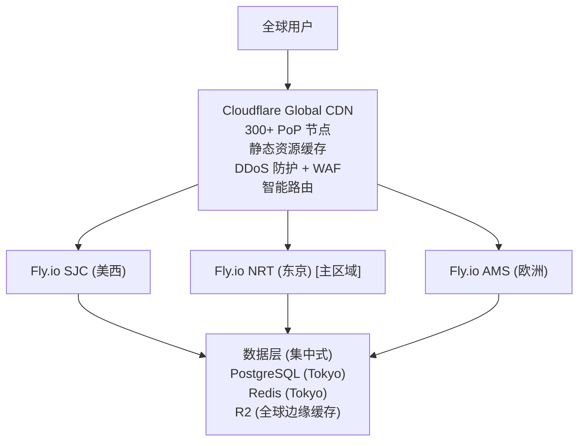
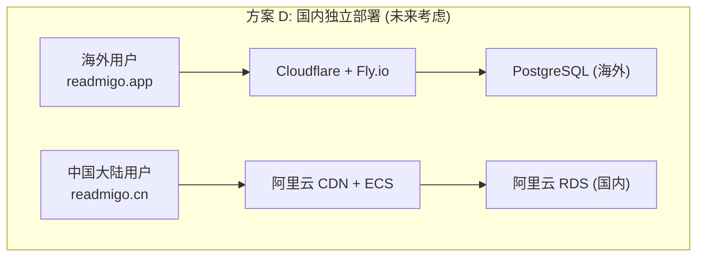
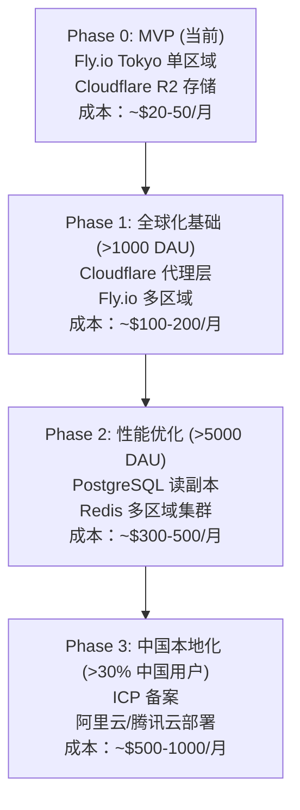
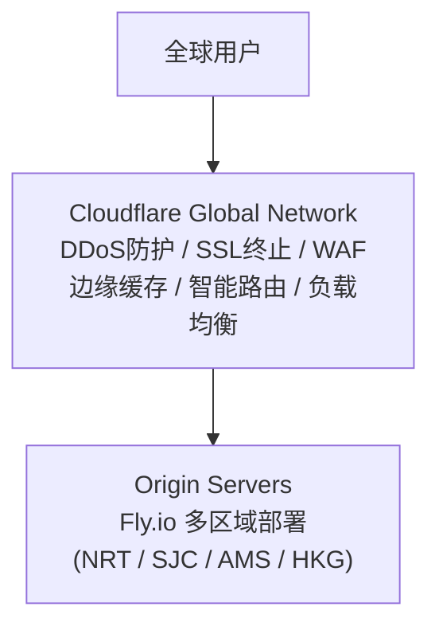

# 全球性能优化

> 全球多区域部署策略与性能优化规划 (规划文档)

---

## 1. 当前部署现状

| 项目 | 值 |
|------|-----|
| 平台 | Fly.io |
| 区域 | Tokyo (NRT) |
| 实例 | shared-cpu-2x, 2GB RAM |
| 数据库 | Neon PostgreSQL |
| 缓存 | Upstash Redis |
| 存储 | Cloudflare R2 |

### 用户延迟估算

| 地区 | 延迟 (RTT) | 体验评级 |
|------|-----------|----------|
| 日本/韩国/台湾 | < 50ms | 优秀 |
| 东南亚 | 50-100ms | 良好 |
| 中国大陆 | 100-200ms | 可用 (可能不稳定) |
| 美国西海岸 | 100-120ms | 良好 |
| 美国东海岸 | 150-180ms | 可接受 |
| 欧洲 | 200-280ms | 较慢 |

---

## 2. 全球多区域部署方案

### Phase 1: Cloudflare + Fly.io 多区域

### 优化后延迟

| 地区 | 优化后延迟 | 改善 |
|------|-----------|------|
| 日本/韩国/台湾 | < 50ms | 不变 |
| 东南亚 | 50-80ms | 提升 20% |
| 中国大陆 | 80-150ms | 提升 25% + 更稳定 |
| 美国 | < 50ms | 提升 60-70% |
| 欧洲 | < 50ms | 提升 80% |

---

## 3. 中国大陆用户支持策略

---

## 4. 渐进式部署路线图

---

## 5. 全球网络架构

---

## 6. CDN 缓存策略

| 资源类型 | 缓存时间 | 更新策略 |
|----------|----------|----------|
| EPUB 文件 | 7 天 | 版本化 URL |
| 封面图片 | 30 天 | 版本化 URL |
| 字体文件 | 1 年 | 永久缓存 |
| 静态 JS/CSS | 1 年 | Hash 命名 |
| 书籍元数据 | 1 小时 | stale-while-revalidate |
| 用户数据 | 不缓存 | 实时 |
| AI 响应 | 7 天 | Redis Hash Key |

---

## 7. 离线支持与同步策略

| 功能 | 说明 |
|------|------|
| EPUB 下载 | 支持离线阅读 |
| 封面缓存 | 本地缓存已下载封面 |
| 预加载 AI 数据 | 前 100 高频词解释 + 章节摘要 |
| 断点续传 | HTTP Range 请求 |

---

## 8. 网络状态适配

| 网络质量 | 图片质量 | 预加载 | AI | 同步 |
|----------|---------|--------|-----|------|
| WiFi/5G | 100% | 开启 | 开启 | 开启 |
| 4G | 80% | 开启 | 开启 | 开启 |
| 3G | 60% | 关闭 | 开启 | 关闭 |
| 2G/弱信号 | 40% | 关闭 | 关闭 | 关闭 |
| 离线 | 0% (缓存) | 关闭 | 关闭 | 关闭 |

---

## 相关文档

| 文档 | 说明 |
|------|------|
| [100k-dau-performance-plan.md](./100k-dau-performance-plan.md) | 10万 DAU 性能方案 |
| [monitoring.md](./monitoring.md) | 监控总览 |

---

*最后更新: 2026-02-07*
