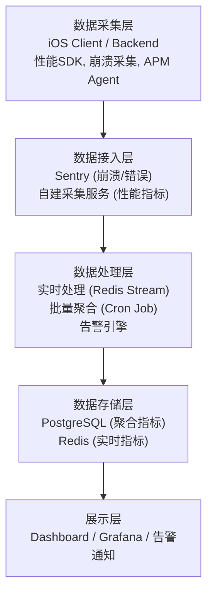
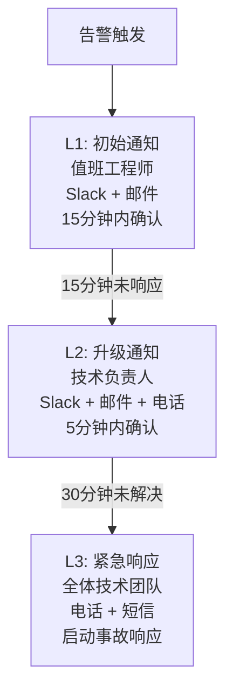

# 运维数据监控系统设计

> 性能监控与异常监控系统规划文档

---

## 1. 设计目标

| 目标 | 描述 |
|------|------|
| 性能可视化 | 实时展示系统各层性能指标 |
| 问题快速定位 | 异常监控和链路追踪 |
| 容量规划 | 流量数据驱动扩容决策 |
| 优化指导 | 性能瓶颈分析 |

---

## 2. 监控指标体系

| 类别 | 核心指标 |
|------|----------|
| 客户端性能 | 页面加载时间、首屏渲染、交互响应、帧率 |
| API 性能 | 响应时间、吞吐量、错误率、并发数 |
| 服务器性能 | CPU、内存、磁盘 IO、网络带宽 |
| 数据库性能 | 查询耗时、连接池状态、慢查询、锁等待 |
| 异常监控 | 崩溃率、错误日志、ANR 率、异常堆栈 |
| 流量分析 | QPS、带宽消耗、CDN 流量、峰值 |
| 缓存性能 | 命中率、内存占用、Key 数量、淘汰率 |
| AI 服务性能 | 调用延迟、Token 消耗、成功率、降级次数 |

---

## 3. 系统架构

---

## 4. 数据模型

### 4.1 API 性能指标表 (ApiPerformanceMetrics)

| 字段 | 类型 | 描述 |
|------|------|------|
| endpoint | String | API 端点 |
| method | String | HTTP 方法 |
| statusCode | Int | 状态码 |
| responseTime | Int | 响应时间 (ms) |
| clientPlatform | Enum | 客户端类型 |
| region | String | 地区 |
| traceId | String | 链路追踪 ID |

### 4.2 API 性能聚合表 (ApiPerformanceDaily)

| 字段 | 类型 | 描述 |
|------|------|------|
| date | Date | 统计日期 |
| endpoint | String | API 端点 |
| totalRequests | Int | 总请求数 |
| avgResponseTime | Int | 平均响应时间 (ms) |
| p50/p90/p95/p99 | Int | 分位数响应时间 |
| error4xxCount / error5xxCount | Int | 错误数 |

### 4.3 异常事件表 (ExceptionEvent)

| 字段 | 类型 | 描述 |
|------|------|------|
| eventType | Enum | CRASH, ERROR, ANR, OOM, NETWORK_ERROR |
| severity | Enum | CRITICAL, ERROR, WARNING, INFO |
| message | String | 错误消息 |
| stackTrace | Text | 堆栈信息 |
| platform | Enum | 客户端类型 |
| fingerprint | String | 错误指纹 (聚合用) |

---

## 5. 告警规则

### API 性能告警

| 指标 | 警告阈值 | 严重阈值 | 持续时间 |
|------|----------|----------|----------|
| API P99 延迟 | > 500ms | > 2s | 5 分钟 |
| API 错误率 | > 1% | > 5% | 3 分钟 |
| API 5xx 错误率 | > 0.5% | > 2% | 1 分钟 |

### 客户端性能告警

| 指标 | 警告阈值 | 严重阈值 | 持续时间 |
|------|----------|----------|----------|
| 崩溃率 | > 0.1% | > 0.5% | 1 小时 |
| 崩溃率突增 | 环比 +100% | 环比 +300% | 30 分钟 |
| 页面加载 P90 | > 3s | > 5s | 30 分钟 |

### 服务器性能告警

| 指标 | 警告阈值 | 严重阈值 | 持续时间 |
|------|----------|----------|----------|
| CPU 使用率 | > 70% | > 90% | 5 分钟 |
| 内存使用率 | > 80% | > 95% | 5 分钟 |
| 磁盘使用率 | > 80% | > 90% | 10 分钟 |

### 数据库性能告警

| 指标 | 警告阈值 | 严重阈值 | 持续时间 |
|------|----------|----------|----------|
| 连接使用率 | > 70% | > 90% | 3 分钟 |
| 慢查询数/分钟 | > 10 | > 50 | 5 分钟 |
| 死锁次数 | > 0 | > 3 | 10 分钟 |

### AI 服务告警

| 指标 | 警告阈值 | 严重阈值 | 持续时间 |
|------|----------|----------|----------|
| 调用延迟 P99 | > 3s | > 10s | 5 分钟 |
| 调用失败率 | > 1% | > 5% | 3 分钟 |
| 日成本 | > $300 | > $500 | 即时 |

---

## 6. 告警升级策略

---

## 7. 性能优化建议

| 问题类型 | 表现 | 解决方案 |
|----------|------|----------|
| 页面加载慢 | LCP > 3s | 资源压缩、懒加载、CDN 优化 |
| 帧率低 | FPS < 45 | 优化渲染、减少布局抖动 |
| API 响应慢 | P99 > 1s | 索引优化、缓存、异步化 |
| 内存占用高 | > 80% | 对象复用、缓存策略 |
| 崩溃率高 | > 0.1% | 代码审查、异常处理 |

---

## 8. 实施计划

| 阶段 | 内容 | 状态 |
|------|------|------|
| Phase 1 | Sentry (崩溃/错误) + API 响应时间埋点 + 基础告警 | 已实现 |
| Phase 2 | 服务器性能采集 + 数据库监控 + 缓存监控 | 规划中 |
| Phase 3 | Dashboard 开发 + 各维度详情页面 + 告警管理 | 规划中 |
| Phase 4 | 链路追踪 + 智能告警 + 自动扩缩容 | 规划中 |

---

## 9. 附录

### 事件类型枚举

| 值 | 描述 |
|----|------|
| CRASH | 应用崩溃 |
| ERROR | 运行时错误 |
| ANR | 应用无响应 |
| OOM | 内存溢出 |
| NETWORK_ERROR | 网络错误 |

### 告警级别

| 级别 | 描述 | 响应时间 |
|------|------|----------|
| CRITICAL | 系统不可用 | 立即 |
| ERROR | 功能受损 | 15 分钟 |
| WARNING | 需关注 | 1 小时 |
| INFO | 仅记录 | 无 |

---

## 10. 相关文档

| 文档 | 说明 |
|------|------|
| [api-performance-collection.md](./api-performance-collection.md) | API 性能数据采集原理 |
| [monitoring.md](./monitoring.md) | 监控系统概述 |

---

*最后更新: 2026-02-07*
