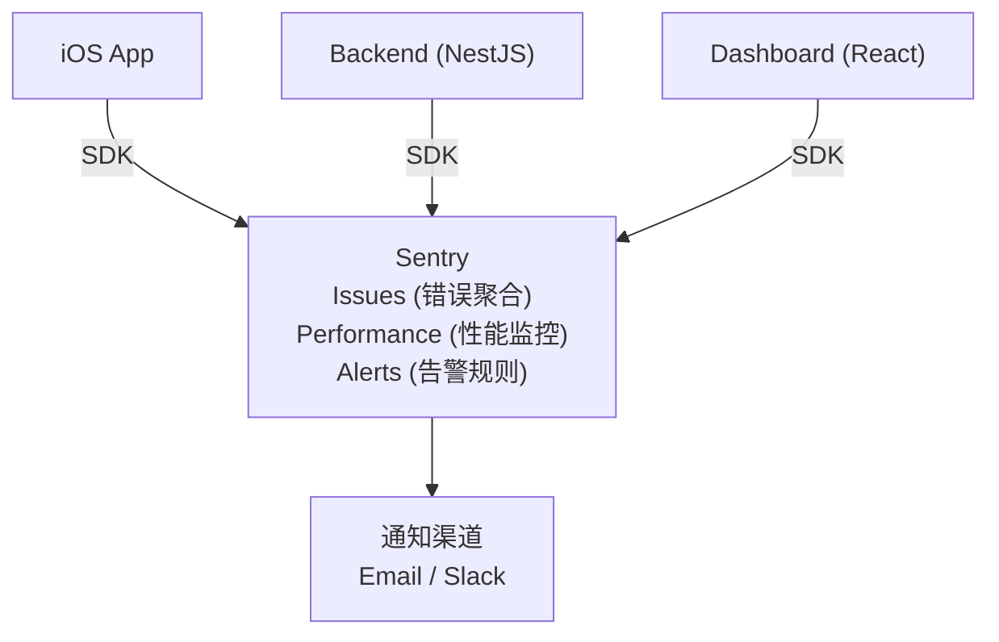
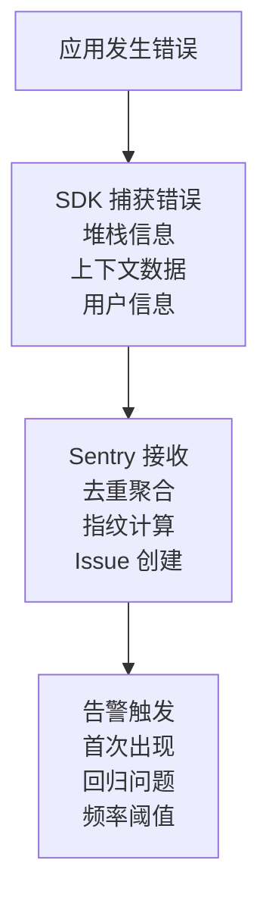
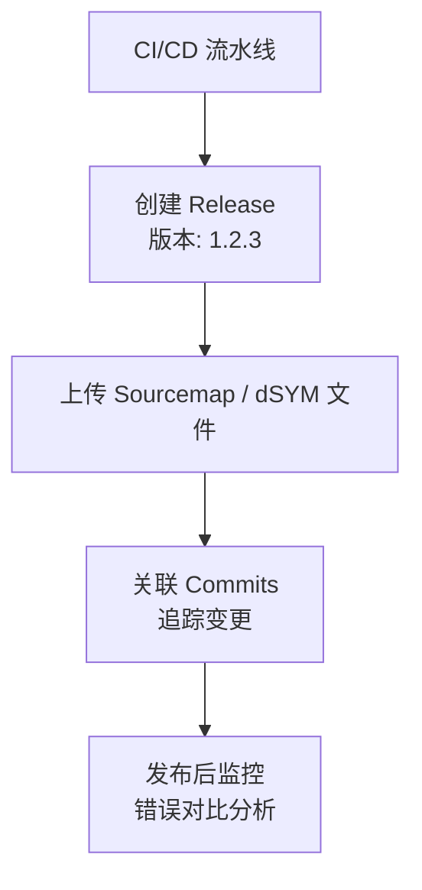

# Sentry 监控服务

> 错误追踪与性能监控 - Readmigo 可观测性平台

---

## 1. 服务概览

```
┌─────────────────────────────────────────────────────────────────┐
│                    Sentry Platform                               │
├─────────────────────────────────────────────────────────────────┤
│                                                                  │
│  服务类型      错误追踪 & 性能监控平台                          │
│  官网          https://sentry.io                                │
│  定价模式      免费套餐 + 按事件量计费                          │
│                                                                  │
│  核心功能                                                        │
│  ├── 错误追踪 - 实时错误捕获与聚合                              │
│  ├── 性能监控 - 事务追踪与分析                                  │
│  ├── Release 跟踪 - 版本发布监控                                │
│  ├── 源码映射 - Source Map 上传                                 │
│  └── 告警系统 - 条件触发通知                                    │
│                                                                  │
│  Readmigo 使用                                                  │
│  ├── iOS App 崩溃追踪                                           │
│  ├── Backend API 错误监控                                       │
│  ├── Web Dashboard 错误收集                                     │
│  └── 用户关联追踪 (accountId)                                   │
│                                                                  │
└─────────────────────────────────────────────────────────────────┘
```

---

## 2. 架构设计



---

## 3. 项目配置

### 3.1 Sentry 项目

| 项目 | 平台 | 环境 | DSN |
|------|------|------|-----|
| readmigo-ios | iOS/Swift | production/staging/debug | ios-dsn |
| readmigo-backend | Node.js | production/staging/debug | backend-dsn |
| readmigo-dashboard | React | production/staging | dashboard-dsn |

### 3.2 环境配置

```
┌─────────────────────────────────────────────────────────────────┐
│                    多环境 Sentry 配置                            │
├─────────────────────────────────────────────────────────────────┤
│                                                                  │
│  Local (开发环境)                                               │
│  ├── SENTRY_ENABLED: false                                      │
│  └── 不上报错误到 Sentry                                        │
│                                                                  │
│  Debug (调试环境)                                               │
│  ├── SENTRY_ENABLED: true                                       │
│  ├── SENTRY_ENVIRONMENT: debugging                              │
│  ├── SENTRY_TRACES_SAMPLE_RATE: 1.0                            │
│  └── 完整采样，调试用                                           │
│                                                                  │
│  Staging (预发布)                                               │
│  ├── SENTRY_ENABLED: true                                       │
│  ├── SENTRY_ENVIRONMENT: staging                                │
│  ├── SENTRY_TRACES_SAMPLE_RATE: 0.5                            │
│  └── 50% 采样                                                   │
│                                                                  │
│  Production (生产)                                              │
│  ├── SENTRY_ENABLED: true                                       │
│  ├── SENTRY_ENVIRONMENT: production                             │
│  ├── SENTRY_TRACES_SAMPLE_RATE: 0.1                            │
│  └── 10% 采样，降低成本                                         │
│                                                                  │
└─────────────────────────────────────────────────────────────────┘
```

---

## 4. 功能详解

### 4.1 错误追踪



### 4.2 用户关联

| 上下文 | 字段 | 说明 |
|--------|------|------|
| User ID | accountId | 用户唯一标识 |
| Email | (可选) | 用户邮箱 |
| Username | displayName | 显示名称 |
| Platform | iOS/Android/Web | 客户端平台 |
| App Version | x.y.z | 应用版本 |

### 4.3 性能监控

```
┌─────────────────────────────────────────────────────────────────┐
│                    性能监控指标                                  │
├─────────────────────────────────────────────────────────────────┤
│                                                                  │
│  事务追踪 (Transactions)                                        │
│  ├── API 请求响应时间                                           │
│  ├── 数据库查询延迟                                             │
│  ├── 外部服务调用 (AI/R2)                                       │
│  └── 队列任务处理时长                                           │
│                                                                  │
│  Span 分析                                                      │
│  ├── HTTP 请求                                                  │
│  ├── 数据库操作                                                 │
│  ├── 缓存命中/未命中                                            │
│  └── AI 服务调用                                                │
│                                                                  │
│  关键指标                                                       │
│  ├── Apdex Score - 用户满意度                                   │
│  ├── P50/P75/P95/P99 - 延迟分布                                │
│  ├── Throughput - 吞吐量                                        │
│  └── Error Rate - 错误率                                        │
│                                                                  │
└─────────────────────────────────────────────────────────────────┘
```

---

## 5. 集成配置

### 5.1 Backend (NestJS) 集成

```
┌─────────────────────────────────────────────────────────────────┐
│                    NestJS Sentry 集成                            │
├─────────────────────────────────────────────────────────────────┤
│                                                                  │
│  初始化配置                                                     │
│  ────────────────────────────────────────────────────           │
│  Sentry.init({                                                  │
│    dsn: process.env.SENTRY_DSN,                                 │
│    environment: process.env.SENTRY_ENVIRONMENT,                 │
│    tracesSampleRate: 0.1,                                       │
│    profilesSampleRate: 0.1,                                     │
│    integrations: [                                              │
│      new ProfilingIntegration(),                                │
│      new Sentry.Integrations.Prisma({ client: prisma })         │
│    ]                                                            │
│  });                                                            │
│                                                                  │
│  用户上下文设置                                                 │
│  ────────────────────────────────────────────────────           │
│  Sentry.setUser({                                               │
│    id: accountId,                                               │
│    email: user.email,                                           │
│    username: user.displayName                                   │
│  });                                                            │
│                                                                  │
│  手动捕获异常                                                   │
│  ────────────────────────────────────────────────────           │
│  Sentry.captureException(error, {                               │
│    tags: { module: 'ai-service' },                              │
│    extra: { bookId, chapterId }                                 │
│  });                                                            │
│                                                                  │
└─────────────────────────────────────────────────────────────────┘
```

### 5.2 iOS 集成

```
┌─────────────────────────────────────────────────────────────────┐
│                    iOS Sentry 集成                               │
├─────────────────────────────────────────────────────────────────┤
│                                                                  │
│  初始化 (AppDelegate)                                           │
│  ────────────────────────────────────────────────────           │
│  SentrySDK.start { options in                                   │
│    options.dsn = "YOUR_SENTRY_DSN"                              │
│    options.environment = environment                            │
│    options.tracesSampleRate = 0.1                               │
│    options.enableAutoPerformanceTracing = true                  │
│    options.attachScreenshot = true                              │
│  }                                                              │
│                                                                  │
│  用户关联                                                       │
│  ────────────────────────────────────────────────────           │
│  SentrySDK.configureScope { scope in                            │
│    scope.setUser(User(userId: accountId))                       │
│  }                                                              │
│                                                                  │
│  面包屑追踪                                                     │
│  ────────────────────────────────────────────────────           │
│  SentrySDK.addBreadcrumb(Breadcrumb(                           │
│    level: .info,                                                │
│    category: "navigation",                                      │
│    message: "Opened book: \(bookId)"                           │
│  ))                                                             │
│                                                                  │
└─────────────────────────────────────────────────────────────────┘
```

---

## 6. 告警规则

### 6.1 告警配置

```
┌─────────────────────────────────────────────────────────────────┐
│                    告警规则设置                                  │
├─────────────────────────────────────────────────────────────────┤
│                                                                  │
│  Critical (立即通知)                                            │
│  ├── 新 Issue 首次出现                                          │
│  ├── 回归问题 (已修复问题再次出现)                              │
│  ├── 错误频率 > 100/小时                                        │
│  └── P99 延迟 > 5秒                                             │
│                                                                  │
│  Warning (汇总通知)                                             │
│  ├── 错误频率 > 50/小时                                         │
│  ├── P95 延迟 > 3秒                                             │
│  └── 特定模块错误激增                                           │
│                                                                  │
│  Info (日报汇总)                                                │
│  ├── 新用户相关错误                                             │
│  └── 低频错误追踪                                               │
│                                                                  │
└─────────────────────────────────────────────────────────────────┘
```

### 6.2 通知渠道

| 渠道 | 用途 | 触发条件 |
|------|------|----------|
| Email | 所有告警 | 默认通知 |
| Slack | 团队通知 | Critical/Warning |
| PagerDuty | 紧急响应 | Critical |

---

## 7. 数据过滤

### 7.1 敏感数据处理

```
┌─────────────────────────────────────────────────────────────────┐
│                    数据脱敏规则                                  │
├─────────────────────────────────────────────────────────────────┤
│                                                                  │
│  自动过滤字段                                                   │
│  ├── password / passwd                                          │
│  ├── secret / token                                             │
│  ├── api_key / apiKey                                           │
│  ├── authorization                                              │
│  └── credit_card / creditCard                                   │
│                                                                  │
│  自定义过滤                                                     │
│  ├── user.email → [Filtered]                                    │
│  ├── headers.cookie → [Filtered]                                │
│  └── request.body.password → [Filtered]                         │
│                                                                  │
│  IP 地址处理                                                    │
│  └── 仅保留前 3 段 (xxx.xxx.xxx.0)                             │
│                                                                  │
└─────────────────────────────────────────────────────────────────┘
```

### 7.2 忽略规则

| 错误类型 | 处理方式 | 说明 |
|----------|----------|------|
| Network Timeout | 降级采样 | 网络波动导致 |
| 404 Not Found | 忽略 | 用户输入错误 URL |
| 401 Unauthorized | 降级采样 | 正常认证失败 |
| Rate Limited | 忽略 | 预期行为 |

---

## 8. Release 管理

### 8.1 版本追踪



### 8.2 Source Map 配置

| 平台 | 文件类型 | 上传时机 |
|------|----------|----------|
| iOS | dSYM | App Store Connect 上传后 |
| Backend | JS Source Map | 部署时 |
| Dashboard | JS Source Map | 构建时 |

---

## 9. 监控指标

### 9.1 Sentry 面板指标

```
┌─────────────────────────────────────────────────────────────────┐
│                    关键监控指标                                  │
├─────────────────────────────────────────────────────────────────┤
│                                                                  │
│  Issues 指标                                                    │
│  ├── Unresolved Issues - 未解决问题数                           │
│  ├── New Issues - 新增问题数                                    │
│  ├── Regressed Issues - 回归问题数                              │
│  └── Events Volume - 事件总量                                   │
│                                                                  │
│  Performance 指标                                               │
│  ├── Apdex - 用户满意度评分                                     │
│  ├── Failure Rate - 失败率                                      │
│  ├── TPM - 每分钟事务数                                         │
│  └── Duration - 延迟分布                                        │
│                                                                  │
│  用量指标                                                       │
│  ├── Events Used - 事件使用量                                   │
│  ├── Transactions Used - 事务使用量                             │
│  └── Attachments Size - 附件大小                                │
│                                                                  │
└─────────────────────────────────────────────────────────────────┘
```

---

## 10. 成本估算

### 10.1 定价模型

```
┌─────────────────────────────────────────────────────────────────┐
│                    Sentry 定价结构                               │
├─────────────────────────────────────────────────────────────────┤
│                                                                  │
│  Free 套餐                                                      │
│  ├── 5K 错误事件/月                                             │
│  ├── 10K 性能事务/月                                            │
│  ├── 1GB 附件存储                                               │
│  └── 单项目                                                     │
│                                                                  │
│  Team 套餐 ($26/月)                                             │
│  ├── 50K 错误事件/月                                            │
│  ├── 100K 性能事务/月                                           │
│  ├── 无限项目                                                   │
│  └── 高级告警规则                                               │
│                                                                  │
│  Business 套餐 ($80/月)                                         │
│  ├── 200K 错误事件/月                                           │
│  ├── 500K 性能事务/月                                           │
│  ├── SSO 集成                                                   │
│  └── 优先支持                                                   │
│                                                                  │
└─────────────────────────────────────────────────────────────────┘
```

### 10.2 Readmigo 月度成本

| 规模 | 错误事件 | 性能事务 | 套餐 | 费用/月 |
|------|----------|----------|------|---------|
| 当前 (MVP) | ~2K | ~5K | Free | $0 |
| 1K DAU | ~5K | ~20K | Free | $0 |
| 10K DAU | ~30K | ~100K | Team | ~$26 |
| 100K DAU | ~150K | ~500K | Business | ~$80 |

---

## 11. 故障排查

### 11.1 常见问题

| 问题 | 可能原因 | 解决方案 |
|------|----------|----------|
| 错误未上报 | DSN 配置错误 | 检查环境变量 |
| 堆栈不可读 | Source Map 缺失 | 上传 Source Map |
| 采样不生效 | 采样率配置错误 | 检查 tracesSampleRate |
| 用户未关联 | setUser 未调用 | 登录后设置用户上下文 |

### 11.2 调试命令

```
┌─────────────────────────────────────────────────────────────────┐
│                    调试方法                                      │
├─────────────────────────────────────────────────────────────────┤
│                                                                  │
│  验证 SDK 初始化                                                │
│  Sentry.captureMessage('Test message')                          │
│                                                                  │
│  检查事件发送                                                   │
│  Sentry.getCurrentHub().getClient()?.getTransport()             │
│                                                                  │
│  CLI 工具                                                       │
│  sentry-cli releases list                                       │
│  sentry-cli releases files <release> list                       │
│                                                                  │
│  Source Map 验证                                                │
│  sentry-cli sourcemaps explain <event-id>                       │
│                                                                  │
└─────────────────────────────────────────────────────────────────┘
```

---

## 12. 最佳实践

### 12.1 错误处理原则

| 原则 | 说明 |
|------|------|
| 有意义的错误消息 | 包含上下文信息 |
| 合理的采样率 | 生产环境 10% 避免成本过高 |
| 及时设置用户上下文 | 登录后立即关联 |
| 定期清理 Issue | 关闭已解决的问题 |

### 12.2 性能监控建议

| 建议 | 说明 |
|------|------|
| 关键路径追踪 | 重点监控核心业务流程 |
| 设置性能基线 | 定义 P95 延迟目标 |
| 慢查询告警 | 数据库查询 > 1s 告警 |
| 外部调用监控 | AI 服务响应时间追踪 |

---

## 13. 相关文档

| 文档 | 说明 |
|------|------|
| [monitoring.md](./monitoring.md) | 监控总览 |
| [logging.md](./logging.md) | 日志与崩溃收集 |
| [fly-io.md](../deployment/services/fly-io.md) | Fly.io 部署服务 |
| [environments.md](../deployment/environments.md) | 环境总览 |

---

*最后更新: 2025-12-31*
