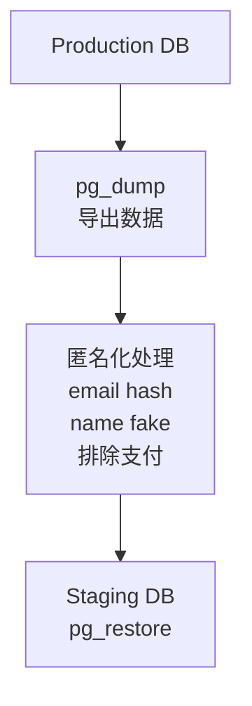
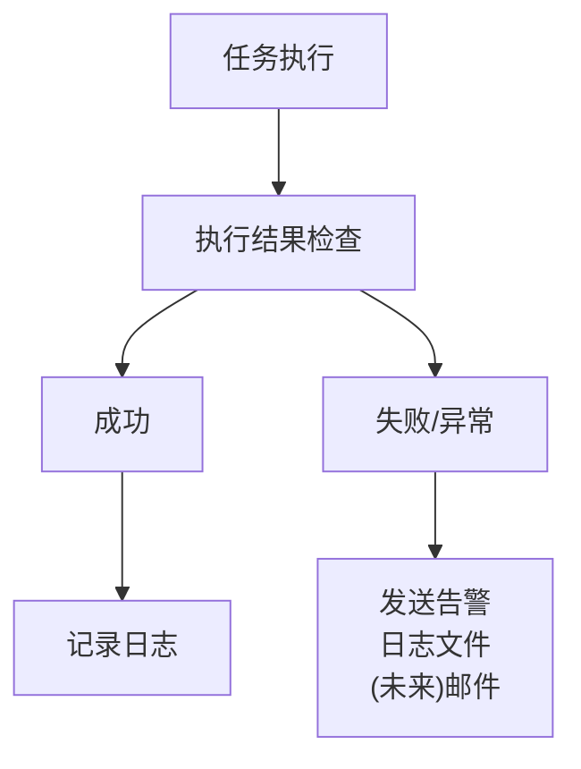

# Droplet 长时间任务规划

> Digital Ocean Droplet 耗时任务迁移与扩展规划

---

## 1. 背景与目标

```
┌─────────────────────────────────────────────────────────────────┐
│                    任务迁移背景                                  │
├─────────────────────────────────────────────────────────────────┤
│                                                                  │
│  现状问题                                                        │
│  ├── 许多耗时任务需要在本地电脑运行                             │
│  ├── 本地运行无法持续，需要人工监控                             │
│  ├── 任务中断后需要手动恢复                                     │
│  └── 不同环境执行困难，缺乏统一入口                             │
│                                                                  │
│  目标                                                            │
│  ├── 将所有长时间任务迁移到远程 Droplet                         │
│  ├── 实现任务自动化与定时执行                                   │
│  ├── 提供统一的任务监控和日志管理                               │
│  └── 提升后端系统完整度                                         │
│                                                                  │
└─────────────────────────────────────────────────────────────────┘
```

---

## 2. 任务分类

### 2.1 任务类型划分

```
┌─────────────────────────────────────────────────────────────────┐
│                    任务分类矩阵                                  │
├─────────────────────────────────────────────────────────────────┤
│                                                                  │
│                     耗时短 (< 5分钟)       耗时长 (> 5分钟)      │
│                    ─────────────────     ─────────────────      │
│  CPU 密集型        Fly.io Workers        Droplet                │
│                    (BullMQ 队列)          (专用执行)             │
│                                                                  │
│  I/O 密集型        Fly.io Workers        Droplet                │
│  (网络/存储)        (BullMQ 队列)          (专用执行)             │
│                                                                  │
│  定时任务          GitHub Actions        Droplet                │
│  (周期执行)         (< 6小时)              (无时间限制)           │
│                                                                  │
└─────────────────────────────────────────────────────────────────┘
```

### 2.2 执行环境选择标准

| 特征 | Fly.io Workers | Droplet | GitHub Actions |
|------|----------------|---------|----------------|
| 执行时长 | < 10分钟 | 无限制 | < 6小时 |
| 内存需求 | < 512MB | < 8GB | < 7GB |
| 需要实时响应 | 是 | 否 | 否 |
| 并发需求 | 高 | 中-高 | 低 |
| 网络密集型 | 一般 | 高 | 一般 |
| 成本敏感度 | 低 | 中 | 免费 |

---

## 3. 待迁移任务清单

### 3.1 优先级 P0 - 立即迁移

```
┌─────────────────────────────────────────────────────────────────┐
│                    P0 立即迁移任务                               │
├─────────────────────────────────────────────────────────────────┤
│                                                                  │
│  1. Standard Ebooks 完整导入                                    │
│     ├── 当前状态: 已在 Droplet 运行                             │
│     ├── 执行时长: 30-60 分钟                                    │
│     ├── 执行频率: 每周日 00:00 UTC                              │
│     └── 环境: Debug (已配置), Staging/Prod (待配置)             │
│                                                                  │
│  2. Gutenberg 书籍导入                                          │
│     ├── 当前状态: 未配置                                        │
│     ├── 预计时长: 2-4 小时 (60000+ 书籍)                        │
│     ├── 执行频率: 每月 1 次                                     │
│     └── 优先级: 高 (丰富书籍库)                                 │
│                                                                  │
│  3. LibriVox 有声书导入                                         │
│     ├── 当前状态: 未配置                                        │
│     ├── 预计时长: 1-2 小时                                      │
│     ├── 执行频率: 每月 1 次                                     │
│     └── 优先级: 高 (有声书内容)                                 │
│                                                                  │
└─────────────────────────────────────────────────────────────────┘
```

### 3.2 优先级 P1 - 短期迁移 (1个月内)

| 任务 | 描述 | 预计时长 | 频率 | 当前位置 |
|------|------|----------|------|----------|
| 作者数据批量生成 | AI 生成作者简介、时间线 | 30-60分钟 | 按需 | 未实现 |
| 书籍难度重评估 | 全量 CEFR 难度计算 | 1-2小时 | 每月 | 未实现 |
| 封面图片优化 | 批量压缩、缩略图生成 | 30分钟 | 按需 | 本地 |
| 词汇预计算 | 书籍词汇统计批量生成 | 1-2小时 | 每月 | 未实现 |

### 3.3 优先级 P2 - 中期规划 (3个月内)

| 任务 | 描述 | 预计时长 | 频率 | 依赖 |
|------|------|----------|------|------|
| 人物关系图生成 | AI 分析书籍角色关系 | 2-4小时 | 按需 | AI 服务 |
| 故事时间线生成 | AI 提取故事事件 | 2-4小时 | 按需 | AI 服务 |
| 推荐算法预计算 | 相似书籍向量计算 | 1-2小时 | 每周 | 用户数据 |
| 数据库定时同步 | Prod → Staging 匿名化同步 | 1小时 | 每周 | 脚本 |

### 3.4 优先级 P3 - 长期规划 (6个月+)

| 任务 | 描述 | 预计时长 | 频率 |
|------|------|----------|------|
| 年度报告数据生成 | 汇总用户阅读数据 | 2-4小时 | 每年1月 |
| 数据备份归档 | 导出历史数据到冷存储 | 1-2小时 | 每月 |
| 性能测试 | 模拟高并发场景 | 30分钟 | 按需 |
| 搜索索引重建 | 全量搜索索引更新 | 1小时 | 按需 |

---

## 4. 任务详细规划

### 4.1 Gutenberg 书籍导入


**任务说明:**

| 项目 | 详情 |
|------|------|
| 来源 | Project Gutenberg (gutenberg.org) |
| 书籍数量 | 60,000+ 公版书籍 |
| 格式 | EPUB, HTML |
| 价值 | 大幅扩充书籍库 |
| 执行时长 | 1-2 小时 (首次全量，4核并行加速) |
| 内存 | 2-3 GB (8GB 配置下充裕) |
| 网络 | 大量下载流量 (5TB 带宽充足) |
| 存储 | 临时存储约 10GB |
| Cron 配置 | `0 3 1 * *` (每月1日 03:00 UTC) |

### 4.2 作者数据批量生成


**任务说明:**

| 项目 | 详情 |
|------|------|
| 目标 | 为所有作者生成 AI 增强数据 |
| 内容 | 简介、时间线、代表作、影响力 |
| 触发 | 新书导入后 或 定期更新 |

**数据生成内容:**

| 模型 | 说明 |
|------|------|
| AuthorTimelineEvent | 作者生平时间线 |
| AuthorQuote | 作者名言 |
| AuthorInfluence | 作者影响力分析 |
| AuthorDomainContribution | 领域贡献 |
| AuthorHistoricalContext | 历史背景 |

**资源需求:**

| 项目 | 详情 |
|------|------|
| 执行时长 | 30-60 分钟 (100 作者) |
| AI 成本 | ~$0.50 / 100 作者 |
| 限制 | 请求间隔 2 秒避免限流 |

### 4.3 数据库同步任务



**任务说明:**

| 项目 | 详情 |
|------|------|
| 目标 | Production → Staging 数据同步 |
| 处理 | 用户数据匿名化 |
| 频率 | 每周日 04:00 UTC |

**注意事项:**

| 规则 | 说明 |
|------|------|
| 敏感表排除 | 排除 Subscription, Order 等敏感表 |
| PII 匿名化 | 用户 PII 数据必须匿名化 |
| 通知 | 同步前通知相关人员 |

---

## 5. 脚本与配置

### 5.1 目录结构规划

```
/home/readmigo/
├── projects/
│   └── readmigo/                    # 主项目代码
│       └── scripts/
│           └── book-ingestion/      # 导入脚本
│
└── scripts/
    ├── jobs/                        # 定时任务脚本
    │   ├── import-standard-ebooks.sh
    │   ├── import-gutenberg.sh      # 待创建
    │   ├── import-librivox.sh       # 待创建
    │   ├── enrich-authors.sh        # 待创建
    │   ├── sync-database.sh         # 待创建
    │   └── recompute-difficulty.sh  # 待创建
    │
    ├── utils/                       # 工具脚本
    │   ├── check-imports.sh
    │   ├── cleanup-logs.sh
    │   └── health-check.sh
    │
    └── config/                      # 配置文件
        ├── .env.debug
        ├── .env.staging
        └── .env.production
```

### 5.2 Cron 任务规划

```
┌─────────────────────────────────────────────────────────────────┐
│                    Cron 任务时间表                               │
├─────────────────────────────────────────────────────────────────┤
│                                                                  │
│  # 书籍导入任务                                                 │
│  0 0 * * 0  import-standard-ebooks.sh     # 周日 00:00          │
│  0 3 1 * *  import-gutenberg.sh           # 每月1日 03:00       │
│  0 5 15 * * import-librivox.sh            # 每月15日 05:00      │
│                                                                  │
│  # 数据增强任务                                                 │
│  0 2 * * 1  enrich-authors.sh             # 周一 02:00          │
│  0 3 * * 2  recompute-difficulty.sh       # 周二 03:00          │
│                                                                  │
│  # 数据同步任务                                                 │
│  0 4 * * 0  sync-database.sh              # 周日 04:00          │
│                                                                  │
│  # 系统维护任务                                                 │
│  0 6 * * *  cleanup-logs.sh               # 每天 06:00          │
│  */30 * * * * health-check.sh             # 每 30 分钟          │
│                                                                  │
│  时区说明: 所有时间为 UTC                                       │
│  北京时间 = UTC + 8 小时                                        │
│                                                                  │
└─────────────────────────────────────────────────────────────────┘
```

### 5.3 环境变量配置

| 变量 | 用途 | 各环境差异 |
|------|------|-----------|
| DATABASE_URL | Neon 数据库连接 | 各环境独立数据库 |
| R2_BUCKET_NAME | R2 存储桶 | readmigo / readmigo-staging / readmigo-debug |
| AI_API_KEY | DeepSeek API | 统一使用 |
| SENTRY_DSN | 错误监控 | 各环境独立项目 |
| ENVIRONMENT | 环境标识 | debug / staging / production |

---

## 6. 监控与告警

### 6.1 日志管理

```
┌─────────────────────────────────────────────────────────────────┐
│                    日志结构                                      │
├─────────────────────────────────────────────────────────────────┤
│                                                                  │
│  /var/log/readmigo/                                             │
│  ├── imports/                      # 导入任务日志               │
│  │   ├── standard-ebooks-YYYYMMDD.log                           │
│  │   ├── gutenberg-YYYYMMDD.log                                 │
│  │   └── librivox-YYYYMMDD.log                                  │
│  │                                                               │
│  ├── enrichment/                   # 数据增强日志               │
│  │   ├── authors-YYYYMMDD.log                                   │
│  │   └── difficulty-YYYYMMDD.log                                │
│  │                                                               │
│  ├── sync/                         # 数据同步日志               │
│  │   └── db-sync-YYYYMMDD.log                                   │
│  │                                                               │
│  └── system/                       # 系统日志                   │
│      ├── health-check.log                                       │
│      └── cleanup.log                                            │
│                                                                  │
│  日志保留策略:                                                  │
│  ├── 导入日志: 30 天                                            │
│  ├── 其他日志: 7 天                                             │
│  └── 压缩归档: 超过 7 天自动压缩                                │
│                                                                  │
└─────────────────────────────────────────────────────────────────┘
```

### 6.2 健康检查

| 检查项 | 频率 | 告警阈值 |
|--------|------|----------|
| 磁盘使用率 | 30分钟 | > 80% |
| 内存使用率 | 30分钟 | > 85% |
| 最近任务状态 | 每小时 | 失败次数 > 3 |
| 数据库连接 | 30分钟 | 连接失败 |
| R2 连接 | 30分钟 | 连接失败 |

### 6.3 告警通知



> 注意: DO 封禁 SMTP，暂用日志监控

---

## 7. 资源评估

### 7.1 当前 Droplet 配置

| 项目 | 当前配置 | 评估 |
|------|----------|------|
| CPU | 4 vCPU | 支持多任务并行 |
| 内存 | 8 GB | 充足，可处理大型导入 |
| 存储 | 50 GB SSD | 充足 |
| 带宽 | 5 TB/月 | 充足，支持大量下载 |
| 费用 | $48/月 | 性能优秀 |

### 7.2 资源利用策略

```
┌─────────────────────────────────────────────────────────────────┐
│                    资源利用规划                                  │
├─────────────────────────────────────────────────────────────────┤
│                                                                  │
│  当前配置优势                                                   │
│  ├── 8GB 内存可同时运行 2-3 个大型任务                         │
│  ├── 4 vCPU 支持并行处理，显著提升导入速度                     │
│  ├── 5TB 带宽足够 Gutenberg 60000+ 书籍下载                    │
│  └── 无需担心内存溢出问题                                       │
│                                                                  │
│  并行任务建议                                                   │
│  ├── 最多同时运行 3 个 CPU 密集型任务                          │
│  ├── I/O 密集型任务 (下载) 可适当增加并发                      │
│  └── 建议预留 2GB 内存给系统和监控                             │
│                                                                  │
│  任务内存分配参考                                               │
│  ├── Gutenberg 导入: 2-3 GB                                    │
│  ├── 作者数据生成: 1-2 GB                                      │
│  ├── 难度重评估: 1-2 GB                                        │
│  └── 数据库同步: 1-2 GB                                        │
│                                                                  │
│  未来扩容方向 (如需)                                           │
│  └── 16GB RAM / 8 vCPU ($96/月) - 适合更大规模并行             │
│                                                                  │
└─────────────────────────────────────────────────────────────────┘
```

---

## 8. 实施计划

### 8.1 阶段一: 巩固现有 (本周)

- [x] Standard Ebooks Debug 环境导入
- [ ] 完善日志管理脚本
- [ ] 添加健康检查脚本
- [ ] 文档化现有配置

### 8.2 阶段二: 扩展书源 (2周内)

- [ ] 实现 Gutenberg 导入脚本
- [ ] 配置 Gutenberg Cron 任务
- [ ] 实现 LibriVox 导入脚本
- [ ] 配置 Staging 环境导入

### 8.3 阶段三: 数据增强 (1个月内)

- [ ] 实现作者数据批量生成
- [ ] 实现难度重评估脚本
- [ ] 配置 Production 环境
- [ ] 实现数据库同步脚本

### 8.4 阶段四: 完善监控 (2个月内)

- [ ] 实现完整的健康检查
- [ ] 添加 Sentry 错误上报
- [ ] 考虑扩容评估
- [ ] 文档更新和优化

---

## 9. 相关文档

| 文档 | 说明 |
|------|------|
| [droplet.md](../deployment/services/droplet.md) | Droplet 基础信息 |
| [automation-server-setup.md](../deployment/services/automation-server-setup.md) | 完整配置指南 |
| [book-import-system.md](../../04-development/pipeline/book-import-system.md) | 书籍导入系统 |
| [jobs.md](../../04-development/backend/modules/jobs.md) | BullMQ 任务队列 |

---

*最后更新: 2025-12-31*
