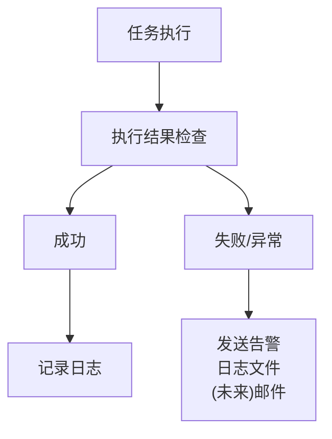

# Droplet 长时间任务规划

> Digital Ocean Droplet 耗时任务迁移与扩展规划

---

## 1. 背景与目标

| 类型 | 说明 |
|------|------|
| 现状问题 | 许多耗时任务需要在本地电脑运行，无法持续、需人工监控、中断后手动恢复 |
| 目标 | 将所有长时间任务迁移到远程 Droplet，实现自动化执行与统一监控 |

---

## 2. 任务分类

### 2.1 执行环境选择标准

| 特征 | Fly.io Workers | Droplet | GitHub Actions |
|------|----------------|---------|----------------|
| 执行时长 | < 10分钟 | 无限制 | < 6小时 |
| 内存需求 | < 512MB | < 8GB | < 7GB |
| 需要实时响应 | 是 | 否 | 否 |
| 并发需求 | 高 | 中-高 | 低 |
| 网络密集型 | 一般 | 高 | 一般 |
| 成本敏感度 | 低 | 中 | 免费 |

---

## 3. 待迁移任务清单

### 3.1 优先级 P0 - 立即迁移

| 任务 | 当前状态 | 执行时长 | 频率 |
|------|----------|----------|------|
| Standard Ebooks 完整导入 | 已在 Droplet 运行 | 30-60 分钟 | 每周日 00:00 UTC |
| Gutenberg 书籍导入 | 未配置 | 2-4 小时 (60000+ 书籍) | 每月 1 次 |
| LibriVox 有声书导入 | 未配置 | 1-2 小时 | 每月 1 次 |

### 3.2 优先级 P1 - 短期迁移 (1个月内)

| 任务 | 描述 | 预计时长 | 频率 | 当前位置 |
|------|------|----------|------|----------|
| 作者数据批量生成 | AI 生成作者简介、时间线 | 30-60分钟 | 按需 | 未实现 |
| 书籍难度重评估 | 全量 CEFR 难度计算 | 1-2小时 | 每月 | 未实现 |
| 封面图片优化 | 批量压缩、缩略图生成 | 30分钟 | 按需 | 本地 |
| 词汇预计算 | 书籍词汇统计批量生成 | 1-2小时 | 每月 | 未实现 |

### 3.3 优先级 P2 - 中期规划 (3个月内)

| 任务 | 描述 | 预计时长 | 频率 | 依赖 |
|------|------|----------|------|------|
| 人物关系图生成 | AI 分析书籍角色关系 | 2-4小时 | 按需 | AI 服务 |
| 故事时间线生成 | AI 提取故事事件 | 2-4小时 | 按需 | AI 服务 |
| 推荐算法预计算 | 相似书籍向量计算 | 1-2小时 | 每周 | 用户数据 |

### 3.4 优先级 P3 - 长期规划 (6个月+)

| 任务 | 描述 | 预计时长 | 频率 |
|------|------|----------|------|
| 年度报告数据生成 | 汇总用户阅读数据 | 2-4小时 | 每年1月 |
| 数据备份归档 | 导出历史数据到冷存储 | 1-2小时 | 每月 |
| 性能测试 | 模拟高并发场景 | 30分钟 | 按需 |
| 搜索索引重建 | 全量搜索索引更新 | 1小时 | 按需 |

---

## 4. 任务详细规划

### 4.1 Gutenberg 书籍导入

| 项目 | 详情 |
|------|------|
| 来源 | Project Gutenberg (gutenberg.org) |
| 书籍数量 | 60,000+ 公版书籍 |
| 格式 | EPUB, HTML |
| 执行时长 | 1-2 小时 (首次全量，4核并行加速) |
| 内存 | 2-3 GB (8GB 配置下充裕) |
| Cron 配置 | `0 3 1 * *` (每月1日 03:00 UTC) |

### 4.2 作者数据批量生成

**数据生成内容:**

| 模型 | 说明 |
|------|------|
| AuthorTimelineEvent | 作者生平时间线 |
| AuthorQuote | 作者名言 |
| AuthorInfluence | 作者影响力分析 |
| AuthorDomainContribution | 领域贡献 |
| AuthorHistoricalContext | 历史背景 |

**资源需求:**

| 项目 | 详情 |
|------|------|
| 执行时长 | 30-60 分钟 (100 作者) |
| AI 成本 | ~$0.50 / 100 作者 |
| 限制 | 请求间隔 2 秒避免限流 |

---

## 5. 环境配置

### 5.1 目录结构

| 路径 | 说明 |
|------|------|
| `/home/readmigo/projects/readmigo/` | 主项目代码 |
| `/home/readmigo/scripts/jobs/` | 定时任务脚本 |
| `/home/readmigo/scripts/utils/` | 工具脚本 |
| `/home/readmigo/scripts/config/.env.production` | Production 环境配置 |

### 5.2 Cron 任务规划

| 时间 (UTC) | 任务 | 说明 |
|------------|------|------|
| 0 0 * * 0 | import-standard-ebooks.sh | 周日 00:00 |
| 0 3 1 * * | import-gutenberg.sh | 每月1日 03:00 |
| 0 5 15 * * | import-librivox.sh | 每月15日 05:00 |
| 0 2 * * 1 | enrich-authors.sh | 周一 02:00 |
| 0 3 * * 2 | recompute-difficulty.sh | 周二 03:00 |
| 0 6 * * * | cleanup-logs.sh | 每天 06:00 |
| */30 * * * * | health-check.sh | 每 30 分钟 |

> 时区: 所有时间为 UTC (北京时间 = UTC + 8 小时)

### 5.3 环境变量配置

| 变量 | 用途 | 说明 |
|------|------|------|
| DATABASE_URL | Neon 数据库连接 | Production 数据库 |
| R2_BUCKET_NAME | R2 存储桶 | readmigo-production |
| AI_API_KEY | DeepSeek API | 统一使用 |
| SENTRY_DSN | 错误监控 | Production 项目 |
| ENVIRONMENT | 环境标识 | production |

---

## 6. 监控与告警

### 6.1 告警流程

> 注意: DO 封禁 SMTP，暂用日志监控

### 6.2 健康检查

| 检查项 | 频率 | 告警阈值 |
|--------|------|----------|
| 磁盘使用率 | 30分钟 | > 80% |
| 内存使用率 | 30分钟 | > 85% |
| 最近任务状态 | 每小时 | 失败次数 > 3 |
| 数据库连接 | 30分钟 | 连接失败 |
| R2 连接 | 30分钟 | 连接失败 |

### 6.3 日志管理

| 目录 | 内容 | 保留策略 |
|------|------|----------|
| /var/log/readmigo/imports/ | 导入任务日志 | 30 天 |
| /var/log/readmigo/enrichment/ | 数据增强日志 | 7 天 |
| /var/log/readmigo/system/ | 系统日志 | 7 天 |

---

## 7. 资源评估

### 7.1 当前 Droplet 配置

| 项目 | 当前配置 | 评估 |
|------|----------|------|
| CPU | 4 vCPU | 支持多任务并行 |
| 内存 | 8 GB | 充足，可处理大型导入 |
| 存储 | 50 GB SSD | 充足 |
| 带宽 | 5 TB/月 | 充足，支持大量下载 |
| 费用 | $48/月 | 性能优秀 |

### 7.2 资源利用策略

| 策略 | 说明 |
|------|------|
| 最大同时运行任务数 | 3 个 CPU 密集型任务 |
| 内存分配 | 预留 2GB 给系统和监控 |
| Gutenberg 导入 | 2-3 GB |
| 作者数据生成 | 1-2 GB |
| 未来扩容 | 16GB RAM / 8 vCPU ($96/月) |

---

## 8. 实施计划

### 8.1 阶段一: 巩固现有 (本周)

- [x] Standard Ebooks Production 环境导入
- [ ] 完善日志管理脚本
- [ ] 添加健康检查脚本
- [ ] 文档化现有配置

### 8.2 阶段二: 扩展书源 (2周内)

- [ ] 实现 Gutenberg 导入脚本
- [ ] 配置 Gutenberg Cron 任务
- [ ] 实现 LibriVox 导入脚本
- [ ] 配置 Production 环境导入

### 8.3 阶段三: 数据增强 (1个月内)

- [ ] 实现作者数据批量生成
- [ ] 实现难度重评估脚本
- [ ] 配置 Production 环境

### 8.4 阶段四: 完善监控 (2个月内)

- [ ] 实现完整的健康检查
- [ ] 添加 Sentry 错误上报
- [ ] 考虑扩容评估
- [ ] 文档更新和优化

---

## 9. 相关文档

| 文档 | 说明 |
|------|------|
| [droplet.md](../deployment/services/droplet.md) | Droplet 基础信息 |
| [automation-server-setup.md](../deployment/services/automation-server-setup.md) | 完整配置指南 |

---

*最后更新: 2026-02-07*
