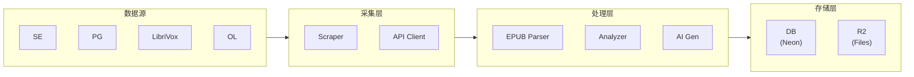

# Readmigo 内容数据策略

> 公版书资源获取、元数据管理与运营分发的最佳实践方案

---

## 1. 执行摘要

### 1.1 核心结论

Readmigo 作为 AI 原生英文阅读学习产品，内容数据获取应遵循以下原则：

```
┌─────────────────────────────────────────────────────────────────┐
│                     内容数据分层策略                              │
├─────────────────────────────────────────────────────────────────┤
│                                                                 │
│  Layer 1: 核心内容层 (书籍文件)                                   │
│  ├── Standard Ebooks  → 高质量 EPUB，1,000+ 精选经典              │
│  ├── Project Gutenberg → 大规模扩展，76,000+ 公版书               │
│  └── LibriVox         → 有声书配套，20,000+ 人声朗读              │
│                                                                 │
│  Layer 2: 元数据补充层                                           │
│  ├── Open Library     → 书籍描述、原始出版日期、高清封面           │
│  └── Wikipedia        → 作者简介、书籍背景、文学价值               │
│                                                                 │
│  Layer 3: 自有数据层 (AI 生成 + 用户行为)                         │
│  ├── 难度分析         → Flesch-Kincaid、CEFR 等级                │
│  ├── AI 内容          → 书籍简介、章节摘要、学习要点               │
│  └── 用户数据         → 阅读时长、热度、评分                       │
│                                                                 │
└─────────────────────────────────────────────────────────────────┘
```

### 1.2 语言策略

| 阶段 | 时间范围 | 语言重心 | 目标书籍数 |
|------|----------|----------|-----------|
| **Phase 1** | MVP → 1年 | 纯英语 | 1,000 → 5,000 |
| **Phase 2** | 1年 → 2年 | 英语为主 + 中文试点 | 5,000 → 10,000 |
| **Phase 3** | 2年+ | 双语并重 | 10,000+ |

---

## 2. 产品数据需求全景

### 2.1 书籍数据模型

基于 Readmigo 数据库 schema，书籍相关数据需求如下：

| 数据维度 | 字段 | 来源优先级 | 说明 |
|----------|------|-----------|------|
| **基础信息** | `title`, `author` | SE > PG > OL | 核心展示 |
| **内容描述** | `description` | OL > SE > AI生成 | Discover 展示 |
| **分类标签** | `subjects`, `genres` | SE/PG + 映射 | 推荐分类 |
| **书籍文件** | `epubUrl` | SE > PG | 阅读核心 |
| **封面图片** | `coverUrl`, `coverThumbUrl` | SE > OL > PG | 视觉体验 |
| **难度指标** | `difficultyScore`, `fleschScore`, `cefrLevel` | 自行分析 | 分级推荐 |
| **统计信息** | `wordCount`, `chapterCount` | EPUB 解析 | 阅读预估 |
| **质量标记** | `isClassic`, `editorialScore` | 人工+规则 | 推荐排序 |
| **出版信息** | `publishedAt` | OL > 推断 | 年代筛选 |

### 2.2 各维度数据需求详解

#### A. 书籍文件 (EPUB)

| 需求 | 重要性 | 说明 |
|------|--------|------|
| EPUB3 格式 | ⭐⭐⭐⭐⭐ | 支持富文本、语义标注 |
| 章节结构清晰 | ⭐⭐⭐⭐⭐ | 导航、进度追踪 |
| 内嵌图片 | ⭐⭐⭐⭐ | 部分书籍有插图 |
| 文本可选中 | ⭐⭐⭐⭐⭐ | 查词、划线、笔记 |
| 格式统一 | ⭐⭐⭐⭐ | 降低解析复杂度 |

#### B. 元数据

| 需求 | 重要性 | 说明 |
|------|--------|------|
| 书籍简介 | ⭐⭐⭐⭐⭐ | Discover 核心展示 |
| 作者信息 | ⭐⭐⭐⭐ | 作者页面、推荐 |
| 分类标签 | ⭐⭐⭐⭐⭐ | 分类浏览、推荐 |
| 原始出版年 | ⭐⭐⭐ | 年代筛选、经典判断 |
| 难度等级 | ⭐⭐⭐⭐⭐ | 个性化推荐核心 |

#### C. 封面图片

| 需求 | 重要性 | 说明 |
|------|--------|------|
| 高清大图 | ⭐⭐⭐⭐ | 详情页展示 |
| 缩略图 | ⭐⭐⭐⭐⭐ | 列表、卡片展示 |
| 统一风格 | ⭐⭐⭐ | 视觉一致性 |
| 快速加载 | ⭐⭐⭐⭐ | 用户体验 |

#### D. 运营分发

| 需求 | 重要性 | 说明 |
|------|--------|------|
| 热度数据 | ⭐⭐⭐⭐ | 排行榜、热门推荐 |
| 分类体系 | ⭐⭐⭐⭐⭐ | Discover Tab 结构 |
| 编辑推荐 | ⭐⭐⭐⭐ | 精选书单 |
| 新书更新 | ⭐⭐⭐ | 保持内容新鲜 |

---

## 3. 核心三大资源详解

### 3.1 Standard Ebooks（首选）

```
定位: 高质量精选，核心内容库
数量: 1,000+ 本
网站: standardebooks.org
```

#### 核心优势

| 维度 | 评价 | 说明 |
|------|------|------|
| **EPUB 质量** | ⭐⭐⭐⭐⭐ | 专业编辑、严格 EPUB3 规范 |
| **元数据完整度** | ⭐⭐⭐⭐⭐ | 详细描述、丰富分类 |
| **封面质量** | ⭐⭐⭐⭐⭐ | 统一风格、艺术设计 |
| **格式一致性** | ⭐⭐⭐⭐⭐ | 降低处理成本 |
| **版权清晰** | ⭐⭐⭐⭐⭐ | CC0 许可，无任何限制 |

#### 数据获取方式

| 方式 | 推荐度 | 说明 |
|------|--------|------|
| **网页抓取** | ⭐⭐⭐⭐⭐ | 项目已实现，稳定可靠 |
| **GitHub 源码** | ⭐⭐⭐⭐ | 最完整元数据 |
| **OPDS Feed** | ⭐⭐⭐ | 需要 Patrons 会员 |
| **New Releases RSS** | ⭐⭐⭐⭐ | 公开，增量更新 |

#### 可获取字段

```
✅ 完整可用:
├── title, author, description (详细)
├── subjects, genres
├── epubUrl (多格式), coverUrl (高清)
├── language, publishedAt
└── sourceUrl, Wikipedia链接

⚠️ 需自行处理:
├── wordCount, chapterCount (解析 EPUB)
├── difficultyScore (文本分析)
└── 热度数据 (SE 不公开)
```

#### 使用策略

```
Phase 1 (MVP):
└── 导入全部 ~1,000 本作为核心书库

持续更新:
└── 监控 New Releases RSS，每日增量同步
```

---

### 3.2 Project Gutenberg（扩展）

```
定位: 大规模扩展，海量经典
数量: 76,000+ 本
网站: gutenberg.org
API: gutendex.com (第三方)
```

#### 核心优势

| 维度 | 评价 | 说明 |
|------|------|------|
| **书籍数量** | ⭐⭐⭐⭐⭐ | 最大公版书库 |
| **热度数据** | ⭐⭐⭐⭐⭐ | 有下载量排行 |
| **语言覆盖** | ⭐⭐⭐⭐ | 60+ 语言 |
| **API 可用性** | ⭐⭐⭐⭐ | Gutendex 免费好用 |

#### 核心劣势

| 维度 | 评价 | 说明 |
|------|------|------|
| **EPUB 质量** | ⭐⭐⭐ | 参差不齐 |
| **元数据完整度** | ⭐⭐ | 无书籍描述 |
| **封面质量** | ⭐⭐ | 部分缺失、质量不一 |
| **格式一致性** | ⭐⭐ | 需要额外处理 |

#### 数据获取方式

| 方式 | 推荐度 | 说明 |
|------|--------|------|
| **Gutendex API** | ⭐⭐⭐⭐⭐ | 推荐首选 |
| **OPDS Feed** | ⭐⭐⭐ | 标准协议 |
| **RDF 目录** | ⭐⭐⭐⭐ | 批量元数据 |
| **rsync 镜像** | ⭐⭐ | 存储需求大 |

#### Gutendex API 速查

```bash
# 热门书籍
GET https://gutendex.com/books?sort=popular&languages=en

# 按分类
GET https://gutendex.com/books?topic=fiction&languages=en

# 搜索
GET https://gutendex.com/books?search=shakespeare
```

#### 响应字段

```json
{
  "id": 84,
  "title": "Frankenstein",
  "authors": [{"name": "Shelley, Mary", "birth_year": 1797, "death_year": 1851}],
  "subjects": ["Gothic Fiction", "Horror tales"],
  "bookshelves": ["Science Fiction"],
  "languages": ["en"],
  "formats": {
    "application/epub+zip": "https://...",
    "image/jpeg": "https://..."
  },
  "download_count": 116037
}
```

#### 使用策略

```
Phase 1 (MVP):
├── 导入 Top 1000 热门英语书籍
└── 优先选择 SE 没有的作品

Phase 2 (扩展):
├── 扩展到 Top 5000
├── 按分类补充各类型书籍
└── 使用 OL 补充元数据和封面

筛选标准:
├── download_count > 1000
├── languages = "en"
├── 优先选择 SE 未覆盖的
└── 封面存在且质量可接受
```

---

### 3.3 LibriVox（有声书）

```
定位: 有声书配套，听读结合
数量: 20,000+ 录音
网站: librivox.org
API: librivox.org/api/feed/audiobooks
```

#### 核心优势

| 维度 | 评价 | 说明 |
|------|------|------|
| **有声书数量** | ⭐⭐⭐⭐⭐ | 最大公版有声书库 |
| **API 完善** | ⭐⭐⭐⭐ | 官方 REST API |
| **与 PG 关联** | ⭐⭐⭐⭐⭐ | 文本来源于 PG |
| **版权清晰** | ⭐⭐⭐⭐⭐ | 公共领域 |

#### 核心劣势

| 维度 | 评价 | 说明 |
|------|------|------|
| **朗读质量** | ⭐⭐⭐ | 志愿者水平参差 |
| **录音风格** | ⭐⭐ | 不统一 |
| **专业制作** | ⭐⭐ | 无后期处理 |

#### API 速查

```bash
# 获取有声书列表
GET https://librivox.org/api/feed/audiobooks/?format=json&limit=50

# 获取详情（含章节）
GET https://librivox.org/api/feed/audiobooks/?id=52&extended=1&format=json

# 按作者搜索
GET https://librivox.org/api/feed/audiobooks/author/Shakespeare?format=json
```

#### 使用策略

```
Phase 1:
├── 为 SE/PG 书籍匹配 LibriVox 有声书
├── 通过 url_text_source 关联 PG ID
└── 存储音频 URL（不下载实际文件）

功能规划:
├── Phase 1: 基础播放 + 章节导航
├── Phase 2: 听读同步
└── Phase 3: 跟读评分
```

---

## 4. 元数据补充策略

### 4.1 Open Library（主要补充源）

```
定位: 元数据补充，丰富书籍信息
数量: 2000万+ editions 元数据
网站: openlibrary.org
```

#### 可补充数据

| 数据 | PG/SE 状态 | OL 可提供 |
|------|-----------|----------|
| **书籍描述** | PG 无 / SE 有 | ✅ 大部分书籍有 |
| **原始出版日期** | PG 无 / SE 无 | ✅ 有 first_publish_year |
| **作者简介** | 基础 | ✅ 详细 bio |
| **作者照片** | 无 | ✅ 有 |
| **高清封面** | PG 部分缺 | ✅ 质量好 |
| **ISBN** | 无 | ✅ 有（用于去重） |

#### 补充流程

```
┌─────────────────────────────────────────────────────────────┐
│  元数据补充流程                                               │
├─────────────────────────────────────────────────────────────┤
│                                                             │
│  Step 1: 匹配书籍                                            │
│  └── GET /search.json?title={title}&author={author}         │
│                                                             │
│  Step 2: 获取 Work 详情                                      │
│  └── GET /works/{olid}.json                                 │
│  └── 提取: description, first_publish_year, subjects        │
│                                                             │
│  Step 3: 获取作者详情（如需）                                 │
│  └── GET /authors/{olid}.json                               │
│  └── 提取: bio, birth_date, death_date, wikipedia           │
│                                                             │
│  Step 4: 获取封面（如缺失）                                   │
│  └── https://covers.openlibrary.org/b/olid/{olid}-L.jpg     │
│                                                             │
└─────────────────────────────────────────────────────────────┘
```

### 4.2 Wikipedia（背景信息）

用于丰富作者页面和书籍背景：

| 数据 | 用途 |
|------|------|
| 作者生平 | 作者详情页 |
| 书籍背景 | 阅读引导 |
| 文学地位 | 推荐权重 |
| 获奖信息 | isAwardWinner 标记 |

---

## 5. 自有数据层

### 5.1 AI 生成内容

| 内容 | 生成时机 | 用途 |
|------|----------|------|
| **书籍简介** | PG 书籍无描述时 | Discover 展示 |
| **章节摘要** | 按需生成 | 快速预览 |
| **学习要点** | 阅读完成后 | 学习反馈 |
| **难词预览** | 开始阅读前 | 难度预估 |

### 5.2 难度分析

```
分析维度:
├── Flesch-Kincaid 可读性分数
├── 平均句长
├── 词汇复杂度（syllables/word）
├── 生词密度（相对词频表）
└── 映射到 CEFR 等级 (A1-C2)

输出字段:
├── difficultyScore (0-10)
├── fleschScore (0-100)
└── cefrLevel (A1/A2/B1/B2/C1/C2)
```

### 5.3 用户行为数据

| 数据 | 来源 | 用途 |
|------|------|------|
| 阅读时长 | 用户行为 | 热度计算 |
| 完读率 | 用户行为 | 质量信号 |
| 收藏数 | 用户行为 | 推荐权重 |
| 评分 | 用户输入 | 推荐排序 |

---

## 6. 运营分发策略

### 6.1 Discover Tab 数据来源

```
Discover Tab 结构:
├── 🔥 Trending Now
│   └── 数据: 用户行为热度 + PG 下载量
│
├── 📚 Categories
│   ├── Fiction      → SE/PG subjects 映射
│   ├── Mystery      → topic=detective
│   ├── Romance      → topic=romance
│   ├── Sci-Fi       → topic=science fiction
│   ├── Fantasy      → topic=fantasy
│   ├── Horror       → topic=gothic
│   ├── Adventure    → topic=adventure
│   ├── Children's   → topic=children
│   ├── Classics     → isClassic=true
│   └── Poetry       → topic=poetry
│
├── ✍️ Popular Authors
│   └── 数据: 作者书籍热度聚合
│
├── 📖 Editor's Picks
│   └── 数据: 人工策划书单
│
└── 🎧 Audiobooks
    └── 数据: LibriVox 匹配的书籍
```

### 6.2 热度计算

```python
# 热度分计算公式
popularity_score = (
    0.3 * normalize(pg_download_count) +     # PG 外部热度
    0.3 * normalize(user_reading_minutes) +   # 内部阅读时长
    0.2 * normalize(user_favorites) +         # 收藏数
    0.1 * normalize(completion_rate) +        # 完读率
    0.1 * freshness_decay(last_activity)      # 时间衰减
)
```

### 6.3 质量分计算

```python
# 质量分计算公式
quality_score = (
    0.4 * source_quality +          # SE=1.0, PG=0.7
    0.3 * editorial_score / 10 +    # 编辑评分
    0.15 * is_classic +             # 经典标记
    0.15 * has_complete_metadata    # 元数据完整度
)
```

---

## 7. 英语内容阶段规划

### 7.1 Phase 1: MVP（0-6个月）

**目标**: 1,000 本高质量英语经典

```
内容来源:
├── Standard Ebooks 全量导入 (~1,000本)
└── 质量保证，用户体验优先

元数据:
├── SE 原生元数据为主
├── OL 补充封面和描述
└── 自行分析难度等级

有声书:
├── 为 Top 200 书籍匹配 LibriVox
└── 基础播放功能
```

### 7.2 Phase 2: 扩展（6-12个月）

**目标**: 5,000 本英语书籍

```
内容来源:
├── SE 持续同步
├── PG Top 3000-4000 热门
└── 筛选标准：download_count > 5000

元数据:
├── OL 批量补充描述
├── AI 生成缺失简介
└── 优化难度分析算法

有声书:
├── 匹配扩展到 1000+ 本
├── 听读同步功能
```

### 7.3 Phase 3: 成熟（12-24个月）

**目标**: 10,000+ 英语书籍

```
内容来源:
├── PG 持续扩展
├── IA 公共领域补充
└── 按分类平衡覆盖

高级功能:
├── 个性化推荐成熟
├── 用户生成内容（书评、笔记）
└── 跟读评分功能
```

---

## 8. 中文内容扩展规划（Phase 2+）

### 8.1 中文公版书资源

| 资源 | 类型 | 数量 | 优先级 |
|------|------|------|--------|
| **中国哲学书电子化计划 (ctext.org)** | 古典文献 | 30,000+ | P1 |
| **维基文库中文** | 综合 | 10,000+ | P2 |
| **书格 (shuge.org)** | 古籍扫描 | 2,000+ | P3 |
| **Gutenberg 中文** | 少量 | 100+ | P3 |

### 8.2 中文数据特殊需求

| 需求 | 字段 | 说明 |
|------|------|------|
| 汉字数统计 | `characterCount` | 区别于 wordCount |
| HSK 等级 | `hskLevel` | 1-9 级难度 |
| 平均笔画 | `avgStrokeCount` | 视觉复杂度 |
| 朝代标注 | `dynasty` | 古籍分类 |
| 拼音支持 | `pinyinEnabled` | 学习辅助 |
| 古文注释 | `hasAnnotations` | 理解辅助 |
| 繁简标注 | `originalScript` | traditional/simplified |

### 8.3 中文扩展时间线

```
Phase 2 (12-18个月):
├── 试点：100-200 本中文经典
├── 《论语》《道德经》《三字经》等
└── 验证中文阅读学习需求

Phase 3 (18-24个月):
├── 扩展：1000+ 中文书籍
├── 完善 HSK 难度体系
└── 中文有声书对接
```

---

## 9. 数据管道架构

### 9.1 整体流程



### 9.2 已实现组件

| 组件 | 路径 | 状态 |
|------|------|------|
| SE Scraper | `scripts/book-ingestion/sources/standard-ebooks.ts` | ✅ 完成 |
| SE Importer | `apps/backend/src/modules/import/standard-ebooks.*` | ✅ 完成 |
| PG Source | `scripts/book-ingestion/sources/gutenberg.ts` | ✅ 完成 |
| EPUB Parser | `scripts/book-ingestion/processors/epub-parser.ts` | ✅ 完成 |
| Difficulty Analyzer | `scripts/book-ingestion/processors/difficulty-analyzer.ts` | ✅ 完成 |

### 9.3 待实现组件

| 组件 | 优先级 | 说明 |
|------|--------|------|
| OL Metadata Enricher | P1 | 补充书籍描述和封面 |
| LibriVox Matcher | P1 | 关联有声书 |
| AI Description Generator | P2 | 为 PG 书籍生成简介 |
| Batch Processor | P2 | 批量处理优化 |

---

## 10. 总结与行动项

### 10.1 核心原则

```
1. 质量优先于数量
   └── SE 1000本 > PG 随机 5000本

2. 元数据完整性
   └── 缺失描述的书籍用户体验差

3. 分层获取
   └── 核心内容 → 元数据补充 → AI 生成

4. 英语优先
   └── 前期专注英语，验证后扩展中文

5. 增量更新
   └── 建立自动化同步机制
```

### 10.2 短期行动项（1-3个月）

| 任务 | 优先级 | 产出 |
|------|--------|------|
| SE 全量导入 | P0 | ~1000 本高质量书籍 |
| OL 元数据补充脚本 | P0 | 书籍描述覆盖率提升 |
| LibriVox 匹配 Top 200 | P1 | 有声书功能可用 |
| PG Top 1000 导入 | P1 | 内容库扩展 |
| 难度分析优化 | P1 | CEFR 等级准确性 |

### 10.3 中期行动项（3-6个月）

| 任务 | 优先级 | 产出 |
|------|--------|------|
| PG 扩展到 3000 | P1 | 内容规模提升 |
| AI 简介生成 | P2 | 元数据完整性 |
| 自动化同步管道 | P2 | 运维效率 |
| 热度算法上线 | P1 | 推荐质量 |

### 10.4 文档索引

| 文档 | 路径 |
|------|------|
| Standard Ebooks 盘点 | `docs/standard-ebooks-data-inventory.md` |
| Project Gutenberg 盘点 | `docs/project-gutenberg-data-inventory.md` |
| Internet Archive / Open Library 盘点 | `docs/internet-archive-open-library-data-inventory.md` |
| LibriVox 盘点 | `docs/librivox-data-inventory.md` |
| 其他资源盘点 | `docs/other-public-domain-sources-inventory.md` |
| **本文档（策略总结）** | `docs/content-data-strategy.md` |

---

*文档更新日期: 2024-12-25*
