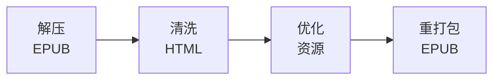

# 书籍内容处理

### 14.1 EPUB清洗流程



### 14.2 HTML内容清洗规则

```typescript
// scripts/book-processing/html-cleaner.ts

interface CleaningRules {
  // 移除元素
  removeElements: string[];
  // 移除属性
  removeAttributes: string[];
  // 替换规则
  replacements: Array<{ pattern: RegExp; replacement: string }>;
  // 保留元素
  allowedElements: string[];
}

const gutenbergCleaningRules: CleaningRules = {
  removeElements: [
    // Gutenberg 法律声明
    'pre:contains("Project Gutenberg")',
    'p:contains("This eBook is for the use of anyone")',
    'p:contains("START OF THE PROJECT GUTENBERG")',
    'p:contains("END OF THE PROJECT GUTENBERG")',

    // 广告和链接
    'a[href*="gutenberg.org"]',
    'div.pg-boilerplate',

    // 空白元素
    'p:empty',
    'div:empty',
  ],

  removeAttributes: [
    'style',           // 内联样式
    'bgcolor',         // 过时属性
    'align',
    'border',
    'cellpadding',
    'cellspacing',
    'width',
    'height',
  ],

  replacements: [
    // 修复常见编码问题
    { pattern: /\u00a0/g, replacement: ' ' },           // Non-breaking space
    { pattern: /[\u2018\u2019]/g, replacement: "'" },   // Smart quotes
    { pattern: /[\u201c\u201d]/g, replacement: '"' },   // Smart double quotes
    { pattern: /\u2014/g, replacement: '—' },           // Em dash
    { pattern: /\u2013/g, replacement: '–' },           // En dash

    // 移除多余空白
    { pattern: /\n{3,}/g, replacement: '\n\n' },
    { pattern: / {2,}/g, replacement: ' ' },
  ],

  allowedElements: [
    'html', 'head', 'body', 'title', 'meta', 'link',
    'div', 'p', 'span', 'br', 'hr',
    'h1', 'h2', 'h3', 'h4', 'h5', 'h6',
    'a', 'img',
    'ul', 'ol', 'li',
    'table', 'thead', 'tbody', 'tr', 'th', 'td',
    'blockquote', 'pre', 'code',
    'em', 'strong', 'i', 'b', 'u', 's',
    'sup', 'sub',
    'figure', 'figcaption',
  ],
};

/**
 * 清洗 HTML 内容
 */
async function cleanHtml(html: string, rules: CleaningRules): Promise<string> {
  const $ = cheerio.load(html);

  // 1. 移除指定元素
  for (const selector of rules.removeElements) {
    $(selector).remove();
  }

  // 2. 移除指定属性
  $('*').each((_, el) => {
    for (const attr of rules.removeAttributes) {
      $(el).removeAttr(attr);
    }
  });

  // 3. 应用替换规则
  let content = $.html();
  for (const { pattern, replacement } of rules.replacements) {
    content = content.replace(pattern, replacement);
  }

  // 4. 移除空白元素 (二次清理)
  const $cleaned = cheerio.load(content);
  $cleaned('p:empty, div:empty, span:empty').remove();

  return $cleaned.html();
}
```

### 14.3 元数据提取与增强

```typescript
// scripts/book-processing/metadata-extractor.ts

interface BookMetadata {
  // 基础信息
  title: string;
  author: string;
  authorBirthYear?: number;
  authorDeathYear?: number;
  language: string;
  publishedYear?: number;

  // 分类信息
  subjects: string[];
  bookshelves: string[];
  genres: string[];

  // 内容分析
  wordCount: number;
  chapterCount: number;
  estimatedReadingMinutes: number;

  // 难度信息
  difficultyScore: number;        // 1.0 - 5.0
  fleschScore: number;            // Flesch Reading Ease
  avgSentenceLength: number;
  avgWordLength: number;
  vocabularyComplexity: number;

  // 章节信息
  chapters: ChapterMeta[];

  // AI增强 (可选，后续生成)
  aiSummary?: string;
  aiThemes?: string[];
  aiKeyCharacters?: string[];
  aiHistoricalContext?: string;
}

interface ChapterMeta {
  number: number;
  title: string;
  wordCount: number;
  difficultyScore: number;
  spinePosition: number;
}

/**
 * 难度计算算法
 */
function calculateDifficulty(text: string): DifficultyMetrics {
  const sentences = splitIntoSentences(text);
  const words = splitIntoWords(text);

  // Flesch Reading Ease Score
  const avgSentenceLength = words.length / sentences.length;
  const avgSyllablesPerWord = countSyllables(words) / words.length;
  const fleschScore = 206.835 - (1.015 * avgSentenceLength) - (84.6 * avgSyllablesPerWord);

  // 词汇复杂度 (基于常见词汇表)
  const commonWords = loadCommonWordList(3000);  // 前3000常见词
  const uncommonWordRatio = words.filter(w => !commonWords.has(w.toLowerCase())).length / words.length;

  // 综合难度评分 (1.0 - 5.0)
  let difficultyScore: number;
  if (fleschScore >= 80) difficultyScore = 1.0;       // Very Easy
  else if (fleschScore >= 60) difficultyScore = 2.0;  // Easy
  else if (fleschScore >= 40) difficultyScore = 3.0;  // Medium
  else if (fleschScore >= 20) difficultyScore = 4.0;  // Hard
  else difficultyScore = 5.0;                         // Very Hard

  // 根据词汇复杂度调整
  difficultyScore += uncommonWordRatio * 0.5;
  difficultyScore = Math.min(5.0, Math.max(1.0, difficultyScore));

  return {
    fleschScore,
    avgSentenceLength,
    avgWordLength: words.join('').length / words.length,
    vocabularyComplexity: uncommonWordRatio,
    difficultyScore: Math.round(difficultyScore * 100) / 100,
  };
}

/**
 * 提取章节信息
 */
async function extractChapters(epubPath: string): Promise<ChapterMeta[]> {
  const epub = await EPub.createAsync(epubPath);
  const chapters: ChapterMeta[] = [];

  for (let i = 0; i < epub.flow.length; i++) {
    const item = epub.flow[i];
    const content = await epub.getChapterAsync(item.id);
    const text = extractText(content);

    chapters.push({
      number: i + 1,
      title: item.title || `Chapter ${i + 1}`,
      wordCount: countWords(text),
      difficultyScore: calculateDifficulty(text).difficultyScore,
      spinePosition: i,
    });
  }

  return chapters;
}
```

### 14.4 AI增强元数据生成

```typescript
// scripts/book-processing/ai-enhancement.ts

/**
 * AI生成书籍增强信息
 */
async function generateAIMetadata(book: Book): Promise<AIEnhancedMetadata> {
  const sampleContent = await getSampleContent(book, 5000); // 前5000字

  const prompt = `
Analyze this book excerpt and provide:
1. A 2-3 sentence summary suitable for a book catalog
2. Main themes (3-5 themes)
3. Key characters with brief descriptions
4. Historical/cultural context (if applicable)
5. Target reader level (beginner/intermediate/advanced English learner)
6. Similar books recommendation (3-5 classic books)

Book: "${book.title}" by ${book.author}
Excerpt:
${sampleContent}

Respond in JSON format.
`;

  const response = await callAI(prompt, 'deepseek');
  return JSON.parse(response);
}

/**
 * 批量生成AI元数据 (成本控制)
 */
async function batchGenerateAIMetadata(books: Book[]): Promise<void> {
  // 分批处理，控制成本
  const batchSize = 10;
  const delayBetweenBatches = 60000; // 1分钟

  for (let i = 0; i < books.length; i += batchSize) {
    const batch = books.slice(i, i + batchSize);

    await Promise.all(batch.map(async (book) => {
      try {
        const aiMeta = await generateAIMetadata(book);
        await prisma.book.update({
          where: { id: book.id },
          data: { aiMetadata: aiMeta },
        });
      } catch (error) {
        console.error(`Failed to generate AI metadata for ${book.title}:`, error);
      }
    }));

    // 速率限制
    if (i + batchSize < books.length) {
      await sleep(delayBetweenBatches);
    }
  }
}
```

### 14.5 关键词汇提取

```typescript
// scripts/book-processing/vocabulary-extractor.ts

interface ExtractedVocabulary {
  word: string;
  frequency: number;           // 在本书中出现次数
  globalFrequency: number;     // 全局词频排名
  importance: 'core' | 'recommended' | 'advanced';
  contexts: string[];          // 例句上下文
}

/**
 * 提取书籍关键词汇
 */
async function extractKeyVocabulary(bookContent: string): Promise<ExtractedVocabulary[]> {
  const words = tokenize(bookContent);
  const wordFreq = new Map<string, number>();
  const wordContexts = new Map<string, string[]>();

  // 1. 统计词频
  const sentences = splitIntoSentences(bookContent);
  for (const sentence of sentences) {
    const sentenceWords = tokenize(sentence);
    for (const word of sentenceWords) {
      const normalized = word.toLowerCase();
      wordFreq.set(normalized, (wordFreq.get(normalized) || 0) + 1);

      // 保存上下文
      if (!wordContexts.has(normalized)) {
        wordContexts.set(normalized, []);
      }
      if (wordContexts.get(normalized)!.length < 3) {
        wordContexts.get(normalized)!.push(sentence);
      }
    }
  }

  // 2. 加载全局词频表 (COCA / BNC)
  const globalFreqList = await loadGlobalFrequencyList();

  // 3. 筛选关键词汇
  const vocabulary: ExtractedVocabulary[] = [];

  for (const [word, freq] of wordFreq) {
    // 排除过于简单的词 (前1000常见词)
    const globalRank = globalFreqList.get(word) || 100000;
    if (globalRank < 1000) continue;

    // 排除出现次数太少的词
    if (freq < 2) continue;

    // 排除非英文词
    if (!/^[a-z]+$/.test(word)) continue;

    // 确定重要性级别
    let importance: 'core' | 'recommended' | 'advanced';
    if (globalRank < 3000) importance = 'core';
    else if (globalRank < 8000) importance = 'recommended';
    else importance = 'advanced';

    vocabulary.push({
      word,
      frequency: freq,
      globalFrequency: globalRank,
      importance,
      contexts: wordContexts.get(word) || [],
    });
  }

  // 4. 按重要性和频率排序
  vocabulary.sort((a, b) => {
    const importanceOrder = { core: 0, recommended: 1, advanced: 2 };
    if (importanceOrder[a.importance] !== importanceOrder[b.importance]) {
      return importanceOrder[a.importance] - importanceOrder[b.importance];
    }
    return b.frequency - a.frequency;
  });

  // 5. 返回前200个关键词
  return vocabulary.slice(0, 200);
}
```

---

