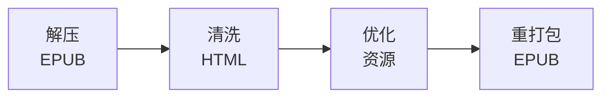

# 书籍内容处理

## EPUB 清洗流程

## HTML 内容清洗规则

| 规则类别 | 说明 |
|---------|------|
| **移除元素** | Gutenberg 法律声明、广告链接、空白元素 |
| **移除属性** | 内联样式 (style)、过时属性 (bgcolor, align, border 等) |
| **文本替换** | Non-breaking space、智能引号、Em/En dash、多余空白 |
| **允许元素** | 标准 HTML 语义元素 (div, p, h1-h6, a, img, table, blockquote 等) |

## 元数据提取与增强

| 元数据类别 | 字段 | 说明 |
|-----------|------|------|
| **基础信息** | title, author, language, publishedYear | 从 content.opf 提取 |
| **分类信息** | subjects, bookshelves, genres | 来源分类映射 |
| **内容分析** | wordCount, chapterCount, estimatedReadingMinutes | EPUB 解析计算 |
| **难度信息** | difficultyScore (1-5), fleschScore, cefrLevel | 文本分析算法 |
| **章节信息** | number, title, wordCount, difficultyScore | 逐章节提取 |

### 难度评估维度

| 指标 | 计算方式 | 说明 |
|------|---------|------|
| Flesch Reading Ease | 206.835 - 1.015 * avgSentenceLength - 84.6 * avgSyllablesPerWord | 可读性分数 (0-100) |
| 词汇复杂度 | 非常见词比例 (基于前3000常见词表) | 生词密度 |
| 综合难度 | Flesch 分数区间 + 词汇复杂度调整 | 最终评分 1.0-5.0 |

| Flesch Score | 难度等级 | 对应 difficultyScore |
|-------------|---------|---------------------|
| >= 80 | Very Easy | 1.0 |
| >= 60 | Easy | 2.0 |
| >= 40 | Medium | 3.0 |
| >= 20 | Hard | 4.0 |
| < 20 | Very Hard | 5.0 |

## AI 增强元数据生成

| AI 生成内容 | 输入 | 用途 |
|------------|------|------|
| 书籍简介 (2-3句) | 书籍前5000字样本 | Discover 展示 |
| 主题标签 (3-5个) | 文本分析 | 分类推荐 |
| 关键角色 | 文本分析 | 角色图谱 |
| 历史/文化背景 | 元数据 + 文本 | 阅读引导 |
| 目标读者等级 | 难度分析 | 个性化推荐 |
| 相似书籍 (3-5本) | 内容匹配 | 关联推荐 |

- AI Provider: DeepSeek (主) / OpenAI (备)
- 批量处理: 每批10本，批间间隔60秒
- 成本控制: 分批处理，速率限制

## 关键词汇提取

| 处理步骤 | 说明 |
|---------|------|
| 1. 词频统计 | 按句子分词，统计每个词出现次数 |
| 2. 全局词频对比 | 对比 COCA/BNC 全局词频表 |
| 3. 筛选过滤 | 排除前1000常见词、出现 < 2次的词、非英文词 |
| 4. 重要性分级 | core (< 3000)、recommended (< 8000)、advanced (8000+) |
| 5. 排序输出 | 按重要性和频率排序，返回前200个关键词 |

---
