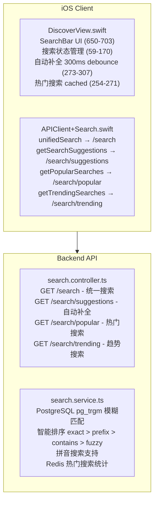
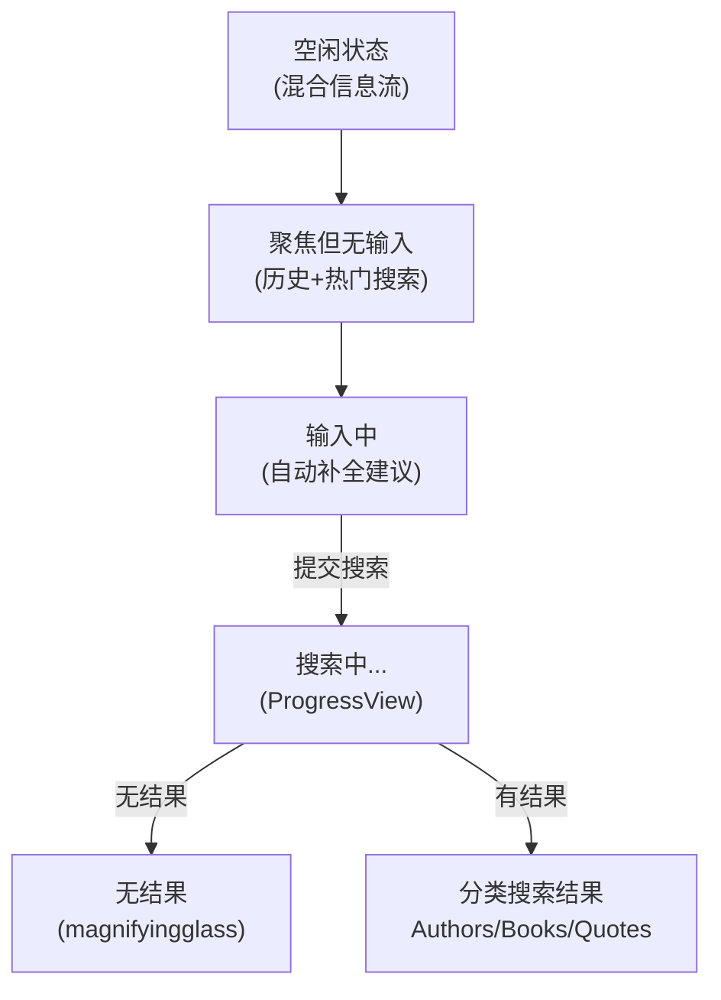

# Discover Tab 搜索功能分析

## 概述

本文档梳理 Discover Tab 搜索框的功能实现以及潜在的优化方向。

---

## 当前架构

---

## iOS 实现

### 搜索框 UI (DiscoverView.swift:650-703)

| 组件 | 说明 |
|------|------|
| 搜索图标 | magnifyingglass |
| Placeholder | "search.placeholder" (多语言) |
| 清空按钮 | xmark.circle.fill |
| Focus 管理 | @FocusState |
| 提交回调 | onSearch |

### 搜索状态流

### 搜索执行流程 (DiscoverView.swift:230-252)

1. 用户提交搜索 (SearchBar onSearch callback)
2. 保存查询到 SearchHistoryManager
3. 设置 isSearching = true
4. 调用 `APIClient.shared.unifiedSearch(query:limit:)`
5. 更新 unifiedSearchResult 状态

### 自动补全 (DiscoverView.swift:273-307)

| 参数 | 值 |
|------|-----|
| Debounce | 300ms |
| 最小字符数 | 2 |
| 默认限制 | 5 条 |

### API 调用 (APIClient+Search.swift)

| 方法 | 端点 | 说明 |
|------|------|------|
| unifiedSearch() | /search?q={query}&limit={limit} | 统一搜索 |
| getSearchSuggestions() | /search/suggestions?q={query}&limit={limit} | 自动补全 |
| getPopularSearches() | /search/popular?limit={limit} | 热门搜索 |
| getTrendingSearches() | /search/trending?limit={limit} | 今日趋势 |

---

## 后端实现

### API 端点 (search.controller.ts)

| 端点 | 方法 | 参数 | 返回 |
|------|------|------|------|
| /search | GET | q (必需), limit (默认 5) | UnifiedSearchResponseDto |
| /search/suggestions | GET | q (必需), limit (默认 5) | SearchSuggestionDto[] |
| /search/popular | GET | limit (默认 10) | PopularSearchDto[] |
| /search/trending | GET | limit (默认 10) | PopularSearchDto[] |

### 内容过滤 (search.controller.ts:105-111)

- 检查 `X-Client-Type` header
- iOS/Android 客户端自动过滤中文内容
- 过滤范围：中文作者、中文书籍、中文来源

### 搜索排序算法 (search.service.ts)

**作者搜索排序 (lines 90-167):**

| 匹配类型 | 分数 |
|---------|------|
| 精确匹配 | 100 |
| 前缀匹配 | 80 |
| 包含匹配 | 60 |
| 别名匹配 | 50 |
| 模糊匹配 | 40 |

**书籍搜索排序 (lines 173-265):**

| 匹配类型 | 分数 |
|---------|------|
| 标题精确匹配 | 100 |
| 作者精确匹配 | 95 |
| 去冠词精确匹配 (The/A/An) | 90 |
| 标题前缀匹配 | 80 |
| 作者前缀匹配 | 75 |
| 去冠词前缀匹配 | 70 |
| 标题包含匹配 | 60 |
| 作者包含匹配 | 55 |
| 去冠词包含匹配 | 55 |
| 模糊匹配 | 40 |

### PostgreSQL pg_trgm 模糊匹配

- 使用 trigram 算法进行模糊匹配
- 相似度阈值：0.3
- 支持拼写容错

### Redis 热门搜索统计 (search.service.ts:462-502)

| Key | 说明 | TTL |
|-----|------|-----|
| search:popular | 总体热门搜索 | 永久 |
| search:popular:{YYYY-MM-DD} | 每日统计 | 7 天 |

---

## 功能支持情况

| 功能 | 支持状态 | 说明 |
|------|---------|------|
| 书籍名称搜索 | ✅ 支持 | 多级匹配 (精确/前缀/包含/模糊) |
| 作者名称搜索 | ✅ 支持 | 多级匹配 + 别名支持 |
| 分类展示结果 | ✅ 支持 | Authors / Books / Quotes 分区 |
| 搜索建议/自动补全 | ✅ 支持 | 300ms debounce, 最少 2 字符 |
| 热门搜索 | ✅ 支持 | Redis 统计, 缓存显示 |
| 趋势搜索 (今日) | ✅ 支持 | 每日统计, 7 天过期 |
| 搜索历史 | ✅ 支持 | SearchHistoryManager 本地存储 |
| 拼音搜索 | ✅ 支持 | 作者/书籍拼音字段匹配 |
| 模糊搜索 (拼写容错) | ✅ 支持 | pg_trgm 相似度 ≥ 0.3 |
| 冠词处理 | ✅ 支持 | "The/A/An" 自动去除匹配 |
| 语义搜索 | ❌ 不支持 | 无法理解搜索意图 |
| 同义词搜索 | ❌ 不支持 | 需手动添加别名 |

---

## 优化建议

### 短期优化 (Low Effort)

| 优化项 | 说明 |
|--------|------|
| 搜索结果缓存 | 短时间内重复搜索使用缓存 |
| 错误状态优化 | 网络错误时显示重试按钮 |
| 加载状态优化 | 骨架屏代替简单 loading |

### 中期优化 (Medium Effort)

| 优化项 | 说明 |
|--------|------|
| 多语言别名扩展 | 增加更多语言的作者/书籍别名 |
| 搜索分析 | 记录用户搜索行为，优化排序 |
| 个性化推荐 | 基于用户阅读历史的搜索推荐 |

### 长期优化 (High Effort)

| 优化项 | 说明 |
|--------|------|
| 全文搜索引擎 | Elasticsearch / Meilisearch |
| 语义搜索 (AI) | 向量数据库 + Embedding |

---

## 相关代码文件

### iOS

| 文件 | 说明 |
|------|------|
| ios/Readmigo/Features/Library/DiscoverView.swift | Discover Tab 主视图 |
| ios/Readmigo/Features/Library/LibraryManager.swift | 书籍搜索 API |
| ios/Readmigo/Core/Network/APIClient+Search.swift | 搜索 API 扩展 |
| ios/Readmigo/Core/Services/SearchManager.swift | Reader 高级搜索 (参考) |

### Backend

| 文件 | 说明 |
|------|------|
| apps/backend/src/modules/search/search.controller.ts | 搜索接口 |
| apps/backend/src/modules/search/search.service.ts | 搜索逻辑 |
| apps/backend/src/modules/books/books.service.ts | 书籍搜索 (基础) |
| apps/backend/src/modules/authors/authors.service.ts | 作者搜索 |

---

## 实施进度

| 版本 | 状态 | 完成度 | 更新日期 | 说明 |
|------|------|--------|----------|------|
| v1.0 | ✅ 完成 | 90% | 2025-12-28 | 核心功能已实现 |

### 已完成 ✅

- [x] iOS 搜索框 UI 组件 (DiscoverView.swift:650-703)
- [x] 统一搜索 API (`GET /search`)
- [x] 搜索建议 API (`GET /search/suggestions`)
- [x] 热门搜索 API (`GET /search/popular`)
- [x] 趋势搜索 API (`GET /search/trending`)
- [x] 书籍名称搜索 (多级匹配)
- [x] 作者名称搜索 (多级匹配)
- [x] 分类展示搜索结果 (Authors / Books / Quotes)
- [x] 搜索历史功能 (SearchHistoryManager)
- [x] 自动补全 (300ms debounce)
- [x] 热门搜索推荐
- [x] 拼音搜索支持
- [x] 模糊搜索 (拼写容错)
- [x] 智能排序算法
- [x] 冠词处理 (The/A/An)
- [x] iOS/Android 中文内容过滤

### 待开发 📝

- [ ] 语义搜索 (AI)
- [ ] 同义词/别名自动扩展
- [ ] 搜索结果缓存优化
- [ ] 个性化搜索推荐

### 技术特点

- 使用 PostgreSQL pg_trgm 扩展实现模糊匹配
- Redis 存储热门搜索统计
- 智能排序算法确保最相关结果优先
- 支持多语言 (英文/中文/拼音)
