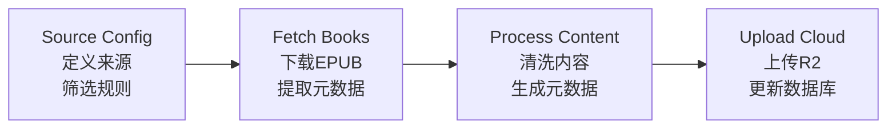

### 13.2 自动化入库流程

---

### 14.1 主要公版书平台

| 平台 | URL | 内容规模 | 特点 |
|------|-----|----------|------|
| **Project Gutenberg** | [gutenberg.org](https://www.gutenberg.org/) | 75,000+ 本 | 最大的公版电子书库，主要为英文作品 |
| **Standard Ebooks** | [standardebooks.org](https://standardebooks.org/) | 1,300+ 本 | 高质量排版，精校文字，EPUB3 格式 |
| **Internet Archive** | [archive.org](https://archive.org/) | 4700万+ 项目 | 包含书籍、音频、视频等多媒体资源 |
| **LibriVox** | [librivox.org](https://librivox.org/) | 20,000+ 有声书 | 公版书有声朗读，90+ 种语言 |
| **FadedPage** | [fadedpage.com](https://www.fadedpage.com/) | 8,000+ 本 | 加拿大公版书，含独特内容 |
| **Wikisource** | [wikisource.org](https://wikisource.org/) | 多语言 | 多语言公版原文，可用于对照 |
| **Digital Public Library of America** | [dp.la](https://dp.la/) | 6,300+ 本 | 美国图书馆联盟资源 |

### 14.2 开放教材平台 (OER)

| 平台 | URL | 特点 | 许可证 |
|------|-----|------|--------|
| **OpenStax** | [openstax.org](https://openstax.org/) | 50+ 本同行评审教材，莱斯大学出版 | CC BY 4.0 |
| **Open Textbook Library** | [open.umn.edu/opentextbooks](https://open.umn.edu/opentextbooks/) | 1,700+ 本教材目录 | 多种 CC 许可 |
| **LibreTexts** | [libretexts.org](https://libretexts.org/) | 多学科协作教材库 | CC BY-NC-SA |
| **OER Commons** | [oercommons.org](https://oercommons.org/) | 开放教育资源数字图书馆 | 多种许可 |
| **BCcampus OpenEd** | [open.bccampus.ca](https://open.bccampus.ca/) | 加拿大 BC 省开放教材 | CC 许可 |
| **GALILEO OER** | [oer.galileo.usg.edu](https://oer.galileo.usg.edu/) | 乔治亚大学系统开放资源 | CC 许可 |

#### 自然科学
| 平台 | URL | 内容 |
|------|-----|------|
| **MIT OpenCourseWare** | [ocw.mit.edu](https://ocw.mit.edu/) | MIT 课程资料，物理、化学、生物等 |
| **OpenGeology.org** | [opengeology.org](https://opengeology.org/) | 地质学开放教材 |
| **ProbabilityCourse.com** | [probabilitycourse.com](https://www.probabilitycourse.com/) | 概率统计课程 |

#### 计算机科学与技术
| 平台 | URL | 内容 |
|------|-----|------|
| **GoalKicker Books** | [goalkicker.com](https://books.goalkicker.com/) | 50+ 本编程书籍，Stack Overflow 社区整理 |
| **EbookFoundation** | [github.com/EbookFoundation](https://github.com/EbookFoundation/free-programming-books) | 4,000+ 免费编程书籍，43 种语言 |
| **Green Tea Press** | [greenteapress.com](https://greenteapress.com/) | Think Python, Think Stats 等系列 |
| **Language Science Press** | [langsci-press.org](https://langsci-press.org/) | 277+ 本语言学开放获取书籍 |

#### 艺术与人文
| 平台 | URL | 内容 |
|------|-----|------|
| **Smarthistory** | [smarthistory.org](https://smarthistory.org/) | 艺术史多媒体教材 |
| **Getty Virtual Library** | [getty.edu/publications](https://www.getty.edu/publications/virtuallibrary/) | 300+ 本艺术书籍 |
| **Metropolitan Museum Publications** | [metmuseum.org](https://www.metmuseum.org/art/metpublications) | 大都会博物馆免费电子书 |

#### 商业与经济
| 平台 | URL | 内容 |
|------|-----|------|
| **CORE Econ** | [core-econ.org](https://www.core-econ.org/) | 现代经济学教材，500+ 大学使用 |
| **Online Library of Liberty** | [oll.libertyfund.org](https://oll.libertyfund.org/) | 古典经济学文献 |
| **Mises Institute** | [mises.org/library](https://mises.org/library) | 奥地利学派经济学 |

#### 宗教与哲学
| 平台 | URL | 内容 |
|------|-----|------|
| **Sacred Texts Archive** | [sacred-texts.com](https://sacred-texts.com/) | 1,700+ 宗教与灵性文本 |
| **Christian Classics Ethereal Library** | [ccel.org](https://www.ccel.org/) | 1,000+ 基督教神学著作 |
| **HolyBooks.com** | [holybooks.com](https://holybooks.com/) | 多宗教典籍 PDF |

#### 古籍影印
| 平台 | URL | 内容 |
|------|-----|------|
| **书格** | [shuge.org](https://www.shuge.org/) | 高清古籍影印，中国古籍 |
| **国家图书馆数字资源** | [nlc.cn](http://www.nlc.cn/) | 中国国家图书馆馆藏 |
| **哈佛燕京图书馆** | [harvard.edu](https://library.harvard.edu/libraries/harvard-yenching-library) | 东亚研究资料 |
| **早稻田大学图书馆** | [waseda.jp](https://www.wul.waseda.ac.jp/) | 日本古籍资源 |

### 14.4 许可证类型说明

| 许可证 | 全称 | 商业使用 | 修改 | 相同许可 |
|--------|------|----------|------|----------|
| **Public Domain** | 公有领域 | ✅ | ✅ | 无要求 |
| **CC BY** | 署名 | ✅ | ✅ | 无要求 |
| **CC BY-SA** | 署名-相同方式共享 | ✅ | ✅ | ✅ |
| **CC BY-NC** | 署名-非商业性使用 | ❌ | ✅ | 无要求 |
| **CC BY-NC-SA** | 署名-非商业性使用-相同方式共享 | ❌ | ✅ | ✅ |
| **CC BY-NC-ND** | 署名-非商业性使用-禁止演绎 | ❌ | ❌ | 无要求 |
| **MIT** | MIT 许可证 | ✅ | ✅ | 无要求 |
| **Apache 2.0** | Apache 许可证 2.0 | ✅ | ✅ | 无要求 |
| **GNU FDL** | GNU 自由文档许可证 | ✅ | ✅ | ✅ |

### 14.5 质量评估标准

| 评级 | 含义 |
|------|------|
| **Excellent** | 同行评审、广泛采用、定期更新 |
| **Very Good** | 教师评审、内容全面、可靠 |
| **Good** | 实用内容、可能范围较窄或更新较少 |
| **Historic Classic** | 历史经典著作，具有奠基性意义 |

### 14.6 格式可用性

大多数资源提供多种格式：
- **PDF** - 通用格式，固定版式
- **EPUB** - 可重排文字，适合电子阅读器
- **HTML** - 网页阅读，通常支持交互
- **MOBI** - Kindle 兼容格式
- **Plain Text** - 纯文本，最大兼容性

---
