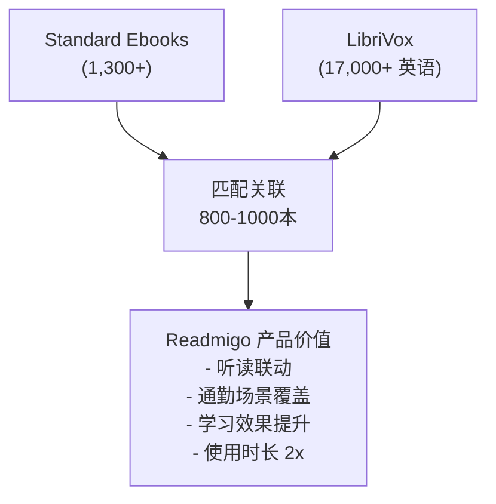

# Standard Ebooks 内容价值分析报告

> 基于 Readmigo 产品需求，评估 Standard Ebooks 公版书籍的导入价值

---

## 1. 总量概览

| 指标 | 数据 |
|------|------|
| **书籍总数** | 1,300+ 本（112页 × 12本/页） |
| **里程碑** | 2024年5月《尤利西斯》成为第1000本书 |
| **更新频率** | 持续更新，志愿者驱动 |
| **版权状态** | 全部 CC0 1.0 公共领域，可自由商用 |
| **内容质量** | 专业编辑校对，高质量排版 |

---

### Top 60 热门书籍

| 排名 | 书名 | 作者 | 类型 |
|------|------|------|------|
| 1 | Frankenstein | Mary Shelley | 哥特/科幻 |
| 2 | A Christmas Carol | Charles Dickens | 经典小说 |
| 3 | The Count of Monte Cristo | Alexandre Dumas | 冒险 |
| 4 | Pride and Prejudice | Jane Austen | 浪漫 |
| 5 | Meditations | Marcus Aurelius | 哲学 |
| 6 | The Picture of Dorian Gray | Oscar Wilde | 哥特 |
| 7 | Wuthering Heights | Emily Brontë | 浪漫/哥特 |
| 8 | Dracula | Bram Stoker | 恐怖 |
| 9 | Short Science Fiction | Isaac Asimov | 科幻 |
| 10 | Short Fiction | Mary Shelley | 短篇 |
| 11 | Moby Dick | Herman Melville | 冒险 |
| 12 | Our Mutual Friend | Charles Dickens | 经典小说 |
| 13 | Crime and Punishment | Fyodor Dostoevsky | 心理小说 |
| 14 | Alice's Adventures in Wonderland | Lewis Carroll | 儿童/奇幻 |
| 15 | In the Days of the Comet | H. G. Wells | 科幻 |
| 16 | Jane Eyre | Charlotte Brontë | 浪漫/哥特 |
| 17 | The Brothers Karamazov | Fyodor Dostoevsky | 哲学小说 |
| 18 | The King in Yellow | Robert W. Chambers | 恐怖 |
| 19 | The Great Gatsby | F. Scott Fitzgerald | 经典小说 |
| 20 | My Four Weeks in France | Ring Lardner | 非虚构 |
| 21 | A High Wind in Jamaica | Richard Hughes | 冒险 |
| 22 | Little Caesar | W. R. Burnett | 犯罪小说 |
| 23 | The Mystery of 31, New Inn | R. Austin Freeman | 悬疑 |
| 24 | The Strange Case of Dr. Jekyll and Mr. Hyde | Robert Louis Stevenson | 哥特 |
| 25 | The Odyssey | Homer | 史诗 |
| 26 | A Study in Scarlet | Arthur Conan Doyle | 悬疑 |
| 27 | The Adventures of Sherlock Holmes | Arthur Conan Doyle | 悬疑 |
| 28 | The Art of War | Sun Tzu | 哲学/军事 |
| 29 | The Patient in Room 18 | Mignon G. Eberhart | 悬疑 |
| 30 | Paradise Lost | John Milton | 史诗诗歌 |
| 31 | The Murder of Roger Ackroyd | Agatha Christie | 悬疑 |
| 32 | The Lone Wolf | Louis Joseph Vance | 犯罪冒险 |
| 33 | The Prince | Niccolò Machiavelli | 哲学/政治 |
| 34 | The Wealth of Nations | Adam Smith | 经济学 |
| 35 | Walden | Henry David Thoreau | 哲学/自然 |
| 36 | The Journal of a Disappointed Man | W. N. P. Barbellion | 日记/回忆录 |
| 37 | Hamlet | William Shakespeare | 戏剧 |
| 38 | Dialogues | Plato | 哲学 |
| 39 | War and Peace | Leo Tolstoy | 历史小说 |
| 40 | A Tale of Two Cities | Charles Dickens | 历史小说 |
| 41 | The Roots of the Mountains | William Morris | 奇幻 |
| 42 | Little Women | Louisa May Alcott | 经典小说 |
| 43 | Great Expectations | Charles Dickens | 经典小说 |
| 44 | Tao Te Ching | Laozi | 哲学/灵性 |
| 45 | Les Misérables | Victor Hugo | 历史小说 |
| 46 | Notes from Underground | Fyodor Dostoevsky | 心理小说 |
| 47 | The Time Machine | H. G. Wells | 科幻 |
| 48 | Treasure Island | Robert Louis Stevenson | 冒险 |
| 49 | There Is Confusion | Jessie Redmon Fauset | 文学小说 |
| 50 | The Adventures of Huckleberry Finn | Mark Twain | 冒险 |
| 51 | Emma | Jane Austen | 浪漫 |
| 52 | Heart of Darkness | Joseph Conrad | 文学小说 |
| 53 | The Iliad | Homer | 史诗 |
| 54 | Manalive | G. K. Chesterton | 喜剧 |
| 55 | Sense and Sensibility | Jane Austen | 浪漫 |
| 56 | Short Fiction | Edgar Allan Poe | 恐怖/悬疑 |
| 57 | Ulysses | James Joyce | 现代主义 |
| 58 | Don Quixote | Miguel de Cervantes | 讽刺/冒险 |

---

### 3.1 Modern Library's 100 Best Novels

| 项目 | 数据 |
|------|------|
| **榜单来源** | 现代图书馆100部最佳小说（20世纪英语小说） |
| **SE 收录数** | 100部全部收录（含系列丛书多卷本） |
| **状态** | 大部分已完成，少量标记为 "in progress" |

**代表性书目**：

| 书名 | 作者 | 状态 |
|------|------|------|
| Ulysses | James Joyce | 已完成 |
| The Great Gatsby | F. Scott Fitzgerald | 已完成 |
| A Portrait of the Artist as a Young Man | James Joyce | 已完成 |
| Lolita | Vladimir Nabokov | 非公版 |
| Brave New World | Aldous Huxley | 非公版 |
| The Sound and the Fury | William Faulkner | 已完成 |
| Heart of Darkness | Joseph Conrad | 已完成 |
| To the Lighthouse | Virginia Woolf | 已完成 |
| The Sun Also Rises | Ernest Hemingway | 已完成 |

### 3.2 其他权威榜单

Standard Ebooks 收录了以下权威榜单中的作品：

| 榜单 | 说明 |
|------|------|
| **BBC's 100 Greatest British Novels (2015)** | 英国最伟大的100部小说 |
| **The Guardian's 100 Best Novels in English (2015)** | 卫报100部最佳英文小说 |
| **Crime Writers' Association 100 Best Crime Novels** | 犯罪作家协会100部最佳悬疑小说 |
| **Pulitzer Prize Winners** | 普利策奖获奖作品（小说、诗歌、戏剧、传记） |
| **Newbery Medal Winners** | 纽伯瑞奖获奖作品（儿童文学） |
| **James Tait Black Memorial Prize** | 詹姆斯·泰特·布莱克纪念奖 |

---

### 4.1 小说类 (Fiction)

| 主题 | 代表作品 |
|------|----------|
| Adventure（冒险） | Treasure Island, The Count of Monte Cristo |
| Comedy（喜剧） | Manalive, Three Men in a Boat |
| Fantasy（奇幻） | The Lord of the Rings 前传, Alice in Wonderland |
| Gothic（哥特） | Frankenstein, Dracula, Jane Eyre |
| Historical Fiction（历史） | War and Peace, A Tale of Two Cities |
| Horror（恐怖） | Dracula, The King in Yellow |
| Mystery（悬疑） | Sherlock Holmes 系列, Agatha Christie 作品 |
| Psychological Fiction（心理） | Crime and Punishment, Notes from Underground |
| Romance（浪漫） | Pride and Prejudice, Jane Eyre |
| Science Fiction（科幻） | The Time Machine, Isaac Asimov 短篇 |
| Thriller（惊悚） | The 39 Steps, John Buchan 作品 |

### 4.2 非小说类 (Nonfiction)

| 主题 | 代表作品 |
|------|----------|
| Philosophy（哲学） | Meditations, The Prince, Dialogues |
| Biography（传记） | 普利策传记奖作品 |
| Essays（散文） | Walden, Self-Reliance |
| Spirituality（灵性） | Tao Te Ching, Bhagavad Gita |
| Travel（游记） | Robert Louis Stevenson Travel Essays |
| Letters（书信） | 经典作家书信集 |

### 4.3 体裁类

| 体裁 | 代表作品 |
|------|----------|
| Drama（戏剧） | 莎士比亚全集、易卜生、萧伯纳 |
| Poetry（诗歌） | Paradise Lost, Leaves of Grass |
| Short Stories（短篇） | Poe, Chekhov, Maupassant |
| Children's（儿童） | Alice in Wonderland, Anne of Green Gables |

---

### 5.1 匹配概况

| 项目 | 数据 |
|------|------|
| **LibriVox 总量** | 20,000+ 录音 |
| **英语有声书占比** | ~85% (17,000+) |
| **可匹配 SE 书籍** | 预估 800-1,000 本 |
| **匹配依据** | 作者名 + 书名关联 |

### 5.2 高匹配率类别

以下类别的 Standard Ebooks 书籍在 LibriVox 中有较高匹配率：

| 类别 | 预估匹配率 | 说明 |
|------|-----------|------|
| **Jane Austen 全部作品** | ~100% | 热门朗读作品 |
| **Charles Dickens 全部作品** | ~100% | 多个版本可选 |
| **Shakespeare 戏剧** | ~100% | 完整剧目 |
| **Sherlock Holmes 系列** | ~100% | 极受欢迎 |
| **Edgar Allan Poe 短篇** | ~95% | 恐怖故事热门 |
| **Mark Twain 作品** | ~95% | 美国经典 |
| **经典哲学著作** | ~80% | Meditations, The Prince 等 |
| **19世纪英国小说** | ~90% | Brontë, Hardy 等 |
| **科幻经典** | ~70% | H.G. Wells, Verne |

### 5.3 热门书籍匹配示例

| SE 书名 | LibriVox 有声书 | 时长 |
|---------|-----------------|------|
| Pride and Prejudice | 多个版本 | 11:45:35 |
| Frankenstein | 多个版本 | 8小时+ |
| Dracula | 多个版本 | 16小时+ |
| A Christmas Carol | 多个版本 | 3小时+ |
| Jane Eyre | 多个版本 | 18小时+ |
| Crime and Punishment | 完整版本 | 20小时+ |
| The Great Gatsby | 完整版本 | 5小时+ |
| Sherlock Holmes Adventures | 完整版本 | 12小时+ |
| Alice's Adventures in Wonderland | 多个版本 | 3小时+ |
| Moby Dick | 完整版本 | 24小时+ |

---

### 6.2 Phase 1 推荐导入（700+ 本）

**优先级 P0 - 核心书籍（200本）**

| 类别 | 数量 | 说明 |
|------|------|------|
| Top 100 热门下载 | 100本 | 用户认可的热门书 |
| Modern Library 100 Best | 50本 | 权威榜单背书 |
| 入门难度经典 | 50本 | 新用户友好 |

**优先级 P1 - 扩展书籍（300本）**

| 类别 | 数量 | 说明 |
|------|------|------|
| 完整作者系列 | 150本 | Austen、Dickens、Doyle 全集 |
| 悬疑/冒险类 | 100本 | 高吸引力类型 |
| 短篇小说集 | 50本 | 碎片阅读场景 |

**优先级 P2 - 补充书籍（200本）**

| 类别 | 数量 | 说明 |
|------|------|------|
| 哲学/非虚构 | 100本 | 特定用户群体 |
| 戏剧/诗歌 | 50本 | 内容完整性 |
| 其他经典 | 50本 | 长尾覆盖 |

### 6.3 用户群体匹配度

| 用户群体 | 匹配度 | 推荐内容 |
|----------|--------|----------|
| **英语学习者** | ⭐⭐⭐⭐⭐ | 入门经典、短篇故事 |
| **备考学生** | ⭐⭐⭐⭐ | 外刊风格文章、哲学短文 |
| **文学爱好者** | ⭐⭐⭐⭐⭐ | 完整经典、权威榜单书 |
| **职场白领** | ⭐⭐⭐⭐ | 商业哲学、传记 |

### 6.4 与有声书联动价值

---

### 7.1 技术方案

| 方案 | 说明 |
|------|------|
| **数据源** | 网页抓取 + EPUB 解析 |
| **现有脚本** | `scripts/book-ingestion/sources/standard-ebooks.ts` |
| **批量下载** | 需 Patrons Circle 会员（小额捐赠） |
| **更新机制** | New Releases Feed（公开可用） |

### 7.3 运营价值

| 维度 | 价值 |
|------|------|
| **权威背书** | Modern Library、BBC、Guardian 榜单 |
| **内容营销** | "100部必读经典"、"入门书单" |
| **差异化** | 高质量排版 vs 其他公版书源 |
| **长期价值** | 持续更新，志愿者社区活跃 |

---

### 8.1 核心发现

| 发现 | 说明 |
|------|------|
| **数量充足** | 1,300+ 本精品公版书，满足 Phase 1 需求 |
| **质量保证** | 专业编辑、统一排版、CC0 许可 |
| **榜单齐全** | 覆盖主流权威书单，便于内容运营 |
| **有声书匹配** | 预计 800+ 本可与 LibriVox 关联 |

### 8.2 推荐行动

| 优先级 | 行动 |
|--------|------|
| **P0** | 导入 Top 100 热门书籍 + LibriVox 匹配 |
| **P1** | 完成 700+ 本全量导入 |
| **P2** | 建立榜单运营体系（"必读100本"等） |

---

## 附录：数据来源

| 来源 | URL |
|------|-----|
| Standard Ebooks 官网 | https://standardebooks.org |
| Standard Ebooks Wikipedia | https://en.wikipedia.org/wiki/Standard_Ebooks |
| Modern Library 100 Best | https://standardebooks.org/collections/modern-librarys-100-best-novels |
| LibriVox API | https://librivox.org/api/feed/audiobooks |

---

*文档创建日期: 2025-12-30*
*状态: 调研完成*
