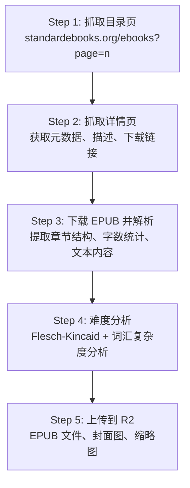

# Standard Ebooks 官方渠道数据盘点

> 从产品和运营角度，梳理 Standard Ebooks 可用数据及其对 Readmigo 的价值

---

## 1. Standard Ebooks 概述

| 项目 | 描述 |
|------|------|
| **网站** | https://standardebooks.org |
| **定位** | "为真正的书籍爱好者精心制作的免费电子书" |
| **书籍数量** | 1,000+ 本（2024年5月达到千书里程碑） |
| **内容来源** | 基于 Project Gutenberg、Internet Archive 等公共领域作品进行重新编辑和排版 |
| **版权状态** | 全部为美国公共领域作品，采用 CC0 1.0 通用许可 |
| **组织性质** | L³C（低利润有限责任公司），仅依靠读者捐赠运营 |
| **更新频率** | 持续更新，志愿者驱动 |

### 核心优势

1. **高质量编辑** - 专业校对、统一排版风格
2. **标准化格式** - 遵循严格的 EPUB3 规范
3. **丰富元数据** - 详细的书籍信息和分类
4. **多格式支持** - EPUB、KEPUB、AZW3
5. **无版权顾虑** - CC0 许可，可自由商用

---

### 2.1 Feed 订阅

| Feed 类型 | URL | 访问权限 | 用途 |
|-----------|-----|----------|------|
| **OPDS 1.2** | `/feeds/opds` | Patrons Circle | 电子书目录浏览、搜索、下载 |
| **Atom 1.0** | `/feeds/atom` | Patrons Circle | RSS 阅读器，信息最丰富 |
| **RSS 2.0** | `/feeds/rss` | Patrons Circle | 传统 RSS 阅读器兼容 |
| **New Releases (OPDS)** | `/feeds/opds/new-releases` | **公开** | 新书发布跟踪 |
| **New Releases (Atom)** | `/feeds/atom/new-releases` | **公开** | 新书发布跟踪 |
| **New Releases (RSS)** | `/feeds/rss/new-releases` | **公开** | 新书发布跟踪 |

> ⚠️ **访问限制**：除 New Releases 外，其他 Feed 需要成为 Patrons Circle 会员（捐赠）才能访问

### 2.2 批量下载 (Bulk Downloads)

需要 Patrons Circle 会员资格，提供以下分类的打包下载：

| 分类方式 | URL | 说明 |
|----------|-----|------|
| **By Subject** | `/bulk-downloads/subjects` | 按主题分类 |
| **By Collection** | `/bulk-downloads/collections` | 按合集分类 |
| **By Author** | `/bulk-downloads/authors` | 按作者分类 |
| **By Month** | `/bulk-downloads/months` | 按发布月份 |

下载包内容：
- 包含所有格式（EPUB、KEPUB、AZW3）
- 持续更新为最新版本
- ZIP 压缩包格式

### 2.3 GitHub 源代码库

| 仓库 | URL | 内容 |
|------|-----|------|
| **主仓库索引** | `github.com/standardebooks` | 所有书籍源文件 |
| **单书仓库** | `github.com/standardebooks/{author}_{title}` | 每本书独立仓库 |
| **工具集** | `github.com/standardebooks/tools` | 电子书制作工具 |
| **手册** | `github.com/standardebooks/manual` | 制作规范文档 |

每本书的 GitHub 仓库包含：
- 完整 EPUB 源文件
- `content.opf` 元数据文件
- 原始文本和 HTML
- 封面图片源文件
- 版本历史

### 2.4 网页抓取

通过网页抓取可获取：

**注意事项**：
- 遵守 robots.txt 规则
- 建议请求间隔 1-2 秒
- User-Agent 应标明来源

---

### 3.1 核心元数据（content.opf）

| 字段 | 标签/属性 | 说明 | Readmigo 对应字段 |
|------|-----------|------|-------------------|
| **标题** | `dc:title` | 书名 | `title` |
| **排序标题** | `meta[file-as]` | 用于排序的标题 | `titleNormalized` |
| **作者** | `dc:creator` | 作者名 | `author` |
| **作者排序名** | `meta[file-as]` | 姓在前的作者名 | - |
| **简介** | `dc:description` | 简短描述 | `description` |
| **详细介绍** | `se:long-description` | 百科式详细介绍 | `description` (扩展) |
| **语言** | `dc:language` | 语言代码 | `language` |
| **主题** | `dc:subject` | 主题分类（多个） | `subjects` |
| **出版日期** | `dc:date` | SE 首次发布日期 | `publishedAt` |
| **修改日期** | `dcterms:modified` | 最后更新日期 | `updatedAt` |

### 3.2 扩展元数据

| 字段 | 标签/属性 | 说明 | Readmigo 价值 |
|------|-----------|------|---------------|
| **GitHub URL** | `se:url.vcs.github` | 源代码库地址 | 可追踪更新 |
| **Wikipedia URL** | `se:url.encyclopedia.wikipedia` | 维基百科链接 | 丰富书籍信息 |
| **原始出版年** | 从文本推断 | 原著首次出版年份 | 经典判断 |
| **版本号** | `se:revision-number` | 电子书修订版本 | 版本管理 |
| **字数统计** | 需解析 | 总字数 | `wordCount` |

### 3.3 下载链接

每本书提供多种格式下载：

| 格式 | 文件名模式 | 适用设备 |
|------|-----------|----------|
| **EPUB** | `{slug}.epub` | 通用电子书阅读器 |
| **Advanced EPUB** | `{slug}_advanced.epub` | 支持高级 CSS 的阅读器 |
| **KEPUB** | `{slug}.kepub.epub` | Kobo 设备 |
| **AZW3** | `{slug}.azw3` | Kindle 设备 |

### 3.4 图片资源

| 类型 | 路径 | 尺寸 |
|------|------|------|
| **封面大图** | `/images/covers/{path}/cover.jpg` | 高清原图 |
| **封面缩略图** | `/images/covers/{path}/cover-thumbnail.jpg` | 缩略图 |
| **Hero 图** | `/images/covers/{path}/hero.jpg` | 横幅图 |

---

## 4. 主题分类体系 (Subjects)

Standard Ebooks 使用的主题分类：

### 4.1 小说类 (Fiction)

| 主题 | 示例作品 |
|------|----------|
| Fiction | 通用小说 |
| Adventure | 冒险小说 |
| Comedy | 喜剧 |
| Fantasy | 奇幻 |
| Gothic | 哥特 |
| Historical Fiction | 历史小说 |
| Horror | 恐怖 |
| Mystery | 悬疑推理 |
| Psychological Fiction | 心理小说 |
| Romance | 浪漫爱情 |
| Satire | 讽刺 |
| Science Fiction | 科幻 |
| Tragedy | 悲剧 |
| Thriller | 惊悚 |

### 4.2 非小说类 (Nonfiction)

| 主题 | 说明 |
|------|------|
| Autobiography | 自传 |
| Biography | 传记 |
| Essays | 散文随笔 |
| Letters | 书信集 |
| Memoir | 回忆录 |
| Philosophy | 哲学 |
| Spirituality | 灵性/宗教 |
| Travel | 游记 |

### 4.3 体裁类

| 主题 | 说明 |
|------|------|
| Drama | 戏剧 |
| Poetry | 诗歌 |
| Short Stories | 短篇小说集 |
| Novella | 中篇小说 |
| Children's | 儿童文学 |

---

### 5.1 数据字段映射

| Readmigo 字段 | Standard Ebooks 来源 | 可用性 |
|---------------|---------------------|--------|
| `title` | `dc:title` | ✅ 直接可用 |
| `author` | `dc:creator` | ✅ 直接可用 |
| `description` | `dc:description` + `se:long-description` | ✅ 直接可用 |
| `language` | `dc:language` | ✅ 直接可用 |
| `subjects` | `dc:subject` | ✅ 直接可用 |
| `genres` | 需从 subjects 映射 | ⚠️ 需要转换 |
| `epubUrl` | 下载链接构造 | ✅ 可构造 |
| `coverUrl` | `/images/covers/{path}/cover.jpg` | ✅ 可构造 |
| `coverThumbUrl` | `/images/covers/{path}/cover-thumbnail.jpg` | ✅ 可构造 |
| `wordCount` | 需解析 EPUB | ⚠️ 需要处理 |
| `chapterCount` | 需解析 EPUB | ⚠️ 需要处理 |
| `estimatedReadingMinutes` | 根据 wordCount 计算 | ⚠️ 需要计算 |
| `difficultyScore` | 需分析文本 | ❌ 需自行分析 |
| `fleschScore` | 需分析文本 | ❌ 需自行分析 |
| `sourceId` | URL slug | ✅ 可提取 |
| `sourceUrl` | 书籍详情页 URL | ✅ 直接可用 |
| `publishedAt` | `dc:date` | ✅ 直接可用 |
| `isClassic` | 固定为 true | ✅ SE 皆经典 |
| `editorialScore` | 固定高分 | ✅ SE 质量保证 |

### 5.2 数据缺口分析

| 缺失数据 | 解决方案 |
|----------|----------|
| **难度评分** | 使用 Flesch-Kincaid 算法自动分析 |
| **CEFR 等级** | 根据难度分析结果映射 |
| **章节信息** | 解析 EPUB spine 和 toc |
| **有声书** | SE 不提供，需对接 LibriVox |
| **下载量/热度** | SE 不公开，需自建热度系统 |

### 5.3 优先级建议

**P0 - 必须获取**：
- 书籍基础信息（标题、作者、描述）
- 分类信息（subjects → genres）
- 下载链接和封面图

**P1 - 重要补充**：
- 章节结构和字数统计
- 难度分析（自动生成）
- Wikipedia 链接（丰富作者/书籍信息）

**P2 - 增值数据**：
- GitHub 版本历史（追踪更新）
- 详细长描述（se:long-description）

---

### 6.1 推荐方案

### 6.2 已有实现

项目中已实现的数据导入脚本：

| 文件 | 功能 |
|------|------|
| `scripts/book-ingestion/sources/standard-ebooks.ts` | 完整导入流程 |
| `apps/backend/src/modules/import/standard-ebooks.scraper.ts` | 后端抓取服务 |

### 6.3 数据同步策略

| 场景 | 策略 |
|------|------|
| **初始导入** | 全量抓取所有书籍（约 1000 本） |
| **日常更新** | 监控 New Releases Feed（公开可用） |
| **版本更新** | 定期对比 GitHub 仓库 commit 历史 |

---

## 7. 对比：Standard Ebooks vs Project Gutenberg

| 维度 | Standard Ebooks | Project Gutenberg |
|------|-----------------|-------------------|
| **书籍数量** | ~1,000 本 | 76,000+ 本 |
| **质量** | 高（专业编辑） | 参差不齐 |
| **格式规范** | 严格 EPUB3 | 多种格式，不统一 |
| **元数据** | 丰富且结构化 | 基础，需额外处理 |
| **封面图** | 统一风格，高质量 | 有些缺失或质量低 |
| **API** | 无官方 API，有 Feed | 无官方 API，有 OPDS/Gutendex |
| **更新频率** | 持续（志愿者） | 持续 |
| **商用许可** | CC0，完全自由 | 公共领域，可商用 |
| **适合场景** | 精选高质量内容 | 海量内容库 |

---

## 8. 参考资源

- [Standard Ebooks 官网](https://standardebooks.org/)
- [Standard Ebooks GitHub](https://github.com/standardebooks)
- [Standard Ebooks Manual - Metadata](https://github.com/standardebooks/manual/blob/master/9-metadata.rst)
- [OPDS 1.2 规范](https://specs.opds.io/opds-1.2.html)
- [Standard Ebooks Wikipedia](https://en.wikipedia.org/wiki/Standard_Ebooks)

---

*文档更新日期: 2024-12-24*
