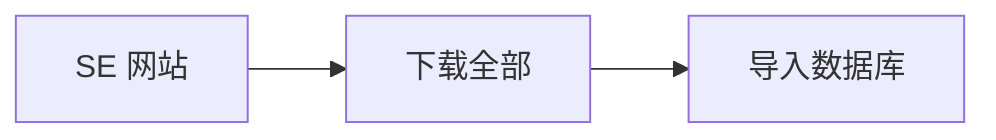
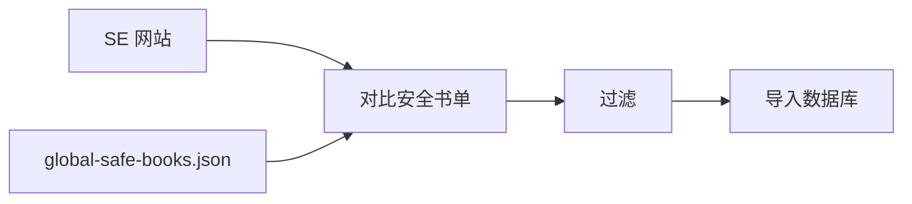

# Standard Ebooks 全球版权安全评估

> Readmigo 商业使用 SE 内容的版权合规分析与全球安全书单

---

## 一、评估背景

| 项目 | 内容 |
|------|------|
| 评估日期 | 2026-01-27 |
| 评估目的 | 确认 SE 书籍用于商业产品的版权风险 |
| 产品性质 | Readmigo - 商业盈利产品 |
| 目标市场 | 全球 (iOS/Android App Store) |

---

## 二、SE 授权条款

### 2.1 官方声明

```
┌─────────────────────────────────────────────────────────────┐
│                 Standard Ebooks 授权条款                     │
├─────────────────────────────────────────────────────────────┤
│                                                               │
│  许可证: CC0 1.0 Universal (公共领域奉献)                     │
│                                                               │
│  "Content produced by or for Standard Ebooks L³C is          │
│   dedicated to the public domain via the CC0 1.0             │
│   Universal Public Domain Dedication."                       │
│                                                               │
│  权利说明:                                                    │
│  ✅ 商业使用 - 明确允许                                       │
│  ✅ 修改权 - 可自由修改                                       │
│  ✅ 分发权 - 无限制                                           │
│  ❌ 署名要求 - 无需署名                                       │
│                                                               │
└─────────────────────────────────────────────────────────────┘
```

### 2.2 内容来源

| 组成部分 | 版权状态 | 说明 |
|----------|----------|------|
| 原文文本 | 美国公共领域 | 出版于 1930 年前 |
| SE 排版/CSS | CC0 | SE 自有工作 |
| SE 封面设计 | CC0 | SE 自有工作 |
| 翻译文本 | 需逐一核实 | 原作公共领域 ≠ 翻译公共领域 |

---

## 三、国际版权差异

### 3.1 各地区规则

```
┌─────────────────────────────────────────────────────────────┐
│                    版权保护期限对比                           │
├─────────────────────────────────────────────────────────────┤
│                                                               │
│  🇺🇸 美国                                                     │
│  ├── 规则: 出版后 95 年                                       │
│  ├── 1930 年前出版 = 公共领域                                 │
│  └── SE 全部书籍符合 ✅                                       │
│                                                               │
│  🇪🇺 欧盟                                                     │
│  ├── 规则: 作者去世后 70 年                                   │
│  ├── 1956 年前去世 = 公共领域                                 │
│  └── 部分书籍不符合 ⚠️                                        │
│                                                               │
│  🇯🇵 日本                                                     │
│  ├── 规则: 作者去世后 70 年                                   │
│  ├── 1956 年前去世 = 公共领域                                 │
│  └── 部分书籍不符合 ⚠️                                        │
│                                                               │
│  🇨🇳 中国                                                     │
│  ├── 规则: 作者去世后 50 年                                   │
│  ├── 1976 年前去世 = 公共领域                                 │
│  └── 大部分书籍符合 ✅                                        │
│                                                               │
└─────────────────────────────────────────────────────────────┘
```

### 3.2 风险示例

| 作者 | 去世年份 | 美国 | 欧盟/日本 | 中国 |
|------|----------|:----:|:---------:|:----:|
| Charles Dickens | 1870 | ✅ | ✅ | ✅ |
| F. Scott Fitzgerald | 1940 | ✅ | ✅ | ✅ |
| George Orwell | 1950 | ✅ | ✅ | ✅ |
| Virginia Woolf | 1941 | ✅ | ✅ | ✅ |
| Agatha Christie | 1976 | ✅ | ❌ | ✅ |
| Ernest Hemingway | 1961 | ✅ | ❌ | ❌ |
| Aldous Huxley | 1963 | ✅ | ❌ | ❌ |

---

## 四、全球安全书单

### 4.1 统计概览

```
┌─────────────────────────────────────────────────────────────┐
│                    书籍分类统计                               │
├─────────────────────────────────────────────────────────────┤
│                                                               │
│  SE 总书籍数: 1373                                            │
│                                                               │
│  ┌─────────────────────────────────────────────────────┐    │
│  │ 全球安全 (作者去世 ≥70年)         858 本   62.5%    │    │
│  │ ████████████████████████████░░░░░░░░░░░░░░░░░░░░░░░ │    │
│  └─────────────────────────────────────────────────────┘    │
│                                                               │
│  ┌─────────────────────────────────────────────────────┐    │
│  │ 仅美国安全 (作者去世 <70年)       183 本   13.3%    │    │
│  │ ██████░░░░░░░░░░░░░░░░░░░░░░░░░░░░░░░░░░░░░░░░░░░░░ │    │
│  └─────────────────────────────────────────────────────┘    │
│                                                               │
│  ┌─────────────────────────────────────────────────────┐    │
│  │ 待验证 (作者信息缺失)             332 本   24.2%    │    │
│  │ ███████████░░░░░░░░░░░░░░░░░░░░░░░░░░░░░░░░░░░░░░░░ │    │
│  └─────────────────────────────────────────────────────┘    │
│                                                               │
└─────────────────────────────────────────────────────────────┘
```

### 4.2 安全书籍 Top 作者

| 排名 | 作者 | 书籍数 | 去世年份 |
|:----:|------|:------:|:--------:|
| 1 | William Shakespeare | 39 | 1616 |
| 2 | Edgar Rice Burroughs | 24 | 1950 |
| 3 | Anthony Trollope | 22 | 1882 |
| 4 | Edgar Wallace | 19 | 1932 |
| 5 | Jules Verne | 19 | 1905 |
| 6 | Honoré de Balzac | 17 | 1850 |
| 7 | George Bernard Shaw | 16 | 1950 |
| 8 | Charles Dickens | 14 | 1870 |
| 9 | H. G. Wells | 14 | 1946 |
| 10 | Joseph Conrad | 13 | 1924 |

### 4.3 不安全作者（需排除）

| 作者 | 去世年份 | 书籍数 | 风险地区 |
|------|:--------:|:------:|----------|
| Agatha Christie | 1976 | 12 | 欧盟、日本 |
| P. G. Wodehouse | 1975 | 8 | 欧盟、日本 |
| Aldous Huxley | 1963 | 4 | 欧盟、日本、中国 |
| C. S. Lewis | 1963 | 3 | 欧盟、日本、中国 |
| Andre Norton | 2005 | 10 | 全球（除美国） |
| Isaac Asimov | 1992 | 5 | 全球（除美国） |

---

## 五、数据文件

### 5.1 生成文件

| 文件 | 位置 | 说明 |
|------|------|------|
| 全球安全书单 | `api/data/booklists/global-safe-books.json` | 858 本完整列表 |
| 作者数据库 | `api/data/booklists/author-death-years.json` | 392 位作者信息 |
| SE 完整目录 | `api/data/booklists/standard-ebooks-catalog.json` | 1373 本全目录 |

### 5.2 数据结构

```
global-safe-books.json
├── criteria                    # 筛选标准说明
├── summary                     # 统计摘要
│   ├── totalSEBooks: 1373
│   ├── globallySafe: 858
│   ├── usOnlySafe: 183
│   └── needsVerification: 332
├── safeBooks[]                 # 全球安全书籍列表
│   ├── slug
│   ├── url
│   ├── author
│   └── deathYear
├── unsafeBooks[]               # 仅美国安全书籍
│   ├── slug
│   ├── url
│   ├── author
│   ├── deathYear
│   └── reason
└── unknownAuthors[]            # 待验证作者列表
```

---

## 六、Readmigo 实施建议

### 6.1 内容策略选项

```
┌─────────────────────────────────────────────────────────────┐
│                      策略对比                                 │
├─────────────────────────────────────────────────────────────┤
│                                                               │
│  方案 A: 保守策略 (推荐)                                      │
│  ───────────────────────                                     │
│  内容范围: 仅使用 858 本全球安全书籍                          │
│  优点:                                                        │
│  • 100% 全球合规                                              │
│  • 无版权纠纷风险                                             │
│  • App Store 审核无障碍                                       │
│  缺点:                                                        │
│  • 缺少部分热门作者 (Agatha Christie 等)                      │
│  适用: 全球发布                                               │
│                                                               │
│  ─────────────────────────────────────────────────────────   │
│                                                               │
│  方案 B: 区域策略                                             │
│  ───────────────────────                                     │
│  美国市场: 全部 1041 本 (858+183)                             │
│  其他市场: 858 本安全书籍                                     │
│  优点:                                                        │
│  • 美国用户内容更丰富                                         │
│  • 其他地区仍合规                                             │
│  缺点:                                                        │
│  • 需要服务端地区过滤逻辑                                     │
│  • 维护复杂度增加                                             │
│  适用: 美国为主要市场                                         │
│                                                               │
│  ─────────────────────────────────────────────────────────   │
│                                                               │
│  方案 C: 声明策略 (不推荐)                                    │
│  ───────────────────────                                     │
│  内容范围: 使用全部 SE 书籍                                   │
│  措施: 添加版权免责声明                                       │
│  风险:                                                        │
│  • 可能面临版权投诉                                           │
│  • App Store 可能下架                                         │
│  • 商业产品不建议采用                                         │
│                                                               │
└─────────────────────────────────────────────────────────────┘
```

### 6.2 推荐实施方案

| 阶段 | 行动 | 说明 |
|------|------|------|
| V2.0 | 使用方案 A | 仅导入 858 本全球安全书籍 |
| 后续 | 补充验证 | 逐步验证 332 本待确认书籍 |
| 扩展 | 按需添加 | 根据用户需求评估方案 B |

### 6.3 技术实现

**当前流程:**



**调整后流程:**



**过滤逻辑:**

```
if book.slug in safeBooks:
    import(book)
else:
    skip(book, reason='not globally safe')
```

---

## 七、法律声明建议

### 7.1 App 内声明

```
本应用提供的电子书内容来源于 Standard Ebooks 项目，
均为公共领域作品。内容依据美国版权法认定为公共领域，
在其他国家/地区的版权状态可能有所不同。
```

### 7.2 用户协议条款

```
第 X 条 内容版权

X.1 本应用提供的电子书均来源于公共领域。

X.2 内容版权状态依据美国法律认定，用户应知悉
    不同国家/地区可能存在版权差异。

X.3 如您所在地区对特定内容存在版权限制，
    请遵守当地法律法规。
```

---

## 八、相关文档

| 文档 | 说明 |
|------|------|
| [SE 数据盘点](./data-inventory.md) | SE 内容详细统计 |
| [SE vs EPUB 3 对比](./se-vs-epub3-comparison.md) | 格式技术对比 |
| [V2.0 发布计划](../../../08-releases/roadmap/v2-fullstack-release-plan.md) | 版本发布规划 |
| [数据清洗记录](../../../10-pipeline/execution-logs/P006-v2-data-cleanup.md) | 导入执行日志 |

---

## 九、参考来源

- [Standard Ebooks - About](https://standardebooks.org/about)
- [CC0 1.0 Universal](https://creativecommons.org/publicdomain/zero/1.0/)
- [Cornell Copyright Term](https://copyright.cornell.edu/publicdomain)
- [Public Domain Day 2024](https://copyrightlately.com/public-domain-day-2024/)

---

*文档创建日期: 2026-01-27*
