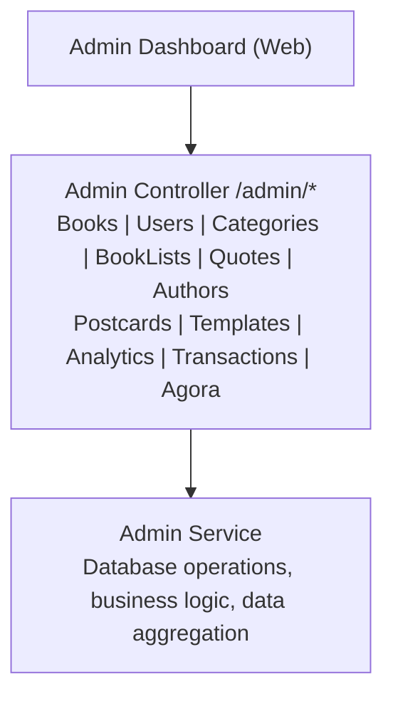

# Admin Module

Backend administration module for content and user management.

---

## Overview

| Item | Description |
|------|-------------|
| Path | `apps/backend/src/modules/admin/` |
| Auth | None (internal use only) |
| Access | Admin dashboard only |

---

## Architecture



---

## API Endpoints

### Books Management

| Method | Endpoint | Description |
|--------|----------|-------------|
| GET | `/admin/books` | List books (paginated, filterable) |
| GET | `/admin/books/:id` | Get book details |
| POST | `/admin/books` | Create book |
| PUT | `/admin/books/:id` | Update book (full) |
| PATCH | `/admin/books/:id` | Update book (partial) |
| DELETE | `/admin/books/:id` | Delete book |
| POST | `/admin/books/:id/publish` | Publish book |
| POST | `/admin/books/:id/unpublish` | Unpublish book |

#### Query Parameters (GET /admin/books)

| Param | Type | Description |
|-------|------|-------------|
| page | number | Page number (default: 1) |
| limit | number | Items per page (default: 20) |
| sortBy | string | Sort field (default: createdAt) |
| sortOrder | asc/desc | Sort direction (default: desc) |
| search | string | Search in title/author |
| status | string | Filter by status |
| source | string | Filter by source |
| language | en/zh | Filter by language |
| minDifficulty | number | Min difficulty score |
| maxDifficulty | number | Max difficulty score |

### Users Management

| Method | Endpoint | Description |
|--------|----------|-------------|
| GET | `/admin/users` | List users (paginated, filterable) |
| GET | `/admin/users/:id` | Get user details |
| GET | `/admin/users/:id/billing` | Get billing info |
| GET | `/admin/users/:id/reading` | Get reading data |
| GET | `/admin/users/:id/vocabulary` | Get vocabulary data |
| GET | `/admin/users/:id/deletion-logs` | Get deletion history |
| GET | `/admin/users/:id/account-graph` | Get account relationships |
| GET | `/admin/users/:id/export` | Export user data (GDPR) |

#### Query Parameters (GET /admin/users)

| Param | Type | Description |
|-------|------|-------------|
| page | number | Page number |
| limit | number | Items per page |
| search | string | Search email, name, ID, deviceId |
| accountType | GUEST/REGISTERED | Filter by account type |
| status | enum | ACTIVE, SUSPENDED, MERGED, etc. |
| deviceId | string | Exact device ID match |
| appleId | string | Exact Apple ID match |
| googleId | string | Exact Google ID match |
| subscriptionStatus | enum | ACTIVE, EXPIRED, CANCELLED, TRIAL |
| hasSubscription | boolean | Has active subscription |
| createdAfter | ISO date | Created after date |
| createdBefore | ISO date | Created before date |
| hasBoundAccount | boolean | Has linked account |

### Account Deletion Management

| Method | Endpoint | Description |
|--------|----------|-------------|
| GET | `/admin/accounts/pending-deletion` | Get users pending deletion |
| POST | `/admin/accounts/:id/execute-deletion` | Force execute deletion |
| POST | `/admin/accounts/:id/cancel-deletion` | Cancel pending deletion |

### Categories Management

| Method | Endpoint | Description |
|--------|----------|-------------|
| GET | `/admin/categories` | Get all (tree structure) |
| GET | `/admin/categories/:id` | Get category |
| POST | `/admin/categories` | Create category |
| PUT | `/admin/categories/:id` | Update category |
| DELETE | `/admin/categories/:id` | Delete category |
| PUT | `/admin/categories/reorder` | Reorder categories |

### BookLists Management

| Method | Endpoint | Description |
|--------|----------|-------------|
| GET | `/admin/booklists` | List book lists |
| GET | `/admin/booklists/:id` | Get book list |
| POST | `/admin/booklists` | Create book list |
| PUT | `/admin/booklists/:id` | Update book list |
| PATCH | `/admin/booklists/:id` | Partial update |
| DELETE | `/admin/booklists/:id` | Delete book list |
| POST | `/admin/booklists/:id/publish` | Publish |
| POST | `/admin/booklists/:id/unpublish` | Unpublish |
| POST | `/admin/booklists/:id/duplicate` | Duplicate |
| GET | `/admin/booklists/:id/items` | Get items |
| POST | `/admin/booklists/:id/items` | Add items |
| DELETE | `/admin/booklists/:id/items/:bookId` | Remove item |
| PUT | `/admin/booklists/:id/items/reorder` | Reorder items |

### Quotes Management

| Method | Endpoint | Description |
|--------|----------|-------------|
| GET | `/admin/quotes` | List quotes |
| GET | `/admin/quotes/:id` | Get quote |
| POST | `/admin/quotes` | Create quote |
| PUT | `/admin/quotes/:id` | Update quote |
| DELETE | `/admin/quotes/:id` | Delete quote |

### Postcard Templates

| Method | Endpoint | Description |
|--------|----------|-------------|
| GET | `/admin/postcard-templates` | List templates |
| GET | `/admin/postcard-templates/:id` | Get template |
| POST | `/admin/postcard-templates` | Create template |
| PUT | `/admin/postcard-templates/:id` | Update template |
| DELETE | `/admin/postcard-templates/:id` | Delete template |

### Postcards (User-created)

| Method | Endpoint | Description |
|--------|----------|-------------|
| GET | `/admin/postcards` | List postcards |
| GET | `/admin/postcards/:id` | Get postcard |
| DELETE | `/admin/postcards/:id` | Delete postcard |

### Authors Management

| Method | Endpoint | Description |
|--------|----------|-------------|
| GET | `/admin/authors` | List authors |
| GET | `/admin/authors/:id` | Get author |
| PUT | `/admin/authors/:id` | Update author |
| PATCH | `/admin/authors/:id` | Partial update |
| GET | `/admin/author-timeline-events` | Get timeline events |
| GET | `/admin/author-quotes` | Get author quotes |

### Transactions

| Method | Endpoint | Description |
|--------|----------|-------------|
| GET | `/admin/transactions` | List transactions |

#### Query Parameters

| Param | Type | Description |
|-------|------|-------------|
| status | enum | ACTIVE, COMPLETED, PENDING_PAYMENT, etc. |
| planType | enum | FREE, PRO, PREMIUM |
| startDate | ISO date | Filter start date |
| endDate | ISO date | Filter end date |

### Analytics

| Method | Endpoint | Description |
|--------|----------|-------------|
| GET | `/admin/analytics/overview` | Dashboard overview stats |
| GET | `/admin/analytics/top-books` | Top books by readers |
| GET | `/admin/ai/stats` | AI service statistics |

### Agora Management

| Method | Endpoint | Description |
|--------|----------|-------------|
| GET | `/admin/agora/stats` | Get Agora statistics |
| POST | `/admin/agora/import` | Import posts from real data sources |

---

## Data Models

### Book Query Filters

```typescript
interface BookQueryDto {
  page?: number;
  limit?: number;
  sortBy?: string;
  sortOrder?: 'asc' | 'desc';
  search?: string;
  status?: string;
  source?: string;
  minDifficulty?: number;
  maxDifficulty?: number;
  language?: string;
  contentLanguage?: 'en' | 'zh';
}
```

### User Query Filters

```typescript
interface UserQueryDto {
  page?: number;
  limit?: number;
  sortBy?: string;
  sortOrder?: 'asc' | 'desc';
  search?: string;
  englishLevel?: string;
  planType?: string;
  accountType?: 'GUEST' | 'REGISTERED';
  status?: 'ACTIVE' | 'SUSPENDED' | 'MERGED' | 'PENDING_DELETION' | 'DELETED';
  deviceId?: string;
  appleId?: string;
  googleId?: string;
  subscriptionStatus?: string;
  hasSubscription?: boolean;
  createdAfter?: string;
  createdBefore?: string;
  hasBoundAccount?: boolean;
}
```

---

## Related Documentation

- [Dashboard Spec](../dashboard/spec.md)
- [User Management](../account/user-management.md)
- [Content Classification](../content/classification-system.md)
