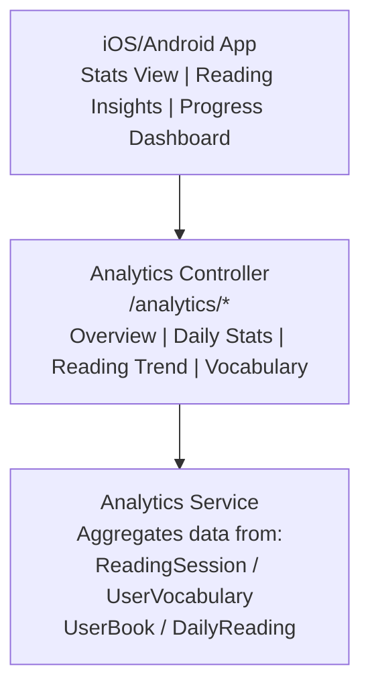
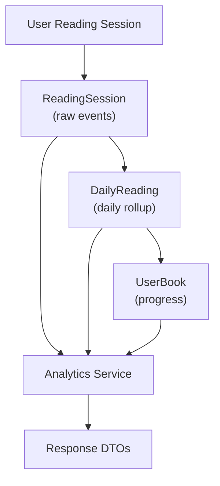

# Analytics Module

User analytics and reading statistics module.

---

## Overview

| Item | Description |
|------|-------------|
| Path | `apps/backend/src/modules/analytics/` |
| Auth | JWT required |
| Purpose | User reading statistics and progress tracking |

---

## Architecture



---

## API Endpoints

| Method | Endpoint | Description |
|--------|----------|-------------|
| GET | `/analytics/overview` | User overview statistics |
| GET | `/analytics/daily` | Daily statistics |
| GET | `/analytics/reading-trend` | Reading trend over time |
| GET | `/analytics/vocabulary-progress` | Vocabulary learning progress |
| GET | `/analytics/reading-progress` | Reading progress and recent activity |

---

## Endpoint Details

### GET /analytics/overview

Returns aggregate user statistics.

**Response: OverviewStatsDto**

```typescript
interface OverviewStatsDto {
  totalReadingTime: number;      // Total minutes read
  totalBooksStarted: number;     // Books added to library
  totalBooksCompleted: number;   // Books finished
  totalWordsRead: number;        // Estimated words read
  totalVocabulary: number;       // Words in vocabulary
  currentStreak: number;         // Current reading streak days
  longestStreak: number;         // Longest streak ever
  averageSessionLength: number;  // Avg minutes per session
  favoriteGenre?: string;        // Most read genre
  readingLevel?: string;         // Current reading level
}
```

### GET /analytics/daily

Returns daily reading statistics.

**Query Parameters:**

| Param | Type | Default | Description |
|-------|------|---------|-------------|
| startDate | ISO date | 30 days ago | Start of range |
| endDate | ISO date | today | End of range |
| groupBy | day/week/month | day | Aggregation level |

**Response: DailyStatsDto[]**

```typescript
interface DailyStatsDto {
  date: string;           // ISO date
  readingTime: number;    // Minutes read
  wordsRead: number;      // Estimated words
  pagesRead: number;      // Pages completed
  sessionsCount: number;  // Number of sessions
  newVocabulary: number;  // New words added
  booksRead: string[];    // Book IDs read that day
}
```

### GET /analytics/reading-trend

Returns reading activity trend over time.

**Query Parameters:**

| Param | Type | Default | Description |
|-------|------|---------|-------------|
| days | number | 30 | Number of days to analyze |

**Response: ReadingTrendDto**

```typescript
interface ReadingTrendDto {
  trend: 'increasing' | 'stable' | 'decreasing';
  averageDaily: number;          // Avg minutes/day
  thisWeekTotal: number;         // This week total
  lastWeekTotal: number;         // Last week total
  percentChange: number;         // Week-over-week change
  dailyData: DailyReading[];     // Daily breakdown
  weeklyData: WeeklyReading[];   // Weekly breakdown
}
```

### GET /analytics/vocabulary-progress

Returns vocabulary learning statistics.

**Response:**

```typescript
interface VocabularyProgressDto {
  totalWords: number;           // Total saved words
  masteredWords: number;        // Fully learned
  learningWords: number;        // In progress
  newWords: number;             // Recently added
  reviewDue: number;            // Words due for review
  weeklyProgress: {
    date: string;
    added: number;
    reviewed: number;
    mastered: number;
  }[];
  topCategories: {
    category: string;
    count: number;
  }[];
}
```

### GET /analytics/reading-progress

Returns current reading progress across books.

**Response:**

```typescript
interface ReadingProgressDto {
  currentlyReading: {
    bookId: string;
    title: string;
    progress: number;      // 0-100
    lastReadAt: string;
    estimatedTimeLeft: number;  // Minutes
  }[];
  recentActivity: {
    date: string;
    bookId: string;
    title: string;
    duration: number;
    chaptersRead: number;
  }[];
  completedThisMonth: number;
  goalProgress?: {
    dailyGoal: number;
    todayProgress: number;
    weeklyGoal: number;
    weekProgress: number;
  };
}
```

---

## Data Flow



---

## Caching Strategy

| Data | Cache Duration | Invalidation |
|------|----------------|--------------|
| Overview stats | 5 minutes | On new session end |
| Daily stats | 1 hour | Daily rollup job |
| Reading trend | 15 minutes | On data change |
| Vocabulary progress | 10 minutes | On word add/review |

---

## Related Documentation

- [Reading Duration System](../infrastructure/reading-duration-system.md)
- [Vocabulary System](../learning/vocabulary-design.md)
- [Annual Report](../features/annual-reading-report-design.md)
