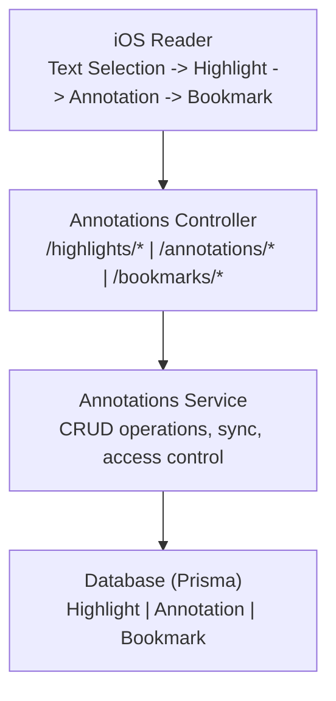

# Annotations Module

Highlights, notes, and bookmarks management module.

---

## Overview

| Item | Description |
|------|-------------|
| Path | `apps/backend/src/modules/annotations/` |
| Auth | JWT required |
| Purpose | Manage user highlights, annotations, and bookmarks |

---

## Architecture



---

## Data Models

### Highlight

```
┌─────────────────────────────────────┐
│            Highlight                 │
├─────────────────────────────────────┤
│ id          : string (uuid)         │
│ userId      : string                │
│ userBookId  : string                │
│ chapterId   : string                │
│ startOffset : number                │
│ endOffset   : number                │
│ cfiRange    : string (optional)     │
│ selectedText: string                │
│ color       : HighlightColor        │
│ createdAt   : DateTime              │
│ updatedAt   : DateTime              │
│ syncedAt    : DateTime (optional)   │
├─────────────────────────────────────┤
│ annotations : Annotation[]          │
└─────────────────────────────────────┘
```

**HighlightColor enum:**
- yellow
- green
- blue
- pink
- purple
- orange

### Annotation

```
┌─────────────────────────────────────┐
│           Annotation                 │
├─────────────────────────────────────┤
│ id          : string (uuid)         │
│ userId      : string                │
│ highlightId : string (optional)     │
│ userBookId  : string                │
│ chapterId   : string                │
│ cfi         : string (optional)     │
│ note        : string                │
│ isPublic    : boolean               │
│ aiSummary   : string (optional)     │
│ createdAt   : DateTime              │
│ updatedAt   : DateTime              │
│ syncedAt    : DateTime (optional)   │
├─────────────────────────────────────┤
│ highlight   : Highlight (optional)  │
└─────────────────────────────────────┘
```

### Bookmark

```
┌─────────────────────────────────────┐
│            Bookmark                  │
├─────────────────────────────────────┤
│ id             : string (uuid)      │
│ userId         : string             │
│ userBookId     : string             │
│ chapterId      : string             │
│ cfi            : string (optional)  │
│ scrollPosition : number (optional)  │
│ pageNumber     : number (optional)  │
│ title          : string (optional)  │
│ excerpt        : string (optional)  │
│ createdAt      : DateTime           │
│ updatedAt      : DateTime           │
│ syncedAt       : DateTime (optional)│
└─────────────────────────────────────┘
```

---

## API Endpoints

### Highlights

| Method | Endpoint | Description |
|--------|----------|-------------|
| POST | `/highlights` | Create highlight |
| GET | `/highlights` | Get all user highlights |
| GET | `/highlights/:id` | Get highlight by ID |
| PATCH | `/highlights/:id` | Update highlight (color) |
| DELETE | `/highlights/:id` | Delete highlight |
| GET | `/books/:bookId/highlights` | Get book highlights |

#### Create Highlight Request

```typescript
interface CreateHighlightDto {
  userBookId: string;
  chapterId: string;
  startOffset: number;
  endOffset: number;
  cfiRange?: string;
  selectedText: string;
  color: 'yellow' | 'green' | 'blue' | 'pink' | 'purple' | 'orange';
}
```

#### Update Highlight Request

```typescript
interface UpdateHighlightDto {
  color?: 'yellow' | 'green' | 'blue' | 'pink' | 'purple' | 'orange';
}
```

### Annotations

| Method | Endpoint | Description |
|--------|----------|-------------|
| POST | `/annotations` | Create annotation |
| GET | `/annotations` | Get all user annotations |
| GET | `/annotations/:id` | Get annotation by ID |
| PATCH | `/annotations/:id` | Update annotation |
| DELETE | `/annotations/:id` | Delete annotation |
| GET | `/highlights/:highlightId/annotations` | Get highlight annotations |

#### Create Annotation Request

```typescript
interface CreateAnnotationDto {
  highlightId?: string;      // Optional link to highlight
  userBookId: string;
  chapterId: string;
  cfi?: string;
  note: string;
  isPublic?: boolean;
}
```

#### Update Annotation Request

```typescript
interface UpdateAnnotationDto {
  note?: string;
  isPublic?: boolean;
}
```

### Bookmarks

| Method | Endpoint | Description |
|--------|----------|-------------|
| POST | `/bookmarks` | Create bookmark |
| GET | `/bookmarks` | Get all user bookmarks |
| DELETE | `/bookmarks/:id` | Delete bookmark |
| GET | `/books/:bookId/bookmarks` | Get book bookmarks |

#### Create Bookmark Request

```typescript
interface CreateBookmarkDto {
  userBookId: string;
  chapterId: string;
  cfi?: string;
  scrollPosition?: number;
  pageNumber?: number;
  title?: string;
  excerpt?: string;
}
```

### Offline Sync

| Method | Endpoint | Description |
|--------|----------|-------------|
| POST | `/annotations/sync` | Sync offline changes |

#### Sync Request

```typescript
interface SyncAnnotationsDto {
  highlights?: Array<CreateHighlightDto & { localId: string }>;
  annotations?: Array<CreateAnnotationDto & { localId: string }>;
  bookmarks?: Array<CreateBookmarkDto & { localId: string }>;
  deletedHighlightIds?: string[];
  deletedAnnotationIds?: string[];
  deletedBookmarkIds?: string[];
}
```

#### Sync Response

```typescript
interface SyncResponse {
  created: {
    highlights: Array<{ localId: string; serverId: string }>;
    annotations: Array<{ localId: string; serverId: string }>;
    bookmarks: Array<{ localId: string; serverId: string }>;
  };
  deleted: {
    highlightIds: string[];
    annotationIds: string[];
    bookmarkIds: string[];
  };
  conflicts: Array<{
    type: 'highlight' | 'annotation' | 'bookmark';
    localId: string;
    reason: string;
  }>;
}
```

---

## Response DTOs

### HighlightResponseDto

```typescript
interface HighlightResponseDto {
  id: string;
  userBookId: string;
  chapterId: string;
  startOffset: number;
  endOffset: number;
  cfiRange?: string;
  selectedText: string;
  color: string;
  createdAt: string;
  updatedAt: string;
}
```

### HighlightWithAnnotationsDto

```typescript
interface HighlightWithAnnotationsDto extends HighlightResponseDto {
  annotations: AnnotationResponseDto[];
  book: {
    id: string;
    title: string;
    coverUrl?: string;
  };
}
```

### AnnotationResponseDto

```typescript
interface AnnotationResponseDto {
  id: string;
  highlightId?: string;
  userBookId: string;
  chapterId: string;
  cfi?: string;
  note: string;
  isPublic: boolean;
  aiSummary?: string;
  createdAt: string;
  updatedAt: string;
}
```

### BookmarkResponseDto

```typescript
interface BookmarkResponseDto {
  id: string;
  userBookId: string;
  chapterId: string;
  cfi?: string;
  scrollPosition?: number;
  pageNumber?: number;
  title?: string;
  excerpt?: string;
  createdAt: string;
}
```

---

## Error Responses

| Status | Error | Description |
|--------|-------|-------------|
| 404 | UserBook not found | Book not in user's library |
| 404 | Highlight not found | Highlight doesn't exist |
| 404 | Annotation not found | Annotation doesn't exist |
| 404 | Bookmark not found | Bookmark doesn't exist |
| 403 | Access denied | User doesn't own resource |
| 409 | Conflict | Bookmark exists at position |

---

## iOS Integration

```
┌─────────────────────────────────────────────────────┐
│               iOS Client                             │
├─────────────────────────────────────────────────────┤
│                                                     │
│  BookmarkManager.swift                              │
│  ├── Local storage (CoreData/SQLite)               │
│  ├── Sync queue management                         │
│  └── Conflict resolution                           │
│                                                     │
│  HighlightManager.swift                            │
│  ├── Text selection handling                       │
│  ├── Color management                              │
│  └── Cross-paragraph support                       │
│                                                     │
│  AnnotationEditor.swift                            │
│  ├── Note input UI                                 │
│  ├── Highlight linking                             │
│  └── AI summary integration                        │
│                                                     │
└─────────────────────────────────────────────────────┘
```

---

## Related Documentation

- [Reader Module](./reader.md)
- [Offline Support](../ios/offline-support.md)
- [Data Sync](../infrastructure/data-sync-and-release-workflow.md)
