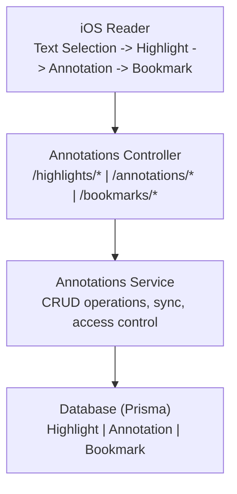

# Annotations Module

Highlights, notes, and bookmarks management module.

---

## Overview

| Item | Description |
|------|-------------|
| Path | `src/modules/annotations/` |
| Auth | JWT required |
| Purpose | Manage user highlights, annotations, and bookmarks |

---

## Architecture



---

## Data Models

### Highlight

```
┌─────────────────────────────────────┐
│            Highlight                 │
├─────────────────────────────────────┤
│ id          : string (uuid)         │
│ userId      : string                │
│ userBookId  : string                │
│ chapterId   : string                │
│ startOffset : number                │
│ endOffset   : number                │
│ cfiRange    : string (optional)     │
│ selectedText: string                │
│ color       : HighlightColor        │
│ createdAt   : DateTime              │
│ updatedAt   : DateTime              │
│ syncedAt    : DateTime (optional)   │
├─────────────────────────────────────┤
│ annotations : Annotation[]          │
└─────────────────────────────────────┘
```

**HighlightColor enum:**
- yellow
- green
- blue
- pink
- purple
- orange

### Annotation

```
┌─────────────────────────────────────┐
│           Annotation                 │
├─────────────────────────────────────┤
│ id          : string (uuid)         │
│ userId      : string                │
│ highlightId : string (optional)     │
│ userBookId  : string                │
│ chapterId   : string                │
│ cfi         : string (optional)     │
│ note        : string                │
│ isPublic    : boolean               │
│ aiSummary   : string (optional)     │
│ createdAt   : DateTime              │
│ updatedAt   : DateTime              │
│ syncedAt    : DateTime (optional)   │
├─────────────────────────────────────┤
│ highlight   : Highlight (optional)  │
└─────────────────────────────────────┘
```

### Bookmark

```
┌─────────────────────────────────────┐
│            Bookmark                  │
├─────────────────────────────────────┤
│ id             : string (uuid)      │
│ userId         : string             │
│ userBookId     : string             │
│ chapterId      : string             │
│ cfi            : string (optional)  │
│ scrollPosition : number (optional)  │
│ pageNumber     : number (optional)  │
│ title          : string (optional)  │
│ excerpt        : string (optional)  │
│ createdAt      : DateTime           │
│ updatedAt      : DateTime           │
│ syncedAt       : DateTime (optional)│
└─────────────────────────────────────┘
```

---

## API Endpoints

### Highlights

| Method | Endpoint | Description |
|--------|----------|-------------|
| POST | `/highlights` | Create highlight |
| GET | `/highlights` | Get all user highlights |
| GET | `/highlights/:id` | Get highlight by ID |
| PATCH | `/highlights/:id` | Update highlight (color) |
| DELETE | `/highlights/:id` | Delete highlight |
| GET | `/books/:bookId/highlights` | Get book highlights |

#### Create Highlight Request

| Field | Type | Required | Description |
|-------|------|----------|-------------|
| userBookId | string | Yes | User's book ID |
| chapterId | string | Yes | Chapter ID |
| startOffset | number | Yes | Start character offset |
| endOffset | number | Yes | End character offset |
| cfiRange | string | No | EPUB CFI range |
| selectedText | string | Yes | Selected text content |
| color | enum | Yes | yellow, green, blue, pink, purple, orange |

#### Update Highlight Request

| Field | Type | Required | Description |
|-------|------|----------|-------------|
| color | enum | No | yellow, green, blue, pink, purple, orange |

### Annotations

| Method | Endpoint | Description |
|--------|----------|-------------|
| POST | `/annotations` | Create annotation |
| GET | `/annotations` | Get all user annotations |
| GET | `/annotations/:id` | Get annotation by ID |
| PATCH | `/annotations/:id` | Update annotation |
| DELETE | `/annotations/:id` | Delete annotation |
| GET | `/highlights/:highlightId/annotations` | Get highlight annotations |

#### Create Annotation Request

| Field | Type | Required | Description |
|-------|------|----------|-------------|
| highlightId | string | No | Optional link to highlight |
| userBookId | string | Yes | User's book ID |
| chapterId | string | Yes | Chapter ID |
| cfi | string | No | EPUB CFI position |
| note | string | Yes | Annotation text |
| isPublic | boolean | No | Public visibility |

#### Update Annotation Request

| Field | Type | Required | Description |
|-------|------|----------|-------------|
| note | string | No | Updated annotation text |
| isPublic | boolean | No | Updated visibility |

### Bookmarks

| Method | Endpoint | Description |
|--------|----------|-------------|
| POST | `/bookmarks` | Create bookmark |
| GET | `/bookmarks` | Get all user bookmarks |
| DELETE | `/bookmarks/:id` | Delete bookmark |
| GET | `/books/:bookId/bookmarks` | Get book bookmarks |

#### Create Bookmark Request

| Field | Type | Required | Description |
|-------|------|----------|-------------|
| userBookId | string | Yes | User's book ID |
| chapterId | string | Yes | Chapter ID |
| cfi | string | No | EPUB CFI position |
| scrollPosition | number | No | Scroll position |
| pageNumber | number | No | Page number |
| title | string | No | Bookmark title |
| excerpt | string | No | Text excerpt |

### Offline Sync

| Method | Endpoint | Description |
|--------|----------|-------------|
| POST | `/annotations/sync` | Sync offline changes |

#### Sync Request

| Field | Type | Description |
|-------|------|-------------|
| highlights | array (optional) | Highlights to create (with localId) |
| annotations | array (optional) | Annotations to create (with localId) |
| bookmarks | array (optional) | Bookmarks to create (with localId) |
| deletedHighlightIds | string[] (optional) | Highlight IDs to delete |
| deletedAnnotationIds | string[] (optional) | Annotation IDs to delete |
| deletedBookmarkIds | string[] (optional) | Bookmark IDs to delete |

#### Sync Response

| Field | Type | Description |
|-------|------|-------------|
| created.highlights | array | Each entry: localId, serverId |
| created.annotations | array | Each entry: localId, serverId |
| created.bookmarks | array | Each entry: localId, serverId |
| deleted | object | Lists of deleted IDs by type |
| conflicts | array | Each entry: type, localId, reason |

---

## Response DTOs

### HighlightResponseDto

| Field | Type | Description |
|-------|------|-------------|
| id | string | Highlight UUID |
| userBookId | string | User's book ID |
| chapterId | string | Chapter ID |
| startOffset / endOffset | number | Character offsets |
| cfiRange | string (optional) | EPUB CFI range |
| selectedText | string | Highlighted text |
| color | string | Highlight color |
| createdAt / updatedAt | string | Timestamps |

### HighlightWithAnnotationsDto

Extends HighlightResponseDto with:
- **annotations**: Array of AnnotationResponseDto
- **book**: Object with id, title, coverUrl

### AnnotationResponseDto

| Field | Type | Description |
|-------|------|-------------|
| id | string | Annotation UUID |
| highlightId | string (optional) | Linked highlight |
| userBookId / chapterId | string | Location identifiers |
| cfi | string (optional) | EPUB CFI position |
| note | string | Annotation text |
| isPublic | boolean | Visibility flag |
| aiSummary | string (optional) | AI-generated summary |
| createdAt / updatedAt | string | Timestamps |

### BookmarkResponseDto

| Field | Type | Description |
|-------|------|-------------|
| id | string | Bookmark UUID |
| userBookId / chapterId | string | Location identifiers |
| cfi | string (optional) | EPUB CFI position |
| scrollPosition | number (optional) | Scroll position |
| pageNumber | number (optional) | Page number |
| title | string (optional) | Bookmark title |
| excerpt | string (optional) | Text excerpt |
| createdAt | string | Creation timestamp |

---

## Error Responses

| Status | Error | Description |
|--------|-------|-------------|
| 404 | UserBook not found | Book not in user's library |
| 404 | Highlight not found | Highlight doesn't exist |
| 404 | Annotation not found | Annotation doesn't exist |
| 404 | Bookmark not found | Bookmark doesn't exist |
| 403 | Access denied | User doesn't own resource |
| 409 | Conflict | Bookmark exists at position |

---

## iOS Integration

```
┌─────────────────────────────────────────────────────┐
│               iOS Client                             │
├─────────────────────────────────────────────────────┤
│                                                     │
│  BookmarkManager.swift                              │
│  ├── Local storage (CoreData/SQLite)               │
│  ├── Sync queue management                         │
│  └── Conflict resolution                           │
│                                                     │
│  HighlightManager.swift                            │
│  ├── Text selection handling                       │
│  ├── Color management                              │
│  └── Cross-paragraph support                       │
│                                                     │
│  AnnotationEditor.swift                            │
│  ├── Note input UI                                 │
│  ├── Highlight linking                             │
│  └── AI summary integration                        │
│                                                     │
└─────────────────────────────────────────────────────┘
```

---

## Related Documentation

- [Reader Module](./reader.md)
- [Offline Support](../ios/offline-support.md)
- [Data Sync](../infrastructure/data-sync-and-release-workflow.md)
