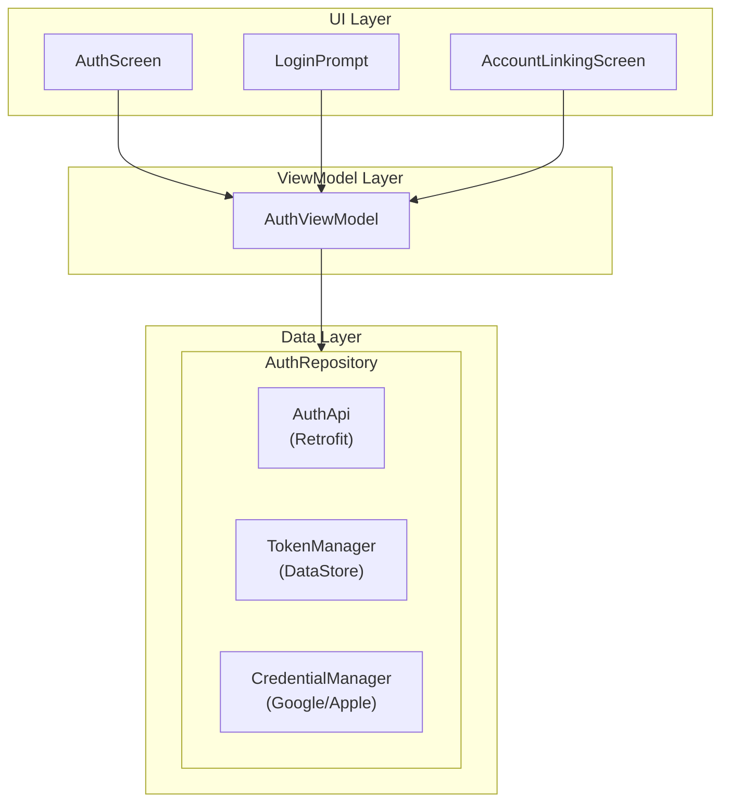

# Auth 模块

> 认证与登录系统 - 跨平台统一文档

---

## 1. 概述

### 1.1 功能范围

| 功能 | 说明 | 优先级 |
|------|------|--------|
| Google 登录 | OAuth 2.0 登录 | P0 |
| Apple 登录 | Sign in with Apple | P0 |
| Email 登录 | 邮箱密码登录 (Web only) | P1 |
| JWT Token 管理 | 安全存储与自动刷新 | P0 |
| 登录状态持久化 | 记住登录状态 | P0 |
| 登出 | 清除本地数据 | P0 |
| 访客模式 | 无需登录浏览 | P1 |

### 1.2 平台实现对比

| 功能 | Android | React Native | Web |
|------|---------|--------------|-----|
| Google 登录 | Credential Manager | @react-native-google-signin | NextAuth.js |
| Apple 登录 | WebView OAuth | expo-apple-authentication | NextAuth.js |
| Token 存储 | EncryptedSharedPreferences | expo-secure-store | Cookie/JWT |
| 状态管理 | StateFlow | Zustand | Zustand + NextAuth |

---

## 2. 数据模型

### 2.1 用户模型

**User**

| Field | Type | Description |
|-------|------|-------------|
| id | string | User UUID |
| email | string | Email address |
| displayName | string | Display name |
| avatarUrl | string (optional) | Avatar image URL |
| subscriptionTier | free / premium | Subscription tier |
| createdAt | string | Account creation date |
| profile | UserProfile (optional) | Learning profile |

**UserProfile**

| Field | Type | Description |
|-------|------|-------------|
| englishLevel | enum | beginner / intermediate / advanced |
| learningGoal | enum | casual / regular / intensive |
| interests | string[] | Interest categories |
| dailyGoalMinutes | number | Daily reading goal in minutes |

**AuthTokens**: accessToken, refreshToken, expiresAt

**AuthProvider**: google, apple, email

---

## 3. API 接口

### 3.1 认证端点

| 端点 | 方法 | 说明 |
|------|------|------|
| `/auth/google` | POST | Google 登录 |
| `/auth/apple` | POST | Apple 登录 |
| `/auth/refresh` | POST | 刷新 Token |
| `/auth/session` | DELETE | 撤销会话 |
| `/users/me` | GET | 获取当前用户 |

### 3.2 请求/响应格式

**Google 登录请求**: idToken (required), accessToken (optional)

**Apple 登录请求**: identityToken, authorizationCode (both required), user info (optional: email, fullName)

**认证响应**: accessToken, refreshToken, expiresIn, user object

**刷新 Token 请求**: refreshToken (required)

---

## 4. Android 实现

### 4.1 架构

### 4.2 Token Manager

Uses EncryptedSharedPreferences with AES-256-GCM encryption. Exposes auth state via StateFlow. Key operations: saveTokens, getAccessToken, getRefreshToken, isTokenExpired, clearTokens.

### 4.3 Google Sign-In

Uses Android Credential Manager API with GoogleIdOption. Configures serverClientId, disabled authorized account filtering, and auto-select.

---

## 5. React Native 实现

### 5.1 依赖

- expo-apple-authentication, expo-secure-store, expo-auth-session
- @react-native-google-signin/google-signin

### 5.2 Zustand Store

Auth store uses Zustand with persist middleware and expo-secure-store for encrypted storage. State includes: user, tokens, isAuthenticated, isLoading, isGuestMode, error. Actions: setUser, setTokens, logout, enterGuestMode.

### 5.3 Apple Sign-In

Uses expo-apple-authentication requesting FULL_NAME and EMAIL scopes. On success, sends identityToken and authorizationCode to backend auth API.

---

## 6. Web 实现

### 6.1 NextAuth.js 配置

Uses NextAuth with Google and Apple providers. JWT strategy with 30-day max age. Custom pages: /login (sign in), /onboarding (new user). JWT callback enriches token with user ID and subscription tier.

### 6.2 Server Actions

Server actions for loginWithGoogle and loginWithApple, both redirecting to /library on success.

---

## 7. 安全考虑

| 平台 | Token 存储 | 传输加密 | 自动刷新 |
|------|-----------|----------|----------|
| Android | EncryptedSharedPreferences (AES-256) | HTTPS + Certificate Pinning | 提前 5 分钟刷新 |
| React Native | expo-secure-store (Keychain/Keystore) | HTTPS | 请求失败时刷新 |
| Web | HttpOnly Cookie / JWT | HTTPS | NextAuth 自动处理 |

### 7.1 通用安全措施

1. **Token 有效期**: Access Token 7 天，Refresh Token 30 天
2. **401 处理**: 自动重试一次，失败则清除登录状态
3. **登出清理**: 清除所有本地存储的认证信息

---

## 8. 测试用例

| Test Case | Description |
|-----------|-------------|
| Login success | User set correctly after login |
| Guest mode | Guest mode activation |
| Logout | All auth data cleared on logout |
| Token refresh | Auto-refresh when token expired |
| Login cancellation | Graceful handling of user cancellation |

---

*最后更新: 2025-12-28*
