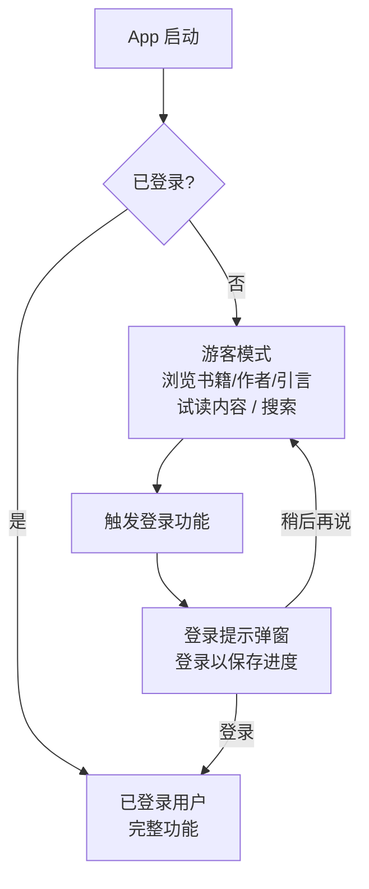

# Guest Mode 模块

> 游客模式系统 - 跨平台统一文档

---

## 1. 概述

### 1.1 功能描述

Guest Mode 模块允许用户在不登录的情况下浏览内容，只在需要特定功能时才提示登录（非强制）。

**可使用功能（浏览型）**：
- 浏览书籍列表、查看书籍详情
- 查看精选书单和书单内容
- 查看作者资料、简介、作品
- 查看每日引言、趋势引言
- 搜索书籍、作者、引言
- 试读书籍部分内容
- 语言设置、主题设置

**限制功能（需登录）**：
- 完整书籍下载
- 阅读进度同步
- 书签/高亮/笔记
- 生词本云端同步
- 有声书完整播放
- 社交功能
- AI 交互
- 成就/徽章

### 1.2 平台实现对比

| 功能 | Android | React Native | Web |
|------|---------|--------------|-----|
| 匿名用户 | DataStore | AsyncStorage | localStorage |
| 数据存储 | Room (本地) | SQLite + AsyncStorage | Zustand persist |
| 功能限制 | Feature Flags | Zustand Store | Zustand Store |
| 迁移到账户 | API 上传 | API + 本地合并 | Server Action |
| 登录提示 | AlertDialog | React Native Modal | Dialog |

---

## 2. 数据模型

### 2.1 TypeScript 类型定义

```typescript
// 访客状态
interface GuestState {
  isGuest: boolean;
  guestId: string;                    // 本地生成的唯一 ID
  createdAt: Date;
  expiresAt: Date;                    // 数据过期时间 (30天)
  usage: GuestUsage;
  localData: GuestLocalData;
}

// 访客使用统计
interface GuestUsage {
  booksViewed: number;                // 浏览过的书籍数
  chaptersRead: number;               // 阅读过的章节数
  aiQueriesUsed: number;              // 已使用的 AI 查询数
  aiQueriesLimit: number;             // AI 查询限制
  trialBooksDownloaded: string[];     // 已下载的试读书籍 ID
  trialDownloadLimit: number;         // 试读下载限制
}

// 访客本地数据
interface GuestLocalData {
  readingProgress: GuestReadingProgress[];
  vocabulary: GuestVocabulary[];
  bookmarks: GuestBookmark[];
  settings: GuestSettings;
}

interface GuestReadingProgress {
  bookId: string;
  chapterIndex: number;
  position: string;                   // CFI
  percentage: number;
  lastReadAt: Date;
}

interface GuestVocabulary {
  id: string;
  word: string;
  translation: string;
  definitions: string[];
  bookId?: string;
  createdAt: Date;
}

interface GuestBookmark {
  id: string;
  bookId: string;
  position: string;
  note?: string;
  createdAt: Date;
}

interface GuestSettings {
  theme: 'light' | 'dark' | 'system';
  fontSize: number;
  language: string;
}

// 功能限制配置
interface GuestLimits {
  maxTrialBooks: number;              // 最多试读书籍数 (3)
  maxTrialChapters: number;           // 每本书最多试读章节数 (3)
  aiQueriesPerDay: number;            // 每日 AI 查询限制 (5-10)
  maxVocabulary: number;              // 最多保存生词数 (20-50)
  canAccessAudiobooks: boolean;       // 是否可访问有声书
  canAccessSocial: boolean;           // 是否可访问社交功能
}

// 功能访问结果
interface FeatureAccessResult {
  allowed: boolean;
  reason?: GuestLimitReason;
  limit?: number;
  used?: number;
  resetAt?: Date;
}

type GuestLimitReason =
  | 'login_required'
  | 'guest_limit'
  | 'trial_limit_reached'
  | 'ai_limit_reached'
  | 'feature_unavailable'
  | 'requires_pro';

// 功能名称
type FeatureName =
  | 'read_book'
  | 'add_vocabulary'
  | 'use_ai'
  | 'sync_progress'
  | 'audiobook'
  | 'unlimited_books'
  | 'export_data'
  | 'social_features';
```

---

## 3. 功能限制配置

```typescript
const GUEST_LIMITS: GuestLimits = {
  maxTrialBooks: 3,
  maxTrialChapters: 3,
  aiQueriesPerDay: 5,
  maxVocabulary: 50,
  canAccessAudiobooks: false,
  canAccessSocial: false,
};

// 功能权限配置
const FEATURE_PERMISSIONS: FeaturePermission[] = [
  {
    feature: 'read_book',
    guestAccess: true,
    guestLimit: 3,
    guestLimitPeriod: 'total',
    requiresAuth: false,
  },
  {
    feature: 'add_vocabulary',
    guestAccess: true,
    guestLimit: 20,
    guestLimitPeriod: 'total',
    requiresAuth: false,
  },
  {
    feature: 'use_ai',
    guestAccess: true,
    guestLimit: 10,
    guestLimitPeriod: 'day',
    requiresAuth: false,
  },
  {
    feature: 'sync_progress',
    guestAccess: false,
    requiresAuth: true,
  },
  {
    feature: 'audiobook',
    guestAccess: false,
    requiresAuth: true,
    requiresPro: true,
  },
  {
    feature: 'unlimited_books',
    guestAccess: false,
    requiresAuth: true,
  },
  {
    feature: 'social_features',
    guestAccess: false,
    requiresAuth: true,
  },
];
```

---

## 4. 用户流程



---

## 5. Android 实现

### 5.1 AuthViewModel 扩展

```kotlin
@HiltViewModel
class AuthViewModel @Inject constructor(
    private val authRepository: AuthRepository
) : ViewModel() {

    private val _authState = MutableStateFlow<AuthState>(AuthState.Loading)
    val authState: StateFlow<AuthState> = _authState.asStateFlow()

    private val _loginPromptEvent = MutableSharedFlow<LoginPromptEvent>()
    val loginPromptEvent = _loginPromptEvent.asSharedFlow()

    val isGuestMode: Boolean
        get() = authState.value is AuthState.Unauthenticated

    val isAuthenticated: Boolean
        get() = authState.value is AuthState.Authenticated

    fun requireLogin(
        feature: String,
        onLogin: () -> Unit,
        onDismiss: () -> Unit
    ) {
        if (isAuthenticated) {
            onLogin()
        } else {
            viewModelScope.launch {
                _loginPromptEvent.emit(LoginPromptEvent(feature, onLogin, onDismiss))
            }
        }
    }
}

sealed class AuthState {
    object Loading : AuthState()
    data class Authenticated(val user: User) : AuthState()
    object Unauthenticated : AuthState()
}

data class LoginPromptEvent(
    val feature: String,
    val onLogin: () -> Unit,
    val onDismiss: () -> Unit
)
```

### 5.2 登录提示弹窗

```kotlin
@Composable
fun LoginPromptDialog(
    feature: String,
    onLogin: () -> Unit,
    onDismiss: () -> Unit
) {
    AlertDialog(
        onDismissRequest = onDismiss,
        title = { Text(text = stringResource(R.string.login_required)) },
        text = { Text(text = getLoginPromptMessage(feature)) },
        confirmButton = {
            TextButton(onClick = onLogin) {
                Text(stringResource(R.string.login))
            }
        },
        dismissButton = {
            TextButton(onClick = onDismiss) {
                Text(stringResource(R.string.later))
            }
        }
    )
}

@Composable
private fun getLoginPromptMessage(feature: String): String {
    return when (feature) {
        "add_to_library" -> stringResource(R.string.login_prompt_add_to_library)
        "bookmark" -> stringResource(R.string.login_prompt_bookmark)
        "vocabulary" -> stringResource(R.string.login_prompt_vocabulary)
        "quote_like" -> stringResource(R.string.login_prompt_quote_like)
        "ai_interaction" -> stringResource(R.string.login_prompt_ai)
        "reading_progress" -> stringResource(R.string.login_prompt_progress)
        else -> stringResource(R.string.login_prompt_default)
    }
}
```

### 5.3 Modifier 扩展

```kotlin
fun Modifier.requiresLogin(
    authViewModel: AuthViewModel,
    feature: String,
    onAuthenticated: () -> Unit
): Modifier = composed {
    var showLoginPrompt by remember { mutableStateOf(false) }

    if (showLoginPrompt) {
        LoginPromptDialog(
            feature = feature,
            onLogin = {
                showLoginPrompt = false
                // 导航到登录页面
            },
            onDismiss = { showLoginPrompt = false }
        )
    }

    this.clickable {
        if (authViewModel.isAuthenticated) {
            onAuthenticated()
        } else {
            showLoginPrompt = true
        }
    }
}

// 使用示例
@Composable
fun BookDetailScreen(authViewModel: AuthViewModel = hiltViewModel()) {
    Button(
        onClick = { /* 由 Modifier 处理 */ },
        modifier = Modifier.requiresLogin(
            authViewModel = authViewModel,
            feature = "add_to_library",
            onAuthenticated = { addToLibrary() }
        )
    ) {
        Text("添加到书架")
    }
}
```

### 5.4 CompositionLocal 简化

```kotlin
val LocalAuthViewModel = compositionLocalOf<AuthViewModel> {
    error("AuthViewModel not provided")
}

@Composable
fun ReadmigoApp() {
    val authViewModel: AuthViewModel = hiltViewModel()

    CompositionLocalProvider(LocalAuthViewModel provides authViewModel) {
        NavHost(...)
    }
}

@Composable
fun RequireLoginButton(
    feature: String,
    onClick: () -> Unit,
    content: @Composable () -> Unit
) {
    val authViewModel = LocalAuthViewModel.current
    var showLoginPrompt by remember { mutableStateOf(false) }

    if (showLoginPrompt) {
        LoginPromptDialog(
            feature = feature,
            onLogin = {
                showLoginPrompt = false
                // Navigate to login
            },
            onDismiss = { showLoginPrompt = false }
        )
    }

    Button(
        onClick = {
            if (authViewModel.isAuthenticated) {
                onClick()
            } else {
                showLoginPrompt = true
            }
        }
    ) { content() }
}
```

---

## 6. React Native 实现

### 6.1 Zustand Store

```typescript
import { create } from 'zustand';
import { persist, createJSONStorage } from 'zustand/middleware';
import { immer } from 'zustand/middleware/immer';
import AsyncStorage from '@react-native-async-storage/async-storage';
import { v4 as uuid } from 'uuid';

const GUEST_LIMITS: GuestLimits = {
  maxTrialBooks: 3,
  maxTrialChapters: 3,
  aiQueriesPerDay: 5,
  maxVocabulary: 50,
  canAccessAudiobooks: false,
  canAccessSocial: false,
};

export const useGuestStore = create<GuestStoreState & GuestStoreActions>()(
  persist(
    immer((set, get) => ({
      isGuest: true,
      guestId: '',
      createdAt: new Date(),
      usage: {
        booksViewed: 0,
        chaptersRead: 0,
        aiQueriesUsed: 0,
        aiQueriesLimit: GUEST_LIMITS.aiQueriesPerDay,
        trialBooksDownloaded: [],
        trialDownloadLimit: GUEST_LIMITS.maxTrialBooks,
      },
      localData: {
        readingProgress: [],
        vocabulary: [],
        bookmarks: [],
      },
      limits: GUEST_LIMITS,

      initializeGuest: () => set((state) => {
        if (!state.guestId) {
          state.guestId = uuid();
          state.createdAt = new Date();
        }
      }),

      canDownloadBook: (bookId) => {
        const { usage, limits } = get();
        if (usage.trialBooksDownloaded.includes(bookId)) {
          return { allowed: true };
        }
        if (usage.trialBooksDownloaded.length >= limits.maxTrialBooks) {
          return {
            allowed: false,
            reason: 'trial_limit_reached',
            limit: limits.maxTrialBooks,
            used: usage.trialBooksDownloaded.length,
          };
        }
        return { allowed: true };
      },

      canReadChapter: (bookId, chapterIndex) => {
        const { limits } = get();
        if (chapterIndex >= limits.maxTrialChapters) {
          return {
            allowed: false,
            reason: 'trial_limit_reached',
            limit: limits.maxTrialChapters,
            used: chapterIndex,
          };
        }
        return { allowed: true };
      },

      canUseAI: () => {
        const { usage, limits } = get();
        if (usage.aiQueriesUsed >= limits.aiQueriesPerDay) {
          return {
            allowed: false,
            reason: 'ai_limit_reached',
            limit: limits.aiQueriesPerDay,
            used: usage.aiQueriesUsed,
          };
        }
        return { allowed: true };
      },

      saveReadingProgress: (progress) => set((state) => {
        const existing = state.localData.readingProgress.findIndex(
          p => p.bookId === progress.bookId
        );
        if (existing >= 0) {
          state.localData.readingProgress[existing] = progress;
        } else {
          state.localData.readingProgress.push(progress);
        }
      }),

      addVocabulary: (vocab) => set((state) => {
        if (state.localData.vocabulary.length < state.limits.maxVocabulary) {
          state.localData.vocabulary.push({
            ...vocab,
            id: uuid(),
            createdAt: new Date(),
          });
        }
      }),

      getLocalDataForMigration: () => get().localData,

      clearGuestData: () => set((state) => {
        state.isGuest = false;
        state.usage = { /* reset */ };
        state.localData = { readingProgress: [], vocabulary: [], bookmarks: [] };
      }),

      resetDailyLimits: () => set((state) => {
        state.usage.aiQueriesUsed = 0;
      }),
    })),
    {
      name: 'guest-storage',
      storage: createJSONStorage(() => AsyncStorage),
    }
  )
);
```

### 6.2 useGuestMode Hook

```typescript
export function useGuestMode() {
  const { isAuthenticated } = useAuthStore();
  const {
    isGuest,
    usage,
    limits,
    canDownloadBook,
    canReadChapter,
    canUseAI,
    canAccessFeature,
    incrementAIQueries,
    addTrialDownload,
  } = useGuestStore();

  const isGuestMode = !isAuthenticated && isGuest;

  const checkFeatureAccess = useCallback((
    feature: 'download' | 'readChapter' | 'ai' | 'audiobooks' | 'social',
    params?: { bookId?: string; chapterIndex?: number }
  ): FeatureAccessResult => {
    if (!isGuestMode) return { allowed: true };

    switch (feature) {
      case 'download':
        return canDownloadBook(params?.bookId || '');
      case 'readChapter':
        return canReadChapter(params?.bookId || '', params?.chapterIndex || 0);
      case 'ai':
        return canUseAI();
      case 'audiobooks':
        return canAccessFeature('canAccessAudiobooks');
      case 'social':
        return canAccessFeature('canAccessSocial');
      default:
        return { allowed: true };
    }
  }, [isGuestMode, canDownloadBook, canReadChapter, canUseAI, canAccessFeature]);

  const useAIQuery = useCallback(() => {
    if (isGuestMode) incrementAIQueries();
  }, [isGuestMode, incrementAIQueries]);

  const downloadBook = useCallback((bookId: string) => {
    if (isGuestMode) addTrialDownload(bookId);
  }, [isGuestMode, addTrialDownload]);

  return {
    isGuestMode,
    usage,
    limits,
    checkFeatureAccess,
    useAIQuery,
    downloadBook,
  };
}
```

### 6.3 登录提示组件

```typescript
interface LoginPromptProps {
  reason: GuestLimitReason;
  limit?: number;
  used?: number;
  feature?: string;
}

export function LoginPrompt({ reason, limit, used, feature }: LoginPromptProps) {
  const router = useRouter();

  const getMessage = () => {
    switch (reason) {
      case 'login_required':
        return '登录后即可使用此功能';
      case 'trial_limit_reached':
        return `免费试用已达上限（${used}/${limit}）`;
      case 'ai_limit_reached':
        return `今日 AI 查询已用完（${used}/${limit}）`;
      case 'feature_unavailable':
        return `${feature || '此功能'}仅对注册用户开放`;
      default:
        return '请登录以继续';
    }
  };

  return (
    <View style={styles.container}>
      <View style={styles.iconContainer}>
        <Ionicons name="lock-closed" size={32} color="#2D5A7B" />
      </View>
      <Text style={styles.message}>{getMessage()}</Text>
      <Text style={styles.description}>
        注册免费账户，解锁全部功能，同步你的阅读进度
      </Text>
      <Pressable style={styles.loginButton} onPress={() => router.push('/login')}>
        <Text style={styles.loginButtonText}>登录 / 注册</Text>
      </Pressable>
      <Pressable style={styles.laterButton} onPress={() => router.back()}>
        <Text style={styles.laterButtonText}>稍后再说</Text>
      </Pressable>
    </View>
  );
}
```

### 6.4 功能门控 HOC

```typescript
interface GuestGuardOptions {
  feature: 'download' | 'readChapter' | 'ai' | 'audiobooks' | 'social';
  params?: { bookId?: string; chapterIndex?: number };
}

export function withGuestGuard<P extends object>(
  WrappedComponent: React.ComponentType<P>,
  options: GuestGuardOptions
) {
  return function GuestGuardedComponent(props: P) {
    const { checkFeatureAccess } = useGuestMode();
    const access = checkFeatureAccess(options.feature, options.params);

    if (!access.allowed && access.reason) {
      return (
        <LoginPrompt
          reason={access.reason}
          limit={access.limit}
          used={access.used}
        />
      );
    }

    return <WrappedComponent {...props} />;
  };
}

// 使用示例
const GuardedAudiobookPlayer = withGuestGuard(AudiobookPlayer, { feature: 'audiobooks' });
```

---

## 7. Web 实现

### 7.1 Zustand Store

```typescript
import { create } from 'zustand';
import { persist } from 'zustand/middleware';
import { v4 as uuidv4 } from 'uuid';

const DEFAULT_SETTINGS: GuestSettings = {
  theme: 'system',
  fontSize: 18,
  language: 'zh-CN',
};

export const useGuestStore = create<GuestState>()(
  persist(
    (set, get) => ({
      guestData: null,
      isGuest: false,
      featureUsage: {} as Record<FeatureName, { count: number; lastReset: Date }>,

      initializeGuest: () => {
        const existing = get().guestData;
        if (existing) {
          set({ isGuest: true });
          return;
        }

        const now = new Date();
        const expiresAt = new Date(now);
        expiresAt.setDate(expiresAt.getDate() + 30);

        const guestData: GuestData = {
          id: uuidv4(),
          createdAt: now,
          expiresAt,
          readingProgress: [],
          vocabulary: [],
          settings: DEFAULT_SETTINGS,
        };

        set({ guestData, isGuest: true });
      },

      clearGuestData: () => set({
        guestData: null,
        isGuest: false,
        featureUsage: {},
      }),

      incrementFeatureUsage: (feature) => set((state) => {
        const now = new Date();
        const usage = state.featureUsage[feature] ?? { count: 0, lastReset: now };
        return {
          featureUsage: {
            ...state.featureUsage,
            [feature]: { count: usage.count + 1, lastReset: usage.lastReset },
          },
        };
      }),

      getFeatureUsage: (feature) => get().featureUsage[feature]?.count ?? 0,

      getExportData: () => get().guestData,
    }),
    { name: 'guest-storage' }
  )
);
```

### 7.2 useFeatureAccess Hook

```typescript
export function useFeatureAccess() {
  const { isAuthenticated } = useAuth();
  const { isPro } = useSubscription();
  const { isGuest, getFeatureUsage, incrementFeatureUsage } = useGuestStore();

  const checkAccess = useCallback((feature: FeatureName): FeatureAccessResult => {
    const permission = getFeaturePermission(feature);

    // 已登录用户
    if (isAuthenticated) {
      if (permission.requiresPro && !isPro) {
        return { allowed: false, reason: 'requires_pro' };
      }
      return { allowed: true };
    }

    // 访客用户
    if (!permission.guestAccess) {
      return { allowed: false, reason: 'requires_auth' };
    }

    // 检查限制
    if (permission.guestLimit !== undefined) {
      const usage = getFeatureUsage(feature);
      if (usage >= permission.guestLimit) {
        return { allowed: false, reason: 'guest_limit', remaining: 0 };
      }
      return { allowed: true, remaining: permission.guestLimit - usage };
    }

    return { allowed: true };
  }, [isAuthenticated, isPro, isGuest, getFeatureUsage]);

  const useFeature = useCallback((feature: FeatureName): boolean => {
    const access = checkAccess(feature);
    if (access.allowed && !isAuthenticated) {
      incrementFeatureUsage(feature);
    }
    return access.allowed;
  }, [checkAccess, isAuthenticated, incrementFeatureUsage]);

  return { checkAccess, useFeature };
}
```

### 7.3 登录提示对话框

```tsx
interface LoginPromptProps {
  open: boolean;
  onOpenChange: (open: boolean) => void;
  feature: string;
  reason: 'guest_limit' | 'requires_auth' | 'requires_pro';
}

export function LoginPrompt({ open, onOpenChange, feature, reason }: LoginPromptProps) {
  const getContent = () => {
    switch (reason) {
      case 'guest_limit':
        return { title: '访客限制已达上限', description: `免费体验次数已用完。登录账户即可继续使用${feature}功能。` };
      case 'requires_auth':
        return { title: '需要登录', description: `登录账户后即可使用${feature}功能。` };
      case 'requires_pro':
        return { title: '需要升级', description: `${feature}是 Pro 专属功能，升级后即可使用。` };
    }
  };

  const content = getContent();
  const benefits = [
    { icon: Cloud, text: '数据云端同步，多设备无缝切换' },
    { icon: Users, text: '加入读书社区，与书友互动' },
    { icon: Lock, text: '解锁更多高级功能' },
  ];

  return (
    <Dialog open={open} onOpenChange={onOpenChange}>
      <DialogContent>
        <DialogHeader>
          <DialogTitle className="text-center">{content.title}</DialogTitle>
          <DialogDescription className="text-center">{content.description}</DialogDescription>
        </DialogHeader>
        <div className="space-y-3 py-4">
          {benefits.map((benefit, i) => (
            <div key={i} className="flex items-center gap-3">
              <benefit.icon className="w-4 h-4" />
              <span className="text-sm">{benefit.text}</span>
            </div>
          ))}
        </div>
        <DialogFooter className="flex-col gap-2">
          <Button asChild className="w-full">
            <Link href="/auth/login">登录 / 注册</Link>
          </Button>
          <Button variant="ghost" onClick={() => onOpenChange(false)}>稍后再说</Button>
        </DialogFooter>
      </DialogContent>
    </Dialog>
  );
}
```

### 7.4 功能门控组件

```tsx
interface FeatureGateProps {
  feature: FeatureName;
  children: React.ReactNode;
  fallback?: React.ReactNode;
}

export function FeatureGate({ feature, children, fallback }: FeatureGateProps) {
  const { checkAccess } = useFeatureAccess();
  const access = checkAccess(feature);

  if (access.allowed) {
    return <>{children}</>;
  }

  return fallback ?? null;
}

interface FeatureGateButtonProps {
  feature: FeatureName;
  featureLabel: string;
  onClick: () => void;
  children: React.ReactNode;
}

export function FeatureGateButton({ feature, featureLabel, onClick, children }: FeatureGateButtonProps) {
  const { checkAccess, useFeature } = useFeatureAccess();
  const [showPrompt, setShowPrompt] = useState(false);
  const [promptReason, setPromptReason] = useState<'guest_limit' | 'requires_auth' | 'requires_pro'>('requires_auth');

  const handleClick = useCallback(() => {
    const access = checkAccess(feature);
    if (!access.allowed) {
      setPromptReason(access.reason!);
      setShowPrompt(true);
      return;
    }
    useFeature(feature);
    onClick();
  }, [feature, checkAccess, useFeature, onClick]);

  return (
    <>
      <button onClick={handleClick}>{children}</button>
      <LoginPrompt open={showPrompt} onOpenChange={setShowPrompt} feature={featureLabel} reason={promptReason} />
    </>
  );
}
```

---

## 8. 数据迁移

### 8.1 迁移服务

```typescript
// React Native / Web
export async function migrateGuestDataToAccount(): Promise<void> {
  const guestStore = useGuestStore.getState();
  const localData = guestStore.getLocalDataForMigration();

  if (isEmpty(localData)) return;

  try {
    // 上传阅读进度
    if (localData.readingProgress.length > 0) {
      await apiClient.post('/users/me/reading-progress/import', {
        progress: localData.readingProgress,
      });
    }

    // 上传生词本
    if (localData.vocabulary.length > 0) {
      await apiClient.post('/users/me/vocabulary/import', {
        words: localData.vocabulary,
      });
    }

    // 上传书签
    if (localData.bookmarks.length > 0) {
      await apiClient.post('/users/me/bookmarks/import', {
        bookmarks: localData.bookmarks,
      });
    }

    // 清理访客数据
    guestStore.clearGuestData();
  } catch (error) {
    console.error('Failed to migrate guest data:', error);
    throw error;
  }
}
```

### 8.2 Web Server Action

```typescript
'use server';

export async function migrateGuestData(guestData: GuestData): Promise<{
  success: boolean;
  migrated: { readingProgress: number; vocabulary: number };
}> {
  const session = await auth();
  if (!session?.user?.id) {
    return { success: false, migrated: { readingProgress: 0, vocabulary: 0 } };
  }

  try {
    const userId = session.user.id;

    const progressResults = await Promise.allSettled(
      guestData.readingProgress.map((progress) =>
        prisma.userBook.upsert({
          where: { userId_bookId: { userId, bookId: progress.bookId } },
          create: { userId, bookId: progress.bookId, progress: progress.percentage, currentCfi: progress.position },
          update: { progress: progress.percentage, currentCfi: progress.position },
        })
      )
    );

    const vocabularyResults = await Promise.allSettled(
      guestData.vocabulary.map((word) =>
        prisma.vocabularyWord.create({
          data: { userId, word: word.word, definitions: word.definitions, status: 'new' },
        })
      )
    );

    return {
      success: true,
      migrated: {
        readingProgress: progressResults.filter((r) => r.status === 'fulfilled').length,
        vocabulary: vocabularyResults.filter((r) => r.status === 'fulfilled').length,
      },
    };
  } catch (error) {
    return { success: false, migrated: { readingProgress: 0, vocabulary: 0 } };
  }
}
```

---

## 9. 后端 API 调整

部分 API 需要支持匿名访问：

| API | 当前状态 | 目标状态 |
|-----|---------|---------|
| `GET /books` | 需要登录 | 匿名可访问 |
| `GET /books/:id` | 需要登录 | 匿名可访问 |
| `GET /authors` | 需要登录 | 匿名可访问 |
| `GET /authors/:id` | 需要登录 | 匿名可访问 |
| `GET /quotes` | 需要登录 | 匿名可访问 |
| `GET /book-lists` | 需要登录 | 匿名可访问 |
| `POST /library/*` | 需要登录 | 保持需要登录 |
| `POST /bookmarks/*` | 需要登录 | 保持需要登录 |

---

## 10. 本地化字符串

```xml
<!-- Android strings.xml -->
<resources>
    <string name="login_required">需要登录</string>
    <string name="login">登录</string>
    <string name="later">稍后再说</string>

    <string name="login_prompt_add_to_library">登录后可将书籍添加到书架</string>
    <string name="login_prompt_bookmark">登录后可保存书签和笔记</string>
    <string name="login_prompt_vocabulary">登录后可将生词添加到词汇本</string>
    <string name="login_prompt_quote_like">登录后可收藏喜欢的引言</string>
    <string name="login_prompt_ai">登录后可使用 AI 交互功能</string>
    <string name="login_prompt_progress">登录后可同步阅读进度到云端</string>
    <string name="login_prompt_learning">登录后可进入学习模块</string>
    <string name="login_prompt_default">登录以使用此功能</string>
</resources>
```

---

## 11. 数据分析埋点

| 事件 | 描述 | 参数 |
|------|------|------|
| `guest_browse_book` | 游客浏览书籍 | book_id |
| `guest_browse_author` | 游客浏览作者 | author_id |
| `guest_browse_quote` | 游客浏览引言 | quote_id |
| `guest_sample_read` | 游客试读 | book_id, pages_read |
| `login_prompt_shown` | 显示登录提示 | feature |
| `login_prompt_login_clicked` | 点击登录 | feature |
| `login_prompt_dismissed` | 关闭提示 | feature |
| `guest_converted` | 游客转化为用户 | trigger_feature |
| `guest_data_migrated` | 游客数据迁移 | progress_count, vocabulary_count |

---

## 12. 测试用例

### 功能测试

| 测试项 | 步骤 | 预期结果 |
|--------|------|----------|
| 游客浏览 | 未登录用户可以浏览书籍、作者、引言 | 正常显示内容 |
| 登录提示 | 点击需要登录的功能时 | 显示友好提示 |
| 稍后再说 | 用户关闭提示 | 继续浏览 |
| 登录跳转 | 点击登录后 | 跳转到登录页面 |
| 登录后继续 | 登录成功后 | 可以继续之前的操作 |
| 数据迁移 | 登录后 | 本地数据同步到云端 |

### 单元测试

```typescript
test('should allow first book download', () => {
  const { result } = renderHook(() => useGuestStore());
  const access = result.current.canDownloadBook('book-1');
  expect(access.allowed).toBe(true);
});

test('should limit book downloads', () => {
  const { result } = renderHook(() => useGuestStore());
  act(() => {
    result.current.addTrialDownload('book-1');
    result.current.addTrialDownload('book-2');
    result.current.addTrialDownload('book-3');
  });
  const access = result.current.canDownloadBook('book-4');
  expect(access.allowed).toBe(false);
  expect(access.reason).toBe('trial_limit_reached');
});

test('should limit AI queries', () => {
  const { result } = renderHook(() => useGuestStore());
  act(() => {
    for (let i = 0; i < 5; i++) {
      result.current.incrementAIQueries();
    }
  });
  const access = result.current.canUseAI();
  expect(access.allowed).toBe(false);
  expect(access.reason).toBe('ai_limit_reached');
});
```

---

## 13. 文件结构

```
# Android
android/app/src/main/java/com/readmigo/
├── auth/
│   ├── AuthViewModel.kt
│   ├── AuthState.kt
│   └── LoginPromptDialog.kt
├── ui/components/
│   └── RequireLoginButton.kt
└── utils/
    └── Modifiers.kt

# React Native
src/features/guest-mode/
├── components/
│   ├── LoginPrompt.tsx
│   ├── TrialLimitBanner.tsx
│   └── withGuestGuard.tsx
├── stores/
│   └── guestStore.ts
├── hooks/
│   ├── useGuestMode.ts
│   └── useFeatureGuard.ts
├── services/
│   └── migrationService.ts
├── types/
│   └── index.ts
└── index.ts

# Web
src/features/guest-mode/
├── components/
│   ├── guest-banner.tsx
│   ├── login-prompt.tsx
│   ├── feature-gate.tsx
│   └── upgrade-modal.tsx
├── hooks/
│   ├── use-guest-mode.ts
│   └── use-feature-access.ts
├── stores/
│   └── guest-store.ts
├── lib/
│   ├── permissions.ts
│   └── migration.ts
├── types/
│   └── index.ts
└── index.ts
```

---

## 14. 导出

```typescript
// src/features/guest-mode/index.ts

// Hooks
export { useGuestMode } from './hooks/useGuestMode';
export { useFeatureGuard } from './hooks/useFeatureGuard';
export { useFeatureAccess } from './hooks/use-feature-access';

// Stores
export { useGuestStore } from './stores/guestStore';

// Components
export { LoginPrompt } from './components/LoginPrompt';
export { TrialLimitBanner } from './components/TrialLimitBanner';
export { FeatureGate, FeatureGateButton } from './components/feature-gate';
export { withGuestGuard } from './components/withGuestGuard';

// Services
export { migrateGuestDataToAccount } from './services/migrationService';

// Types
export type {
  GuestState,
  GuestUsage,
  GuestLimits,
  FeatureAccessResult,
  GuestLimitReason,
  FeatureName,
} from './types';
```

---

*最后更新: 2025-12-28*
