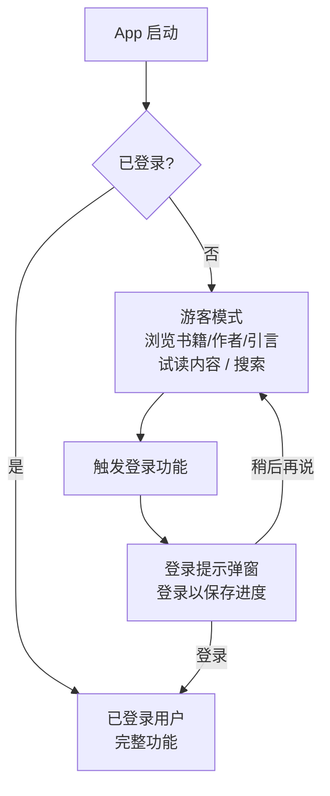

# Guest Mode 模块

> 游客模式系统 - 跨平台统一文档

---

## 1. 概述

### 1.1 功能描述

Guest Mode 模块允许用户在不登录的情况下浏览内容，只在需要特定功能时才提示登录（非强制）。

**可使用功能（浏览型）**：
- 浏览书籍列表、查看书籍详情
- 查看精选书单和书单内容
- 查看作者资料、简介、作品
- 查看每日引言、趋势引言
- 搜索书籍、作者、引言
- 试读书籍部分内容
- 语言设置、主题设置

**限制功能（需登录）**：
- 完整书籍下载
- 阅读进度同步
- 书签/高亮/笔记
- 生词本云端同步
- 有声书完整播放
- 社交功能
- AI 交互
- 成就/徽章

### 1.2 平台实现对比

| 功能 | Android | React Native | Web |
|------|---------|--------------|-----|
| 匿名用户 | DataStore | AsyncStorage | localStorage |
| 数据存储 | Room (本地) | SQLite + AsyncStorage | Zustand persist |
| 功能限制 | Feature Flags | Zustand Store | Zustand Store |
| 迁移到账户 | API 上传 | API + 本地合并 | Server Action |
| 登录提示 | AlertDialog | React Native Modal | Dialog |

---

## 2. 数据模型

### 2.1 TypeScript 类型定义

---

## 3. 功能限制配置

---

## 4. 用户流程



---

## 5. Android 实现

### 5.1 AuthViewModel 扩展

### 5.2 登录提示弹窗

### 5.3 Modifier 扩展

### 5.4 CompositionLocal 简化

---

## 6. React Native 实现

### 6.1 Zustand Store

### 6.2 useGuestMode Hook

### 6.3 登录提示组件

### 6.4 功能门控 HOC

---

## 7. Web 实现

### 7.1 Zustand Store

### 7.2 useFeatureAccess Hook

### 7.3 登录提示对话框

### 7.4 功能门控组件

---

## 8. 数据迁移

### 8.1 迁移服务

### 8.2 Web Server Action

---

## 9. 后端 API 调整

部分 API 需要支持匿名访问：

| API | 当前状态 | 目标状态 |
|-----|---------|---------|
| `GET /books` | 需要登录 | 匿名可访问 |
| `GET /books/:id` | 需要登录 | 匿名可访问 |
| `GET /authors` | 需要登录 | 匿名可访问 |
| `GET /authors/:id` | 需要登录 | 匿名可访问 |
| `GET /quotes` | 需要登录 | 匿名可访问 |
| `GET /book-lists` | 需要登录 | 匿名可访问 |
| `POST /library/*` | 需要登录 | 保持需要登录 |
| `POST /bookmarks/*` | 需要登录 | 保持需要登录 |

---

## 10. 本地化字符串

---

## 11. 数据分析埋点

| 事件 | 描述 | 参数 |
|------|------|------|
| `guest_browse_book` | 游客浏览书籍 | book_id |
| `guest_browse_author` | 游客浏览作者 | author_id |
| `guest_browse_quote` | 游客浏览引言 | quote_id |
| `guest_sample_read` | 游客试读 | book_id, pages_read |
| `login_prompt_shown` | 显示登录提示 | feature |
| `login_prompt_login_clicked` | 点击登录 | feature |
| `login_prompt_dismissed` | 关闭提示 | feature |
| `guest_converted` | 游客转化为用户 | trigger_feature |
| `guest_data_migrated` | 游客数据迁移 | progress_count, vocabulary_count |

---

## 12. 测试用例

### 功能测试

| 测试项 | 步骤 | 预期结果 |
|--------|------|----------|
| 游客浏览 | 未登录用户可以浏览书籍、作者、引言 | 正常显示内容 |
| 登录提示 | 点击需要登录的功能时 | 显示友好提示 |
| 稍后再说 | 用户关闭提示 | 继续浏览 |
| 登录跳转 | 点击登录后 | 跳转到登录页面 |
| 登录后继续 | 登录成功后 | 可以继续之前的操作 |
| 数据迁移 | 登录后 | 本地数据同步到云端 |

### 单元测试

---

## 13. 文件结构

```
# Android
android/app/src/main/java/com/readmigo/
├── auth/
│   ├── AuthViewModel.kt
│   ├── AuthState.kt
│   └── LoginPromptDialog.kt
├── ui/components/
│   └── RequireLoginButton.kt
└── utils/
    └── Modifiers.kt

# React Native
src/features/guest-mode/
├── components/
│   ├── LoginPrompt.tsx
│   ├── TrialLimitBanner.tsx
│   └── withGuestGuard.tsx
├── stores/
│   └── guestStore.ts
├── hooks/
│   ├── useGuestMode.ts
│   └── useFeatureGuard.ts
├── services/
│   └── migrationService.ts
├── types/
│   └── index.ts
└── index.ts

# Web
src/features/guest-mode/
├── components/
│   ├── guest-banner.tsx
│   ├── login-prompt.tsx
│   ├── feature-gate.tsx
│   └── upgrade-modal.tsx
├── hooks/
│   ├── use-guest-mode.ts
│   └── use-feature-access.ts
├── stores/
│   └── guest-store.ts
├── lib/
│   ├── permissions.ts
│   └── migration.ts
├── types/
│   └── index.ts
└── index.ts
```

---

## 14. 导出

---

*最后更新: 2025-12-28*
