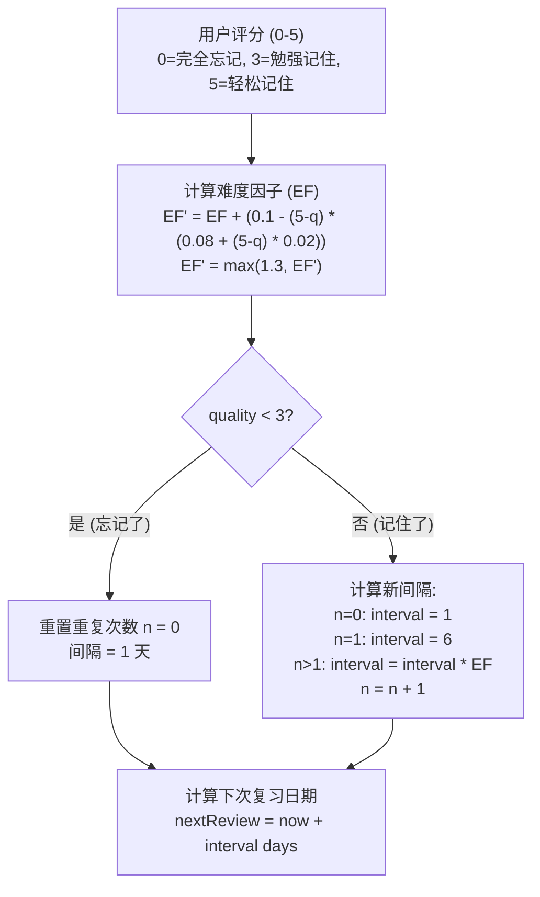

# Learning 模块

> 生词本与复习系统 - 跨平台统一文档

---

## 1. 概述

### 1.1 功能范围

| 功能 | 说明 | 优先级 |
|------|------|--------|
| 生词本管理 | 添加、编辑、删除、分组 | P0 |
| SM-2 复习 | 间隔重复算法复习 | P0 |
| 学习卡片 | 正面/反面翻转卡片 | P0 |
| 学习统计 | 进度追踪与报告 | P1 |
| 复习提醒 | 定时通知提醒 | P1 |
| 词汇测试 | 多种测验模式 | P2 |

### 1.2 平台实现对比

| 功能 | Android | React Native | Web |
|------|---------|--------------|-----|
| 数据存储 | Room DB | SQLite + Drizzle | Zustand + IndexedDB |
| 卡片动画 | Compose Animation | Reanimated 3 | Framer Motion |
| 通知提醒 | WorkManager | expo-notifications | Notification API |
| 图表统计 | Compose Charts | victory-native | Recharts |
| 语音朗读 | TextToSpeech | expo-speech | Web Speech API |

---

## 2. 数据模型

---

## 3. SM-2 算法

### 3.1 算法流程

### 3.2 核心实现

---

## 4. API 接口

| 端点 | 方法 | 说明 |
|------|------|------|
| `/vocabulary` | GET | 获取用户词汇列表 |
| `/vocabulary` | POST | 添加新词汇 |
| `/vocabulary/{id}` | PUT | 更新词汇 |
| `/vocabulary/{id}` | DELETE | 删除词汇 |
| `/vocabulary/due` | GET | 获取待复习词汇 |
| `/vocabulary/sync` | POST | 同步词汇数据 |
| `/vocabulary/groups` | GET | 获取词汇分组 |
| `/review/session` | POST | 创建复习会话 |
| `/review/submit` | POST | 提交复习结果 |
| `/learning/stats` | GET | 获取学习统计 |

---

## 5. Android 实现

### 5.1 Repository

### 5.2 Review Session ViewModel

### 5.3 Review Card UI

---

## 6. React Native 实现

### 6.1 Zustand Store

### 6.2 FlashCard 组件

### 6.3 React Query Hooks

---

## 7. Web 实现

### 7.1 Zustand Store

### 7.2 Review Session 组件

---

## 8. 复习提醒

### Android (WorkManager)

### React Native (expo-notifications)

---

## 9. 测试用例

---

*最后更新: 2025-12-28*
