# Learning 模块

> 生词本与复习系统 - 跨平台统一文档

---

## 1. 概述

### 1.1 功能范围

| 功能 | 说明 | 优先级 |
|------|------|--------|
| 生词本管理 | 添加、编辑、删除、分组 | P0 |
| SM-2 复习 | 间隔重复算法复习 | P0 |
| 学习卡片 | 正面/反面翻转卡片 | P0 |
| 学习统计 | 进度追踪与报告 | P1 |
| 复习提醒 | 定时通知提醒 | P1 |
| 词汇测试 | 多种测验模式 | P2 |

### 1.2 平台实现对比

| 功能 | Android | React Native | Web |
|------|---------|--------------|-----|
| 数据存储 | Room DB | SQLite + Drizzle | Zustand + IndexedDB |
| 卡片动画 | Compose Animation | Reanimated 3 | Framer Motion |
| 通知提醒 | WorkManager | expo-notifications | Notification API |
| 图表统计 | Compose Charts | victory-native | Recharts |
| 语音朗读 | TextToSpeech | expo-speech | Web Speech API |

---

## 2. 数据模型

```typescript
// 生词条目
interface Vocabulary {
  id: string;
  word: string;
  phonetic?: string;
  definition: string;
  translation?: string;
  contextSentence: string;       // 来源句子
  examples?: Example[];
  notes?: string;

  // 来源信息
  bookId?: string;
  bookTitle?: string;
  chapterId?: string;

  // 学习状态
  status: VocabularyStatus;
  groupId?: string;
  tags: string[];

  // SM-2 算法参数
  repetition: number;            // 重复次数 (n)
  easeFactor: number;            // 难度因子 (EF) 1.3-2.5
  interval: number;              // 间隔天数
  nextReviewDate: Date;          // 下次复习日期
  lastReviewedAt?: Date;

  // 统计
  reviewCount: number;
  correctCount: number;

  // 时间戳
  createdAt: Date;
  updatedAt: Date;
}

type VocabularyStatus =
  | 'new'        // 新词
  | 'learning'   // 学习中
  | 'reviewing'  // 复习中
  | 'mastered'   // 已掌握
  | 'suspended'; // 暂停

// 例句
interface Example {
  original: string;
  translation: string;
}

// 词汇分组
interface VocabularyGroup {
  id: string;
  name: string;
  color: string;
  icon?: string;
  wordCount: number;
  createdAt: Date;
}

// 复习会话
interface ReviewSession {
  id: string;
  startedAt: Date;
  endedAt?: Date;
  mode: ReviewMode;
  totalCards: number;
  reviewedCards: number;
  correctCount: number;
  incorrectCount: number;
  averageTime?: number;        // 平均每词用时(毫秒)
  vocabularyIds: string[];
}

type ReviewMode = 'review' | 'learn' | 'quiz';

// 学习卡片评分 (SM-2)
type CardRating = 0 | 1 | 2 | 3 | 4 | 5;
// 0 - 完全忘记
// 1 - 错误但认出
// 2 - 错误但想起
// 3 - 正确但困难
// 4 - 正确有点犹豫
// 5 - 正确轻松记住

// 简化评分 (UI)
type SimpleRating = 1 | 2 | 3 | 4;
// 1 - 忘了
// 2 - 模糊
// 3 - 记住
// 4 - 简单

// 学习统计
interface LearningStats {
  totalWords: number;
  newWords: number;
  learningWords: number;
  reviewingWords: number;
  masteredWords: number;
  dueForReview: number;

  // 今日数据
  todayReviewed: number;
  todayLearned: number;
  todayCorrectRate: number;

  // 连续学习
  streakDays: number;
  longestStreak: number;

  // 时间统计
  totalStudyTime: number;        // 分钟
  averageSessionTime: number;

  weeklyProgress: DailyProgress[];
}

interface DailyProgress {
  date: string;
  wordsLearned: number;
  wordsReviewed: number;
  correctRate: number;
}

// 每日目标
interface DailyGoal {
  reviewTarget: number;
  newWordsTarget: number;
  reviewCompleted: number;
  newWordsCompleted: number;
}
```

---

## 3. SM-2 算法

### 3.1 算法流程

```mermaid
flowchart TD
    Rating["用户评分 (0-5)<br>0=完全忘记, 3=勉强记住, 5=轻松记住"]
    Rating --> CalcEF["计算难度因子 (EF)<br>EF' = EF + (0.1 - (5-q) * (0.08 + (5-q) * 0.02))<br>EF' = max(1.3, EF')"]
    CalcEF --> Check{"quality < 3?"}
    Check -->|"是 (忘记了)"| Reset["重置重复次数 n = 0<br>间隔 = 1 天"]
    Check -->|"否 (记住了)"| Calc["计算新间隔:<br>n=0: interval = 1<br>n=1: interval = 6<br>n>1: interval = interval * EF<br>n = n + 1"]
    Reset --> Next["计算下次复习日期<br>nextReview = now + interval days"]
    Calc --> Next
```



### 3.2 核心实现

```typescript
// 通用 SM-2 算法实现

interface SM2Result {
  nextReviewDate: Date;
  newInterval: number;
  newEaseFactor: number;
  newRepetition: number;
  newStatus: VocabularyStatus;
}

/**
 * SM-2 算法核心实现
 * @param quality 用户评分 0-5
 * @param repetition 当前重复次数
 * @param easeFactor 当前难度因子 (默认 2.5)
 * @param interval 当前间隔天数
 */
function calculateSM2(
  quality: CardRating,
  repetition: number,
  easeFactor: number,
  interval: number
): SM2Result {
  // 计算新的难度因子
  const newEaseFactor = Math.max(
    1.3,
    easeFactor + (0.1 - (5 - quality) * (0.08 + (5 - quality) * 0.02))
  );

  let newInterval: number;
  let newRepetition: number;
  let newStatus: VocabularyStatus;

  if (quality < 3) {
    // 忘记了，重新开始学习
    newRepetition = 0;
    newInterval = 1;
    newStatus = 'learning';
  } else {
    // 记住了，计算下次复习间隔
    if (repetition === 0) {
      newInterval = 1;
    } else if (repetition === 1) {
      newInterval = 6;
    } else {
      newInterval = Math.round(interval * newEaseFactor);
    }
    newRepetition = repetition + 1;

    // 根据重复次数判断掌握程度
    if (newRepetition >= 5 && newEaseFactor >= 2.0) {
      newStatus = 'mastered';
    } else if (newRepetition >= 2) {
      newStatus = 'reviewing';
    } else {
      newStatus = 'learning';
    }
  }

  const nextReviewDate = new Date();
  nextReviewDate.setDate(nextReviewDate.getDate() + newInterval);

  return {
    nextReviewDate,
    newInterval,
    newEaseFactor,
    newRepetition,
    newStatus,
  };
}

/**
 * 将 1-4 的简化评分转换为 0-5 的 SM-2 评分
 */
function convertSimpleRating(simpleRating: SimpleRating): CardRating {
  const mapping: Record<SimpleRating, CardRating> = {
    1: 0,  // 忘了 -> 完全忘记
    2: 2,  // 模糊 -> 错误但想起
    3: 3,  // 记住 -> 勉强记住
    4: 5,  // 简单 -> 轻松记住
  };
  return mapping[simpleRating];
}

/**
 * 获取今日待复习词汇
 */
function getDueVocabularies(vocabularies: Vocabulary[]): Vocabulary[] {
  const now = new Date();
  now.setHours(0, 0, 0, 0);

  return vocabularies.filter((v) => {
    if (v.status === 'suspended') return false;
    if (v.status === 'new') return true;
    const reviewDate = new Date(v.nextReviewDate);
    reviewDate.setHours(0, 0, 0, 0);
    return reviewDate <= now;
  });
}
```

---

## 4. API 接口

| 端点 | 方法 | 说明 |
|------|------|------|
| `/vocabulary` | GET | 获取用户词汇列表 |
| `/vocabulary` | POST | 添加新词汇 |
| `/vocabulary/{id}` | PUT | 更新词汇 |
| `/vocabulary/{id}` | DELETE | 删除词汇 |
| `/vocabulary/due` | GET | 获取待复习词汇 |
| `/vocabulary/sync` | POST | 同步词汇数据 |
| `/vocabulary/groups` | GET | 获取词汇分组 |
| `/review/session` | POST | 创建复习会话 |
| `/review/submit` | POST | 提交复习结果 |
| `/learning/stats` | GET | 获取学习统计 |

---

## 5. Android 实现

### 5.1 Repository

```kotlin
@Singleton
class VocabularyRepositoryImpl @Inject constructor(
    private val vocabularyDao: VocabularyDao,
    private val vocabularyApi: VocabularyApi,
    private val syncManager: SyncManager
) : VocabularyRepository {

    override fun getAllVocabulary(): Flow<List<Vocabulary>> {
        return vocabularyDao.getAll().map { entities ->
            entities.map { it.toDomain() }
        }
    }

    override fun getDueForReview(): Flow<List<Vocabulary>> {
        val now = Clock.System.now()
        return vocabularyDao.getDueForReview(now.toEpochMilliseconds()).map { entities ->
            entities.map { it.toDomain() }
        }
    }

    override suspend fun autoAdd(
        word: String,
        context: String,
        explanation: String,
        bookId: String?
    ) {
        val existing = vocabularyDao.getByWord(word)
        if (existing != null) {
            vocabularyDao.update(existing.copy(contextSentence = context))
            return
        }

        val vocabulary = VocabularyEntity(
            id = UUID.randomUUID().toString(),
            word = word,
            definition = explanation,
            contextSentence = context,
            bookId = bookId,
            createdAt = System.currentTimeMillis(),
            repetition = 0,
            easeFactor = 2.5f,
            interval = 0,
            nextReviewDate = System.currentTimeMillis() + 24 * 60 * 60 * 1000,
            status = "new"
        )

        vocabularyDao.insert(vocabulary)
        syncManager.enqueueSync(SyncOperation.AddVocabulary(vocabulary.id))
    }

    override suspend fun submitReview(vocabularyId: String, quality: Int): SM2Result {
        val vocabulary = vocabularyDao.getById(vocabularyId)
            ?: throw IllegalArgumentException("Vocabulary not found")

        val result = SM2Algorithm.calculate(
            quality = quality,
            repetition = vocabulary.repetition,
            easeFactor = vocabulary.easeFactor,
            interval = vocabulary.interval
        )

        vocabularyDao.update(
            vocabulary.copy(
                repetition = result.newRepetition,
                easeFactor = result.newEaseFactor,
                interval = result.newInterval,
                nextReviewDate = result.nextReviewDate.toEpochMilliseconds(),
                lastReviewedAt = System.currentTimeMillis(),
                status = result.newStatus.name,
                reviewCount = vocabulary.reviewCount + 1,
                correctCount = if (quality >= 3) vocabulary.correctCount + 1 else vocabulary.correctCount
            )
        )

        syncManager.enqueueSync(SyncOperation.ReviewVocabulary(vocabularyId, quality))
        return result
    }
}
```

### 5.2 Review Session ViewModel

```kotlin
@HiltViewModel
class ReviewSessionViewModel @Inject constructor(
    private val vocabularyRepository: VocabularyRepository
) : ViewModel() {

    private val _sessionState = MutableStateFlow<ReviewSessionState>(ReviewSessionState.Loading)
    val sessionState: StateFlow<ReviewSessionState> = _sessionState.asStateFlow()

    private val _currentCard = MutableStateFlow<ReviewCard?>(null)
    val currentCard: StateFlow<ReviewCard?> = _currentCard.asStateFlow()

    private val _progress = MutableStateFlow(ReviewProgress(0, 0, 0, 0))
    val progress: StateFlow<ReviewProgress> = _progress.asStateFlow()

    private var reviewQueue: MutableList<Vocabulary> = mutableListOf()

    fun startSession() {
        viewModelScope.launch {
            _sessionState.value = ReviewSessionState.Loading

            vocabularyRepository.getDueForReview().first().let { dueWords ->
                if (dueWords.isEmpty()) {
                    _sessionState.value = ReviewSessionState.Empty
                    return@launch
                }

                reviewQueue = dueWords.shuffled().toMutableList()
                _progress.value = ReviewProgress(total = reviewQueue.size)
                showNextCard()
                _sessionState.value = ReviewSessionState.InProgress
            }
        }
    }

    fun submitRating(simpleRating: Int) {
        viewModelScope.launch {
            val card = _currentCard.value ?: return@launch
            val quality = SM2Algorithm.convertSimpleRating(simpleRating)

            vocabularyRepository.submitReview(card.vocabulary.id, quality)

            _progress.update { p ->
                p.copy(
                    completed = p.completed + 1,
                    correct = if (quality >= 3) p.correct + 1 else p.correct,
                    incorrect = if (quality < 3) p.incorrect + 1 else p.incorrect
                )
            }

            if (quality < 3) {
                reviewQueue.add(card.vocabulary)
            }

            showNextCard()
        }
    }

    private fun showNextCard() {
        if (reviewQueue.isEmpty()) {
            completeSession()
            return
        }
        val vocabulary = reviewQueue.removeAt(0)
        _currentCard.value = ReviewCard(vocabulary = vocabulary)
    }
}

sealed class ReviewSessionState {
    object Loading : ReviewSessionState()
    object Empty : ReviewSessionState()
    object InProgress : ReviewSessionState()
    data class Completed(val stats: SessionStats) : ReviewSessionState()
}
```

### 5.3 Review Card UI

```kotlin
@Composable
fun ReviewCardView(
    card: ReviewCard,
    onShowAnswer: () -> Unit,
    onRating: (Int) -> Unit
) {
    Card(
        modifier = Modifier.fillMaxWidth(),
        elevation = CardDefaults.cardElevation(defaultElevation = 4.dp)
    ) {
        Column(
            modifier = Modifier.fillMaxSize().padding(24.dp),
            horizontalAlignment = Alignment.CenterHorizontally
        ) {
            Text(
                text = card.vocabulary.word,
                style = MaterialTheme.typography.displaySmall,
                fontWeight = FontWeight.Bold
            )

            card.vocabulary.phonetic?.let { phonetic ->
                Text(text = phonetic, style = MaterialTheme.typography.bodyLarge)
            }

            Surface(
                color = MaterialTheme.colorScheme.surfaceVariant,
                shape = RoundedCornerShape(8.dp)
            ) {
                Text(
                    text = card.vocabulary.contextSentence,
                    modifier = Modifier.padding(12.dp)
                )
            }

            Spacer(modifier = Modifier.weight(1f))

            if (!card.showAnswer) {
                Button(onClick = onShowAnswer) {
                    Text("显示答案")
                }
            } else {
                Text(text = card.vocabulary.definition)

                Row(horizontalArrangement = Arrangement.SpaceEvenly) {
                    RatingButton("忘了", Color(0xFFE53935)) { onRating(1) }
                    RatingButton("模糊", Color(0xFFFF9800)) { onRating(2) }
                    RatingButton("记住", Color(0xFF4CAF50)) { onRating(3) }
                    RatingButton("简单", Color(0xFF2196F3)) { onRating(4) }
                }
            }
        }
    }
}
```

---

## 6. React Native 实现

### 6.1 Zustand Store

```typescript
// src/features/learning/stores/learningStore.ts

import { create } from 'zustand';
import { persist, createJSONStorage } from 'zustand/middleware';
import { immer } from 'zustand/middleware/immer';
import AsyncStorage from '@react-native-async-storage/async-storage';

interface LearningState {
  currentSession: ReviewSession | null;
  currentCardIndex: number;
  sessionCards: Vocabulary[];
  dailyGoal: DailyGoal;
  reviewReminder: boolean;
  reminderTime: string;
  stats: LearningStats | null;
  isCardFlipped: boolean;
}

interface LearningActions {
  startSession: (mode: ReviewMode, vocabularyIds: string[]) => void;
  endSession: () => void;
  rateCard: (rating: CardRating) => void;
  nextCard: () => void;
  flipCard: () => void;
  setDailyGoal: (goal: Partial<DailyGoal>) => void;
  updateStats: (stats: LearningStats) => void;
}

export const useLearningStore = create<LearningState & LearningActions>()(
  persist(
    immer((set, get) => ({
      currentSession: null,
      currentCardIndex: 0,
      sessionCards: [],
      dailyGoal: { reviewTarget: 20, newWordsTarget: 10, reviewCompleted: 0, newWordsCompleted: 0 },
      reviewReminder: true,
      reminderTime: '09:00',
      stats: null,
      isCardFlipped: false,

      startSession: (mode, vocabularyIds) => set((state) => {
        state.currentSession = {
          id: Date.now().toString(),
          startedAt: new Date(),
          mode,
          totalCards: vocabularyIds.length,
          reviewedCards: 0,
          correctCount: 0,
          incorrectCount: 0,
          vocabularyIds,
        };
        state.currentCardIndex = 0;
        state.isCardFlipped = false;
      }),

      endSession: () => set((state) => {
        if (state.currentSession) {
          state.currentSession.endedAt = new Date();
        }
        state.currentSession = null;
        state.sessionCards = [];
        state.currentCardIndex = 0;
      }),

      rateCard: (rating) => set((state) => {
        if (!state.currentSession) return;
        state.currentSession.reviewedCards += 1;
        if (rating >= 3) {
          state.currentSession.correctCount += 1;
        } else {
          state.currentSession.incorrectCount += 1;
        }
      }),

      nextCard: () => set((state) => {
        if (state.currentCardIndex < state.sessionCards.length - 1) {
          state.currentCardIndex += 1;
          state.isCardFlipped = false;
        }
      }),

      flipCard: () => set((state) => {
        state.isCardFlipped = !state.isCardFlipped;
      }),

      setDailyGoal: (goal) => set((state) => {
        state.dailyGoal = { ...state.dailyGoal, ...goal };
      }),

      updateStats: (stats) => set((state) => {
        state.stats = stats;
      }),
    })),
    {
      name: 'learning-storage',
      storage: createJSONStorage(() => AsyncStorage),
      partialize: (state) => ({
        dailyGoal: state.dailyGoal,
        reviewReminder: state.reviewReminder,
        reminderTime: state.reminderTime,
      }),
    }
  )
);
```

### 6.2 FlashCard 组件

```typescript
// src/features/learning/components/FlashCard.tsx

import { View, Text, StyleSheet, Pressable } from 'react-native';
import Animated, {
  useSharedValue,
  useAnimatedStyle,
  withTiming,
  interpolate,
} from 'react-native-reanimated';
import * as Speech from 'expo-speech';
import { Ionicons } from '@expo/vector-icons';

interface FlashCardProps {
  vocabulary: Vocabulary;
  isFlipped: boolean;
  onFlip: () => void;
}

export function FlashCard({ vocabulary, isFlipped, onFlip }: FlashCardProps) {
  const rotation = useSharedValue(0);

  React.useEffect(() => {
    rotation.value = withTiming(isFlipped ? 180 : 0, { duration: 400 });
  }, [isFlipped]);

  const frontStyle = useAnimatedStyle(() => ({
    transform: [{ rotateY: `${interpolate(rotation.value, [0, 180], [0, 180])}deg` }],
    backfaceVisibility: 'hidden',
  }));

  const backStyle = useAnimatedStyle(() => ({
    transform: [{ rotateY: `${interpolate(rotation.value, [0, 180], [180, 360])}deg` }],
    backfaceVisibility: 'hidden',
  }));

  const handleSpeak = () => {
    Speech.speak(vocabulary.word, { language: 'en-US', rate: 0.8 });
  };

  return (
    <Pressable onPress={onFlip} style={styles.container}>
      {/* 正面 - 单词 */}
      <Animated.View style={[styles.card, styles.cardFront, frontStyle]}>
        <Text style={styles.word}>{vocabulary.word}</Text>
        {vocabulary.phonetic && (
          <Text style={styles.pronunciation}>{vocabulary.phonetic}</Text>
        )}
        <Pressable onPress={handleSpeak} style={styles.speakButton}>
          <Ionicons name="volume-medium" size={24} color="#2D5A7B" />
        </Pressable>
        <Text style={styles.hint}>点击翻转查看释义</Text>
      </Animated.View>

      {/* 背面 - 释义 */}
      <Animated.View style={[styles.card, styles.cardBack, backStyle]}>
        <Text style={styles.translation}>{vocabulary.definition}</Text>
        {vocabulary.contextSentence && (
          <View style={styles.exampleContainer}>
            <Text style={styles.exampleLabel}>例句</Text>
            <Text style={styles.example}>{vocabulary.contextSentence}</Text>
          </View>
        )}
      </Animated.View>
    </Pressable>
  );
}

const styles = StyleSheet.create({
  container: { width: '100%', height: 400 },
  card: {
    position: 'absolute',
    width: '100%',
    height: '100%',
    borderRadius: 20,
    padding: 24,
    justifyContent: 'center',
    alignItems: 'center',
  },
  cardFront: { backgroundColor: '#fff' },
  cardBack: { backgroundColor: '#F8F9FA' },
  word: { fontSize: 36, fontWeight: '700', color: '#1A1A1A' },
  pronunciation: { fontSize: 18, color: '#666', marginTop: 8 },
  speakButton: { padding: 12, backgroundColor: '#E3F2FD', borderRadius: 24, marginTop: 16 },
  hint: { fontSize: 14, color: '#999', position: 'absolute', bottom: 24 },
  translation: { fontSize: 28, fontWeight: '600', textAlign: 'center' },
  exampleContainer: { marginTop: 20, padding: 16, backgroundColor: '#fff', borderRadius: 12 },
  exampleLabel: { fontSize: 12, color: '#999' },
  example: { fontSize: 14, color: '#333', fontStyle: 'italic' },
});
```

### 6.3 React Query Hooks

```typescript
// src/features/learning/hooks/useVocabulary.ts

import { useQuery, useMutation, useQueryClient } from '@tanstack/react-query';
import { calculateSM2 } from '../utils/sm2';
import { useLearningStore } from '../stores/learningStore';
import * as vocabularyService from '../services/vocabularyService';

export function useVocabularies() {
  return useQuery({
    queryKey: ['vocabularies'],
    queryFn: vocabularyService.getAllVocabularies,
  });
}

export function useDueVocabularies(limit = 20) {
  return useQuery({
    queryKey: ['vocabularies', 'due', limit],
    queryFn: () => vocabularyService.getDueVocabularies(limit),
  });
}

export function useReviewVocabulary() {
  const queryClient = useQueryClient();
  const { rateCard } = useLearningStore();

  return useMutation({
    mutationFn: async ({ vocabulary, rating }: { vocabulary: Vocabulary; rating: CardRating }) => {
      const sm2Result = calculateSM2(vocabulary, rating);
      await vocabularyService.updateVocabularyAfterReview(vocabulary.id, {
        ...sm2Result,
        status: sm2Result.newStatus,
      });
      return { vocabulary, rating, sm2Result };
    },
    onSuccess: ({ rating }) => {
      rateCard(rating);
      queryClient.invalidateQueries({ queryKey: ['vocabularies'] });
    },
  });
}

export function useLearningStats() {
  const { updateStats } = useLearningStore();

  return useQuery({
    queryKey: ['learning-stats'],
    queryFn: async () => {
      const stats = await vocabularyService.getLearningStats();
      updateStats(stats);
      return stats;
    },
  });
}
```

---

## 7. Web 实现

### 7.1 Zustand Store

```typescript
// src/features/learning/stores/learning-store.ts

import { create } from 'zustand';
import { persist } from 'zustand/middleware';
import { calculateSM2, getDueWords } from '../lib/srs';

interface LearningState {
  vocabulary: VocabularyWord[];
  currentSession: ReviewSession | null;
  sessionWords: VocabularyWord[];
  currentIndex: number;
  stats: LearningStats;

  addWord: (word: Omit<VocabularyWord, 'id' | 'createdAt'>) => void;
  deleteWord: (id: string) => void;
  startReviewSession: (limit?: number) => void;
  submitReview: (quality: ReviewQuality) => void;
  endSession: () => void;
  refreshStats: () => void;
}

export const useLearningStore = create<LearningState>()(
  persist(
    (set, get) => ({
      vocabulary: [],
      currentSession: null,
      sessionWords: [],
      currentIndex: 0,
      stats: initialStats,

      addWord: (wordData) => {
        const word = initializeSRS({ ...wordData, id: Date.now().toString() });
        set((state) => ({ vocabulary: [...state.vocabulary, word] }));
        get().refreshStats();
      },

      deleteWord: (id) => {
        set((state) => ({
          vocabulary: state.vocabulary.filter((w) => w.id !== id),
        }));
        get().refreshStats();
      },

      startReviewSession: (limit = 20) => {
        const { vocabulary } = get();
        const dueWords = getDueWords(vocabulary).slice(0, limit);

        if (dueWords.length === 0) return;

        set({
          currentSession: {
            id: Date.now().toString(),
            startedAt: new Date(),
            wordCount: dueWords.length,
            correctCount: 0,
            duration: 0,
          },
          sessionWords: dueWords,
          currentIndex: 0,
        });
      },

      submitReview: (quality) => {
        const { sessionWords, currentIndex, vocabulary } = get();
        const currentWord = sessionWords[currentIndex];
        if (!currentWord) return;

        const updates = calculateSM2(currentWord, quality);

        set((state) => ({
          vocabulary: state.vocabulary.map((w) =>
            w.id === currentWord.id ? { ...w, ...updates } : w
          ),
          currentSession: state.currentSession
            ? {
                ...state.currentSession,
                correctCount: state.currentSession.correctCount + (quality >= 3 ? 1 : 0),
              }
            : null,
          currentIndex: state.currentIndex + 1,
        }));

        if (currentIndex + 1 >= sessionWords.length) {
          get().endSession();
        }
        get().refreshStats();
      },

      endSession: () => {
        set({ currentSession: null, sessionWords: [], currentIndex: 0 });
      },

      refreshStats: () => {
        const { vocabulary } = get();
        set({
          stats: {
            totalWords: vocabulary.length,
            newWords: vocabulary.filter((w) => w.status === 'new').length,
            learningWords: vocabulary.filter((w) => w.status === 'learning').length,
            reviewWords: vocabulary.filter((w) => w.status === 'review').length,
            graduatedWords: vocabulary.filter((w) => w.status === 'graduated').length,
            // ... other stats
          },
        });
      },
    }),
    { name: 'learning-storage', partialize: (state) => ({ vocabulary: state.vocabulary }) }
  )
);
```

### 7.2 Review Session 组件

```tsx
// src/features/learning/components/review-session.tsx

'use client';

import { useState, useCallback } from 'react';
import { motion, AnimatePresence } from 'framer-motion';
import { useLearningStore } from '../stores/learning-store';
import { ReviewCard } from './review-card';
import { Button } from '@/components/ui/button';
import { Progress } from '@/components/ui/progress';

export function ReviewSession() {
  const {
    currentSession,
    sessionWords,
    currentIndex,
    startReviewSession,
    submitReview,
    endSession,
  } = useLearningStore();

  const [showAnswer, setShowAnswer] = useState(false);

  const currentWord = sessionWords[currentIndex];
  const progress = sessionWords.length > 0 ? (currentIndex / sessionWords.length) * 100 : 0;

  const handleReview = useCallback((quality: ReviewQuality) => {
    submitReview(quality);
    setShowAnswer(false);
  }, [submitReview]);

  if (!currentSession) {
    return (
      <div className="flex flex-col items-center justify-center min-h-[400px] gap-4">
        <h2 className="text-xl font-bold">准备好复习了吗？</h2>
        <Button onClick={() => startReviewSession()} size="lg">
          开始复习
        </Button>
      </div>
    );
  }

  if (!currentWord) {
    return (
      <div className="flex flex-col items-center justify-center min-h-[400px] gap-4">
        <div className="text-6xl">🎉</div>
        <h2 className="text-xl font-bold">复习完成！</h2>
        <p>正确率: {Math.round((currentSession.correctCount / currentSession.wordCount) * 100)}%</p>
      </div>
    );
  }

  return (
    <div className="space-y-4">
      <div className="flex items-center gap-4">
        <Progress value={progress} className="flex-1" />
        <span>{currentIndex + 1} / {sessionWords.length}</span>
      </div>

      <AnimatePresence mode="wait">
        <motion.div
          key={currentWord.id}
          initial={{ opacity: 0, x: 50 }}
          animate={{ opacity: 1, x: 0 }}
          exit={{ opacity: 0, x: -50 }}
        >
          <ReviewCard
            word={currentWord}
            showAnswer={showAnswer}
            onReveal={() => setShowAnswer(true)}
          />
        </motion.div>
      </AnimatePresence>

      {showAnswer && (
        <div className="grid grid-cols-4 gap-2">
          <Button variant="destructive" onClick={() => handleReview(0)}>忘了</Button>
          <Button variant="outline" onClick={() => handleReview(2)}>模糊</Button>
          <Button variant="secondary" onClick={() => handleReview(3)}>记住</Button>
          <Button onClick={() => handleReview(5)}>简单</Button>
        </div>
      )}
    </div>
  );
}
```

---

## 8. 复习提醒

### Android (WorkManager)

```kotlin
@HiltWorker
class ReviewReminderWorker @AssistedInject constructor(
    @Assisted context: Context,
    @Assisted params: WorkerParameters,
    private val vocabularyRepository: VocabularyRepository,
    private val notificationManager: NotificationManager
) : CoroutineWorker(context, params) {

    override suspend fun doWork(): Result {
        val dueCount = vocabularyRepository.getDueForReview().first().size

        if (dueCount > 0) {
            notificationManager.showReviewReminder(dueCount)
        }

        return Result.success()
    }
}
```

### React Native (expo-notifications)

```typescript
import * as Notifications from 'expo-notifications';

export async function scheduleReviewReminder(time: string) {
  const [hours, minutes] = time.split(':').map(Number);

  await Notifications.cancelAllScheduledNotificationsAsync();

  await Notifications.scheduleNotificationAsync({
    content: {
      title: '该复习了！📚',
      body: '你有待复习的单词，保持学习习惯吧！',
    },
    trigger: { hour: hours, minute: minutes, repeats: true },
  });
}
```

---

## 9. 测试用例

```typescript
describe('SM-2 Algorithm', () => {
  const baseVocabulary = {
    repetition: 0,
    easeFactor: 2.5,
    interval: 0,
  };

  it('should set interval to 1 on first correct review', () => {
    const result = calculateSM2(baseVocabulary, 4);
    expect(result.newInterval).toBe(1);
    expect(result.newRepetition).toBe(1);
  });

  it('should set interval to 6 on second correct review', () => {
    const vocab = { ...baseVocabulary, repetition: 1, interval: 1 };
    const result = calculateSM2(vocab, 4);
    expect(result.newInterval).toBe(6);
    expect(result.newRepetition).toBe(2);
  });

  it('should reset on failed review', () => {
    const vocab = { ...baseVocabulary, repetition: 3, interval: 15 };
    const result = calculateSM2(vocab, 2);
    expect(result.newRepetition).toBe(0);
    expect(result.newInterval).toBe(1);
  });

  it('should decrease ease factor on difficult rating', () => {
    const result = calculateSM2(baseVocabulary, 3);
    expect(result.newEaseFactor).toBeLessThan(2.5);
    expect(result.newEaseFactor).toBeGreaterThanOrEqual(1.3);
  });

  it('should mark as mastered after 5 repetitions', () => {
    const vocab = { ...baseVocabulary, repetition: 4, interval: 30, easeFactor: 2.0 };
    const result = calculateSM2(vocab, 5);
    expect(result.newStatus).toBe('mastered');
  });
});

describe('getDueVocabularies', () => {
  it('should return new words', () => {
    const words = [{ status: 'new' }];
    expect(getDueVocabularies(words)).toHaveLength(1);
  });

  it('should exclude suspended words', () => {
    const words = [{ status: 'suspended' }];
    expect(getDueVocabularies(words)).toHaveLength(0);
  });
});
```

---

*最后更新: 2025-12-28*
