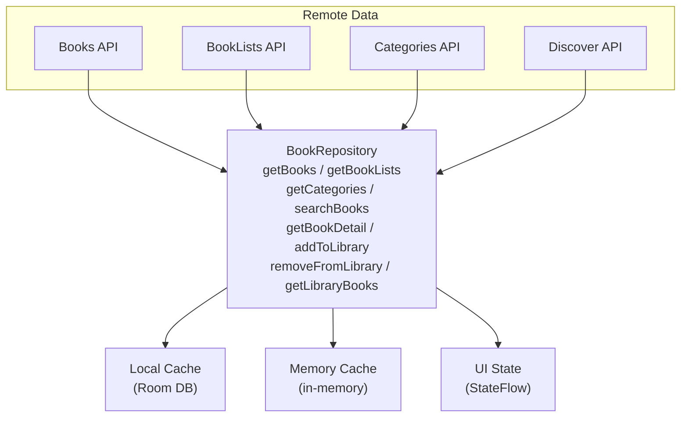

# Library 模块

> 书架与书籍管理 - 跨平台统一文档

---

## 1. 概述

### 1.1 功能范围

| 功能 | 说明 | 优先级 |
|------|------|--------|
| 书架展示 | 用户已添加的书籍 | P0 |
| 发现页 | 浏览和发现新书 | P0 |
| 书籍详情 | 书籍信息与 AI 功能入口 | P0 |
| 榜单浏览 | 各类推荐榜单 | P1 |
| 分类浏览 | 按分类浏览书籍 | P1 |
| 阅读进度 | 继续阅读、进度同步 | P0 |
| 书籍搜索 | 搜索书名、作者 | P1 |
| 离线下载 | 下载书籍供离线阅读 | P1 |

### 1.2 平台实现对比

| 功能 | Android | React Native | Web |
|------|---------|--------------|-----|
| 书籍列表 | LazyVerticalGrid | FlashList | Virtual Grid |
| 书籍详情 | Compose | React Native | SSR + Client |
| 状态管理 | StateFlow | Zustand | Zustand |
| 数据获取 | Retrofit + Room | React Query | React Query |
| 离线缓存 | Room DB | FileSystem | Service Worker |
| 动画效果 | Compose Animation | Reanimated | CSS/Framer |

---

## 2. 数据模型

---

## 3. API 接口

### 3.1 书籍 API

| 端点 | 方法 | 说明 |
|------|------|------|
| `/books` | GET | 获取书籍列表 (分页) |
| `/books/{id}` | GET | 获取书籍详情 |
| `/books/{id}/chapters` | GET | 获取章节列表 |
| `/books/search` | GET | 搜索书籍 |
| `/books/recommended` | GET | 获取推荐书籍 |
| `/discover` | GET | 获取发现页数据 |
| `/booklists` | GET | 获取书单列表 |
| `/booklists/{id}` | GET | 获取书单详情 |
| `/categories` | GET | 获取分类列表 |
| `/categories/{id}/books` | GET | 获取分类下书籍 |

### 3.2 用户书架 API

| 端点 | 方法 | 说明 |
|------|------|------|
| `/user/library` | GET | 获取用户书架 |
| `/user/library` | POST | 添加到书架 |
| `/user/library/{bookId}` | DELETE | 从书架移除 |
| `/user/library/{bookId}/progress` | PUT | 更新阅读进度 |
| `/user/library/{bookId}/status` | PUT | 更新阅读状态 |
| `/user/library/continue-reading` | GET | 获取继续阅读列表 |
| `/user/reading-sessions` | POST | 记录阅读会话 |

---

## 4. Android 实现

### 4.1 数据流架构

### 4.2 Repository

### 4.3 Library Screen

### 4.4 本地数据库

---

## 5. React Native 实现

### 5.1 Zustand Store

### 5.2 React Query Hooks

### 5.3 BookCard 组件

### 5.4 离线下载服务

---

## 6. Web 实现

### 6.1 Zustand Store

### 6.2 React Query Hooks

### 6.3 BookCard 组件

### 6.4 书籍详情页 (SSR)

---

## 7. 测试用例

---

*最后更新: 2025-12-28*
