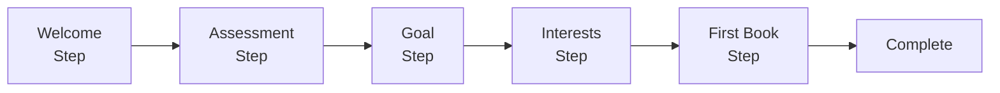

# Onboarding 模块

> 新用户引导流程 - 跨平台统一文档

---

## 1. 概述

### 1.1 功能范围

| 步骤 | 功能 | 说明 |
|------|------|------|
| 1 | 欢迎页 | 品牌介绍与功能预览 |
| 2 | 功能介绍 | 滑动展示核心功能 |
| 3 | 英语水平评估 | 简易测试确定阅读级别 |
| 4 | 阅读目标设置 | 每日阅读时长目标 |
| 5 | 兴趣选择 | 选择喜欢的书籍类型 |
| 6 | 权限请求 | 通知/追踪权限 |
| 7 | 第一本书推荐 | 基于评估结果推荐 |
| 8 | 完成引导 | 进入主页面 |

### 1.2 平台实现对比

| 功能 | Android | React Native | Web |
|------|---------|--------------|-----|
| 页面容器 | ViewPager2 + Compose | Reanimated Carousel | Framer Motion |
| 状态管理 | StateFlow | Zustand + AsyncStorage | Zustand + localStorage |
| 动画 | Compose Animation | Reanimated 3 | Framer Motion |
| 进度指示器 | Compose | Reanimated | CSS/Framer |
| 权限请求 | Android Permission | expo-notifications + ATT | Notification API |

---

## 2. 数据模型

---

## 3. API 接口

| 端点 | 方法 | 说明 |
|------|------|------|
| `/assessment/questions` | GET | 获取评估问题 |
| `/assessment/evaluate` | POST | 评估答案 |
| `/users/me/assessment` | POST | 保存评估结果 |
| `/books/recommended` | GET | 获取推荐书籍 |

---

## 4. Android 实现

### 4.1 状态机设计

### 4.2 ViewModel

### 4.3 UI 组件

---

## 5. React Native 实现

### 5.1 Zustand Store

### 5.2 页面容器

### 5.3 权限请求 (iOS ATT)

---

## 6. Web 实现

### 6.1 Zustand Store

### 6.2 引导流程组件

### 6.3 路由守卫

---

## 7. 设计原则

### 7.1 引导设计

1. **简洁明了**: 每页只传达一个核心信息
2. **可视化**: 使用插图而非大段文字
3. **可跳过**: 始终提供跳过选项
4. **渐进式**: 权限请求放在最后，说明理由
5. **个性化**: 收集偏好以提供更好体验

### 7.2 性能优化

---

## 8. 测试用例

---

*最后更新: 2025-12-28*
