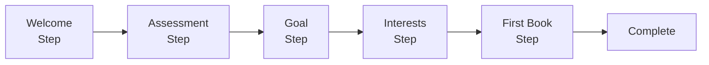

# Onboarding 模块

> 新用户引导流程 - 跨平台统一文档

---

## 1. 概述

### 1.1 功能范围

| 步骤 | 功能 | 说明 |
|------|------|------|
| 1 | 欢迎页 | 品牌介绍与功能预览 |
| 2 | 功能介绍 | 滑动展示核心功能 |
| 3 | 英语水平评估 | 简易测试确定阅读级别 |
| 4 | 阅读目标设置 | 每日阅读时长目标 |
| 5 | 兴趣选择 | 选择喜欢的书籍类型 |
| 6 | 权限请求 | 通知/追踪权限 |
| 7 | 第一本书推荐 | 基于评估结果推荐 |
| 8 | 完成引导 | 进入主页面 |

### 1.2 平台实现对比

| 功能 | Android | React Native | Web |
|------|---------|--------------|-----|
| 页面容器 | ViewPager2 + Compose | Reanimated Carousel | Framer Motion |
| 状态管理 | StateFlow | Zustand + AsyncStorage | Zustand + localStorage |
| 动画 | Compose Animation | Reanimated 3 | Framer Motion |
| 进度指示器 | Compose | Reanimated | CSS/Framer |
| 权限请求 | Android Permission | expo-notifications + ATT | Notification API |

---

## 2. 数据模型

```typescript
// 引导状态
interface OnboardingState {
  currentStep: OnboardingStep;
  isCompleted: boolean;
  level: ReadingLevel | null;
  dailyGoalMinutes: number;
  interests: string[];
  selectedLanguage: string | null;
  recommendedBooks: Book[];
  selectedBookId: string | null;
}

type OnboardingStep =
  | 'welcome'
  | 'features'
  | 'assessment'
  | 'goal'
  | 'interests'
  | 'notifications'
  | 'first-book'
  | 'complete';

// 阅读水平
type ReadingLevel = 'beginner' | 'intermediate' | 'advanced';

// 书籍类型
type Genre =
  | 'fiction' | 'classic' | 'mystery' | 'romance'
  | 'scifi' | 'fantasy' | 'biography' | 'history'
  | 'philosophy' | 'self-help' | 'business' | 'science';

// 评估问题
interface AssessmentQuestion {
  id: string;
  text: string;
  options: AssessmentOption[];
  difficulty: 1 | 2 | 3 | 4;
}

interface AssessmentOption {
  id: string;
  text: string;
  isCorrect: boolean;
}

// 评估结果
interface AssessmentResult {
  correctCount: number;
  totalQuestions: number;
  recommendedLevel: ReadingLevel;
  confidence: number;
}

// 用户偏好
interface UserPreferences {
  language: LanguagePreference;
  reading: ReadingPreference;
  notifications: NotificationPreference;
}

interface LanguagePreference {
  native: string;
  learning: string[];
  proficiency: ReadingLevel;
}

interface ReadingPreference {
  genres: string[];
  dailyGoal: number;
  readingTime: 'morning' | 'afternoon' | 'evening' | 'night';
}

interface NotificationPreference {
  enabled: boolean;
  dailyReminder: boolean;
  reminderTime: string;
  newBooks: boolean;
  learningReminder: boolean;
}
```

---

## 3. API 接口

| 端点 | 方法 | 说明 |
|------|------|------|
| `/assessment/questions` | GET | 获取评估问题 |
| `/assessment/evaluate` | POST | 评估答案 |
| `/users/me/assessment` | POST | 保存评估结果 |
| `/books/recommended` | GET | 获取推荐书籍 |

---

## 4. Android 实现

### 4.1 状态机设计



### 4.2 ViewModel

```kotlin
@HiltViewModel
class OnboardingViewModel @Inject constructor(
    private val userRepository: UserRepository,
    private val bookRepository: BookRepository,
    private val assessmentRepository: AssessmentRepository
) : ViewModel() {

    private val _state = MutableStateFlow(OnboardingState())
    val state: StateFlow<OnboardingState> = _state.asStateFlow()

    fun nextStep() {
        _state.update { it.copy(currentStep = it.currentStep.next()) }
    }

    fun setDailyGoal(minutes: Int) {
        _state.update { it.copy(dailyGoalMinutes = minutes) }
        nextStep()
    }

    fun toggleInterest(genre: Genre) {
        _state.update { current ->
            val newInterests = if (genre in current.interests) {
                current.interests - genre
            } else {
                current.interests + genre
            }
            current.copy(interests = newInterests)
        }
    }

    fun completeOnboarding() {
        viewModelScope.launch {
            userRepository.setOnboardingCompleted(true)
            _state.update { it.copy(currentStep = OnboardingStep.COMPLETE) }
        }
    }
}
```

### 4.3 UI 组件

```kotlin
@Composable
fun OnboardingScreen(
    onComplete: () -> Unit,
    viewModel: OnboardingViewModel = hiltViewModel()
) {
    val state by viewModel.state.collectAsStateWithLifecycle()

    LaunchedEffect(state.currentStep) {
        if (state.currentStep == OnboardingStep.COMPLETE) {
            onComplete()
        }
    }

    Scaffold { padding ->
        Column(modifier = Modifier.padding(padding)) {
            // 进度指示器
            OnboardingProgressBar(
                currentStep = state.currentStep.index,
                totalSteps = OnboardingStep.entries.size - 1
            )

            // 步骤内容
            AnimatedContent(targetState = state.currentStep) { step ->
                when (step) {
                    OnboardingStep.WELCOME -> WelcomeStep(onNext = { viewModel.nextStep() })
                    OnboardingStep.ASSESSMENT -> AssessmentStep(...)
                    OnboardingStep.GOAL -> GoalStep(onSelect = { viewModel.setDailyGoal(it) })
                    OnboardingStep.INTERESTS -> InterestsStep(...)
                    OnboardingStep.FIRST_BOOK -> FirstBookStep(...)
                    else -> {}
                }
            }
        }
    }
}
```

---

## 5. React Native 实现

### 5.1 Zustand Store

```typescript
import { create } from 'zustand';
import { persist, createJSONStorage } from 'zustand/middleware';
import AsyncStorage from '@react-native-async-storage/async-storage';

export const useOnboardingStore = create<OnboardingState & OnboardingActions>()(
  persist(
    immer((set) => ({
      hasCompletedOnboarding: false,
      currentPageIndex: 0,
      selectedLanguage: null,
      readingGoal: 30,
      interests: [],
      notificationPermission: 'undetermined',

      nextPage: () => set((state) => { state.currentPageIndex += 1; }),
      setSelectedLanguage: (language) => set((state) => { state.selectedLanguage = language; }),
      setReadingGoal: (minutes) => set((state) => { state.readingGoal = minutes; }),
      toggleInterest: (interest) => set((state) => {
        const index = state.interests.indexOf(interest);
        if (index >= 0) {
          state.interests.splice(index, 1);
        } else {
          state.interests.push(interest);
        }
      }),
      completeOnboarding: () => set((state) => { state.hasCompletedOnboarding = true; }),
    })),
    { name: 'onboarding-storage', storage: createJSONStorage(() => AsyncStorage) }
  )
);
```

### 5.2 页面容器

```typescript
export function OnboardingScreen() {
  const scrollX = useSharedValue(0);
  const { currentPageIndex, completeOnboarding } = useOnboardingStore();

  const scrollHandler = useAnimatedScrollHandler({
    onScroll: (event) => { scrollX.value = event.contentOffset.x; },
  });

  return (
    <SafeAreaView style={styles.container}>
      <Animated.ScrollView
        horizontal
        pagingEnabled
        onScroll={scrollHandler}
      >
        {ONBOARDING_PAGES.map((page, index) => (
          <OnboardingPageView key={page.id} page={page} index={index} scrollX={scrollX} />
        ))}
      </Animated.ScrollView>

      <PageIndicator totalPages={ONBOARDING_PAGES.length} scrollX={scrollX} />
    </SafeAreaView>
  );
}
```

### 5.3 权限请求 (iOS ATT)

```typescript
import { requestTrackingPermissionsAsync } from 'expo-tracking-transparency';
import * as Notifications from 'expo-notifications';

export function PermissionRequest({ onComplete }: Props) {
  const requestNotificationPermission = async () => {
    const { status } = await Notifications.requestPermissionsAsync();
    if (Platform.OS === 'ios') {
      await requestTrackingPermissionsAsync();
    }
    onComplete();
  };

  return (
    <View>
      <Button title="开启通知" onPress={requestNotificationPermission} />
      <Button title="稍后再说" onPress={onComplete} variant="secondary" />
    </View>
  );
}
```

---

## 6. Web 实现

### 6.1 Zustand Store

```typescript
import { create } from 'zustand';
import { persist } from 'zustand/middleware';

export const useOnboardingStore = create<OnboardingState & OnboardingActions>()(
  persist(
    (set, get) => ({
      isCompleted: false,
      currentStep: 'welcome',
      preferences: {},

      nextStep: () => {
        const { currentStepIndex } = get();
        set({ currentStep: STEPS[currentStepIndex + 1] });
      },
      skipOnboarding: () => set({ isCompleted: true }),
      completeOnboarding: () => set({ isCompleted: true, currentStep: 'complete' }),
    }),
    { name: 'onboarding-storage', partialize: (state) => ({ isCompleted: state.isCompleted }) }
  )
);
```

### 6.2 引导流程组件

```tsx
export function OnboardingFlow() {
  const { currentStep, previousStep, handleSkip } = useOnboarding();

  return (
    <div className="fixed inset-0 bg-background flex flex-col">
      <header className="flex items-center justify-between p-4">
        <button onClick={previousStep}><ChevronLeft /></button>
        <ProgressDots current={progress.current} total={progress.total} />
        <button onClick={handleSkip}><X /></button>
      </header>

      <main className="flex-1 overflow-hidden">
        <AnimatePresence mode="wait">
          <motion.div key={currentStep} initial={{ opacity: 0 }} animate={{ opacity: 1 }}>
            {renderStep()}
          </motion.div>
        </AnimatePresence>
      </main>
    </div>
  );
}
```

### 6.3 路由守卫

```typescript
// middleware.ts
export function middleware(request: NextRequest) {
  const onboardingCompleted = request.cookies.get('onboarding-completed');
  const isOnboardingPage = request.nextUrl.pathname.startsWith('/onboarding');

  if (!onboardingCompleted && !isOnboardingPage) {
    return NextResponse.redirect(new URL('/onboarding', request.url));
  }
  return NextResponse.next();
}
```

---

## 7. 设计原则

### 7.1 引导设计

1. **简洁明了**: 每页只传达一个核心信息
2. **可视化**: 使用插图而非大段文字
3. **可跳过**: 始终提供跳过选项
4. **渐进式**: 权限请求放在最后，说明理由
5. **个性化**: 收集偏好以提供更好体验

### 7.2 性能优化

```typescript
// 图片预加载 (React Native)
import { Asset } from 'expo-asset';

async function preloadOnboardingAssets() {
  const images = ONBOARDING_PAGES.map(page => page.image);
  await Asset.loadAsync(images);
}
```

---

## 8. 测试用例

```typescript
describe('OnboardingStore', () => {
  beforeEach(() => {
    useOnboardingStore.setState({ isCompleted: false, currentStep: 'welcome' });
  });

  it('should navigate to next step', () => {
    const { nextStep, currentStep } = useOnboardingStore.getState();
    nextStep();
    expect(useOnboardingStore.getState().currentStep).toBe('features');
  });

  it('should complete onboarding', () => {
    const { completeOnboarding } = useOnboardingStore.getState();
    completeOnboarding();
    expect(useOnboardingStore.getState().isCompleted).toBe(true);
  });

  it('should toggle interests', () => {
    const { toggleInterest } = useOnboardingStore.getState();
    toggleInterest('fiction');
    expect(useOnboardingStore.getState().interests).toContain('fiction');
    toggleInterest('fiction');
    expect(useOnboardingStore.getState().interests).not.toContain('fiction');
  });
});
```

---

*最后更新: 2025-12-28*
