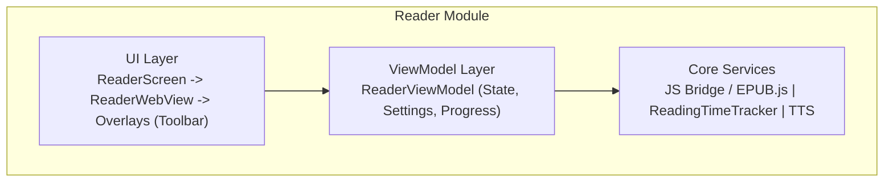

# Reader 模块

> EPUB 阅读器核心引擎 - 跨平台统一文档

---

## 1. 概述

### 1.1 功能范围

| 功能 | 说明 | 优先级 |
|------|------|--------|
| EPUB 渲染 | WebView + EPUB.js | P0 |
| 翻页手势 | 点击/滑动翻页 | P0 |
| 文字选择 | 长按选中文字 | P0 |
| AI 交互 | 查词、解释、翻译 | P0 |
| 阅读设置 | 字体、主题、行距 | P0 |
| 进度同步 | CFI 定位实时同步 | P1 |
| TTS 朗读 | 文字转语音 | P1 |
| 书签笔记 | 添加书签和高亮 | P2 |

### 1.2 平台实现对比

| 功能 | Android | React Native | Web |
|------|---------|--------------|-----|
| EPUB 渲染 | WebView + JS Bridge | react-native-webview | EPUB.js 直接渲染 |
| 手势处理 | Compose 手势 | Gesture Handler | 键盘 + 鼠标点击 |
| TTS | Android TextToSpeech | expo-speech | Web Speech API |
| Token 存储 | DataStore | AsyncStorage | localStorage |
| 状态管理 | StateFlow | Zustand | Zustand |

---

## 2. 数据模型

### ReaderState

| Field | Type | Description |
|-------|------|-------------|
| bookId | string | Current book ID |
| currentChapter | Chapter | Active chapter |
| currentCfi | string | EPUB CFI position |
| progress | number | Reading progress (0-100) |
| settings | ReaderSettings | Display settings |
| isToolbarVisible | boolean | Toolbar state |

### ReaderSettings

| Setting | Type | Range | Description |
|---------|------|-------|-------------|
| theme | enum | light / dark / sepia | Color theme |
| fontSize | number | 14-28 | Font size in points |
| fontFamily | string | - | Font family name |
| lineSpacing | number | 1.2-2.0 | Line height multiplier |
| textAlignment | enum | left / justify | Text alignment |
| pageMode | enum | scroll / paginated | Reading mode |

### TextSelection

| Field | Type | Description |
|-------|------|-------------|
| text | string | Selected text |
| sentence | string (optional) | Containing sentence |
| paragraph | string (optional) | Containing paragraph |
| cfi | string | EPUB CFI position |
| rect | object | x, y, width, height coordinates |

### Bookmark / Highlight

Bookmarks store id, bookId, cfi, text, and createdAt. Highlights additionally include color (yellow, green, blue, pink, purple) and an optional note.

---

## 3. 架构设计

---

## 4. Android 实现要点

- **ReaderWebView**: WebView + JavascriptInterface
- **ReaderBridge**: JS ↔ Kotlin 通信
- **TTSEngine**: Android TextToSpeech API
- **ReadingTimeTracker**: 后台服务追踪阅读时长

## 5. React Native 实现要点

- **ReaderWebView**: react-native-webview
- **Gesture Handler**: 翻页手势
- **expo-speech**: TTS 功能
- **Zustand Store**: 状态管理

## 6. Web 实现要点

- **EPUB.js**: 直接渲染 EPUB
- **键盘导航**: 方向键翻页
- **CSS Transitions**: 翻页动画
- **Web Speech API**: TTS (浏览器支持)

---

## 7. 文字选择菜单操作

| 操作 | 说明 |
|------|------|
| 解释 | AI 上下文解释 |
| 简化 | AI 句子简化 |
| 翻译 | AI 翻译 |
| 高亮 | 添加高亮标注 |
| 生词 | 添加到生词本 |
| 朗读 | TTS 朗读选中文本 |

---

*最后更新: 2025-12-28*
