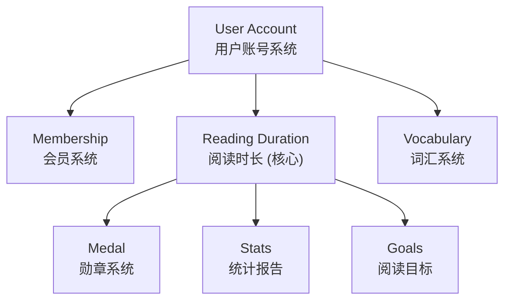
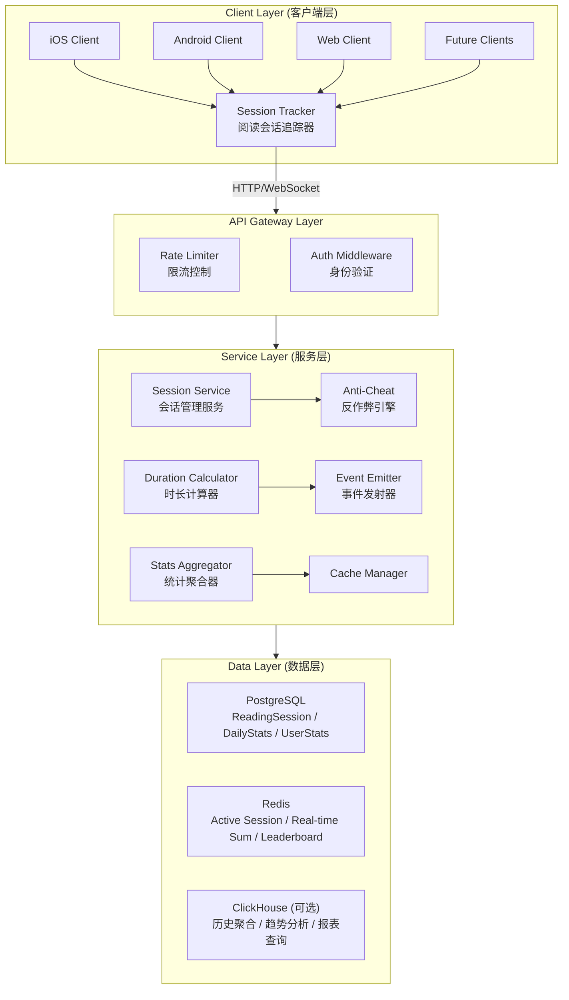
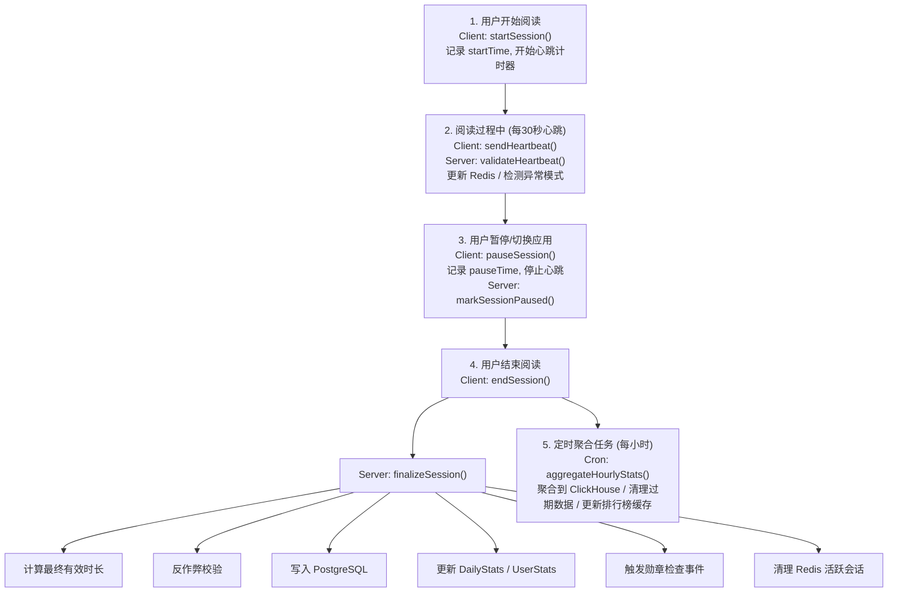

# Readmigo 阅读时长追踪系统设计文档

> Version: 1.0.0
> Status: Draft - Pending Review
> Author: System Architect
> Date: 2025-12-23

---

## 1. 概述

### 1.1 设计目标

构建一个**全栈、跨端、精准**的阅读时长追踪系统，作为 Readmigo 的核心基础设施：

- **全栈覆盖**: 从客户端采集到服务端存储、分析的完整链路
- **跨端同步**: iOS、Android（未来）、Web（未来）多端数据统一归集
- **用户绑定**: 阅读时长永久归属用户账号，不因设备更换而丢失
- **精准计量**: 秒级精度，防作弊，仅计算真实阅读时间
- **实时可用**: 支持实时查询和近实时聚合统计
- **高可扩展**: 支撑亿级用户、千亿级阅读记录

### 1.2 核心原则

| 原则 | 说明 |
|------|------|
| **数据为王** | 阅读时长是用户核心资产，零丢失、高精度 |
| **账号绑定** | 所有数据归属用户账号（包括游客账号） |
| **跨端同步** | 多设备数据自动归集，无缝切换 |
| **防作弊** | 多重校验机制，防止刷时长 |
| **隐私合规** | 仅收集必要数据，支持导出和删除 |

### 1.3 在系统中的定位

---

## 2. 系统架构

### 2.1 整体架构

### 2.2 数据流

---

## 3. 数据模型设计

### 3.1 Prisma Schema

### 3.2 Redis 数据结构

---

## 4. 客户端实现 (iOS)

### 4.1 阅读会话管理器

### 4.2 阅读统计视图

---

## 5. 后端服务实现

### 5.1 会话服务

### 5.2 统计查询服务

---

## 6. 数据导出与隐私

### 6.1 数据导出 API

### 6.2 数据删除

---

## 7. 实施计划

### Phase 1: 核心数据模型 (第1周)

- [ ] 数据库 Schema 设计与迁移
- [ ] Redis 数据结构设计
- [ ] 基础 API 接口定义

### Phase 2: 会话管理 (第2周)

- [ ] 会话开始/暂停/恢复/结束流程
- [ ] 心跳机制实现
- [ ] iOS SessionManager 实现

### Phase 3: 反作弊与统计 (第3周)

- [ ] 反作弊引擎实现
- [ ] 每日/周/月统计聚合
- [ ] 连续天数计算

### Phase 4: 跨端同步 (第4周)

- [ ] 多设备会话冲突处理
- [ ] 数据同步策略
- [ ] 离线缓存与上传

### Phase 5: 统计展示 (第5周)

- [ ] 统计 API 实现
- [ ] iOS 统计页面
- [ ] 排行榜功能

---

## 8. 待确认事项

1. **单次会话最长时长**: 当前设计为 4 小时，是否合适？
2. **连续阅读标准**: 每天至少阅读 15 分钟算一天？
3. **反作弊严格程度**: 是否需要更严格的检测？
4. **排行榜是否公开**: 是否显示用户名或匿名？
5. **历史数据保留**: 详细会话记录保留多久？

---

**Document Status**: Draft - Pending Review
**Next Steps**: 请 review 后提出修改意见

---

## 实施进度

| 版本 | 状态 | 完成度 | 更新日期 | 说明 |
|------|------|--------|----------|------|
| v1.0 | ✅ 核心完成 | 70% | 2025-12-27 | 核心服务已实现，统计功能可用 |
| v1.1 | ✅ 详细统计 | 85% | 2025-12-27 | 新增详细统计API |

### 已完成 ✅
- [x] 系统整体架构设计
- [x] 数据流设计（6个阶段）
- [x] Prisma Schema 实现
  - [x] ReadingSession 模型
  - [x] UserBook 模型（用户书架）
  - [x] DailyStats 模型（每日统计）
- [x] Redis 数据结构设计
- [x] iOS SessionManager 设计
- [x] 反作弊算法设计
- [x] 统计聚合策略设计
- [x] **ReadingService 核心功能**
  - [x] getLibrary - 获取用户书架
  - [x] addToLibrary / removeFromLibrary - 书架管理
  - [x] updateProgress - 更新阅读进度
  - [x] createSession - 创建阅读会话
  - [x] getStats - 获取阅读统计（今日时长、streak、周进度）
  - [x] getCurrentBook - 获取当前阅读书籍
  - [x] calculateStreak - 连续阅读天数计算
  - [x] getWeeklyProgress - 周阅读进度
  - [x] updateDailyStats - 更新每日统计
  - [x] syncOfflineData - 离线数据同步
- [x] RuntimeLog 日志集成
- [x] BookStats 推荐算法集成
- [x] **详细统计 API (v1.1)**
  - [x] GET /reading/stats/today - 今日详细统计
  - [x] GET /reading/stats/weekly - 周统计（含每日明细）
  - [x] GET /reading/stats/monthly - 月统计（含每周明细）
  - [x] GET /reading/stats/time-distribution - 时段分布统计
  - [x] GET /reading/sessions/history - 会话历史查询
- [x] **DTO 完善**
  - [x] DailyStatsDetailDto - 每日详细统计
  - [x] WeeklyStatsDto - 周统计响应
  - [x] MonthlyStatsDto - 月统计响应
  - [x] TimeDistributionDto - 时段分布
  - [x] SessionHistoryDto - 会话历史分页
  - [x] SessionHistoryQueryDto - 历史查询参数
  - [x] StatsQueryDto - 统计查询参数

### 进行中 🚧
- [ ] 心跳机制实现（实时追踪）
- [ ] 反作弊引擎实现

### 待开发 📝

**Phase 1: 核心数据模型 (第1周)**
- [ ] 数据库 Schema 迁移到生产
- [ ] Redis 数据结构实现
- [ ] 基础 API 接口定义
  - [ ] POST /reading/sessions (开始会话)
  - [ ] POST /reading/sessions/:id/pause (暂停)
  - [ ] POST /reading/sessions/:id/resume (恢复)
  - [ ] POST /reading/sessions/:id/end (结束)
  - [ ] POST /reading/heartbeat (心跳)
  - [ ] GET /reading/stats/today (今日统计)
  - [ ] GET /reading/stats/user (累计统计)

**Phase 2: 会话管理 (第2周)**
- [ ] ReadingSessionService 实现
  - [ ] 会话开始/暂停/恢复/结束流程
  - [ ] 心跳处理逻辑
  - [ ] 时长计算逻辑
- [ ] iOS ReadingSessionManager 实现
  - [ ] 会话生命周期管理
  - [ ] 心跳定时器
  - [ ] App生命周期集成
  - [ ] 离线缓存

**Phase 3: 反作弊与统计 (第3周)**
- [ ] 反作弊引擎实现
  - [ ] 时长合理性检查
  - [ ] 心跳频率检查
  - [ ] 校验码验证
  - [ ] 阅读速度检查
  - [ ] 质量评分系统
- [ ] 统计聚合服务
  - [ ] 每日统计更新
  - [ ] 用户累计统计更新
  - [ ] 连续天数计算
  - [ ] 周/月统计聚合
  - [ ] 时间段分布统计

**Phase 4: 跨端同步 (第4周)**
- [ ] 多设备会话冲突处理
- [ ] 数据同步策略
- [ ] 离线缓存与上传
- [ ] 会话恢复机制

**Phase 5: 统计展示 (第5周)** ✅ 后端完成
- [x] ReadingStatsService 实现
  - [x] 今日统计API (GET /reading/stats/today)
  - [x] 周统计API (GET /reading/stats/weekly)
  - [x] 月统计API (GET /reading/stats/monthly)
  - [x] 累计统计API (GET /reading/stats)
  - [x] 时段分布API (GET /reading/stats/time-distribution)
  - [x] 会话历史API (GET /reading/sessions/history)
  - [ ] 排行榜API
- [ ] iOS 统计页面
  - [ ] ReadingStatsView
  - [ ] TodayOverviewCard
  - [ ] WeeklyChartCard
  - [ ] StreakCard
  - [ ] TimeDistributionCard
  - [ ] 趋势图表（Swift Charts）

**Phase 6: 隐私与合规**
- [ ] 数据导出API实现
- [ ] 数据删除API实现
- [ ] 用户阅读数据导出功能

### 依赖项
- ✅ Account 数据模型已存在
- ✅ Book 数据模型已存在
- ✅ Redis 已配置
- 📝 需要勋章系统集成（监听 reading.session.end 事件）
- 📝 需要阅读目标系统
- 📝 需要排行榜UI设计

### 技术债务
- 缺少 ClickHouse 集成（可选，用于大数据分析）
- 缺少实时推送通知（当达成目标时）
- 缺少阅读报告PDF导出
- 缺少数据分析仪表盘
- 心跳token生成算法需要加强（当前是简单SHA256）
