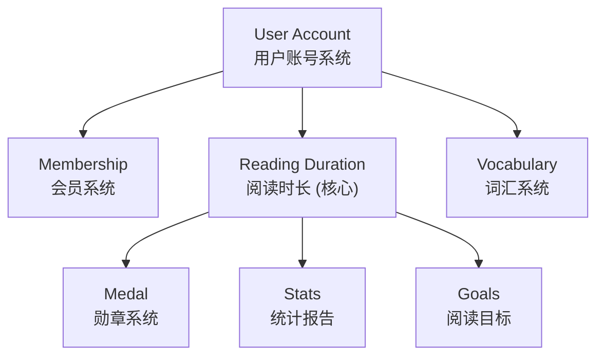
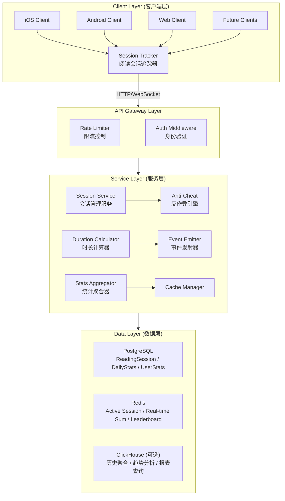
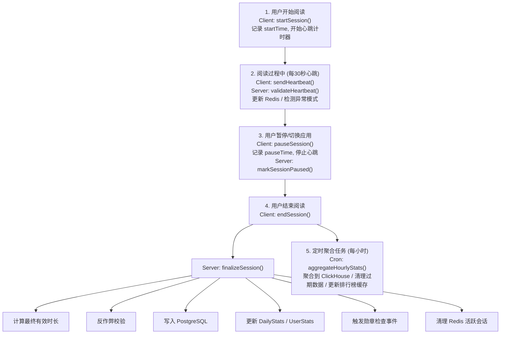

# Readmigo 阅读时长追踪系统设计文档

> Version: 1.0.0
> Status: Draft - Pending Review
> Author: System Architect
> Date: 2025-12-23

---

## 1. 概述

### 1.1 设计目标

构建一个**全栈、跨端、精准**的阅读时长追踪系统，作为 Readmigo 的核心基础设施：

- **全栈覆盖**: 从客户端采集到服务端存储、分析的完整链路
- **跨端同步**: iOS、Android（未来）、Web（未来）多端数据统一归集
- **用户绑定**: 阅读时长永久归属用户账号，不因设备更换而丢失
- **精准计量**: 秒级精度，防作弊，仅计算真实阅读时间
- **实时可用**: 支持实时查询和近实时聚合统计
- **高可扩展**: 支撑亿级用户、千亿级阅读记录

### 1.2 核心原则

| 原则 | 说明 |
|------|------|
| **数据为王** | 阅读时长是用户核心资产，零丢失、高精度 |
| **账号绑定** | 所有数据归属用户账号（包括游客账号） |
| **跨端同步** | 多设备数据自动归集，无缝切换 |
| **防作弊** | 多重校验机制，防止刷时长 |
| **隐私合规** | 仅收集必要数据，支持导出和删除 |

### 1.3 在系统中的定位



---

## 2. 系统架构

### 2.1 整体架构



### 2.2 数据流



---

## 3. 数据模型设计

### 3.1 Prisma Schema

```prisma
// packages/database/prisma/schema.prisma

// ============================================
// 阅读会话 - 记录每次阅读的详细信息
// ============================================
model ReadingSession {
  id                String            @id @default(uuid())

  // 用户关联 (关联到 Account 而非 User)
  accountId         String
  account           Account           @relation(fields: [accountId], references: [id], onDelete: Cascade)

  // 书籍关联
  bookId            String
  book              Book              @relation(fields: [bookId], references: [id])

  // 会话时间
  startedAt         DateTime          @default(now())
  endedAt           DateTime?
  pausedAt          DateTime?

  // 时长数据 (单位: 秒)
  totalDuration     Int               @default(0)  // 总时长
  activeDuration    Int               @default(0)  // 有效阅读时长 (去除暂停)
  adjustedDuration  Int               @default(0)  // 校正后时长 (反作弊处理)

  // 阅读进度
  startPage         Int?
  endPage           Int?
  startChapter      String?
  endChapter        String?
  pagesRead         Int               @default(0)
  wordsRead         Int               @default(0)  // 估算阅读字数

  // 设备信息
  deviceId          String?
  platform          Platform          @default(IOS)
  appVersion        String?

  // 会话状态
  status            SessionStatus     @default(ACTIVE)

  // 质量评估
  qualityScore      Float?            // 0-1, 越高越可信
  flags             String[]          // 异常标记

  // 心跳记录 (用于验证)
  heartbeatCount    Int               @default(0)
  lastHeartbeatAt   DateTime?

  // 元数据
  metadata          Json?

  createdAt         DateTime          @default(now())
  updatedAt         DateTime          @updatedAt

  @@index([accountId])
  @@index([bookId])
  @@index([startedAt])
  @@index([accountId, startedAt])
  @@index([status])
}

enum SessionStatus {
  ACTIVE      // 进行中
  PAUSED      // 已暂停
  COMPLETED   // 正常结束
  ABANDONED   // 异常结束 (无结束请求)
  INVALID     // 无效 (反作弊标记)
}

// ============================================
// 每日统计 - 按天聚合的阅读数据
// ============================================
model DailyReadingStats {
  id                String    @id @default(uuid())

  accountId         String
  account           Account   @relation(fields: [accountId], references: [id], onDelete: Cascade)

  date              DateTime  @db.Date  // 统计日期

  // 时长统计 (单位: 秒)
  totalDuration     Int       @default(0)  // 总阅读时长
  activeDuration    Int       @default(0)  // 有效阅读时长

  // 会话统计
  sessionCount      Int       @default(0)  // 阅读会话数
  completedSessions Int       @default(0)  // 完成的会话数

  // 内容统计
  booksRead         Int       @default(0)  // 阅读书籍数
  pagesRead         Int       @default(0)  // 阅读页数
  wordsRead         Int       @default(0)  // 阅读字数
  chaptersCompleted Int       @default(0)  // 完成章节数

  // 词汇学习
  wordsLearned      Int       @default(0)  // 学习的单词数
  aiInteractions    Int       @default(0)  // AI 交互次数

  // 时间分布
  morningMinutes    Int       @default(0)  // 早晨 (5-12点)
  afternoonMinutes  Int       @default(0)  // 下午 (12-18点)
  eveningMinutes    Int       @default(0)  // 晚上 (18-22点)
  nightMinutes      Int       @default(0)  // 夜间 (22-5点)

  // 连续阅读
  isReadingDay      Boolean   @default(false)  // 是否达到当日阅读标准
  goalMinutes       Int       @default(15)     // 当日目标分钟数
  goalAchieved      Boolean   @default(false)  // 是否达成目标

  createdAt         DateTime  @default(now())
  updatedAt         DateTime  @updatedAt

  @@unique([accountId, date])
  @@index([accountId])
  @@index([date])
  @@index([accountId, date])
}

// ============================================
// 用户累计统计 - 汇总的用户阅读数据
// ============================================
model UserReadingStats {
  id                      String    @id @default(uuid())

  accountId               String    @unique
  account                 Account   @relation(fields: [accountId], references: [id], onDelete: Cascade)

  // 累计时长 (单位: 秒)
  totalDuration           Int       @default(0)
  totalActiveDuration     Int       @default(0)

  // 累计内容
  totalBooksStarted       Int       @default(0)
  totalBooksCompleted     Int       @default(0)
  totalPagesRead          Int       @default(0)
  totalWordsRead          BigInt    @default(0)
  totalChaptersCompleted  Int       @default(0)

  // 词汇学习
  totalWordsLearned       Int       @default(0)
  totalAIInteractions     Int       @default(0)

  // 会话统计
  totalSessions           Int       @default(0)
  averageSessionDuration  Int       @default(0)  // 秒

  // 连续阅读
  currentStreak           Int       @default(0)  // 当前连续天数
  longestStreak           Int       @default(0)  // 最长连续天数
  lastReadDate            DateTime?              // 最后阅读日期

  // 目标达成
  totalGoalDays           Int       @default(0)  // 达成目标的总天数
  currentGoalStreak       Int       @default(0)  // 当前连续达标天数

  // 时间分布
  morningTotalMinutes     Int       @default(0)
  afternoonTotalMinutes   Int       @default(0)
  eveningTotalMinutes     Int       @default(0)
  nightTotalMinutes       Int       @default(0)

  // 最爱阅读时段
  favoriteTimeSlot        String?   // 'morning' | 'afternoon' | 'evening' | 'night'

  // 里程碑
  firstReadAt             DateTime?
  reached100HoursAt       DateTime?
  reached500HoursAt       DateTime?
  reached1000HoursAt      DateTime?

  createdAt               DateTime  @default(now())
  updatedAt               DateTime  @updatedAt

  @@index([accountId])
  @@index([totalDuration])
  @@index([currentStreak])
}

// ============================================
// 阅读心跳记录 - 用于反作弊验证
// ============================================
model ReadingHeartbeat {
  id              String    @id @default(uuid())

  sessionId       String
  accountId       String

  timestamp       DateTime  @default(now())
  pageNumber      Int?
  scrollPosition  Float?    // 0-1 滚动位置

  // 设备状态
  batteryLevel    Float?
  isCharging      Boolean?
  networkType     String?   // wifi, cellular, offline

  // 验证信息
  clientToken     String?   // 客户端生成的防伪token

  @@index([sessionId])
  @@index([accountId, timestamp])
}

// ============================================
// 周/月统计 - 用于报表展示
// ============================================
model WeeklyReadingStats {
  id                String    @id @default(uuid())
  accountId         String
  account           Account   @relation(fields: [accountId], references: [id], onDelete: Cascade)

  year              Int
  week              Int       // 1-53

  totalDuration     Int       @default(0)
  sessionCount      Int       @default(0)
  booksRead         Int       @default(0)
  pagesRead         Int       @default(0)
  wordsLearned      Int       @default(0)
  readingDays       Int       @default(0)  // 本周阅读天数
  goalDays          Int       @default(0)  // 达成目标的天数

  createdAt         DateTime  @default(now())
  updatedAt         DateTime  @updatedAt

  @@unique([accountId, year, week])
  @@index([accountId])
}

model MonthlyReadingStats {
  id                String    @id @default(uuid())
  accountId         String
  account           Account   @relation(fields: [accountId], references: [id], onDelete: Cascade)

  year              Int
  month             Int       // 1-12

  totalDuration     Int       @default(0)
  sessionCount      Int       @default(0)
  booksRead         Int       @default(0)
  booksCompleted    Int       @default(0)
  pagesRead         Int       @default(0)
  wordsLearned      Int       @default(0)
  readingDays       Int       @default(0)
  goalDays          Int       @default(0)

  // 对比上月
  durationChange    Float?    // 百分比变化
  booksChange       Float?

  createdAt         DateTime  @default(now())
  updatedAt         DateTime  @updatedAt

  @@unique([accountId, year, month])
  @@index([accountId])
}
```

### 3.2 Redis 数据结构

```typescript
// Redis Keys Design

// 1. 活跃会话
// Key: reading:session:active:{sessionId}
// Type: Hash
// TTL: 1 hour (每次心跳续期)
{
  accountId: string,
  bookId: string,
  startedAt: timestamp,
  lastHeartbeat: timestamp,
  heartbeatCount: number,
  status: 'ACTIVE' | 'PAUSED',
  pageNumber: number,
}

// 2. 用户当日阅读时长 (实时更新)
// Key: reading:daily:{accountId}:{date}
// Type: Hash
// TTL: 48 hours
{
  totalSeconds: number,
  sessionCount: number,
  lastUpdated: timestamp,
}

// 3. 用户累计阅读时长 (缓存)
// Key: reading:total:{accountId}
// Type: String (seconds)
// TTL: 1 hour

// 4. 用户当前连续天数 (缓存)
// Key: reading:streak:{accountId}
// Type: String (days)
// TTL: 24 hours

// 5. 日排行榜
// Key: reading:leaderboard:daily:{date}
// Type: Sorted Set
// Score: duration in seconds
// TTL: 7 days

// 6. 周排行榜
// Key: reading:leaderboard:weekly:{year}:{week}
// Type: Sorted Set
// TTL: 30 days

// 7. 防重复心跳
// Key: reading:heartbeat:lock:{sessionId}:{timestamp_minute}
// Type: String
// TTL: 60 seconds
```

---

## 4. 客户端实现 (iOS)

### 4.1 阅读会话管理器

```swift
// ReadingSessionManager.swift

import Foundation
import Combine

@MainActor
class ReadingSessionManager: ObservableObject {
    static let shared = ReadingSessionManager()

    // MARK: - Published State

    @Published private(set) var currentSession: ReadingSession?
    @Published private(set) var isReading: Bool = false
    @Published private(set) var todayDuration: Int = 0  // 秒
    @Published private(set) var currentSessionDuration: Int = 0  // 秒

    // MARK: - Private State

    private var heartbeatTimer: Timer?
    private var durationTimer: Timer?
    private var sessionStartTime: Date?
    private var totalPausedTime: TimeInterval = 0
    private var lastPauseTime: Date?

    private let heartbeatInterval: TimeInterval = 30  // 30秒心跳
    private let minReadingDuration: TimeInterval = 60  // 至少1分钟才算有效

    private var cancellables = Set<AnyCancellable>()

    // MARK: - Session Lifecycle

    /// 开始阅读会话
    func startSession(
        bookId: String,
        chapterId: String? = nil,
        pageNumber: Int? = nil
    ) async throws -> String {
        // 如果有进行中的会话，先结束
        if let currentSession = currentSession {
            try await endSession()
        }

        // 创建会话
        let request = StartSessionRequest(
            bookId: bookId,
            chapterId: chapterId,
            pageNumber: pageNumber,
            deviceId: DeviceManager.shared.deviceId,
            platform: "IOS",
            appVersion: Bundle.main.appVersion
        )

        let response: StartSessionResponse = try await APIClient.shared.request(
            endpoint: "/reading/sessions",
            method: .post,
            body: request
        )

        // 初始化本地状态
        currentSession = response.session
        sessionStartTime = Date()
        totalPausedTime = 0
        lastPauseTime = nil
        isReading = true
        currentSessionDuration = 0

        // 启动心跳
        startHeartbeat()

        // 启动时长计时器
        startDurationTimer()

        return response.session.id
    }

    /// 暂停阅读会话
    func pauseSession() {
        guard isReading, let session = currentSession else { return }

        isReading = false
        lastPauseTime = Date()

        // 停止心跳
        stopHeartbeat()

        // 通知服务器
        Task {
            try? await APIClient.shared.request(
                endpoint: "/reading/sessions/\(session.id)/pause",
                method: .post
            ) as EmptyResponse
        }
    }

    /// 恢复阅读会话
    func resumeSession() {
        guard !isReading, let session = currentSession else { return }

        // 计算暂停时长
        if let pauseTime = lastPauseTime {
            totalPausedTime += Date().timeIntervalSince(pauseTime)
        }
        lastPauseTime = nil

        isReading = true

        // 恢复心跳
        startHeartbeat()

        // 通知服务器
        Task {
            try? await APIClient.shared.request(
                endpoint: "/reading/sessions/\(session.id)/resume",
                method: .post
            ) as EmptyResponse
        }
    }

    /// 结束阅读会话
    func endSession(
        pageNumber: Int? = nil,
        chapterId: String? = nil
    ) async throws {
        guard let session = currentSession else { return }

        // 停止计时器
        stopHeartbeat()
        stopDurationTimer()

        // 计算最终时长
        let endTime = Date()
        let totalDuration = endTime.timeIntervalSince(sessionStartTime ?? endTime)
        let activeDuration = totalDuration - totalPausedTime

        // 本地校验
        let validDuration = validateDuration(activeDuration)

        // 发送结束请求
        let request = EndSessionRequest(
            endTime: endTime,
            pageNumber: pageNumber,
            chapterId: chapterId,
            totalDuration: Int(totalDuration),
            activeDuration: Int(validDuration),
            pagesRead: calculatePagesRead(session, endPage: pageNumber),
            clientChecksum: generateChecksum(session, duration: validDuration)
        )

        let response: EndSessionResponse = try await APIClient.shared.request(
            endpoint: "/reading/sessions/\(session.id)/end",
            method: .post,
            body: request
        )

        // 更新统计
        todayDuration += response.addedDuration

        // 清理状态
        currentSession = nil
        sessionStartTime = nil
        totalPausedTime = 0
        lastPauseTime = nil
        isReading = false
        currentSessionDuration = 0

        // 触发本地事件 (如勋章检查)
        NotificationCenter.default.post(
            name: .readingSessionEnded,
            object: nil,
            userInfo: ["duration": response.addedDuration]
        )
    }

    // MARK: - Heartbeat

    private func startHeartbeat() {
        heartbeatTimer?.invalidate()
        heartbeatTimer = Timer.scheduledTimer(
            withTimeInterval: heartbeatInterval,
            repeats: true
        ) { [weak self] _ in
            Task { await self?.sendHeartbeat() }
        }
    }

    private func stopHeartbeat() {
        heartbeatTimer?.invalidate()
        heartbeatTimer = nil
    }

    private func sendHeartbeat() async {
        guard let session = currentSession, isReading else { return }

        let heartbeat = HeartbeatRequest(
            sessionId: session.id,
            timestamp: Date(),
            pageNumber: nil,  // TODO: 从阅读器获取
            scrollPosition: nil,
            batteryLevel: getBatteryLevel(),
            isCharging: isCharging(),
            networkType: getNetworkType(),
            clientToken: generateHeartbeatToken()
        )

        do {
            try await APIClient.shared.request(
                endpoint: "/reading/heartbeat",
                method: .post,
                body: heartbeat
            ) as EmptyResponse
        } catch {
            // 心跳失败不中断阅读，记录日志
            print("Heartbeat failed: \(error)")
        }
    }

    // MARK: - Duration Timer

    private func startDurationTimer() {
        durationTimer?.invalidate()
        durationTimer = Timer.scheduledTimer(
            withTimeInterval: 1,
            repeats: true
        ) { [weak self] _ in
            guard let self = self, self.isReading else { return }
            Task { @MainActor in
                self.currentSessionDuration += 1
            }
        }
    }

    private func stopDurationTimer() {
        durationTimer?.invalidate()
        durationTimer = nil
    }

    // MARK: - Validation

    private func validateDuration(_ duration: TimeInterval) -> TimeInterval {
        // 基本校验
        guard duration > 0 else { return 0 }
        guard duration >= minReadingDuration else { return 0 }

        // 单次会话上限 (4小时)
        let maxSessionDuration: TimeInterval = 4 * 60 * 60
        return min(duration, maxSessionDuration)
    }

    private func calculatePagesRead(_ session: ReadingSession, endPage: Int?) -> Int {
        guard let startPage = session.startPage, let endPage = endPage else {
            return 0
        }
        return max(0, endPage - startPage)
    }

    private func generateChecksum(_ session: ReadingSession, duration: TimeInterval) -> String {
        // 生成防篡改校验码
        let data = "\(session.id):\(duration):\(DeviceManager.shared.deviceId)"
        return data.sha256()
    }

    private func generateHeartbeatToken() -> String {
        // 生成心跳防伪token
        let timestamp = Int(Date().timeIntervalSince1970)
        let random = UUID().uuidString.prefix(8)
        return "\(timestamp):\(random)".sha256().prefix(16).description
    }

    // MARK: - App Lifecycle

    func handleAppWillResignActive() {
        if isReading {
            pauseSession()
        }
    }

    func handleAppDidBecomeActive() {
        // 检查会话是否过期 (超过30分钟暂停自动结束)
        if let session = currentSession, !isReading {
            if let pauseTime = lastPauseTime,
               Date().timeIntervalSince(pauseTime) > 30 * 60 {
                // 会话已过期，强制结束
                Task {
                    try? await endSession()
                }
            } else {
                // 恢复会话
                resumeSession()
            }
        }
    }

    // MARK: - Sync

    func syncTodayStats() async {
        do {
            let response: TodayStatsResponse = try await APIClient.shared.request(
                endpoint: "/reading/stats/today"
            )
            todayDuration = response.totalSeconds
        } catch {
            print("Failed to sync today stats: \(error)")
        }
    }
}

// MARK: - Notifications

extension Notification.Name {
    static let readingSessionEnded = Notification.Name("readingSessionEnded")
}

// MARK: - Request/Response Models

struct StartSessionRequest: Encodable {
    let bookId: String
    let chapterId: String?
    let pageNumber: Int?
    let deviceId: String
    let platform: String
    let appVersion: String
}

struct StartSessionResponse: Decodable {
    let session: ReadingSession
}

struct EndSessionRequest: Encodable {
    let endTime: Date
    let pageNumber: Int?
    let chapterId: String?
    let totalDuration: Int
    let activeDuration: Int
    let pagesRead: Int
    let clientChecksum: String
}

struct EndSessionResponse: Decodable {
    let session: ReadingSession
    let addedDuration: Int
    let todayTotal: Int
}

struct HeartbeatRequest: Encodable {
    let sessionId: String
    let timestamp: Date
    let pageNumber: Int?
    let scrollPosition: Float?
    let batteryLevel: Float?
    let isCharging: Bool?
    let networkType: String?
    let clientToken: String
}
```

### 4.2 阅读统计视图

```swift
// ReadingStatsView.swift

import SwiftUI
import Charts

struct ReadingStatsView: View {
    @StateObject private var viewModel = ReadingStatsViewModel()

    var body: some View {
        ScrollView {
            VStack(spacing: 24) {
                // 今日概览
                TodayOverviewCard(stats: viewModel.todayStats)

                // 本周趋势图
                WeeklyChartCard(data: viewModel.weeklyData)

                // 累计统计
                TotalStatsCard(stats: viewModel.totalStats)

                // 连续阅读
                StreakCard(
                    currentStreak: viewModel.totalStats?.currentStreak ?? 0,
                    longestStreak: viewModel.totalStats?.longestStreak ?? 0
                )

                // 阅读时段分布
                TimeDistributionCard(
                    morning: viewModel.totalStats?.morningTotalMinutes ?? 0,
                    afternoon: viewModel.totalStats?.afternoonTotalMinutes ?? 0,
                    evening: viewModel.totalStats?.eveningTotalMinutes ?? 0,
                    night: viewModel.totalStats?.nightTotalMinutes ?? 0
                )
            }
            .padding()
        }
        .navigationTitle("阅读统计")
        .task {
            await viewModel.loadStats()
        }
        .refreshable {
            await viewModel.loadStats()
        }
    }
}

struct TodayOverviewCard: View {
    let stats: DailyReadingStats?

    var body: some View {
        VStack(spacing: 16) {
            // 今日阅读时长 (大字突出)
            VStack(spacing: 4) {
                Text(formatDuration(stats?.totalDuration ?? 0))
                    .font(.system(size: 48, weight: .bold, design: .rounded))

                Text("今日阅读")
                    .font(.subheadline)
                    .foregroundColor(.secondary)
            }

            // 目标进度
            if let stats = stats {
                GoalProgressBar(
                    current: stats.totalDuration / 60,
                    goal: stats.goalMinutes,
                    achieved: stats.goalAchieved
                )
            }

            // 今日指标
            HStack(spacing: 20) {
                StatItem(
                    icon: "book.fill",
                    value: "\(stats?.booksRead ?? 0)",
                    label: "书籍"
                )

                StatItem(
                    icon: "doc.text.fill",
                    value: "\(stats?.pagesRead ?? 0)",
                    label: "页数"
                )

                StatItem(
                    icon: "textformat.abc",
                    value: "\(stats?.wordsLearned ?? 0)",
                    label: "单词"
                )
            }
        }
        .padding()
        .background(Color(.systemBackground))
        .cornerRadius(16)
        .shadow(color: .black.opacity(0.05), radius: 10)
    }
}

struct GoalProgressBar: View {
    let current: Int  // 分钟
    let goal: Int
    let achieved: Bool

    var progress: Double {
        guard goal > 0 else { return 0 }
        return min(1.0, Double(current) / Double(goal))
    }

    var body: some View {
        VStack(spacing: 8) {
            HStack {
                Text("今日目标: \(goal)分钟")
                    .font(.caption)
                    .foregroundColor(.secondary)

                Spacer()

                if achieved {
                    HStack(spacing: 4) {
                        Image(systemName: "checkmark.circle.fill")
                            .foregroundColor(.green)
                        Text("已达成")
                            .foregroundColor(.green)
                    }
                    .font(.caption)
                }
            }

            GeometryReader { geometry in
                ZStack(alignment: .leading) {
                    RoundedRectangle(cornerRadius: 4)
                        .fill(Color.secondary.opacity(0.2))
                        .frame(height: 8)

                    RoundedRectangle(cornerRadius: 4)
                        .fill(
                            LinearGradient(
                                colors: achieved
                                    ? [.green, .green.opacity(0.8)]
                                    : [.blue, .purple],
                                startPoint: .leading,
                                endPoint: .trailing
                            )
                        )
                        .frame(width: geometry.size.width * progress, height: 8)
                }
            }
            .frame(height: 8)
        }
    }
}

struct WeeklyChartCard: View {
    let data: [DailyReadingStats]

    var body: some View {
        VStack(alignment: .leading, spacing: 12) {
            Text("本周趋势")
                .font(.headline)

            Chart(data) { stat in
                BarMark(
                    x: .value("日期", stat.date, unit: .day),
                    y: .value("分钟", stat.totalDuration / 60)
                )
                .foregroundStyle(
                    LinearGradient(
                        colors: [.blue, .purple],
                        startPoint: .bottom,
                        endPoint: .top
                    )
                )
                .cornerRadius(4)
            }
            .frame(height: 150)
            .chartXAxis {
                AxisMarks(values: .stride(by: .day)) { value in
                    AxisValueLabel(format: .dateTime.weekday(.abbreviated))
                }
            }
        }
        .padding()
        .background(Color(.systemBackground))
        .cornerRadius(16)
        .shadow(color: .black.opacity(0.05), radius: 10)
    }
}

struct StreakCard: View {
    let currentStreak: Int
    let longestStreak: Int

    var body: some View {
        HStack(spacing: 20) {
            VStack(spacing: 8) {
                HStack(spacing: 4) {
                    Image(systemName: "flame.fill")
                        .foregroundColor(.orange)
                    Text("\(currentStreak)")
                        .font(.title)
                        .fontWeight(.bold)
                }

                Text("当前连续")
                    .font(.caption)
                    .foregroundColor(.secondary)
            }
            .frame(maxWidth: .infinity)

            Divider()
                .frame(height: 40)

            VStack(spacing: 8) {
                HStack(spacing: 4) {
                    Image(systemName: "crown.fill")
                        .foregroundColor(.yellow)
                    Text("\(longestStreak)")
                        .font(.title)
                        .fontWeight(.bold)
                }

                Text("最长连续")
                    .font(.caption)
                    .foregroundColor(.secondary)
            }
            .frame(maxWidth: .infinity)
        }
        .padding()
        .background(Color(.systemBackground))
        .cornerRadius(16)
        .shadow(color: .black.opacity(0.05), radius: 10)
    }
}
```

---

## 5. 后端服务实现

### 5.1 会话服务

```typescript
// ReadingSessionService.ts

import { Injectable } from '@nestjs/common';
import { PrismaService } from './prisma.service';
import { RedisService } from './redis.service';
import { EventEmitter2 } from '@nestjs/event-emitter';

@Injectable()
export class ReadingSessionService {
  constructor(
    private prisma: PrismaService,
    private redis: RedisService,
    private eventEmitter: EventEmitter2,
  ) {}

  // 开始会话
  async startSession(
    accountId: string,
    data: StartSessionDto,
  ): Promise<ReadingSession> {
    // 检查是否有未结束的会话
    const activeSession = await this.getActiveSession(accountId);
    if (activeSession) {
      // 自动结束之前的会话
      await this.forceEndSession(activeSession.id, 'NEW_SESSION_STARTED');
    }

    // 创建新会话
    const session = await this.prisma.readingSession.create({
      data: {
        accountId,
        bookId: data.bookId,
        startedAt: new Date(),
        startPage: data.pageNumber,
        startChapter: data.chapterId,
        deviceId: data.deviceId,
        platform: data.platform,
        appVersion: data.appVersion,
        status: 'ACTIVE',
      },
    });

    // 写入 Redis
    await this.redis.hset(`reading:session:active:${session.id}`, {
      accountId,
      bookId: data.bookId,
      startedAt: session.startedAt.toISOString(),
      lastHeartbeat: new Date().toISOString(),
      heartbeatCount: 0,
      status: 'ACTIVE',
    });
    await this.redis.expire(`reading:session:active:${session.id}`, 3600);

    return session;
  }

  // 心跳处理
  async handleHeartbeat(data: HeartbeatDto): Promise<void> {
    const sessionKey = `reading:session:active:${data.sessionId}`;

    // 检查会话是否存在
    const sessionData = await this.redis.hgetall(sessionKey);
    if (!sessionData || !sessionData.accountId) {
      throw new NotFoundException('Session not found or expired');
    }

    // 验证心跳 token
    if (!this.validateHeartbeatToken(data.clientToken)) {
      await this.flagSession(data.sessionId, 'INVALID_HEARTBEAT_TOKEN');
      throw new BadRequestException('Invalid heartbeat token');
    }

    // 防重复心跳
    const lockKey = `reading:heartbeat:lock:${data.sessionId}:${Math.floor(data.timestamp.getTime() / 60000)}`;
    const locked = await this.redis.setnx(lockKey, '1');
    if (!locked) {
      return; // 本分钟已处理过
    }
    await this.redis.expire(lockKey, 60);

    // 更新 Redis
    await this.redis.hset(sessionKey, {
      lastHeartbeat: data.timestamp.toISOString(),
      heartbeatCount: parseInt(sessionData.heartbeatCount || '0') + 1,
      pageNumber: data.pageNumber?.toString() || '',
    });
    await this.redis.expire(sessionKey, 3600);

    // 记录心跳 (异步，不阻塞响应)
    this.saveHeartbeatAsync(data, sessionData.accountId);
  }

  // 结束会话
  async endSession(
    sessionId: string,
    accountId: string,
    data: EndSessionDto,
  ): Promise<EndSessionResult> {
    // 获取会话
    const session = await this.prisma.readingSession.findFirst({
      where: { id: sessionId, accountId },
    });

    if (!session) {
      throw new NotFoundException('Session not found');
    }

    if (session.status !== 'ACTIVE' && session.status !== 'PAUSED') {
      throw new BadRequestException('Session already ended');
    }

    // 获取 Redis 数据
    const redisData = await this.redis.hgetall(`reading:session:active:${sessionId}`);

    // 计算时长
    const duration = await this.calculateDuration(session, data, redisData);

    // 反作弊检查
    const antiCheatResult = await this.antiCheatCheck(session, duration, data, redisData);

    // 更新会话
    const updatedSession = await this.prisma.readingSession.update({
      where: { id: sessionId },
      data: {
        endedAt: data.endTime,
        endPage: data.pageNumber,
        endChapter: data.chapterId,
        totalDuration: duration.total,
        activeDuration: duration.active,
        adjustedDuration: antiCheatResult.adjustedDuration,
        pagesRead: data.pagesRead,
        wordsRead: this.estimateWordsRead(data.pagesRead),
        status: antiCheatResult.isValid ? 'COMPLETED' : 'INVALID',
        qualityScore: antiCheatResult.qualityScore,
        flags: antiCheatResult.flags,
        heartbeatCount: parseInt(redisData?.heartbeatCount || '0'),
      },
    });

    // 更新统计
    if (antiCheatResult.isValid) {
      await this.updateStats(accountId, antiCheatResult.adjustedDuration, data);
    }

    // 清理 Redis
    await this.redis.del(`reading:session:active:${sessionId}`);

    // 触发事件
    this.eventEmitter.emit('reading.session.end', {
      accountId,
      sessionId,
      duration: antiCheatResult.adjustedDuration,
      bookId: session.bookId,
    });

    // 获取今日总时长
    const todayTotal = await this.getTodayDuration(accountId);

    return {
      session: updatedSession,
      addedDuration: antiCheatResult.adjustedDuration,
      todayTotal,
    };
  }

  // 计算时长
  private async calculateDuration(
    session: ReadingSession,
    data: EndSessionDto,
    redisData: any,
  ): Promise<{ total: number; active: number }> {
    const startTime = session.startedAt.getTime();
    const endTime = data.endTime.getTime();
    const totalMs = endTime - startTime;

    // 客户端报告的活跃时长
    const clientActiveDuration = data.activeDuration;

    // 服务端估算 (基于心跳)
    const heartbeatCount = parseInt(redisData?.heartbeatCount || '0');
    const serverEstimate = heartbeatCount * 30; // 每次心跳代表30秒

    // 取较小值作为有效时长 (防止客户端作弊)
    const activeDuration = Math.min(
      clientActiveDuration,
      serverEstimate + 60, // 允许60秒误差
      totalMs / 1000,
    );

    return {
      total: Math.floor(totalMs / 1000),
      active: Math.floor(activeDuration),
    };
  }

  // 反作弊检查
  private async antiCheatCheck(
    session: ReadingSession,
    duration: { total: number; active: number },
    data: EndSessionDto,
    redisData: any,
  ): Promise<AntiCheatResult> {
    const flags: string[] = [];
    let qualityScore = 1.0;
    let isValid = true;

    // 1. 时长合理性检查
    if (duration.active < 60) {
      flags.push('TOO_SHORT');
      isValid = false;
    }

    if (duration.active > 4 * 60 * 60) {
      flags.push('TOO_LONG');
      qualityScore -= 0.2;
    }

    // 2. 心跳频率检查
    const heartbeatCount = parseInt(redisData?.heartbeatCount || '0');
    const expectedHeartbeats = Math.floor(duration.active / 30);

    if (heartbeatCount < expectedHeartbeats * 0.5) {
      flags.push('LOW_HEARTBEAT');
      qualityScore -= 0.3;
    }

    // 3. 校验码验证
    if (!this.verifyChecksum(data.clientChecksum, session.id, duration.active)) {
      flags.push('INVALID_CHECKSUM');
      qualityScore -= 0.4;
    }

    // 4. 页面进度检查
    if (data.pagesRead > 0) {
      const readingSpeed = duration.active / (data.pagesRead * 60); // 分钟/页
      if (readingSpeed < 0.5) {
        flags.push('UNREALISTIC_SPEED');
        qualityScore -= 0.2;
      }
    }

    // 5. 重复会话检查
    const recentSessions = await this.prisma.readingSession.count({
      where: {
        accountId: session.accountId,
        bookId: session.bookId,
        startedAt: { gte: new Date(Date.now() - 60 * 60 * 1000) }, // 1小时内
        status: 'COMPLETED',
      },
    });

    if (recentSessions > 10) {
      flags.push('TOO_MANY_SESSIONS');
      qualityScore -= 0.2;
    }

    // 计算调整后时长
    let adjustedDuration = duration.active;
    if (qualityScore < 0.5) {
      adjustedDuration = 0;
      isValid = false;
    } else if (qualityScore < 0.8) {
      adjustedDuration = Math.floor(duration.active * qualityScore);
    }

    return {
      isValid,
      qualityScore: Math.max(0, qualityScore),
      adjustedDuration,
      flags,
    };
  }

  // 更新统计
  private async updateStats(
    accountId: string,
    duration: number,
    data: EndSessionDto,
  ): Promise<void> {
    const today = new Date();
    today.setHours(0, 0, 0, 0);

    // 确定时间段
    const hour = new Date().getHours();
    const timeSlot = this.getTimeSlot(hour);

    // 更新每日统计
    await this.prisma.dailyReadingStats.upsert({
      where: {
        accountId_date: { accountId, date: today },
      },
      update: {
        totalDuration: { increment: duration },
        activeDuration: { increment: duration },
        sessionCount: { increment: 1 },
        completedSessions: { increment: 1 },
        pagesRead: { increment: data.pagesRead },
        [`${timeSlot}Minutes`]: { increment: Math.floor(duration / 60) },
        isReadingDay: true,
      },
      create: {
        accountId,
        date: today,
        totalDuration: duration,
        activeDuration: duration,
        sessionCount: 1,
        completedSessions: 1,
        pagesRead: data.pagesRead,
        [`${timeSlot}Minutes`]: Math.floor(duration / 60),
        isReadingDay: true,
      },
    });

    // 更新用户累计统计
    await this.updateUserStats(accountId, duration, data);

    // 更新 Redis 缓存
    const dateStr = today.toISOString().split('T')[0];
    await this.redis.hincrby(`reading:daily:${accountId}:${dateStr}`, 'totalSeconds', duration);
    await this.redis.expire(`reading:daily:${accountId}:${dateStr}`, 48 * 3600);
  }

  // 更新用户累计统计
  private async updateUserStats(
    accountId: string,
    duration: number,
    data: EndSessionDto,
  ): Promise<void> {
    // 获取或创建用户统计
    let userStats = await this.prisma.userReadingStats.findUnique({
      where: { accountId },
    });

    if (!userStats) {
      userStats = await this.prisma.userReadingStats.create({
        data: { accountId, firstReadAt: new Date() },
      });
    }

    // 检查连续天数
    const today = new Date();
    today.setHours(0, 0, 0, 0);
    const yesterday = new Date(today);
    yesterday.setDate(yesterday.getDate() - 1);

    let newStreak = userStats.currentStreak;
    if (userStats.lastReadDate) {
      const lastReadDay = new Date(userStats.lastReadDate);
      lastReadDay.setHours(0, 0, 0, 0);

      if (lastReadDay.getTime() === yesterday.getTime()) {
        // 连续阅读
        newStreak += 1;
      } else if (lastReadDay.getTime() < yesterday.getTime()) {
        // 断了，重新开始
        newStreak = 1;
      }
      // 如果是今天已经记录过，不变
    } else {
      newStreak = 1;
    }

    // 更新
    await this.prisma.userReadingStats.update({
      where: { accountId },
      data: {
        totalDuration: { increment: duration },
        totalActiveDuration: { increment: duration },
        totalPagesRead: { increment: data.pagesRead },
        totalSessions: { increment: 1 },
        currentStreak: newStreak,
        longestStreak: Math.max(userStats.longestStreak, newStreak),
        lastReadDate: today,
        // 检查里程碑
        ...(userStats.totalDuration + duration >= 100 * 3600 && !userStats.reached100HoursAt
          ? { reached100HoursAt: new Date() }
          : {}),
        ...(userStats.totalDuration + duration >= 500 * 3600 && !userStats.reached500HoursAt
          ? { reached500HoursAt: new Date() }
          : {}),
        ...(userStats.totalDuration + duration >= 1000 * 3600 && !userStats.reached1000HoursAt
          ? { reached1000HoursAt: new Date() }
          : {}),
      },
    });

    // 更新连续天数缓存
    await this.redis.set(`reading:streak:${accountId}`, newStreak.toString());
    await this.redis.expire(`reading:streak:${accountId}`, 24 * 3600);
  }

  private getTimeSlot(hour: number): string {
    if (hour >= 5 && hour < 12) return 'morning';
    if (hour >= 12 && hour < 18) return 'afternoon';
    if (hour >= 18 && hour < 22) return 'evening';
    return 'night';
  }
}
```

### 5.2 统计查询服务

```typescript
// ReadingStatsService.ts

@Injectable()
export class ReadingStatsService {
  constructor(
    private prisma: PrismaService,
    private redis: RedisService,
  ) {}

  // 获取今日统计
  async getTodayStats(accountId: string): Promise<DailyReadingStats | null> {
    const today = new Date();
    today.setHours(0, 0, 0, 0);

    // 先查 Redis
    const dateStr = today.toISOString().split('T')[0];
    const cached = await this.redis.hgetall(`reading:daily:${accountId}:${dateStr}`);

    if (cached && cached.totalSeconds) {
      return {
        totalDuration: parseInt(cached.totalSeconds),
        sessionCount: parseInt(cached.sessionCount || '0'),
        // ... 其他字段从数据库补充
      };
    }

    return this.prisma.dailyReadingStats.findUnique({
      where: { accountId_date: { accountId, date: today } },
    });
  }

  // 获取用户累计统计
  async getUserStats(accountId: string): Promise<UserReadingStats | null> {
    return this.prisma.userReadingStats.findUnique({
      where: { accountId },
    });
  }

  // 获取周统计
  async getWeeklyStats(accountId: string, weeksBack: number = 0): Promise<DailyReadingStats[]> {
    const today = new Date();
    const startOfWeek = new Date(today);
    startOfWeek.setDate(today.getDate() - today.getDay() - weeksBack * 7);
    startOfWeek.setHours(0, 0, 0, 0);

    const endOfWeek = new Date(startOfWeek);
    endOfWeek.setDate(startOfWeek.getDate() + 7);

    return this.prisma.dailyReadingStats.findMany({
      where: {
        accountId,
        date: {
          gte: startOfWeek,
          lt: endOfWeek,
        },
      },
      orderBy: { date: 'asc' },
    });
  }

  // 获取月统计
  async getMonthlyStats(accountId: string, year: number, month: number): Promise<MonthlyReadingStats | null> {
    return this.prisma.monthlyReadingStats.findUnique({
      where: { accountId_year_month: { accountId, year, month } },
    });
  }

  // 获取阅读排行榜
  async getLeaderboard(
    type: 'daily' | 'weekly' | 'monthly' | 'all_time',
    limit: number = 100,
  ): Promise<LeaderboardEntry[]> {
    const today = new Date();
    let cacheKey: string;

    switch (type) {
      case 'daily':
        cacheKey = `reading:leaderboard:daily:${today.toISOString().split('T')[0]}`;
        break;
      case 'weekly':
        const week = this.getWeekNumber(today);
        cacheKey = `reading:leaderboard:weekly:${today.getFullYear()}:${week}`;
        break;
      case 'monthly':
        cacheKey = `reading:leaderboard:monthly:${today.getFullYear()}:${today.getMonth() + 1}`;
        break;
      case 'all_time':
        cacheKey = 'reading:leaderboard:all_time';
        break;
    }

    // 尝试从缓存获取
    const cached = await this.redis.zrevrange(cacheKey, 0, limit - 1, 'WITHSCORES');
    if (cached && cached.length > 0) {
      return this.formatLeaderboard(cached);
    }

    // 从数据库获取并缓存
    return this.buildLeaderboard(type, cacheKey, limit);
  }

  // 获取用户在排行榜的位置
  async getUserRank(accountId: string, type: 'daily' | 'weekly' | 'all_time'): Promise<number | null> {
    // ...
  }

  // 获取累计阅读时长 (高性能版本)
  async getTotalDuration(accountId: string): Promise<number> {
    // 先查缓存
    const cached = await this.redis.get(`reading:total:${accountId}`);
    if (cached) {
      return parseInt(cached);
    }

    // 查数据库
    const stats = await this.prisma.userReadingStats.findUnique({
      where: { accountId },
      select: { totalDuration: true },
    });

    const duration = stats?.totalDuration || 0;

    // 写入缓存
    await this.redis.set(`reading:total:${accountId}`, duration.toString());
    await this.redis.expire(`reading:total:${accountId}`, 3600);

    return duration;
  }

  // 获取当前连续天数
  async getCurrentStreak(accountId: string): Promise<number> {
    // 先查缓存
    const cached = await this.redis.get(`reading:streak:${accountId}`);
    if (cached) {
      return parseInt(cached);
    }

    // 查数据库
    const stats = await this.prisma.userReadingStats.findUnique({
      where: { accountId },
      select: { currentStreak: true, lastReadDate: true },
    });

    if (!stats) return 0;

    // 检查是否断了
    const today = new Date();
    today.setHours(0, 0, 0, 0);
    const yesterday = new Date(today);
    yesterday.setDate(yesterday.getDate() - 1);

    if (stats.lastReadDate) {
      const lastRead = new Date(stats.lastReadDate);
      lastRead.setHours(0, 0, 0, 0);

      if (lastRead.getTime() < yesterday.getTime()) {
        // 已断，返回0
        return 0;
      }
    }

    return stats.currentStreak;
  }
}
```

---

## 6. 数据导出与隐私

### 6.1 数据导出 API

```typescript
// ReadingDataExportService.ts

@Injectable()
export class ReadingDataExportService {
  constructor(private prisma: PrismaService) {}

  async exportUserReadingData(accountId: string): Promise<ReadingDataExport> {
    const [sessions, dailyStats, userStats] = await Promise.all([
      this.prisma.readingSession.findMany({
        where: { accountId },
        orderBy: { startedAt: 'desc' },
        include: { book: { select: { title: true, author: true } } },
      }),
      this.prisma.dailyReadingStats.findMany({
        where: { accountId },
        orderBy: { date: 'desc' },
      }),
      this.prisma.userReadingStats.findUnique({
        where: { accountId },
      }),
    ]);

    return {
      exportedAt: new Date().toISOString(),
      account: { id: accountId },
      summary: userStats
        ? {
            totalReadingHours: Math.round(userStats.totalDuration / 3600 * 10) / 10,
            totalBooks: userStats.totalBooksCompleted,
            totalPages: userStats.totalPagesRead,
            totalSessions: userStats.totalSessions,
            longestStreak: userStats.longestStreak,
            firstReadAt: userStats.firstReadAt?.toISOString(),
          }
        : null,
      sessions: sessions.map(s => ({
        date: s.startedAt.toISOString(),
        book: s.book.title,
        author: s.book.author,
        durationMinutes: Math.round(s.activeDuration / 60),
        pagesRead: s.pagesRead,
      })),
      dailyHistory: dailyStats.map(d => ({
        date: d.date.toISOString().split('T')[0],
        durationMinutes: Math.round(d.totalDuration / 60),
        sessions: d.sessionCount,
        pages: d.pagesRead,
        goalAchieved: d.goalAchieved,
      })),
    };
  }
}
```

### 6.2 数据删除

```typescript
// AccountDeletionService.ts (部分)

async deleteReadingData(accountId: string): Promise<void> {
  // 删除所有阅读相关数据
  await this.prisma.$transaction([
    this.prisma.readingHeartbeat.deleteMany({ where: { accountId } }),
    this.prisma.readingSession.deleteMany({ where: { accountId } }),
    this.prisma.dailyReadingStats.deleteMany({ where: { accountId } }),
    this.prisma.weeklyReadingStats.deleteMany({ where: { accountId } }),
    this.prisma.monthlyReadingStats.deleteMany({ where: { accountId } }),
    this.prisma.userReadingStats.deleteMany({ where: { accountId } }),
  ]);

  // 清理 Redis
  const keys = await this.redis.keys(`reading:*:${accountId}*`);
  if (keys.length > 0) {
    await this.redis.del(...keys);
  }
}
```

---

## 7. 实施计划

### Phase 1: 核心数据模型 (第1周)

- [ ] 数据库 Schema 设计与迁移
- [ ] Redis 数据结构设计
- [ ] 基础 API 接口定义

### Phase 2: 会话管理 (第2周)

- [ ] 会话开始/暂停/恢复/结束流程
- [ ] 心跳机制实现
- [ ] iOS SessionManager 实现

### Phase 3: 反作弊与统计 (第3周)

- [ ] 反作弊引擎实现
- [ ] 每日/周/月统计聚合
- [ ] 连续天数计算

### Phase 4: 跨端同步 (第4周)

- [ ] 多设备会话冲突处理
- [ ] 数据同步策略
- [ ] 离线缓存与上传

### Phase 5: 统计展示 (第5周)

- [ ] 统计 API 实现
- [ ] iOS 统计页面
- [ ] 排行榜功能

---

## 8. 待确认事项

1. **单次会话最长时长**: 当前设计为 4 小时，是否合适？
2. **连续阅读标准**: 每天至少阅读 15 分钟算一天？
3. **反作弊严格程度**: 是否需要更严格的检测？
4. **排行榜是否公开**: 是否显示用户名或匿名？
5. **历史数据保留**: 详细会话记录保留多久？

---

**Document Status**: Draft - Pending Review
**Next Steps**: 请 review 后提出修改意见

---

## 实施进度

| 版本 | 状态 | 完成度 | 更新日期 | 说明 |
|------|------|--------|----------|------|
| v1.0 | ✅ 核心完成 | 70% | 2025-12-27 | 核心服务已实现，统计功能可用 |
| v1.1 | ✅ 详细统计 | 85% | 2025-12-27 | 新增详细统计API |

### 已完成 ✅
- [x] 系统整体架构设计
- [x] 数据流设计（6个阶段）
- [x] Prisma Schema 实现
  - [x] ReadingSession 模型
  - [x] UserBook 模型（用户书架）
  - [x] DailyStats 模型（每日统计）
- [x] Redis 数据结构设计
- [x] iOS SessionManager 设计
- [x] 反作弊算法设计
- [x] 统计聚合策略设计
- [x] **ReadingService 核心功能**
  - [x] getLibrary - 获取用户书架
  - [x] addToLibrary / removeFromLibrary - 书架管理
  - [x] updateProgress - 更新阅读进度
  - [x] createSession - 创建阅读会话
  - [x] getStats - 获取阅读统计（今日时长、streak、周进度）
  - [x] getCurrentBook - 获取当前阅读书籍
  - [x] calculateStreak - 连续阅读天数计算
  - [x] getWeeklyProgress - 周阅读进度
  - [x] updateDailyStats - 更新每日统计
  - [x] syncOfflineData - 离线数据同步
- [x] RuntimeLog 日志集成
- [x] BookStats 推荐算法集成
- [x] **详细统计 API (v1.1)**
  - [x] GET /reading/stats/today - 今日详细统计
  - [x] GET /reading/stats/weekly - 周统计（含每日明细）
  - [x] GET /reading/stats/monthly - 月统计（含每周明细）
  - [x] GET /reading/stats/time-distribution - 时段分布统计
  - [x] GET /reading/sessions/history - 会话历史查询
- [x] **DTO 完善**
  - [x] DailyStatsDetailDto - 每日详细统计
  - [x] WeeklyStatsDto - 周统计响应
  - [x] MonthlyStatsDto - 月统计响应
  - [x] TimeDistributionDto - 时段分布
  - [x] SessionHistoryDto - 会话历史分页
  - [x] SessionHistoryQueryDto - 历史查询参数
  - [x] StatsQueryDto - 统计查询参数

### 进行中 🚧
- [ ] 心跳机制实现（实时追踪）
- [ ] 反作弊引擎实现

### 待开发 📝

**Phase 1: 核心数据模型 (第1周)**
- [ ] 数据库 Schema 迁移到生产
- [ ] Redis 数据结构实现
- [ ] 基础 API 接口定义
  - [ ] POST /reading/sessions (开始会话)
  - [ ] POST /reading/sessions/:id/pause (暂停)
  - [ ] POST /reading/sessions/:id/resume (恢复)
  - [ ] POST /reading/sessions/:id/end (结束)
  - [ ] POST /reading/heartbeat (心跳)
  - [ ] GET /reading/stats/today (今日统计)
  - [ ] GET /reading/stats/user (累计统计)

**Phase 2: 会话管理 (第2周)**
- [ ] ReadingSessionService 实现
  - [ ] 会话开始/暂停/恢复/结束流程
  - [ ] 心跳处理逻辑
  - [ ] 时长计算逻辑
- [ ] iOS ReadingSessionManager 实现
  - [ ] 会话生命周期管理
  - [ ] 心跳定时器
  - [ ] App生命周期集成
  - [ ] 离线缓存

**Phase 3: 反作弊与统计 (第3周)**
- [ ] 反作弊引擎实现
  - [ ] 时长合理性检查
  - [ ] 心跳频率检查
  - [ ] 校验码验证
  - [ ] 阅读速度检查
  - [ ] 质量评分系统
- [ ] 统计聚合服务
  - [ ] 每日统计更新
  - [ ] 用户累计统计更新
  - [ ] 连续天数计算
  - [ ] 周/月统计聚合
  - [ ] 时间段分布统计

**Phase 4: 跨端同步 (第4周)**
- [ ] 多设备会话冲突处理
- [ ] 数据同步策略
- [ ] 离线缓存与上传
- [ ] 会话恢复机制

**Phase 5: 统计展示 (第5周)** ✅ 后端完成
- [x] ReadingStatsService 实现
  - [x] 今日统计API (GET /reading/stats/today)
  - [x] 周统计API (GET /reading/stats/weekly)
  - [x] 月统计API (GET /reading/stats/monthly)
  - [x] 累计统计API (GET /reading/stats)
  - [x] 时段分布API (GET /reading/stats/time-distribution)
  - [x] 会话历史API (GET /reading/sessions/history)
  - [ ] 排行榜API
- [ ] iOS 统计页面
  - [ ] ReadingStatsView
  - [ ] TodayOverviewCard
  - [ ] WeeklyChartCard
  - [ ] StreakCard
  - [ ] TimeDistributionCard
  - [ ] 趋势图表（Swift Charts）

**Phase 6: 隐私与合规**
- [ ] 数据导出API实现
- [ ] 数据删除API实现
- [ ] 用户阅读数据导出功能

### 依赖项
- ✅ Account 数据模型已存在
- ✅ Book 数据模型已存在
- ✅ Redis 已配置
- 📝 需要勋章系统集成（监听 reading.session.end 事件）
- 📝 需要阅读目标系统
- 📝 需要排行榜UI设计

### 技术债务
- 缺少 ClickHouse 集成（可选，用于大数据分析）
- 缺少实时推送通知（当达成目标时）
- 缺少阅读报告PDF导出
- 缺少数据分析仪表盘
- 心跳token生成算法需要加强（当前是简单SHA256）
