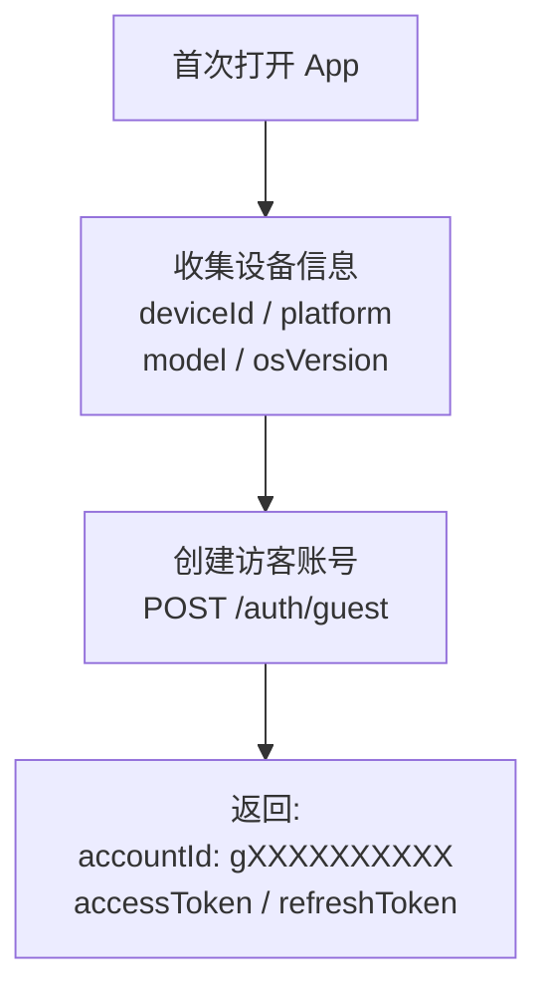
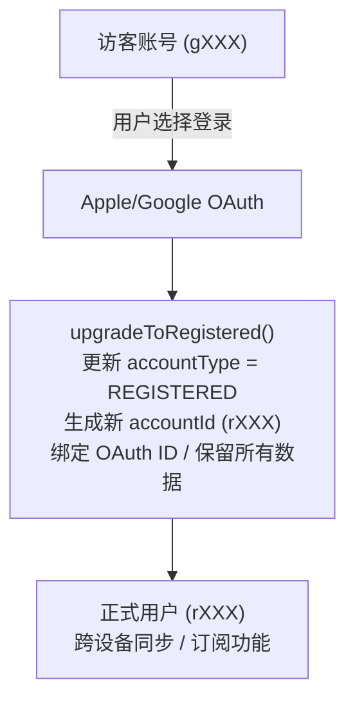
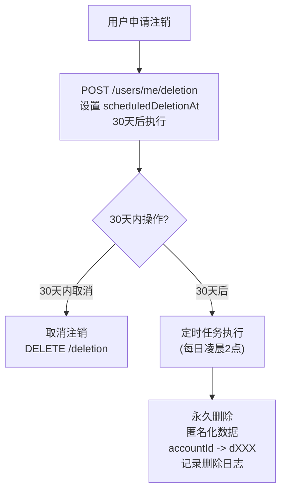

# Users 模块

> 用户管理、资料、账号系统

---

## 1. 模块概述

```
┌─────────────────────────────────────────────────────────────┐
│                       Users 模块                            │
├─────────────────────────────────────────────────────────────┤
│                                                             │
│  核心功能                                                   │
│  ├── 用户资料 - 获取/更新个人信息                          │
│  ├── 账号类型 - 访客/注册用户                              │
│  ├── 账号升级 - 访客转正式用户                             │
│  ├── 账号注销 - 30天冷静期                                 │
│  └── 数据导出 - GDPR 合规                                  │
│                                                             │
│  账号 ID 迁移 (Phase 4.2)                                  │
│  ├── 新格式: gXXX/rXXX/sXXX/dXXX                          │
│  └── 双写模式: 同时支持新旧 ID                             │
│                                                             │
│  依赖模块                                                   │
│  ├── PrismaModule (数据库)                                 │
│  └── LogsModule (日志)                                     │
│                                                             │
└─────────────────────────────────────────────────────────────┘
```

---

## 2. 账号类型

### 2.1 账号类型枚举

| 类型 | 前缀 | 说明 |
|------|------|------|
| `GUEST` | g | 访客账号 (设备绑定) |
| `REGISTERED` | r | 注册账号 (OAuth) |
| `STAFF` | s | 员工账号 |
| `DELETED` | d | 已删除账号 |

### 2.2 账号 ID 格式

```
┌─────────────────────────────────────────────────────────────┐
│                    账号 ID 格式                             │
├─────────────────────────────────────────────────────────────┤
│                                                             │
│  新格式 (Phase 4.2)                                        │
│  ├── 访客:   g1234567890                                   │
│  ├── 注册:   r1234567890                                   │
│  ├── 员工:   s1234567890                                   │
│  └── 已删除: d1234567890                                   │
│                                                             │
│  旧格式 (Legacy)                                           │
│  └── UUID: 550e8400-e29b-41d4-a716-446655440000           │
│                                                             │
│  双写模式: 两种格式都能查询                                │
│                                                             │
└─────────────────────────────────────────────────────────────┘
```

---

## 3. 数据模型

### 3.1 用户核心字段

| 字段 | 类型 | 说明 |
|------|------|------|
| `id` | UUID | 数据库主键 |
| `accountId` | string | 新格式账号 ID |
| `email` | string | 邮箱 (可选) |
| `name` | string | 显示名称 |
| `avatar` | string | 头像 URL |
| `appleId` | string | Apple OAuth ID |
| `googleId` | string | Google OAuth ID |
| `accountType` | enum | 账号类型 |
| `englishLevel` | enum | 英语水平 |
| `dailyGoal` | number | 每日目标 (分钟) |

### 3.2 英语水平枚举

| 等级 | 说明 | CEFR 对应 |
|------|------|-----------|
| `BEGINNER` | 初学者 | A1-A2 |
| `INTERMEDIATE` | 中级 | B1-B2 |
| `ADVANCED` | 高级 | C1-C2 |

---

## 4. API 端点

### 4.1 用户资料

| 方法 | 端点 | 说明 |
|------|------|------|
| `GET` | `/users/me` | 获取个人资料 |
| `PATCH` | `/users/me` | 更新个人资料 |
| `POST` | `/users/me/assessment` | 提交英语水平评估 |
| `GET` | `/users/me/badges` | 获取已获得徽章 |
| `GET` | `/users/me/stats` | 获取综合统计 |

### 4.2 账号管理

| 方法 | 端点 | 说明 |
|------|------|------|
| `GET` | `/users/me/account-id` | 获取账号 ID 迁移信息 |
| `GET` | `/users/me/export` | 导出所有数据 (GDPR) |

### 4.3 账号注销

| 方法 | 端点 | 说明 |
|------|------|------|
| `POST` | `/users/me/deletion` | 申请注销 (30天冷静期) |
| `DELETE` | `/users/me/deletion` | 取消注销 |
| `GET` | `/users/me/deletion/status` | 查询注销状态 |

---

## 5. 访客账号流程

### 5.1 访客创建



### 5.2 访客升级



---

## 6. 账号注销流程



---

## 7. GDPR 数据导出

### 7.1 导出内容

| 数据类型 | 包含内容 |
|----------|----------|
| **个人信息** | 账号ID、邮箱、名称、头像、创建时间 |
| **阅读数据** | 书架、阅读进度、阅读会话 |
| **学习数据** | 词汇本、复习记录 |
| **社交数据** | 高亮、笔记、书签 |
| **订阅数据** | 订阅状态、交易记录 |

### 7.2 导出格式

| 顶级字段 | 类型 | 说明 |
|----------|------|------|
| `user` | object | 用户个人信息 |
| `books` | array | 书架和阅读进度 |
| `vocabulary` | array | 词汇本数据 |
| `highlights` | array | 高亮和笔记 |
| `sessions` | array | 阅读会话记录 |
| `subscription` | object | 订阅状态 |
| `exportedAt` | ISO 8601 string | 导出时间戳 |

---

## 8. 用户统计

### 8.1 UserStatsDto

| 字段 | 说明 |
|------|------|
| `totalReadingMinutes` | 总阅读时长 |
| `booksRead` | 已读书籍数 |
| `currentStreak` | 当前连续天数 |
| `longestStreak` | 最长连续天数 |
| `vocabularyCount` | 词汇量 |
| `highlightsCount` | 高亮数量 |
| `notesCount` | 笔记数量 |

---

## 9. 实现位置

| 组件 | 路径 |
|------|------|
| **模块** | `src/modules/users/users.module.ts` |
| **服务** | `src/modules/users/users.service.ts` |
| **控制器** | `src/modules/users/users.controller.ts` |
| **DTO** | `src/modules/users/dto/` |
| **AccountIdService** | `src/common/services/account-id.service.ts` |

---

## 10. 相关文档

| 文档 | 说明 |
|------|------|
| [account/system-design.md](../account/system-design.md) | 账号系统设计 |
| [account/account-id-design.md](../account/account-id-design.md) | 账号 ID 迁移设计 |
| [modules/auth.md](auth.md) | 认证模块 |
| [legal/privacy-policy.md](../legal/privacy-policy.md) | 隐私政策 |

---

*最后更新: 2025-12-31*
