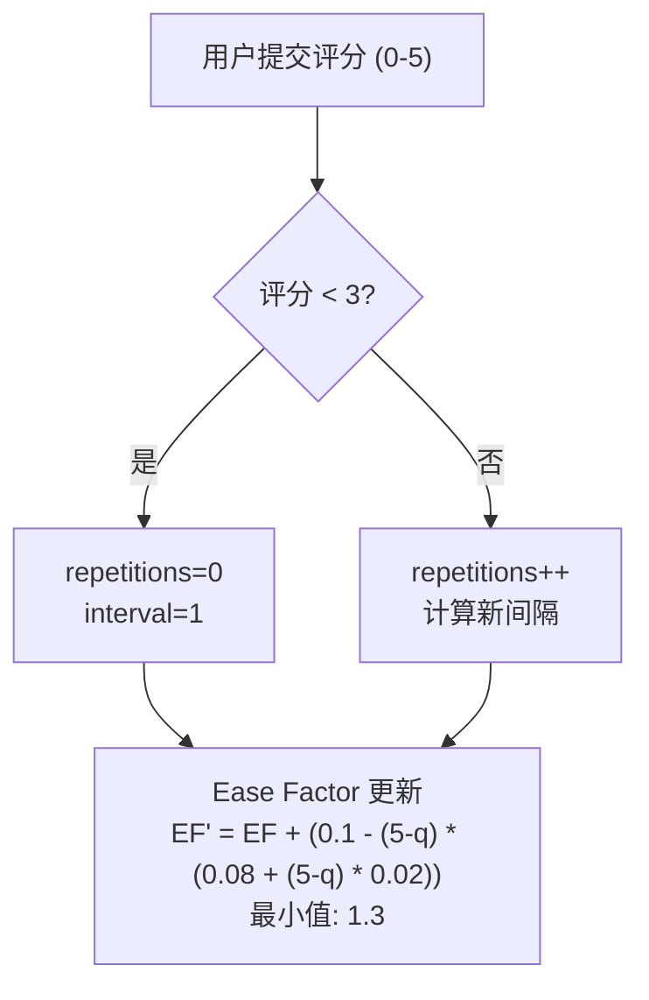
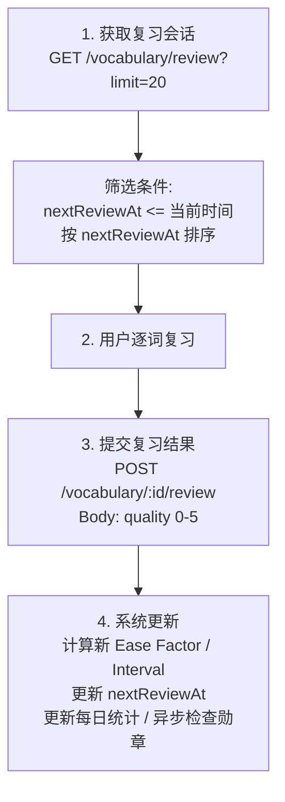
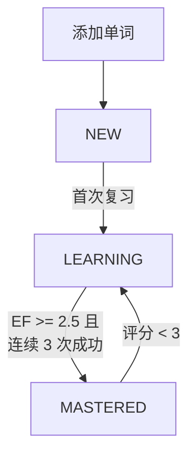

# Vocabulary 模块

> 词汇学习系统、SM-2 间隔重复算法

---

## 1. 模块概述

```
┌─────────────────────────────────────────────────────────────┐
│                     Vocabulary 模块                         │
├─────────────────────────────────────────────────────────────┤
│                                                             │
│  核心功能                                                   │
│  ├── 生词本管理 - 添加/更新/删除词汇                       │
│  ├── SM-2 复习 - 间隔重复算法                              │
│  ├── 批量导入 - 从阅读上下文批量添加                       │
│  └── 统计分析 - 学习进度追踪                               │
│                                                             │
│  订阅限制                                                   │
│  ├── 复习功能 - PRO/PREMIUM 专属                           │
│  └── 用量追踪 - 每日添加数量限制                           │
│                                                             │
│  依赖模块                                                   │
│  ├── PrismaModule (数据库)                                 │
│  ├── UsersModule (用户)                                    │
│  └── MedalsModule (勋章触发)                               │
│                                                             │
└─────────────────────────────────────────────────────────────┘
```

---

## 2. 数据模型

### 2.1 词汇状态枚举

| 状态 | 说明 | 触发条件 |
|------|------|----------|
| `NEW` | 新词 | 刚添加 |
| `LEARNING` | 学习中 | 首次复习后 |
| `MASTERED` | 已掌握 | Ease Factor ≥ 2.5 且连续3次成功 |

### 2.2 核心数据结构

```
┌─────────────────────────────────────────────────────────────┐
│                    UserVocabulary 表                        │
├─────────────────────────────────────────────────────────────┤
│                                                             │
│  基础信息                                                   │
│  ├── word          - 单词                                  │
│  ├── context       - 原文上下文                            │
│  ├── definition    - 英文释义                              │
│  ├── translation   - 中文翻译                              │
│  └── note          - 用户笔记                              │
│                                                             │
│  来源信息                                                   │
│  ├── bookId        - 来源书籍                              │
│  ├── chapterId     - 来源章节                              │
│  └── position      - 原文位置                              │
│                                                             │
│  SM-2 参数                                                  │
│  ├── status        - 学习状态                              │
│  ├── easeFactor    - 难度系数 (默认 2.5, 最小 1.3)         │
│  ├── interval      - 下次复习间隔 (天)                     │
│  ├── repetitions   - 复习次数                              │
│  └── nextReviewAt  - 下次复习时间                          │
│                                                             │
└─────────────────────────────────────────────────────────────┘
```

---

## 3. SM-2 间隔重复算法

### 3.1 算法流程



### 3.2 评分标准

| 评分 | 含义 | 结果 |
|------|------|------|
| 0 | 完全不记得 | 重置进度 |
| 1 | 完全错误 | 重置进度 |
| 2 | 错误但有印象 | 重置进度 |
| 3 | 正确但困难 | 继续进度 |
| 4 | 正确稍有犹豫 | 继续进度 |
| 5 | 完全正确 | 继续进度 |

### 3.3 间隔示例

```
┌─────────────────────────────────────────────────────────────┐
│                    典型复习间隔                             │
├─────────────────────────────────────────────────────────────┤
│                                                             │
│  假设持续评分 4 (EF 保持 2.5):                             │
│                                                             │
│  复习次数    间隔 (天)    累计天数                         │
│  ────────    ─────────    ────────                         │
│     1           1            1                              │
│     2           6            7                              │
│     3          15           22                              │
│     4          38           60                              │
│     5          95          155                              │
│     6         238          393                              │
│                                                             │
│  约 1 年后进入长期记忆                                     │
│                                                             │
└─────────────────────────────────────────────────────────────┘
```

---

## 4. API 端点

### 4.1 词汇管理

| 方法 | 端点 | 说明 | 订阅限制 |
|------|------|------|----------|
| `GET` | `/vocabulary` | 获取词汇列表 | 无 |
| `POST` | `/vocabulary` | 添加单词 | 用量追踪 |
| `PATCH` | `/vocabulary/:id` | 更新单词 | 无 |
| `DELETE` | `/vocabulary/:id` | 删除单词 | 无 |
| `GET` | `/vocabulary/stats` | 获取统计 | 无 |

### 4.2 复习功能 (PRO/PREMIUM)

| 方法 | 端点 | 说明 |
|------|------|------|
| `GET` | `/vocabulary/review` | 获取待复习词汇 |
| `POST` | `/vocabulary/:id/review` | 提交单词复习 |
| `POST` | `/vocabulary/review/batch` | 批量复习 |

### 4.3 批量操作

| 方法 | 端点 | 说明 |
|------|------|------|
| `POST` | `/vocabulary/auto-batch` | 从阅读上下文批量添加 |

---

## 5. 统计数据

### 5.1 VocabularyStatsDto

| 字段 | 说明 |
|------|------|
| `total` | 总词汇数 |
| `new` | 新词数量 |
| `learning` | 学习中数量 |
| `mastered` | 已掌握数量 |
| `dueToday` | 今日待复习 |

### 5.2 每日统计追踪

| 字段 | 说明 |
|------|------|
| `wordsLearned` | 当日新学单词 |
| `wordsReviewed` | 当日复习单词 |

---

## 6. 复习会话流程



---

## 7. 状态转换



---

## 8. 与勋章系统交互

| 触发时机 | 勋章类型 |
|----------|----------|
| 添加单词后 | 词汇量里程碑 |
| 复习完成后 | 复习次数里程碑 |
| 状态变更为 MASTERED | 掌握数量里程碑 |

---

## 9. 实现位置

| 组件 | 路径 |
|------|------|
| **模块** | `apps/backend/src/modules/vocabulary/vocabulary.module.ts` |
| **服务** | `apps/backend/src/modules/vocabulary/vocabulary.service.ts` |
| **控制器** | `apps/backend/src/modules/vocabulary/vocabulary.controller.ts` |
| **DTO** | `apps/backend/src/modules/vocabulary/dto/` |

---

## 10. 相关文档

| 文档 | 说明 |
|------|------|
| [learning/README.md](../learning/) | 学习系统概览 |
| [modules/subscriptions.md](subscriptions.md) | 订阅权限说明 |
| [modules/medals.md](medals.md) | 勋章系统 |

---

*最后更新: 2025-12-31*
