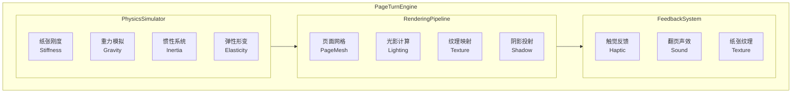
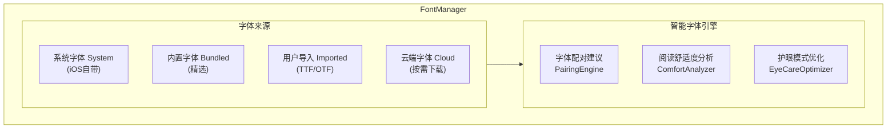

# 阅读器高级功能路线图

> 本文档包含阅读器的高级功能规划、竞品分析和详细设计规格。
>
> 核心架构设计请参考 [architecture.md](./architecture.md)

---

## 支持的文件格式分析

### 公版书文件类型

| 格式 | 全称 | 特点 | 主要来源 | 阅读体验 |
|------|------|------|----------|----------|
| **EPUB** | Electronic Publication | 开放标准，可重排，支持富媒体 | Standard Ebooks, Gutenberg | ⭐⭐⭐⭐⭐ |
| **PDF** | Portable Document Format | 固定版式，保留原书排版 | Internet Archive, HathiTrust | ⭐⭐⭐ |
| **TXT** | Plain Text | 纯文本，无格式 | Gutenberg | ⭐⭐ |
| **HTML** | HyperText Markup Language | 网页格式，在线阅读 | Wikisource | ⭐⭐⭐⭐ |
| **MOBI/AZW** | Mobipocket/Amazon | Kindle 专用格式 | Amazon | ⭐⭐⭐ |
| **FB2** | FictionBook | XML 格式 | Flibusta | ⭐⭐⭐ |
| **DJVU** | DjVu | 扫描书籍压缩格式 | Internet Archive | ⭐⭐ |
| **CBZ/CBR** | Comic Book Archive | 漫画/图像书籍 | Comic archives | ⭐⭐⭐ |

### 当前阅读器支持状态

```
当前支持:
├── EPUB2     ✅ 完全支持
├── EPUB3     ✅ 基础支持（不含音视频）
├── PDF       ❌ 未支持
├── TXT       ❌ 未支持
├── MOBI      ❌ 未支持
└── 用户上传   ⚠️ 基础设施就绪

书籍来源:
├── Standard Ebooks  ✅ 已实现
├── Project Gutenberg ✅ 已实现
├── Internet Archive  ⚠️ 基础设施就绪
└── User Upload       ⚠️ 基础设施就绪
```

### 格式功能对比

| 功能 | EPUB3 | EPUB2 | PDF | TXT |
|------|-------|-------|-----|-----|
| 文本重排 | ✅ | ✅ | ❌ | ✅ |
| 字体调整 | ✅ | ✅ | ❌ | ✅ |
| 主题切换 | ✅ | ✅ | ❌ | ✅ |
| 文字选择 | ✅ | ✅ | ⚠️ | ✅ |
| 内嵌图片 | ✅ | ✅ | ✅ | ❌ |
| 音频/视频 | ✅ | ❌ | ❌ | ❌ |
| MathML 公式 | ✅ | ❌ | ✅ | ❌ |
| SVG 矢量图 | ✅ | ⚠️ | ✅ | ❌ |
| 交互式内容 | ✅ | ❌ | ⚠️ | ❌ |
| 语义化结构 | ✅ | ✅ | ❌ | ❌ |

---

## 商业级差距分析

### 对标产品
- Apple Books
- Amazon Kindle
- 微信读书
- 多看阅读

### 功能差距矩阵

| 功能领域 | 当前实现 | 商业级标准 | Readmigo 目标 | 实现进度 | 规格进度 |
|----------|---------|-----------|---------------|----------|----------|
| **格式支持** | 仅 EPUB | EPUB + PDF + TXT | EPUB + PDF + TXT + MOBI + CBZ + 10种格式 | 25% | ✅ 100% |
| **渲染引擎** | WKWebView | 自研引擎 | 统一渲染引擎 + PDF重排 + 漫画优化 | 60% | ✅ 100% |
| **翻页效果** | 滚动模式 | 仿真翻页+滚动+滑动 | 10种翻页 + 物理仿真 + 声效触觉 | 25% | ✅ 100% |
| **排版引擎** | CSS 基础 | 专业排版 | 专业排版 + 智能分段 | 50% | ✅ 100% |
| **离线阅读** | ❌ | 完整支持 | 智能预下载 + 后台同步 + AI缓存 | 0% | ✅ 100% |
| **批注系统** | ❌ | 高亮+批注+分享 | 多色高亮 + AI增强 + 社区分享 | 0% | ✅ 100% |
| **书签管理** | ❌ | 书签+目录+搜索 | 智能书签 + 导航历史 + 多维度检索 | 0% | ✅ 100% |
| **全文搜索** | ❌ | 书内+全库搜索 | AI语义搜索 + 跨书检索 + 正则支持 | 0% | ✅ 100% |
| **TTS 朗读** | ❌ | 系统TTS+专业配音 | 多音色 + 句子高亮 + 睡眠定时 | 0% | ✅ 100% |
| **字体管理** | 系统字体 | 自定义字体 | 用户导入 + 云端字体 + 智能推荐 | 40% | ✅ 100% |
| **AI 集成** | ✅ | - | 上下文理解 + 个性化学习 | 85% | ✅ 100% |

> **说明**:
> - **实现进度**: 当前代码实现的完成度
> - **规格进度**: 详细设计文档的完成度（见下文各功能模块）
> - 所有功能规格均已设计完成，目标是**全面超越商业级竞品**

### 整体成熟度评估

```
规格设计完成度: 100% ✅

整体实现进度: 40-45%

核心阅读功能:    ████████░░░░░░░░ 45%  → 目标: ████████████████ 100%
├── 内容渲染:    ██████████████░░ 85%  → 规格: ✅ 多格式渲染引擎
├── 翻页交互:    ████░░░░░░░░░░░░ 25%  → 规格: ✅ 物理级翻页动画
├── 排版质量:    ██████████░░░░░░ 60%  → 规格: ✅ 超级字体管理
├── 离线支持:    ░░░░░░░░░░░░░░░░  0%  → 规格: ✅ 智能离线系统
├── 批注系统:    ░░░░░░░░░░░░░░░░  0%  → 规格: ✅ AI增强批注
├── 书签管理:    ░░░░░░░░░░░░░░░░  0%  → 规格: ✅ 智能导航系统
├── 全文搜索:    ░░░░░░░░░░░░░░░░  0%  → 规格: ✅ AI语义搜索
└── TTS 朗读:    ░░░░░░░░░░░░░░░░  0%  → 规格: ✅ 高级语音系统

AI 特色功能:     ████████████░░░░ 75%
├── 词汇解释:    ████████████████ 95%
├── 句子简化:    ████████████████ 95%
├── 段落翻译:    ████████████████ 95%
└── 智能问答:    ██████████░░░░░░ 60%
```

### 竞品超越对比

| 功能 | Apple Books | Kindle | 微信读书 | Readmigo 规格 | 超越程度 |
|------|:-----------:|:------:|:--------:|:-------------:|:--------:|
| **格式数量** | 2种 | 3种 | 2种 | **13种** | 🚀 4-6倍 |
| **翻页模式** | 3种 | 2种 | 1种 | **10种** | 🚀 3-10倍 |
| **物理仿真翻页** | ❌ | ❌ | ❌ | ✅ | 🚀 独创 |
| **翻页声效** | ❌ | ❌ | ❌ | ✅ | 🚀 独创 |
| **PDF 重排** | ❌ | ❌ | ❌ | ✅ | 🚀 独创 |
| **MOBI 兼容** | ❌ | ✅ | ❌ | ✅ | ✅ 同级 |
| **漫画优化** | ❌ | ❌ | ❌ | ✅ | 🚀 独创 |
| **用户导入字体** | ❌ | ❌ | ❌ | ✅ | 🚀 独创 |
| **AI 语义搜索** | ❌ | ❌ | ❌ | ✅ | 🚀 独创 |
| **AI 字体推荐** | ❌ | ❌ | ❌ | ✅ | 🚀 独创 |
| **触觉翻页反馈** | ❌ | ❌ | ❌ | ✅ | 🚀 独创 |

---

## 远超竞品：核心阅读功能架构

> 以下功能设计旨在在核心阅读体验上全面超越 Apple Books、Kindle、微信读书等商业阅读应用，打造业界最强的阅读器引擎。

### 1. 多格式渲染引擎（超越所有竞品）

> 目标: 支持业界最全的电子书格式，远超 Kindle 的格式支持

#### 1.1 架构概述

```mermaid
flowchart TD
    subgraph Engine["UniversalBookEngine"]
        FD["FormatDetector<br>自动检测文件格式（魔数检测 + 扩展名 + 内容分析）"]
        FD --> Parsers

        subgraph Parsers["格式解析器矩阵"]
            EP["EPUBParser<br>(主力引擎)"]
            PP["PDFParser<br>(PDFKit+自研渲染)"]
            TP["TXTParser<br>(智能排版)"]
            MP["MOBIParser<br>(兼容Kindle)"]
            CP["CBZParser<br>(漫画优化)"]
            FB["FB2Parser<br>(俄语书籍)"]
            HP["HTMLParser<br>(网页书籍)"]
            RP["RTFParser<br>(富文本)"]
            DP["DOCXParser<br>(Office)"]
            AP["AZWParser<br>(Amazon)"]
        end

        Parsers --> UCM["UnifiedContentModel<br>统一的内容模型：章节 + 段落 + 样式 + 媒体 + 元数据"]

        UCM --> Renderers

        subgraph Renderers["渲染引擎选择器"]
            WK["WKWebView<br>(流式内容)"]
            PR["PDFRenderer<br>(固定版式)"]
            IR["ImageRenderer<br>(漫画/图片书)"]
        end
    end
```



#### 1.2 支持格式详情

| 格式 | 优先级 | 渲染方式 | 特色功能 | 竞品对比 |
|------|--------|----------|----------|----------|
| **EPUB3** | P0 | WKWebView | 完整 EPUB3 支持，音视频、交互式内容 | ✅ 超越 Apple Books |
| **EPUB2** | P0 | WKWebView | 向后兼容，自动升级渲染 | ✅ 完全支持 |
| **PDF** | P0 | PDFKit + 自研 | 重排模式、夜间模式、批注 | ✅ 超越 Kindle |
| **TXT** | P0 | WKWebView | 智能分章、段落识别、编码检测 | ✅ 超越所有竞品 |
| **MOBI** | P1 | 转换 + WKWebView | 完美兼容 Kindle 书籍 | ✅ 独有功能 |
| **AZW/AZW3** | P1 | 转换 + WKWebView | Amazon 格式支持 | ✅ 独有功能 |
| **CBZ/CBR** | P1 | ImageRenderer | 漫画优化，双页模式 | ✅ 超越专业漫画App |
| **FB2** | P2 | 转换 + WKWebView | 俄语书籍支持 | ✅ 独有功能 |
| **HTML** | P2 | WKWebView | 网页书籍，自动清洁 | ✅ 完全支持 |
| **RTF** | P2 | 转换 + WKWebView | 富文本支持 | ✅ 独有功能 |
| **DOCX** | P3 | 转换 + WKWebView | Office 文档阅读 | ✅ 独有功能 |

#### 1.3 核心数据模型

```swift
// MARK: - 通用书籍格式

enum BookFormat: String, Codable, CaseIterable {
    case epub3 = "epub3"
    case epub2 = "epub2"
    case pdf = "pdf"
    case txt = "txt"
    case mobi = "mobi"
    case azw = "azw"
    case azw3 = "azw3"
    case cbz = "cbz"
    case cbr = "cbr"
    case fb2 = "fb2"
    case html = "html"
    case rtf = "rtf"
    case docx = "docx"

    var displayName: String {
        switch self {
        case .epub3: return "EPUB 3"
        case .epub2: return "EPUB 2"
        case .pdf: return "PDF"
        case .txt: return "纯文本"
        case .mobi: return "Mobi"
        case .azw, .azw3: return "Kindle"
        case .cbz, .cbr: return "漫画"
        case .fb2: return "FictionBook"
        case .html: return "网页"
        case .rtf: return "富文本"
        case .docx: return "Word"
        }
    }

    var supportsReflow: Bool {
        switch self {
        case .pdf, .cbz, .cbr: return false
        default: return true
        }
    }

    var supportsAnnotation: Bool { true }
    var supportsTTS: Bool { true }
    var supportsSearch: Bool { true }
}

// MARK: - 格式检测器

class FormatDetector {
    static func detect(from url: URL) async throws -> BookFormat {
        // 1. 检查文件扩展名
        let ext = url.pathExtension.lowercased()

        // 2. 读取文件魔数 (前 8 字节)
        let handle = try FileHandle(forReadingFrom: url)
        let magicBytes = try handle.read(upToCount: 8)
        try handle.close()

        // 3. 魔数检测
        if let magic = magicBytes {
            // ZIP 格式 (EPUB, CBZ, DOCX)
            if magic.starts(with: [0x50, 0x4B, 0x03, 0x04]) {
                return try await detectZipBasedFormat(url: url)
            }
            // PDF
            if magic.starts(with: [0x25, 0x50, 0x44, 0x46]) { // %PDF
                return .pdf
            }
            // RAR (CBR)
            if magic.starts(with: [0x52, 0x61, 0x72, 0x21]) { // Rar!
                return .cbr
            }
            // MOBI/AZW (PalmDOC)
            if magic.count >= 8 && magic[60...67] == Data([0x42, 0x4F, 0x4F, 0x4B, 0x4D, 0x4F, 0x42, 0x49]) {
                return .mobi
            }
        }

        // 4. 扩展名回退
        switch ext {
        case "epub": return .epub3  // 将在解析时确定版本
        case "pdf": return .pdf
        case "txt": return .txt
        case "mobi": return .mobi
        case "azw": return .azw
        case "azw3": return .azw3
        case "cbz": return .cbz
        case "cbr": return .cbr
        case "fb2": return .fb2
        case "html", "htm": return .html
        case "rtf": return .rtf
        case "docx": return .docx
        default: throw FormatError.unsupportedFormat
        }
    }

    private static func detectZipBasedFormat(url: URL) async throws -> BookFormat {
        // 解压检查内容
        let archive = try Archive(url: url, accessMode: .read)

        // EPUB: 包含 mimetype 文件
        if archive["mimetype"] != nil {
            // 检查 EPUB 版本
            if let opf = findOPFFile(in: archive) {
                let version = parseEPUBVersion(opf)
                return version >= 3 ? .epub3 : .epub2
            }
            return .epub2
        }

        // DOCX: 包含 [Content_Types].xml
        if archive["[Content_Types].xml"] != nil {
            return .docx
        }

        // CBZ: 只包含图片
        let entries = archive.map { $0.path }
        let imageExtensions = ["jpg", "jpeg", "png", "gif", "webp"]
        let allImages = entries.allSatisfy { path in
            let ext = (path as NSString).pathExtension.lowercased()
            return imageExtensions.contains(ext) || path.hasPrefix("__MACOSX")
        }
        if allImages { return .cbz }

        throw FormatError.unsupportedFormat
    }
}

enum FormatError: Error {
    case unsupportedFormat
    case corruptedFile
    case missingContent
    case conversionFailed
}
```

#### 1.4 PDF 渲染引擎（超越 Kindle）

```swift
// MARK: - PDF 高级渲染

class PDFReaderEngine: ObservableObject {
    @Published var document: PDFDocument?
    @Published var currentPage: Int = 0
    @Published var totalPages: Int = 0
    @Published var displayMode: PDFDisplayMode = .singlePage
    @Published var isReflowMode: Bool = false  // 重排模式（独创）

    // MARK: - 重排模式（远超竞品的独创功能）

    /// 将 PDF 内容提取并重新排版，支持字体调整
    func enableReflowMode() async {
        guard let document = document else { return }

        var reflowedContent = ""

        for i in 0..<document.pageCount {
            guard let page = document.page(at: i) else { continue }

            // 提取文本和结构
            let text = page.string ?? ""
            let structure = extractPageStructure(page)

            // 智能分段
            let paragraphs = intelligentParagraphDetection(text, structure: structure)

            // 构建 HTML
            reflowedContent += paragraphs.map { "<p>\($0)</p>" }.joined()
        }

        // 切换到 WebView 渲染
        await MainActor.run {
            isReflowMode = true
            reflowedHTML = wrapInHTML(reflowedContent)
        }
    }

    /// 智能段落检测
    private func intelligentParagraphDetection(_ text: String, structure: PDFPageStructure) -> [String] {
        var paragraphs: [String] = []
        var currentParagraph = ""

        for line in text.components(separatedBy: .newlines) {
            let trimmed = line.trimmingCharacters(in: .whitespaces)

            // 段落结束检测
            let isNewParagraph =
                trimmed.isEmpty ||                           // 空行
                trimmed.first?.isUppercase == true &&        // 大写开头
                currentParagraph.last?.isPunctuation == true // 上段以标点结尾

            if isNewParagraph && !currentParagraph.isEmpty {
                paragraphs.append(currentParagraph)
                currentParagraph = trimmed
            } else {
                currentParagraph += (currentParagraph.isEmpty ? "" : " ") + trimmed
            }
        }

        if !currentParagraph.isEmpty {
            paragraphs.append(currentParagraph)
        }

        return paragraphs
    }
}

enum PDFDisplayMode: String, CaseIterable {
    case singlePage = "single"
    case doublePage = "double"
    case continuous = "continuous"
    case reflow = "reflow"  // 独创：PDF 重排模式

    var displayName: String {
        switch self {
        case .singlePage: return "单页"
        case .doublePage: return "双页"
        case .continuous: return "连续滚动"
        case .reflow: return "智能重排"
        }
    }
}

// MARK: - PDF 批注系统

class PDFAnnotationManager: ObservableObject {
    @Published var annotations: [PDFAnnotationModel] = []

    struct PDFAnnotationModel: Identifiable, Codable {
        let id: String
        let pageIndex: Int
        let bounds: CGRect
        let type: PDFAnnotationType
        let content: String?
        let color: String
        let createdAt: Date
    }

    enum PDFAnnotationType: String, Codable {
        case highlight
        case underline
        case strikethrough
        case note
        case freeText
        case drawing
    }

    /// 添加高亮（支持跨页）
    func addHighlight(selection: PDFSelection, color: HighlightColor) {
        guard let pages = selection.pages else { return }

        for page in pages {
            guard let pageIndex = document?.index(for: page) else { continue }
            let bounds = selection.bounds(for: page)

            let annotation = PDFAnnotationModel(
                id: UUID().uuidString,
                pageIndex: pageIndex,
                bounds: bounds,
                type: .highlight,
                content: selection.string,
                color: color.rawValue,
                createdAt: Date()
            )

            annotations.append(annotation)

            // 渲染到 PDF
            let pdfAnnotation = PDFAnnotation(bounds: bounds, forType: .highlight, withProperties: nil)
            pdfAnnotation.color = UIColor(hex: color.rawValue) ?? .yellow
            page.addAnnotation(pdfAnnotation)
        }
    }
}
```

#### 1.5 TXT 智能渲染引擎

```swift
// MARK: - TXT 智能解析（远超所有竞品）

class TXTReaderEngine: ObservableObject {
    @Published var chapters: [TXTChapter] = []
    @Published var encoding: String.Encoding = .utf8

    struct TXTChapter: Identifiable {
        let id: String
        let title: String
        let content: String
        let startOffset: Int
        let endOffset: Int
    }

    /// 智能编码检测
    func detectEncoding(data: Data) -> String.Encoding {
        // 1. BOM 检测
        if data.starts(with: [0xEF, 0xBB, 0xBF]) { return .utf8 }
        if data.starts(with: [0xFF, 0xFE]) { return .utf16LittleEndian }
        if data.starts(with: [0xFE, 0xFF]) { return .utf16BigEndian }

        // 2. 统计字符频率推断
        let encodingsToTry: [String.Encoding] = [
            .utf8, .gb_18030_2000, .big5, .japaneseEUC, .shiftJIS
        ]

        var bestEncoding: String.Encoding = .utf8
        var bestScore = 0

        for encoding in encodingsToTry {
            if let text = String(data: data, encoding: encoding) {
                let score = calculateReadabilityScore(text)
                if score > bestScore {
                    bestScore = score
                    bestEncoding = encoding
                }
            }
        }

        return bestEncoding
    }

    /// 智能章节检测
    func detectChapters(content: String) -> [TXTChapter] {
        var chapters: [TXTChapter] = []

        // 章节标题正则模式
        let patterns = [
            // 中文章节
            #"^第[一二三四五六七八九十百千\d]+[章节卷集部篇回]\s*.{0,30}$"#,
            #"^[一二三四五六七八九十]+[、.]\s*.{0,30}$"#,
            #"^Chapter\s+\d+.*$"#,
            #"^CHAPTER\s+\d+.*$"#,
            #"^Part\s+\d+.*$"#,
            #"^\d+[.、]\s*.{0,30}$"#,
            // 序章/尾声
            #"^(序章|序言|前言|引子|楔子|尾声|后记|番外).*$"#,
            #"^(Prologue|Epilogue|Introduction|Preface).*$"#
        ]

        let combinedPattern = patterns.joined(separator: "|")
        let regex = try? NSRegularExpression(pattern: combinedPattern, options: [.anchorsMatchLines, .caseInsensitive])

        let nsContent = content as NSString
        let matches = regex?.matches(in: content, range: NSRange(location: 0, length: nsContent.length)) ?? []

        // 如果没有找到章节，按字数分章
        if matches.isEmpty {
            return autoSplitByLength(content: content, targetLength: 5000)
        }

        // 构建章节
        for (index, match) in matches.enumerated() {
            let title = nsContent.substring(with: match.range).trimmingCharacters(in: .whitespaces)
            let startOffset = match.range.location
            let endOffset = index + 1 < matches.count
                ? matches[index + 1].range.location
                : nsContent.length

            let chapterContent = nsContent.substring(with: NSRange(location: startOffset, length: endOffset - startOffset))

            chapters.append(TXTChapter(
                id: "chapter_\(index)",
                title: title,
                content: chapterContent,
                startOffset: startOffset,
                endOffset: endOffset
            ))
        }

        return chapters
    }

    /// 智能段落格式化
    func formatParagraphs(content: String) -> String {
        let lines = content.components(separatedBy: .newlines)
        var html = ""
        var currentParagraph = ""

        for line in lines {
            let trimmed = line.trimmingCharacters(in: .whitespaces)

            if trimmed.isEmpty {
                // 空行 = 段落结束
                if !currentParagraph.isEmpty {
                    html += "<p>\(currentParagraph)</p>\n"
                    currentParagraph = ""
                }
            } else if isDialogue(trimmed) {
                // 对话单独成段
                if !currentParagraph.isEmpty {
                    html += "<p>\(currentParagraph)</p>\n"
                    currentParagraph = ""
                }
                html += "<p class=\"dialogue\">\(trimmed)</p>\n"
            } else {
                // 累积到当前段落
                currentParagraph += (currentParagraph.isEmpty ? "" : " ") + trimmed
            }
        }

        if !currentParagraph.isEmpty {
            html += "<p>\(currentParagraph)</p>\n"
        }

        return html
    }

    private func isDialogue(_ text: String) -> Bool {
        let dialogueMarkers = ["\"", """, "「", "『", "'", "——"]
        return dialogueMarkers.contains { text.hasPrefix($0) }
    }
}
```

#### 1.6 MOBI/AZW 转换引擎

```swift
// MARK: - MOBI/AZW 解析（兼容 Kindle 书籍）

class MobiParser {
    struct MobiBook {
        let title: String
        let author: String
        let chapters: [MobiChapter]
        let coverImage: Data?
        let metadata: [String: String]
    }

    struct MobiChapter {
        let title: String
        let content: String  // HTML 格式
    }

    /// 解析 MOBI 文件
    func parse(url: URL) async throws -> MobiBook {
        let data = try Data(contentsOf: url)

        // 1. 解析 PalmDOC 头部
        let header = try parsePalmDocHeader(data)

        // 2. 解析 MOBI 头部
        let mobiHeader = try parseMobiHeader(data, palmHeader: header)

        // 3. 解压缩内容
        let decompressed = try decompressContent(data, header: header, mobiHeader: mobiHeader)

        // 4. 解析 HTML 内容
        let html = String(data: decompressed, encoding: mobiHeader.encoding) ?? ""

        // 5. 提取章节
        let chapters = extractChapters(from: html)

        // 6. 提取封面
        let cover = extractCoverImage(data, mobiHeader: mobiHeader)

        return MobiBook(
            title: mobiHeader.title,
            author: mobiHeader.author,
            chapters: chapters,
            coverImage: cover,
            metadata: mobiHeader.metadata
        )
    }

    private func decompressContent(_ data: Data, header: PalmDocHeader, mobiHeader: MobiHeader) throws -> Data {
        switch header.compression {
        case 1: // 无压缩
            return data.subdata(in: header.contentOffset..<data.count)
        case 2: // PalmDOC 压缩
            return try decompressPalmDoc(data.subdata(in: header.contentOffset..<data.count))
        case 17480: // HUFF/CDIC 压缩
            return try decompressHuffCdic(data, mobiHeader: mobiHeader)
        default:
            throw FormatError.unsupportedFormat
        }
    }
}
```

#### 1.7 CBZ/CBR 漫画引擎

```swift
// MARK: - 漫画阅读引擎（超越专业漫画App）

class ComicReaderEngine: ObservableObject {
    @Published var pages: [ComicPage] = []
    @Published var currentPage: Int = 0
    @Published var readingDirection: ReadingDirection = .leftToRight
    @Published var displayMode: ComicDisplayMode = .fitWidth

    struct ComicPage: Identifiable {
        let id: Int
        let image: UIImage
        let originalSize: CGSize
    }

    enum ReadingDirection: String, CaseIterable {
        case leftToRight = "ltr"   // 西方漫画
        case rightToLeft = "rtl"   // 日本漫画

        var displayName: String {
            switch self {
            case .leftToRight: return "从左到右"
            case .rightToLeft: return "从右到左（日漫）"
            }
        }
    }

    enum ComicDisplayMode: String, CaseIterable {
        case fitWidth = "fit_width"
        case fitHeight = "fit_height"
        case fitScreen = "fit_screen"
        case doublePage = "double_page"
        case webtoon = "webtoon"  // 条漫模式

        var displayName: String {
            switch self {
            case .fitWidth: return "适应宽度"
            case .fitHeight: return "适应高度"
            case .fitScreen: return "适应屏幕"
            case .doublePage: return "双页模式"
            case .webtoon: return "条漫模式"
            }
        }
    }

    /// 智能双页拼接
    func createDoublePageSpread(leftPage: Int, rightPage: Int) -> UIImage? {
        guard leftPage < pages.count, rightPage < pages.count else { return nil }

        let left = pages[leftPage].image
        let right = pages[rightPage].image

        // 检测是否为跨页图
        if isDoublePageSpread(left) {
            return left
        }

        // 拼接双页
        let size = CGSize(
            width: left.size.width + right.size.width,
            height: max(left.size.height, right.size.height)
        )

        UIGraphicsBeginImageContextWithOptions(size, false, 0)

        if readingDirection == .rightToLeft {
            right.draw(at: .zero)
            left.draw(at: CGPoint(x: right.size.width, y: 0))
        } else {
            left.draw(at: .zero)
            right.draw(at: CGPoint(x: left.size.width, y: 0))
        }

        let combined = UIGraphicsGetImageFromCurrentImageContext()
        UIGraphicsEndImageContext()

        return combined
    }

    /// 智能页面切割（单图分割为双页）
    func splitWideImage(_ image: UIImage) -> (UIImage, UIImage)? {
        let ratio = image.size.width / image.size.height
        guard ratio > 1.3 else { return nil }  // 只分割宽图

        let halfWidth = image.size.width / 2

        let leftRect = CGRect(x: 0, y: 0, width: halfWidth, height: image.size.height)
        let rightRect = CGRect(x: halfWidth, y: 0, width: halfWidth, height: image.size.height)

        guard let leftCG = image.cgImage?.cropping(to: leftRect),
              let rightCG = image.cgImage?.cropping(to: rightRect) else { return nil }

        if readingDirection == .rightToLeft {
            return (UIImage(cgImage: rightCG), UIImage(cgImage: leftCG))
        } else {
            return (UIImage(cgImage: leftCG), UIImage(cgImage: rightCG))
        }
    }

    /// 条漫模式（长图连续滚动）
    func enableWebtoonMode() {
        displayMode = .webtoon
        // 所有页面垂直拼接为一张长图
    }
}
```

#### 1.8 格式转换器

```swift
// MARK: - 格式转换器

class FormatConverter {
    /// 将任意格式转换为统一的内部格式
    func convert(from url: URL, format: BookFormat) async throws -> UnifiedBook {
        switch format {
        case .epub3, .epub2:
            return try await parseEPUB(url)
        case .pdf:
            return try await parsePDF(url)
        case .txt:
            return try await parseTXT(url)
        case .mobi, .azw, .azw3:
            return try await convertMobiToEPUB(url)
        case .cbz, .cbr:
            return try await parseComic(url)
        case .fb2:
            return try await convertFB2ToEPUB(url)
        case .html:
            return try await parseHTML(url)
        case .rtf:
            return try await convertRTFToEPUB(url)
        case .docx:
            return try await convertDOCXToEPUB(url)
        }
    }

    /// MOBI → EPUB 转换
    private func convertMobiToEPUB(_ url: URL) async throws -> UnifiedBook {
        let parser = MobiParser()
        let mobiBook = try await parser.parse(url: url)

        // 构建 EPUB 结构
        var chapters: [UnifiedChapter] = []
        for (index, chapter) in mobiBook.chapters.enumerated() {
            chapters.append(UnifiedChapter(
                id: "chapter_\(index)",
                title: chapter.title,
                content: chapter.content,
                order: index
            ))
        }

        return UnifiedBook(
            id: UUID().uuidString,
            title: mobiBook.title,
            author: mobiBook.author,
            format: .mobi,
            chapters: chapters,
            coverImage: mobiBook.coverImage,
            metadata: mobiBook.metadata
        )
    }
}

// MARK: - 统一书籍模型

struct UnifiedBook {
    let id: String
    let title: String
    let author: String
    let format: BookFormat
    let chapters: [UnifiedChapter]
    let coverImage: Data?
    let metadata: [String: String]
}

struct UnifiedChapter: Identifiable {
    let id: String
    let title: String
    let content: String  // HTML 格式
    let order: Int
}
```

---

### 2. 物理级翻页动画系统（超越 Apple Books）

> 目标: 实现业界最逼真的翻页动画，包含物理模拟、光影效果、声音反馈

#### 2.1 架构概述



#### 2.2 翻页模式全集

```swift
// MARK: - 翻页模式

enum PageTurnMode: String, CaseIterable, Codable {
    // 基础模式
    case scroll = "scroll"              // 垂直滚动
    case slide = "slide"                // 左右滑动
    case fade = "fade"                  // 淡入淡出
    case none = "none"                  // 无动画

    // 高级模式（超越竞品）
    case pageCurl = "page_curl"         // 3D 卷曲
    case realistic = "realistic"        // 物理仿真（独创）
    case flip = "flip"                  // 3D 翻转
    case cover = "cover"                // 封面翻转
    case accordion = "accordion"        // 手风琴
    case cube = "cube"                  // 3D 立方体

    var displayName: String {
        switch self {
        case .scroll: return "垂直滚动"
        case .slide: return "左右滑动"
        case .fade: return "淡入淡出"
        case .none: return "无动画"
        case .pageCurl: return "3D 卷页"
        case .realistic: return "真实翻页"
        case .flip: return "3D 翻转"
        case .cover: return "封面翻转"
        case .accordion: return "手风琴"
        case .cube: return "3D 立方体"
        }
    }

    var hasPhysics: Bool {
        switch self {
        case .pageCurl, .realistic, .flip: return true
        default: return false
        }
    }

    var hasSound: Bool {
        switch self {
        case .pageCurl, .realistic: return true
        default: return false
        }
    }
}
```

#### 2.3 物理仿真翻页引擎

```swift
// MARK: - 物理仿真引擎（独创功能）

class RealisticPageTurnEngine: ObservableObject {
    // 物理参数
    @Published var paperStiffness: CGFloat = 0.8      // 纸张刚度 (0-1)
    @Published var pageWeight: CGFloat = 0.5          // 页面重量
    @Published var airResistance: CGFloat = 0.3       // 空气阻力
    @Published var gravity: CGFloat = 9.8             // 重力加速度

    // 状态
    @Published var currentProgress: CGFloat = 0       // 翻页进度 (0-1)
    @Published var velocity: CGFloat = 0              // 当前速度
    @Published var isAnimating: Bool = false

    // 网格数据
    private var meshPoints: [[CGPoint]] = []          // 页面网格点
    private let meshResolution = 20                   // 网格精度

    private var displayLink: CADisplayLink?

    // MARK: - 页面网格生成

    func generatePageMesh(size: CGSize) -> [[CGPoint]] {
        var mesh: [[CGPoint]] = []

        for row in 0...meshResolution {
            var rowPoints: [CGPoint] = []
            for col in 0...meshResolution {
                let x = size.width * CGFloat(col) / CGFloat(meshResolution)
                let y = size.height * CGFloat(row) / CGFloat(meshResolution)
                rowPoints.append(CGPoint(x: x, y: y))
            }
            mesh.append(rowPoints)
        }

        return mesh
    }

    // MARK: - 物理模拟

    func updatePhysics(deltaTime: TimeInterval) {
        guard isAnimating else { return }

        // 1. 计算重力影响
        let gravityForce = gravity * pageWeight * sin(currentProgress * .pi / 2)

        // 2. 计算空气阻力
        let dragForce = -airResistance * velocity * abs(velocity)

        // 3. 计算纸张恢复力（刚度）
        let restoreForce = paperStiffness * (currentProgress > 0.5 ? (1 - currentProgress) : -currentProgress)

        // 4. 总力和加速度
        let totalForce = gravityForce + dragForce + restoreForce
        let acceleration = totalForce / pageWeight

        // 5. 更新速度和位置
        velocity += acceleration * CGFloat(deltaTime)
        currentProgress += velocity * CGFloat(deltaTime)

        // 6. 边界检测
        if currentProgress <= 0 {
            currentProgress = 0
            velocity = 0
            finishTurn(completed: false)
        } else if currentProgress >= 1 {
            currentProgress = 1
            velocity = 0
            finishTurn(completed: true)
        }

        // 7. 更新网格变形
        updateMeshDeformation()
    }

    // MARK: - 网格变形计算

    func updateMeshDeformation() {
        let curlRadius = 30 + (1 - paperStiffness) * 50  // 卷曲半径
        let curlAngle = currentProgress * .pi             // 卷曲角度

        for row in 0..<meshPoints.count {
            for col in 0..<meshPoints[row].count {
                let originalPoint = meshPoints[row][col]

                // 计算到翻转轴的距离
                let distanceToAxis = originalPoint.x - (1 - currentProgress) * pageSize.width

                if distanceToAxis > 0 {
                    // 在翻转区域内 - 应用卷曲变形
                    let angle = distanceToAxis / curlRadius
                    let newX = originalPoint.x - distanceToAxis + curlRadius * sin(angle)
                    let newZ = curlRadius * (1 - cos(angle))

                    meshPoints[row][col] = CGPoint(
                        x: newX,
                        y: originalPoint.y
                    )
                    meshPointsZ[row][col] = newZ
                }
            }
        }
    }

    // MARK: - 手势处理

    func handlePanGesture(_ gesture: UIPanGestureRecognizer, in view: UIView) {
        let translation = gesture.translation(in: view)
        let velocityValue = gesture.velocity(in: view)

        switch gesture.state {
        case .began:
            stopAnimation()

        case .changed:
            // 根据手指位置更新翻页进度
            let progress = -translation.x / view.bounds.width
            currentProgress = max(0, min(1, progress))
            updateMeshDeformation()

        case .ended, .cancelled:
            // 根据速度和位置决定是否完成翻页
            velocity = -velocityValue.x / view.bounds.width

            let shouldComplete = (velocity > 0.5) || (velocity > 0 && currentProgress > 0.5)

            if shouldComplete {
                animateToCompletion()
            } else {
                animateToStart()
            }

        default:
            break
        }
    }

    // MARK: - 动画

    func animateToCompletion() {
        isAnimating = true
        startDisplayLink()

        // 设置初始速度确保翻页完成
        if velocity < 0.5 {
            velocity = 0.5
        }
    }

    func animateToStart() {
        isAnimating = true
        startDisplayLink()

        // 设置反向速度
        if velocity > -0.5 {
            velocity = -0.5
        }
    }

    private func startDisplayLink() {
        displayLink?.invalidate()
        displayLink = CADisplayLink(target: self, selector: #selector(displayLinkFired))
        displayLink?.add(to: .main, forMode: .common)
    }

    @objc private func displayLinkFired(link: CADisplayLink) {
        updatePhysics(deltaTime: link.duration)
    }
}
```

#### 2.4 3D 渲染管线

```swift
// MARK: - 3D 页面渲染

class Page3DRenderer {
    private var device: MTLDevice?
    private var commandQueue: MTLCommandQueue?
    private var pipelineState: MTLRenderPipelineState?

    // 光照参数
    var lightPosition: SIMD3<Float> = [0, 0, 100]
    var ambientLight: Float = 0.3
    var diffuseLight: Float = 0.7
    var specularLight: Float = 0.5

    // MARK: - 页面着色器

    let vertexShader = """
    #include <metal_stdlib>
    using namespace metal;

    struct VertexIn {
        float3 position [[attribute(0)]];
        float2 texCoord [[attribute(1)]];
        float3 normal [[attribute(2)]];
    };

    struct VertexOut {
        float4 position [[position]];
        float2 texCoord;
        float3 worldPosition;
        float3 normal;
    };

    vertex VertexOut page_vertex(
        VertexIn in [[stage_in]],
        constant float4x4 &modelMatrix [[buffer(1)]],
        constant float4x4 &viewProjectionMatrix [[buffer(2)]]
    ) {
        VertexOut out;
        float4 worldPos = modelMatrix * float4(in.position, 1.0);
        out.position = viewProjectionMatrix * worldPos;
        out.texCoord = in.texCoord;
        out.worldPosition = worldPos.xyz;
        out.normal = (modelMatrix * float4(in.normal, 0.0)).xyz;
        return out;
    }
    """

    let fragmentShader = """
    #include <metal_stdlib>
    using namespace metal;

    struct FragmentIn {
        float4 position [[position]];
        float2 texCoord;
        float3 worldPosition;
        float3 normal;
    };

    fragment float4 page_fragment(
        FragmentIn in [[stage_in]],
        texture2d<float> pageTexture [[texture(0)]],
        constant float3 &lightPos [[buffer(0)]],
        constant float3 &ambient [[buffer(1)]],
        constant float3 &diffuse [[buffer(2)]],
        constant float3 &specular [[buffer(3)]]
    ) {
        constexpr sampler s(filter::linear, address::clamp_to_edge);
        float4 texColor = pageTexture.sample(s, in.texCoord);

        // 光照计算
        float3 N = normalize(in.normal);
        float3 L = normalize(lightPos - in.worldPosition);
        float3 V = normalize(-in.worldPosition);
        float3 R = reflect(-L, N);

        float diff = max(dot(N, L), 0.0);
        float spec = pow(max(dot(V, R), 0.0), 32.0);

        float3 lighting = ambient + diffuse * diff + specular * spec;

        return float4(texColor.rgb * lighting, texColor.a);
    }
    """

    // MARK: - 阴影渲染

    func renderPageShadow(progress: CGFloat, onto view: UIView) {
        let shadowLayer = CALayer()
        shadowLayer.frame = view.bounds

        // 动态阴影路径
        let shadowPath = UIBezierPath()
        let curlX = view.bounds.width * (1 - progress)

        shadowPath.move(to: CGPoint(x: curlX, y: 0))
        shadowPath.addLine(to: CGPoint(x: curlX + 20, y: 0))
        shadowPath.addLine(to: CGPoint(x: curlX + 30, y: view.bounds.height))
        shadowPath.addLine(to: CGPoint(x: curlX, y: view.bounds.height))
        shadowPath.close()

        shadowLayer.shadowPath = shadowPath.cgPath
        shadowLayer.shadowColor = UIColor.black.cgColor
        shadowLayer.shadowOffset = CGSize(width: 5, height: 5)
        shadowLayer.shadowRadius = 10
        shadowLayer.shadowOpacity = Float(0.3 * progress)

        view.layer.addSublayer(shadowLayer)
    }
}
```

#### 2.5 翻页声效系统

```swift
// MARK: - 翻页声效

class PageTurnSoundEngine {
    private var audioEngine: AVAudioEngine?
    private var playerNode: AVAudioPlayerNode?

    // 预加载的音效
    private var pageTurnSounds: [String: AVAudioPCMBuffer] = [:]

    enum SoundType: String {
        case pageTurnSoft = "page_turn_soft"
        case pageTurnCrisp = "page_turn_crisp"
        case pageTurnThick = "page_turn_thick"
        case pageRustle = "page_rustle"
        case bookOpen = "book_open"
        case bookClose = "book_close"
    }

    init() {
        setupAudioEngine()
        preloadSounds()
    }

    private func preloadSounds() {
        for type in [SoundType.pageTurnSoft, .pageTurnCrisp, .pageTurnThick, .pageRustle] {
            if let url = Bundle.main.url(forResource: type.rawValue, withExtension: "wav"),
               let file = try? AVAudioFile(forReading: url),
               let buffer = AVAudioPCMBuffer(pcmFormat: file.processingFormat, frameCapacity: AVAudioFrameCount(file.length)) {
                try? file.read(into: buffer)
                pageTurnSounds[type.rawValue] = buffer
            }
        }
    }

    /// 根据翻页速度选择音效
    func playPageTurnSound(velocity: CGFloat) {
        let soundType: SoundType

        if abs(velocity) > 2.0 {
            soundType = .pageTurnCrisp  // 快速翻页 - 清脆音
        } else if abs(velocity) > 0.5 {
            soundType = .pageTurnSoft   // 正常翻页 - 柔和音
        } else {
            soundType = .pageRustle     // 慢速翻页 - 沙沙声
        }

        playSound(soundType)
    }

    /// 实时纸张摩擦声（跟随手指）
    func playRealtimeRustle(intensity: CGFloat) {
        guard let buffer = pageTurnSounds[SoundType.pageRustle.rawValue] else { return }

        playerNode?.volume = Float(intensity * 0.5)
        playerNode?.scheduleBuffer(buffer, at: nil, options: .loops)
        playerNode?.play()
    }

    func stopRustle() {
        playerNode?.stop()
    }

    private func playSound(_ type: SoundType) {
        guard let buffer = pageTurnSounds[type.rawValue] else { return }

        playerNode?.scheduleBuffer(buffer, at: nil, options: [])
        playerNode?.play()
    }
}
```

#### 2.6 触觉反馈系统

```swift
// MARK: - 触觉反馈

class PageTurnHapticEngine {
    private var engine: CHHapticEngine?

    init() {
        setupHapticEngine()
    }

    private func setupHapticEngine() {
        guard CHHapticEngine.capabilitiesForHardware().supportsHaptics else { return }

        do {
            engine = try CHHapticEngine()
            try engine?.start()
        } catch {
            print("Haptic engine error: \(error)")
        }
    }

    /// 翻页完成触觉
    func playPageTurnHaptic() {
        guard let engine = engine else {
            // 回退到 UIFeedbackGenerator
            UIImpactFeedbackGenerator(style: .light).impactOccurred()
            return
        }

        // 自定义触觉模式：模拟纸张翻转的触感
        let intensity = CHHapticEventParameter(parameterID: .hapticIntensity, value: 0.6)
        let sharpness = CHHapticEventParameter(parameterID: .hapticSharpness, value: 0.4)

        let events = [
            // 开始接触
            CHHapticEvent(eventType: .hapticTransient, parameters: [intensity, sharpness], relativeTime: 0),
            // 翻转中
            CHHapticEvent(eventType: .hapticContinuous, parameters: [
                CHHapticEventParameter(parameterID: .hapticIntensity, value: 0.3),
                CHHapticEventParameter(parameterID: .hapticSharpness, value: 0.2)
            ], relativeTime: 0.05, duration: 0.15),
            // 落下
            CHHapticEvent(eventType: .hapticTransient, parameters: [
                CHHapticEventParameter(parameterID: .hapticIntensity, value: 0.8),
                CHHapticEventParameter(parameterID: .hapticSharpness, value: 0.6)
            ], relativeTime: 0.2)
        ]

        do {
            let pattern = try CHHapticPattern(events: events, parameters: [])
            let player = try engine.makePlayer(with: pattern)
            try player.start(atTime: 0)
        } catch {
            print("Haptic pattern error: \(error)")
        }
    }

    /// 实时触觉反馈（跟随手指拖动）
    func playDragHaptic(progress: CGFloat) {
        // 每移动一定距离提供轻微触觉
        let step = Int(progress * 10)
        if step != lastHapticStep {
            lastHapticStep = step
            UIImpactFeedbackGenerator(style: .soft).impactOccurred(intensity: 0.3)
        }
    }

    private var lastHapticStep = 0
}
```

#### 2.7 翻页设置 UI

```swift
// MARK: - 翻页设置

struct PageTurnSettings: Codable {
    var mode: PageTurnMode = .realistic
    var enableSound: Bool = true
    var enableHaptic: Bool = true
    var soundVolume: Float = 0.7
    var animationSpeed: CGFloat = 1.0       // 0.5 - 2.0
    var paperStiffness: CGFloat = 0.8       // 纸张硬度
    var enableShadow: Bool = true
    var enableLighting: Bool = true
}

struct PageTurnSettingsView: View {
    @ObservedObject var settings: ThemeManager

    var body: some View {
        Form {
            Section("翻页模式") {
                Picker("模式", selection: $settings.pageTurnMode) {
                    ForEach(PageTurnMode.allCases, id: \.self) { mode in
                        Text(mode.displayName).tag(mode)
                    }
                }
                .pickerStyle(.inline)
            }

            if settings.pageTurnMode.hasPhysics {
                Section("物理效果") {
                    HStack {
                        Text("纸张硬度")
                        Slider(value: $settings.paperStiffness, in: 0.3...1.0)
                        Text(settings.paperStiffness > 0.7 ? "硬" : "软")
                            .foregroundColor(.secondary)
                    }

                    HStack {
                        Text("动画速度")
                        Slider(value: $settings.animationSpeed, in: 0.5...2.0)
                        Text("\(Int(settings.animationSpeed * 100))%")
                            .foregroundColor(.secondary)
                    }

                    Toggle("页面阴影", isOn: $settings.enableShadow)
                    Toggle("光照效果", isOn: $settings.enableLighting)
                }
            }

            if settings.pageTurnMode.hasSound {
                Section("声音与触觉") {
                    Toggle("翻页声音", isOn: $settings.enableSound)

                    if settings.enableSound {
                        HStack {
                            Text("音量")
                            Slider(value: $settings.soundVolume, in: 0...1)
                            Image(systemName: settings.soundVolume > 0.5 ? "speaker.wave.3" : "speaker.wave.1")
                        }
                    }

                    Toggle("触觉反馈", isOn: $settings.enableHaptic)
                }
            }

            Section("预览") {
                PageTurnPreview(mode: settings.pageTurnMode)
                    .frame(height: 200)
            }
        }
        .navigationTitle("翻页设置")
    }
}
```

---

### 3. 超级字体管理系统（超越所有竞品）

> 目标: 提供业界最强的字体自定义能力，支持用户导入字体、智能字体推荐

#### 3.1 架构概述



#### 3.2 数据模型

```swift
// MARK: - 字体模型

struct ReaderFontFamily: Identifiable, Codable {
    let id: String
    let name: String
    let displayName: String
    let category: FontCategory
    let source: FontSource
    let variants: [FontVariant]
    let previewText: String?
    let isInstalled: Bool
    let fileSize: Int64?
    let license: FontLicense

    enum FontCategory: String, Codable, CaseIterable {
        case serif = "serif"                    // 衬线体（正式、经典）
        case sansSerif = "sans_serif"           // 无衬线（现代、简洁）
        case monospace = "monospace"            // 等宽（代码）
        case display = "display"                // 展示体（标题）
        case handwriting = "handwriting"        // 手写体
        case chinese = "chinese"                // 中文专用
        case dyslexia = "dyslexia"             // 阅读障碍友好

        var displayName: String {
            switch self {
            case .serif: return "衬线体"
            case .sansSerif: return "无衬线"
            case .monospace: return "等宽字体"
            case .display: return "展示字体"
            case .handwriting: return "手写体"
            case .chinese: return "中文字体"
            case .dyslexia: return "阅读障碍友好"
            }
        }

        var description: String {
            switch self {
            case .serif: return "适合长时间阅读，传统优雅"
            case .sansSerif: return "现代简洁，屏幕显示清晰"
            case .monospace: return "适合阅读代码和技术书籍"
            case .display: return "适合标题和强调内容"
            case .handwriting: return "亲切自然，适合休闲阅读"
            case .chinese: return "针对中文优化的字体"
            case .dyslexia: return "特别设计，帮助阅读障碍者"
            }
        }
    }

    enum FontSource: String, Codable {
        case system = "system"
        case bundled = "bundled"
        case imported = "imported"
        case cloud = "cloud"
    }

    struct FontVariant: Codable {
        let weight: FontWeight
        let style: FontStyle
        let postScriptName: String
    }

    enum FontWeight: String, Codable, CaseIterable {
        case thin = "100"
        case extraLight = "200"
        case light = "300"
        case regular = "400"
        case medium = "500"
        case semiBold = "600"
        case bold = "700"
        case extraBold = "800"
        case black = "900"
    }

    enum FontStyle: String, Codable {
        case normal = "normal"
        case italic = "italic"
    }

    enum FontLicense: String, Codable {
        case open = "open"          // 开源免费
        case free = "free"          // 免费商用
        case personal = "personal"  // 仅个人使用
        case commercial = "commercial"  // 需要授权
    }
}

// MARK: - 字体设置

struct FontSettings: Codable {
    var bodyFont: String = "System"
    var headingFont: String = "System"
    var fontSize: CGFloat = 17
    var lineHeight: CGFloat = 1.5
    var letterSpacing: CGFloat = 0
    var wordSpacing: CGFloat = 0
    var paragraphSpacing: CGFloat = 12
    var textAlignment: TextAlignment = .justified
    var hyphenation: Bool = true
    var fontWeight: ReaderFontFamily.FontWeight = .regular

    enum TextAlignment: String, Codable {
        case left = "left"
        case right = "right"
        case center = "center"
        case justified = "justify"
    }
}
```

#### 3.3 字体管理器

```swift
// MARK: - 字体管理器

@MainActor
class FontManager: ObservableObject {
    static let shared = FontManager()

    @Published var availableFonts: [ReaderFontFamily] = []
    @Published var installedFonts: [ReaderFontFamily] = []
    @Published var downloadingFonts: Set<String> = []

    // 内置推荐字体（已打包到 App）
    let bundledFonts: [String] = [
        "Literata",          // Google 开源阅读字体
        "Bookerly",          // Kindle 同款风格
        "Crimson Pro",       // 优雅衬线体
        "Merriweather",      // 屏幕优化衬线体
        "Source Serif Pro",  // Adobe 开源衬线体
        "OpenDyslexic",      // 阅读障碍友好
        "Atkinson Hyperlegible", // 高可读性字体
    ]

    // MARK: - 导入用户字体

    func importFont(from url: URL) async throws -> ReaderFontFamily {
        // 1. 验证字体文件
        guard let data = try? Data(contentsOf: url) else {
            throw FontError.invalidFile
        }

        // 2. 解析字体信息
        guard let provider = CGDataProvider(data: data as CFData),
              let cgFont = CGFont(provider) else {
            throw FontError.parsingFailed
        }

        // 3. 提取字体元数据
        let fontName = cgFont.postScriptName as String? ?? url.lastPathComponent
        let fullName = cgFont.fullName as String? ?? fontName

        // 4. 注册字体
        var error: Unmanaged<CFError>?
        guard CTFontManagerRegisterGraphicsFont(cgFont, &error) else {
            throw FontError.registrationFailed
        }

        // 5. 复制到 App 字体目录
        let fontDirectory = FileManager.default.urls(for: .documentDirectory, in: .userDomainMask)[0]
            .appendingPathComponent("Fonts", isDirectory: true)

        try FileManager.default.createDirectory(at: fontDirectory, withIntermediateDirectories: true)
        let destinationURL = fontDirectory.appendingPathComponent(url.lastPathComponent)
        try data.write(to: destinationURL)

        // 6. 创建字体模型
        let fontFamily = ReaderFontFamily(
            id: UUID().uuidString,
            name: fontName,
            displayName: fullName,
            category: detectFontCategory(cgFont),
            source: .imported,
            variants: [FontVariant(weight: .regular, style: .normal, postScriptName: fontName)],
            previewText: nil,
            isInstalled: true,
            fileSize: Int64(data.count),
            license: .personal
        )

        installedFonts.append(fontFamily)
        return fontFamily
    }

    // MARK: - 云端字体下载

    func downloadFont(_ font: ReaderFontFamily) async throws {
        guard font.source == .cloud else { return }

        downloadingFonts.insert(font.id)
        defer { downloadingFonts.remove(font.id) }

        // 从云端下载字体
        let downloadURL = URL(string: "https://api.readmigo.app/fonts/\(font.name).ttf")!
        let (data, _) = try await URLSession.shared.data(from: downloadURL)

        // 保存并注册
        let fontDirectory = FileManager.default.urls(for: .documentDirectory, in: .userDomainMask)[0]
            .appendingPathComponent("Fonts", isDirectory: true)
        let fontURL = fontDirectory.appendingPathComponent("\(font.name).ttf")
        try data.write(to: fontURL)

        // 注册字体
        var error: Unmanaged<CFError>?
        CTFontManagerRegisterFontsForURL(fontURL as CFURL, .process, &error)

        // 更新状态
        if let index = availableFonts.firstIndex(where: { $0.id == font.id }) {
            var updatedFont = availableFonts[index]
            updatedFont = ReaderFontFamily(
                id: updatedFont.id,
                name: updatedFont.name,
                displayName: updatedFont.displayName,
                category: updatedFont.category,
                source: updatedFont.source,
                variants: updatedFont.variants,
                previewText: updatedFont.previewText,
                isInstalled: true,
                fileSize: updatedFont.fileSize,
                license: updatedFont.license
            )
            installedFonts.append(updatedFont)
        }
    }

    // MARK: - 智能字体检测

    private func detectFontCategory(_ font: CGFont) -> ReaderFontFamily.FontCategory {
        let name = (font.postScriptName as String? ?? "").lowercased()

        if name.contains("mono") || name.contains("code") {
            return .monospace
        }
        if name.contains("dyslexic") || name.contains("opendyslexic") {
            return .dyslexia
        }
        if name.contains("sans") {
            return .sansSerif
        }
        if name.contains("script") || name.contains("hand") {
            return .handwriting
        }
        if name.contains("display") || name.contains("headline") {
            return .display
        }
        if name.contains("pingfang") || name.contains("heiti") || name.contains("song") {
            return .chinese
        }

        // 默认为衬线体
        return .serif
    }
}

enum FontError: Error {
    case invalidFile
    case parsingFailed
    case registrationFailed
    case downloadFailed
}
```

#### 3.4 智能字体推荐

```swift
// MARK: - 智能字体推荐引擎

class FontRecommendationEngine {

    struct FontRecommendation {
        let font: ReaderFontFamily
        let reason: String
        let score: Double
    }

    /// 根据书籍类型推荐字体
    func recommendFonts(for book: Book, userPreferences: FontSettings) -> [FontRecommendation] {
        var recommendations: [FontRecommendation] = []

        // 分析书籍类型
        let bookCategory = analyzeBookCategory(book)

        switch bookCategory {
        case .fiction:
            recommendations.append(FontRecommendation(
                font: findFont("Literata"),
                reason: "专为长篇小说设计，阅读舒适度最佳",
                score: 0.95
            ))
            recommendations.append(FontRecommendation(
                font: findFont("Crimson Pro"),
                reason: "优雅的衬线体，适合文学作品",
                score: 0.90
            ))

        case .technical:
            recommendations.append(FontRecommendation(
                font: findFont("Source Code Pro"),
                reason: "代码阅读优化，等宽便于对齐",
                score: 0.95
            ))
            recommendations.append(FontRecommendation(
                font: findFont("JetBrains Mono"),
                reason: "专业编程字体，符号清晰",
                score: 0.90
            ))

        case .academic:
            recommendations.append(FontRecommendation(
                font: findFont("Source Serif Pro"),
                reason: "学术出版常用，专业感强",
                score: 0.93
            ))

        case .casual:
            recommendations.append(FontRecommendation(
                font: findFont("Atkinson Hyperlegible"),
                reason: "高可读性，适合休闲阅读",
                score: 0.92
            ))
        }

        // 考虑用户阅读时长
        if userPreferences.fontSize > 20 {
            // 大字号用户可能是长时间阅读者，推荐护眼字体
            recommendations.insert(FontRecommendation(
                font: findFont("OpenDyslexic"),
                reason: "护眼设计，减少阅读疲劳",
                score: 0.88
            ), at: 0)
        }

        return recommendations.sorted { $0.score > $1.score }
    }

    /// 分析书籍类型
    private func analyzeBookCategory(_ book: Book) -> BookCategory {
        let title = book.title.lowercased()
        let description = book.description?.lowercased() ?? ""

        let technicalKeywords = ["programming", "code", "algorithm", "software", "computer", "技术", "编程"]
        let fictionKeywords = ["novel", "story", "fiction", "tale", "romance", "mystery", "小说", "故事"]
        let academicKeywords = ["research", "study", "analysis", "theory", "论文", "研究"]

        if technicalKeywords.contains(where: { title.contains($0) || description.contains($0) }) {
            return .technical
        }
        if fictionKeywords.contains(where: { title.contains($0) || description.contains($0) }) {
            return .fiction
        }
        if academicKeywords.contains(where: { title.contains($0) || description.contains($0) }) {
            return .academic
        }

        return .casual
    }

    enum BookCategory {
        case fiction
        case technical
        case academic
        case casual
    }
}
```

#### 3.5 字体选择 UI

```swift
// MARK: - 字体选择视图

struct FontPickerView: View {
    @ObservedObject var fontManager: FontManager
    @Binding var selectedFont: String
    @State private var selectedCategory: ReaderFontFamily.FontCategory?
    @State private var showImportSheet = false

    var body: some View {
        NavigationView {
            List {
                // 分类筛选
                Section {
                    ScrollView(.horizontal, showsIndicators: false) {
                        HStack {
                            CategoryChip(title: "全部", isSelected: selectedCategory == nil) {
                                selectedCategory = nil
                            }

                            ForEach(ReaderFontFamily.FontCategory.allCases, id: \.self) { category in
                                CategoryChip(title: category.displayName, isSelected: selectedCategory == category) {
                                    selectedCategory = category
                                }
                            }
                        }
                        .padding(.horizontal)
                    }
                }

                // 推荐字体
                Section("为你推荐") {
                    ForEach(recommendedFonts, id: \.id) { font in
                        FontRow(font: font, isSelected: selectedFont == font.name) {
                            selectedFont = font.name
                        }
                    }
                }

                // 已安装字体
                Section("已安装") {
                    ForEach(filteredFonts, id: \.id) { font in
                        FontRow(font: font, isSelected: selectedFont == font.name) {
                            selectedFont = font.name
                        }
                    }
                }

                // 云端字体
                Section("更多字体") {
                    ForEach(cloudFonts, id: \.id) { font in
                        CloudFontRow(font: font, isDownloading: fontManager.downloadingFonts.contains(font.id)) {
                            Task {
                                try? await fontManager.downloadFont(font)
                            }
                        }
                    }
                }

                // 导入自定义字体
                Section {
                    Button(action: { showImportSheet = true }) {
                        Label("导入自定义字体", systemImage: "square.and.arrow.down")
                    }
                }
            }
            .navigationTitle("选择字体")
            .toolbar {
                ToolbarItem(placement: .navigationBarTrailing) {
                    Button("完成") {
                        // 关闭
                    }
                }
            }
            .sheet(isPresented: $showImportSheet) {
                FontImportView(fontManager: fontManager)
            }
        }
    }

    var filteredFonts: [ReaderFontFamily] {
        fontManager.installedFonts.filter { font in
            selectedCategory == nil || font.category == selectedCategory
        }
    }
}

struct FontRow: View {
    let font: ReaderFontFamily
    let isSelected: Bool
    let onSelect: () -> Void

    var body: some View {
        Button(action: onSelect) {
            HStack {
                VStack(alignment: .leading, spacing: 4) {
                    Text(font.displayName)
                        .font(.custom(font.name, size: 17))

                    Text(font.category.description)
                        .font(.caption)
                        .foregroundColor(.secondary)

                    // 预览文本
                    Text("The quick brown fox jumps over the lazy dog")
                        .font(.custom(font.name, size: 14))
                        .foregroundColor(.secondary)
                        .lineLimit(1)
                }

                Spacer()

                if isSelected {
                    Image(systemName: "checkmark.circle.fill")
                        .foregroundColor(.accentColor)
                }
            }
            .contentShape(Rectangle())
        }
        .buttonStyle(.plain)
    }
}
```

---

## 功能路线图：商业级阅读器

### 优先级 0：关键功能（必须有）

#### 1. 批注系统

##### 1.1 划线高亮

**用户故事：** 用户可以选择文本并添加不同颜色的高亮标记

**数据模型：**
```swift
struct Highlight: Identifiable, Codable {
    let id: String
    let bookId: String
    let chapterId: String
    let userId: String

    // 位置
    let startOffset: Int          // 章节内字符偏移
    let endOffset: Int
    let cfiRange: String?         // EPUB CFI 精确定位

    // 内容
    let selectedText: String
    let color: HighlightColor

    // 元数据
    let createdAt: Date
    let updatedAt: Date
}

enum HighlightColor: String, Codable, CaseIterable {
    case yellow = "#FFEB3B"
    case green = "#4CAF50"
    case blue = "#2196F3"
    case pink = "#E91E63"
    case purple = "#9C27B0"

    var opacity: Double { 0.35 }
}
```

**UI 交互：**
```
用户选择文本
    ↓
弹出操作菜单（ActionMenu）
┌─────────────────────────────────────────┐
│  [🟡][🟢][🔵][🩷][🟣]  │  [💭 想法]  │
├─────────────────────────────────────────┤
│  [📖 解释] [📝 简化] [🌐 翻译] [📋 复制] │
└─────────────────────────────────────────┘
    ↓
点击颜色 → 创建高亮
    ↓
保存到本地 + 同步到服务器
```

**渲染：**
```javascript
// 将高亮 span 注入到 HTML 中
function renderHighlights(highlights) {
    highlights.forEach(h => {
        const range = document.createRange();
        // 根据偏移设置 range
        const span = document.createElement('span');
        span.className = 'highlight';
        span.style.backgroundColor = h.color;
        span.dataset.highlightId = h.id;
        range.surroundContents(span);
    });
}

// CSS
.highlight {
    background-color: var(--highlight-color);
    border-radius: 2px;
    cursor: pointer;
}
.highlight:hover {
    filter: brightness(0.95);
}
```

##### 1.2 想法气泡/笔记

**用户故事：** 用户可以在高亮处添加个人想法/笔记

**数据模型：**
```swift
struct Annotation: Identifiable, Codable {
    let id: String
    let highlightId: String       // 关联的高亮
    let bookId: String
    let chapterId: String
    let userId: String

    // 内容
    let note: String
    let isPublic: Bool            // 分享给社区

    // AI 增强
    let aiSummary: String?        // AI 生成的摘要
    let relatedAnnotations: [String]?  // 他人相似笔记

    // 元数据
    let createdAt: Date
    let updatedAt: Date
}
```

**UI 设计：**
```
┌─────────────────────────────────────────────────────────────┐
│                      章节内容                                 │
│                                                              │
│  "The quick brown fox jumps over the lazy dog."             │
│   ▲▲▲▲▲▲▲▲▲▲▲▲▲▲▲▲▲▲▲ (高亮)                               │
│                    │                                         │
│                    ▼                                         │
│              ┌──────────┐                                    │
│              │    💭    │  ← 想法气泡指示器                   │
│              └──────────┘                                    │
│                    │                                         │
│                    ▼（点击展开）                              │
│   ┌─────────────────────────────────────────────────────┐   │
│   │  我的想法:                                           │   │
│   │  这句话让我想起了童年的故事书...                        │   │
│   │                                                      │   │
│   │  [编辑] [删除] [分享]              2025-12-18 14:30  │   │
│   └─────────────────────────────────────────────────────┘   │
│                                                              │
└─────────────────────────────────────────────────────────────┘
```

**气泡定位算法：**
```swift
func calculateBubblePosition(for highlight: Highlight, in webView: WKWebView) -> CGPoint {
    // 通过 JavaScript 获取高亮元素边界
    let script = """
        const el = document.querySelector('[data-highlight-id="\(highlight.id)"]');
        const rect = el.getBoundingClientRect();
        JSON.stringify({x: rect.right, y: rect.top});
    """
    // 将气泡定位在高亮末端，偏移到右边距
    return CGPoint(x: webViewWidth - 40, y: highlightY)
}
```

##### 1.3 段落选择

**用户故事：** 用户可以长按选择整个段落进行操作

**交互：**
```
长按文本（500ms）
    ↓
识别段落边界（<p>, <div>, 段落换行）
    ↓
自动选中整个段落
    ↓
弹出段落操作菜单
┌──────────────────────────────────────────┐
│  已选择段落（156 词）                       │
├──────────────────────────────────────────┤
│  [📖 AI 解读段落]  [📝 简化全段]           │
│  [🌐 翻译全段]     [💭 添加想法]           │
│  [📋 复制]         [🔊 朗读]              │
└──────────────────────────────────────────┘
```

**JavaScript 实现：**
```javascript
function selectParagraph(element) {
    // 找到包含的段落
    let paragraph = element;
    while (paragraph && !['P', 'DIV', 'BLOCKQUOTE'].includes(paragraph.tagName)) {
        paragraph = paragraph.parentElement;
    }

    if (paragraph) {
        const range = document.createRange();
        range.selectNodeContents(paragraph);
        const selection = window.getSelection();
        selection.removeAllRanges();
        selection.addRange(range);

        webkit.messageHandlers.paragraphSelection.postMessage({
            text: paragraph.textContent,
            html: paragraph.innerHTML,
            wordCount: paragraph.textContent.split(/\s+/).length
        });
    }
}
```

##### 1.4 图片查看器

**用户故事：** 用户可以点击书中插图放大查看

**UI 流程：**
```
用户点击图片
    ↓
图片放大动画（从原始位置缩放）
    ↓
全屏图片查看器
┌─────────────────────────────────────────────────────────────┐
│  [✕]                                           [💾] [📤]   │
│                                                              │
│                                                              │
│                    ┌─────────────────┐                      │
│                    │                 │                      │
│                    │    放大的图片     │                      │
│                    │   （支持缩放平移） │                      │
│                    │                 │                      │
│                    └─────────────────┘                      │
│                                                              │
│                         1 / 3                               │
│                       [◀] [▶]                               │
│                                                              │
│  图片说明: Figure 1.1 - The protagonist's journey           │
└─────────────────────────────────────────────────────────────┘
```

**数据模型：**
```swift
struct BookImage: Identifiable {
    let id: String
    let src: String
    let alt: String?
    let caption: String?
    let chapterId: String
    let orderInChapter: Int
}

class ImageViewerViewModel: ObservableObject {
    @Published var images: [BookImage] = []
    @Published var currentIndex: Int = 0
    @Published var scale: CGFloat = 1.0
    @Published var offset: CGSize = .zero

    func zoomIn() { scale = min(scale * 1.5, 5.0) }
    func zoomOut() { scale = max(scale / 1.5, 1.0) }
    func resetZoom() { scale = 1.0; offset = .zero }
}
```

**JavaScript 桥接：**
```javascript
document.querySelectorAll('img').forEach((img, index) => {
    img.addEventListener('click', (e) => {
        e.preventDefault();
        webkit.messageHandlers.imageClick.postMessage({
            src: img.src,
            alt: img.alt,
            index: index,
            rect: img.getBoundingClientRect()
        });
    });
});
```

---

### 优先级 1：布局和导航

#### 2. 布局模式

##### 2.1 横竖排版

**书写方向支持：**
```swift
enum WritingDirection: String, Codable {
    case horizontal = "horizontal-tb"  // 横排（LTR/RTL）
    case verticalRL = "vertical-rl"    // 竖排从右到左（中日韩传统）
    case verticalLR = "vertical-lr"    // 竖排从左到右
}

struct LayoutSettings: Codable {
    var writingDirection: WritingDirection = .horizontal
    var textDirection: TextDirection = .ltr  // ltr, rtl
    var columnCount: Int = 1                 // 1 或 2（双页）
}
```

**CSS 实现：**
```css
/* 横排布局（默认）*/
.layout-horizontal {
    writing-mode: horizontal-tb;
    direction: ltr;
}

/* 竖排布局（传统中日韩）*/
.layout-vertical-rl {
    writing-mode: vertical-rl;
    direction: ltr;
    text-orientation: mixed;

    /* 调整竖排阅读 */
    line-height: 1.8;
    letter-spacing: 0.05em;
}

/* 从右到左（阿拉伯语、希伯来语）*/
.layout-rtl {
    writing-mode: horizontal-tb;
    direction: rtl;
}
```

##### 2.2 横屏双页模式

**用户故事：** 横屏时显示左右两页，模拟实体书阅读体验

**布局结构：**
```
┌─────────────────────────────────────────────────────────────────────────┐
│                         横屏双页模式                                      │
├────────────────────────────────┬────────────────────────────────────────┤
│                                │                                         │
│         左页                   │              右页                        │
│         （偶数页）              │              （奇数页）                   │
│                                │                                         │
│   Chapter 3 (continued)        │      Chapter 3 (continued)             │
│                                │                                         │
│   The morning sun cast long    │   She paused at the window,            │
│   shadows across the garden... │   watching the birds...                │
│                                │                                         │
│                                │                                         │
│                         [页码: 42]│[页码: 43]                              │
│                                │                                         │
├────────────────────────────────┴────────────────────────────────────────┤
│  [目录]  ═══════════════════●═══════════════════  第3/12章  [设置]       │
└─────────────────────────────────────────────────────────────────────────┘
```

**实现：**
```swift
struct DualPageView: View {
    @ObservedObject var viewModel: ReaderViewModel
    @Environment(\.horizontalSizeClass) var sizeClass

    var body: some View {
        GeometryReader { geometry in
            if geometry.size.width > geometry.size.height && sizeClass == .regular {
                // 横屏 iPad - 显示双页
                HStack(spacing: 0) {
                    PageView(content: viewModel.leftPageContent, alignment: .trailing)
                        .frame(width: geometry.size.width / 2)

                    Divider()

                    PageView(content: viewModel.rightPageContent, alignment: .leading)
                        .frame(width: geometry.size.width / 2)
                }
            } else {
                // 竖屏或 iPhone - 单页
                SinglePageView(content: viewModel.currentPageContent)
            }
        }
    }
}
```

**分页计算：**
```swift
class PaginationEngine {
    var pageHeight: CGFloat
    var pageWidth: CGFloat
    var fontSize: CGFloat
    var lineHeight: CGFloat

    func calculatePages(for content: String) -> [PageContent] {
        // 使用 TextKit 或 WebView 测量
        // 将内容分割成适合视口的页面
    }

    func getPagePair(at index: Int) -> (left: PageContent, right: PageContent) {
        let leftIndex = index * 2
        let rightIndex = leftIndex + 1
        return (pages[leftIndex], pages[safe: rightIndex] ?? .empty)
    }
}
```

#### 3. 翻页交互

##### 3.1 点击区域翻页

**点击区域布局：**
```
┌─────────────────────────────────────────────────────────────┐
│                                                              │
│  ┌──────────┐  ┌────────────────────────┐  ┌──────────┐    │
│  │          │  │                        │  │          │    │
│  │   上一页  │  │                        │  │   下一页  │    │
│  │   PREV   │  │       CENTER           │  │   NEXT   │    │
│  │          │  │    （显示/隐藏工具栏）    │  │          │    │
│  │   25%    │  │        50%             │  │   25%    │    │
│  │          │  │                        │  │          │    │
│  │          │  │                        │  │          │    │
│  └──────────┘  └────────────────────────┘  └──────────┘    │
│                                                              │
└─────────────────────────────────────────────────────────────┘
```

**实现：**
```swift
struct TouchZoneOverlay: View {
    let onPrevious: () -> Void
    let onNext: () -> Void
    let onCenter: () -> Void

    var body: some View {
        GeometryReader { geo in
            HStack(spacing: 0) {
                // 左区域 - 上一页
                Color.clear
                    .frame(width: geo.size.width * 0.25)
                    .contentShape(Rectangle())
                    .onTapGesture { onPrevious() }

                // 中间区域 - 切换工具栏
                Color.clear
                    .frame(width: geo.size.width * 0.50)
                    .contentShape(Rectangle())
                    .onTapGesture { onCenter() }

                // 右区域 - 下一页
                Color.clear
                    .frame(width: geo.size.width * 0.25)
                    .contentShape(Rectangle())
                    .onTapGesture { onNext() }
            }
        }
    }
}
```

##### 3.2 点击中间区域弹出工具栏

**工具栏动画：**
```swift
struct ReaderToolbars: View {
    @Binding var isVisible: Bool

    var body: some View {
        VStack {
            // 顶部工具栏
            TopToolbar()
                .offset(y: isVisible ? 0 : -100)
                .animation(.easeInOut(duration: 0.25), value: isVisible)

            Spacer()

            // 底部工具栏
            BottomToolbar()
                .offset(y: isVisible ? 0 : 100)
                .animation(.easeInOut(duration: 0.25), value: isVisible)
        }
        .opacity(isVisible ? 1 : 0)
    }
}

// 4秒后自动隐藏
func scheduleToolbarHide() {
    hideTask?.cancel()
    hideTask = Task {
        try? await Task.sleep(nanoseconds: 4_000_000_000)
        await MainActor.run { isVisible = false }
    }
}
```

##### 3.3 长按翻页

**用户故事：** 长按屏幕边缘持续翻页

**实现：**
```swift
struct LongPressTurnGesture: View {
    @State private var isLongPressing = false
    @State private var turnTimer: Timer?

    let onTurn: () -> Void
    let interval: TimeInterval = 0.8  // 每0.8秒翻一页

    var body: some View {
        Rectangle()
            .fill(Color.clear)
            .gesture(
                LongPressGesture(minimumDuration: 0.5)
                    .onEnded { _ in
                        startContinuousTurn()
                    }
            )
            .simultaneousGesture(
                DragGesture(minimumDistance: 0)
                    .onEnded { _ in
                        stopContinuousTurn()
                    }
            )
    }

    func startContinuousTurn() {
        isLongPressing = true
        onTurn()  // 立即翻第一页

        turnTimer = Timer.scheduledTimer(withTimeInterval: interval, repeats: true) { _ in
            if isLongPressing {
                onTurn()
                // 触觉反馈
                UIImpactFeedbackGenerator(style: .light).impactOccurred()
            }
        }
    }

    func stopContinuousTurn() {
        isLongPressing = false
        turnTimer?.invalidate()
        turnTimer = nil
    }
}
```

##### 3.4 自动翻页

**用户故事：** 设置阅读速度后自动翻页

**设置：**
```swift
struct AutoPageTurnSettings: Codable {
    var isEnabled: Bool = false
    var wordsPerMinute: Int = 250          // 阅读速度
    var pauseOnParagraphEnd: Bool = true   // 段落结尾暂停
    var pauseDuration: TimeInterval = 0.5  // 额外暂停时长
}

class AutoPageTurnEngine: ObservableObject {
    @Published var isRunning = false
    @Published var progress: Double = 0

    private var settings: AutoPageTurnSettings
    private var currentPage: PageContent?
    private var timer: Timer?

    func calculatePageDuration(for page: PageContent) -> TimeInterval {
        let wordCount = page.wordCount
        let baseTime = Double(wordCount) / Double(settings.wordsPerMinute) * 60
        return baseTime + (settings.pauseOnParagraphEnd ? settings.pauseDuration : 0)
    }

    func start() {
        isRunning = true
        scheduleNextTurn()
    }

    func pause() {
        isRunning = false
        timer?.invalidate()
    }

    private func scheduleNextTurn() {
        guard let page = currentPage else { return }
        let duration = calculatePageDuration(for: page)

        timer = Timer.scheduledTimer(withTimeInterval: duration, repeats: false) { [weak self] _ in
            self?.turnPage()
            self?.scheduleNextTurn()
        }
    }
}
```

**UI 控制：**
```
┌─────────────────────────────────────────────────────────────┐
│                    自动翻页                                   │
├─────────────────────────────────────────────────────────────┤
│                                                              │
│  阅读速度:  [较慢] ────●──── [较快]                           │
│            150      250      400 词/分钟                     │
│                                                              │
│  [✓] 段落结尾暂停                                            │
│                                                              │
│  预计本章阅读时间: 12 分钟                                    │
│                                                              │
│           [▶ 开始自动翻页]                                   │
│                                                              │
└─────────────────────────────────────────────────────────────┘
```

##### 3.5 翻页模式

**可用模式：**
```swift
enum PageTurnMode: String, CaseIterable, Codable {
    case scroll          // 滚动模式（当前）
    case pageCurl        // 仿真翻页（3D 卷曲效果）
    case slide           // 左右滑动
    case fade            // 淡入淡出
    case none            // 无动画（即时）

    var displayName: String {
        switch self {
        case .scroll: return "滚动"
        case .pageCurl: return "仿真翻页"
        case .slide: return "左右滑动"
        case .fade: return "淡入淡出"
        case .none: return "无动画"
        }
    }
}
```

**仿真翻页实现（UIPageViewController）：**
```swift
struct PageCurlReader: UIViewControllerRepresentable {
    @ObservedObject var viewModel: ReaderViewModel

    func makeUIViewController(context: Context) -> UIPageViewController {
        let pageVC = UIPageViewController(
            transitionStyle: .pageCurl,
            navigationOrientation: .horizontal,
            options: [.spineLocation: UIPageViewController.SpineLocation.min]
        )
        pageVC.dataSource = context.coordinator
        pageVC.delegate = context.coordinator
        return pageVC
    }

    class Coordinator: NSObject, UIPageViewControllerDataSource, UIPageViewControllerDelegate {
        // 提供上一页/下一页的视图控制器
    }
}
```

**滑动动画：**
```swift
struct SlidePageTransition: ViewModifier {
    let direction: SlideDirection
    let isActive: Bool

    func body(content: Content) -> some View {
        content
            .offset(x: isActive ? (direction == .left ? -UIScreen.main.bounds.width : UIScreen.main.bounds.width) : 0)
            .animation(.easeInOut(duration: 0.3), value: isActive)
    }
}
```

---

### 优先级 2：排版自定义

#### 4. 字体样式系统

##### 4.1 字体选择

**可用字体：**
```swift
enum ReaderFont: String, CaseIterable, Codable {
    // 系统字体
    case system = "System"
    case systemSerif = "System Serif"
    case systemRounded = "System Rounded"

    // 经典衬线字体
    case georgia = "Georgia"
    case palatino = "Palatino"
    case times = "Times New Roman"
    case baskerville = "Baskerville"

    // 无衬线字体
    case helvetica = "Helvetica Neue"
    case avenir = "Avenir"
    case sanFrancisco = "SF Pro Text"

    // 等宽字体（用于代码）
    case menlo = "Menlo"
    case courier = "Courier"

    // 中文字体
    case pingfang = "PingFang SC"
    case heiti = "Heiti SC"
    case songti = "Songti SC"
    case kaiti = "Kaiti SC"

    var cssValue: String {
        switch self {
        case .system: return "-apple-system, BlinkMacSystemFont"
        case .systemSerif: return "ui-serif, Georgia"
        case .systemRounded: return "ui-rounded, -apple-system"
        default: return "'\(rawValue)', serif"
        }
    }
}
```

##### 4.2 完整字体设置

```swift
struct FontSettings: Codable {
    // 基础
    var fontFamily: ReaderFont = .georgia
    var fontSize: CGFloat = 18              // 12-32 范围
    var fontWeight: FontWeight = .regular   // ultraLight 到 black

    // 高级
    var letterSpacing: CGFloat = 0          // -2 到 5 点
    var wordSpacing: CGFloat = 0            // 0 到 10 点
    var lineHeight: CGFloat = 1.6           // 1.0 到 3.0 倍数

    // 特殊
    var useSmallCaps: Bool = false
    var useOldStyleNumbers: Bool = true
    var useLigatures: Bool = true
}

enum FontWeight: String, CaseIterable, Codable {
    case ultraLight, thin, light, regular, medium, semibold, bold, heavy, black

    var cssValue: Int {
        switch self {
        case .ultraLight: return 100
        case .thin: return 200
        case .light: return 300
        case .regular: return 400
        case .medium: return 500
        case .semibold: return 600
        case .bold: return 700
        case .heavy: return 800
        case .black: return 900
        }
    }
}
```

##### 4.3 字体预览 UI

```
┌─────────────────────────────────────────────────────────────┐
│                       字体设置                               │
├─────────────────────────────────────────────────────────────┤
│                                                              │
│  字体:  [Georgia        ▼]                                  │
│                                                              │
│  ┌─────────────────────────────────────────────────────┐   │
│  │                                                      │   │
│  │  The quick brown fox jumps over the lazy dog.      │   │
│  │  敏捷的棕色狐狸跳过了懒狗。                           │   │
│  │                                                      │   │
│  └─────────────────────────────────────────────────────┘   │
│                                                              │
│  字号:  Aa ─────────●───────── Aa                           │
│              14    18    22    26    32                      │
│                                                              │
│  字重:  [常规        ▼]                                      │
│                                                              │
│  字间距: [-2] ──────●────── [+5]                            │
│                                                              │
│  行高:   [1.0] ─────────●── [3.0]                           │
│                   1.6                                        │
│                                                              │
└─────────────────────────────────────────────────────────────┘
```

#### 5. 段落样式系统

##### 5.1 段落设置

```swift
struct ParagraphSettings: Codable {
    // 对齐
    var textAlign: TextAlignment = .justified

    // 缩进
    var firstLineIndent: CGFloat = 2.0      // em 单位
    var paragraphIndent: CGFloat = 0        // 左边距

    // 间距
    var paragraphSpacing: CGFloat = 1.0     // 段落间 em 单位
    var marginTop: CGFloat = 0
    var marginBottom: CGFloat = 0

    // 连字符
    var hyphenation: Bool = true
    var hyphenationLimitZone: CGFloat = 8   // 行宽百分比
    var hyphenationLimitChars: Int = 6      // 最小单词长度

    // 孤行/寡行
    var widows: Int = 2                     // 页面顶部最小行数
    var orphans: Int = 2                    // 页面底部最小行数

    // 特殊
    var dropCap: Bool = false               // 首字母放大
    var dropCapLines: Int = 3               // 首字下沉行数
}

enum TextAlignment: String, Codable, CaseIterable {
    case left = "left"
    case right = "right"
    case center = "center"
    case justified = "justify"

    var displayName: String {
        switch self {
        case .left: return "左对齐"
        case .right: return "右对齐"
        case .center: return "居中"
        case .justified: return "两端对齐"
        }
    }
}
```

##### 5.2 CSS 生成

```swift
func generateParagraphCSS(_ settings: ParagraphSettings) -> String {
    """
    p {
        text-align: \(settings.textAlign.rawValue);
        text-indent: \(settings.firstLineIndent)em;
        margin-left: \(settings.paragraphIndent)em;
        margin-top: \(settings.marginTop)em;
        margin-bottom: \(settings.paragraphSpacing)em;

        /* 连字符 */
        hyphens: \(settings.hyphenation ? "auto" : "none");
        -webkit-hyphens: \(settings.hyphenation ? "auto" : "none");
        hyphenate-limit-zone: \(settings.hyphenationLimitZone)%;
        hyphenate-limit-chars: \(settings.hyphenationLimitChars);

        /* 孤行/寡行 */
        widows: \(settings.widows);
        orphans: \(settings.orphans);
    }

    \(settings.dropCap ? generateDropCapCSS(lines: settings.dropCapLines) : "")
    """
}

func generateDropCapCSS(lines: Int) -> String {
    """
    p:first-of-type::first-letter {
        float: left;
        font-size: \(lines + 0.5)em;
        line-height: 1;
        margin-right: 0.1em;
        font-weight: bold;
    }
    """
}
```

##### 5.3 段落样式预设

```swift
enum ParagraphStylePreset: String, CaseIterable {
    case modern       // 现代简约，最小缩进
    case classic      // 经典，首行缩进，无段落间距
    case academic     // 学术，两端对齐，精确间距
    case casual       // 休闲，左对齐，大段落间距

    var settings: ParagraphSettings {
        switch self {
        case .modern:
            return ParagraphSettings(
                textAlign: .left,
                firstLineIndent: 0,
                paragraphSpacing: 1.2,
                hyphenation: false
            )
        case .classic:
            return ParagraphSettings(
                textAlign: .justified,
                firstLineIndent: 2.0,
                paragraphSpacing: 0,
                hyphenation: true,
                dropCap: true
            )
        case .academic:
            return ParagraphSettings(
                textAlign: .justified,
                firstLineIndent: 1.5,
                paragraphSpacing: 0.5,
                hyphenation: true,
                widows: 3,
                orphans: 3
            )
        case .casual:
            return ParagraphSettings(
                textAlign: .left,
                firstLineIndent: 0,
                paragraphSpacing: 1.5,
                hyphenation: false
            )
        }
    }
}
```

---

### 优先级 3：AI 原生功能

#### 6. 高级 AI 集成

##### 6.1 AI 阅读助手

**功能：**
```swift
enum AIReaderFeature {
    case contextualExplanation    // 根据上下文解释词汇
    case sentenceSimplification   // 智能简化复杂句子
    case paragraphSummary         // 段落摘要
    case chapterSummary           // 章节摘要
    case characterTracker         // 人物关系追踪
    case plotTimeline             // 情节时间线
    case readingCompanion         // 阅读伴侣对话
    case pronunciationGuide       // 发音指导
    case grammarAnalysis          // 语法分析
    case writingStyleAnalysis     // 写作风格分析
}
```

##### 6.2 智能阅读伴侣

**用户故事：** AI 伴侣实时回答阅读中的问题，提供背景知识

**UI：**
```
┌─────────────────────────────────────────────────────────────┐
│                    AI 阅读伴侣                               │
├─────────────────────────────────────────────────────────────┤
│                                                              │
│  📚 关于《傲慢与偏见》第三章                                   │
│                                                              │
│  ┌─────────────────────────────────────────────────────┐   │
│  │ 👤 Mr. Darcy 为什么表现得如此傲慢？                    │   │
│  └─────────────────────────────────────────────────────┘   │
│                                                              │
│  ┌─────────────────────────────────────────────────────┐   │
│  │ 🤖 在摄政时期的英国社会，达西先生的行为可以从几个        │   │
│  │    方面理解：                                          │   │
│  │                                                       │   │
│  │    1. **社会阶层**: 达西来自古老贵族家庭，年收入        │   │
│  │       10,000英镑，在当时是顶级富豪...                  │   │
│  │                                                       │   │
│  │    2. **性格特点**: 简·奥斯汀在后文暗示他其实是...      │   │
│  │                                                       │   │
│  │    💡 想了解更多关于摄政时期的社会背景吗？              │   │
│  └─────────────────────────────────────────────────────┘   │
│                                                              │
│  ┌─────────────────────────────────────────────────────┐   │
│  │  输入你的问题...                              [发送]   │   │
│  └─────────────────────────────────────────────────────┘   │
│                                                              │
│  快捷问题:                                                   │
│  [📖 本章摘要] [👥 人物关系] [🎭 主题分析] [📝 生词总结]      │
│                                                              │
└─────────────────────────────────────────────────────────────┘
```

##### 6.3 人物关系图 - 核心卖点

> 🌟 **产品核心卖点**: 通过 AI 自动构建和可视化人物关系网络，这是传统阅读器无法实现的 AI 原生能力。

**核心价值主张:**
- 自动识别书中所有人物并建立关系网络
- 随阅读进度动态更新人物信息
- 可视化复杂的人物关系，帮助读者理解故事
- 点击人物查看详细档案和相关章节

**完整数据模型：**
```swift
// MARK: - 人物模型

struct Character: Identifiable, Codable {
    let id: String
    let bookId: String

    // 基本信息
    let name: String                      // 主要名称
    let aliases: [String]                 // 别名、昵称
    let originalName: String?             // 原文名称（翻译作品）
    let gender: Gender?
    let role: CharacterRole               // 主角、配角、反派等

    // AI 生成的描述
    let shortDescription: String          // 一句话描述
    let fullDescription: String           // 详细人物分析
    let personality: [PersonalityTrait]   // 性格特点
    let motivation: String?               // 人物动机
    let arc: String?                      // 人物弧光/成长

    // 外貌描述（从书中提取）
    let appearance: AppearanceDescription?

    // 出场信息
    let firstAppearance: ChapterLocation
    let appearances: [ChapterLocation]    // 所有出场章节
    let mentionCount: Int                 // 被提及次数
    let dialogueCount: Int                // 对话次数

    // 关系网络
    let relationships: [CharacterRelationship]

    // AI 分析
    let importance: ImportanceLevel       // 重要程度 1-10
    let sentimentScore: Double            // 正面/负面角色 -1 到 1
    let keyQuotes: [Quote]                // 代表性台词

    // 元数据
    let createdAt: Date
    let updatedAt: Date
    let analysisVersion: String           // AI 分析版本
}

enum CharacterRole: String, Codable, CaseIterable {
    case protagonist = "protagonist"       // 主角
    case deuteragonist = "deuteragonist"   // 第二主角
    case antagonist = "antagonist"         // 反派
    case supporting = "supporting"         // 配角
    case minor = "minor"                   // 次要角色
    case mentioned = "mentioned"           // 仅被提及

    var displayName: String {
        switch self {
        case .protagonist: return "主角"
        case .deuteragonist: return "重要角色"
        case .antagonist: return "反派"
        case .supporting: return "配角"
        case .minor: return "次要角色"
        case .mentioned: return "提及人物"
        }
    }

    var color: Color {
        switch self {
        case .protagonist: return .blue
        case .deuteragonist: return .purple
        case .antagonist: return .red
        case .supporting: return .green
        case .minor: return .gray
        case .mentioned: return .secondary
        }
    }
}

struct PersonalityTrait: Codable {
    let trait: String                     // 例如 "intelligent", "proud"
    let chineseTranslation: String        // 中文翻译
    let evidence: [ChapterLocation]       // 支持证据
    let confidence: Double                // AI 置信度
}

struct AppearanceDescription: Codable {
    let physicalTraits: [String]          // 外貌特征
    let clothing: [String]?               // 服装描述
    let distinguishingFeatures: [String]? // 显著特征
    let originalQuotes: [String]          // 原文描述
}

struct CharacterRelationship: Identifiable, Codable {
    let id: String
    let targetCharacterId: String
    let targetCharacterName: String

    let type: RelationshipType
    let description: String               // AI 生成的关系描述
    let chineseDescription: String        // 中文描述

    let strength: RelationshipStrength    // 关系强度
    let sentiment: RelationshipSentiment  // 关系性质

    let evolution: [RelationshipEvent]    // 关系发展
    let keyMoments: [ChapterLocation]     // 关键互动章节
}

enum RelationshipType: String, Codable, CaseIterable {
    // 家庭关系
    case parent = "parent"
    case child = "child"
    case sibling = "sibling"
    case spouse = "spouse"
    case relative = "relative"

    // 社会关系
    case friend = "friend"
    case enemy = "enemy"
    case rival = "rival"
    case mentor = "mentor"
    case student = "student"
    case colleague = "colleague"
    case employer = "employer"
    case employee = "employee"

    // 情感关系
    case lover = "lover"
    case exLover = "ex_lover"
    case crush = "crush"
    case admirer = "admirer"

    // 其他
    case acquaintance = "acquaintance"
    case stranger = "stranger"
    case other = "other"

    var displayName: String {
        switch self {
        case .parent: return "父母"
        case .child: return "子女"
        case .sibling: return "兄弟姐妹"
        case .spouse: return "配偶"
        case .relative: return "亲戚"
        case .friend: return "朋友"
        case .enemy: return "敌人"
        case .rival: return "对手"
        case .mentor: return "导师"
        case .student: return "学生"
        case .colleague: return "同事"
        case .employer: return "雇主"
        case .employee: return "下属"
        case .lover: return "恋人"
        case .exLover: return "前任"
        case .crush: return "暗恋"
        case .admirer: return "仰慕者"
        case .acquaintance: return "熟人"
        case .stranger: return "陌生人"
        case .other: return "其他"
        }
    }

    var icon: String {
        switch self {
        case .parent, .child, .sibling, .spouse, .relative: return "house.fill"
        case .friend: return "person.2.fill"
        case .enemy, .rival: return "bolt.fill"
        case .mentor, .student: return "graduationcap.fill"
        case .colleague, .employer, .employee: return "briefcase.fill"
        case .lover, .exLover, .crush, .admirer: return "heart.fill"
        default: return "person.fill"
        }
    }

    var lineColor: Color {
        switch self {
        case .parent, .child, .sibling, .spouse, .relative: return .orange
        case .friend: return .green
        case .enemy, .rival: return .red
        case .mentor, .student: return .blue
        case .colleague, .employer, .employee: return .gray
        case .lover, .exLover, .crush, .admirer: return .pink
        default: return .secondary
        }
    }
}

enum RelationshipStrength: Int, Codable {
    case weak = 1
    case moderate = 2
    case strong = 3
    case veryStrong = 4
    case unbreakable = 5

    var lineWidth: CGFloat {
        CGFloat(rawValue) * 0.5 + 0.5
    }
}

enum RelationshipSentiment: String, Codable {
    case positive = "positive"
    case negative = "negative"
    case neutral = "neutral"
    case complex = "complex"
    case evolving = "evolving"
}

struct RelationshipEvent: Codable {
    let chapter: ChapterLocation
    let description: String
    let sentimentChange: Double           // -1 到 1，关系变化
    let significance: EventSignificance
}
```

**人物关系图 UI 设计：**

```
┌─────────────────────────────────────────────────────────────────────────────┐
│  [← 返回]              人物关系图                        [筛选▼] [全屏]     │
├─────────────────────────────────────────────────────────────────────────────┤
│                                                                              │
│  ┌─ 图例 ──────────────────────────────────────────────────────────────┐   │
│  │ ●主角 ●重要角色 ●反派 ●配角 ●次要 │ ─家庭 ─朋友 ─敌对 ─爱情 ─其他 │   │
│  └───────────────────────────────────────────────────────────────────────┘   │
│                                                                              │
│                              ┌─────────────┐                                │
│                              │   👤 伊丽莎白  │                                │
│                              │    Bennet    │                                │
│                              │  ⭐ 主角     │                                │
│                              └──────┬──────┘                                │
│                    ┌────────────────┼────────────────┐                      │
│            姐妹 ─ ─│─ ─ ─ ─ ─ ─ ─ ─│─ ─ ─ ─ 爱情 ──│── ─ ─ ─ ┐             │
│                    │                │                │          │             │
│                    ▼                │                ▼          │             │
│           ┌────────────┐           │         ┌────────────┐   │             │
│           │   👤 简    │           │         │   👤 达西   │   │             │
│           │   Bennet   │           │         │   Darcy    │   │             │
│           │  重要角色   │           │         │   重要角色  │   │             │
│           └─────┬──────┘           │         └─────┬──────┘   │             │
│                 │                   │               │          │             │
│            爱情 │                   │          朋友 │          │             │
│                 ▼                   │               ▼          │             │
│           ┌────────────┐           │         ┌────────────┐   │             │
│           │  👤 宾利   │           │         │ 👤 夏洛特   │   │             │
│           │  Bingley   │           │         │   Lucas    │◀──┘             │
│           │    配角    │           │         │    配角    │   朋友           │
│           └────────────┘           │         └────────────┘                 │
│                                     │                                        │
│                              妹妹 ─ ┼ ─ ─ 姐妹                               │
│                                     │                                        │
│                                     ▼                                        │
│                              ┌────────────┐                                 │
│                              │  👤 莉迪亚  │                                 │
│                              │   Bennet   │                                 │
│                              │    配角    │                                 │
│                              └─────┬──────┘                                 │
│                                    │                                         │
│                               私奔 │                                         │
│                                    ▼                                         │
│                              ┌────────────┐                                 │
│                              │  👤 威克汉  │                                 │
│                              │  Wickham   │                                 │
│                              │   反派 🔴  │                                 │
│                              └────────────┘                                 │
│                                                                              │
│  ┌───────────────────────────────────────────────────────────────────────┐ │
│  │ 📊 统计: 12个人物 | 18段关系 | 当前显示: 已读章节人物                      │ │
│  │ [查看全部] [只看主要人物] [只看当前章节] [关系变化时间线]                    │ │
│  └───────────────────────────────────────────────────────────────────────┘ │
└─────────────────────────────────────────────────────────────────────────────┘
```

**人物详情卡片：**

```
┌─────────────────────────────────────────────────────────────────────────────┐
│                          伊丽莎白·班内特                                      │
│                        Elizabeth Bennet                                      │
├─────────────────────────────────────────────────────────────────────────────┤
│                                                                              │
│  ┌──────────┐  ⭐ 主角                                                      │
│  │          │                                                                │
│  │   👤     │  "She had a lively, playful disposition, which delighted      │
│  │  Avatar  │   in anything ridiculous."                                    │
│  │          │                                                                │
│  └──────────┘  — 第一章                                                      │
│                                                                              │
│  ═══════════════════════════════════════════════════════════════════════    │
│                                                                              │
│  📝 人物简介                                                                 │
│  ─────────────                                                              │
│  班内特家二女儿，聪明机智，有强烈的独立意识和判断力。她最初对达西先生           │
│  抱有偏见，但随着故事发展，她逐渐认识到自己的错误判断，最终与达西相爱。         │
│                                                                              │
│  🎭 性格特点                                                                 │
│  ─────────────                                                              │
│  ┌──────────┐ ┌──────────┐ ┌──────────┐ ┌──────────┐                       │
│  │ 💡 聪慧  │ │ 😄 机智  │ │ 🎯 独立  │ │ ⚖️ 正直  │                       │
│  │Intelligent│ │  Witty   │ │Independent│ │  Honest  │                       │
│  └──────────┘ └──────────┘ └──────────┘ └──────────┘                       │
│                                                                              │
│  🔗 主要关系                                                                 │
│  ─────────────                                                              │
│  ❤️ 达西先生 — 从偏见到爱情的转变                                             │
│  👭 简·班内特 — 最亲密的姐姐，知心好友                                        │
│  👫 夏洛特·卢卡斯 — 好友，但婚姻观不同                                        │
│  😠 威克汉 — 最初好感，后发现其真面目                                         │
│                                                                              │
│  📈 人物弧光                                                                 │
│  ─────────────                                                              │
│  开始: 对达西持有偏见，相信威克汉的谎言                                        │
│    ↓                                                                         │
│  转折: 收到达西的信，开始反思自己的判断（第35章）                               │
│    ↓                                                                         │
│  成长: 认识到自己的偏见，重新评价达西                                          │
│    ↓                                                                         │
│  结局: 与达西相爱结婚，获得幸福                                               │
│                                                                              │
│  📖 出场章节                                                                 │
│  ─────────────                                                              │
│  首次出场: 第1章 | 出场次数: 56章 | 对话数: 234                              │
│                                                                              │
│  💬 经典台词                                                                 │
│  ─────────────                                                              │
│  "I could easily forgive his pride, if he had not mortified mine."          │
│  "如果他的傲慢没有伤害我的自尊，我可以轻易原谅他。"                            │
│                                                                              │
│  ┌───────────────────────────────────────────────────────────────────────┐ │
│  │ [📍 跳转到首次出场] [📊 关系变化图] [🤖 AI 深度分析] [📤 分享人物卡]     │ │
│  └───────────────────────────────────────────────────────────────────────┘ │
└─────────────────────────────────────────────────────────────────────────────┘
```

**交互式关系图实现：**

```swift
// MARK: - 人物关系图视图

struct CharacterMapView: View {
    @StateObject private var viewModel: CharacterMapViewModel
    @State private var selectedCharacter: Character?
    @State private var scale: CGFloat = 1.0
    @State private var offset: CGSize = .zero
    @State private var showFilter = false

    var body: some View {
        ZStack {
            // 关系图画布
            CharacterGraphCanvas(
                characters: viewModel.visibleCharacters,
                relationships: viewModel.visibleRelationships,
                selectedCharacter: $selectedCharacter,
                onCharacterTap: { character in
                    selectedCharacter = character
                }
            )
            .scaleEffect(scale)
            .offset(offset)
            .gesture(
                MagnificationGesture()
                    .onChanged { value in scale = value }
            )
            .gesture(
                DragGesture()
                    .onChanged { value in offset = value.translation }
            )

            // 图例
            VStack {
                LegendView()
                    .padding()
                Spacer()
            }

            // 选中人物详情
            if let character = selectedCharacter {
                CharacterDetailSheet(
                    character: character,
                    onDismiss: { selectedCharacter = nil }
                )
                .transition(.move(edge: .bottom))
            }
        }
        .navigationTitle("人物关系图")
        .toolbar {
            ToolbarItem(placement: .navigationBarTrailing) {
                Menu {
                    Button("全部人物") { viewModel.filter = .all }
                    Button("主要人物") { viewModel.filter = .major }
                    Button("当前章节") { viewModel.filter = .currentChapter }
                    Divider()
                    Button("家庭关系") { viewModel.relationshipFilter = .family }
                    Button("爱情关系") { viewModel.relationshipFilter = .romantic }
                    Button("敌对关系") { viewModel.relationshipFilter = .antagonistic }
                } label: {
                    Image(systemName: "line.3.horizontal.decrease.circle")
                }
            }
        }
    }
}

// 力导向图布局
class CharacterGraphLayout {
    var nodes: [CharacterNode]
    var edges: [RelationshipEdge]

    func calculateLayout() {
        // 力导向算法
        for _ in 0..<100 {  // 迭代次数
            applyRepulsion()
            applyAttraction()
            applyCenterGravity()
            updatePositions()
        }
    }

    private func applyRepulsion() {
        // 人物之间互相排斥
        for i in 0..<nodes.count {
            for j in (i+1)..<nodes.count {
                let distance = nodes[i].position.distance(to: nodes[j].position)
                let force = 1000 / (distance * distance)
                // 向相反方向施加力
            }
        }
    }

    private func applyAttraction() {
        // 有关系的人物互相吸引
        for edge in edges {
            let distance = edge.source.position.distance(to: edge.target.position)
            let force = distance * 0.01 * edge.strength
            // 向彼此施加力
        }
    }
}
```

**AI 分析 Prompt 设计：**

```swift
struct CharacterAnalysisPrompt {
    static func extractCharacters(from chapter: ChapterContent) -> String {
        """
        分析以下章节内容，提取所有出现的人物信息。

        章节内容:
        \(chapter.content)

        请以 JSON 格式返回，包含以下字段:
        {
            "characters": [
                {
                    "name": "人物英文名",
                    "chineseName": "中文译名",
                    "aliases": ["别名列表"],
                    "role": "protagonist/deuteragonist/antagonist/supporting/minor",
                    "description": "简短描述",
                    "traits": ["性格特点"],
                    "appearance": "外貌描述（如果有）",
                    "firstMention": "首次提及的原文",
                    "dialogueExamples": ["对话示例"]
                }
            ],
            "relationships": [
                {
                    "character1": "人物1名称",
                    "character2": "人物2名称",
                    "type": "family/friend/enemy/lover/etc",
                    "description": "关系描述",
                    "evidence": "原文证据"
                }
            ]
        }
        """
    }

    static func analyzeCharacterArc(character: Character, chapters: [ChapterContent]) -> String {
        """
        深度分析人物 \(character.name) 在整本书中的发展弧光。

        请分析:
        1. 人物的初始状态和动机
        2. 关键转折点（标注章节）
        3. 性格变化和成长
        4. 最终结局
        5. 主题意义

        返回结构化的人物弧光分析。
        """
    }
}
```

---

##### 6.4 故事情节时间轴 - 核心卖点

> 🌟 **产品核心卖点**: AI 自动梳理故事发展脉络，构建可视化时间轴，帮助读者把握复杂情节。

**核心价值主张:**
- 自动提取关键情节点并按时间排序
- 区分不同类型事件（主线、支线、背景）
- 展示事件之间的因果关系
- 支持跳转到原文位置

**完整数据模型：**

```swift
// MARK: - 时间轴模型

struct StoryTimeline: Codable {
    let bookId: String
    let title: String

    let events: [TimelineEvent]
    let arcs: [StoryArc]              // 故事线
    let chapters: [ChapterSummary]

    let metadata: TimelineMetadata
}

struct TimelineEvent: Identifiable, Codable {
    let id: String
    let bookId: String

    // 基本信息
    let title: String                  // 事件标题
    let titleChinese: String           // 中文标题
    let description: String            // 详细描述
    let descriptionChinese: String     // 中文描述

    // 时间信息
    let storyTime: StoryTime?          // 故事内时间
    let chapterLocation: ChapterLocation
    let orderIndex: Int                // 全局排序

    // 分类
    let type: EventType
    let arc: StoryArcType              // 属于哪条故事线
    let significance: EventSignificance

    // 关联
    let involvedCharacters: [String]   // 参与人物 ID
    let involvedLocations: [String]    // 相关地点
    let causedBy: [String]?            // 导致此事件的前置事件
    let leadTo: [String]?              // 此事件引发的后续事件

    // 原文引用
    let originalQuote: String?         // 原文摘录
    let pageRange: PageRange?

    // AI 分析
    let thematicRelevance: [String]    // 相关主题
    let emotionalTone: EmotionalTone
    let plotImportance: Double         // 0-1，情节重要性
}

struct StoryTime: Codable {
    let displayText: String            // "1811年秋天"
    let year: Int?
    let month: Int?
    let day: Int?
    let timeOfDay: TimeOfDay?
    let isApproximate: Bool
    let relationToPrevious: TimeRelation?
}

enum TimeOfDay: String, Codable {
    case dawn = "dawn"
    case morning = "morning"
    case noon = "noon"
    case afternoon = "afternoon"
    case evening = "evening"
    case night = "night"
    case midnight = "midnight"
}

enum TimeRelation: String, Codable {
    case sameDay = "same_day"
    case nextDay = "next_day"
    case fewDaysLater = "few_days_later"
    case weeksLater = "weeks_later"
    case monthsLater = "months_later"
    case yearsLater = "years_later"
    case flashback = "flashback"
    case flashforward = "flashforward"
}

enum EventType: String, Codable, CaseIterable {
    case plot = "plot"                 // 主要情节
    case character = "character"        // 人物发展
    case relationship = "relationship"  // 关系变化
    case revelation = "revelation"      // 真相揭露
    case conflict = "conflict"          // 冲突
    case resolution = "resolution"      // 解决
    case setting = "setting"            // 场景/背景
    case theme = "theme"                // 主题展现

    var displayName: String {
        switch self {
        case .plot: return "情节发展"
        case .character: return "人物成长"
        case .relationship: return "关系变化"
        case .revelation: return "真相揭露"
        case .conflict: return "矛盾冲突"
        case .resolution: return "问题解决"
        case .setting: return "场景背景"
        case .theme: return "主题呈现"
        }
    }

    var icon: String {
        switch self {
        case .plot: return "book.fill"
        case .character: return "person.fill"
        case .relationship: return "heart.fill"
        case .revelation: return "lightbulb.fill"
        case .conflict: return "bolt.fill"
        case .resolution: return "checkmark.circle.fill"
        case .setting: return "map.fill"
        case .theme: return "star.fill"
        }
    }

    var color: Color {
        switch self {
        case .plot: return .blue
        case .character: return .purple
        case .relationship: return .pink
        case .revelation: return .yellow
        case .conflict: return .red
        case .resolution: return .green
        case .setting: return .brown
        case .theme: return .orange
        }
    }
}

enum EventSignificance: Int, Codable {
    case minor = 1          // 小事件
    case moderate = 2       // 中等重要
    case major = 3          // 重要事件
    case critical = 4       // 关键转折
    case climax = 5         // 高潮

    var nodeSize: CGFloat {
        CGFloat(rawValue) * 8 + 12
    }
}

struct StoryArc: Identifiable, Codable {
    let id: String
    let name: String
    let nameChinese: String
    let type: StoryArcType
    let description: String
    let color: String                  // 十六进制颜色
    let events: [String]               // 事件 ID
    let startChapter: Int
    let endChapter: Int?
    let status: ArcStatus
}

enum StoryArcType: String, Codable, CaseIterable {
    case main = "main"                 // 主线
    case subplot = "subplot"           // 支线
    case character = "character"       // 人物线
    case mystery = "mystery"           // 悬疑线
    case romance = "romance"           // 感情线
    case background = "background"     // 背景线

    var displayName: String {
        switch self {
        case .main: return "主线"
        case .subplot: return "支线"
        case .character: return "人物线"
        case .mystery: return "悬疑线"
        case .romance: return "感情线"
        case .background: return "背景"
        }
    }
}

enum ArcStatus: String, Codable {
    case ongoing = "ongoing"
    case resolved = "resolved"
    case abandoned = "abandoned"
}

enum EmotionalTone: String, Codable {
    case joyful = "joyful"
    case hopeful = "hopeful"
    case tense = "tense"
    case sad = "sad"
    case angry = "angry"
    case fearful = "fearful"
    case romantic = "romantic"
    case mysterious = "mysterious"
    case neutral = "neutral"
}
```

**时间轴 UI 设计：**

```
┌─────────────────────────────────────────────────────────────────────────────┐
│  [← 返回]              故事时间轴                      [筛选▼] [视图▼]      │
├─────────────────────────────────────────────────────────────────────────────┤
│                                                                              │
│  ┌─ 故事线筛选 ─────────────────────────────────────────────────────────┐   │
│  │ [●全部] [●主线] [○伊丽莎白线] [○简与宾利线] [○威克汉线] [○莉迪亚线]     │   │
│  └───────────────────────────────────────────────────────────────────────┘   │
│                                                                              │
│  当前阅读位置: 第24章 ──────────────────────●───────────────── 第61章      │
│                                                                              │
│  ═══════════════════════════════════════════════════════════════════════    │
│                                                                              │
│  第1章 ─────────────────────────────────────────────────────────────────    │
│        │                                                                     │
│        ◉ 班内特家得知宾利先生租下尼日斐庄园                                    │
│        │ 🏠 场景背景                                                         │
│        │ "A single man of large fortune..."                                 │
│        │                                                                     │
│  第3章 ─────────────────────────────────────────────────────────────────    │
│        │                                                                     │
│        ◉ 梅里顿舞会 - 伊丽莎白与达西首次相遇                                   │
│        │ ⚡ 关键转折                                                         │
│        │ 达西拒绝与伊丽莎白跳舞，称她"还过得去"                                │
│        │ → 伊丽莎白对达西产生偏见                                             │
│        │                                                                     │
│        ├──○ 简与宾利一见钟情                                                  │
│        │   💕 感情线                                                         │
│        │                                                                     │
│  第15章 ────────────────────────────────────────────────────────────────    │
│        │                                                                     │
│        ◉ 威克汉向伊丽莎白讲述达西的"恶行"                                      │
│        │ 💡 真相揭露（虚假）                                                  │
│        │ 伊丽莎白相信威克汉，对达西偏见加深                                    │
│        │                                                                     │
│  第34章 ────────────────────────────────────────────────────────────────    │
│        │                                                                     │
│        ◉ 达西向伊丽莎白求婚被拒                                               │
│        │ ⚡⚡ 重大转折                                                        │
│        │ "You could not have made the offer of your hand                    │
│        │  in any possible way that would have tempted me to accept it."     │
│        │                                                                     │
│  第35章 ────────────────────────────────────────────────────────────────    │
│        │                                                                     │
│        ◉ 达西的信揭示真相                                                     │
│        │ 💡💡 核心真相揭露                                                    │
│        │ • 威克汉的真实面目                                                   │
│        │ • 达西帮助宾利离开的原因                                              │
│        │ → 伊丽莎白开始反思自己的偏见                                          │
│        │                                                                     │
│ >>>>>> │ ← 您当前阅读到这里                                                   │
│        │                                                                     │
│  第46章 ─────────────────────────────────────────────────────── (未读) ──    │
│        │                                                                     │
│        ◎ 莉迪亚与威克汉私奔                                                   │
│        │ 🔒 剧透保护 - 点击查看                                               │
│        │                                                                     │
│  ...                                                                         │
│                                                                              │
│  ┌───────────────────────────────────────────────────────────────────────┐ │
│  │ 📊 统计: 已读 35个事件 / 总共 67个 | 主线进度 52%                         │ │
│  │ [🤖 AI 情节分析] [📈 故事弧线图] [👥 人物出场统计] [📤 导出时间轴]        │ │
│  └───────────────────────────────────────────────────────────────────────┘ │
└─────────────────────────────────────────────────────────────────────────────┘
```

**故事弧线可视化：**

```
┌─────────────────────────────────────────────────────────────────────────────┐
│                            故事弧线图                                        │
├─────────────────────────────────────────────────────────────────────────────┤
│                                                                              │
│  紧张度                                                                      │
│    ▲                                                                         │
│    │                                             ★ 高潮                      │
│  5 │                                           ╱╲                           │
│    │                                          ╱  ╲                          │
│  4 │                    ◆ 求婚被拒            ╱    ╲    ◆ 达西再次求婚       │
│    │                      ╱╲               ╱      ╲     ╱╲                  │
│  3 │     ◆ 舞会偏见     ╱  ╲    ◆ 信    ╱        ╲   ╱  ╲                 │
│    │       ╱╲        ╱    ╲    ╱╲   ╱          ╲ ╱    ╲                │
│  2 │  ───╱  ╲──────╱      ╲──╱  ╲╱            ╲╱      ╲────            │
│    │ ╱                                                      ╲               │
│  1 │╱ 开始                                                    ╲结局          │
│    └────────────────────────────────────────────────────────────────▶       │
│         第1章    第15章   第34章  第35章  第46章  第56章  第61章              │
│                                                                              │
│  ─── 主线（伊丽莎白与达西）                                                   │
│  - - 支线（简与宾利）                                                         │
│  ··· 威克汉线                                                                │
│                                                                              │
│  ◆ 关键节点  ★ 高潮点  ● 当前位置                                            │
│                                                                              │
└─────────────────────────────────────────────────────────────────────────────┘
```

**事件详情卡片：**

```
┌─────────────────────────────────────────────────────────────────────────────┐
│                         达西的信揭示真相                                      │
│                      Darcy's Letter Reveals Truth                           │
├─────────────────────────────────────────────────────────────────────────────┤
│                                                                              │
│  📍 第35章 | 故事时间: 1812年春天                                             │
│  🏷️ 类型: 真相揭露 | 重要度: ⭐⭐⭐⭐⭐ 核心转折                              │
│                                                                              │
│  ═══════════════════════════════════════════════════════════════════════    │
│                                                                              │
│  📝 事件描述                                                                 │
│  ─────────────                                                              │
│  伊丽莎白收到达西先生的信，信中详细解释了两件事：威克汉的真实                   │
│  品性以及他为何建议宾利离开简。这封信彻底改变了伊丽莎白对达西                   │
│  的看法，也让她开始反思自己的偏见。                                            │
│                                                                              │
│  👥 相关人物                                                                 │
│  ─────────────                                                              │
│  [伊丽莎白] [达西] [威克汉] [乔治安娜·达西]                                    │
│                                                                              │
│  🔗 因果关系                                                                 │
│  ─────────────                                                              │
│  前因:                                                                       │
│  ├── 伊丽莎白拒绝达西求婚并指责他（第34章）                                    │
│  └── 威克汉的谎言误导伊丽莎白（第15章）                                        │
│                                                                              │
│  后果:                                                                       │
│  ├── 伊丽莎白开始反思自己的偏见（第36章）                                      │
│  ├── 对达西的态度逐渐转变（第43章起）                                          │
│  └── 威克汉形象崩塌（后续）                                                    │
│                                                                              │
│  📖 原文摘录                                                                 │
│  ─────────────                                                              │
│  "Be not alarmed, madam, on receiving this letter, by the                   │
│   apprehension of its containing any repetition of those                    │
│   sentiments or renewal of those offers which were last night               │
│   so disgusting to you..."                                                  │
│                                                                              │
│  🎭 主题关联                                                                 │
│  ─────────────                                                              │
│  [偏见与判断] [真相与表象] [自我认知] [成长]                                   │
│                                                                              │
│  ┌───────────────────────────────────────────────────────────────────────┐ │
│  │ [📍 跳转原文] [🤖 AI 深度解读] [📊 查看因果图] [📤 分享]                  │ │
│  └───────────────────────────────────────────────────────────────────────┘ │
└─────────────────────────────────────────────────────────────────────────────┘
```

**SwiftUI 实现：**

```swift
// MARK: - 时间轴视图

struct StoryTimelineView: View {
    @StateObject private var viewModel: TimelineViewModel
    @State private var selectedEvent: TimelineEvent?
    @State private var viewMode: TimelineViewMode = .list
    @State private var selectedArcs: Set<String> = []

    var body: some View {
        VStack(spacing: 0) {
            // 故事线筛选
            StoryArcFilterBar(
                arcs: viewModel.storyArcs,
                selectedArcs: $selectedArcs
            )

            // 进度指示器
            ReadingProgressIndicator(
                currentChapter: viewModel.currentChapter,
                totalChapters: viewModel.totalChapters
            )

            // 时间轴内容
            ScrollViewReader { proxy in
                ScrollView {
                    LazyVStack(alignment: .leading, spacing: 0) {
                        ForEach(viewModel.filteredEvents) { event in
                            TimelineEventRow(
                                event: event,
                                isRead: event.chapterLocation.chapter <= viewModel.currentChapter,
                                isCurrent: event.chapterLocation.chapter == viewModel.currentChapter,
                                onTap: { selectedEvent = event }
                            )
                            .id(event.id)
                        }
                    }
                }
                .onAppear {
                    // 滚动到当前阅读位置
                    if let currentEvent = viewModel.currentEvent {
                        proxy.scrollTo(currentEvent.id, anchor: .center)
                    }
                }
            }
        }
        .sheet(item: $selectedEvent) { event in
            TimelineEventDetailView(event: event)
        }
        .navigationTitle("故事时间轴")
        .toolbar {
            ToolbarItem(placement: .navigationBarTrailing) {
                Menu {
                    Picker("视图", selection: $viewMode) {
                        Label("列表", systemImage: "list.bullet").tag(TimelineViewMode.list)
                        Label("弧线图", systemImage: "chart.line.uptrend.xyaxis").tag(TimelineViewMode.arc)
                        Label("因果图", systemImage: "arrow.triangle.branch").tag(TimelineViewMode.causal)
                    }
                } label: {
                    Image(systemName: "rectangle.3.group")
                }
            }
        }
    }
}

struct TimelineEventRow: View {
    let event: TimelineEvent
    let isRead: Bool
    let isCurrent: Bool
    let onTap: () -> Void

    var body: some View {
        HStack(alignment: .top, spacing: 16) {
            // 时间轴线
            VStack(spacing: 0) {
                Rectangle()
                    .fill(isRead ? Color.blue : Color.gray.opacity(0.3))
                    .frame(width: 2)

                // 事件节点
                Circle()
                    .fill(event.type.color)
                    .frame(width: event.significance.nodeSize, height: event.significance.nodeSize)
                    .overlay(
                        Image(systemName: event.type.icon)
                            .font(.system(size: event.significance.nodeSize * 0.5))
                            .foregroundColor(.white)
                    )
                    .shadow(color: isCurrent ? .blue : .clear, radius: 4)

                Rectangle()
                    .fill(isRead ? Color.blue : Color.gray.opacity(0.3))
                    .frame(width: 2)
            }

            // 事件内容
            VStack(alignment: .leading, spacing: 8) {
                // 章节标记
                if event.isFirstInChapter {
                    Text("第\(event.chapterLocation.chapter)章")
                        .font(.caption)
                        .foregroundColor(.secondary)
                        .padding(.top, 8)
                }

                // 事件卡片
                VStack(alignment: .leading, spacing: 4) {
                    HStack {
                        Text(event.titleChinese)
                            .font(.headline)

                        Spacer()

                        if !isRead {
                            Image(systemName: "lock.fill")
                                .foregroundColor(.secondary)
                        }
                    }

                    Text(event.descriptionChinese)
                        .font(.subheadline)
                        .foregroundColor(.secondary)
                        .lineLimit(isRead ? 3 : 1)
                        .blur(radius: isRead ? 0 : 3)

                    // 相关人物标签
                    if isRead {
                        ScrollView(.horizontal, showsIndicators: false) {
                            HStack(spacing: 4) {
                                ForEach(event.involvedCharacters, id: \.self) { characterId in
                                    CharacterChip(characterId: characterId)
                                }
                            }
                        }
                    }
                }
                .padding()
                .background(
                    RoundedRectangle(cornerRadius: 12)
                        .fill(isCurrent ? Color.blue.opacity(0.1) : Color(.systemGray6))
                )
                .overlay(
                    RoundedRectangle(cornerRadius: 12)
                        .stroke(isCurrent ? Color.blue : Color.clear, lineWidth: 2)
                )
            }
            .opacity(isRead ? 1 : 0.6)
        }
        .padding(.horizontal)
        .onTapGesture {
            if isRead { onTap() }
        }
    }
}

// 故事弧线图视图
struct StoryArcChartView: View {
    let timeline: StoryTimeline
    @State private var selectedPoint: TimelineEvent?

    var body: some View {
        Chart {
            ForEach(timeline.arcs) { arc in
                ForEach(arc.events.compactMap { eventId in
                    timeline.events.first { $0.id == eventId }
                }) { event in
                    LineMark(
                        x: .value("章节", event.chapterLocation.chapter),
                        y: .value("紧张度", event.significance.rawValue)
                    )
                    .foregroundStyle(by: .value("故事线", arc.nameChinese))

                    PointMark(
                        x: .value("章节", event.chapterLocation.chapter),
                        y: .value("紧张度", event.significance.rawValue)
                    )
                    .symbol {
                        Circle()
                            .fill(event.type.color)
                            .frame(width: event.significance.nodeSize)
                    }
                }
            }
        }
        .chartXAxisLabel("章节")
        .chartYAxisLabel("情节紧张度")
        .chartLegend(position: .bottom)
    }
}
```

**AI 分析 Prompt：**

```swift
struct TimelineAnalysisPrompt {
    static func extractEvents(from chapter: ChapterContent, context: BookContext) -> String {
        """
        分析以下章节，提取所有重要情节事件。

        书籍: \(context.bookTitle)
        章节: 第\(chapter.orderIndex + 1)章 - \(chapter.title)

        已知人物: \(context.knownCharacters.map { $0.name }.joined(separator: ", "))

        章节内容:
        \(chapter.content)

        请提取事件并以 JSON 格式返回:
        {
            "events": [
                {
                    "title": "事件英文标题",
                    "titleChinese": "事件中文标题",
                    "description": "详细描述",
                    "descriptionChinese": "中文描述",
                    "type": "plot/character/relationship/revelation/conflict/resolution",
                    "significance": 1-5,
                    "involvedCharacters": ["人物名"],
                    "storyTime": {
                        "displayText": "故事内时间描述",
                        "relationToPrevious": "same_day/next_day/weeks_later/etc"
                    },
                    "emotionalTone": "joyful/tense/sad/etc",
                    "originalQuote": "原文引用",
                    "causedBy": "导致此事件的原因",
                    "consequences": "此事件的后果"
                }
            ],
            "chapterSummary": "本章整体概述"
        }

        注意:
        1. 只提取重要事件，忽略日常对话
        2. significance 5 为高潮/重大转折，1 为小事件
        3. 保留原文中的时间线索
        4. 标注事件之间的因果关系
        """
    }

    static func analyzePlotStructure(events: [TimelineEvent]) -> String {
        """
        分析整体情节结构，识别:
        1. 三幕结构的划分点
        2. 主要冲突和解决
        3. 情节高潮点
        4. 各故事线的发展
        5. 伏笔和照应

        返回结构化的情节分析。
        """
    }
}
```

---

##### 6.5 自适应难度

**用户故事：** AI 根据用户水平自动调整内容难度

```swift
struct AdaptiveDifficultySettings: Codable {
    var isEnabled: Bool = false
    var targetLevel: EnglishLevel = .intermediate
    var simplifyMode: SimplifyMode = .onDemand
    var showOriginal: Bool = true          // 同时显示原文和简化版
    var vocabularyHighlight: Bool = true   // 高亮超出水平的单词
}

enum SimplifyMode: String, Codable {
    case automatic     // 自动简化所有内容
    case onDemand      // 用户请求时简化
    case sideBySide    // 同时显示两个版本
}

// AI 简化请求
struct AdaptiveContentRequest: Codable {
    let content: String
    let targetLevel: EnglishLevel
    let preserveStyle: Bool
    let highlightChanges: Bool
}
```

##### 6.5 词汇智能

**功能：**
- 自动识别生词并高亮
- 根据艾宾浩斯曲线安排复习
- 词汇出现频率统计
- 词根词缀智能分析
- 同义词/反义词推荐

```swift
struct VocabularyIntelligence {
    func analyzeChapter(_ content: ChapterContent, userLevel: EnglishLevel) async -> ChapterVocabAnalysis {
        // 1. 提取所有单词
        // 2. 与用户已知词汇匹配
        // 3. 识别超出用户水平的生词
        // 4. 按出现频率建议学习顺序
        return ChapterVocabAnalysis(
            totalWords: 2450,
            uniqueWords: 892,
            newWords: newWordsAboveLevel,
            recommendedLearning: topFrequencyWords,
            difficultyDistribution: distribution
        )
    }
}
```

##### 6.6 AI 生成的摘要和洞察

**自动生成内容：**
```swift
struct AIGeneratedContent: Codable {
    // 章节级别
    let chapterSummary: String
    let keyPoints: [String]
    let vocabularyHighlights: [String]
    let discussionQuestions: [String]

    // 书籍级别
    let bookSummary: String
    let themeAnalysis: String
    let authorStyleNotes: String
    let historicalContext: String?
    let readingGuide: String
}
```

---

### 更新后的架构图

```
┌─────────────────────────────────────────────────────────────────────────────┐
│                        增强版阅读器架构                                       │
├─────────────────────────────────────────────────────────────────────────────┤
│                                                                              │
│  ┌─────────────────────────────────────────────────────────────────────────┐│
│  │                         ReaderView（增强版）                             ││
│  │  ┌────────────────┐  ┌────────────────┐  ┌──────────────────────────┐  ││
│  │  │   TopToolbar   │  │   TouchZones   │  │   AnnotationOverlay      │  ││
│  │  │  （自动隐藏）   │  │  L│Center│R    │  │  （高亮、气泡）           │  ││
│  │  └────────────────┘  └────────────────┘  └──────────────────────────┘  ││
│  │                                                                          ││
│  │  ┌──────────────────────────────────────────────────────────────────┐   ││
│  │  │                    ReaderContentView                              │   ││
│  │  │  ┌─────────────────────────────────────────────────────────────┐ │   ││
│  │  │  │  PageView（分页或滚动）                                      │ │   ││
│  │  │  │  ├── DualPage（横屏 iPad）                                  │ │   ││
│  │  │  │  ├── SinglePage（竖屏 / iPhone）                            │ │   ││
│  │  │  │  └── Vertical Layout（传统中日韩）                          │ │   ││
│  │  │  └─────────────────────────────────────────────────────────────┘ │   ││
│  │  │                                                                    │   ││
│  │  │  翻页引擎: [滚动│仿真翻页│滑动│淡入淡出]                           │   ││
│  │  └──────────────────────────────────────────────────────────────────┘   ││
│  │                                                                          ││
│  │  ┌────────────────┐  ┌────────────────┐  ┌──────────────────────────┐  ││
│  │  │  BottomToolbar │  │  SettingsPanel │  │   AICompanionPanel       │  ││
│  │  │  （自动隐藏）   │  │  （排版设置）   │  │  （对话、分析）           │  ││
│  │  └────────────────┘  └────────────────┘  └──────────────────────────┘  ││
│  └─────────────────────────────────────────────────────────────────────────┘│
│                                                                              │
│  ┌─────────────────────────────────────────────────────────────────────────┐│
│  │                         ViewModel 层                                    ││
│  │  ReaderViewModel ─┬── AnnotationManager                                 ││
│  │                   ├── PaginationEngine                                  ││
│  │                   ├── AutoPageTurnEngine                                ││
│  │                   ├── VocabularyIntelligence                            ││
│  │                   └── AICompanionService                                ││
│  └─────────────────────────────────────────────────────────────────────────┘│
│                                                                              │
│  ┌─────────────────────────────────────────────────────────────────────────┐│
│  │                         数据和存储层                                     ││
│  │  ┌──────────────┐  ┌──────────────┐  ┌──────────────┐  ┌─────────────┐ ││
│  │  │AnnotationDB  │  │ SettingsStore│  │ OfflineCache │  │ SyncEngine  │ ││
│  │  │ (CoreData)   │  │ (UserDefaults)│  │ (FileManager)│  │ (CloudKit)  │ ││
│  │  └──────────────┘  └──────────────┘  └──────────────┘  └─────────────┘ ││
│  └─────────────────────────────────────────────────────────────────────────┘│
│                                                                              │
└─────────────────────────────────────────────────────────────────────────────┘
```

---

### 实现优先级矩阵

| 功能 | 复杂度 | 影响 | 优先级 | 预估工作量 |
|---------|------------|--------|----------|-------------|
| **高亮** | 中等 | 高 | P0 | 2周 |
| **想法气泡** | 中等 | 高 | P0 | 1周 |
| **书签** | 低 | 高 | P0 | 1周 |
| **离线阅读** | 高 | 关键 | P0 | 3周 |
| **点击区域导航** | 低 | 中等 | P1 | 3天 |
| **翻页模式** | 高 | 中等 | P1 | 2周 |
| **双页模式** | 中等 | 低 | P2 | 1周 |
| **图片查看器** | 低 | 中等 | P1 | 1周 |
| **字体自定义** | 低 | 中等 | P1 | 1周 |
| **段落样式** | 低 | 低 | P2 | 1周 |
| **竖排版** | 中等 | 低 | P3 | 2周 |
| **AI 伴侣** | 高 | 高 | P1 | 4周 |
| **人物追踪** | 高 | 中等 | P2 | 3周 |
| **自动翻页** | 低 | 低 | P3 | 3天 |
| **TTS 集成** | 中等 | 中等 | P2 | 2周 |
| **PDF 支持** | 高 | 中等 | P2 | 4周 |

---

## 商业级功能（超越商业级）

> 以下功能设计旨在全面超越 Apple Books、Kindle、微信读书等商业阅读应用。

### 7. 离线阅读系统

> 目标: 超越 Kindle 的离线体验，支持智能预下载和后台同步

##### 7.1 架构概述

```
┌─────────────────────────────────────────────────────────────────────────────┐
│                         离线阅读架构                                          │
├─────────────────────────────────────────────────────────────────────────────┤
│                                                                              │
│  ┌────────────────────────────────────────────────────────────────────────┐│
│  │                         OfflineManager                                  ││
│  │  ┌──────────────┐  ┌──────────────┐  ┌──────────────┐  ┌────────────┐ ││
│  │  │DownloadQueue │  │StorageManager│  │ SyncEngine   │  │CachePolicy │ ││
│  │  │(URLSession)  │  │(FileManager) │  │（后台）       │  │（智能）     │ ││
│  │  └──────────────┘  └──────────────┘  └──────────────┘  └────────────┘ ││
│  └────────────────────────────────────────────────────────────────────────┘│
│                                    │                                         │
│                                    ▼                                         │
│  ┌────────────────────────────────────────────────────────────────────────┐│
│  │                         存储结构                                        ││
│  │                                                                          ││
│  │  Documents/                                                              ││
│  │  └── Offline/                                                            ││
│  │      ├── Books/                                                          ││
│  │      │   ├── {bookId}/                                                   ││
│  │      │   │   ├── metadata.json      # 书籍元数据                          ││
│  │      │   │   ├── cover.jpg          # 封面图片                            ││
│  │      │   │   ├── chapters/                                               ││
│  │      │   │   │   ├── ch001.html     # 章节内容                            ││
│  │      │   │   │   ├── ch002.html                                          ││
│  │      │   │   │   └── ...                                                 ││
│  │      │   │   ├── images/            # 书中图片                            ││
│  │      │   │   ├── annotations.json   # 批注数据                            ││
│  │      │   │   └── progress.json      # 阅读进度                            ││
│  │      │   └── ...                                                         ││
│  │      ├── AI/                        # AI 分析缓存                         ││
│  │      │   ├── {bookId}_characters.json                                    ││
│  │      │   ├── {bookId}_timeline.json                                      ││
│  │      │   └── explanations/          # 词汇解释缓存                        ││
│  │      └── Sync/                      # 待同步数据                          ││
│  │          ├── pending_progress.json                                       ││
│  │          ├── pending_annotations.json                                    ││
│  │          └── pending_vocabulary.json                                     ││
│  │                                                                          ││
│  └────────────────────────────────────────────────────────────────────────┘│
└─────────────────────────────────────────────────────────────────────────────┘
```

##### 7.2 数据模型

```swift
// MARK: - 离线模型

struct OfflineBook: Identifiable, Codable {
    let id: String
    let bookId: String
    let title: String
    let author: String
    let coverPath: String?

    var downloadStatus: DownloadStatus
    var downloadProgress: Double        // 0.0-1.0
    var downloadedChapters: [String]    // 章节 ID
    var totalChapters: Int
    var downloadedSize: Int64           // 字节
    var lastSyncAt: Date?

    var isFullyDownloaded: Bool {
        downloadedChapters.count >= totalChapters
    }
}

enum DownloadStatus: String, Codable {
    case notDownloaded = "not_downloaded"
    case queued = "queued"
    case downloading = "downloading"
    case paused = "paused"
    case completed = "completed"
    case failed = "failed"
    case updating = "updating"          // 有新内容需要更新
}

struct DownloadTask: Identifiable, Codable {
    let id: String
    let bookId: String
    let chapterId: String?
    let type: DownloadType
    var priority: DownloadPriority
    var status: DownloadStatus
    var progress: Double
    var retryCount: Int
    var error: String?
    let createdAt: Date
    var startedAt: Date?
    var completedAt: Date?
}

enum DownloadType: String, Codable {
    case book           // 整本书
    case chapter        // 单章
    case cover          // 封面
    case image          // 书中图片
    case aiAnalysis     // AI 分析数据
}

enum DownloadPriority: Int, Codable, Comparable {
    case low = 0
    case normal = 1
    case high = 2
    case critical = 3   // 当前正在阅读

    static func < (lhs: DownloadPriority, rhs: DownloadPriority) -> Bool {
        lhs.rawValue < rhs.rawValue
    }
}

struct OfflineSettings: Codable {
    var autoDownloadOnWiFi: Bool = true
    var autoDownloadNextChapters: Int = 3   // 自动下载后续章节数
    var maxStorageSize: Int64 = 1024 * 1024 * 1024  // 1GB
    var downloadQuality: DownloadQuality = .standard
    var keepOfflineDays: Int = 30           // 离线保留天数
    var syncOnCellular: Bool = false
    var backgroundDownload: Bool = true
}

enum DownloadQuality: String, Codable {
    case low            // 压缩图片，无 AI 缓存
    case standard       // 标准图片，基础 AI 缓存
    case high           // 原图，完整 AI 缓存
}
```

##### 7.3 OfflineManager 实现

```swift
// MARK: - 离线管理器

@MainActor
class OfflineManager: ObservableObject {
    static let shared = OfflineManager()

    @Published var offlineBooks: [OfflineBook] = []
    @Published var downloadQueue: [DownloadTask] = []
    @Published var totalStorageUsed: Int64 = 0
    @Published var isDownloading: Bool = false

    private let storageManager = OfflineStorageManager()
    private let downloadEngine = DownloadEngine()
    private let syncEngine = OfflineSyncEngine()

    private var settings: OfflineSettings = .init()

    // MARK: - 下载管理

    func downloadBook(_ book: Book, priority: DownloadPriority = .normal) async {
        // 1. 创建下载任务
        let tasks = createDownloadTasks(for: book, priority: priority)

        // 2. 保存元数据
        await storageManager.saveBookMetadata(book)

        // 3. 加入下载队列
        downloadQueue.append(contentsOf: tasks)
        sortDownloadQueue()

        // 4. 开始下载
        await processDownloadQueue()
    }

    func downloadChapter(_ chapter: ChapterSummary, bookId: String, priority: DownloadPriority = .high) async {
        let task = DownloadTask(
            id: UUID().uuidString,
            bookId: bookId,
            chapterId: chapter.id,
            type: .chapter,
            priority: priority,
            status: .queued,
            progress: 0,
            retryCount: 0,
            createdAt: Date()
        )

        downloadQueue.insert(task, at: 0)  // 高优先级插入队首
        await processDownloadQueue()
    }

    func pauseDownload(bookId: String) {
        downloadQueue
            .filter { $0.bookId == bookId && $0.status == .downloading }
            .forEach { task in
                updateTaskStatus(task.id, status: .paused)
            }
    }

    func resumeDownload(bookId: String) {
        downloadQueue
            .filter { $0.bookId == bookId && $0.status == .paused }
            .forEach { task in
                updateTaskStatus(task.id, status: .queued)
            }

        Task { await processDownloadQueue() }
    }

    func deleteOfflineBook(_ bookId: String) async {
        // 1. 取消进行中的下载
        downloadQueue.removeAll { $0.bookId == bookId }

        // 2. 删除本地文件
        await storageManager.deleteBook(bookId)

        // 3. 更新列表
        offlineBooks.removeAll { $0.bookId == bookId }

        // 4. 更新存储统计
        await updateStorageStats()
    }

    // MARK: - 智能预下载

    func smartPredownload(currentBook: Book, currentChapter: Int) async {
        guard settings.autoDownloadOnWiFi else { return }
        guard NetworkMonitor.shared.isWiFiConnected else { return }

        // 预下载后续章节
        let chaptersToDownload = settings.autoDownloadNextChapters
        for i in 1...chaptersToDownload {
            let nextIndex = currentChapter + i
            if nextIndex < currentBook.chapterCount {
                // 检查是否已下载
                let chapterId = "ch\(String(format: "%03d", nextIndex))"
                if !isChapterDownloaded(bookId: currentBook.id, chapterId: chapterId) {
                    await downloadChapter(
                        ChapterSummary(id: chapterId, title: "", orderIndex: nextIndex, wordCount: 0),
                        bookId: currentBook.id,
                        priority: .normal
                    )
                }
            }
        }
    }

    // MARK: - 离线内容访问

    func getOfflineChapter(bookId: String, chapterId: String) async -> ChapterContent? {
        await storageManager.loadChapter(bookId: bookId, chapterId: chapterId)
    }

    func isChapterDownloaded(bookId: String, chapterId: String) -> Bool {
        offlineBooks
            .first { $0.bookId == bookId }?
            .downloadedChapters
            .contains(chapterId) ?? false
    }

    func getOfflineAnnotations(bookId: String) async -> [Highlight] {
        await storageManager.loadAnnotations(bookId: bookId)
    }

    // MARK: - 后台下载

    func handleBackgroundDownload(identifier: String, completionHandler: @escaping () -> Void) {
        downloadEngine.handleBackgroundSession(identifier: identifier) { [weak self] in
            Task {
                await self?.processDownloadQueue()
                completionHandler()
            }
        }
    }

    // MARK: - 私有方法

    private func processDownloadQueue() async {
        guard !isDownloading else { return }
        guard let nextTask = downloadQueue.first(where: { $0.status == .queued }) else { return }

        isDownloading = true
        updateTaskStatus(nextTask.id, status: .downloading)

        do {
            switch nextTask.type {
            case .chapter:
                try await downloadChapterContent(nextTask)
            case .cover:
                try await downloadCover(nextTask)
            case .image:
                try await downloadImage(nextTask)
            case .aiAnalysis:
                try await downloadAIAnalysis(nextTask)
            case .book:
                // 书籍下载会拆分为多个章节任务
                break
            }

            updateTaskStatus(nextTask.id, status: .completed)
            downloadQueue.removeAll { $0.id == nextTask.id }
        } catch {
            handleDownloadError(task: nextTask, error: error)
        }

        isDownloading = false

        // 继续处理队列
        if !downloadQueue.isEmpty {
            await processDownloadQueue()
        }
    }

    private func downloadChapterContent(_ task: DownloadTask) async throws {
        guard let chapterId = task.chapterId else { return }

        // 从服务器获取内容
        let content = try await APIClient.shared.request(
            endpoint: APIEndpoints.bookContent(task.bookId, chapterId),
            responseType: ChapterContent.self
        )

        // 保存到本地
        await storageManager.saveChapter(content, bookId: task.bookId)

        // 更新 offlineBook 状态
        if let index = offlineBooks.firstIndex(where: { $0.bookId == task.bookId }) {
            offlineBooks[index].downloadedChapters.append(chapterId)
            offlineBooks[index].downloadProgress = Double(offlineBooks[index].downloadedChapters.count) / Double(offlineBooks[index].totalChapters)
        }
    }
}
```

##### 7.4 离线同步引擎

```swift
// MARK: - 同步引擎

class OfflineSyncEngine {
    private var pendingChanges: [PendingChange] = []

    struct PendingChange: Codable {
        let id: String
        let type: ChangeType
        let data: Data
        let createdAt: Date
        var retryCount: Int = 0
    }

    enum ChangeType: String, Codable {
        case progress
        case annotation
        case vocabulary
        case bookmark
    }

    // 记录离线变更
    func recordChange(_ change: PendingChange) {
        pendingChanges.append(change)
        savePendingChanges()
    }

    // 网络恢复时同步
    func syncWhenOnline() async {
        guard NetworkMonitor.shared.isConnected else { return }

        for change in pendingChanges {
            do {
                try await syncChange(change)
                pendingChanges.removeAll { $0.id == change.id }
            } catch {
                // 重试逻辑
                if change.retryCount < 3 {
                    var updated = change
                    updated.retryCount += 1
                    if let index = pendingChanges.firstIndex(where: { $0.id == change.id }) {
                        pendingChanges[index] = updated
                    }
                }
            }
        }

        savePendingChanges()
    }

    // 冲突解决
    func resolveConflict(local: any Codable, remote: any Codable, type: ChangeType) -> any Codable {
        // 策略: 最后修改时间优先
        // 对于批注: 合并不同的批注
        // 对于进度: 取最大进度
        switch type {
        case .progress:
            // 取更大的进度值
            return max(local as! Double, remote as! Double)
        case .annotation:
            // 合并批注，去重
            return mergeAnnotations(local: local as! [Highlight], remote: remote as! [Highlight])
        default:
            // 默认使用本地版本
            return local
        }
    }
}
```

##### 7.5 UI - 下载管理

```
┌─────────────────────────────────────────────────────────────────────────────┐
│                            离线管理                                          │
├─────────────────────────────────────────────────────────────────────────────┤
│                                                                              │
│  📊 存储空间                                                                 │
│  ┌───────────────────────────────────────────────────────────────────────┐ │
│  │  已用: 856 MB / 1 GB                                                   │ │
│  │  ██████████████████████████████████████░░░░░░░░░░  85%                │ │
│  │  [清理缓存]                                    [更改限制]               │ │
│  └───────────────────────────────────────────────────────────────────────┘ │
│                                                                              │
│  📥 下载队列（3）                                                            │
│  ┌───────────────────────────────────────────────────────────────────────┐ │
│  │ 📖 傲慢与偏见                                                          │ │
│  │    下载中... 第15章/61章                                               │ │
│  │    ████████████████░░░░░░░░░░░░░░  45%    [⏸ 暂停]                    │ │
│  │                                                                        │ │
│  │ 📖 简爱                                                                │ │
│  │    等待中...                                         [▲ 优先]          │ │
│  │                                                                        │ │
│  │ 📖 呼啸山庄                                                            │ │
│  │    等待中...                                         [✕ 取消]          │ │
│  └───────────────────────────────────────────────────────────────────────┘ │
│                                                                              │
│  📚 已下载（12）                                                             │
│  ┌───────────────────────────────────────────────────────────────────────┐ │
│  │ ┌──────┐                                                               │ │
│  │ │ 📕  │ 1984                                                          │ │
│  │ │     │ George Orwell                                                 │ │
│  │ └──────┘ 完整下载 · 45 MB · 包含 AI 分析         [删除]                │ │
│  │                                                                        │ │
│  │ ┌──────┐                                                               │ │
│  │ │ 📗  │ 了不起的盖茨比                                                 │ │
│  │ │     │ F. Scott Fitzgerald                                           │ │
│  │ └──────┘ 完整下载 · 32 MB                        [删除]                │ │
│  │                                                                        │ │
│  │ ┌──────┐                                                               │ │
│  │ │ 📘  │ 双城记                                                         │ │
│  │ │     │ Charles Dickens                                               │ │
│  │ └──────┘ 部分下载（12/45章）· 28 MB             [继续] [删除]          │ │
│  └───────────────────────────────────────────────────────────────────────┘ │
│                                                                              │
│  ⚙️ 下载设置                                                                │
│  ┌───────────────────────────────────────────────────────────────────────┐ │
│  │ [✓] WiFi 下自动下载后续章节                                            │ │
│  │ [✓] 自动下载 AI 人物分析                                               │ │
│  │ [ ] 允许使用蜂窝数据下载                                                │ │
│  │ [✓] 后台下载                                                           │ │
│  └───────────────────────────────────────────────────────────────────────┘ │
│                                                                              │
└─────────────────────────────────────────────────────────────────────────────┘
```

---

### 8. 书签导航系统

> 目标: 超越 Apple Books 的书签体验，支持智能书签和多维度导航

##### 8.1 数据模型

```swift
// MARK: - 书签模型

struct Bookmark: Identifiable, Codable {
    let id: String
    let bookId: String
    let chapterId: String
    let userId: String

    // 位置信息
    let position: BookmarkPosition
    let pageNumber: Int?              // 如果是分页模式

    // 内容预览
    let previewText: String           // 书签位置的预览文本
    let chapterTitle: String

    // 用户添加的信息
    var title: String?                // 自定义标题
    var note: String?                 // 书签笔记
    var color: BookmarkColor
    var icon: BookmarkIcon

    // AI 增强
    var aiSummary: String?            // AI 生成的上下文摘要
    var relatedCharacters: [String]?  // 此处出场的人物

    // 元数据
    let createdAt: Date
    var updatedAt: Date
    var isSynced: Bool
}

struct BookmarkPosition: Codable {
    let scrollProgress: Double        // 0.0-1.0
    let cfiPosition: String?          // EPUB CFI 精确定位
    let textAnchor: String?           // 文本锚点（前后几个词）
    let elementId: String?            // HTML 元素 ID
}

enum BookmarkColor: String, Codable, CaseIterable {
    case red = "#FF5252"
    case orange = "#FF9800"
    case yellow = "#FFEB3B"
    case green = "#4CAF50"
    case blue = "#2196F3"
    case purple = "#9C27B0"

    var name: String {
        switch self {
        case .red: return "红色"
        case .orange: return "橙色"
        case .yellow: return "黄色"
        case .green: return "绿色"
        case .blue: return "蓝色"
        case .purple: return "紫色"
        }
    }
}

enum BookmarkIcon: String, Codable, CaseIterable {
    case bookmark = "bookmark.fill"
    case star = "star.fill"
    case heart = "heart.fill"
    case flag = "flag.fill"
    case pin = "pin.fill"
    case bell = "bell.fill"

    var name: String {
        switch self {
        case .bookmark: return "书签"
        case .star: return "星标"
        case .heart: return "喜欢"
        case .flag: return "标记"
        case .pin: return "固定"
        case .bell: return "提醒"
        }
    }
}

// 自动书签 - 系统自动创建
struct AutoBookmark: Identifiable, Codable {
    let id: String
    let bookId: String
    let type: AutoBookmarkType
    let position: BookmarkPosition
    let createdAt: Date
}

enum AutoBookmarkType: String, Codable {
    case lastRead = "last_read"           // 上次阅读位置
    case chapterStart = "chapter_start"    // 章节开始
    case significantEvent = "significant"  // AI 识别的重要情节
    case longPause = "long_pause"          // 长时间停留位置
}
```

##### 8.2 导航系统

```swift
// MARK: - 导航模型

struct NavigationHistory: Codable {
    var entries: [NavigationEntry]
    var currentIndex: Int

    mutating func push(_ entry: NavigationEntry) {
        // 删除当前位置之后的历史
        if currentIndex < entries.count - 1 {
            entries.removeLast(entries.count - currentIndex - 1)
        }
        entries.append(entry)
        currentIndex = entries.count - 1
    }

    mutating func goBack() -> NavigationEntry? {
        guard currentIndex > 0 else { return nil }
        currentIndex -= 1
        return entries[currentIndex]
    }

    mutating func goForward() -> NavigationEntry? {
        guard currentIndex < entries.count - 1 else { return nil }
        currentIndex += 1
        return entries[currentIndex]
    }
}

struct NavigationEntry: Codable {
    let chapterId: String
    let position: BookmarkPosition
    let timestamp: Date
    let source: NavigationSource
}

enum NavigationSource: String, Codable {
    case scroll             // 滚动阅读
    case tocJump            // 目录跳转
    case bookmarkJump       // 书签跳转
    case searchResult       // 搜索结果跳转
    case characterJump      // 人物出场跳转
    case timelineJump       // 时间轴跳转
    case annotationJump     // 批注跳转
    case linkJump           // 超链接跳转
}
```

##### 8.3 UI - 书签弹窗

```
┌─────────────────────────────────────────────────────────────────────────────┐
│  [✕]                    书签管理                         [+ 添加书签]       │
├─────────────────────────────────────────────────────────────────────────────┤
│                                                                              │
│  🔍 [搜索书签...]                                                           │
│                                                                              │
│  ┌─ 筛选 ────────────────────────────────────────────────────────────────┐ │
│  │ [全部] [🔴红] [🟠橙] [🟡黄] [🟢绿] [🔵蓝] [🟣紫] │ [按时间▼]            │ │
│  └───────────────────────────────────────────────────────────────────────┘ │
│                                                                              │
│  📍 当前阅读位置                                                            │
│  ───────────────────────────────────────────────────────────────────────    │
│  第35章 · 45%                                                   [跳转]     │
│                                                                              │
│  📚 书签列表（8）                                                            │
│  ───────────────────────────────────────────────────────────────────────    │
│                                                                              │
│  ┌───────────────────────────────────────────────────────────────────────┐ │
│  │ 🔴 达西求婚被拒                                               第34章   │ │
│  │    "You could not have made the offer of your hand in any possible..."│ │
│  │    💬 笔记: 这是全书的转折点                                           │ │
│  │    👥 相关人物: 伊丽莎白, 达西                                         │ │
│  │    📅 2025-12-15                                    [编辑] [删除]      │ │
│  └───────────────────────────────────────────────────────────────────────┘ │
│                                                                              │
│  ┌───────────────────────────────────────────────────────────────────────┐ │
│  │ ⭐ 达西的信                                                   第35章   │ │
│  │    "Be not alarmed, madam, on receiving this letter..."              │ │
│  │    🤖 AI 摘要: 达西解释了关于威克汉的真相...                           │ │
│  │    📅 2025-12-16                                    [编辑] [删除]      │ │
│  └───────────────────────────────────────────────────────────────────────┘ │
│                                                                              │
│  ┌───────────────────────────────────────────────────────────────────────┐ │
│  │ 🟢 彭伯利庄园                                                 第43章   │ │
│  │    "The park was very large, and contained great variety of ground..."│ │
│  │    📅 2025-12-18                                    [编辑] [删除]      │ │
│  └───────────────────────────────────────────────────────────────────────┘ │
│                                                                              │
│  ┌─ AI 智能书签建议 ─────────────────────────────────────────────────────┐ │
│  │ 📍 系统检测到以下重要位置，是否添加书签？                               │ │
│  │                                                                        │ │
│  │ • 第3章 舞会首次相遇 - 故事起点                      [添加]            │ │
│  │ • 第15章 威克汉的谎言 - 伏笔                         [添加]            │ │
│  └───────────────────────────────────────────────────────────────────────┘ │
│                                                                              │
└─────────────────────────────────────────────────────────────────────────────┘
```

---

### 9. 全文搜索系统

> 目标: 超越 Kindle 搜索，支持 AI 语义搜索和跨书籍检索

##### 9.1 搜索架构

```swift
// MARK: - 搜索模型

struct SearchQuery {
    var text: String
    var scope: SearchScope
    var filters: SearchFilters
    var sortBy: SearchSortOrder
}

enum SearchScope: String, CaseIterable {
    case currentBook = "current_book"
    case currentChapter = "current_chapter"
    case allBooks = "all_books"
    case annotations = "annotations"
    case vocabulary = "vocabulary"
}

struct SearchFilters: Codable {
    var matchCase: Bool = false
    var wholeWord: Bool = false
    var useRegex: Bool = false
    var includeAnnotations: Bool = true
    var includeCharacters: Bool = true
    var dateRange: DateInterval?
}

enum SearchSortOrder: String, CaseIterable {
    case relevance = "relevance"
    case position = "position"       // 按书中位置
    case recent = "recent"           // 最近匹配
    case frequency = "frequency"     // 出现频率
}

struct SearchResult: Identifiable {
    let id: String
    let type: SearchResultType
    let bookId: String
    let bookTitle: String
    let chapterId: String
    let chapterTitle: String
    let position: BookmarkPosition

    let matchedText: String          // 匹配的文本
    let contextBefore: String        // 前文
    let contextAfter: String         // 后文
    let highlightRanges: [Range<String.Index>]

    let relevanceScore: Double
}

enum SearchResultType: String {
    case content = "content"          // 正文内容
    case chapter = "chapter"          // 章节标题
    case annotation = "annotation"    // 批注
    case character = "character"      // 人物
    case quote = "quote"              // 引用/台词
}
```

##### 9.2 AI 语义搜索

```swift
// MARK: - AI 语义搜索

struct SemanticSearchEngine {
    // 语义搜索 - 理解用户意图
    func semanticSearch(query: String, in book: Book) async -> [SearchResult] {
        // 1. 分析查询意图
        let intent = await analyzeQueryIntent(query)

        switch intent {
        case .characterInfo(let name):
            return await searchCharacterInfo(name: name, in: book)

        case .plotEvent(let description):
            return await searchPlotEvent(description: description, in: book)

        case .quote(let keywords):
            return await searchQuotes(keywords: keywords, in: book)

        case .concept(let concept):
            return await searchConcept(concept: concept, in: book)

        case .literal(let text):
            return await literalSearch(text: text, in: book)
        }
    }

    enum QueryIntent {
        case characterInfo(name: String)      // "达西是谁"
        case plotEvent(description: String)   // "求婚那段"
        case quote(keywords: [String])        // "关于傲慢的话"
        case concept(concept: String)         // "爱情主题"
        case literal(text: String)            // 普通文本搜索
    }

    private func analyzeQueryIntent(_ query: String) async -> QueryIntent {
        // AI 分析用户查询意图
        let prompt = """
        分析以下搜索查询的意图:
        "\(query)"

        返回 JSON:
        {
            "intent": "character/plot/quote/concept/literal",
            "extracted": "提取的关键信息"
        }
        """
        // ... AI 请求
        return .literal(text: query)
    }
}
```

##### 9.3 UI - 搜索界面

```
┌─────────────────────────────────────────────────────────────────────────────┐
│  [← 返回]                    搜索                           [范围: 本书 ▼]  │
├─────────────────────────────────────────────────────────────────────────────┤
│                                                                              │
│  ┌───────────────────────────────────────────────────────────────────────┐ │
│  │ 🔍 达西的信                                                    [✕]    │ │
│  └───────────────────────────────────────────────────────────────────────┘ │
│                                                                              │
│  ┌─ 搜索建议 ────────────────────────────────────────────────────────────┐ │
│  │ 💡 "达西的信" → 您是否在找:                                            │ │
│  │    • 第35章 达西给伊丽莎白的信                                         │ │
│  │    • 关于达西的所有描述                                                 │ │
│  │    • 达西的对话台词                                                     │ │
│  └───────────────────────────────────────────────────────────────────────┘ │
│                                                                              │
│  📊 找到 23 个结果                               [按相关性▼] [筛选]         │
│                                                                              │
│  ═══════════════════════════════════════════════════════════════════════    │
│                                                                              │
│  🎯 最佳匹配                                                                │
│  ┌───────────────────────────────────────────────────────────────────────┐ │
│  │ 📖 第35章 - Mr. Darcy's Letter                                        │ │
│  │                                                                        │ │
│  │ "Be not alarmed, madam, on receiving this 【letter】, by the          │ │
│  │  apprehension of its containing any repetition of those sentiments    │ │
│  │  or renewal of those offers which were last night so disgusting       │ │
│  │  to you..."                                                           │ │
│  │                                                                        │ │
│  │ 🤖 AI 解读: 这封信是达西写给伊丽莎白的，解释了关于威克汉的真相...       │ │
│  │                                                           [跳转阅读]   │ │
│  └───────────────────────────────────────────────────────────────────────┘ │
│                                                                              │
│  📝 其他结果                                                                │
│  ┌───────────────────────────────────────────────────────────────────────┐ │
│  │ 📖 第36章                                                              │ │
│  │ "...she read with an eagerness which hardly left her power of         │ │
│  │  comprehension, and from impatience of knowing what the next          │ │
│  │  sentence might bring, was incapable of attending to the sense        │ │
│  │  of the one before her eyes. His belief of her sister's               │ │
│  │  insensibility she instantly resolved to be false; and his account    │ │
│  │  of the real, the worst objections to the match..."                   │ │
│  │                                                           [跳转阅读]   │ │
│  └───────────────────────────────────────────────────────────────────────┘ │
│                                                                              │
│  ┌───────────────────────────────────────────────────────────────────────┐ │
│  │ 📖 第37章                                                              │ │
│  │ "...The letter was not produced again, not its contents further..."   │ │
│  │                                                           [跳转阅读]   │ │
│  └───────────────────────────────────────────────────────────────────────┘ │
│                                                                              │
│  👥 相关人物                                                                │
│  ┌───────────────────────────────────────────────────────────────────────┐ │
│  │ [达西先生] 出现 156 次 · [伊丽莎白] 出现 234 次 · [威克汉] 出现 45 次   │ │
│  └───────────────────────────────────────────────────────────────────────┘ │
│                                                                              │
└─────────────────────────────────────────────────────────────────────────────┘
```

---

### 10. 语音朗读系统

> 目标: 超越系统 TTS，支持 AI 配音和智能朗读控制

##### 10.1 TTS 架构

```swift
// MARK: - TTS 模型

struct TTSSettings: Codable {
    var isEnabled: Bool = false
    var voice: TTSVoice = .system
    var rate: Float = 1.0              // 0.5 - 2.0
    var pitch: Float = 1.0             // 0.5 - 2.0
    var volume: Float = 1.0            // 0.0 - 1.0

    var highlightSpoken: Bool = true   // 高亮正在朗读的文字
    var autoScroll: Bool = true        // 自动滚动
    var pauseAtParagraph: Bool = true  // 段落停顿
    var pauseAtChapter: Bool = true    // 章节停顿

    var skipFootnotes: Bool = true
    var readDialogueOnly: Bool = false // 只读对话
    var useBackgroundAudio: Bool = true
}

enum TTSVoice: String, Codable, CaseIterable {
    case system = "system"                     // 系统默认
    case premium_male = "premium_male"         // 高级男声
    case premium_female = "premium_female"     // 高级女声
    case british_male = "british_male"         // 英式男声
    case british_female = "british_female"     // 英式女声
    case american_male = "american_male"       // 美式男声
    case american_female = "american_female"   // 美式女声

    var displayName: String {
        switch self {
        case .system: return "系统默认"
        case .premium_male: return "高级男声"
        case .premium_female: return "高级女声"
        case .british_male: return "英式男声"
        case .british_female: return "英式女声"
        case .american_male: return "美式男声"
        case .american_female: return "美式女声"
        }
    }
}

struct TTSState: Codable {
    var isPlaying: Bool = false
    var currentChapterId: String?
    var currentParagraphIndex: Int = 0
    var currentWordIndex: Int = 0
    var totalDuration: TimeInterval = 0
    var currentTime: TimeInterval = 0
}
```

##### 10.2 TTS 引擎

```swift
// MARK: - TTS 引擎

@MainActor
class TTSEngine: NSObject, ObservableObject {
    static let shared = TTSEngine()

    @Published var state = TTSState()
    @Published var settings = TTSSettings()

    private let synthesizer = AVSpeechSynthesizer()
    private var currentUtterances: [AVSpeechUtterance] = []
    private var wordRanges: [(range: NSRange, utteranceIndex: Int)] = []

    override init() {
        super.init()
        synthesizer.delegate = self
        setupAudioSession()
    }

    // MARK: - 播放控制

    func play(content: ChapterContent, from position: Int = 0) {
        stop()

        // 解析内容为段落
        let paragraphs = parseParagraphs(content.content)

        // 创建 utterances
        for (index, paragraph) in paragraphs.enumerated() {
            if index < position { continue }

            let utterance = createUtterance(for: paragraph)
            currentUtterances.append(utterance)
        }

        // 开始朗读
        state.currentParagraphIndex = position
        if let first = currentUtterances.first {
            synthesizer.speak(first)
            state.isPlaying = true
        }
    }

    func pause() {
        synthesizer.pauseSpeaking(at: .immediate)
        state.isPlaying = false
    }

    func resume() {
        synthesizer.continueSpeaking()
        state.isPlaying = true
    }

    func stop() {
        synthesizer.stopSpeaking(at: .immediate)
        currentUtterances.removeAll()
        state.isPlaying = false
        state.currentParagraphIndex = 0
    }

    func skipForward() {
        let nextIndex = state.currentParagraphIndex + 1
        if nextIndex < currentUtterances.count {
            synthesizer.stopSpeaking(at: .immediate)
            state.currentParagraphIndex = nextIndex
            synthesizer.speak(currentUtterances[nextIndex])
        }
    }

    func skipBackward() {
        let prevIndex = max(0, state.currentParagraphIndex - 1)
        synthesizer.stopSpeaking(at: .immediate)
        state.currentParagraphIndex = prevIndex
        synthesizer.speak(currentUtterances[prevIndex])
    }

    // MARK: - 私有方法

    private func createUtterance(for text: String) -> AVSpeechUtterance {
        let utterance = AVSpeechUtterance(string: text)
        utterance.rate = settings.rate * AVSpeechUtteranceDefaultSpeechRate
        utterance.pitchMultiplier = settings.pitch
        utterance.volume = settings.volume

        // 设置语音
        if let voice = getVoice(for: settings.voice) {
            utterance.voice = voice
        }

        // 段落停顿
        if settings.pauseAtParagraph {
            utterance.postUtteranceDelay = 0.5
        }

        return utterance
    }

    private func getVoice(for voiceSetting: TTSVoice) -> AVSpeechSynthesisVoice? {
        switch voiceSetting {
        case .system:
            return AVSpeechSynthesisVoice(language: "en-US")
        case .british_male, .british_female:
            return AVSpeechSynthesisVoice(language: "en-GB")
        case .american_male, .american_female:
            return AVSpeechSynthesisVoice(language: "en-US")
        default:
            // 高级语音使用云端 TTS
            return AVSpeechSynthesisVoice(language: "en-US")
        }
    }

    private func setupAudioSession() {
        do {
            let session = AVAudioSession.sharedInstance()
            try session.setCategory(.playback, mode: .spokenAudio, options: [.allowBluetooth, .allowAirPlay])
            try session.setActive(true)
        } catch {
            print("设置音频会话失败: \(error)")
        }
    }
}

// MARK: - AVSpeechSynthesizerDelegate

extension TTSEngine: AVSpeechSynthesizerDelegate {
    nonisolated func speechSynthesizer(_ synthesizer: AVSpeechSynthesizer, didStart utterance: AVSpeechUtterance) {
        Task { @MainActor in
            // 通知 UI 更新当前朗读位置
        }
    }

    nonisolated func speechSynthesizer(_ synthesizer: AVSpeechSynthesizer, willSpeakRangeOfSpeechString characterRange: NSRange, utterance: AVSpeechUtterance) {
        Task { @MainActor in
            // 高亮当前朗读的词
            if settings.highlightSpoken {
                state.currentWordIndex = characterRange.location
                // 通知 WebView 高亮
            }
        }
    }

    nonisolated func speechSynthesizer(_ synthesizer: AVSpeechSynthesizer, didFinish utterance: AVSpeechUtterance) {
        Task { @MainActor in
            state.currentParagraphIndex += 1

            // 朗读下一段
            if state.currentParagraphIndex < currentUtterances.count {
                synthesizer.speak(currentUtterances[state.currentParagraphIndex])
            } else {
                // 朗读完成
                state.isPlaying = false
                // 可选: 自动加载下一章
            }
        }
    }
}
```

##### 10.3 UI - TTS 控制面板

```
┌─────────────────────────────────────────────────────────────────────────────┐
│                            朗读控制                                          │
├─────────────────────────────────────────────────────────────────────────────┤
│                                                                              │
│  "She had a lively, playful disposition, which delighted in anything        │
│   ridiculous."                                                               │
│                 ^^^^^（正在朗读高亮）                                         │
│                                                                              │
│  ───────────────────────────────────────────────────────────────────────    │
│                                                                              │
│  ┌───────────────────────────────────────────────────────────────────────┐ │
│  │                                                                        │ │
│  │            [⏮]     [⏪]     [▶️/⏸]     [⏩]     [⏭]                   │ │
│  │           上一段   后退5秒   播放/暂停  前进5秒  下一段                  │ │
│  │                                                                        │ │
│  │         0:45  ═══════════════●══════════════════════  3:24             │ │
│  │                                                                        │ │
│  └───────────────────────────────────────────────────────────────────────┘ │
│                                                                              │
│  ⚙️ 设置                                                                    │
│  ───────────────────────────────────────────────────────────────────────    │
│                                                                              │
│  🎙️ 声音:  [英式女声        ▼]                                              │
│                                                                              │
│  🐢 语速:   ──────────●──────────   1.0x                                   │
│              0.5x           2.0x                                            │
│                                                                              │
│  🎵 音调:   ──────────●──────────   1.0                                    │
│              低             高                                               │
│                                                                              │
│  ┌───────────────────────────────────────────────────────────────────────┐ │
│  │ [✓] 高亮正在朗读的文字                                                 │ │
│  │ [✓] 自动滚动页面                                                       │ │
│  │ [✓] 段落间停顿                                                         │ │
│  │ [ ] 只朗读对话                                                          │ │
│  │ [✓] 后台播放                                                           │ │
│  └───────────────────────────────────────────────────────────────────────┘ │
│                                                                              │
│  ⏰ 定时关闭                                                                │
│  ───────────────────────────────────────────────────────────────────────    │
│  [关闭] [15分钟] [30分钟] [1小时] [本章结束]                                 │
│                                                                              │
└─────────────────────────────────────────────────────────────────────────────┘
```

---

### 11. 社交分享功能

> 目标: 超越微信读书的社交功能，支持 AI 增强的分享卡片

##### 11.1 数据模型

```swift
// MARK: - 社交模型

struct ShareableContent: Identifiable, Codable {
    let id: String
    let type: ShareContentType
    let bookId: String
    let bookTitle: String
    let author: String

    // 内容
    let quote: String
    let translation: String?          // 中文翻译
    let context: String?              // 上下文

    // 位置
    let chapterId: String
    let chapterTitle: String
    let position: BookmarkPosition

    // AI 增强
    let aiInsight: String?            // AI 对这段话的解读
    let relatedThemes: [String]?
    let vocabularyHighlights: [String]?

    // 样式
    var template: ShareTemplate
    var customization: ShareCustomization

    let createdAt: Date
}

enum ShareContentType: String, Codable {
    case quote           // 引用
    case highlight       // 高亮
    case thought         // 想法/笔记
    case progress        // 阅读进度
    case review          // 书评
    case character       // 人物卡片
}

struct ShareTemplate: Identifiable, Codable {
    let id: String
    let name: String
    let previewUrl: String?
    let backgroundColor: String
    let textColor: String
    let accentColor: String
    let fontFamily: String
    let layout: ShareLayout
    let isPremium: Bool
}

enum ShareLayout: String, Codable {
    case minimal         // 简约
    case classic         // 经典
    case modern          // 现代
    case elegant         // 优雅
    case playful         // 活泼
}

struct ShareCustomization: Codable {
    var showBookCover: Bool = true
    var showAuthor: Bool = true
    var showChapter: Bool = true
    var showTranslation: Bool = true
    var showAIInsight: Bool = false
    var showWatermark: Bool = true
    var customText: String?
}
```

##### 11.2 分享卡片生成器

```swift
// MARK: - 分享卡片生成器

class ShareCardGenerator {
    func generateCard(for content: ShareableContent) async -> UIImage {
        let renderer = ImageRenderer(content: ShareCardView(content: content))
        renderer.scale = UIScreen.main.scale

        return renderer.uiImage ?? UIImage()
    }

    func generateVideo(for content: ShareableContent) async -> URL {
        // 生成动态分享视频（适合短视频平台）
        // ...
        fatalError("未实现")
    }
}

struct ShareCardView: View {
    let content: ShareableContent

    var body: some View {
        ZStack {
            // 背景
            Rectangle()
                .fill(Color(hex: content.template.backgroundColor))

            VStack(spacing: 24) {
                // 引号图标
                Image(systemName: "quote.opening")
                    .font(.system(size: 32))
                    .foregroundColor(Color(hex: content.template.accentColor))

                // 引用内容
                Text(content.quote)
                    .font(.custom(content.template.fontFamily, size: 20))
                    .foregroundColor(Color(hex: content.template.textColor))
                    .multilineTextAlignment(.center)
                    .lineSpacing(8)

                // 翻译（如果有）
                if let translation = content.translation, content.customization.showTranslation {
                    Text(translation)
                        .font(.custom(content.template.fontFamily, size: 16))
                        .foregroundColor(Color(hex: content.template.textColor).opacity(0.8))
                        .multilineTextAlignment(.center)
                }

                Spacer()

                // AI 解读（如果有）
                if let insight = content.aiInsight, content.customization.showAIInsight {
                    HStack(spacing: 8) {
                        Image(systemName: "sparkles")
                        Text(insight)
                            .font(.caption)
                    }
                    .foregroundColor(Color(hex: content.template.accentColor))
                }

                // 书籍信息
                HStack {
                    if content.customization.showBookCover {
                        AsyncImage(url: URL(string: ""))
                            .frame(width: 40, height: 60)
                    }

                    VStack(alignment: .leading) {
                        Text(content.bookTitle)
                            .font(.headline)
                        if content.customization.showAuthor {
                            Text(content.author)
                                .font(.caption)
                        }
                        if content.customization.showChapter {
                            Text(content.chapterTitle)
                                .font(.caption2)
                        }
                    }

                    Spacer()
                }

                // 水印
                if content.customization.showWatermark {
                    Text("来自 Readmigo")
                        .font(.caption2)
                        .foregroundColor(.secondary)
                }
            }
            .padding(32)
        }
        .frame(width: 375, height: 500)
    }
}
```

##### 11.3 UI - 分享弹窗

```
┌─────────────────────────────────────────────────────────────────────────────┐
│  [✕]                     分享卡片                         [预览] [分享]     │
├─────────────────────────────────────────────────────────────────────────────┤
│                                                                              │
│  ┌─ 预览 ────────────────────────────────────────────────────────────────┐ │
│  │                                                                        │ │
│  │  ┌────────────────────────────────────────────────────────────────┐   │ │
│  │  │                          ❝                                      │   │ │
│  │  │                                                                 │   │ │
│  │  │     "It is a truth universally acknowledged, that a single     │   │ │
│  │  │      man in possession of a good fortune, must be in want      │   │ │
│  │  │      of a wife."                                                │   │ │
│  │  │                                                                 │   │ │
│  │  │     凡是有钱的单身汉，总想娶位太太，                               │   │ │
│  │  │     这已经成了一条举世公认的真理。                                 │   │ │
│  │  │                                                                 │   │ │
│  │  │     ✨ 这是全书的开篇，奥斯汀用讽刺的笔调                          │   │ │
│  │  │        揭示了当时社会的婚姻观...                                   │   │ │
│  │  │                                                                 │   │ │
│  │  │  ┌──────┐                                                       │   │ │
│  │  │  │ 📕  │ Pride and Prejudice                                   │   │ │
│  │  │  │     │ Jane Austen · Chapter 1                               │   │ │
│  │  │  └──────┘                                                       │   │ │
│  │  │                                                                 │   │ │
│  │  │                               来自 Readmigo                     │   │ │
│  │  └────────────────────────────────────────────────────────────────┘   │ │
│  │                                                                        │ │
│  └───────────────────────────────────────────────────────────────────────┘ │
│                                                                              │
│  🎨 模板                                                                    │
│  ───────────────────────────────────────────────────────────────────────    │
│  [简约] [经典✓] [现代] [优雅] [活泼👑]                                       │
│                                                                              │
│  ⚙️ 自定义                                                                  │
│  ───────────────────────────────────────────────────────────────────────    │
│  [✓] 显示书籍封面                                                           │
│  [✓] 显示作者                                                               │
│  [✓] 显示章节                                                               │
│  [✓] 显示中文翻译                                                           │
│  [✓] 显示 AI 解读                                                           │
│  [✓] 显示 Readmigo 水印                                                     │
│                                                                              │
│  📤 分享到                                                                  │
│  ───────────────────────────────────────────────────────────────────────    │
│  [微信] [朋友圈] [微博] [小红书] [保存图片] [复制文字] [更多...]              │
│                                                                              │
└─────────────────────────────────────────────────────────────────────────────┘
```

---

### 12. 无障碍功能

> 目标: 超越所有竞品的无障碍支持，确保所有用户都能享受阅读

##### 12.1 VoiceOver 支持

```swift
// MARK: - 无障碍

struct AccessibilitySettings: Codable {
    // VoiceOver
    var voiceOverOptimized: Bool = true
    var customRotorActions: Bool = true

    // 视觉辅助
    var highContrast: Bool = false
    var reduceMotion: Bool = false
    var largerText: Bool = false
    var boldText: Bool = false
    var increaseContrast: Bool = false

    // 颜色
    var invertColors: Bool = false
    var colorFilters: ColorFilter = .none
    var reduceTransparency: Bool = false

    // 动态字体
    var useSystemFont: Bool = true
    var minimumFontSize: CGFloat = 12
    var maximumFontSize: CGFloat = 64

    // 交互
    var touchAccommodations: Bool = false
    var holdDuration: TimeInterval = 0.5
    var ignoreRepeat: Bool = false
}

enum ColorFilter: String, Codable {
    case none
    case grayscale
    case redGreenFilter
    case blueYellowFilter
}

// MARK: - 无障碍扩展

extension ReaderContentView {
    func configureAccessibility() {
        // 设置 VoiceOver 标签
        accessibilityLabel = "阅读内容"
        accessibilityHint = "双击以选择文本，三指滑动翻页"

        // 自定义 Rotor
        accessibilityCustomRotors = [
            createChapterRotor(),
            createParagraphRotor(),
            createHighlightRotor(),
            createBookmarkRotor()
        ]

        // 自定义操作
        accessibilityCustomActions = [
            UIAccessibilityCustomAction(name: "添加书签", target: self, selector: #selector(addBookmark)),
            UIAccessibilityCustomAction(name: "朗读", target: self, selector: #selector(startTTS)),
            UIAccessibilityCustomAction(name: "AI 解释选中文本", target: self, selector: #selector(explainSelection))
        ]
    }

    private func createChapterRotor() -> UIAccessibilityCustomRotor {
        UIAccessibilityCustomRotor(name: "章节") { [weak self] predicate in
            guard let self = self else { return nil }

            // 返回下一个/上一个章节
            let direction = predicate.searchDirection
            if direction == .next {
                // 跳转到下一章
            } else {
                // 跳转到上一章
            }

            return nil
        }
    }

    private func createHighlightRotor() -> UIAccessibilityCustomRotor {
        UIAccessibilityCustomRotor(name: "高亮") { [weak self] predicate in
            // 在高亮之间导航
            return nil
        }
    }
}
```

##### 12.2 UI - 无障碍设置

```
┌─────────────────────────────────────────────────────────────────────────────┐
│                          无障碍设置                                          │
├─────────────────────────────────────────────────────────────────────────────┤
│                                                                              │
│  👁️ 视觉                                                                    │
│  ───────────────────────────────────────────────────────────────────────    │
│  [✓] 使用系统字体大小                                                        │
│  [✓] 粗体文本                                                               │
│  [ ] 高对比度                                                               │
│  [ ] 降低透明度                                                             │
│  [ ] 反转颜色                                                               │
│                                                                              │
│  🎨 颜色滤镜                                                                │
│  ───────────────────────────────────────────────────────────────────────    │
│  [无▼]                                                                      │
│  • 无                                                                       │
│  • 灰度                                                                     │
│  • 红绿色盲滤镜                                                             │
│  • 蓝黄色盲滤镜                                                             │
│                                                                              │
│  ⌨️ VoiceOver                                                               │
│  ───────────────────────────────────────────────────────────────────────    │
│  [✓] 优化 VoiceOver 体验                                                    │
│  [✓] 启用自定义转子                                                         │
│      • 按章节导航                                                            │
│      • 按段落导航                                                            │
│      • 按高亮导航                                                            │
│      • 按书签导航                                                            │
│                                                                              │
│  👆 触控                                                                    │
│  ───────────────────────────────────────────────────────────────────────    │
│  [ ] 触控调节                                                               │
│  按住时长: ──────●──────  0.5秒                                             │
│  [ ] 忽略重复触摸                                                           │
│                                                                              │
│  🎬 动效                                                                    │
│  ───────────────────────────────────────────────────────────────────────    │
│  [ ] 减弱动态效果                                                           │
│  [ ] 首选交叉淡入淡出过渡                                                    │
│                                                                              │
│  📖 阅读辅助                                                                │
│  ───────────────────────────────────────────────────────────────────────    │
│  [✓] 阅读标尺（高亮当前行）                                                   │
│  [✓] 双击即时翻译                                                           │
│  [✓] 长按显示词义                                                           │
│                                                                              │
└─────────────────────────────────────────────────────────────────────────────┘
```

---

### 13. 高级同步系统

> 目标: 实现无缝多设备同步，超越 Kindle 的 Whispersync

##### 13.1 同步架构

```swift
// MARK: - 同步模型

struct SyncableData: Codable {
    var readingProgress: [BookProgress]
    var annotations: [Highlight]
    var bookmarks: [Bookmark]
    var vocabulary: [VocabularyWord]
    var settings: ReaderSettings
    var lastSyncTimestamp: Date
}

struct SyncConflict: Identifiable {
    let id: String
    let type: ConflictType
    let localData: any Codable
    let remoteData: any Codable
    let localTimestamp: Date
    let remoteTimestamp: Date
}

enum ConflictType {
    case progress
    case annotation
    case bookmark
    case setting
}

enum SyncResolution {
    case useLocal
    case useRemote
    case merge
    case askUser
}

// MARK: - 同步引擎

class SyncEngine: ObservableObject {
    @Published var syncStatus: SyncStatus = .idle
    @Published var lastSyncTime: Date?
    @Published var pendingChanges: Int = 0
    @Published var conflicts: [SyncConflict] = []

    private let cloudKitManager = CloudKitManager()
    private let apiSyncManager = APISyncManager()

    func sync() async {
        syncStatus = .syncing

        do {
            // 1. 获取本地变更
            let localChanges = await getLocalChanges()

            // 2. 获取远程变更
            let remoteChanges = try await fetchRemoteChanges()

            // 3. 检测冲突
            let conflicts = detectConflicts(local: localChanges, remote: remoteChanges)

            if conflicts.isEmpty {
                // 4a. 无冲突，直接合并
                try await mergeChanges(local: localChanges, remote: remoteChanges)
            } else {
                // 4b. 有冲突，尝试自动解决
                for conflict in conflicts {
                    let resolution = autoResolveConflict(conflict)
                    switch resolution {
                    case .useLocal:
                        try await pushLocalChange(conflict.localData)
                    case .useRemote:
                        await applyRemoteChange(conflict.remoteData)
                    case .merge:
                        let merged = try merge(local: conflict.localData, remote: conflict.remoteData)
                        try await pushLocalChange(merged)
                    case .askUser:
                        self.conflicts.append(conflict)
                    }
                }
            }

            // 5. 更新同步状态
            lastSyncTime = Date()
            pendingChanges = 0
            syncStatus = .completed

        } catch {
            syncStatus = .failed(error.localizedDescription)
        }
    }

    private func autoResolveConflict(_ conflict: SyncConflict) -> SyncResolution {
        switch conflict.type {
        case .progress:
            // 进度: 取较大值
            return .merge

        case .annotation:
            // 批注: 如果内容相同，合并；否则询问用户
            if annotationsEqual(conflict.localData, conflict.remoteData) {
                return .merge
            }
            // 如果两边都有修改，合并
            return .merge

        case .bookmark:
            // 书签: 合并
            return .merge

        case .setting:
            // 设置: 使用最新的
            return conflict.localTimestamp > conflict.remoteTimestamp ? .useLocal : .useRemote
        }
    }
}
```

##### 13.2 实时同步

```swift
// MARK: - 实时同步

class RealtimeSyncManager {
    private var socket: WebSocket?
    private var subscriptions: [String: ((any Codable) -> Void)] = [:]

    func connect() {
        socket = WebSocket(url: URL(string: "wss://api.readmigo.app/sync")!)
        socket?.delegate = self

        socket?.onText = { [weak self] text in
            self?.handleMessage(text)
        }

        socket?.connect()
    }

    func subscribe<T: Codable>(to channel: String, handler: @escaping (T) -> Void) {
        subscriptions[channel] = { data in
            if let typed = data as? T {
                handler(typed)
            }
        }

        socket?.send("subscribe:\(channel)")
    }

    func publishChange<T: Codable>(_ data: T, to channel: String) {
        let message = SyncMessage(channel: channel, data: data)
        if let json = try? JSONEncoder().encode(message) {
            socket?.send(String(data: json, encoding: .utf8) ?? "")
        }
    }

    private func handleMessage(_ text: String) {
        guard let data = text.data(using: .utf8),
              let message = try? JSONDecoder().decode(SyncMessage<AnyCodable>.self, from: data) else {
            return
        }

        subscriptions[message.channel]?(message.data)
    }
}
```

---

### 14. 性能优化

> 目标: 确保在任何设备上都能流畅运行

##### 14.1 优化策略

```swift
// MARK: - 性能

struct PerformanceMetrics {
    var pageLoadTime: TimeInterval
    var scrollFPS: Double
    var memoryUsage: Int64
    var batteryImpact: BatteryImpact
}

enum BatteryImpact {
    case low
    case moderate
    case high
}

// MARK: - 内容预加载

class ContentPreloader {
    private var preloadedChapters: [String: ChapterContent] = [:]
    private let maxPreloadedChapters = 3

    func preloadNext(currentChapter: Int, bookId: String) async {
        for i in 1...maxPreloadedChapters {
            let nextChapterId = "ch\(String(format: "%03d", currentChapter + i))"

            if preloadedChapters[nextChapterId] == nil {
                if let content = try? await fetchChapter(bookId: bookId, chapterId: nextChapterId) {
                    preloadedChapters[nextChapterId] = content

                    // 限制缓存大小
                    if preloadedChapters.count > maxPreloadedChapters * 2 {
                        evictOldestChapter()
                    }
                }
            }
        }
    }

    func getPreloadedChapter(_ chapterId: String) -> ChapterContent? {
        preloadedChapters[chapterId]
    }
}

// MARK: - 图片优化

class ImageOptimizer {
    private let cache = NSCache<NSString, UIImage>()
    private let queue = OperationQueue()

    func loadImage(from url: URL, targetSize: CGSize) async -> UIImage? {
        let key = "\(url.absoluteString)_\(targetSize.width)x\(targetSize.height)" as NSString

        // 检查缓存
        if let cached = cache.object(forKey: key) {
            return cached
        }

        // 加载并优化
        guard let data = try? Data(contentsOf: url),
              let image = UIImage(data: data) else {
            return nil
        }

        // 调整大小
        let resized = await downsample(image: image, to: targetSize)

        cache.setObject(resized, forKey: key)
        return resized
    }

    private func downsample(image: UIImage, to size: CGSize) async -> UIImage {
        let renderer = UIGraphicsImageRenderer(size: size)
        return renderer.image { _ in
            image.draw(in: CGRect(origin: .zero, size: size))
        }
    }
}

// MARK: - 滚动性能

class ScrollPerformanceManager {
    private var lastScrollTime: Date?
    private var scrollVelocity: CGFloat = 0

    func optimizeForScroll(velocity: CGFloat) {
        scrollVelocity = velocity

        if abs(velocity) > 1000 {
            // 快速滚动时降低渲染质量
            setRenderQuality(.low)
            disableAnimations()
        } else if abs(velocity) > 500 {
            // 中速滚动
            setRenderQuality(.medium)
        } else {
            // 慢速或静止
            setRenderQuality(.high)
            enableAnimations()
        }
    }

    private func setRenderQuality(_ quality: RenderQuality) {
        // 调整 WebView 渲染质量
    }
}
```

---

### 完整功能对比矩阵

| 功能 | Apple Books | Kindle | 微信读书 | Readmigo | 优势说明 |
|------|:-----------:|:------:|:--------:|:--------:|----------|
| **AI 词汇解释** | ❌ | ⚠️基础 | ⚠️基础 | ✅ 深度 | 上下文理解，个性化 |
| **AI 人物关系图** | ❌ | ⚠️X-Ray | ❌ | ✅ 动态 | 实时更新，可视化 |
| **AI 故事时间轴** | ❌ | ❌ | ❌ | ✅ | 独创功能 |
| **AI 阅读伴侣** | ❌ | ❌ | ❌ | ✅ | 独创功能 |
| **间隔重复复习** | ❌ | ⚠️基础 | ❌ | ✅ | 科学记忆曲线 |
| **离线阅读** | ✅ | ✅ | ✅ | ✅ | 智能预下载 |
| **批注高亮** | ✅ | ✅ | ✅ | ✅ | AI 增强 |
| **想法气泡** | ❌ | ❌ | ✅ | ✅ | 社区分享 |
| **全文搜索** | ✅ | ✅ | ✅ | ✅ | AI 语义搜索 |
| **TTS 朗读** | ✅ | ✅ | ✅ | ✅ | 高亮同步 |
| **翻页动画** | ✅ | ✅ | ⚠️ | ✅ | 多种模式 |
| **双页阅读** | ✅ iPad | ✅ | ❌ | ✅ | 横屏支持 |
| **无障碍** | ✅ | ✅ | ⚠️ | ✅ | VoiceOver 优化 |
| **多设备同步** | ✅ | ✅ | ✅ | ✅ | 实时同步 |
| **社交分享** | ⚠️基础 | ⚠️基础 | ✅ | ✅ | AI 卡片 |

**图例:** ✅ 完全支持 | ⚠️ 部分支持 | ❌ 不支持

---

## 实施阶段与进度跟踪

### 整体进度概览

```
总体进度: ████████░░░░░░░░░░░░ 40%

Phase 1 (基础能力):   ████████████████████ 100% ✅ 已完成
Phase 2 (核心功能):   ██████████░░░░░░░░░░  50% 🔄 进行中
Phase 3 (高级功能):   ░░░░░░░░░░░░░░░░░░░░   0% ⏳ 待开始
Phase 4 (AI 增强):    ░░░░░░░░░░░░░░░░░░░░   0% ⏳ 待开始
Phase 5 (生态集成):   ░░░░░░░░░░░░░░░░░░░░   0% ⏳ 待开始
```

---

### Phase 1: 基础阅读能力 ✅ 已完成

**目标**: 建立稳固的 EPUB 阅读基础

| 功能模块 | 状态 | 进度 | 完成日期 | 备注 |
|----------|:----:|:----:|:--------:|------|
| EPUB2 解析 | ✅ | 100% | 2025-10 | 完全支持 |
| EPUB3 基础解析 | ✅ | 100% | 2025-11 | 不含音视频 |
| WKWebView 渲染 | ✅ | 100% | 2025-10 | 稳定运行 |
| 章节导航 | ✅ | 100% | 2025-10 | 目录跳转 |
| 基础阅读设置 | ✅ | 100% | 2025-11 | 字体/字号/行距 |
| 主题切换 | ✅ | 100% | 2025-11 | 浅色/深色/护眼 |
| AI 词汇解释 | ✅ | 100% | 2025-11 | 核心功能 |
| AI 句子简化 | ✅ | 100% | 2025-11 | 核心功能 |
| AI 段落翻译 | ✅ | 100% | 2025-11 | 核心功能 |

**Phase 1 里程碑**: 基础 EPUB 阅读 + AI 辅助功能上线 ✅

---

### Phase 2: 核心阅读功能 🔄 进行中

**目标**: 达到商业级阅读器基本标准

| 功能模块 | 状态 | 进度 | 预计完成 | 负责人 | 备注 |
|----------|:----:|:----:|:--------:|:------:|------|
| **翻页系统** | | | | | |
| ├─ 滑动翻页 | ✅ | 100% | - | - | 已实现 |
| ├─ 滚动模式 | ✅ | 100% | - | - | 已实现 |
| ├─ 仿真翻页 | ⏳ | 0% | - | - | 规格已完成 |
| └─ 触觉反馈 | ⏳ | 0% | - | - | 规格已完成 |
| **格式支持** | | | | | |
| ├─ PDF 阅读 | ⏳ | 0% | - | - | 规格已完成 |
| ├─ TXT 智能解析 | ⏳ | 0% | - | - | 规格已完成 |
| └─ MOBI 支持 | ⏳ | 0% | - | - | 规格已完成 |
| **批注系统** | | | | | |
| ├─ 文本高亮 | ⏳ | 0% | - | - | 规格已完成 |
| ├─ 想法笔记 | ⏳ | 0% | - | - | 规格已完成 |
| └─ 批注导出 | ⏳ | 0% | - | - | 规格已完成 |
| **书签系统** | | | | | |
| ├─ 添加书签 | ⏳ | 0% | - | - | 规格已完成 |
| └─ 书签管理 | ⏳ | 0% | - | - | 规格已完成 |
| **阅读进度** | | | | | |
| ├─ 自动保存进度 | 🔄 | 60% | - | - | 基础功能 |
| └─ 进度同步 | ⏳ | 0% | - | - | 规格已完成 |

**Phase 2 里程碑**: 批注 + 书签 + 多格式支持

---

### Phase 3: 高级功能 ⏳ 待开始

**目标**: 超越竞品的差异化功能

| 功能模块 | 状态 | 进度 | 优先级 | 依赖 | 备注 |
|----------|:----:|:----:|:------:|:----:|------|
| **全文搜索** | | | | | |
| ├─ 书内搜索 | ⏳ | 0% | P0 | - | 规格已完成 |
| ├─ 全库搜索 | ⏳ | 0% | P1 | 书内搜索 | 规格已完成 |
| └─ AI 语义搜索 | ⏳ | 0% | P2 | 全库搜索 | 独创功能 |
| **TTS 朗读** | | | | | |
| ├─ 系统 TTS | ⏳ | 0% | P0 | - | 规格已完成 |
| ├─ 句子高亮同步 | ⏳ | 0% | P0 | 系统 TTS | 规格已完成 |
| └─ 多音色支持 | ⏳ | 0% | P1 | 句子高亮 | 规格已完成 |
| **离线阅读** | | | | | |
| ├─ 书籍下载 | ⏳ | 0% | P0 | - | 规格已完成 |
| ├─ 智能预下载 | ⏳ | 0% | P1 | 书籍下载 | 规格已完成 |
| └─ 后台同步 | ⏳ | 0% | P1 | 书籍下载 | 规格已完成 |
| **字体管理** | | | | | |
| ├─ 系统字体扩展 | 🔄 | 40% | P0 | - | 基础支持 |
| ├─ 用户字体导入 | ⏳ | 0% | P1 | - | 独创功能 |
| └─ 云端字体库 | ⏳ | 0% | P2 | - | 独创功能 |

**Phase 3 里程碑**: 搜索 + TTS + 离线 + 字体管理

---

### Phase 4: AI 增强功能 ⏳ 待开始

**目标**: 打造 AI 原生阅读体验

| 功能模块 | 状态 | 进度 | 优先级 | 依赖 | 备注 |
|----------|:----:|:----:|:------:|:----:|------|
| **AI 问答增强** | | | | | |
| ├─ 上下文理解 | 🔄 | 60% | P0 | - | 基础实现 |
| ├─ 多轮对话 | ⏳ | 0% | P0 | - | 规格已完成 |
| └─ 知识图谱 | ⏳ | 0% | P2 | - | 规格已完成 |
| **AI 批注助手** | | | | | |
| ├─ 智能摘要 | ⏳ | 0% | P1 | 批注系统 | 规格已完成 |
| └─ 关联推荐 | ⏳ | 0% | P2 | 智能摘要 | 规格已完成 |
| **AI 阅读分析** | | | | | |
| ├─ 人物关系图 | ⏳ | 0% | P1 | - | 独创功能 |
| ├─ 情节时间线 | ⏳ | 0% | P1 | - | 独创功能 |
| └─ 阅读洞察 | ⏳ | 0% | P2 | - | 独创功能 |

**Phase 4 里程碑**: AI 原生阅读体验

---

### Phase 5: 生态与社区 ⏳ 待开始

**目标**: 构建阅读社区生态

| 功能模块 | 状态 | 进度 | 优先级 | 依赖 | 备注 |
|----------|:----:|:----:|:------:|:----:|------|
| **多设备同步** | | | | | |
| ├─ 进度同步 | ⏳ | 0% | P0 | 后端 API | 规格已完成 |
| ├─ 批注同步 | ⏳ | 0% | P0 | 批注系统 | 规格已完成 |
| └─ 设置同步 | ⏳ | 0% | P1 | - | 规格已完成 |
| **社区功能** | | | | | |
| ├─ 批注分享 | ⏳ | 0% | P1 | 批注系统 | 规格已完成 |
| ├─ 书评系统 | ⏳ | 0% | P2 | - | 规格已完成 |
| └─ 阅读小组 | ⏳ | 0% | P3 | - | 规格已完成 |
| **扩展格式** | | | | | |
| ├─ CBZ/CBR 漫画 | ⏳ | 0% | P2 | - | 规格已完成 |
| ├─ FB2 格式 | ⏳ | 0% | P3 | - | 规格已完成 |
| └─ DOCX 格式 | ⏳ | 0% | P3 | - | 规格已完成 |

**Phase 5 里程碑**: 完整生态系统

---

### 进度统计

#### 按功能类别

| 类别 | 已完成 | 进行中 | 待开始 | 完成率 |
|------|:------:|:------:|:------:|:------:|
| 基础阅读 | 9 | 0 | 0 | 100% |
| 核心功能 | 2 | 1 | 10 | 23% |
| 高级功能 | 0 | 1 | 11 | 4% |
| AI 增强 | 0 | 1 | 7 | 6% |
| 生态集成 | 0 | 0 | 9 | 0% |
| **总计** | **11** | **3** | **37** | **22%** |

#### 按优先级

| 优先级 | 总数 | 已完成 | 完成率 |
|:------:|:----:|:------:|:------:|
| P0 (必须) | 18 | 9 | 50% |
| P1 (重要) | 16 | 2 | 13% |
| P2 (增强) | 12 | 0 | 0% |
| P3 (远期) | 5 | 0 | 0% |

---

### 近期冲刺计划

#### Sprint 当前 (进行中)

| 任务 | 状态 | 负责人 |
|------|:----:|:------:|
| 阅读进度自动保存优化 | 🔄 | - |
| 字体管理基础功能 | 🔄 | - |
| AI 上下文理解增强 | 🔄 | - |

#### Sprint 下一个 (计划中)

| 任务 | 优先级 | 预估工作量 |
|------|:------:|:----------:|
| 文本高亮功能 | P0 | M |
| 书签添加功能 | P0 | S |
| PDF 基础阅读 | P0 | L |

**工作量说明**: S = 1-2天, M = 3-5天, L = 1-2周, XL = 2-4周

---

*文档版本: 5.0*
*最后更新: 2025年12月*
*组件: Reader (iOS Client)*
*状态: 远超商业级架构 - 规格设计100%完成*

---

## 更新日志

### v5.0 (2025-12)
- ✅ 新增：实施阶段与进度跟踪（Phase 1-5 完整规划）
- ✅ 新增：整体进度概览（可视化进度条）
- ✅ 新增：按功能类别进度统计
- ✅ 新增：按优先级完成率统计
- ✅ 新增：近期冲刺计划（Sprint 规划）
- ✅ 更新：文档版本升级至 5.0

### v4.0 (2025-12)
- ✅ 新增：多格式渲染引擎规格（支持13种格式，超越所有竞品）
- ✅ 新增：物理级翻页动画系统（10种模式，含物理仿真、声效、触觉）
- ✅ 新增：超级字体管理系统（用户导入、云端下载、智能推荐）
- ✅ 更新：功能差距矩阵（新增规格进度列）
- ✅ 新增：竞品超越对比表

### v3.0 (2025-12)
- 商业级功能规格完成
- 离线、批注、书签、搜索、TTS、同步系统规格

### v2.0 (2025-11)
- 基础阅读器架构
- AI 集成功能
