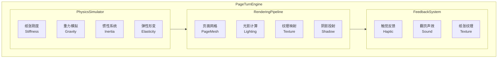
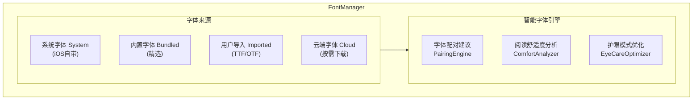

# 阅读器高级功能路线图

> 本文档包含阅读器的高级功能规划、竞品分析和详细设计规格。
>
> 核心架构设计请参考 [architecture.md](./architecture.md)

---

## 支持的文件格式分析

### 公版书文件类型

| 格式 | 全称 | 特点 | 主要来源 | 阅读体验 |
|------|------|------|----------|----------|
| **EPUB** | Electronic Publication | 开放标准，可重排，支持富媒体 | Standard Ebooks, Gutenberg | ⭐⭐⭐⭐⭐ |
| **PDF** | Portable Document Format | 固定版式，保留原书排版 | Internet Archive, HathiTrust | ⭐⭐⭐ |
| **TXT** | Plain Text | 纯文本，无格式 | Gutenberg | ⭐⭐ |
| **HTML** | HyperText Markup Language | 网页格式，在线阅读 | Wikisource | ⭐⭐⭐⭐ |
| **MOBI/AZW** | Mobipocket/Amazon | Kindle 专用格式 | Amazon | ⭐⭐⭐ |
| **FB2** | FictionBook | XML 格式 | Flibusta | ⭐⭐⭐ |
| **DJVU** | DjVu | 扫描书籍压缩格式 | Internet Archive | ⭐⭐ |
| **CBZ/CBR** | Comic Book Archive | 漫画/图像书籍 | Comic archives | ⭐⭐⭐ |

### 当前阅读器支持状态

```
当前支持:
├── EPUB2     ✅ 完全支持
├── EPUB3     ✅ 基础支持（不含音视频）
├── PDF       ❌ 未支持
├── TXT       ❌ 未支持
├── MOBI      ❌ 未支持
└── 用户上传   ⚠️ 基础设施就绪

书籍来源:
├── Standard Ebooks  ✅ 已实现
├── Project Gutenberg ✅ 已实现
├── Internet Archive  ⚠️ 基础设施就绪
└── User Upload       ⚠️ 基础设施就绪
```

### 格式功能对比

| 功能 | EPUB3 | EPUB2 | PDF | TXT |
|------|-------|-------|-----|-----|
| 文本重排 | ✅ | ✅ | ❌ | ✅ |
| 字体调整 | ✅ | ✅ | ❌ | ✅ |
| 主题切换 | ✅ | ✅ | ❌ | ✅ |
| 文字选择 | ✅ | ✅ | ⚠️ | ✅ |
| 内嵌图片 | ✅ | ✅ | ✅ | ❌ |
| 音频/视频 | ✅ | ❌ | ❌ | ❌ |
| MathML 公式 | ✅ | ❌ | ✅ | ❌ |
| SVG 矢量图 | ✅ | ⚠️ | ✅ | ❌ |
| 交互式内容 | ✅ | ❌ | ⚠️ | ❌ |
| 语义化结构 | ✅ | ✅ | ❌ | ❌ |

---

## 商业级差距分析

### 对标产品
- Apple Books
- Amazon Kindle
- 微信读书
- 多看阅读

### 功能差距矩阵

| 功能领域 | 当前实现 | 商业级标准 | Readmigo 目标 | 实现进度 | 规格进度 |
|----------|---------|-----------|---------------|----------|----------|
| **格式支持** | 仅 EPUB | EPUB + PDF + TXT | EPUB + PDF + TXT + MOBI + CBZ + 10种格式 | 25% | ✅ 100% |
| **渲染引擎** | WKWebView | 自研引擎 | 统一渲染引擎 + PDF重排 + 漫画优化 | 60% | ✅ 100% |
| **翻页效果** | 滚动模式 | 仿真翻页+滚动+滑动 | 10种翻页 + 物理仿真 + 声效触觉 | 25% | ✅ 100% |
| **排版引擎** | CSS 基础 | 专业排版 | 专业排版 + 智能分段 | 50% | ✅ 100% |
| **离线阅读** | ❌ | 完整支持 | 智能预下载 + 后台同步 + AI缓存 | 0% | ✅ 100% |
| **批注系统** | ❌ | 高亮+批注+分享 | 多色高亮 + AI增强 + 社区分享 | 0% | ✅ 100% |
| **书签管理** | ❌ | 书签+目录+搜索 | 智能书签 + 导航历史 + 多维度检索 | 0% | ✅ 100% |
| **全文搜索** | ❌ | 书内+全库搜索 | AI语义搜索 + 跨书检索 + 正则支持 | 0% | ✅ 100% |
| **TTS 朗读** | ❌ | 系统TTS+专业配音 | 多音色 + 句子高亮 + 睡眠定时 | 0% | ✅ 100% |
| **字体管理** | 系统字体 | 自定义字体 | 用户导入 + 云端字体 + 智能推荐 | 40% | ✅ 100% |
| **AI 集成** | ✅ | - | 上下文理解 + 个性化学习 | 85% | ✅ 100% |

> **说明**:
> - **实现进度**: 当前代码实现的完成度
> - **规格进度**: 详细设计文档的完成度（见下文各功能模块）
> - 所有功能规格均已设计完成，目标是**全面超越商业级竞品**

### 整体成熟度评估

```
规格设计完成度: 100% ✅

整体实现进度: 40-45%

核心阅读功能:    ████████░░░░░░░░ 45%  → 目标: ████████████████ 100%
├── 内容渲染:    ██████████████░░ 85%  → 规格: ✅ 多格式渲染引擎
├── 翻页交互:    ████░░░░░░░░░░░░ 25%  → 规格: ✅ 物理级翻页动画
├── 排版质量:    ██████████░░░░░░ 60%  → 规格: ✅ 超级字体管理
├── 离线支持:    ░░░░░░░░░░░░░░░░  0%  → 规格: ✅ 智能离线系统
├── 批注系统:    ░░░░░░░░░░░░░░░░  0%  → 规格: ✅ AI增强批注
├── 书签管理:    ░░░░░░░░░░░░░░░░  0%  → 规格: ✅ 智能导航系统
├── 全文搜索:    ░░░░░░░░░░░░░░░░  0%  → 规格: ✅ AI语义搜索
└── TTS 朗读:    ░░░░░░░░░░░░░░░░  0%  → 规格: ✅ 高级语音系统

AI 特色功能:     ████████████░░░░ 75%
├── 词汇解释:    ████████████████ 95%
├── 句子简化:    ████████████████ 95%
├── 段落翻译:    ████████████████ 95%
└── 智能问答:    ██████████░░░░░░ 60%
```

### 竞品超越对比

| 功能 | Apple Books | Kindle | 微信读书 | Readmigo 规格 | 超越程度 |
|------|:-----------:|:------:|:--------:|:-------------:|:--------:|
| **格式数量** | 2种 | 3种 | 2种 | **13种** | 🚀 4-6倍 |
| **翻页模式** | 3种 | 2种 | 1种 | **10种** | 🚀 3-10倍 |
| **物理仿真翻页** | ❌ | ❌ | ❌ | ✅ | 🚀 独创 |
| **翻页声效** | ❌ | ❌ | ❌ | ✅ | 🚀 独创 |
| **PDF 重排** | ❌ | ❌ | ❌ | ✅ | 🚀 独创 |
| **MOBI 兼容** | ❌ | ✅ | ❌ | ✅ | ✅ 同级 |
| **漫画优化** | ❌ | ❌ | ❌ | ✅ | 🚀 独创 |
| **用户导入字体** | ❌ | ❌ | ❌ | ✅ | 🚀 独创 |
| **AI 语义搜索** | ❌ | ❌ | ❌ | ✅ | 🚀 独创 |
| **AI 字体推荐** | ❌ | ❌ | ❌ | ✅ | 🚀 独创 |
| **触觉翻页反馈** | ❌ | ❌ | ❌ | ✅ | 🚀 独创 |

---

## 远超竞品：核心阅读功能架构

> 以下功能设计旨在在核心阅读体验上全面超越 Apple Books、Kindle、微信读书等商业阅读应用，打造业界最强的阅读器引擎。

### 1. 多格式渲染引擎（超越所有竞品）

> 目标: 支持业界最全的电子书格式，远超 Kindle 的格式支持

#### 1.1 架构概述

```mermaid
flowchart TD
    subgraph Engine["UniversalBookEngine"]
        FD["FormatDetector<br>自动检测文件格式（魔数检测 + 扩展名 + 内容分析）"]
        FD --> Parsers

        subgraph Parsers["格式解析器矩阵"]
            EP["EPUBParser<br>(主力引擎)"]
            PP["PDFParser<br>(PDFKit+自研渲染)"]
            TP["TXTParser<br>(智能排版)"]
            MP["MOBIParser<br>(兼容Kindle)"]
            CP["CBZParser<br>(漫画优化)"]
            FB["FB2Parser<br>(俄语书籍)"]
            HP["HTMLParser<br>(网页书籍)"]
            RP["RTFParser<br>(富文本)"]
            DP["DOCXParser<br>(Office)"]
            AP["AZWParser<br>(Amazon)"]
        end

        Parsers --> UCM["UnifiedContentModel<br>统一的内容模型：章节 + 段落 + 样式 + 媒体 + 元数据"]

        UCM --> Renderers

        subgraph Renderers["渲染引擎选择器"]
            WK["WKWebView<br>(流式内容)"]
            PR["PDFRenderer<br>(固定版式)"]
            IR["ImageRenderer<br>(漫画/图片书)"]
        end
    end
```



#### 1.2 支持格式详情

| 格式 | 优先级 | 渲染方式 | 特色功能 | 竞品对比 |
|------|--------|----------|----------|----------|
| **EPUB3** | P0 | WKWebView | 完整 EPUB3 支持，音视频、交互式内容 | ✅ 超越 Apple Books |
| **EPUB2** | P0 | WKWebView | 向后兼容，自动升级渲染 | ✅ 完全支持 |
| **PDF** | P0 | PDFKit + 自研 | 重排模式、夜间模式、批注 | ✅ 超越 Kindle |
| **TXT** | P0 | WKWebView | 智能分章、段落识别、编码检测 | ✅ 超越所有竞品 |
| **MOBI** | P1 | 转换 + WKWebView | 完美兼容 Kindle 书籍 | ✅ 独有功能 |
| **AZW/AZW3** | P1 | 转换 + WKWebView | Amazon 格式支持 | ✅ 独有功能 |
| **CBZ/CBR** | P1 | ImageRenderer | 漫画优化，双页模式 | ✅ 超越专业漫画App |
| **FB2** | P2 | 转换 + WKWebView | 俄语书籍支持 | ✅ 独有功能 |
| **HTML** | P2 | WKWebView | 网页书籍，自动清洁 | ✅ 完全支持 |
| **RTF** | P2 | 转换 + WKWebView | 富文本支持 | ✅ 独有功能 |
| **DOCX** | P3 | 转换 + WKWebView | Office 文档阅读 | ✅ 独有功能 |

#### 1.3 核心数据模型

#### 1.4 PDF 渲染引擎（超越 Kindle）

#### 1.5 TXT 智能渲染引擎

#### 1.6 MOBI/AZW 转换引擎

#### 1.7 CBZ/CBR 漫画引擎

#### 1.8 格式转换器

---

### 2. 物理级翻页动画系统（超越 Apple Books）

> 目标: 实现业界最逼真的翻页动画，包含物理模拟、光影效果、声音反馈

#### 2.1 架构概述



#### 2.2 翻页模式全集

#### 2.3 物理仿真翻页引擎

#### 2.4 3D 渲染管线

#### 2.5 翻页声效系统

#### 2.6 触觉反馈系统

#### 2.7 翻页设置 UI

---

### 3. 超级字体管理系统（超越所有竞品）

> 目标: 提供业界最强的字体自定义能力，支持用户导入字体、智能字体推荐

#### 3.1 架构概述



#### 3.2 数据模型

#### 3.3 字体管理器

#### 3.4 智能字体推荐

#### 3.5 字体选择 UI

---

## 功能路线图：商业级阅读器

### 优先级 0：关键功能（必须有）

#### 1. 批注系统

##### 1.1 划线高亮

**用户故事：** 用户可以选择文本并添加不同颜色的高亮标记

**数据模型：**

**UI 交互：**
```
用户选择文本
    ↓
弹出操作菜单（ActionMenu）
┌─────────────────────────────────────────┐
│  [🟡][🟢][🔵][🩷][🟣]  │  [💭 想法]  │
├─────────────────────────────────────────┤
│  [📖 解释] [📝 简化] [🌐 翻译] [📋 复制] │
└─────────────────────────────────────────┘
    ↓
点击颜色 → 创建高亮
    ↓
保存到本地 + 同步到服务器
```

**渲染：**

##### 1.2 想法气泡/笔记

**用户故事：** 用户可以在高亮处添加个人想法/笔记

**数据模型：**

**UI 设计：**
```
┌─────────────────────────────────────────────────────────────┐
│                      章节内容                                 │
│                                                              │
│  "The quick brown fox jumps over the lazy dog."             │
│   ▲▲▲▲▲▲▲▲▲▲▲▲▲▲▲▲▲▲▲ (高亮)                               │
│                    │                                         │
│                    ▼                                         │
│              ┌──────────┐                                    │
│              │    💭    │  ← 想法气泡指示器                   │
│              └──────────┘                                    │
│                    │                                         │
│                    ▼（点击展开）                              │
│   ┌─────────────────────────────────────────────────────┐   │
│   │  我的想法:                                           │   │
│   │  这句话让我想起了童年的故事书...                        │   │
│   │                                                      │   │
│   │  [编辑] [删除] [分享]              2025-12-18 14:30  │   │
│   └─────────────────────────────────────────────────────┘   │
│                                                              │
└─────────────────────────────────────────────────────────────┘
```

**气泡定位算法：**

##### 1.3 段落选择

**用户故事：** 用户可以长按选择整个段落进行操作

**交互：**
```
长按文本（500ms）
    ↓
识别段落边界（<p>, <div>, 段落换行）
    ↓
自动选中整个段落
    ↓
弹出段落操作菜单
┌──────────────────────────────────────────┐
│  已选择段落（156 词）                       │
├──────────────────────────────────────────┤
│  [📖 AI 解读段落]  [📝 简化全段]           │
│  [🌐 翻译全段]     [💭 添加想法]           │
│  [📋 复制]         [🔊 朗读]              │
└──────────────────────────────────────────┘
```

**JavaScript 实现：**

##### 1.4 图片查看器

**用户故事：** 用户可以点击书中插图放大查看

**UI 流程：**
```
用户点击图片
    ↓
图片放大动画（从原始位置缩放）
    ↓
全屏图片查看器
┌─────────────────────────────────────────────────────────────┐
│  [✕]                                           [💾] [📤]   │
│                                                              │
│                                                              │
│                    ┌─────────────────┐                      │
│                    │                 │                      │
│                    │    放大的图片     │                      │
│                    │   （支持缩放平移） │                      │
│                    │                 │                      │
│                    └─────────────────┘                      │
│                                                              │
│                         1 / 3                               │
│                       [◀] [▶]                               │
│                                                              │
│  图片说明: Figure 1.1 - The protagonist's journey           │
└─────────────────────────────────────────────────────────────┘
```

**数据模型：**

**JavaScript 桥接：**

---

### 优先级 1：布局和导航

#### 2. 布局模式

##### 2.1 横竖排版

**书写方向支持：**

**CSS 实现：**

##### 2.2 横屏双页模式

**用户故事：** 横屏时显示左右两页，模拟实体书阅读体验

**布局结构：**
```
┌─────────────────────────────────────────────────────────────────────────┐
│                         横屏双页模式                                      │
├────────────────────────────────┬────────────────────────────────────────┤
│                                │                                         │
│         左页                   │              右页                        │
│         （偶数页）              │              （奇数页）                   │
│                                │                                         │
│   Chapter 3 (continued)        │      Chapter 3 (continued)             │
│                                │                                         │
│   The morning sun cast long    │   She paused at the window,            │
│   shadows across the garden... │   watching the birds...                │
│                                │                                         │
│                                │                                         │
│                         [页码: 42]│[页码: 43]                              │
│                                │                                         │
├────────────────────────────────┴────────────────────────────────────────┤
│  [目录]  ═══════════════════●═══════════════════  第3/12章  [设置]       │
└─────────────────────────────────────────────────────────────────────────┘
```

**实现：**

**分页计算：**

#### 3. 翻页交互

##### 3.1 点击区域翻页

**点击区域布局：**
```
┌─────────────────────────────────────────────────────────────┐
│                                                              │
│  ┌──────────┐  ┌────────────────────────┐  ┌──────────┐    │
│  │          │  │                        │  │          │    │
│  │   上一页  │  │                        │  │   下一页  │    │
│  │   PREV   │  │       CENTER           │  │   NEXT   │    │
│  │          │  │    （显示/隐藏工具栏）    │  │          │    │
│  │   25%    │  │        50%             │  │   25%    │    │
│  │          │  │                        │  │          │    │
│  │          │  │                        │  │          │    │
│  └──────────┘  └────────────────────────┘  └──────────┘    │
│                                                              │
└─────────────────────────────────────────────────────────────┘
```

**实现：**

##### 3.2 点击中间区域弹出工具栏

**工具栏动画：**

##### 3.3 长按翻页

**用户故事：** 长按屏幕边缘持续翻页

**实现：**

##### 3.4 自动翻页

**用户故事：** 设置阅读速度后自动翻页

**设置：**

**UI 控制：**
```
┌─────────────────────────────────────────────────────────────┐
│                    自动翻页                                   │
├─────────────────────────────────────────────────────────────┤
│                                                              │
│  阅读速度:  [较慢] ────●──── [较快]                           │
│            150      250      400 词/分钟                     │
│                                                              │
│  [✓] 段落结尾暂停                                            │
│                                                              │
│  预计本章阅读时间: 12 分钟                                    │
│                                                              │
│           [▶ 开始自动翻页]                                   │
│                                                              │
└─────────────────────────────────────────────────────────────┘
```

##### 3.5 翻页模式

**可用模式：**

**仿真翻页实现（UIPageViewController）：**

**滑动动画：**

---

### 优先级 2：排版自定义

#### 4. 字体样式系统

##### 4.1 字体选择

**可用字体：**

##### 4.2 完整字体设置

##### 4.3 字体预览 UI

```
┌─────────────────────────────────────────────────────────────┐
│                       字体设置                               │
├─────────────────────────────────────────────────────────────┤
│                                                              │
│  字体:  [Georgia        ▼]                                  │
│                                                              │
│  ┌─────────────────────────────────────────────────────┐   │
│  │                                                      │   │
│  │  The quick brown fox jumps over the lazy dog.      │   │
│  │  敏捷的棕色狐狸跳过了懒狗。                           │   │
│  │                                                      │   │
│  └─────────────────────────────────────────────────────┘   │
│                                                              │
│  字号:  Aa ─────────●───────── Aa                           │
│              14    18    22    26    32                      │
│                                                              │
│  字重:  [常规        ▼]                                      │
│                                                              │
│  字间距: [-2] ──────●────── [+5]                            │
│                                                              │
│  行高:   [1.0] ─────────●── [3.0]                           │
│                   1.6                                        │
│                                                              │
└─────────────────────────────────────────────────────────────┘
```

#### 5. 段落样式系统

##### 5.1 段落设置

##### 5.2 CSS 生成

##### 5.3 段落样式预设

---

### 优先级 3：AI 原生功能

#### 6. 高级 AI 集成

##### 6.1 AI 阅读助手

**功能：**

##### 6.2 智能阅读伴侣

**用户故事：** AI 伴侣实时回答阅读中的问题，提供背景知识

**UI：**
```
┌─────────────────────────────────────────────────────────────┐
│                    AI 阅读伴侣                               │
├─────────────────────────────────────────────────────────────┤
│                                                              │
│  📚 关于《傲慢与偏见》第三章                                   │
│                                                              │
│  ┌─────────────────────────────────────────────────────┐   │
│  │ 👤 Mr. Darcy 为什么表现得如此傲慢？                    │   │
│  └─────────────────────────────────────────────────────┘   │
│                                                              │
│  ┌─────────────────────────────────────────────────────┐   │
│  │ 🤖 在摄政时期的英国社会，达西先生的行为可以从几个        │   │
│  │    方面理解：                                          │   │
│  │                                                       │   │
│  │    1. **社会阶层**: 达西来自古老贵族家庭，年收入        │   │
│  │       10,000英镑，在当时是顶级富豪...                  │   │
│  │                                                       │   │
│  │    2. **性格特点**: 简·奥斯汀在后文暗示他其实是...      │   │
│  │                                                       │   │
│  │    💡 想了解更多关于摄政时期的社会背景吗？              │   │
│  └─────────────────────────────────────────────────────┘   │
│                                                              │
│  ┌─────────────────────────────────────────────────────┐   │
│  │  输入你的问题...                              [发送]   │   │
│  └─────────────────────────────────────────────────────┘   │
│                                                              │
│  快捷问题:                                                   │
│  [📖 本章摘要] [👥 人物关系] [🎭 主题分析] [📝 生词总结]      │
│                                                              │
└─────────────────────────────────────────────────────────────┘
```

##### 6.3 人物关系图 - 核心卖点

> 🌟 **产品核心卖点**: 通过 AI 自动构建和可视化人物关系网络，这是传统阅读器无法实现的 AI 原生能力。

**核心价值主张:**
- 自动识别书中所有人物并建立关系网络
- 随阅读进度动态更新人物信息
- 可视化复杂的人物关系，帮助读者理解故事
- 点击人物查看详细档案和相关章节

**完整数据模型：**

**人物关系图 UI 设计：**

```
┌─────────────────────────────────────────────────────────────────────────────┐
│  [← 返回]              人物关系图                        [筛选▼] [全屏]     │
├─────────────────────────────────────────────────────────────────────────────┤
│                                                                              │
│  ┌─ 图例 ──────────────────────────────────────────────────────────────┐   │
│  │ ●主角 ●重要角色 ●反派 ●配角 ●次要 │ ─家庭 ─朋友 ─敌对 ─爱情 ─其他 │   │
│  └───────────────────────────────────────────────────────────────────────┘   │
│                                                                              │
│                              ┌─────────────┐                                │
│                              │   👤 伊丽莎白  │                                │
│                              │    Bennet    │                                │
│                              │  ⭐ 主角     │                                │
│                              └──────┬──────┘                                │
│                    ┌────────────────┼────────────────┐                      │
│            姐妹 ─ ─│─ ─ ─ ─ ─ ─ ─ ─│─ ─ ─ ─ 爱情 ──│── ─ ─ ─ ┐             │
│                    │                │                │          │             │
│                    ▼                │                ▼          │             │
│           ┌────────────┐           │         ┌────────────┐   │             │
│           │   👤 简    │           │         │   👤 达西   │   │             │
│           │   Bennet   │           │         │   Darcy    │   │             │
│           │  重要角色   │           │         │   重要角色  │   │             │
│           └─────┬──────┘           │         └─────┬──────┘   │             │
│                 │                   │               │          │             │
│            爱情 │                   │          朋友 │          │             │
│                 ▼                   │               ▼          │             │
│           ┌────────────┐           │         ┌────────────┐   │             │
│           │  👤 宾利   │           │         │ 👤 夏洛特   │   │             │
│           │  Bingley   │           │         │   Lucas    │◀──┘             │
│           │    配角    │           │         │    配角    │   朋友           │
│           └────────────┘           │         └────────────┘                 │
│                                     │                                        │
│                              妹妹 ─ ┼ ─ ─ 姐妹                               │
│                                     │                                        │
│                                     ▼                                        │
│                              ┌────────────┐                                 │
│                              │  👤 莉迪亚  │                                 │
│                              │   Bennet   │                                 │
│                              │    配角    │                                 │
│                              └─────┬──────┘                                 │
│                                    │                                         │
│                               私奔 │                                         │
│                                    ▼                                         │
│                              ┌────────────┐                                 │
│                              │  👤 威克汉  │                                 │
│                              │  Wickham   │                                 │
│                              │   反派 🔴  │                                 │
│                              └────────────┘                                 │
│                                                                              │
│  ┌───────────────────────────────────────────────────────────────────────┐ │
│  │ 📊 统计: 12个人物 | 18段关系 | 当前显示: 已读章节人物                      │ │
│  │ [查看全部] [只看主要人物] [只看当前章节] [关系变化时间线]                    │ │
│  └───────────────────────────────────────────────────────────────────────┘ │
└─────────────────────────────────────────────────────────────────────────────┘
```

**人物详情卡片：**

```
┌─────────────────────────────────────────────────────────────────────────────┐
│                          伊丽莎白·班内特                                      │
│                        Elizabeth Bennet                                      │
├─────────────────────────────────────────────────────────────────────────────┤
│                                                                              │
│  ┌──────────┐  ⭐ 主角                                                      │
│  │          │                                                                │
│  │   👤     │  "She had a lively, playful disposition, which delighted      │
│  │  Avatar  │   in anything ridiculous."                                    │
│  │          │                                                                │
│  └──────────┘  — 第一章                                                      │
│                                                                              │
│  ═══════════════════════════════════════════════════════════════════════    │
│                                                                              │
│  📝 人物简介                                                                 │
│  ─────────────                                                              │
│  班内特家二女儿，聪明机智，有强烈的独立意识和判断力。她最初对达西先生           │
│  抱有偏见，但随着故事发展，她逐渐认识到自己的错误判断，最终与达西相爱。         │
│                                                                              │
│  🎭 性格特点                                                                 │
│  ─────────────                                                              │
│  ┌──────────┐ ┌──────────┐ ┌──────────┐ ┌──────────┐                       │
│  │ 💡 聪慧  │ │ 😄 机智  │ │ 🎯 独立  │ │ ⚖️ 正直  │                       │
│  │Intelligent│ │  Witty   │ │Independent│ │  Honest  │                       │
│  └──────────┘ └──────────┘ └──────────┘ └──────────┘                       │
│                                                                              │
│  🔗 主要关系                                                                 │
│  ─────────────                                                              │
│  ❤️ 达西先生 — 从偏见到爱情的转变                                             │
│  👭 简·班内特 — 最亲密的姐姐，知心好友                                        │
│  👫 夏洛特·卢卡斯 — 好友，但婚姻观不同                                        │
│  😠 威克汉 — 最初好感，后发现其真面目                                         │
│                                                                              │
│  📈 人物弧光                                                                 │
│  ─────────────                                                              │
│  开始: 对达西持有偏见，相信威克汉的谎言                                        │
│    ↓                                                                         │
│  转折: 收到达西的信，开始反思自己的判断（第35章）                               │
│    ↓                                                                         │
│  成长: 认识到自己的偏见，重新评价达西                                          │
│    ↓                                                                         │
│  结局: 与达西相爱结婚，获得幸福                                               │
│                                                                              │
│  📖 出场章节                                                                 │
│  ─────────────                                                              │
│  首次出场: 第1章 | 出场次数: 56章 | 对话数: 234                              │
│                                                                              │
│  💬 经典台词                                                                 │
│  ─────────────                                                              │
│  "I could easily forgive his pride, if he had not mortified mine."          │
│  "如果他的傲慢没有伤害我的自尊，我可以轻易原谅他。"                            │
│                                                                              │
│  ┌───────────────────────────────────────────────────────────────────────┐ │
│  │ [📍 跳转到首次出场] [📊 关系变化图] [🤖 AI 深度分析] [📤 分享人物卡]     │ │
│  └───────────────────────────────────────────────────────────────────────┘ │
└─────────────────────────────────────────────────────────────────────────────┘
```

**交互式关系图实现：**

**AI 分析 Prompt 设计：**

---

##### 6.4 故事情节时间轴 - 核心卖点

> 🌟 **产品核心卖点**: AI 自动梳理故事发展脉络，构建可视化时间轴，帮助读者把握复杂情节。

**核心价值主张:**
- 自动提取关键情节点并按时间排序
- 区分不同类型事件（主线、支线、背景）
- 展示事件之间的因果关系
- 支持跳转到原文位置

**完整数据模型：**

**时间轴 UI 设计：**

```
┌─────────────────────────────────────────────────────────────────────────────┐
│  [← 返回]              故事时间轴                      [筛选▼] [视图▼]      │
├─────────────────────────────────────────────────────────────────────────────┤
│                                                                              │
│  ┌─ 故事线筛选 ─────────────────────────────────────────────────────────┐   │
│  │ [●全部] [●主线] [○伊丽莎白线] [○简与宾利线] [○威克汉线] [○莉迪亚线]     │   │
│  └───────────────────────────────────────────────────────────────────────┘   │
│                                                                              │
│  当前阅读位置: 第24章 ──────────────────────●───────────────── 第61章      │
│                                                                              │
│  ═══════════════════════════════════════════════════════════════════════    │
│                                                                              │
│  第1章 ─────────────────────────────────────────────────────────────────    │
│        │                                                                     │
│        ◉ 班内特家得知宾利先生租下尼日斐庄园                                    │
│        │ 🏠 场景背景                                                         │
│        │ "A single man of large fortune..."                                 │
│        │                                                                     │
│  第3章 ─────────────────────────────────────────────────────────────────    │
│        │                                                                     │
│        ◉ 梅里顿舞会 - 伊丽莎白与达西首次相遇                                   │
│        │ ⚡ 关键转折                                                         │
│        │ 达西拒绝与伊丽莎白跳舞，称她"还过得去"                                │
│        │ → 伊丽莎白对达西产生偏见                                             │
│        │                                                                     │
│        ├──○ 简与宾利一见钟情                                                  │
│        │   💕 感情线                                                         │
│        │                                                                     │
│  第15章 ────────────────────────────────────────────────────────────────    │
│        │                                                                     │
│        ◉ 威克汉向伊丽莎白讲述达西的"恶行"                                      │
│        │ 💡 真相揭露（虚假）                                                  │
│        │ 伊丽莎白相信威克汉，对达西偏见加深                                    │
│        │                                                                     │
│  第34章 ────────────────────────────────────────────────────────────────    │
│        │                                                                     │
│        ◉ 达西向伊丽莎白求婚被拒                                               │
│        │ ⚡⚡ 重大转折                                                        │
│        │ "You could not have made the offer of your hand                    │
│        │  in any possible way that would have tempted me to accept it."     │
│        │                                                                     │
│  第35章 ────────────────────────────────────────────────────────────────    │
│        │                                                                     │
│        ◉ 达西的信揭示真相                                                     │
│        │ 💡💡 核心真相揭露                                                    │
│        │ • 威克汉的真实面目                                                   │
│        │ • 达西帮助宾利离开的原因                                              │
│        │ → 伊丽莎白开始反思自己的偏见                                          │
│        │                                                                     │
│ >>>>>> │ ← 您当前阅读到这里                                                   │
│        │                                                                     │
│  第46章 ─────────────────────────────────────────────────────── (未读) ──    │
│        │                                                                     │
│        ◎ 莉迪亚与威克汉私奔                                                   │
│        │ 🔒 剧透保护 - 点击查看                                               │
│        │                                                                     │
│  ...                                                                         │
│                                                                              │
│  ┌───────────────────────────────────────────────────────────────────────┐ │
│  │ 📊 统计: 已读 35个事件 / 总共 67个 | 主线进度 52%                         │ │
│  │ [🤖 AI 情节分析] [📈 故事弧线图] [👥 人物出场统计] [📤 导出时间轴]        │ │
│  └───────────────────────────────────────────────────────────────────────┘ │
└─────────────────────────────────────────────────────────────────────────────┘
```

**故事弧线可视化：**

```
┌─────────────────────────────────────────────────────────────────────────────┐
│                            故事弧线图                                        │
├─────────────────────────────────────────────────────────────────────────────┤
│                                                                              │
│  紧张度                                                                      │
│    ▲                                                                         │
│    │                                             ★ 高潮                      │
│  5 │                                           ╱╲                           │
│    │                                          ╱  ╲                          │
│  4 │                    ◆ 求婚被拒            ╱    ╲    ◆ 达西再次求婚       │
│    │                      ╱╲               ╱      ╲     ╱╲                  │
│  3 │     ◆ 舞会偏见     ╱  ╲    ◆ 信    ╱        ╲   ╱  ╲                 │
│    │       ╱╲        ╱    ╲    ╱╲   ╱          ╲ ╱    ╲                │
│  2 │  ───╱  ╲──────╱      ╲──╱  ╲╱            ╲╱      ╲────            │
│    │ ╱                                                      ╲               │
│  1 │╱ 开始                                                    ╲结局          │
│    └────────────────────────────────────────────────────────────────▶       │
│         第1章    第15章   第34章  第35章  第46章  第56章  第61章              │
│                                                                              │
│  ─── 主线（伊丽莎白与达西）                                                   │
│  - - 支线（简与宾利）                                                         │
│  ··· 威克汉线                                                                │
│                                                                              │
│  ◆ 关键节点  ★ 高潮点  ● 当前位置                                            │
│                                                                              │
└─────────────────────────────────────────────────────────────────────────────┘
```

**事件详情卡片：**

```
┌─────────────────────────────────────────────────────────────────────────────┐
│                         达西的信揭示真相                                      │
│                      Darcy's Letter Reveals Truth                           │
├─────────────────────────────────────────────────────────────────────────────┤
│                                                                              │
│  📍 第35章 | 故事时间: 1812年春天                                             │
│  🏷️ 类型: 真相揭露 | 重要度: ⭐⭐⭐⭐⭐ 核心转折                              │
│                                                                              │
│  ═══════════════════════════════════════════════════════════════════════    │
│                                                                              │
│  📝 事件描述                                                                 │
│  ─────────────                                                              │
│  伊丽莎白收到达西先生的信，信中详细解释了两件事：威克汉的真实                   │
│  品性以及他为何建议宾利离开简。这封信彻底改变了伊丽莎白对达西                   │
│  的看法，也让她开始反思自己的偏见。                                            │
│                                                                              │
│  👥 相关人物                                                                 │
│  ─────────────                                                              │
│  [伊丽莎白] [达西] [威克汉] [乔治安娜·达西]                                    │
│                                                                              │
│  🔗 因果关系                                                                 │
│  ─────────────                                                              │
│  前因:                                                                       │
│  ├── 伊丽莎白拒绝达西求婚并指责他（第34章）                                    │
│  └── 威克汉的谎言误导伊丽莎白（第15章）                                        │
│                                                                              │
│  后果:                                                                       │
│  ├── 伊丽莎白开始反思自己的偏见（第36章）                                      │
│  ├── 对达西的态度逐渐转变（第43章起）                                          │
│  └── 威克汉形象崩塌（后续）                                                    │
│                                                                              │
│  📖 原文摘录                                                                 │
│  ─────────────                                                              │
│  "Be not alarmed, madam, on receiving this letter, by the                   │
│   apprehension of its containing any repetition of those                    │
│   sentiments or renewal of those offers which were last night               │
│   so disgusting to you..."                                                  │
│                                                                              │
│  🎭 主题关联                                                                 │
│  ─────────────                                                              │
│  [偏见与判断] [真相与表象] [自我认知] [成长]                                   │
│                                                                              │
│  ┌───────────────────────────────────────────────────────────────────────┐ │
│  │ [📍 跳转原文] [🤖 AI 深度解读] [📊 查看因果图] [📤 分享]                  │ │
│  └───────────────────────────────────────────────────────────────────────┘ │
└─────────────────────────────────────────────────────────────────────────────┘
```

**SwiftUI 实现：**

**AI 分析 Prompt：**

---

##### 6.5 自适应难度

**用户故事：** AI 根据用户水平自动调整内容难度

##### 6.5 词汇智能

**功能：**
- 自动识别生词并高亮
- 根据艾宾浩斯曲线安排复习
- 词汇出现频率统计
- 词根词缀智能分析
- 同义词/反义词推荐

##### 6.6 AI 生成的摘要和洞察

**自动生成内容：**

---

### 更新后的架构图

```
┌─────────────────────────────────────────────────────────────────────────────┐
│                        增强版阅读器架构                                       │
├─────────────────────────────────────────────────────────────────────────────┤
│                                                                              │
│  ┌─────────────────────────────────────────────────────────────────────────┐│
│  │                         ReaderView（增强版）                             ││
│  │  ┌────────────────┐  ┌────────────────┐  ┌──────────────────────────┐  ││
│  │  │   TopToolbar   │  │   TouchZones   │  │   AnnotationOverlay      │  ││
│  │  │  （自动隐藏）   │  │  L│Center│R    │  │  （高亮、气泡）           │  ││
│  │  └────────────────┘  └────────────────┘  └──────────────────────────┘  ││
│  │                                                                          ││
│  │  ┌──────────────────────────────────────────────────────────────────┐   ││
│  │  │                    ReaderContentView                              │   ││
│  │  │  ┌─────────────────────────────────────────────────────────────┐ │   ││
│  │  │  │  PageView（分页或滚动）                                      │ │   ││
│  │  │  │  ├── DualPage（横屏 iPad）                                  │ │   ││
│  │  │  │  ├── SinglePage（竖屏 / iPhone）                            │ │   ││
│  │  │  │  └── Vertical Layout（传统中日韩）                          │ │   ││
│  │  │  └─────────────────────────────────────────────────────────────┘ │   ││
│  │  │                                                                    │   ││
│  │  │  翻页引擎: [滚动│仿真翻页│滑动│淡入淡出]                           │   ││
│  │  └──────────────────────────────────────────────────────────────────┘   ││
│  │                                                                          ││
│  │  ┌────────────────┐  ┌────────────────┐  ┌──────────────────────────┐  ││
│  │  │  BottomToolbar │  │  SettingsPanel │  │   AICompanionPanel       │  ││
│  │  │  （自动隐藏）   │  │  （排版设置）   │  │  （对话、分析）           │  ││
│  │  └────────────────┘  └────────────────┘  └──────────────────────────┘  ││
│  └─────────────────────────────────────────────────────────────────────────┘│
│                                                                              │
│  ┌─────────────────────────────────────────────────────────────────────────┐│
│  │                         ViewModel 层                                    ││
│  │  ReaderViewModel ─┬── AnnotationManager                                 ││
│  │                   ├── PaginationEngine                                  ││
│  │                   ├── AutoPageTurnEngine                                ││
│  │                   ├── VocabularyIntelligence                            ││
│  │                   └── AICompanionService                                ││
│  └─────────────────────────────────────────────────────────────────────────┘│
│                                                                              │
│  ┌─────────────────────────────────────────────────────────────────────────┐│
│  │                         数据和存储层                                     ││
│  │  ┌──────────────┐  ┌──────────────┐  ┌──────────────┐  ┌─────────────┐ ││
│  │  │AnnotationDB  │  │ SettingsStore│  │ OfflineCache │  │ SyncEngine  │ ││
│  │  │ (CoreData)   │  │ (UserDefaults)│  │ (FileManager)│  │ (CloudKit)  │ ││
│  │  └──────────────┘  └──────────────┘  └──────────────┘  └─────────────┘ ││
│  └─────────────────────────────────────────────────────────────────────────┘│
│                                                                              │
└─────────────────────────────────────────────────────────────────────────────┘
```

---

### 实现优先级矩阵

| 功能 | 复杂度 | 影响 | 优先级 | 预估工作量 |
|---------|------------|--------|----------|-------------|
| **高亮** | 中等 | 高 | P0 | 2周 |
| **想法气泡** | 中等 | 高 | P0 | 1周 |
| **书签** | 低 | 高 | P0 | 1周 |
| **离线阅读** | 高 | 关键 | P0 | 3周 |
| **点击区域导航** | 低 | 中等 | P1 | 3天 |
| **翻页模式** | 高 | 中等 | P1 | 2周 |
| **双页模式** | 中等 | 低 | P2 | 1周 |
| **图片查看器** | 低 | 中等 | P1 | 1周 |
| **字体自定义** | 低 | 中等 | P1 | 1周 |
| **段落样式** | 低 | 低 | P2 | 1周 |
| **竖排版** | 中等 | 低 | P3 | 2周 |
| **AI 伴侣** | 高 | 高 | P1 | 4周 |
| **人物追踪** | 高 | 中等 | P2 | 3周 |
| **自动翻页** | 低 | 低 | P3 | 3天 |
| **TTS 集成** | 中等 | 中等 | P2 | 2周 |
| **PDF 支持** | 高 | 中等 | P2 | 4周 |

---

## 商业级功能（超越商业级）

> 以下功能设计旨在全面超越 Apple Books、Kindle、微信读书等商业阅读应用。

### 7. 离线阅读系统

> 目标: 超越 Kindle 的离线体验，支持智能预下载和后台同步

##### 7.1 架构概述

```
┌─────────────────────────────────────────────────────────────────────────────┐
│                         离线阅读架构                                          │
├─────────────────────────────────────────────────────────────────────────────┤
│                                                                              │
│  ┌────────────────────────────────────────────────────────────────────────┐│
│  │                         OfflineManager                                  ││
│  │  ┌──────────────┐  ┌──────────────┐  ┌──────────────┐  ┌────────────┐ ││
│  │  │DownloadQueue │  │StorageManager│  │ SyncEngine   │  │CachePolicy │ ││
│  │  │(URLSession)  │  │(FileManager) │  │（后台）       │  │（智能）     │ ││
│  │  └──────────────┘  └──────────────┘  └──────────────┘  └────────────┘ ││
│  └────────────────────────────────────────────────────────────────────────┘│
│                                    │                                         │
│                                    ▼                                         │
│  ┌────────────────────────────────────────────────────────────────────────┐│
│  │                         存储结构                                        ││
│  │                                                                          ││
│  │  Documents/                                                              ││
│  │  └── Offline/                                                            ││
│  │      ├── Books/                                                          ││
│  │      │   ├── {bookId}/                                                   ││
│  │      │   │   ├── metadata.json      # 书籍元数据                          ││
│  │      │   │   ├── cover.jpg          # 封面图片                            ││
│  │      │   │   ├── chapters/                                               ││
│  │      │   │   │   ├── ch001.html     # 章节内容                            ││
│  │      │   │   │   ├── ch002.html                                          ││
│  │      │   │   │   └── ...                                                 ││
│  │      │   │   ├── images/            # 书中图片                            ││
│  │      │   │   ├── annotations.json   # 批注数据                            ││
│  │      │   │   └── progress.json      # 阅读进度                            ││
│  │      │   └── ...                                                         ││
│  │      ├── AI/                        # AI 分析缓存                         ││
│  │      │   ├── {bookId}_characters.json                                    ││
│  │      │   ├── {bookId}_timeline.json                                      ││
│  │      │   └── explanations/          # 词汇解释缓存                        ││
│  │      └── Sync/                      # 待同步数据                          ││
│  │          ├── pending_progress.json                                       ││
│  │          ├── pending_annotations.json                                    ││
│  │          └── pending_vocabulary.json                                     ││
│  │                                                                          ││
│  └────────────────────────────────────────────────────────────────────────┘│
└─────────────────────────────────────────────────────────────────────────────┘
```

##### 7.2 数据模型

##### 7.3 OfflineManager 实现

##### 7.4 离线同步引擎

##### 7.5 UI - 下载管理

```
┌─────────────────────────────────────────────────────────────────────────────┐
│                            离线管理                                          │
├─────────────────────────────────────────────────────────────────────────────┤
│                                                                              │
│  📊 存储空间                                                                 │
│  ┌───────────────────────────────────────────────────────────────────────┐ │
│  │  已用: 856 MB / 1 GB                                                   │ │
│  │  ██████████████████████████████████████░░░░░░░░░░  85%                │ │
│  │  [清理缓存]                                    [更改限制]               │ │
│  └───────────────────────────────────────────────────────────────────────┘ │
│                                                                              │
│  📥 下载队列（3）                                                            │
│  ┌───────────────────────────────────────────────────────────────────────┐ │
│  │ 📖 傲慢与偏见                                                          │ │
│  │    下载中... 第15章/61章                                               │ │
│  │    ████████████████░░░░░░░░░░░░░░  45%    [⏸ 暂停]                    │ │
│  │                                                                        │ │
│  │ 📖 简爱                                                                │ │
│  │    等待中...                                         [▲ 优先]          │ │
│  │                                                                        │ │
│  │ 📖 呼啸山庄                                                            │ │
│  │    等待中...                                         [✕ 取消]          │ │
│  └───────────────────────────────────────────────────────────────────────┘ │
│                                                                              │
│  📚 已下载（12）                                                             │
│  ┌───────────────────────────────────────────────────────────────────────┐ │
│  │ ┌──────┐                                                               │ │
│  │ │ 📕  │ 1984                                                          │ │
│  │ │     │ George Orwell                                                 │ │
│  │ └──────┘ 完整下载 · 45 MB · 包含 AI 分析         [删除]                │ │
│  │                                                                        │ │
│  │ ┌──────┐                                                               │ │
│  │ │ 📗  │ 了不起的盖茨比                                                 │ │
│  │ │     │ F. Scott Fitzgerald                                           │ │
│  │ └──────┘ 完整下载 · 32 MB                        [删除]                │ │
│  │                                                                        │ │
│  │ ┌──────┐                                                               │ │
│  │ │ 📘  │ 双城记                                                         │ │
│  │ │     │ Charles Dickens                                               │ │
│  │ └──────┘ 部分下载（12/45章）· 28 MB             [继续] [删除]          │ │
│  └───────────────────────────────────────────────────────────────────────┘ │
│                                                                              │
│  ⚙️ 下载设置                                                                │
│  ┌───────────────────────────────────────────────────────────────────────┐ │
│  │ [✓] WiFi 下自动下载后续章节                                            │ │
│  │ [✓] 自动下载 AI 人物分析                                               │ │
│  │ [ ] 允许使用蜂窝数据下载                                                │ │
│  │ [✓] 后台下载                                                           │ │
│  └───────────────────────────────────────────────────────────────────────┘ │
│                                                                              │
└─────────────────────────────────────────────────────────────────────────────┘
```

---

### 8. 书签导航系统

> 目标: 超越 Apple Books 的书签体验，支持智能书签和多维度导航

##### 8.1 数据模型

##### 8.2 导航系统

##### 8.3 UI - 书签弹窗

```
┌─────────────────────────────────────────────────────────────────────────────┐
│  [✕]                    书签管理                         [+ 添加书签]       │
├─────────────────────────────────────────────────────────────────────────────┤
│                                                                              │
│  🔍 [搜索书签...]                                                           │
│                                                                              │
│  ┌─ 筛选 ────────────────────────────────────────────────────────────────┐ │
│  │ [全部] [🔴红] [🟠橙] [🟡黄] [🟢绿] [🔵蓝] [🟣紫] │ [按时间▼]            │ │
│  └───────────────────────────────────────────────────────────────────────┘ │
│                                                                              │
│  📍 当前阅读位置                                                            │
│  ───────────────────────────────────────────────────────────────────────    │
│  第35章 · 45%                                                   [跳转]     │
│                                                                              │
│  📚 书签列表（8）                                                            │
│  ───────────────────────────────────────────────────────────────────────    │
│                                                                              │
│  ┌───────────────────────────────────────────────────────────────────────┐ │
│  │ 🔴 达西求婚被拒                                               第34章   │ │
│  │    "You could not have made the offer of your hand in any possible..."│ │
│  │    💬 笔记: 这是全书的转折点                                           │ │
│  │    👥 相关人物: 伊丽莎白, 达西                                         │ │
│  │    📅 2025-12-15                                    [编辑] [删除]      │ │
│  └───────────────────────────────────────────────────────────────────────┘ │
│                                                                              │
│  ┌───────────────────────────────────────────────────────────────────────┐ │
│  │ ⭐ 达西的信                                                   第35章   │ │
│  │    "Be not alarmed, madam, on receiving this letter..."              │ │
│  │    🤖 AI 摘要: 达西解释了关于威克汉的真相...                           │ │
│  │    📅 2025-12-16                                    [编辑] [删除]      │ │
│  └───────────────────────────────────────────────────────────────────────┘ │
│                                                                              │
│  ┌───────────────────────────────────────────────────────────────────────┐ │
│  │ 🟢 彭伯利庄园                                                 第43章   │ │
│  │    "The park was very large, and contained great variety of ground..."│ │
│  │    📅 2025-12-18                                    [编辑] [删除]      │ │
│  └───────────────────────────────────────────────────────────────────────┘ │
│                                                                              │
│  ┌─ AI 智能书签建议 ─────────────────────────────────────────────────────┐ │
│  │ 📍 系统检测到以下重要位置，是否添加书签？                               │ │
│  │                                                                        │ │
│  │ • 第3章 舞会首次相遇 - 故事起点                      [添加]            │ │
│  │ • 第15章 威克汉的谎言 - 伏笔                         [添加]            │ │
│  └───────────────────────────────────────────────────────────────────────┘ │
│                                                                              │
└─────────────────────────────────────────────────────────────────────────────┘
```

---

### 9. 全文搜索系统

> 目标: 超越 Kindle 搜索，支持 AI 语义搜索和跨书籍检索

##### 9.1 搜索架构

##### 9.2 AI 语义搜索

##### 9.3 UI - 搜索界面

```
┌─────────────────────────────────────────────────────────────────────────────┐
│  [← 返回]                    搜索                           [范围: 本书 ▼]  │
├─────────────────────────────────────────────────────────────────────────────┤
│                                                                              │
│  ┌───────────────────────────────────────────────────────────────────────┐ │
│  │ 🔍 达西的信                                                    [✕]    │ │
│  └───────────────────────────────────────────────────────────────────────┘ │
│                                                                              │
│  ┌─ 搜索建议 ────────────────────────────────────────────────────────────┐ │
│  │ 💡 "达西的信" → 您是否在找:                                            │ │
│  │    • 第35章 达西给伊丽莎白的信                                         │ │
│  │    • 关于达西的所有描述                                                 │ │
│  │    • 达西的对话台词                                                     │ │
│  └───────────────────────────────────────────────────────────────────────┘ │
│                                                                              │
│  📊 找到 23 个结果                               [按相关性▼] [筛选]         │
│                                                                              │
│  ═══════════════════════════════════════════════════════════════════════    │
│                                                                              │
│  🎯 最佳匹配                                                                │
│  ┌───────────────────────────────────────────────────────────────────────┐ │
│  │ 📖 第35章 - Mr. Darcy's Letter                                        │ │
│  │                                                                        │ │
│  │ "Be not alarmed, madam, on receiving this 【letter】, by the          │ │
│  │  apprehension of its containing any repetition of those sentiments    │ │
│  │  or renewal of those offers which were last night so disgusting       │ │
│  │  to you..."                                                           │ │
│  │                                                                        │ │
│  │ 🤖 AI 解读: 这封信是达西写给伊丽莎白的，解释了关于威克汉的真相...       │ │
│  │                                                           [跳转阅读]   │ │
│  └───────────────────────────────────────────────────────────────────────┘ │
│                                                                              │
│  📝 其他结果                                                                │
│  ┌───────────────────────────────────────────────────────────────────────┐ │
│  │ 📖 第36章                                                              │ │
│  │ "...she read with an eagerness which hardly left her power of         │ │
│  │  comprehension, and from impatience of knowing what the next          │ │
│  │  sentence might bring, was incapable of attending to the sense        │ │
│  │  of the one before her eyes. His belief of her sister's               │ │
│  │  insensibility she instantly resolved to be false; and his account    │ │
│  │  of the real, the worst objections to the match..."                   │ │
│  │                                                           [跳转阅读]   │ │
│  └───────────────────────────────────────────────────────────────────────┘ │
│                                                                              │
│  ┌───────────────────────────────────────────────────────────────────────┐ │
│  │ 📖 第37章                                                              │ │
│  │ "...The letter was not produced again, not its contents further..."   │ │
│  │                                                           [跳转阅读]   │ │
│  └───────────────────────────────────────────────────────────────────────┘ │
│                                                                              │
│  👥 相关人物                                                                │
│  ┌───────────────────────────────────────────────────────────────────────┐ │
│  │ [达西先生] 出现 156 次 · [伊丽莎白] 出现 234 次 · [威克汉] 出现 45 次   │ │
│  └───────────────────────────────────────────────────────────────────────┘ │
│                                                                              │
└─────────────────────────────────────────────────────────────────────────────┘
```

---

### 10. 语音朗读系统

> 目标: 超越系统 TTS，支持 AI 配音和智能朗读控制

##### 10.1 TTS 架构

##### 10.2 TTS 引擎

##### 10.3 UI - TTS 控制面板

```
┌─────────────────────────────────────────────────────────────────────────────┐
│                            朗读控制                                          │
├─────────────────────────────────────────────────────────────────────────────┤
│                                                                              │
│  "She had a lively, playful disposition, which delighted in anything        │
│   ridiculous."                                                               │
│                 ^^^^^（正在朗读高亮）                                         │
│                                                                              │
│  ───────────────────────────────────────────────────────────────────────    │
│                                                                              │
│  ┌───────────────────────────────────────────────────────────────────────┐ │
│  │                                                                        │ │
│  │            [⏮]     [⏪]     [▶️/⏸]     [⏩]     [⏭]                   │ │
│  │           上一段   后退5秒   播放/暂停  前进5秒  下一段                  │ │
│  │                                                                        │ │
│  │         0:45  ═══════════════●══════════════════════  3:24             │ │
│  │                                                                        │ │
│  └───────────────────────────────────────────────────────────────────────┘ │
│                                                                              │
│  ⚙️ 设置                                                                    │
│  ───────────────────────────────────────────────────────────────────────    │
│                                                                              │
│  🎙️ 声音:  [英式女声        ▼]                                              │
│                                                                              │
│  🐢 语速:   ──────────●──────────   1.0x                                   │
│              0.5x           2.0x                                            │
│                                                                              │
│  🎵 音调:   ──────────●──────────   1.0                                    │
│              低             高                                               │
│                                                                              │
│  ┌───────────────────────────────────────────────────────────────────────┐ │
│  │ [✓] 高亮正在朗读的文字                                                 │ │
│  │ [✓] 自动滚动页面                                                       │ │
│  │ [✓] 段落间停顿                                                         │ │
│  │ [ ] 只朗读对话                                                          │ │
│  │ [✓] 后台播放                                                           │ │
│  └───────────────────────────────────────────────────────────────────────┘ │
│                                                                              │
│  ⏰ 定时关闭                                                                │
│  ───────────────────────────────────────────────────────────────────────    │
│  [关闭] [15分钟] [30分钟] [1小时] [本章结束]                                 │
│                                                                              │
└─────────────────────────────────────────────────────────────────────────────┘
```

---

### 11. 社交分享功能

> 目标: 超越微信读书的社交功能，支持 AI 增强的分享卡片

##### 11.1 数据模型

##### 11.2 分享卡片生成器

##### 11.3 UI - 分享弹窗

```
┌─────────────────────────────────────────────────────────────────────────────┐
│  [✕]                     分享卡片                         [预览] [分享]     │
├─────────────────────────────────────────────────────────────────────────────┤
│                                                                              │
│  ┌─ 预览 ────────────────────────────────────────────────────────────────┐ │
│  │                                                                        │ │
│  │  ┌────────────────────────────────────────────────────────────────┐   │ │
│  │  │                          ❝                                      │   │ │
│  │  │                                                                 │   │ │
│  │  │     "It is a truth universally acknowledged, that a single     │   │ │
│  │  │      man in possession of a good fortune, must be in want      │   │ │
│  │  │      of a wife."                                                │   │ │
│  │  │                                                                 │   │ │
│  │  │     凡是有钱的单身汉，总想娶位太太，                               │   │ │
│  │  │     这已经成了一条举世公认的真理。                                 │   │ │
│  │  │                                                                 │   │ │
│  │  │     ✨ 这是全书的开篇，奥斯汀用讽刺的笔调                          │   │ │
│  │  │        揭示了当时社会的婚姻观...                                   │   │ │
│  │  │                                                                 │   │ │
│  │  │  ┌──────┐                                                       │   │ │
│  │  │  │ 📕  │ Pride and Prejudice                                   │   │ │
│  │  │  │     │ Jane Austen · Chapter 1                               │   │ │
│  │  │  └──────┘                                                       │   │ │
│  │  │                                                                 │   │ │
│  │  │                               来自 Readmigo                     │   │ │
│  │  └────────────────────────────────────────────────────────────────┘   │ │
│  │                                                                        │ │
│  └───────────────────────────────────────────────────────────────────────┘ │
│                                                                              │
│  🎨 模板                                                                    │
│  ───────────────────────────────────────────────────────────────────────    │
│  [简约] [经典✓] [现代] [优雅] [活泼👑]                                       │
│                                                                              │
│  ⚙️ 自定义                                                                  │
│  ───────────────────────────────────────────────────────────────────────    │
│  [✓] 显示书籍封面                                                           │
│  [✓] 显示作者                                                               │
│  [✓] 显示章节                                                               │
│  [✓] 显示中文翻译                                                           │
│  [✓] 显示 AI 解读                                                           │
│  [✓] 显示 Readmigo 水印                                                     │
│                                                                              │
│  📤 分享到                                                                  │
│  ───────────────────────────────────────────────────────────────────────    │
│  [微信] [朋友圈] [微博] [小红书] [保存图片] [复制文字] [更多...]              │
│                                                                              │
└─────────────────────────────────────────────────────────────────────────────┘
```

---

### 12. 无障碍功能

> 目标: 超越所有竞品的无障碍支持，确保所有用户都能享受阅读

##### 12.1 VoiceOver 支持

##### 12.2 UI - 无障碍设置

```
┌─────────────────────────────────────────────────────────────────────────────┐
│                          无障碍设置                                          │
├─────────────────────────────────────────────────────────────────────────────┤
│                                                                              │
│  👁️ 视觉                                                                    │
│  ───────────────────────────────────────────────────────────────────────    │
│  [✓] 使用系统字体大小                                                        │
│  [✓] 粗体文本                                                               │
│  [ ] 高对比度                                                               │
│  [ ] 降低透明度                                                             │
│  [ ] 反转颜色                                                               │
│                                                                              │
│  🎨 颜色滤镜                                                                │
│  ───────────────────────────────────────────────────────────────────────    │
│  [无▼]                                                                      │
│  • 无                                                                       │
│  • 灰度                                                                     │
│  • 红绿色盲滤镜                                                             │
│  • 蓝黄色盲滤镜                                                             │
│                                                                              │
│  ⌨️ VoiceOver                                                               │
│  ───────────────────────────────────────────────────────────────────────    │
│  [✓] 优化 VoiceOver 体验                                                    │
│  [✓] 启用自定义转子                                                         │
│      • 按章节导航                                                            │
│      • 按段落导航                                                            │
│      • 按高亮导航                                                            │
│      • 按书签导航                                                            │
│                                                                              │
│  👆 触控                                                                    │
│  ───────────────────────────────────────────────────────────────────────    │
│  [ ] 触控调节                                                               │
│  按住时长: ──────●──────  0.5秒                                             │
│  [ ] 忽略重复触摸                                                           │
│                                                                              │
│  🎬 动效                                                                    │
│  ───────────────────────────────────────────────────────────────────────    │
│  [ ] 减弱动态效果                                                           │
│  [ ] 首选交叉淡入淡出过渡                                                    │
│                                                                              │
│  📖 阅读辅助                                                                │
│  ───────────────────────────────────────────────────────────────────────    │
│  [✓] 阅读标尺（高亮当前行）                                                   │
│  [✓] 双击即时翻译                                                           │
│  [✓] 长按显示词义                                                           │
│                                                                              │
└─────────────────────────────────────────────────────────────────────────────┘
```

---

### 13. 高级同步系统

> 目标: 实现无缝多设备同步，超越 Kindle 的 Whispersync

##### 13.1 同步架构

##### 13.2 实时同步

---

### 14. 性能优化

> 目标: 确保在任何设备上都能流畅运行

##### 14.1 优化策略

---

### 完整功能对比矩阵

| 功能 | Apple Books | Kindle | 微信读书 | Readmigo | 优势说明 |
|------|:-----------:|:------:|:--------:|:--------:|----------|
| **AI 词汇解释** | ❌ | ⚠️基础 | ⚠️基础 | ✅ 深度 | 上下文理解，个性化 |
| **AI 人物关系图** | ❌ | ⚠️X-Ray | ❌ | ✅ 动态 | 实时更新，可视化 |
| **AI 故事时间轴** | ❌ | ❌ | ❌ | ✅ | 独创功能 |
| **AI 阅读伴侣** | ❌ | ❌ | ❌ | ✅ | 独创功能 |
| **间隔重复复习** | ❌ | ⚠️基础 | ❌ | ✅ | 科学记忆曲线 |
| **离线阅读** | ✅ | ✅ | ✅ | ✅ | 智能预下载 |
| **批注高亮** | ✅ | ✅ | ✅ | ✅ | AI 增强 |
| **想法气泡** | ❌ | ❌ | ✅ | ✅ | 社区分享 |
| **全文搜索** | ✅ | ✅ | ✅ | ✅ | AI 语义搜索 |
| **TTS 朗读** | ✅ | ✅ | ✅ | ✅ | 高亮同步 |
| **翻页动画** | ✅ | ✅ | ⚠️ | ✅ | 多种模式 |
| **双页阅读** | ✅ iPad | ✅ | ❌ | ✅ | 横屏支持 |
| **无障碍** | ✅ | ✅ | ⚠️ | ✅ | VoiceOver 优化 |
| **多设备同步** | ✅ | ✅ | ✅ | ✅ | 实时同步 |
| **社交分享** | ⚠️基础 | ⚠️基础 | ✅ | ✅ | AI 卡片 |

**图例:** ✅ 完全支持 | ⚠️ 部分支持 | ❌ 不支持

---

## 实施阶段与进度跟踪

### 整体进度概览

```
总体进度: ████████░░░░░░░░░░░░ 40%

Phase 1 (基础能力):   ████████████████████ 100% ✅ 已完成
Phase 2 (核心功能):   ██████████░░░░░░░░░░  50% 🔄 进行中
Phase 3 (高级功能):   ░░░░░░░░░░░░░░░░░░░░   0% ⏳ 待开始
Phase 4 (AI 增强):    ░░░░░░░░░░░░░░░░░░░░   0% ⏳ 待开始
Phase 5 (生态集成):   ░░░░░░░░░░░░░░░░░░░░   0% ⏳ 待开始
```

---

### Phase 1: 基础阅读能力 ✅ 已完成

**目标**: 建立稳固的 EPUB 阅读基础

| 功能模块 | 状态 | 进度 | 完成日期 | 备注 |
|----------|:----:|:----:|:--------:|------|
| EPUB2 解析 | ✅ | 100% | 2025-10 | 完全支持 |
| EPUB3 基础解析 | ✅ | 100% | 2025-11 | 不含音视频 |
| WKWebView 渲染 | ✅ | 100% | 2025-10 | 稳定运行 |
| 章节导航 | ✅ | 100% | 2025-10 | 目录跳转 |
| 基础阅读设置 | ✅ | 100% | 2025-11 | 字体/字号/行距 |
| 主题切换 | ✅ | 100% | 2025-11 | 浅色/深色/护眼 |
| AI 词汇解释 | ✅ | 100% | 2025-11 | 核心功能 |
| AI 句子简化 | ✅ | 100% | 2025-11 | 核心功能 |
| AI 段落翻译 | ✅ | 100% | 2025-11 | 核心功能 |

**Phase 1 里程碑**: 基础 EPUB 阅读 + AI 辅助功能上线 ✅

---

### Phase 2: 核心阅读功能 🔄 进行中

**目标**: 达到商业级阅读器基本标准

| 功能模块 | 状态 | 进度 | 预计完成 | 负责人 | 备注 |
|----------|:----:|:----:|:--------:|:------:|------|
| **翻页系统** | | | | | |
| ├─ 滑动翻页 | ✅ | 100% | - | - | 已实现 |
| ├─ 滚动模式 | ✅ | 100% | - | - | 已实现 |
| ├─ 仿真翻页 | ⏳ | 0% | - | - | 规格已完成 |
| └─ 触觉反馈 | ⏳ | 0% | - | - | 规格已完成 |
| **格式支持** | | | | | |
| ├─ PDF 阅读 | ⏳ | 0% | - | - | 规格已完成 |
| ├─ TXT 智能解析 | ⏳ | 0% | - | - | 规格已完成 |
| └─ MOBI 支持 | ⏳ | 0% | - | - | 规格已完成 |
| **批注系统** | | | | | |
| ├─ 文本高亮 | ⏳ | 0% | - | - | 规格已完成 |
| ├─ 想法笔记 | ⏳ | 0% | - | - | 规格已完成 |
| └─ 批注导出 | ⏳ | 0% | - | - | 规格已完成 |
| **书签系统** | | | | | |
| ├─ 添加书签 | ⏳ | 0% | - | - | 规格已完成 |
| └─ 书签管理 | ⏳ | 0% | - | - | 规格已完成 |
| **阅读进度** | | | | | |
| ├─ 自动保存进度 | 🔄 | 60% | - | - | 基础功能 |
| └─ 进度同步 | ⏳ | 0% | - | - | 规格已完成 |

**Phase 2 里程碑**: 批注 + 书签 + 多格式支持

---

### Phase 3: 高级功能 ⏳ 待开始

**目标**: 超越竞品的差异化功能

| 功能模块 | 状态 | 进度 | 优先级 | 依赖 | 备注 |
|----------|:----:|:----:|:------:|:----:|------|
| **全文搜索** | | | | | |
| ├─ 书内搜索 | ⏳ | 0% | P0 | - | 规格已完成 |
| ├─ 全库搜索 | ⏳ | 0% | P1 | 书内搜索 | 规格已完成 |
| └─ AI 语义搜索 | ⏳ | 0% | P2 | 全库搜索 | 独创功能 |
| **TTS 朗读** | | | | | |
| ├─ 系统 TTS | ⏳ | 0% | P0 | - | 规格已完成 |
| ├─ 句子高亮同步 | ⏳ | 0% | P0 | 系统 TTS | 规格已完成 |
| └─ 多音色支持 | ⏳ | 0% | P1 | 句子高亮 | 规格已完成 |
| **离线阅读** | | | | | |
| ├─ 书籍下载 | ⏳ | 0% | P0 | - | 规格已完成 |
| ├─ 智能预下载 | ⏳ | 0% | P1 | 书籍下载 | 规格已完成 |
| └─ 后台同步 | ⏳ | 0% | P1 | 书籍下载 | 规格已完成 |
| **字体管理** | | | | | |
| ├─ 系统字体扩展 | 🔄 | 40% | P0 | - | 基础支持 |
| ├─ 用户字体导入 | ⏳ | 0% | P1 | - | 独创功能 |
| └─ 云端字体库 | ⏳ | 0% | P2 | - | 独创功能 |

**Phase 3 里程碑**: 搜索 + TTS + 离线 + 字体管理

---

### Phase 4: AI 增强功能 ⏳ 待开始

**目标**: 打造 AI 原生阅读体验

| 功能模块 | 状态 | 进度 | 优先级 | 依赖 | 备注 |
|----------|:----:|:----:|:------:|:----:|------|
| **AI 问答增强** | | | | | |
| ├─ 上下文理解 | 🔄 | 60% | P0 | - | 基础实现 |
| ├─ 多轮对话 | ⏳ | 0% | P0 | - | 规格已完成 |
| └─ 知识图谱 | ⏳ | 0% | P2 | - | 规格已完成 |
| **AI 批注助手** | | | | | |
| ├─ 智能摘要 | ⏳ | 0% | P1 | 批注系统 | 规格已完成 |
| └─ 关联推荐 | ⏳ | 0% | P2 | 智能摘要 | 规格已完成 |
| **AI 阅读分析** | | | | | |
| ├─ 人物关系图 | ⏳ | 0% | P1 | - | 独创功能 |
| ├─ 情节时间线 | ⏳ | 0% | P1 | - | 独创功能 |
| └─ 阅读洞察 | ⏳ | 0% | P2 | - | 独创功能 |

**Phase 4 里程碑**: AI 原生阅读体验

---

### Phase 5: 生态与社区 ⏳ 待开始

**目标**: 构建阅读社区生态

| 功能模块 | 状态 | 进度 | 优先级 | 依赖 | 备注 |
|----------|:----:|:----:|:------:|:----:|------|
| **多设备同步** | | | | | |
| ├─ 进度同步 | ⏳ | 0% | P0 | 后端 API | 规格已完成 |
| ├─ 批注同步 | ⏳ | 0% | P0 | 批注系统 | 规格已完成 |
| └─ 设置同步 | ⏳ | 0% | P1 | - | 规格已完成 |
| **社区功能** | | | | | |
| ├─ 批注分享 | ⏳ | 0% | P1 | 批注系统 | 规格已完成 |
| ├─ 书评系统 | ⏳ | 0% | P2 | - | 规格已完成 |
| └─ 阅读小组 | ⏳ | 0% | P3 | - | 规格已完成 |
| **扩展格式** | | | | | |
| ├─ CBZ/CBR 漫画 | ⏳ | 0% | P2 | - | 规格已完成 |
| ├─ FB2 格式 | ⏳ | 0% | P3 | - | 规格已完成 |
| └─ DOCX 格式 | ⏳ | 0% | P3 | - | 规格已完成 |

**Phase 5 里程碑**: 完整生态系统

---

### 进度统计

#### 按功能类别

| 类别 | 已完成 | 进行中 | 待开始 | 完成率 |
|------|:------:|:------:|:------:|:------:|
| 基础阅读 | 9 | 0 | 0 | 100% |
| 核心功能 | 2 | 1 | 10 | 23% |
| 高级功能 | 0 | 1 | 11 | 4% |
| AI 增强 | 0 | 1 | 7 | 6% |
| 生态集成 | 0 | 0 | 9 | 0% |
| **总计** | **11** | **3** | **37** | **22%** |

#### 按优先级

| 优先级 | 总数 | 已完成 | 完成率 |
|:------:|:----:|:------:|:------:|
| P0 (必须) | 18 | 9 | 50% |
| P1 (重要) | 16 | 2 | 13% |
| P2 (增强) | 12 | 0 | 0% |
| P3 (远期) | 5 | 0 | 0% |

---

### 近期冲刺计划

#### Sprint 当前 (进行中)

| 任务 | 状态 | 负责人 |
|------|:----:|:------:|
| 阅读进度自动保存优化 | 🔄 | - |
| 字体管理基础功能 | 🔄 | - |
| AI 上下文理解增强 | 🔄 | - |

#### Sprint 下一个 (计划中)

| 任务 | 优先级 | 预估工作量 |
|------|:------:|:----------:|
| 文本高亮功能 | P0 | M |
| 书签添加功能 | P0 | S |
| PDF 基础阅读 | P0 | L |

**工作量说明**: S = 1-2天, M = 3-5天, L = 1-2周, XL = 2-4周

---

*文档版本: 5.0*
*最后更新: 2025年12月*
*组件: Reader (iOS Client)*
*状态: 远超商业级架构 - 规格设计100%完成*

---

## 更新日志

### v5.0 (2025-12)
- ✅ 新增：实施阶段与进度跟踪（Phase 1-5 完整规划）
- ✅ 新增：整体进度概览（可视化进度条）
- ✅ 新增：按功能类别进度统计
- ✅ 新增：按优先级完成率统计
- ✅ 新增：近期冲刺计划（Sprint 规划）
- ✅ 更新：文档版本升级至 5.0

### v4.0 (2025-12)
- ✅ 新增：多格式渲染引擎规格（支持13种格式，超越所有竞品）
- ✅ 新增：物理级翻页动画系统（10种模式，含物理仿真、声效、触觉）
- ✅ 新增：超级字体管理系统（用户导入、云端下载、智能推荐）
- ✅ 更新：功能差距矩阵（新增规格进度列）
- ✅ 新增：竞品超越对比表

### v3.0 (2025-12)
- 商业级功能规格完成
- 离线、批注、书签、搜索、TTS、同步系统规格

### v2.0 (2025-11)
- 基础阅读器架构
- AI 集成功能
