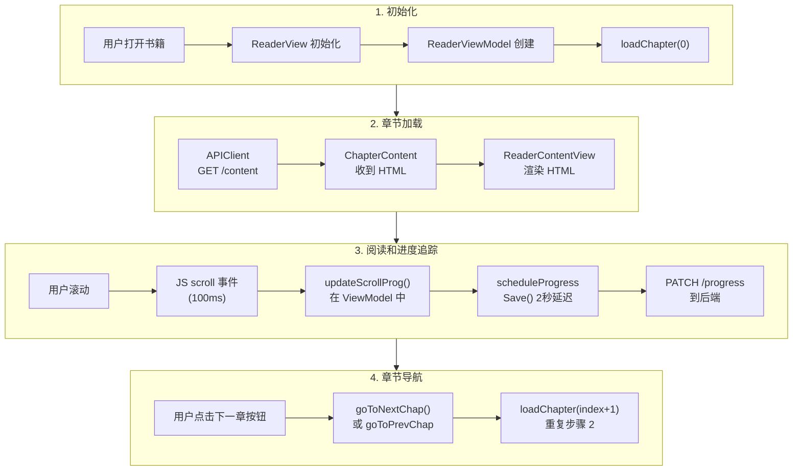
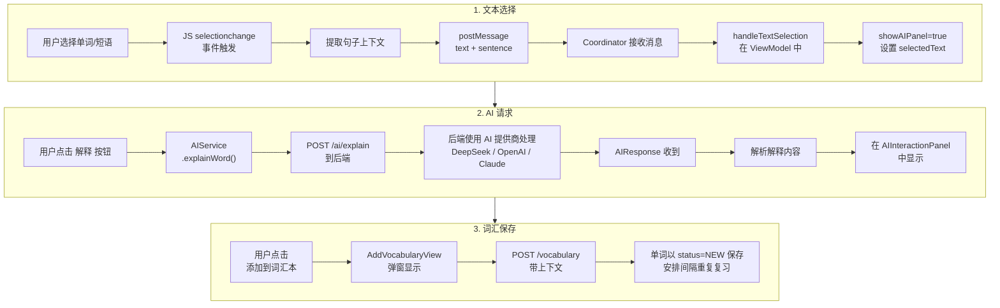

# 阅读器组件架构

## 概述

阅读器是 Readmigo 的核心组件，Readmigo 是一款 AI 原生英语阅读应用。它提供沉浸式阅读体验，并集成了 AI 辅助词汇学习功能。阅读器通过 WKWebView 将书籍内容渲染为 HTML，跟踪阅读进度，支持文本选择以获取 AI 解释，并与词汇学习系统无缝集成。

**核心职责：**
- 渲染章节内容，支持可自定义的主题和排版
- 跟踪章节内和跨章节的阅读进度
- 支持文本选择以获取 AI 驱动的解释
- 促进阅读过程中的词汇习得
- 提供无缝的章节导航

---

## 架构图

```
┌─────────────────────────────────────────────────────────────────────────────┐
│                              ReaderView                                      │
│  ┌─────────────────────────────────────────────────────────────────────────┐│
│  │                         ReaderTopBar                                    ││
│  │  [X 关闭]         书籍标题          [章节目录] [设置]                      ││
│  └─────────────────────────────────────────────────────────────────────────┘│
│                                                                              │
│  ┌─────────────────────────────────────────────────────────────────────────┐│
│  │                      ReaderContentView                                  ││
│  │  ┌───────────────────────────────────────────────────────────────────┐ ││
│  │  │                        WKWebView                                   │ ││
│  │  │                                                                    │ ││
│  │  │    ┌─────────────────────────────────────────────────────────┐    │ ││
│  │  │    │              渲染的 HTML 内容                             │    │ ││
│  │  │    │                                                          │    │ ││
│  │  │    │  章节内容包含：                                           │    │ ││
│  │  │    │  - 动态 CSS（主题、字体）                                 │    │ ││
│  │  │    │  - 文本选择处理器                                         │    │ ││
│  │  │    │  - 滚动进度追踪                                           │    │ ││
│  │  │    │                                                          │    │ ││
│  │  │    └─────────────────────────────────────────────────────────┘    │ ││
│  │  │                                                                    │ ││
│  │  │    JavaScript 桥接 ←──────────────────────────────────────────────┼─┼──→ 原生 Swift
│  │  │    - textSelection: {text, sentence}                               │ ││
│  │  │    - scroll: {progress}                                            │ ││
│  │  │    - tap: {}                                                       │ ││
│  │  └───────────────────────────────────────────────────────────────────┘ ││
│  └─────────────────────────────────────────────────────────────────────────┘│
│                                                                              │
│  ┌─────────────────────────────────────────────────────────────────────────┐│
│  │                       ReaderBottomBar                                   ││
│  │  [◀ 上一章]    ════════════════●══════    第3/12章  45%    [下一章 ▶]   ││
│  └─────────────────────────────────────────────────────────────────────────┘│
│                                                                              │
│  ┌─────────────────────────────────────────────────────────────────────────┐│
│  │                    AIInteractionPanel (浮层)                            ││
│  │  选中文本: "ephemeral"                                                  ││
│  │  [解释] [简化] [翻译] [分析]                                            ││
│  │  ──────────────────────────────────────────                             ││
│  │  释义: 短暂的，转瞬即逝的...                                            ││
│  │  [添加到词汇本]                            [复制]                        ││
│  └─────────────────────────────────────────────────────────────────────────┘│
└─────────────────────────────────────────────────────────────────────────────┘

                                    │
                                    ▼
┌─────────────────────────────────────────────────────────────────────────────┐
│                          ReaderViewModel                                     │
│  ┌─────────────────┐  ┌─────────────────┐  ┌─────────────────────────────┐ │
│  │  阅读状态        │  │  进度状态       │  │      UI 状态                │ │
│  │  - currentIndex │  │  - scrollProg   │  │  - showSettings             │ │
│  │  - chapter      │  │  - overallProg  │  │  - showChapterList          │ │
│  │  - content      │  │                 │  │  - showAIPanel              │ │
│  └────────┬────────┘  └────────┬────────┘  │  - selectedText             │ │
│           │                    │           └─────────────────────────────┘ │
│           ▼                    ▼                                            │
│  ┌─────────────────────────────────────────────────────────────────────┐   │
│  │                         核心方法                                     │   │
│  │  loadChapter() → updateProgress() → saveProgress() → handleSelection │   │
│  └─────────────────────────────────────────────────────────────────────┘   │
└─────────────────────────────────────────────────────────────────────────────┘
                                    │
                    ┌───────────────┼───────────────┐
                    ▼               ▼               ▼
            ┌───────────┐   ┌───────────┐   ┌───────────────┐
            │ APIClient │   │ AIService │   │ VocabularyMgr │
            └───────────┘   └───────────┘   └───────────────┘
```

---

## 文件结构

```
ios/Readmigo/
├── Features/
│   └── Reader/
│       ├── ReaderView.swift           # 主容器视图
│       ├── ReaderViewModel.swift      # 状态管理和业务逻辑
│       ├── ReaderContentView.swift    # WKWebView 包装器 (UIViewRepresentable)
│       └── ReaderSettingsView.swift   # 主题和排版设置
│
├── Core/
│   └── Models/
│       ├── Book.swift                 # Book, BookDetail, ChapterSummary, ChapterContent
│       ├── Reading.swift              # LibraryBook, ReadingSession, UpdateProgressRequest
│       ├── Vocabulary.swift           # VocabularyWord, AddVocabularyRequest
│       └── AI.swift                   # AI 请求/响应模型
│
└── UI/
    └── Themes/
        └── ThemeManager.swift         # 全局主题状态（字体、颜色）
```

---

## 核心组件

### 1. ReaderView（主容器）

**用途：** 协调阅读体验的根容器

**职责：**
- 展示阅读内容和导航控件
- 管理浮层可见性（4秒后自动隐藏）
- 展示设置和章节列表的弹窗
- 协调 AI 交互面板

**关键特性：**
```swift
struct ReaderView: View {
    let book: Book
    let bookDetail: BookDetail
    @StateObject private var viewModel: ReaderViewModel

    // 控制可见性，自动隐藏
    @State private var showControls = true
    @State private var hideTask: Task<Void, Never>?

    // 弹窗展示
    @State private var showChapterList = false
    @State private var showSettings = false
}
```

**控件自动隐藏逻辑：**
```
用户点击屏幕
    ↓
取消现有的 hideTask
    ↓
showControls = true
    ↓
安排新的 hideTask（4秒延迟）
    ↓
4秒后: showControls = false
```

### 2. ReaderViewModel（状态管理）

**用途：** 集中式状态管理和业务逻辑

**已发布属性：**
| 属性 | 类型 | 描述 |
|----------|------|----------------|
| `currentChapterIndex` | Int | 当前章节索引（从0开始）|
| `currentChapter` | Chapter? | 当前章节元数据 |
| `chapterContent` | ChapterContent? | 用于渲染的 HTML 内容 |
| `scrollProgress` | Double | 章节内进度（0.0-1.0）|
| `overallProgress` | Double | 整本书进度（0.0-1.0）|
| `selectedText` | String? | 用户选中的文本，用于 AI |
| `selectedSentence` | String? | 包含选中文本的句子，提供上下文 |
| `showAIPanel` | Bool | AI 交互面板可见性 |
| `isLoading` | Bool | 加载状态指示器 |
| `error` | String? | 错误消息显示 |

**核心方法：**

```swift
// 章节加载
func loadChapter(at index: Int) async
func goToNextChapter()
func goToPreviousChapter()
func goToChapter(_ chapter: Chapter)

// 进度管理
func updateScrollProgress(_ progress: Double)
func calculateOverallProgress() -> Double
func scheduleProgressSave()
func saveProgress() async

// 文本选择
func handleTextSelection(text: String, sentence: String)
func clearSelection()
```

**进度计算公式：**
```
overallProgress = (chapterIndex / totalChapters) + (scrollProgress / totalChapters)

示例（第10章中的第3章，滚动50%）：
overallProgress = (2/10) + (0.5/10) = 0.2 + 0.05 = 0.25 (25%)
```

### 3. ReaderContentView（WKWebView 桥接）

**用途：** SwiftUI 和 WKWebView 之间的桥接，用于 HTML 渲染

**架构：**
```swift
struct ReaderContentView: UIViewRepresentable {
    let content: ChapterContent
    let theme: ReaderTheme
    let fontSize: FontSize

    // 回调到 ViewModel
    let onProgressUpdate: (Double) -> Void
    let onTextSelection: (String, String) -> Void
    let onTap: () -> Void

    func makeUIView(context: Context) -> WKWebView
    func updateUIView(_ webView: WKWebView, context: Context)
    func makeCoordinator() -> Coordinator
}
```

**JavaScript 桥接消息：**

| 消息 | 载荷 | 触发条件 | 处理器动作 |
|---------|---------|---------|----------------|
| `textSelection` | `{text, sentence}` | `selectionchange` 事件 | 显示 AI 面板 |
| `scroll` | `{progress}` | `scroll` 事件（100ms 防抖）| 更新进度 |
| `tap` | `{}` | `touchend` 事件（100ms 防抖）| 切换控件显示 |

**HTML 生成：**
```swift
func generateHTML(content: ChapterContent, theme: ReaderTheme, fontSize: FontSize) -> String {
    """
    <!DOCTYPE html>
    <html>
    <head>
        <meta name="viewport" content="width=device-width, initial-scale=1.0, maximum-scale=1.0">
        <style>
            body {
                background-color: \(theme.backgroundColor);
                color: \(theme.textColor);
                font-size: \(fontSize.textSize)px;
                line-height: \(fontSize.lineHeight);
                font-family: Georgia, serif;
                padding: 20px;
                margin: 0;
            }
            ::selection {
                background-color: \(theme.highlightColor);
            }
        </style>
    </head>
    <body>
        \(content.content)
        <script>
            // 文本选择处理器
            document.addEventListener('selectionchange', () => {
                const selection = window.getSelection();
                if (selection.toString().trim()) {
                    const text = selection.toString();
                    const sentence = getSentenceFromSelection(selection);
                    webkit.messageHandlers.textSelection.postMessage({text, sentence});
                }
            });

            // 滚动进度追踪
            let scrollTimeout;
            window.addEventListener('scroll', () => {
                clearTimeout(scrollTimeout);
                scrollTimeout = setTimeout(() => {
                    const progress = window.scrollY / (document.body.scrollHeight - window.innerHeight);
                    webkit.messageHandlers.scroll.postMessage({progress: Math.min(1, Math.max(0, progress))});
                }, 100);
            });

            // 点击检测
            document.addEventListener('touchend', () => {
                setTimeout(() => webkit.messageHandlers.tap.postMessage({}), 100);
            });
        </script>
    </body>
    </html>
    """
}
```

### 4. ReaderSettingsView（自定义设置）

**用途：** 阅读体验的用户偏好设置

**设置项：**
| 设置 | 选项 | 存储方式 |
|---------|---------|---------|
| 字号 | 小(14px)、中(17px)、大(20px)、特大(24px) | `@AppStorage` |
| 阅读主题 | 浅色、护眼、深色 | `@AppStorage` |
| 两端对齐 | 开/关 | `@AppStorage` |
| 连字符 | 开/关 | `@AppStorage` |

---

## 数据模型

### 书籍和章节模型

```swift
struct Book: Identifiable, Codable {
    let id: String
    let title: String
    let author: String
    let description: String?
    let coverUrl: String?
    let genres: [String]
    let difficultyScore: Int          // 1-100
    let wordCount: Int
    let chapterCount: Int
    let source: BookSource
    let status: BookStatus
}

struct BookDetail: Codable {
    // 包含所有 Book 字段，另加：
    let chapters: [ChapterSummary]
}

struct ChapterSummary: Identifiable, Codable {
    let id: String
    let title: String
    let orderIndex: Int
    let wordCount: Int
}

struct ChapterContent: Codable {
    let id: String
    let title: String
    let orderIndex: Int
    let content: String               // HTML 内容
    let wordCount: Int
    let previousChapterId: String?
    let nextChapterId: String?
}
```

### 阅读进度模型

```swift
struct LibraryBook: Identifiable, Codable {
    let id: String
    let bookId: String
    let book: BookInfo
    let currentChapterId: String?
    let currentChapterIndex: Int
    let chapterProgress: Double       // 0.0-1.0
    let overallProgress: Double       // 0.0-1.0
    let status: ReadingStatus
    let totalReadingTime: Int         // 秒
    let lastReadAt: Date?
    let addedAt: Date
}

struct UpdateProgressRequest: Codable {
    let bookId: String
    let chapterId: String
    let progress: Double
    let position: String?             // 可选的滚动位置标记
}
```

### AI 集成模型

```swift
struct WordExplainRequest: Codable {
    let word: String
    let sentence: String
    let bookId: String?
    let chapterId: String?
}

struct AIResponse: Codable {
    let content: String
    let model: String
    let provider: String
    let usage: TokenUsage
}

struct WordExplanation {
    let word: String
    let definition: String
    let translation: String
    let partOfSpeech: String
    let examples: [String]
    let relatedWords: [String]
}
```

---

## 状态流程图

### 阅读会话流程



### AI 交互流程



---

## 主题系统

### 阅读器主题配置

```swift
enum ReaderTheme: String, CaseIterable {
    case light
    case sepia
    case dark

    var backgroundColor: String {
        switch self {
        case .light: return "#FFFFFF"
        case .sepia: return "#FAF3E3"
        case .dark:  return "#1F1F1F"
        }
    }

    var textColor: String {
        switch self {
        case .light: return "#000000"
        case .sepia: return "#4D331A"
        case .dark:  return "#D9D9D9"
        }
    }

    var highlightColor: String {
        switch self {
        case .light: return "rgba(255, 255, 0, 0.3)"
        case .sepia: return "rgba(255, 165, 0, 0.3)"
        case .dark:  return "rgba(100, 149, 237, 0.3)"
        }
    }
}
```

### 字号配置

```swift
enum FontSize: String, CaseIterable {
    case small
    case medium
    case large
    case extraLarge

    var textSize: Int {
        switch self {
        case .small:      return 14
        case .medium:     return 17
        case .large:      return 20
        case .extraLarge: return 24
        }
    }

    var lineHeight: Double {
        switch self {
        case .small:      return 1.4
        case .medium:     return 1.5
        case .large:      return 1.6
        case .extraLarge: return 1.7
        }
    }
}
```

---

## API 集成

### 阅读器使用的接口

| 接口 | 方法 | 用途 |
|----------|--------|---------|
| `/books/{id}` | GET | 获取书籍详情和章节列表 |
| `/books/{id}/content/{chapterId}` | GET | 获取章节 HTML 内容 |
| `/reading/progress/{bookId}` | PATCH | 更新阅读进度 |
| `/ai/explain` | POST | 获取单词解释 |
| `/ai/simplify` | POST | 简化句子 |
| `/ai/translate` | POST | 翻译段落 |
| `/ai/qa` | POST | 提问内容相关问题 |
| `/vocabulary` | POST | 保存单词到词汇本 |

### 请求/响应示例

**章节内容请求：**
```
GET /books/abc123/content/ch001
Authorization: Bearer <token>
```

**章节内容响应：**
```json
{
  "id": "ch001",
  "title": "Chapter 1: The Beginning",
  "orderIndex": 0,
  "content": "<h1>Chapter 1</h1><p>It was the best of times...</p>",
  "wordCount": 2450,
  "previousChapterId": null,
  "nextChapterId": "ch002"
}
```

**进度更新请求：**
```
PATCH /reading/progress/abc123
Authorization: Bearer <token>
Content-Type: application/json

{
  "bookId": "abc123",
  "chapterId": "ch003",
  "progress": 0.45,
  "position": null
}
```

---

## 性能优化

### 防抖策略

| 事件 | 防抖时间 | 原因 |
|-------|---------------|-----------|
| 滚动进度 | 100ms | 防止过多的 JS→Swift 调用 |
| 进度保存 | 2000ms | 减少活跃阅读时的 API 调用 |
| 点击检测 | 100ms | 避免双击冲突 |
| 文本选择 | 立即 | 用户期望即时反馈 |

### 内存管理

1. **单章节加载：** 内存中同时只保存一个章节的内容
2. **WKWebView 复用：** 相同的 WebView 实例更新内容，而非重新创建
3. **任务取消：** 计划任务（自动隐藏、进度保存）在清理时正确取消
4. **图片优化：** 书籍封面异步加载，带占位图回退

### 渲染性能

1. **基于 CSS 的主题：** 主题切换更新 CSS 变量，而非重新加载内容
2. **最小化 JavaScript：** 只有必要的处理器（选择、滚动、点击）
3. **禁用缩放：** 消除缩放计算开销
4. **透明背景：** 消除透明度合成

---

## 错误处理

### 错误状态

```swift
enum ReaderError: Error {
    case chapterLoadFailed(String)
    case progressSaveFailed(String)
    case networkUnavailable
    case invalidContent
}
```

### 错误恢复策略

| 错误 | 用户反馈 | 恢复动作 |
|-------|---------------|-----------------|
| 章节加载失败 | 错误消息 + 重试按钮 | 点击重新加载章节 |
| 进度保存失败 | 静默（后台重试）| 指数退避自动重试 |
| 网络不可用 | 横幅通知 | 缓存最后位置，联网后同步 |
| AI 请求失败 | AI 面板中显示错误 + 重试 | 点击重试 AI 请求 |

---

## 集成点

### 与书库模块
- 从书籍详情视图打开阅读器
- 关闭时返回书库
- 更新书库中书籍状态（阅读中、已完成）

### 与 AI 模块
- 接收文本选择事件
- 调用 AI 服务获取解释
- 在浮层面板中显示 AI 响应

### 与词汇模块
- 保存选中的单词及上下文
- 将词汇条目关联到书籍/章节
- 支持在阅读器内复习（未来功能）

### 与分析模块
- 跟踪阅读会话
- 记录查询的单词
- 统计每章阅读时长

---

## 未来增强

### 计划中的功能
1. **离线阅读：** 缓存章节以供离线访问
2. **批注：** 文本内高亮和笔记功能
3. **语音朗读：** 内容音频播放
4. **阅读统计浮层：** 阅读器内进度仪表盘
5. **社交分享：** 分享引用并附带出处

### 技术改进
1. **虚拟滚动：** 用于超长章节
2. **预加载：** 后台加载下一章
3. **同步冲突解决：** 处理多设备进度冲突
4. **无障碍：** VoiceOver 优化、动态字体支持

---

## 测试策略

### 单元测试
- 进度计算准确性
- 主题 CSS 生成
- JavaScript 消息解析

### 集成测试
- 章节加载流程
- 进度持久化
- AI 请求/响应周期

### UI 测试
- 导航控件
- 主题切换
- 文本选择行为
- 手势处理

---

## 附录：完整组件关系图

```
┌─────────────────────────────────────────────────────────────────────────────┐
│                              应用入口                                        │
│                              ContentView.swift                               │
└─────────────────────────────────────────────────────────────────────────────┘
                                      │
                                      ▼
┌─────────────────────────────────────────────────────────────────────────────┐
│                              书库标签页                                       │
│                          LibraryView.swift                                   │
│                                  │                                           │
│                                  ▼                                           │
│                          BookDetailView                                      │
│                      （用户点击 "阅读" 按钮）                                  │
└─────────────────────────────────────────────────────────────────────────────┘
                                      │
                                      ▼
┌─────────────────────────────────────────────────────────────────────────────┐
│                             阅读器模块                                        │
│  ┌───────────────────────────────────────────────────────────────────────┐ │
│  │ ReaderView ──────────────────────────────────────────────────────────┐│ │
│  │     │                                                                 ││ │
│  │     ├──▶ ReaderViewModel (StateObject)                               ││ │
│  │     │        │                                                        ││ │
│  │     │        ├──▶ APIClient（章节加载）                               ││ │
│  │     │        ├──▶ 进度追踪                                            ││ │
│  │     │        └──▶ 选择处理                                            ││ │
│  │     │                                                                 ││ │
│  │     ├──▶ ReaderContentView (WKWebView)                               ││ │
│  │     │        │                                                        ││ │
│  │     │        └──▶ JavaScript 桥接                                    ││ │
│  │     │              ├── textSelection                                 ││ │
│  │     │              ├── scroll                                        ││ │
│  │     │              └── tap                                           ││ │
│  │     │                                                                 ││ │
│  │     ├──▶ ReaderSettingsView（弹窗）                                   ││ │
│  │     │        └──▶ ThemeManager (Environment)                         ││ │
│  │     │                                                                 ││ │
│  │     └──▶ AIInteractionPanel（浮层）                                   ││ │
│  │              │                                                        ││ │
│  │              └──▶ AIService                                          ││ │
│  │                     │                                                 ││ │
│  │                     └──▶ VocabularyManager                           ││ │
│  └───────────────────────────────────────────────────────────────────────┘│ │
└─────────────────────────────────────────────────────────────────────────────┘
```

---

