# 双语阅读功能实现原理

## 概述

双语阅读功能为用户提供中英文对照阅读体验，支持一键切换语言、点击词汇查看释义。所有数据（翻译、分词、词汇释义）均为预处理下发，无需实时网络请求。

---

## 功能特性

| 特性 | 说明 |
| ---- | ---- |
| 双语段落 | 每个段落同时包含英文和中文版本 |
| 语言切换 | 一键切换全文显示语言，默认英文 |
| 预分词 | 段落文本已按词组/单词预先分割 |
| 词汇弹窗 | 点击任意词组显示释义卡片 |
| 离线可用 | 所有数据预下发，无需网络请求 |

---

## 整体架构

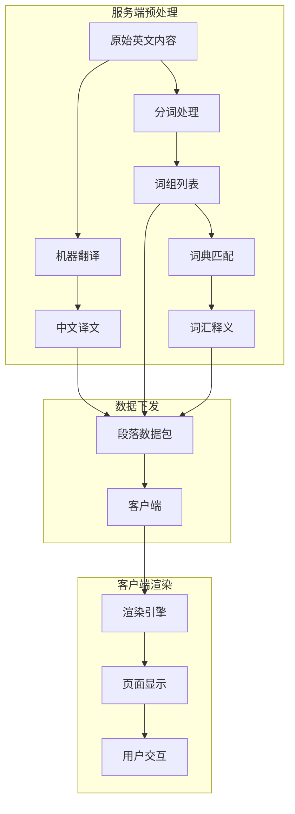

---

## 数据结构设计

### 章节数据结构

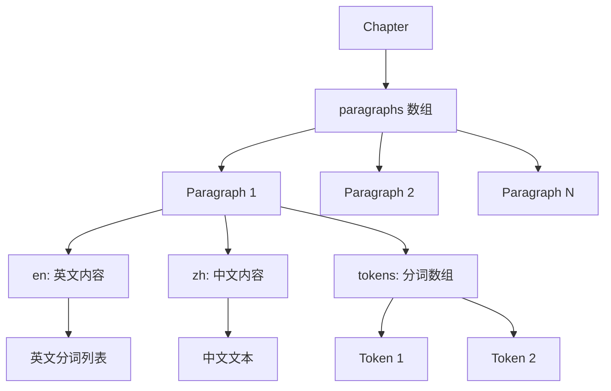

### 段落数据模型

| 字段 | 类型 | 说明 |
| ---- | ---- | ---- |
| id | String | 段落唯一标识 |
| en | TokenizedContent | 英文内容（含分词） |
| zh | String | 中文译文 |
| type | Enum | 段落类型（正文/标题/引用等） |

### 分词内容结构（TokenizedContent）

| 字段 | 类型 | 说明 |
| ---- | ---- | ---- |
| raw | String | 原始文本 |
| tokens | Token[] | 分词后的词组数组 |

### 词组数据模型（Token）

| 字段 | 类型 | 说明 |
| ---- | ---- | ---- |
| id | String | 词组唯一标识 |
| text | String | 词组文本 |
| start | Number | 在原文中的起始位置 |
| end | Number | 在原文中的结束位置 |
| type | Enum | 类型（word/phrase/punctuation） |
| vocab_id | String | 关联词汇表 ID（可选） |

### 词汇释义数据模型（Vocabulary）

| 字段 | 类型 | 说明 |
| ---- | ---- | ---- |
| id | String | 词汇唯一标识 |
| word | String | 词汇原形 |
| phonetic | String | 音标 |
| audio_url | String | 发音音频（预缓存） |
| definitions | Definition[] | 释义列表 |
| examples | Example[] | 例句列表 |

### 释义数据模型（Definition）

| 字段 | 类型 | 说明 |
| ---- | ---- | ---- |
| pos | String | 词性（n./v./adj. 等） |
| en | String | 英文释义 |
| zh | String | 中文释义 |

---

## 数据层级关系

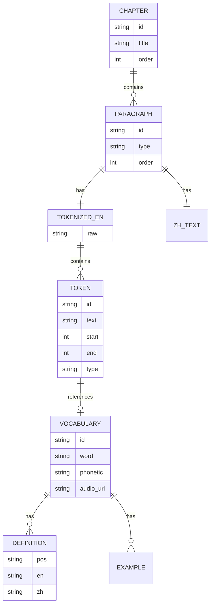

---

## 语言切换机制

### 切换流程

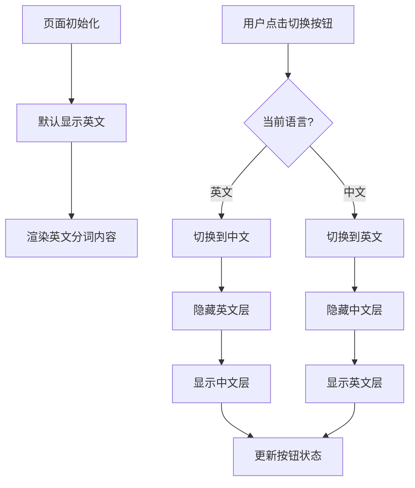

### 语言状态管理

| 状态 | 值 | 说明 |
| ---- | -- | ---- |
| currentLanguage | 'en' / 'zh' | 当前显示语言 |
| defaultLanguage | 'en' | 默认语言（英文） |

### 切换按钮设计

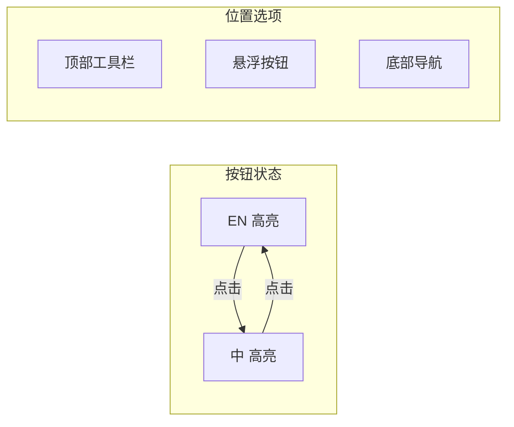

---

## 段落渲染机制

### 双层渲染结构

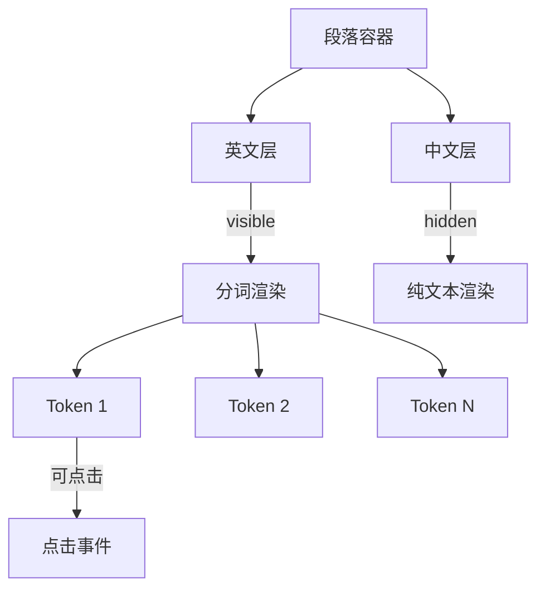

### 渲染层级

| 层级 | 内容 | 默认状态 | 交互性 |
| ---- | ---- | -------- | ------ |
| 英文层 | 分词后的可点击文本 | 显示 | 支持点击查词 |
| 中文层 | 翻译文本 | 隐藏 | 纯展示 |

### 段落渲染流程

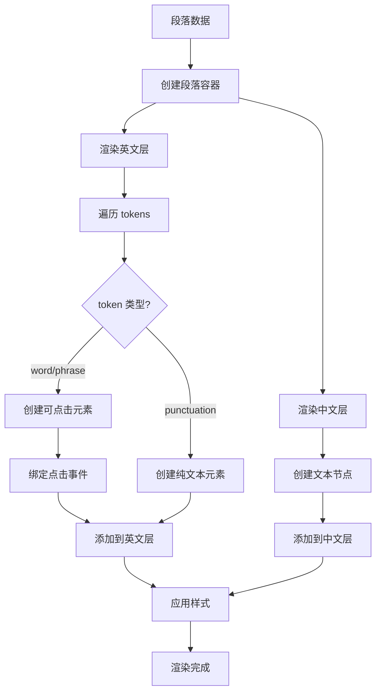

---

## 分词与词汇交互

### 分词预处理流程

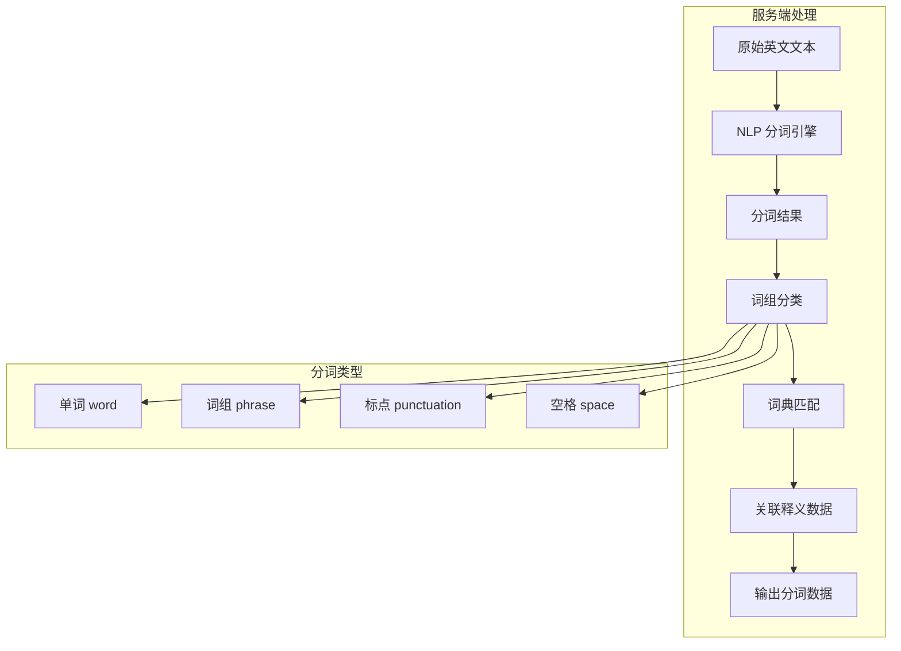

### 词组类型

| 类型 | 说明 | 可点击 | 示例 |
| ---- | ---- | ------ | ---- |
| word | 独立单词 | 是 | "beautiful" |
| phrase | 固定词组/短语 | 是 | "look forward to" |
| punctuation | 标点符号 | 否 | "." "," "!" |
| space | 空格 | 否 | " " |

### 点击查词流程

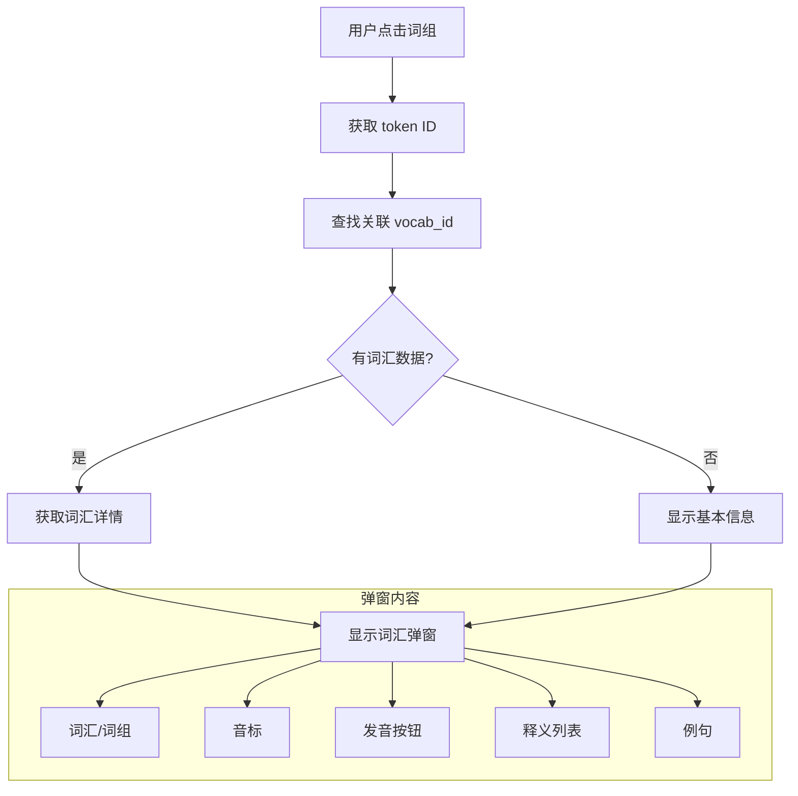

### 词汇弹窗设计

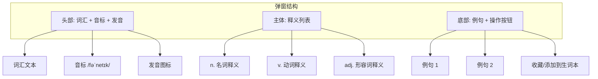

### 弹窗交互

| 触发方式 | 行为 |
| -------- | ---- |
| 点击词组 | 显示弹窗 |
| 点击弹窗外部 | 关闭弹窗 |
| 点击发音图标 | 播放音频 |
| 点击收藏按钮 | 添加到生词本 |
| 滑动页面 | 关闭弹窗 |

---

## 数据下发策略

### 下发时机

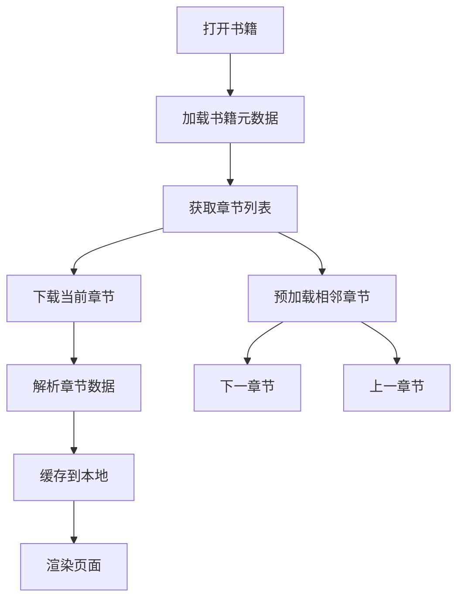

### 数据包结构

| 组件 | 包含内容 | 说明 |
| ---- | -------- | ---- |
| 章节内容包 | 段落数组（含双语、分词） | 章节主体数据 |
| 词汇表包 | 该章节涉及的所有词汇释义 | 去重后的词汇数据 |
| 音频资源包 | 词汇发音音频文件 | 可选下载 |

### 缓存策略

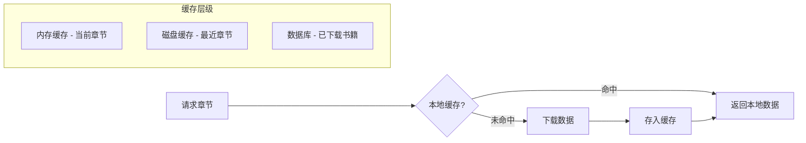

---

## 渲染性能优化

### 虚拟化渲染

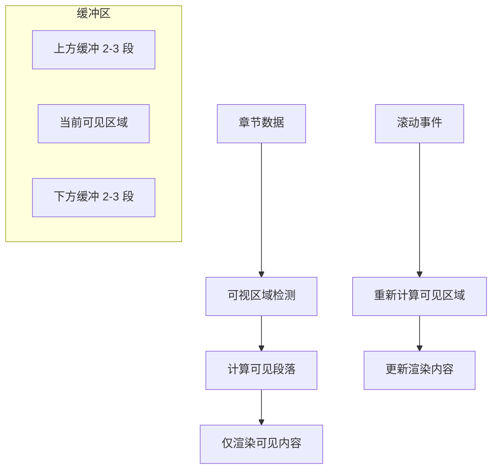

### 渲染优化策略

| 策略 | 说明 | 效果 |
| ---- | ---- | ---- |
| 懒加载 | 仅渲染可视区域段落 | 减少初始渲染时间 |
| 缓冲区 | 预渲染上下相邻段落 | 平滑滚动体验 |
| 复用 DOM | 滚动时复用段落容器 | 减少 DOM 操作 |
| 分批渲染 | 大章节分批次渲染 | 避免主线程阻塞 |

---

## 用户交互状态

### 状态管理

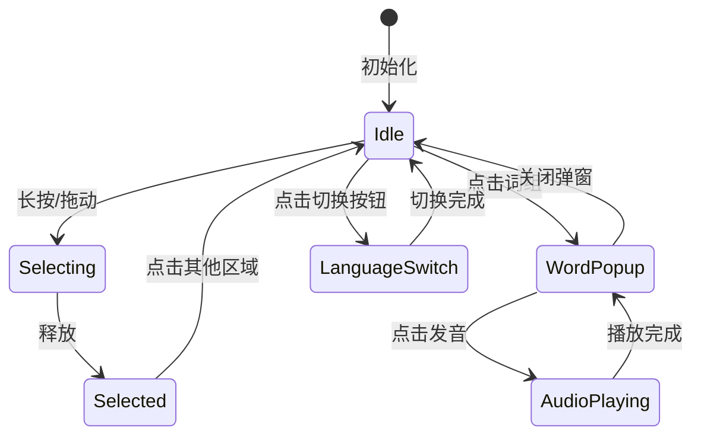

### 状态定义

| 状态 | 说明 | 可执行操作 |
| ---- | ---- | ---------- |
| Idle | 空闲状态 | 点击词组、切换语言、滚动 |
| WordPopup | 词汇弹窗显示中 | 播放发音、收藏、关闭 |
| AudioPlaying | 音频播放中 | 停止播放 |
| LanguageSwitch | 语言切换动画中 | 等待完成 |

---

## 完整数据流

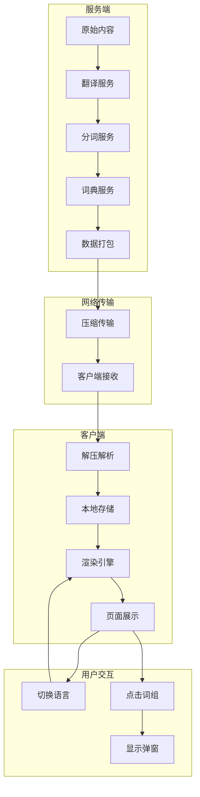

---

## 总结

双语阅读功能的核心设计原则：

| 原则 | 实现方式 |
| ---- | -------- |
| 预处理优先 | 翻译、分词、词汇匹配全部服务端完成 |
| 离线可用 | 数据预下发并缓存，无需实时请求 |
| 即时响应 | 语言切换和词汇查询均为本地操作 |
| 性能优先 | 虚拟化渲染、DOM 复用、分批处理 |

