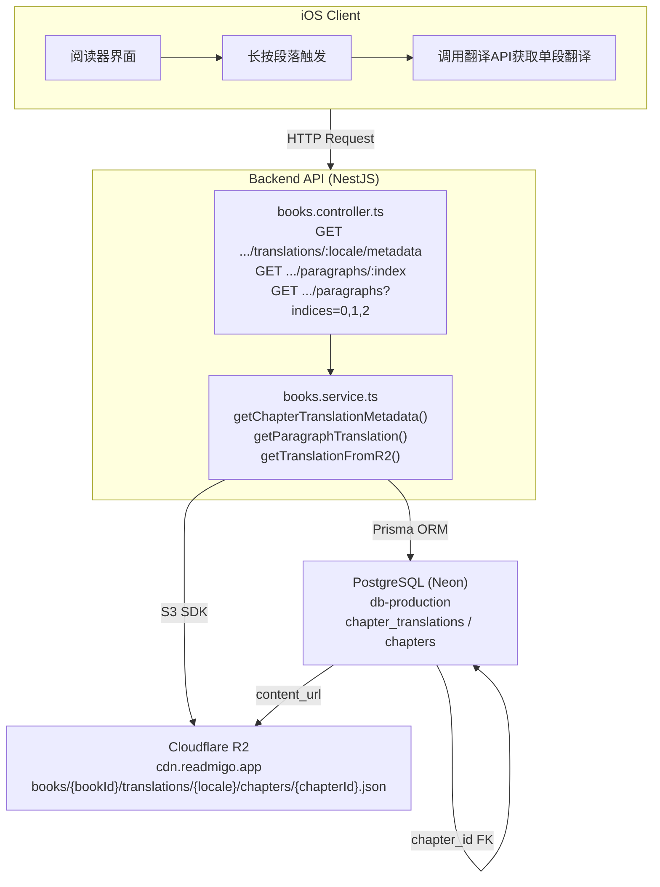
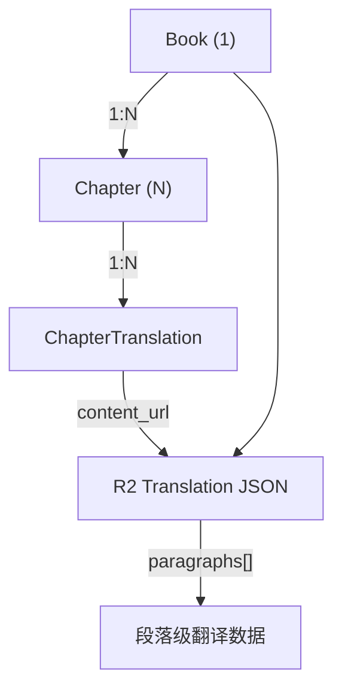
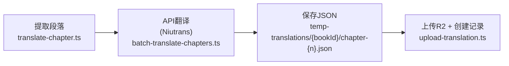

# 章节翻译功能架构

## 整体数据流



## 组件关系

| 组件 | 说明 | 位置 |
|------|------|------|
| **Chapter (章节)** | 原始英文章节内容 | R2: `books/{bookId}/chapters/{chapterId}.html` |
| **ChapterTranslation (翻译记录)** | 翻译元数据索引 | PostgreSQL: `chapter_translations` 表 |
| **Translation JSON (翻译文件)** | 实际翻译内容 | R2: `books/{bookId}/translations/{locale}/chapters/{chapterId}.json` |
| **API** | 懒加载翻译服务 | Backend: `books.controller.ts` + `books.service.ts` |
| **Client** | iOS阅读器 | 长按段落时调用API |

## 数据关系



## 数据库模型

### ChapterTranslation

## R2 存储结构

```
readmigo-production/
└── books/
    └── {bookId}/
        ├── chapters/
        │   └── {chapterId}.html          # 原始章节HTML
        └── translations/
            └── {locale}/                  # e.g., zh-Hans
                └── chapters/
                    └── {chapterId}.json   # 翻译JSON
```

## 翻译JSON格式

## API 端点

### 获取翻译元数据

```
GET /api/v1/books/:bookId/chapters/:chapterId/translations/:locale/metadata

Response:
{
  "chapterId": "32f4913d-6389-4590-aba8-863360927165",
  "locale": "zh-Hans",
  "paragraphCount": 43,
  "status": "published",
  "translatedAt": "2026-02-04T18:15:00Z"
}
```

### 获取单段翻译（懒加载）

```
GET /api/v1/books/:bookId/chapters/:chapterId/translations/:locale/paragraphs/:index

Response:
{
  "chapterId": "32f4913d-6389-4590-aba8-863360927165",
  "locale": "zh-Hans",
  "paragraphIndex": 0,
  "original": "It was four o'clock when the ceremony was over...",
  "translation": "仪式结束时已是下午四点..."
}
```

### 批量获取翻译

```
GET /api/v1/books/:bookId/chapters/:chapterId/translations/:locale/paragraphs?indices=0,1,2

Response:
[
  { "paragraphIndex": 0, "original": "...", "translation": "..." },
  { "paragraphIndex": 1, "original": "...", "translation": "..." },
  { "paragraphIndex": 2, "original": "...", "translation": "..." }
]
```

## 翻译工作流



## 相关文件

| 文件 | 用途 |
|------|------|
| `packages/database/prisma/schema.prisma` | ChapterTranslation 数据模型 |
| `src/modules/books/books.controller.ts` | 翻译API端点定义 |
| `src/modules/books/books.service.ts` | 翻译业务逻辑 |
| `src/scripts/batch-translate-chapters.ts` | 批量翻译脚本 |
| `src/scripts/upload-translation.ts` | 上传翻译到R2 |
| `docs/translation-workflow.md` | 翻译工作流程文档 |

## 支持的翻译服务

| 服务 | Provider值 | 免费额度 | 特点 |
|------|-----------|---------|------|
| 小牛翻译 | `niutrans` | 600万字符/月 | 性价比最高 |
| DeepL | `deepl` | 50万字符/月 | 翻译质量最佳 |
| OpenAI | `openai` | 无 | 可自定义风格 |
