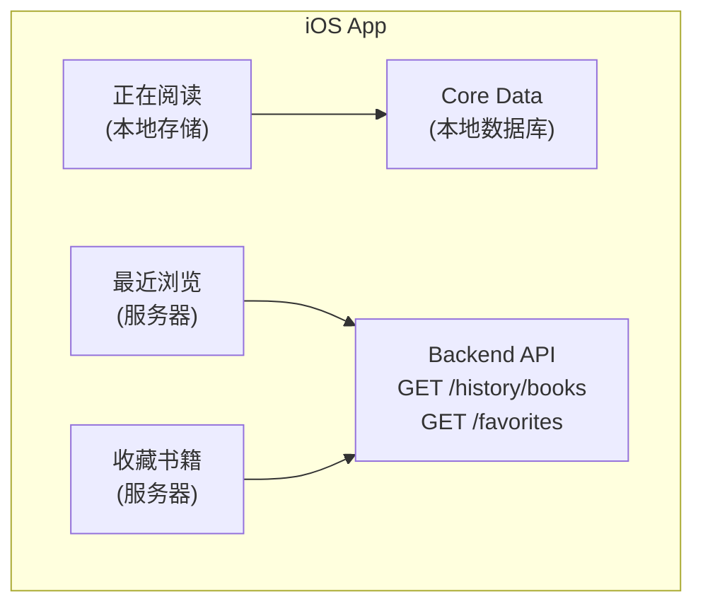
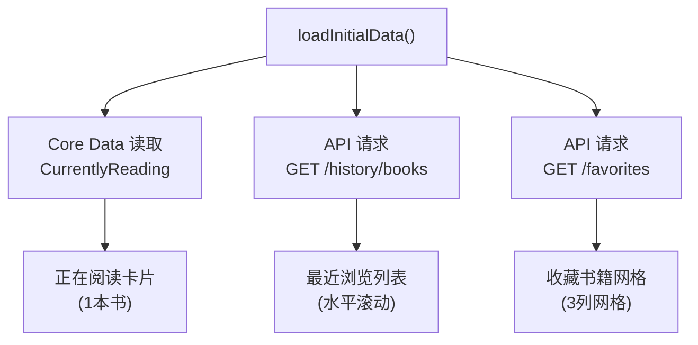
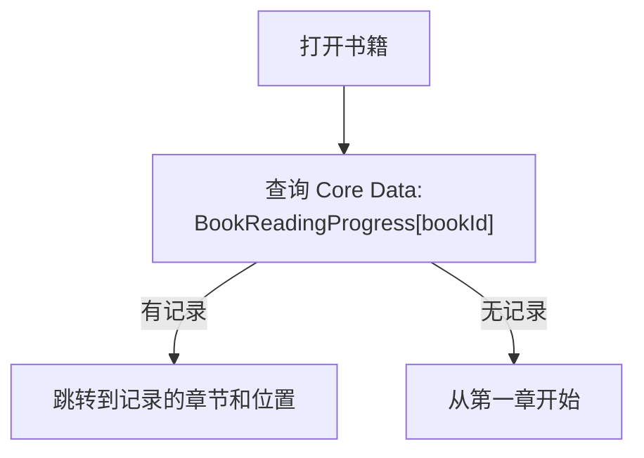
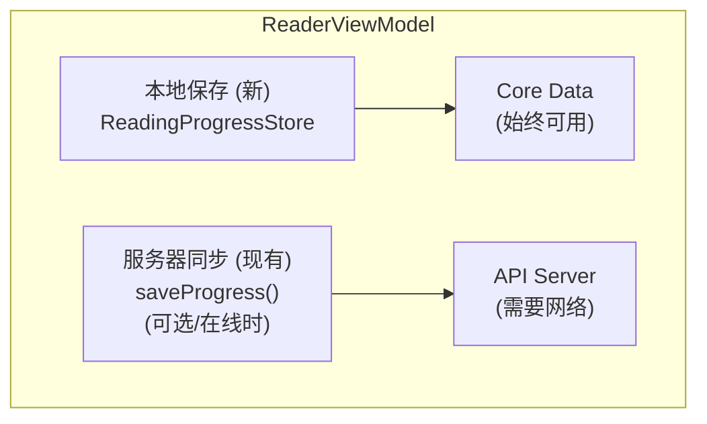

# "正在阅读" 数据流文档

## 架构概览



---

## 1. 数据存储分类

| 数据类型 | 存储位置 | 说明 |
|----------|----------|------|
| 正在阅读 | 📱 本地 (Core Data) | 只存储一本书，新阅读会替换旧的 |
| 阅读进度 | 📱 本地 (Core Data) | 所有书籍的阅读位置都在本地 |
| 最近浏览 | ☁️ 服务器 | `GET /history/books` |
| 收藏书籍 | ☁️ 服务器 | `GET /favorites` |

---

## 2. 现有基础设施

| 组件 | 文件 | 说明 |
|-----|------|-----|
| BookmarkManager | `Core/Services/BookmarkManager.swift` | 已有 UserDefaults 存储机制 |
| ReadingPosition | `Core/Models/Bookmark.swift` | 已定义位置模型 |
| ReaderViewModel | `Features/Reader/ReaderViewModel.swift` | 阅读器状态管理 |

---

## 3. 本地存储: 正在阅读 + 阅读进度

### 数据结构

```
CurrentlyReading (Core Data Entity)
├── bookId: String
├── bookJson: Data           // Book 对象序列化存储
├── currentChapter: Int
├── scrollPosition: Double   // 0.0 - 1.0
└── lastReadAt: Date

BookReadingProgress (Core Data Entity)
├── bookId: String (Primary Key)
├── chapterId: String
├── currentChapter: Int
├── scrollPosition: Double   // 0.0 - 1.0
├── currentPage: Int
├── totalPages: Int
└── lastReadAt: Date
```

### 存储方案: Core Data

```
┌─────────────────────────────────────────────────────────────────────────────────────────────┐
│ Core Data 存储方案                                                                           │
├─────────────────────────────────────────────────────────────────────────────────────────────┤
│                                                                                             │
│ Entity: CurrentlyReading                                                                    │
│   - 只存储一条记录，表示当前正在阅读的书                                                       │
│   - 新阅读会替换旧记录                                                                       │
│                                                                                             │
│ Entity: BookReadingProgress                                                                 │
│   - 每本书一条记录                                                                           │
│   - bookId 作为主键                                                                         │
│   - 支持复杂查询和索引                                                                       │
│                                                                                             │
└─────────────────────────────────────────────────────────────────────────────────────────────┘
```

---

## 4. 数据流: 写入

### 场景 A: 用户开始阅读一本书

```
┌─────────────────────────────────────────────────────────────────────────────────────────────┐
│ 用户点击 "开始阅读" 或点击 "正在阅读" 卡片                                                    │
│           │                                                                                 │
│           ▼                                                                                 │
│ 打开阅读器 (EnhancedReaderView)                                                              │
│           │                                                                                 │
│           ▼                                                                                 │
│ 从 Core Data 加载该书的阅读进度 (如果有)                                                      │
│   - currentChapter                                                                         │
│   - scrollPosition                                                                         │
│           │                                                                                 │
│           ▼                                                                                 │
│ 恢复到上次阅读位置                                                                           │
└─────────────────────────────────────────────────────────────────────────────────────────────┘
```

### 场景 B: 用户阅读过程中 (滑动页面) [暂不实现]

```
┌─────────────────────────────────────────────────────────────────────────────────────────────┐
│ 用户滑动页面                                                                                │
│           │                                                                                 │
│           ▼                                                                                 │
│ 📱 本地更新: currentChapter, scrollPosition                                                │
│   (防抖: 2秒内只保存一次)                                                                    │
│           │                                                                                 │
│           ▼                                                                                 │
│ 📱 更新 "正在阅读" 为当前书籍                                                                │
│   (替换之前的 "正在阅读")                                                                    │
└─────────────────────────────────────────────────────────────────────────────────────────────┘
```

### 场景 C: 关闭阅读器

```
┌─────────────────────────────────────────────────────────────────────────────────────────────┐
│ 用户关闭阅读器                                                                              │
│           │                                                                                 │
│           ▼                                                                                 │
│ 📱 保存最终阅读位置到 Core Data                                                              │
│   - BookReadingProgress[bookId]                                                            │
│   - CurrentlyReading = 当前书籍                                                             │
│           │                                                                                 │
│           ▼                                                                                 │
│ ☁️ API: POST /reading/sessions (可选: 记录阅读时长统计)                                     │
└─────────────────────────────────────────────────────────────────────────────────────────────┘
```

### 保存时机

| 时机 | 状态 | 说明 |
|-----|------|------|
| 退出阅读器 | ✅ 支持 | 用户主动关闭阅读界面 |
| App 进入后台 | ✅ 支持 | 防止意外关闭导致进度丢失 |
| 翻页 | ⏳ 暂不实现 | 用户明确的位置变更 |
| 章节切换 | ⏳ 暂不实现 | 重要位置节点 |
| 滚动停止 | ⏳ 暂不实现 | 需防抖处理避免频繁写入 |

---

## 5. 数据流: 读取

### 书架 Tab 加载



### 恢复阅读位置



### API 调用频率

| 触发时机 | 数据源 | 说明 |
|----------|--------|------|
| LibraryView 加载 | 📱 Core Data | 读取 "正在阅读" |
| LibraryView 加载 | ☁️ `GET /history/books` | 最近浏览 |
| LibraryView 加载 | ☁️ `GET /favorites` | 收藏书籍 |

---

## 6. 性能优化策略

| 优化点 | 方案 |
|-------|------|
| 写入频率 | 仅在退出/后台时写入，最小化IO |
| 存储大小 | 只存必要字段（约100字节/书） |
| 存储介质 | Core Data（支持索引和高效查询） |
| 读取性能 | 内存缓存 + 按需加载 |
| 存储上限 | 最多保留100本书的记录，LRU淘汰 |

---

## 7. 与现有系统的关系



---

## 8. 展示逻辑

### 正在阅读卡片

```
┌─────────────────────────────────────────────────────────────────────────────────────────────┐
│ 展示条件:                                                                                    │
│   ✓ Core Data 中的 CurrentlyReading 不为空                                                   │
│                                                                                             │
│ 点击行为:                                                                                    │
│   → 点击热区: 整个卡片                                                                       │
│   → 直接打开阅读器 (EnhancedReaderView)                                                      │
│   → 自动恢复到上次阅读位置 (chapter + scrollPosition)                                        │
│                                                                                             │
│ 更新规则:                                                                                    │
│   → 任何书籍被阅读后，都会成为新的 "正在阅读"                                                 │
│   → 只保留最近阅读的一本书                                                                   │
└─────────────────────────────────────────────────────────────────────────────────────────────┘
```

### 卡片设计

```
┌─────────────────────────────────────────────────────────────────────────────────────────────┐
│ 正在阅读                                             ← 点击热区: 整个卡片                    │
├─────────────────────────────────────────────────────────────────────────────────────────────┤
│ ┌────────┐  三体                                                                            │
│ │ Cover  │  刘慈欣                                                                          │
│ │        │                                                                                  │
│ │        │  第 3 章 / 共 15 章                                                              │
│ └────────┘  ═══════════════░░░░░░░░░░                                                       │
│                                                                                             │
│             [继续阅读]  ← 点击打开阅读器，恢复位置                                            │
└─────────────────────────────────────────────────────────────────────────────────────────────┘
```

---

## 9. 实现要点

### 需要创建的文件

| 文件 | 用途 |
|------|------|
| `ReadingProgressStore.swift` | Core Data 本地存储管理器 |
| `ReadingProgress.xcdatamodeld` | Core Data 模型定义 |

### ReadingProgressStore 接口设计

```
@MainActor
class ReadingProgressStore: ObservableObject {
    static let shared = ReadingProgressStore()

    @Published var currentlyReading: CurrentlyReading?

    // 获取当前阅读的书
    func getCurrentlyReading() -> CurrentlyReading?

    // 更新正在阅读 (阅读任何书时调用)
    func setCurrentlyReading(book: Book, chapter: Int, position: Double)

    // 获取某本书的阅读进度
    func getProgress(for bookId: String) -> BookReadingProgress?

    // 保存阅读进度
    func saveProgress(bookId: String, chapter: Int, position: Double)
}
```

### 实现步骤

| 步骤 | 内容 |
|-----|------|
| 1 | 创建 Core Data 模型 `ReadingProgress.xcdatamodeld` |
| 2 | 创建 `ReadingProgressStore` 单例类 |
| 3 | 在 `ReaderViewModel` 中集成本地保存逻辑 |
| 4 | 在打开书籍时恢复阅读位置 |
| 5 | 添加 App 生命周期监听（进入后台时保存） |

### 需要修改的文件

| 文件 | 修改内容 |
|------|----------|
| `LibraryView.swift` | 从 Core Data 读取 "正在阅读"，点击整个卡片直接打开阅读器 |
| `ReaderViewModel.swift` | 保存/恢复阅读进度到 Core Data |
| `BookDetailView.swift` | 移除 API addToLibrary 调用 (开始阅读时) |
| `EnhancedReaderView.swift` | 监听退出事件，保存进度 |

---

## 10. 数据迁移说明

当前 `user_books` 表中的以下字段将不再使用:
- `current_chapter` → 迁移到本地 Core Data
- `progress_percent` → 迁移到本地 Core Data
- `status` → "READING" 状态由本地 CurrentlyReading 决定

服务器端 `user_books` 表仅用于:
- 记录用户曾经阅读过的书籍 (历史记录)
- 阅读时长统计 (`total_reading_minutes`)
