# EPUB 格式实现原理

## 概述

EPUB（Electronic Publication）是一种开放的电子书标准格式，由国际数字出版论坛（IDPF）制定。本文档详细介绍 EPUB 格式的技术实现原理。

---

## 文件结构

### EPUB 本质

EPUB 文件本质上是一个 **ZIP 压缩包**，文件扩展名为 `.epub`。

### 目录结构

```text
book.epub (ZIP Archive)
├── mimetype                    # MIME 类型声明
├── META-INF/
│   ├── container.xml          # 容器文件（入口点）
│   └── encryption.xml         # 加密信息（可选）
├── OEBPS/                     # 内容目录（名称可自定义）
│   ├── content.opf            # 包文件（Package Document）
│   ├── toc.ncx                # 导航控制文件（EPUB 2）
│   ├── nav.xhtml              # 导航文档（EPUB 3）
│   ├── chapter1.xhtml         # 内容文件
│   ├── chapter2.xhtml
│   ├── styles/
│   │   └── stylesheet.css     # 样式文件
│   ├── images/
│   │   ├── cover.jpg          # 封面图片
│   │   └── figure1.png
│   └── fonts/
│       └── custom.otf         # 嵌入字体
```

---

## 核心组件详解

### 1. mimetype 文件

| 属性 | 说明 |
|------|------|
| 位置 | ZIP 包的第一个文件 |
| 内容 | `application/epub+zip` |
| 压缩 | 必须不压缩（store 模式） |
| 偏移 | 必须从字节 0 开始 |

### 2. container.xml

容器文件定义了包文件（OPF）的位置，是 EPUB 的入口点。

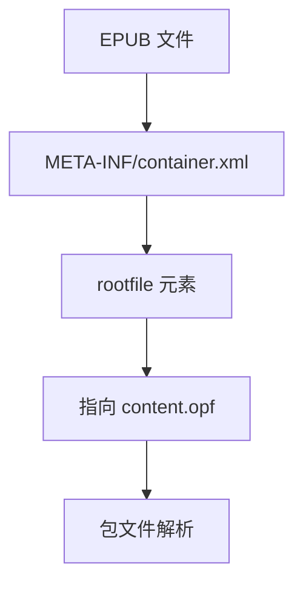
```mermaid
flowchart TD
    A[EPUB 文件] --> B[META-INF/container.xml]
    B --> C[rootfile 元素]
    C --> D[指向 content.opf]
    D --> E[包文件解析]
```

### 3. 包文件（OPF）结构

OPF 文件是 EPUB 的核心，包含四个主要部分：

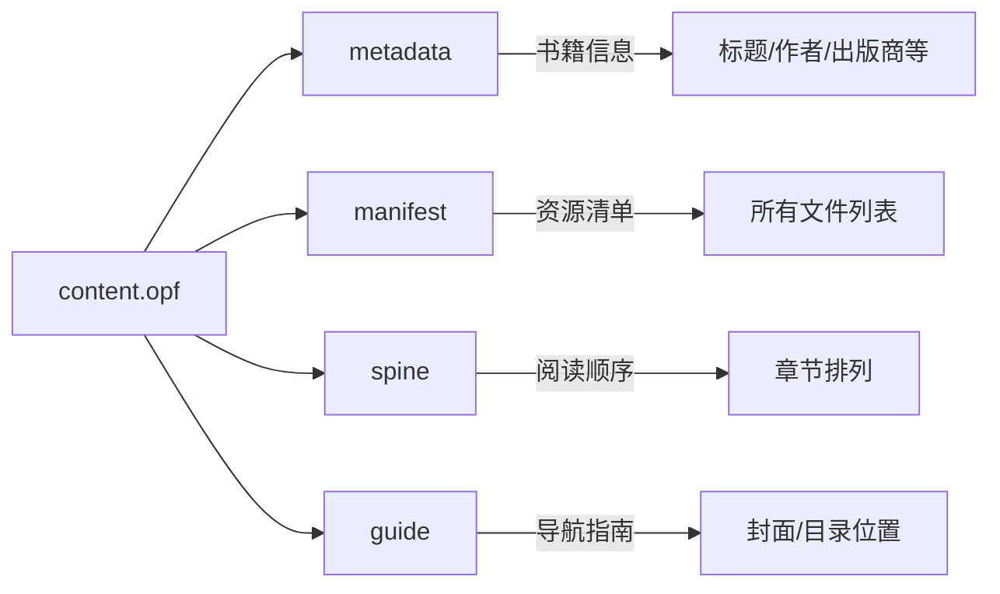
```mermaid
flowchart LR
    OPF[content.opf] --> M[metadata]
    OPF --> MA[manifest]
    OPF --> S[spine]
    OPF --> G[guide]

    M --> |书籍信息| M1[标题/作者/出版商等]
    MA --> |资源清单| MA1[所有文件列表]
    S --> |阅读顺序| S1[章节排列]
    G --> |导航指南| G1[封面/目录位置]
```

#### metadata（元数据）

| 元素 | 说明 | 必需 |
|------|------|------|
| dc:title | 书籍标题 | 是 |
| dc:identifier | 唯一标识符（ISBN/UUID） | 是 |
| dc:language | 语言代码 | 是 |
| dc:creator | 作者 | 否 |
| dc:publisher | 出版商 | 否 |
| dc:date | 出版日期 | 否 |
| dc:description | 书籍描述 | 否 |
| dc:subject | 主题/分类 | 否 |
| dc:rights | 版权信息 | 否 |

#### manifest（清单）

清单列出 EPUB 中的所有资源文件：

| 属性 | 说明 |
|------|------|
| id | 资源的唯一标识 |
| href | 资源的相对路径 |
| media-type | MIME 类型 |
| properties | 特殊属性（如 nav、cover-image） |

#### spine（书脊）

定义内容的阅读顺序：

| 属性 | 说明 |
|------|------|
| idref | 引用 manifest 中的 id |
| linear | yes/no，是否为主要内容 |

---

## EPUB 2 与 EPUB 3 对比

| 特性 | EPUB 2 | EPUB 3 |
|------|--------|--------|
| 发布年份 | 2007 | 2011 |
| 内容格式 | XHTML 1.1 | XHTML 5 |
| 样式 | CSS 2.1 | CSS 3 |
| 导航 | NCX (toc.ncx) | Navigation Document (nav.xhtml) |
| 脚本 | 不支持 | JavaScript 支持 |
| 音视频 | 不支持 | 原生支持 |
| MathML | 不支持 | 支持 |
| SVG | 有限支持 | 完整支持 |
| 语义化 | 有限 | epub:type 属性 |
| 媒体覆盖 | 不支持 | 支持（音频同步） |
| 固定布局 | 不支持 | 支持 |

---

## 导航系统

### EPUB 2: NCX 文件

NCX（Navigation Center eXtended）使用 XML 格式定义目录结构：

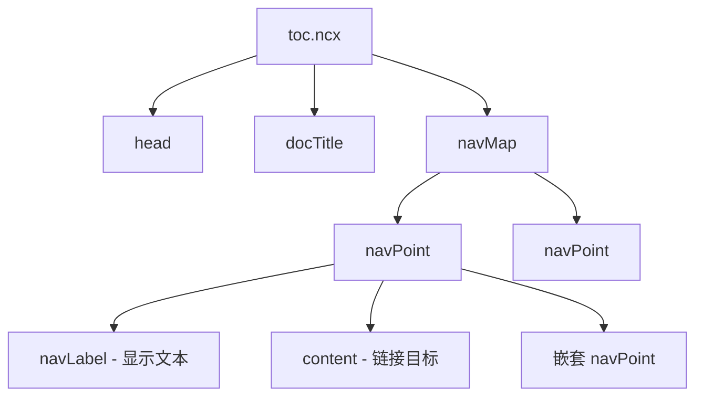
```mermaid
flowchart TD
    NCX[toc.ncx] --> HEAD[head]
    NCX --> TITLE[docTitle]
    NCX --> MAP[navMap]

    MAP --> NP1[navPoint]
    MAP --> NP2[navPoint]

    NP1 --> L1[navLabel - 显示文本]
    NP1 --> C1[content - 链接目标]
    NP1 --> NP1_1[嵌套 navPoint]
```

### EPUB 3: Navigation Document

使用 XHTML5 格式，更加语义化：

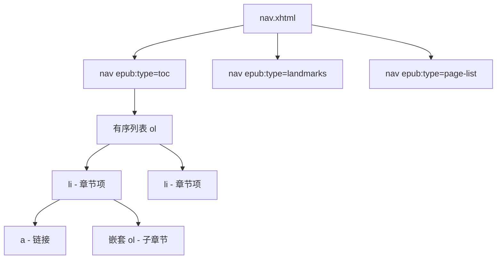
```mermaid
flowchart TD
    NAV[nav.xhtml] --> TOC[nav epub:type=toc]
    NAV --> LAND[nav epub:type=landmarks]
    NAV --> PAGE[nav epub:type=page-list]

    TOC --> OL[有序列表 ol]
    OL --> LI1[li - 章节项]
    OL --> LI2[li - 章节项]

    LI1 --> A1[a - 链接]
    LI1 --> OL1[嵌套 ol - 子章节]
```

---

## 内容文档

### 支持的 MIME 类型

| 类型 | MIME Type | 说明 |
|------|-----------|------|
| XHTML | application/xhtml+xml | 主要内容格式 |
| CSS | text/css | 样式表 |
| PNG | image/png | 图片 |
| JPEG | image/jpeg | 图片 |
| GIF | image/gif | 图片 |
| SVG | image/svg+xml | 矢量图 |
| OpenType | application/vnd.ms-opentype | 字体 |
| WOFF | application/font-woff | Web 字体 |
| SMIL | application/smil+xml | 媒体覆盖 |
| JavaScript | text/javascript | 脚本（EPUB 3） |
| MP3 | audio/mpeg | 音频（EPUB 3） |
| MP4 | video/mp4 | 视频（EPUB 3） |

---

## 解析流程

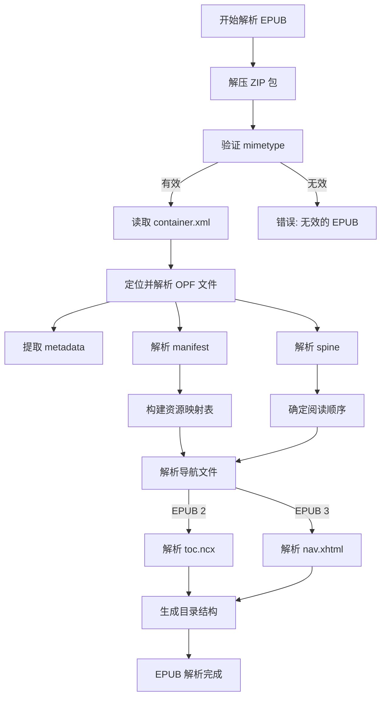
```mermaid
flowchart TD
    START[开始解析 EPUB] --> UNZIP[解压 ZIP 包]
    UNZIP --> CHECK[验证 mimetype]
    CHECK --> |有效| CONTAINER[读取 container.xml]
    CHECK --> |无效| ERROR1[错误: 无效的 EPUB]

    CONTAINER --> OPF[定位并解析 OPF 文件]
    OPF --> META[提取 metadata]
    OPF --> MANIFEST[解析 manifest]
    OPF --> SPINE[解析 spine]

    MANIFEST --> BUILD[构建资源映射表]
    SPINE --> ORDER[确定阅读顺序]

    BUILD --> NAV[解析导航文件]
    ORDER --> NAV
    NAV --> |EPUB 2| NCX[解析 toc.ncx]
    NAV --> |EPUB 3| NAVDOC[解析 nav.xhtml]

    NCX --> TOC[生成目录结构]
    NAVDOC --> TOC

    TOC --> READY[EPUB 解析完成]
```

---

## 渲染流程

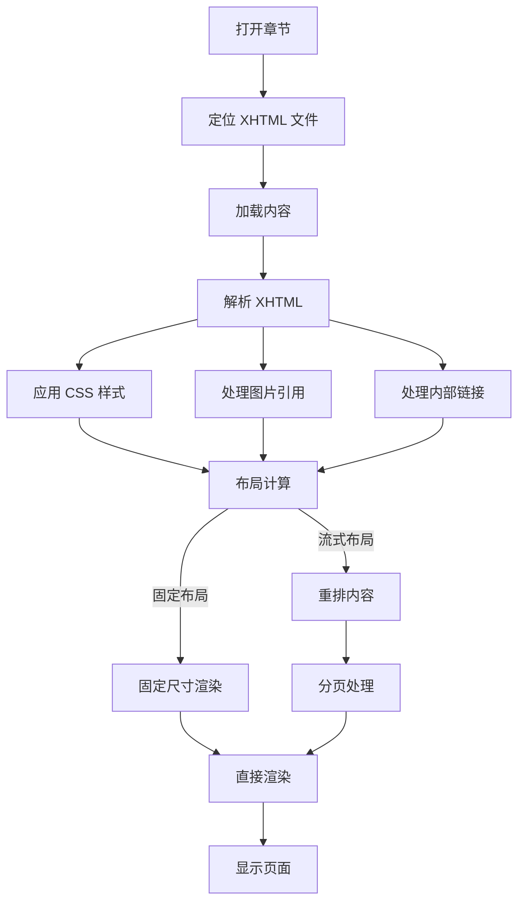
```mermaid
flowchart TD
    OPEN[打开章节] --> LOCATE[定位 XHTML 文件]
    LOCATE --> LOAD[加载内容]
    LOAD --> PARSE[解析 XHTML]

    PARSE --> CSS[应用 CSS 样式]
    PARSE --> IMG[处理图片引用]
    PARSE --> LINK[处理内部链接]

    CSS --> LAYOUT[布局计算]
    IMG --> LAYOUT
    LINK --> LAYOUT

    LAYOUT --> |流式布局| REFLOW[重排内容]
    LAYOUT --> |固定布局| FIXED[固定尺寸渲染]

    REFLOW --> PAGE[分页处理]
    FIXED --> RENDER[直接渲染]

    PAGE --> RENDER
    RENDER --> DISPLAY[显示页面]
```

---

## 章节内容详解

### 章节文档结构

每个章节是一个独立的 XHTML 文档，包含以下层次结构：

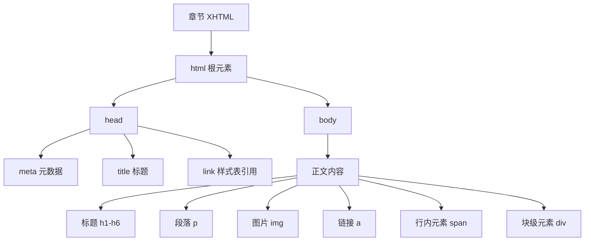
```mermaid
flowchart TD
    CHAPTER[章节 XHTML] --> HTML[html 根元素]
    HTML --> HEAD[head]
    HTML --> BODY[body]

    HEAD --> META[meta 元数据]
    HEAD --> TITLE[title 标题]
    HEAD --> LINK[link 样式表引用]

    BODY --> CONTENT[正文内容]
    CONTENT --> H1[标题 h1-h6]
    CONTENT --> P[段落 p]
    CONTENT --> IMG[图片 img]
    CONTENT --> A[链接 a]
    CONTENT --> SPAN[行内元素 span]
    CONTENT --> DIV[块级元素 div]
```

### 文本节点层次

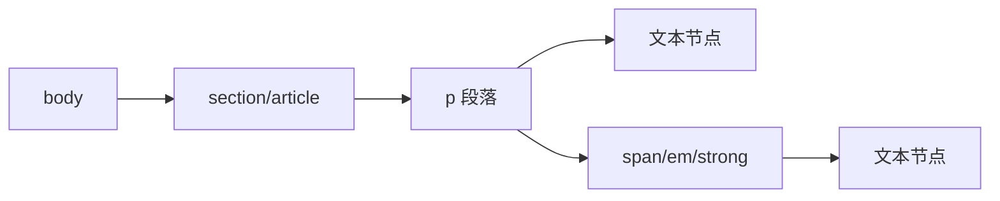
```mermaid
flowchart LR
    BODY[body] --> SECTION[section/article]
    SECTION --> PARA[p 段落]
    PARA --> TEXT[文本节点]
    PARA --> INLINE[span/em/strong]
    INLINE --> TEXT2[文本节点]
```

### DOM 节点定位

| 定位方式 | 说明 | 适用场景 |
| -------- | ---- | -------- |
| CFI (Canonical Fragment Identifier) | EPUB 标准定位格式 | 跨阅读器书签同步 |
| XPath | XML 路径表达式 | 精确节点定位 |
| CSS 选择器 | 样式选择器语法 | 元素样式操作 |
| Range API | DOM 范围对象 | 文本选择与操作 |
| 字符偏移量 | 文本节点内字符位置 | 精确文本定位 |

### CFI 定位原理

CFI（Canonical Fragment Identifier）是 EPUB 3 标准中用于精确定位内容的机制：

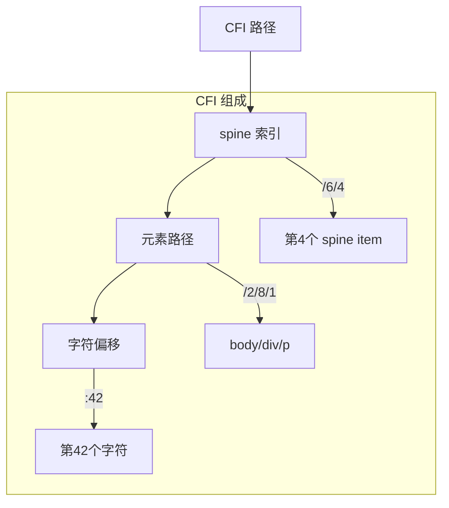
```mermaid
flowchart TD
    CFI[CFI 路径] --> SPINE[spine 索引]
    SPINE --> ELEMENT[元素路径]
    ELEMENT --> OFFSET[字符偏移]

    subgraph CFI 组成
        SPINE --> |/6/4| S1[第4个 spine item]
        ELEMENT --> |/2/8/1| E1[body/div/p]
        OFFSET --> |:42| O1[第42个字符]
    end
```

| CFI 组件 | 格式 | 说明 |
| -------- | ---- | ---- |
| 包路径 | /6/... | 从 package 开始的路径 |
| 元素步进 | /n | 第 n 个子元素（偶数） |
| 文本偏移 | :n | 文本节点中的字符位置 |
| 时间偏移 | ~n | 音视频时间点（秒） |
| 空间偏移 | @x:y | 图片或固定布局坐标 |

---

## 阅读器交互功能

### 交互功能概览

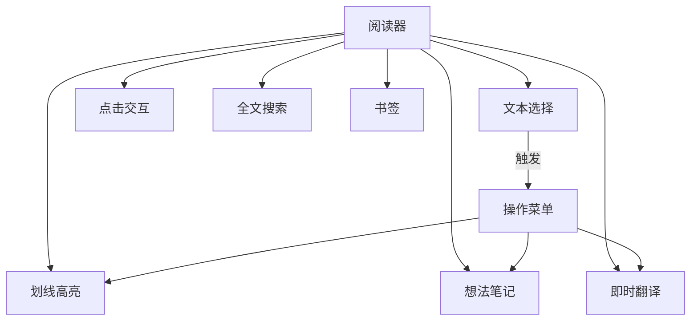
```mermaid
flowchart TD
    READER[阅读器] --> SELECT[文本选择]
    READER --> HIGHLIGHT[划线高亮]
    READER --> NOTE[想法笔记]
    READER --> TAP[点击交互]
    READER --> TRANSLATE[即时翻译]
    READER --> SEARCH[全文搜索]
    READER --> BOOKMARK[书签]

    SELECT --> |触发| MENU[操作菜单]
    MENU --> HIGHLIGHT
    MENU --> NOTE
    MENU --> TRANSLATE
```

---

## 文本选择机制

### 选择流程

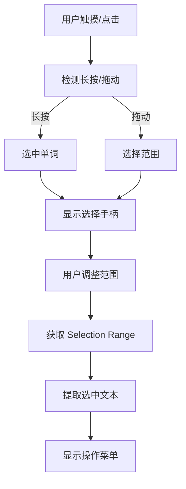
```mermaid
flowchart TD
    START[用户触摸/点击] --> DETECT[检测长按/拖动]
    DETECT --> |长按| WORD[选中单词]
    DETECT --> |拖动| RANGE[选择范围]

    WORD --> HANDLE[显示选择手柄]
    RANGE --> HANDLE

    HANDLE --> ADJUST[用户调整范围]
    ADJUST --> GETRANGE[获取 Selection Range]
    GETRANGE --> EXTRACT[提取选中文本]
    EXTRACT --> MENU[显示操作菜单]
```

### Selection API 工作原理

| 对象 | 说明 | 用途 |
| ---- | ---- | ---- |
| Selection | 用户选择的文本范围 | 获取当前选择状态 |
| Range | 文档片段的抽象 | 表示起点到终点的范围 |
| startContainer | 起始节点 | 选择开始的 DOM 节点 |
| startOffset | 起始偏移 | 节点内的字符位置 |
| endContainer | 结束节点 | 选择结束的 DOM 节点 |
| endOffset | 结束偏移 | 节点内的字符位置 |

### 选择范围数据结构

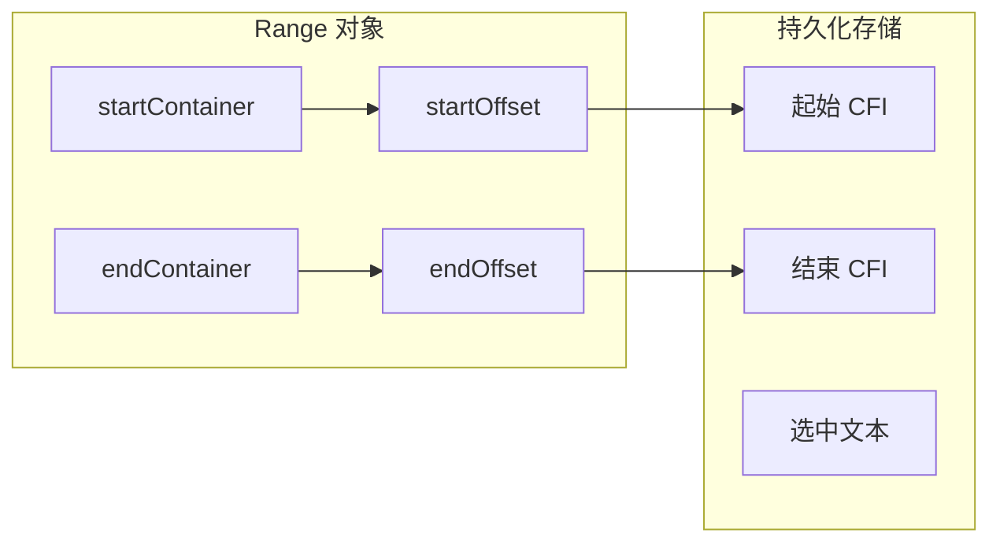
```mermaid
flowchart LR
    subgraph Range 对象
        SC[startContainer] --> SO[startOffset]
        EC[endContainer] --> EO[endOffset]
    end

    subgraph 持久化存储
        CFI_S[起始 CFI]
        CFI_E[结束 CFI]
        TEXT[选中文本]
    end

    SO --> CFI_S
    EO --> CFI_E
```

---

## 划线高亮功能

### 高亮类型

| 类型 | 视觉效果 | 使用场景 |
| ---- | -------- | -------- |
| 黄色高亮 | 黄色背景 | 重要内容标记 |
| 红色下划线 | 红色下划线 | 需要注意的内容 |
| 蓝色高亮 | 蓝色背景 | 引用或定义 |
| 绿色高亮 | 绿色背景 | 个人喜好 |
| 波浪线 | 波浪下划线 | 存疑内容 |

### 高亮实现流程

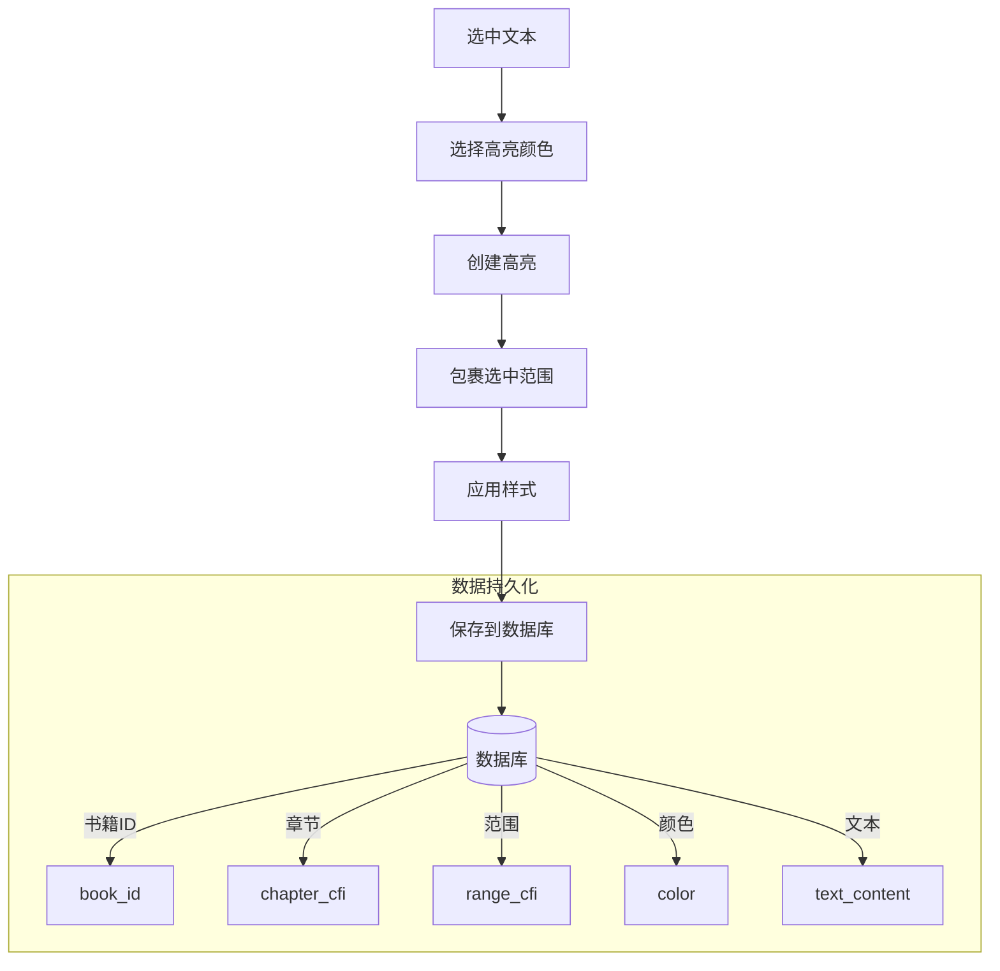
```mermaid
flowchart TD
    SELECT[选中文本] --> CHOOSE[选择高亮颜色]
    CHOOSE --> CREATE[创建高亮]

    CREATE --> WRAP[包裹选中范围]
    WRAP --> STYLE[应用样式]
    STYLE --> SAVE[保存到数据库]

    subgraph 数据持久化
        SAVE --> DB[(数据库)]
        DB --> |书籍ID| B1[book_id]
        DB --> |章节| C1[chapter_cfi]
        DB --> |范围| R1[range_cfi]
        DB --> |颜色| CO1[color]
        DB --> |文本| T1[text_content]
    end
```

### 高亮数据模型

| 字段 | 类型 | 说明 |
| ---- | ---- | ---- |
| id | UUID | 唯一标识 |
| book_id | UUID | 所属书籍 |
| chapter_href | String | 章节文件路径 |
| cfi_range | String | CFI 范围表达式 |
| text | String | 高亮文本内容 |
| color | String | 高亮颜色 |
| style | Enum | 样式类型（背景/下划线/波浪线） |
| created_at | DateTime | 创建时间 |
| updated_at | DateTime | 更新时间 |

### 高亮渲染机制

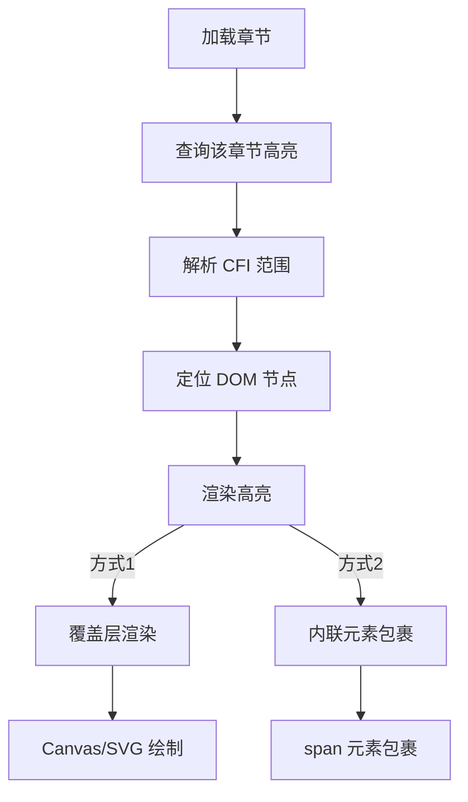
```mermaid
flowchart TD
    LOAD[加载章节] --> QUERY[查询该章节高亮]
    QUERY --> PARSE[解析 CFI 范围]
    PARSE --> LOCATE[定位 DOM 节点]
    LOCATE --> RENDER[渲染高亮]

    RENDER --> |方式1| OVERLAY[覆盖层渲染]
    RENDER --> |方式2| INLINE[内联元素包裹]

    OVERLAY --> CANVAS[Canvas/SVG 绘制]
    INLINE --> SPAN[span 元素包裹]
```

### 渲染方式对比

| 方式 | 优点 | 缺点 |
| ---- | ---- | ---- |
| 覆盖层渲染 | 不修改 DOM 结构 | 需要处理坐标同步 |
| 内联包裹 | 跟随文本重排 | 可能破坏原有结构 |
| 混合方式 | 兼顾两者优点 | 实现复杂度高 |

---

## 想法与笔记功能

### 笔记类型

| 类型 | 说明 | 显示方式 |
| ---- | ---- | -------- |
| 边注 | 关联到特定文本的注释 | 文本旁边图标 |
| 页注 | 整页的笔记 | 页面底部或侧边 |
| 章节笔记 | 章节级别的总结 | 章节末尾 |
| 独立笔记 | 不关联具体位置 | 笔记本视图 |

### 笔记创建流程

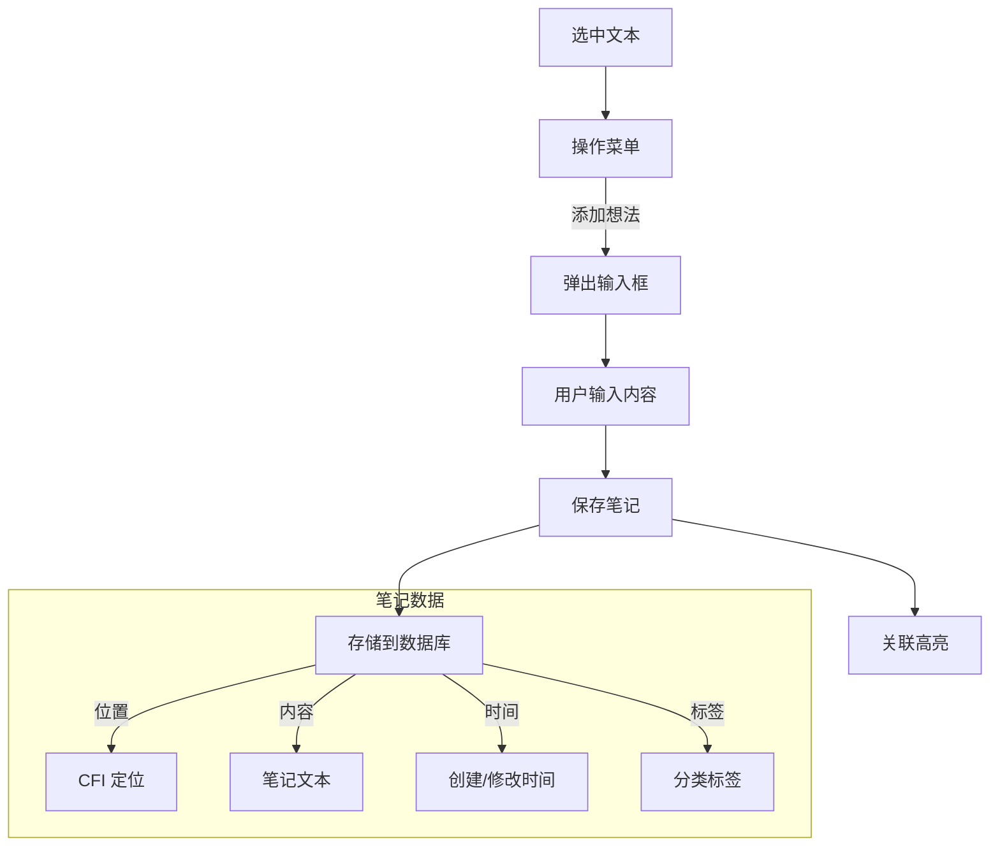
```mermaid
flowchart TD
    SELECT[选中文本] --> MENU[操作菜单]
    MENU --> |添加想法| INPUT[弹出输入框]
    INPUT --> WRITE[用户输入内容]
    WRITE --> SAVE[保存笔记]

    SAVE --> HIGHLIGHT[关联高亮]
    SAVE --> STORE[存储到数据库]

    subgraph 笔记数据
        STORE --> |位置| LOC[CFI 定位]
        STORE --> |内容| CONTENT[笔记文本]
        STORE --> |时间| TIME[创建/修改时间]
        STORE --> |标签| TAG[分类标签]
    end
```

### 笔记数据模型

| 字段 | 类型 | 说明 |
| ---- | ---- | ---- |
| id | UUID | 唯一标识 |
| highlight_id | UUID | 关联的高亮（可选） |
| book_id | UUID | 所属书籍 |
| chapter_href | String | 章节文件路径 |
| cfi | String | CFI 定位 |
| content | Text | 笔记内容 |
| quote | String | 引用的原文 |
| tags | Array | 标签列表 |
| is_private | Boolean | 是否私密 |
| created_at | DateTime | 创建时间 |
| updated_at | DateTime | 更新时间 |

### 笔记显示方式

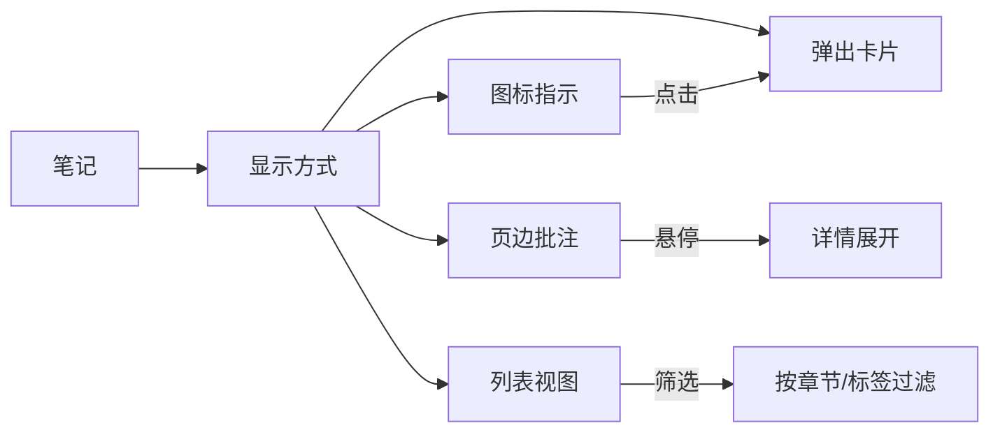
```mermaid
flowchart LR
    NOTE[笔记] --> DISPLAY[显示方式]

    DISPLAY --> ICON[图标指示]
    DISPLAY --> MARGIN[页边批注]
    DISPLAY --> POPUP[弹出卡片]
    DISPLAY --> LIST[列表视图]

    ICON --> |点击| POPUP
    MARGIN --> |悬停| DETAIL[详情展开]
    LIST --> |筛选| FILTER[按章节/标签过滤]
```

---

## 点击交互功能

### 点击事件类型

| 交互类型 | 触发方式 | 响应动作 |
| -------- | -------- | -------- |
| 单击 | 轻触屏幕 | 显示/隐藏工具栏 |
| 双击 | 快速双击 | 选中单词/段落 |
| 长按 | 按住不动 | 显示上下文菜单 |
| 滑动 | 左右滑动 | 翻页 |
| 双指缩放 | 捏合手势 | 调整字体大小 |

### 点击区域划分

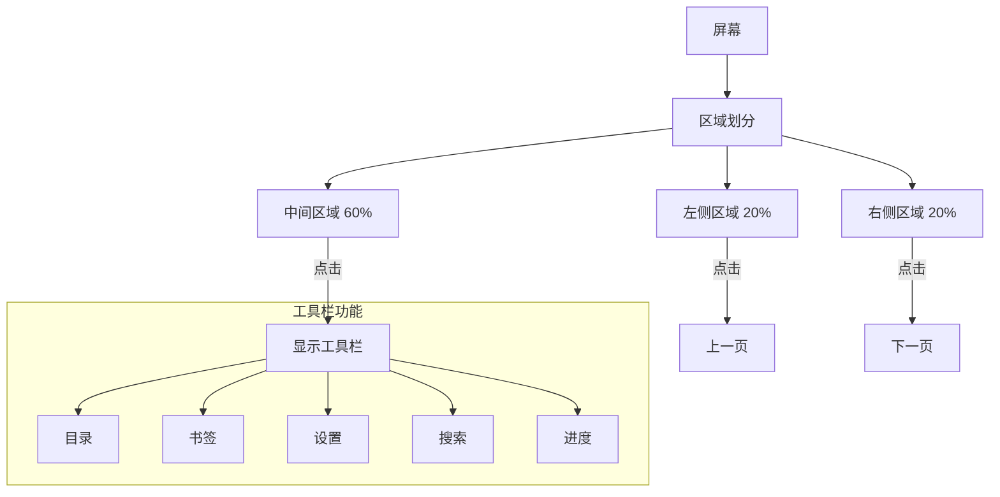
```mermaid
flowchart TD
    SCREEN[屏幕] --> ZONES[区域划分]

    ZONES --> LEFT[左侧区域 20%]
    ZONES --> CENTER[中间区域 60%]
    ZONES --> RIGHT[右侧区域 20%]

    LEFT --> |点击| PREV[上一页]
    CENTER --> |点击| TOOLBAR[显示工具栏]
    RIGHT --> |点击| NEXT[下一页]

    subgraph 工具栏功能
        TOOLBAR --> T1[目录]
        TOOLBAR --> T2[书签]
        TOOLBAR --> T3[设置]
        TOOLBAR --> T4[搜索]
        TOOLBAR --> T5[进度]
    end
```

### 链接点击处理

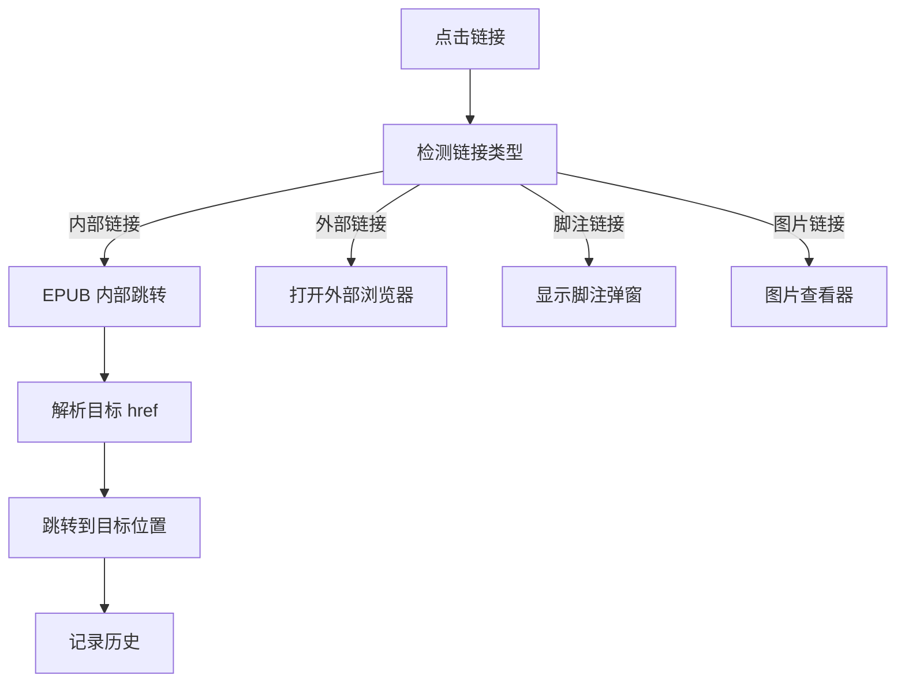
```mermaid
flowchart TD
    CLICK[点击链接] --> DETECT[检测链接类型]

    DETECT --> |内部链接| INTERNAL[EPUB 内部跳转]
    DETECT --> |外部链接| EXTERNAL[打开外部浏览器]
    DETECT --> |脚注链接| FOOTNOTE[显示脚注弹窗]
    DETECT --> |图片链接| IMAGE[图片查看器]

    INTERNAL --> PARSE[解析目标 href]
    PARSE --> JUMP[跳转到目标位置]
    JUMP --> HISTORY[记录历史]
```

### 链接类型处理

| 链接类型 | 识别方式 | 处理方式 |
| -------- | -------- | -------- |
| 章节内跳转 | #anchor | 滚动到锚点 |
| 章节间跳转 | chapter.xhtml | 加载新章节 |
| 外部 HTTP | http(s):// | 确认后打开浏览器 |
| 邮件链接 | mailto: | 打开邮件应用 |
| 脚注引用 | epub:type="noteref" | 弹窗显示 |

---

## 即时翻译功能

### 翻译模式分类

| 模式 | 说明 | 数据来源 | 适用场景 |
| ---- | ---- | -------- | -------- |
| 选词翻译 | 选中文本后实时翻译 | 在线 API | 临时查词 |
| 双语阅读 | 预处理的中英对照内容 | 预下发数据 | 语言学习 |

### 选词翻译流程

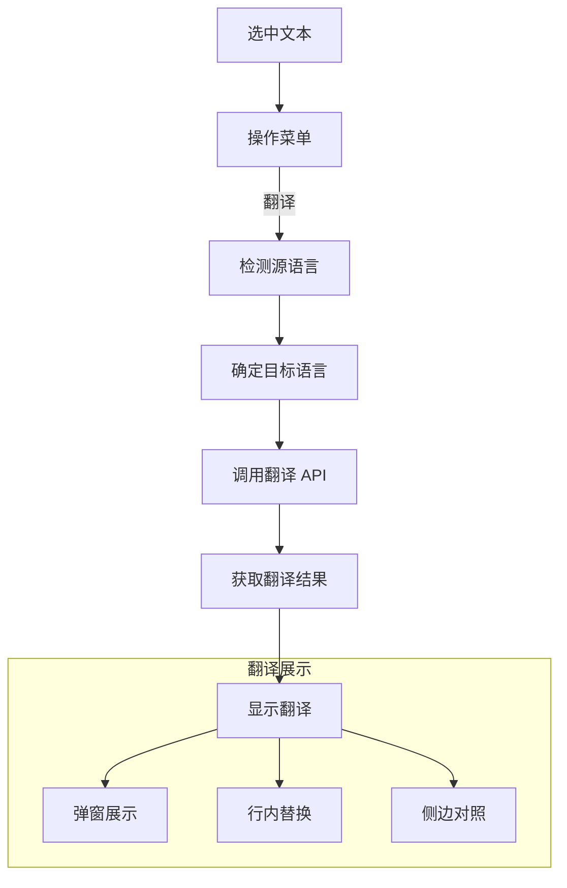
```mermaid
flowchart TD
    SELECT[选中文本] --> MENU[操作菜单]
    MENU --> |翻译| DETECT[检测源语言]
    DETECT --> TARGET[确定目标语言]

    TARGET --> API[调用翻译 API]
    API --> RESULT[获取翻译结果]
    RESULT --> DISPLAY[显示翻译]

    subgraph 翻译展示
        DISPLAY --> POPUP[弹窗展示]
        DISPLAY --> INLINE[行内替换]
        DISPLAY --> SIDE[侧边对照]
    end
```

### 双语阅读模式

双语阅读是一种预处理的翻译模式，所有翻译和分词数据在服务端完成后下发到客户端，实现离线可用的双语对照阅读体验。

> 详细实现方案请参阅：[双语阅读功能实现原理](./bilingual-reading.md)

#### 双语阅读与 EPUB 渲染的关系

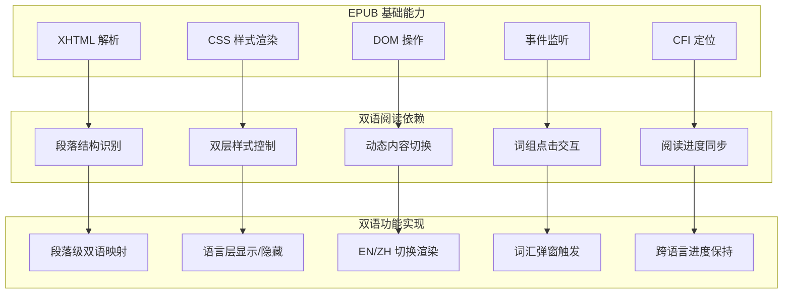
```mermaid
flowchart TD
    subgraph EPUB 基础能力
        E1[XHTML 解析]
        E2[CSS 样式渲染]
        E3[DOM 操作]
        E4[事件监听]
        E5[CFI 定位]
    end

    subgraph 双语阅读依赖
        E1 --> B1[段落结构识别]
        E2 --> B2[双层样式控制]
        E3 --> B3[动态内容切换]
        E4 --> B4[词组点击交互]
        E5 --> B5[阅读进度同步]
    end

    subgraph 双语功能实现
        B1 --> F1[段落级双语映射]
        B2 --> F2[语言层显示/隐藏]
        B3 --> F3[EN/ZH 切换渲染]
        B4 --> F4[词汇弹窗触发]
        B5 --> F5[跨语言进度保持]
    end
```

#### 依赖的 EPUB 渲染能力

| EPUB 能力 | 双语功能应用 | 说明 |
| --------- | ------------ | ---- |
| XHTML 文档结构 | 段落容器创建 | 每个段落作为双语内容的容器单元 |
| CSS 样式系统 | 语言层控制 | 通过 display/visibility 控制 EN/ZH 层 |
| DOM 操作 API | 分词元素渲染 | 将预分词数据渲染为可点击的 span 元素 |
| 事件委托机制 | 词组点击检测 | 基于 EPUB 的事件系统实现词汇交互 |
| CFI 定位系统 | 双语进度同步 | 确保切换语言后阅读位置不变 |
| WebView 渲染 | 内容展示 | 复用 EPUB 的 WebView 渲染管线 |

#### 双语内容渲染架构

```mermaid
flowchart TD
    EPUB[EPUB 渲染引擎] --> WEBVIEW[WebView 容器]
    WEBVIEW --> DOM[DOM 环境]

    DOM --> PARA[段落容器]
    PARA --> EN_LAYER[英文层 - 分词渲染]
    PARA --> ZH_LAYER[中文层 - 文本渲染]

    EN_LAYER --> |复用| CLICK[EPUB 点击事件系统]
    EN_LAYER --> |复用| STYLE[EPUB CSS 样式系统]

    CLICK --> POPUP[词汇弹窗]
    STYLE --> SWITCH[语言切换动画]
```

### 翻译功能组件

| 组件 | 功能 | 说明 |
| ---- | ---- | ---- |
| 语言检测 | 自动识别源语言 | 支持多语言混合检测 |
| 翻译引擎 | 执行翻译 | 支持多个翻译服务商 |
| 缓存层 | 存储翻译结果 | 减少重复请求 |
| 词典查询 | 单词释义 | 提供词性、例句等 |
| 发音功能 | 文本转语音 | 支持原文和译文朗读 |

### 翻译展示模式

| 模式 | 说明 | 适用场景 |
| ---- | ---- | -------- |
| 弹窗模式 | 浮动卡片显示翻译 | 临时查看 |
| 对照模式 | 原文译文并排显示 | 学习阅读 |
| 替换模式 | 译文替换原文 | 快速理解 |
| 注释模式 | 译文显示在原文下方 | 精读学习 |

---

## 数据存储架构

### 标注数据关系

```mermaid
erDiagram
    BOOK ||--o{ HIGHLIGHT : contains
    BOOK ||--o{ BOOKMARK : contains
    BOOK ||--o{ READING_PROGRESS : has
    HIGHLIGHT ||--o| NOTE : has
    USER ||--o{ HIGHLIGHT : creates
    USER ||--o{ NOTE : creates
    USER ||--o{ BOOKMARK : creates

    BOOK {
        uuid id
        string title
        string author
        string identifier
    }

    HIGHLIGHT {
        uuid id
        uuid book_id
        string cfi_range
        string text
        string color
        datetime created_at
    }

    NOTE {
        uuid id
        uuid highlight_id
        string content
        datetime created_at
    }

    BOOKMARK {
        uuid id
        uuid book_id
        string cfi
        string title
        datetime created_at
    }

    READING_PROGRESS {
        uuid id
        uuid book_id
        string cfi
        float percentage
        datetime updated_at
    }
```

### 数据同步策略

```mermaid
flowchart TD
    LOCAL[本地数据] --> CHANGE{有变更?}
    CHANGE --> |是| QUEUE[加入同步队列]
    CHANGE --> |否| WAIT[等待变更]

    QUEUE --> NETWORK{网络可用?}
    NETWORK --> |是| SYNC[上传到服务器]
    NETWORK --> |否| RETRY[等待网络]

    SYNC --> MERGE[合并冲突处理]
    MERGE --> UPDATE[更新本地状态]

    subgraph 冲突解决
        MERGE --> |时间戳| NEWER[保留较新版本]
        MERGE --> |手动| MANUAL[用户选择]
    end
```

---

## 固定布局（Fixed Layout）

EPUB 3 支持固定布局，适用于漫画、绘本等：

### 视口元数据

| 属性 | 说明 |
|------|------|
| rendition:layout | pre-paginated / reflowable |
| rendition:orientation | landscape / portrait / auto |
| rendition:spread | none / landscape / portrait / both / auto |

### 固定布局与流式布局对比

| 特性 | 流式布局 | 固定布局 |
|------|----------|----------|
| 内容适配 | 自动适应屏幕 | 固定尺寸 |
| 字体大小 | 用户可调节 | 固定 |
| 缩放 | 通过字体大小 | 整页缩放 |
| 适用场景 | 文字为主的书籍 | 漫画、绘本、杂志 |
| 文件体积 | 较小 | 较大 |

---

## DRM 与加密

### 加密方式

```mermaid
flowchart TD
    DRM[DRM 保护] --> ADOBE[Adobe DRM]
    DRM --> READIUM[Readium LCP]
    DRM --> APPLE[Apple FairPlay]
    DRM --> CUSTOM[自定义加密]

    ADOBE --> |使用| ADEPT[Adobe ADEPT]
    READIUM --> |开放标准| LCP[License Certificate]
    APPLE --> |iOS 专用| FAIRPLAY[FairPlay Streaming]
```

### encryption.xml 结构

| 元素 | 说明 |
|------|------|
| EncryptedData | 加密数据描述 |
| EncryptionMethod | 加密算法 |
| CipherData | 密文引用 |
| KeyInfo | 密钥信息 |

---

## 常见问题与解决方案

| 问题 | 原因 | 解决方案 |
|------|------|----------|
| 无法打开 EPUB | mimetype 位置错误 | 确保 mimetype 是 ZIP 中第一个文件且未压缩 |
| 图片不显示 | 路径引用错误 | 检查 manifest 中的路径与实际文件路径是否一致 |
| 目录无法跳转 | NCX/NAV 链接错误 | 验证 navPoint 中的 content src 属性 |
| 样式不生效 | CSS 未在 manifest 声明 | 确保所有 CSS 文件都在 manifest 中列出 |
| 字体不显示 | 字体未嵌入或路径错误 | 检查字体文件是否存在且 MIME 类型正确 |
| 章节顺序错乱 | spine 顺序问题 | 按正确顺序排列 spine 中的 itemref |

---

## EPUB 验证

### 验证工具

| 工具 | 类型 | 说明 |
|------|------|------|
| EPUBCheck | 官方工具 | W3C/IDPF 官方验证器 |
| Calibre | 桌面应用 | 电子书管理，支持 EPUB 验证 |
| EPUB Validator | 在线工具 | 在线验证服务 |
| Sigil | 编辑器 | EPUB 编辑器，内置验证 |

### 验证检查项

```mermaid
flowchart LR
    VAL[EPUB 验证] --> STRUCT[结构验证]
    VAL --> CONTENT[内容验证]
    VAL --> META[元数据验证]
    VAL --> LINK[链接验证]

    STRUCT --> S1[ZIP 格式]
    STRUCT --> S2[mimetype 位置]
    STRUCT --> S3[必需文件存在]

    CONTENT --> C1[XHTML 格式]
    CONTENT --> C2[CSS 语法]
    CONTENT --> C3[图片格式]

    META --> M1[必需元数据]
    META --> M2[Dublin Core]
    META --> M3[标识符唯一性]

    LINK --> L1[内部链接有效]
    LINK --> L2[资源引用完整]
    LINK --> L3[无孤立文件]
```

---

## 最佳实践

### 制作高质量 EPUB

| 方面 | 建议 |
|------|------|
| 文件命名 | 使用小写字母、数字和连字符，避免空格和特殊字符 |
| 图片优化 | 封面 1400x2100px，正文图片不超过 1000px 宽 |
| 字体嵌入 | 仅嵌入必要字体，使用子集化减小体积 |
| CSS 样式 | 使用相对单位（em、%），避免绝对单位 |
| 元数据 | 完整填写所有元数据，提高可发现性 |
| 目录深度 | 建议不超过 3 级 |
| 文件体积 | 单个 EPUB 建议不超过 50MB |

---

## 相关标准与规范

| 规范 | 组织 | 说明 |
|------|------|------|
| EPUB 3.3 | W3C | 当前最新标准 |
| EPUB 3.2 | W3C/IDPF | 广泛采用的版本 |
| EPUB 2.0.1 | IDPF | 旧版本，仍有大量内容 |
| Open Container Format | IDPF | ZIP 容器规范 |
| Open Packaging Format | IDPF | OPF 文件规范 |
| Open Publication Structure | IDPF | 内容文档规范 |
| Dublin Core | DCMI | 元数据标准 |

---

## 总结

EPUB 是一个模块化、可扩展的电子书格式：

```mermaid
flowchart TD
    EPUB[EPUB 格式] --> ZIP[ZIP 容器]
    EPUB --> OPF[包文件 OPF]
    EPUB --> NAV[导航系统]
    EPUB --> CONTENT[内容文档]

    ZIP --> |标准压缩格式| PORTABLE[跨平台兼容]
    OPF --> |元数据+清单+书脊| ORGANIZED[内容组织]
    NAV --> |NCX/NAV| NAVIGATION[目录导航]
    CONTENT --> |XHTML+CSS| READABLE[可渲染内容]

    PORTABLE --> EBOOK[完整电子书]
    ORGANIZED --> EBOOK
    NAVIGATION --> EBOOK
    READABLE --> EBOOK
```

EPUB 的设计理念是将 Web 技术（HTML、CSS、JavaScript）封装在一个可离线阅读的容器中，这使得它既具有 Web 的灵活性，又具有电子书的便携性。
