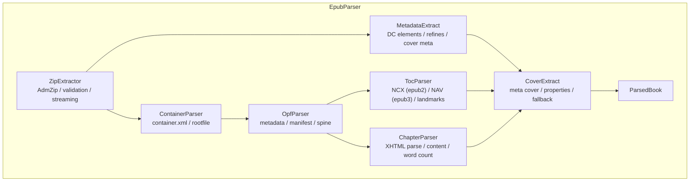
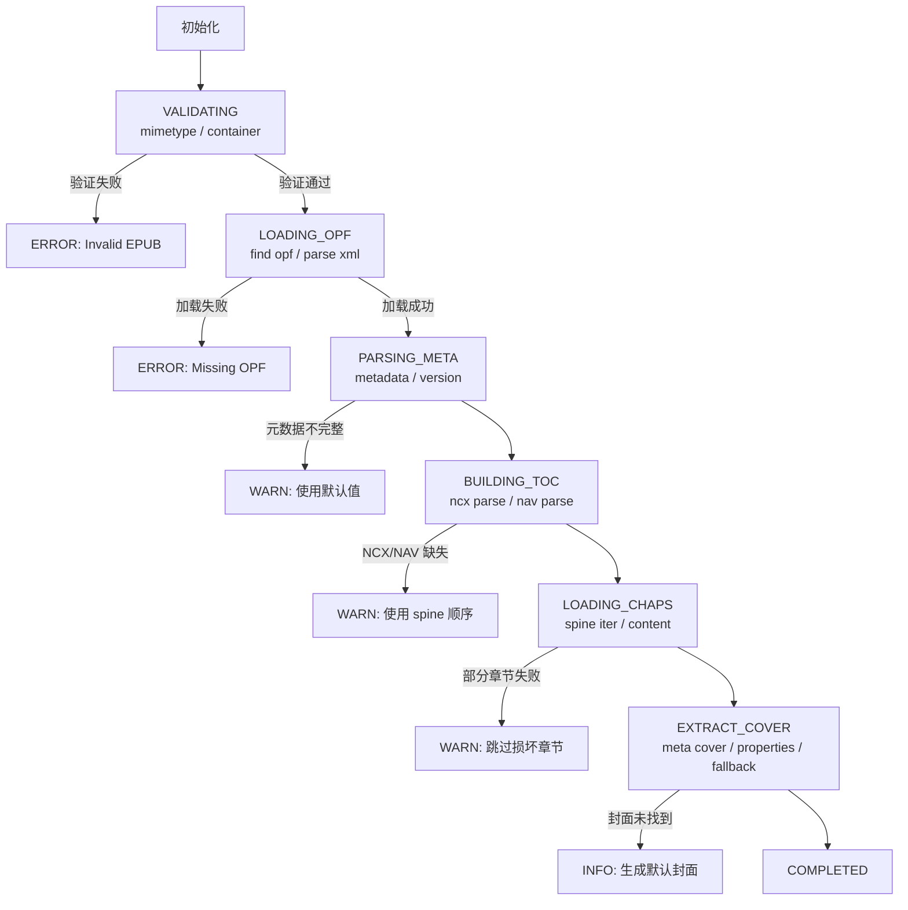

# 用户自定义导入电子书 EPUB2/EPUB3 支持详细设计文档

> 文档版本: 1.0
> 创建日期: 2025-12-28
> 状态: 技术设计完成

---

## 目录

1. [概述](#1-概述)
2. [EPUB 格式规范](#2-epub-格式规范)
3. [EPUB2 vs EPUB3 技术差异](#3-epub2-vs-epub3-技术差异)
4. [文件结构详解](#4-文件结构详解)
5. [解析器架构设计](#5-解析器架构设计)
6. [元数据提取规范](#6-元数据提取规范)
7. [章节解析策略](#7-章节解析策略)
8. [封面提取算法](#8-封面提取算法)
9. [内容清洗与标准化](#9-内容清洗与标准化)
10. [兼容性处理策略](#10-兼容性处理策略)
11. [错误处理机制](#11-错误处理机制)
12. [安全考虑](#12-安全考虑)
13. [性能优化](#13-性能优化)
14. [测试策略](#14-测试策略)
15. [实现计划](#15-实现计划)
16. [附录](#16-附录)

---

## 1. 概述

### 1.1 背景

EPUB (Electronic Publication) 是国际数字出版论坛 (IDPF) 制定的开放电子书标准，现由 W3C 维护。EPUB 格式是 Readmigo 平台用户自定义导入电子书的首选格式，需要完整支持 EPUB2 和 EPUB3 两个主要版本。

### 1.2 设计目标

| 目标 | 描述 | 优先级 |
|------|------|--------|
| **格式兼容性** | 支持 95%+ 的 EPUB2/EPUB3 文件 | P0 |
| **元数据完整性** | 准确提取书名、作者、封面、目录 | P0 |
| **内容保真度** | 保留原书排版结构和样式 | P1 |
| **错误容错性** | 优雅处理非标准/损坏文件 | P1 |
| **处理性能** | 50MB 以下文件 30 秒内完成 | P2 |

### 1.3 系统边界

```
用户上传 EPUB → 格式验证 → 解压处理 → 元数据提取 → 章节解析 → 内容清洗 → 存储入库
```

**本文档范围**：
- EPUB 文件解析技术细节
- 元数据提取规范
- 章节内容处理
- 兼容性与容错策略

**不在本文档范围**：
- 文件上传流程（参见 `local-import.md`）
- 阅读器渲染（参见 `epub-architecture.md`）
- 用户界面设计

---

## 2. EPUB 格式规范

### 2.1 EPUB 标准版本历史

| 版本 | 发布时间 | 标准组织 | 核心特性 |
|------|---------|----------|---------|
| EPUB 2.0.1 | 2010.09 | IDPF | XHTML 1.1, CSS 2.1, NCX 目录 |
| EPUB 3.0 | 2011.10 | IDPF | HTML5, CSS3, JavaScript, Nav 目录 |
| EPUB 3.0.1 | 2014.06 | IDPF | 修复规范错误 |
| EPUB 3.1 | 2017.01 | IDPF/W3C | 移除遗留特性 |
| EPUB 3.2 | 2019.05 | W3C | 当前推荐标准 |
| EPUB 3.3 | 2023.05 | W3C | 最新标准 |

### 2.2 EPUB 文件本质

EPUB 文件本质上是一个 **ZIP 压缩包**，包含以下组件：

```
my-book.epub (ZIP Archive)
├── mimetype                    # MIME 类型声明 (必须为第一个文件，不压缩)
├── META-INF/
│   ├── container.xml           # 根文件定位器 (必需)
│   ├── encryption.xml          # DRM 加密信息 (可选)
│   ├── signatures.xml          # 数字签名 (可选)
│   └── rights.xml              # 权限信息 (可选)
└── OEBPS/ (或其他目录名)
    ├── content.opf             # 包文档 - 核心元数据和清单
    ├── toc.ncx                 # EPUB2 目录导航
    ├── nav.xhtml               # EPUB3 导航文档
    ├── cover.xhtml             # 封面页面
    ├── chapter01.xhtml         # 章节内容
    ├── chapter02.xhtml
    ├── ...
    ├── css/
    │   └── style.css           # 样式表
    └── images/
        ├── cover.jpg           # 封面图片
        └── figure01.png        # 内嵌图片
```

### 2.3 核心规范文件

| 文件 | EPUB2 | EPUB3 | 用途 |
|------|-------|-------|------|
| `mimetype` | 必需 | 必需 | 声明 MIME 类型 |
| `container.xml` | 必需 | 必需 | 指向 content.opf 位置 |
| `content.opf` | 必需 | 必需 | 包清单、元数据、书脊顺序 |
| `toc.ncx` | 必需 | 可选 | NCX 格式目录导航 |
| `nav.xhtml` | 不支持 | 必需 | XHTML 格式导航文档 |

---

## 3. EPUB2 vs EPUB3 技术差异

### 3.1 规范对比矩阵

| 特性维度 | EPUB2 | EPUB3 | 解析影响 |
|----------|-------|-------|---------|
| **内容格式** | XHTML 1.1 / DTBook | XHTML5 (HTML5 in XML) | 需要双模式 XML 解析 |
| **样式语言** | CSS 2.1 (子集) | CSS3 (完整) | 样式兼容性处理 |
| **脚本支持** | 不支持 | JavaScript (受限) | 安全过滤需求 |
| **目录格式** | NCX (XML) | NAV (XHTML) + NCX (兼容) | 双目录解析 |
| **媒体覆盖** | 不支持 | SMIL 音频同步 | 扩展功能 |
| **元数据** | Dublin Core 基础 | Dublin Core + DCTERMS | 增强提取 |
| **语义化** | 有限 | epub:type 属性 | 结构识别 |
| **文字方向** | 有限 | 完整 RTL/竖排支持 | 渲染适配 |

### 3.2 关键差异详解

#### 3.2.1 目录导航

**EPUB2 - NCX 格式 (toc.ncx)**

**EPUB3 - NAV 格式 (nav.xhtml)**

#### 3.2.2 元数据定义

**EPUB2 元数据 (content.opf)**

**EPUB3 元数据 (content.opf)**

#### 3.2.3 Manifest 项目属性

**EPUB2 Manifest**

**EPUB3 Manifest (带 properties)**

---

## 4. 文件结构详解

### 4.1 container.xml 规范

位置: `META-INF/container.xml`

**解析要点**:
1. 必须读取第一个 `rootfile` 作为主包
2. `full-path` 是相对于 EPUB 根目录的路径
3. 需要处理不同的目录结构 (OEBPS, OPS, EPUB, 或根目录)

### 4.2 content.opf 完整结构

### 4.3 常见目录结构变体

```
变体 1: Standard Ebooks 风格
├── META-INF/container.xml
├── mimetype
└── epub/
    ├── content.opf
    ├── toc.xhtml
    ├── text/
    │   ├── chapter-1.xhtml
    │   └── chapter-2.xhtml
    ├── css/
    └── images/

变体 2: Calibre 默认风格
├── META-INF/container.xml
├── mimetype
├── content.opf
├── toc.ncx
├── cover.jpeg
├── chapter1.html
└── stylesheet.css

变体 3: Sigil 默认风格
├── META-INF/container.xml
├── mimetype
└── OEBPS/
    ├── content.opf
    ├── toc.ncx
    ├── Text/
    ├── Styles/
    └── Images/

变体 4: InDesign 导出风格
├── META-INF/container.xml
├── mimetype
└── OPS/
    ├── package.opf
    ├── navigation.xhtml
    ├── content/
    └── assets/
```

---

## 5. 解析器架构设计

### 5.1 整体架构



### 5.2 核心接口定义

### 5.3 版本检测逻辑

### 5.4 解析流程状态机



---

## 6. 元数据提取规范

### 6.1 元数据优先级策略

不同来源的元数据可能存在冲突，按以下优先级处理：

| 优先级 | 来源 | 说明 |
|--------|------|------|
| 1 (最高) | EPUB3 refines | 精确定义的元数据 |
| 2 | Dublin Core 元素 | 标准元数据元素 |
| 3 | OPF meta 元素 | 扩展元数据 |
| 4 | 文件名推断 | 从文件名提取 |
| 5 (最低) | 默认值 | "Unknown Title" 等 |

### 6.2 元数据提取算法

### 6.3 主题/分类提取

---

## 7. 章节解析策略

### 7.1 章节顺序确定

EPUB 的阅读顺序由 `<spine>` 元素定义：

### 7.2 章节标题提取算法

### 7.3 章节内容处理

### 7.4 词数统计

---

## 8. 封面提取算法

### 8.1 封面识别策略

EPUB 封面的声明方式多种多样，需要多重策略：

### 8.2 封面图片处理

---

## 9. 内容清洗与标准化

### 9.1 HTML 清洗规则

### 9.2 CSS 处理

---

## 10. 兼容性处理策略

### 10.1 常见问题处理矩阵

| 问题类型 | 检测方法 | 处理策略 |
|---------|---------|---------|
| 缺少 mimetype | 检查文件存在性 | 忽略，继续解析 |
| 无效 XML | 解析异常 | 尝试 HTML5 解析器 |
| 编码错误 | 乱码检测 | 尝试多种编码 |
| 相对路径错误 | 文件不存在 | 尝试多种路径组合 |
| 缺少 NCX/NAV | 文件不存在 | 使用 spine 顺序 |
| 元数据不完整 | 字段为空 | 使用默认值/推断 |
| 损坏的图片 | 解析异常 | 跳过图片 |
| 不支持的媒体 | 未知 MIME | 忽略资源 |

### 10.2 编码处理

### 10.3 路径解析容错

### 10.4 XML 解析容错

---

## 11. 错误处理机制

### 11.1 错误分类

### 11.2 错误处理流程

### 11.3 用户友好错误消息

---

## 12. 安全考虑

### 12.1 威胁模型

| 威胁 | 风险等级 | 缓解措施 |
|------|---------|---------|
| **恶意 JavaScript** | 高 | 移除所有脚本，不执行 JS |
| **XXE 攻击** | 高 | 禁用外部实体解析 |
| **路径遍历** | 高 | 验证路径不超出 EPUB 目录 |
| **ZIP 炸弹** | 中 | 限制解压大小和文件数 |
| **SSRF (SVG)** | 中 | 移除外部引用 |
| **CSS 注入** | 低 | 过滤危险 CSS 属性 |

### 12.2 安全配置

### 12.3 路径安全验证

### 12.4 DRM 检测

---

## 13. 性能优化

### 13.1 内存优化

### 13.2 并行处理

### 13.3 缓存策略

---

## 14. 测试策略

### 14.1 测试用例分类

### 14.2 测试文件库

| 类别 | 测试文件 | 用途 |
|------|---------|------|
| **标准格式** | standard-epub2.epub | EPUB2 基准测试 |
| | standard-epub3.epub | EPUB3 基准测试 |
| | epub3-with-ncx.epub | EPUB3 + NCX 兼容 |
| **封面变体** | cover-by-meta.epub | meta 封面声明 |
| | cover-by-properties.epub | properties 封面 |
| | cover-in-page.epub | 嵌入页面封面 |
| | no-cover.epub | 无封面测试 |
| **编码** | utf8-bom.epub | UTF-8 BOM |
| | gbk-chinese.epub | GBK 中文 |
| | mixed-encoding.epub | 混合编码 |
| **边界情况** | large-book.epub | 大文件 (50MB+) |
| | many-chapters.epub | 多章节 (500+) |
| | nested-toc.epub | 多级目录 |
| | minimal.epub | 最小结构 |
| **异常情况** | corrupt-zip.epub | 损坏 ZIP |
| | missing-opf.epub | 缺少 OPF |
| | invalid-xml.epub | XML 格式错误 |
| | drm-protected.epub | DRM 保护 |

### 14.3 集成测试

---

## 15. 实现计划

### 15.1 阶段划分

```
Phase 1: 核心解析能力 (已完成)
├── container.xml 解析
├── content.opf 解析
├── 基础元数据提取
├── spine 章节解析
├── NCX 目录解析
└── 基础封面提取

Phase 2: EPUB3 增强 (进行中)
├── NAV 导航文档支持
├── refined 元数据解析
├── cover-image 属性支持
├── 语义化元素识别
└── 多封面策略

Phase 3: 兼容性提升
├── 编码自动检测
├── XML 解析容错
├── 路径解析容错
├── 错误恢复机制
└── 性能优化

Phase 4: 高级功能
├── 流式处理大文件
├── 并行章节解析
├── 增量导入支持
└── 格式转换集成
```

### 15.2 代码位置

| 文件 | 描述 |
|------|------|
| `scripts/book-ingestion/processors/epub-parser.ts` | 核心解析器 |
| `scripts/book-ingestion/processors/html-cleaner.ts` | HTML 清洗 |
| `src/modules/import/book-enrichment.service.ts` | 导入服务 |
| `src/modules/user-books/user-books.service.ts` | 用户书籍服务 |

---

## 16. 附录

### 16.1 参考文档

- [EPUB 3.3 Specification (W3C)](https://www.w3.org/publishing/epub3/epub33/)
- [EPUB 2.0.1 Specification (IDPF Archive)](http://idpf.org/epub/201)
- [Dublin Core Metadata Element Set](https://www.dublincore.org/specifications/dublin-core/dces/)
- [EPUB Packages 3.3 (W3C)](https://www.w3.org/TR/epub-33/#sec-package-doc)
- [EPUB Content Documents 3.3 (W3C)](https://www.w3.org/TR/epub-33/#sec-contentdocs)

### 16.2 MIME 类型参考

| 文件类型 | MIME 类型 |
|---------|----------|
| EPUB | `application/epub+zip` |
| OPF | `application/oebps-package+xml` |
| NCX | `application/x-dtbncx+xml` |
| XHTML | `application/xhtml+xml` |
| CSS | `text/css` |
| JPEG | `image/jpeg` |
| PNG | `image/png` |
| GIF | `image/gif` |
| SVG | `image/svg+xml` |
| OTF Font | `font/otf` |
| WOFF Font | `font/woff` |

### 16.3 常见 EPUB 生成工具

| 工具 | 输出特点 | 兼容性 |
|------|---------|--------|
| Calibre | 标准 EPUB2/3，可配置 | 高 |
| Sigil | 标准 EPUB，OEBPS 结构 | 高 |
| Adobe InDesign | 复杂样式，OPS 结构 | 中 |
| Pandoc | 简洁 EPUB3 | 高 |
| iBooks Author | Apple 扩展特性 | 中 |
| Kindle Create | MOBI 优先，EPUB 导出 | 中 |
| Standard Ebooks | 高质量 EPUB3，epub 目录 | 高 |

---

*文档结束*
