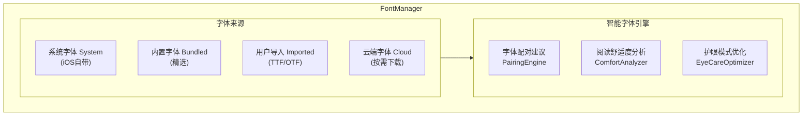

# 超级字体管理系统

> 目标: 提供业界最强的字体自定义能力，支持用户导入字体、智能字体推荐

---

## 架构概述



---

## 字体分类

```swift
enum FontCategory: String, Codable, CaseIterable {
    case serif = "serif"                    // 衬线体（正式、经典）
    case sansSerif = "sans_serif"           // 无衬线（现代、简洁）
    case monospace = "monospace"            // 等宽（代码）
    case display = "display"                // 展示体（标题）
    case handwriting = "handwriting"        // 手写体
    case chinese = "chinese"                // 中文专用
    case dyslexia = "dyslexia"             // 阅读障碍友好
}
```

| 分类 | 适用场景 |
|------|----------|
| 衬线体 | 适合长时间阅读，传统优雅 |
| 无衬线 | 现代简洁，屏幕显示清晰 |
| 等宽字体 | 适合阅读代码和技术书籍 |
| 展示字体 | 适合标题和强调内容 |
| 手写体 | 亲切自然，适合休闲阅读 |
| 中文字体 | 针对中文优化的字体 |
| 阅读障碍友好 | 特别设计，帮助阅读障碍者 |

---

## 字体设置

```swift
struct FontSettings: Codable {
    var bodyFont: String = "System"
    var headingFont: String = "System"
    var fontSize: CGFloat = 17
    var lineHeight: CGFloat = 1.5
    var letterSpacing: CGFloat = 0
    var wordSpacing: CGFloat = 0
    var paragraphSpacing: CGFloat = 12
    var textAlignment: TextAlignment = .justified
    var hyphenation: Bool = true
    var fontWeight: FontWeight = .regular
}
```

---

## 内置推荐字体

| 字体名 | 特点 | 许可证 |
|--------|------|--------|
| Literata | Google 开源阅读字体 | 开源 |
| Crimson Pro | 优雅衬线体 | 开源 |
| Merriweather | 屏幕优化衬线体 | 开源 |
| Source Serif Pro | Adobe 开源衬线体 | 开源 |
| OpenDyslexic | 阅读障碍友好 | 开源 |
| Atkinson Hyperlegible | 高可读性字体 | 开源 |

---

## 用户字体导入

支持导入 TTF/OTF 格式的字体文件：

```swift
func importFont(from url: URL) async throws -> ReaderFontFamily {
    // 1. 验证字体文件
    // 2. 解析字体信息
    // 3. 提取字体元数据
    // 4. 注册字体到系统
    // 5. 复制到 App 字体目录
    // 6. 创建字体模型
}
```

---

## 智能字体推荐

根据书籍类型和用户偏好推荐最适合的字体：

```swift
func recommendFonts(for book: Book, userPreferences: FontSettings) -> [FontRecommendation] {
    // 分析书籍类型
    switch bookCategory {
    case .fiction:
        // 推荐 Literata、Crimson Pro
    case .technical:
        // 推荐 Source Code Pro、JetBrains Mono
    case .academic:
        // 推荐 Source Serif Pro
    case .casual:
        // 推荐 Atkinson Hyperlegible
    }

    // 考虑用户阅读时长和字号偏好
    if userPreferences.fontSize > 20 {
        // 推荐护眼字体
    }
}
```

---

## 云端字体

支持从云端按需下载更多字体：

- 下载进度显示
- 后台下载支持
- 自动字体注册
- 存储空间管理

---

## 相关文档

- [渲染引擎](./rendering-engine.md) - 多格式渲染引擎设计
- [翻页动画](./page-turning.md) - 物理级翻页动画系统
- [阅读器架构](./architecture.md) - 核心架构设计

---

*最后更新: 2025-12-26*
