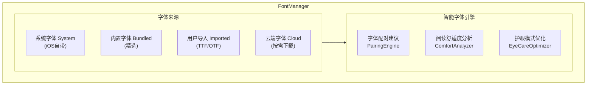

# 超级字体管理系统

> 目标: 提供业界最强的字体自定义能力，支持用户导入字体、智能字体推荐

---

## 架构概述

---

## 字体分类

| 分类 | 适用场景 |
|------|----------|
| 衬线体 | 适合长时间阅读，传统优雅 |
| 无衬线 | 现代简洁，屏幕显示清晰 |
| 等宽字体 | 适合阅读代码和技术书籍 |
| 展示字体 | 适合标题和强调内容 |
| 手写体 | 亲切自然，适合休闲阅读 |
| 中文字体 | 针对中文优化的字体 |
| 阅读障碍友好 | 特别设计，帮助阅读障碍者 |

---

## 字体设置

---

## 内置推荐字体

| 字体名 | 特点 | 许可证 |
|--------|------|--------|
| Literata | Google 开源阅读字体 | 开源 |
| Crimson Pro | 优雅衬线体 | 开源 |
| Merriweather | 屏幕优化衬线体 | 开源 |
| Source Serif Pro | Adobe 开源衬线体 | 开源 |
| OpenDyslexic | 阅读障碍友好 | 开源 |
| Atkinson Hyperlegible | 高可读性字体 | 开源 |

---

## 用户字体导入

支持导入 TTF/OTF 格式的字体文件：

---

## 智能字体推荐

根据书籍类型和用户偏好推荐最适合的字体：

---

## 云端字体

支持从云端按需下载更多字体：

- 下载进度显示
- 后台下载支持
- 自动字体注册
- 存储空间管理

---

## 相关文档

- [渲染引擎](./rendering-engine.md) - 多格式渲染引擎设计
- [翻页动画](./page-turning.md) - 物理级翻页动画系统
- [阅读器架构](./architecture.md) - 核心架构设计

---

*最后更新: 2025-12-26*
