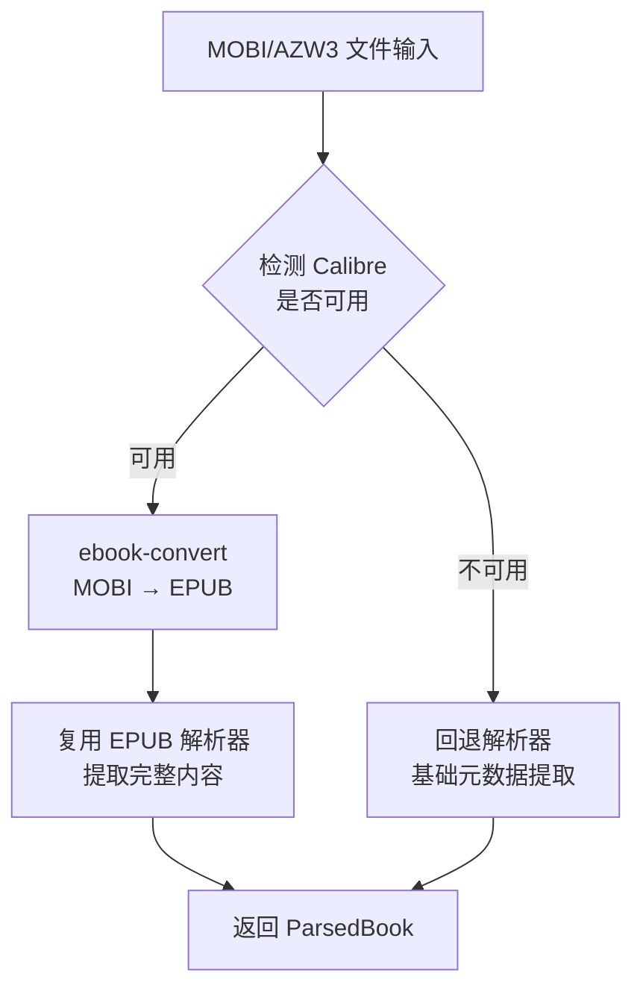
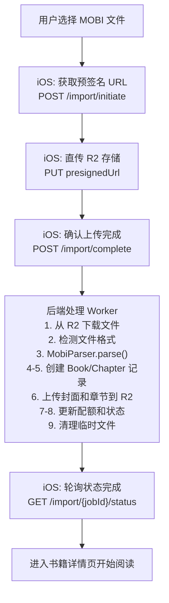
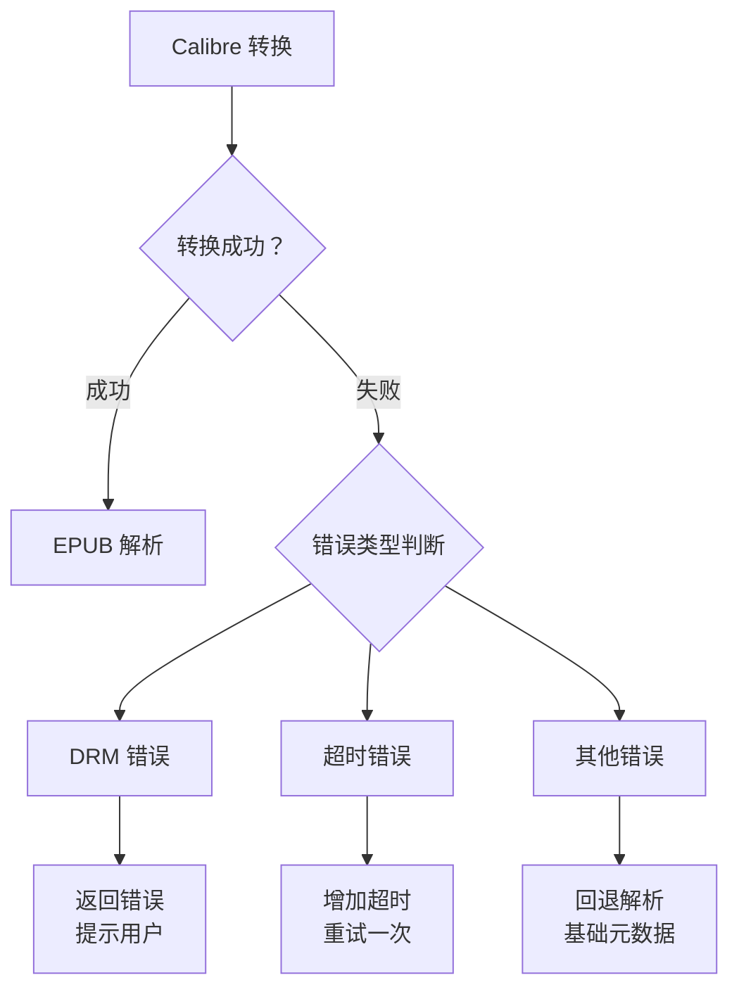

# MOBI/AZW3 格式电子书导入详细设计文档

> 文档版本: v1.0
> 创建日期: 2025-12-28
> 状态: 已实现

---

## 目录

1. [概述](#一概述)
2. [格式技术分析](#二格式技术分析)
3. [技术方案选型](#三技术方案选型)
4. [后端实现设计](#四后端实现设计)
5. [iOS 客户端适配](#五ios-客户端适配)
6. [API 设计](#六api-设计)
7. [解析流程详解](#七解析流程详解)
8. [错误处理策略](#八错误处理策略)
9. [性能优化](#九性能优化)
10. [测试策略](#十测试策略)
11. [部署与运维](#十一部署与运维)
12. [附录](#十二附录)

---

## 一、概述

### 1.1 背景

MOBI 和 AZW3 是 Amazon Kindle 设备使用的专有电子书格式。许多用户拥有大量 Kindle 格式的电子书，希望能够在 Readmigo 中阅读这些书籍并使用 AI 辅助功能。

### 1.2 目标

- 支持用户导入 MOBI、AZW、AZW3 格式的电子书
- 保持与现有 EPUB 导入流程一致的用户体验
- 实现完整的元数据提取和章节解析
- 支持与平台书籍相同的阅读器功能

### 1.3 范围

| 项目 | 包含 | 不包含 |
|-----|------|--------|
| 文件格式 | MOBI, AZW, AZW3 | KFX (Kindle Format 10) |
| DRM | 无 DRM 保护的书籍 | DRM 加密书籍 |
| 内容类型 | 文本书籍 | 杂志、漫画等固定布局 |

### 1.4 当前实现状态

| 模块 | 状态 | 说明 |
|-----|------|------|
| 后端 MOBI 解析器 | ✅ 已完成 | `scripts/book-ingestion/processors/mobi-parser.ts` |
| iOS 客户端支持 | ✅ 已完成 | MIME 类型、文件选择器已更新 |
| 格式转换 | ✅ 已完成 | Calibre ebook-convert 集成 |
| 回退解析 | ✅ 已完成 | 基础元数据提取 |

---

## 二、格式技术分析

### 2.1 MOBI 格式概述

MOBI (Mobipocket) 是基于 PalmDOC 数据库格式的电子书格式，由 Mobipocket SA 开发，后被 Amazon 收购。

```
MOBI 文件结构:
┌─────────────────────────────────────┐
│         PDB Header (78 bytes)        │  ← 数据库头，包含基本信息
├─────────────────────────────────────┤
│      Record Info List (8 × N)        │  ← 记录索引表
├─────────────────────────────────────┤
│        PalmDOC Header (16 bytes)     │  ← 压缩信息
├─────────────────────────────────────┤
│         MOBI Header (≥232 bytes)     │  ← 格式版本、编码等
├─────────────────────────────────────┤
│      EXTH Header (Optional)          │  ← 扩展元数据（作者、描述等）
├─────────────────────────────────────┤
│         Text Records                 │  ← 压缩的文本内容
├─────────────────────────────────────┤
│         Image Records                │  ← 图片资源
├─────────────────────────────────────┤
│          Other Records               │  ← 其他资源（字体等）
└─────────────────────────────────────┘
```

### 2.2 AZW3/KF8 格式概述

AZW3 (也称为 KF8 - Kindle Format 8) 是 Amazon 推出的增强格式，本质上是一个容器文件：

```
AZW3 文件结构:
┌─────────────────────────────────────┐
│       PDB/MOBI Container             │
├─────────────────────────────────────┤
│    ┌─────────────────────────────┐  │
│    │       RESC Section          │  │  ← 资源部分
│    │  ┌─────────────────────┐   │  │
│    │  │   EPUB-like Content │   │  │  ← 类似 EPUB 的 HTML/CSS
│    │  └─────────────────────┘   │  │
│    └─────────────────────────────┘  │
└─────────────────────────────────────┘
```

### 2.3 关键技术参数

| 参数 | MOBI | AZW3 |
|-----|------|------|
| 文件标识符 | `BOOKMOBI` / `TEXtREAd` | `BOOKMOBI` + KF8 标记 |
| 压缩方式 | PalmDOC (LZ77 变体) | 无压缩 / PalmDOC |
| HTML 版本 | 基础 HTML | HTML5 + CSS3 |
| 图片格式 | JPEG, GIF | JPEG, GIF, PNG |
| 最大文件大小 | 无限制 | 无限制 |
| DRM 支持 | Mobipocket DRM | Amazon DRM (ADEPT) |

### 2.4 EXTH 记录类型（元数据）

```typescript
// EXTH 记录类型定义
const EXTH_RECORD_TYPES = {
  100: 'author',          // 作者
  101: 'publisher',       // 出版社
  103: 'description',     // 描述
  104: 'isbn',            // ISBN
  105: 'subject',         // 主题/分类
  106: 'publishDate',     // 出版日期
  108: 'contributor',     // 贡献者
  109: 'rights',          // 版权
  110: 'subjectCode',     // 主题代码
  111: 'type',            // 类型
  112: 'source',          // 来源
  113: 'asin',            // ASIN
  201: 'coverOffset',     // 封面偏移
  202: 'thumbnailOffset', // 缩略图偏移
  503: 'updatedTitle',    // 更新后的标题
  524: 'language',        // 语言
};
```

---

## 三、技术方案选型

### 3.1 方案对比

| 方案 | 描述 | 优点 | 缺点 | 推荐度 |
|-----|------|------|------|--------|
| **Calibre 转换** | 使用 Calibre 转 EPUB | 完整支持、稳定可靠 | 需安装依赖 | ★★★★★ |
| **纯 JS 解析** | 自研 MOBI 解析器 | 无外部依赖 | 开发成本高、兼容性差 | ★★☆☆☆ |
| **KindleUnpack** | Python 库解包 | 功能完整 | Python 依赖、性能一般 | ★★★☆☆ |
| **mobi-js** | npm 库解析 | 易集成 | 功能有限、不活跃 | ★★☆☆☆ |

### 3.2 最终方案：Calibre 转换 + 回退解析



### 3.3 方案优势

1. **完整性**: Calibre 是业界最成熟的电子书转换工具，支持几乎所有边缘情况
2. **可维护性**: 复用现有 EPUB 解析器，减少代码重复
3. **容错性**: 提供回退机制，即使 Calibre 不可用也能提取基础信息
4. **扩展性**: 未来可轻松添加其他格式支持

---

## 四、后端实现设计

### 4.1 模块架构

```
scripts/book-ingestion/processors/
├── epub-parser.ts          # EPUB 解析器（核心）
├── mobi-parser.ts          # MOBI/AZW3 解析器（新增）
└── index.ts                # 统一导出

apps/backend/src/modules/user-books/
├── processors/
│   └── book-processor.ts   # 书籍处理入口
└── ...
```

### 4.2 MobiParser 类设计

```typescript
// scripts/book-ingestion/processors/mobi-parser.ts

import { exec } from 'child_process';
import { promisify } from 'util';
import * as fs from 'fs';
import * as path from 'path';
import * as os from 'os';
import { EpubParser, ParsedBook } from './epub-parser.js';

const execAsync = promisify(exec);

/**
 * MOBI/AZW3 电子书解析器
 *
 * 采用 Calibre 转换 + EPUB 解析的策略：
 * 1. 使用 Calibre 的 ebook-convert 将 MOBI/AZW3 转换为 EPUB
 * 2. 复用 EpubParser 解析转换后的 EPUB 文件
 * 3. 若 Calibre 不可用，回退到基础元数据提取
 */
export class MobiParser {
  private tempDir: string;

  constructor() {
    this.tempDir = path.join(os.tmpdir(), 'readmigo-mobi-parser');
  }

  /**
   * 解析 MOBI/AZW3 文件
   * @param mobiPath 文件路径
   * @returns ParsedBook 解析结果
   */
  async parse(mobiPath: string): Promise<ParsedBook> {
    // 1. 验证文件存在
    if (!fs.existsSync(mobiPath)) {
      throw new Error(`File not found: ${mobiPath}`);
    }

    // 2. 验证文件扩展名
    const ext = path.extname(mobiPath).toLowerCase();
    if (!['.mobi', '.azw', '.azw3'].includes(ext)) {
      throw new Error(`Unsupported format: ${ext}`);
    }

    // 3. 确保临时目录存在
    if (!fs.existsSync(this.tempDir)) {
      fs.mkdirSync(this.tempDir, { recursive: true });
    }

    // 4. 检测 Calibre 可用性
    const calibreAvailable = await this.checkCalibreAvailable();

    if (calibreAvailable) {
      return this.parseWithCalibre(mobiPath);
    }

    // 5. 回退解析
    console.warn('Calibre not found. Using fallback parser.');
    return this.parseDirectly(mobiPath);
  }

  /**
   * 检查 Calibre 是否可用
   */
  private async checkCalibreAvailable(): Promise<boolean> {
    try {
      await execAsync('ebook-convert --version');
      return true;
    } catch {
      return false;
    }
  }

  /**
   * 使用 Calibre 转换并解析
   */
  private async parseWithCalibre(mobiPath: string): Promise<ParsedBook> {
    const fileName = path.basename(mobiPath, path.extname(mobiPath));
    const epubPath = path.join(this.tempDir, `${fileName}-${Date.now()}.epub`);

    try {
      console.log(`Converting ${path.basename(mobiPath)} to EPUB...`);

      // 执行转换（2分钟超时）
      const { stderr } = await execAsync(
        `ebook-convert "${mobiPath}" "${epubPath}"`,
        { timeout: 120000 }
      );

      if (stderr && !stderr.includes('Output saved')) {
        console.warn('Calibre warnings:', stderr);
      }

      // 验证转换结果
      if (!fs.existsSync(epubPath)) {
        throw new Error('Conversion failed: output file not created');
      }

      // 使用 EPUB 解析器
      const epubParser = new EpubParser();
      const result = await epubParser.parse(epubPath);

      // 清理临时文件
      this.cleanup(epubPath);

      return result;
    } catch (error) {
      this.cleanup(epubPath);

      if (error instanceof Error) {
        // DRM 检测
        if (error.message.includes('DRM') || error.message.includes('encrypted')) {
          throw new Error('DRM-protected book detected. Please remove DRM first.');
        }
        throw new Error(`MOBI conversion failed: ${error.message}`);
      }
      throw error;
    }
  }

  /**
   * 回退解析：直接从 MOBI 提取元数据
   */
  private async parseDirectly(mobiPath: string): Promise<ParsedBook> {
    const fileBuffer = fs.readFileSync(mobiPath);
    const metadata = this.parseMobiHeader(fileBuffer);

    return {
      title: metadata.title || path.basename(mobiPath, path.extname(mobiPath)),
      author: metadata.author || 'Unknown Author',
      description: metadata.description,
      language: metadata.language || 'en',
      publishedYear: undefined,
      chapters: [{
        title: 'Full Text',
        content: '<p>Direct MOBI parsing is limited. Install Calibre for full content.</p>',
        orderIndex: 0,
        wordCount: 0,
        href: 'text.html',
      }],
      totalWordCount: 0,
    };
  }

  // ... 其他私有方法（见完整实现）
}
```

### 4.3 MOBI Header 解析

```typescript
/**
 * 解析 MOBI 文件头部获取元数据
 * 参考规范: https://wiki.mobileread.com/wiki/MOBI
 */
private parseMobiHeader(buffer: Buffer): {
  title?: string;
  author?: string;
  description?: string;
  language?: string;
} {
  try {
    // 1. 验证文件标识符 (offset 60-67)
    const identifier = buffer.slice(60, 68).toString('utf-8');
    if (identifier !== 'BOOKMOBI' && identifier !== 'TEXtREAd') {
      console.warn('Unrecognized MOBI format:', identifier);
    }

    // 2. 查找 EXTH 头部
    const exthOffset = buffer.indexOf('EXTH');
    if (exthOffset === -1) {
      return this.parsePdbTitle(buffer);
    }

    // 3. 解析 EXTH 记录
    const exthLength = buffer.readUInt32BE(exthOffset + 4);
    const recordCount = buffer.readUInt32BE(exthOffset + 8);

    let offset = exthOffset + 12;
    const metadata: Record<string, string | undefined> = {};

    for (let i = 0; i < recordCount && offset < exthOffset + exthLength; i++) {
      const recordType = buffer.readUInt32BE(offset);
      const recordLength = buffer.readUInt32BE(offset + 4);
      const recordData = buffer.slice(offset + 8, offset + recordLength)
        .toString('utf-8').trim();

      // 映射 EXTH 记录类型
      switch (recordType) {
        case 100: metadata.author = recordData; break;
        case 103: metadata.description = recordData; break;
        case 503: metadata.title = recordData; break;
        case 524: metadata.language = recordData; break;
      }

      offset += recordLength;
    }

    // 4. 回退到 PDB 标题
    if (!metadata.title) {
      const pdbTitle = this.parsePdbTitle(buffer);
      metadata.title = pdbTitle.title;
    }

    return metadata;
  } catch (error) {
    console.error('Error parsing MOBI header:', error);
    return {};
  }
}

/**
 * 从 PDB 头部提取标题（前 32 字节）
 */
private parsePdbTitle(buffer: Buffer): { title?: string } {
  try {
    let title = '';
    for (let i = 0; i < 32; i++) {
      if (buffer[i] === 0) break;
      title += String.fromCharCode(buffer[i]);
    }
    return { title: title.trim() || undefined };
  } catch {
    return {};
  }
}
```

### 4.4 格式检测工具

```typescript
/**
 * 检测电子书文件格式
 */
export function detectEbookFormat(
  filePath: string
): 'epub' | 'mobi' | 'azw3' | 'txt' | 'pdf' | 'unknown' {
  const ext = path.extname(filePath).toLowerCase();
  switch (ext) {
    case '.epub': return 'epub';
    case '.mobi': return 'mobi';
    case '.azw':
    case '.azw3': return 'azw3';
    case '.txt': return 'txt';
    case '.pdf': return 'pdf';
    default: return 'unknown';
  }
}
```

### 4.5 书籍处理入口

```typescript
// apps/backend/src/modules/user-books/processors/book-processor.ts

import { EpubParser, ParsedBook } from '@scripts/book-ingestion/processors/epub-parser';
import { MobiParser, detectEbookFormat } from '@scripts/book-ingestion/processors/mobi-parser';

export class BookProcessor {
  private epubParser: EpubParser;
  private mobiParser: MobiParser;

  constructor() {
    this.epubParser = new EpubParser();
    this.mobiParser = new MobiParser();
  }

  /**
   * 处理上传的书籍文件
   */
  async processBook(filePath: string, filename: string): Promise<ParsedBook> {
    const format = detectEbookFormat(filename);

    switch (format) {
      case 'epub':
        return this.epubParser.parse(filePath);

      case 'mobi':
      case 'azw3':
        return this.mobiParser.parse(filePath);

      case 'txt':
        return this.parseTxt(filePath, filename);

      case 'pdf':
        return this.parsePdf(filePath, filename);

      default:
        throw new Error(`Unsupported format: ${format}`);
    }
  }
}
```

---

## 五、iOS 客户端适配

### 5.1 支持的文件类型

```swift
// Features/Import/Views/ImportEntryView.swift

struct ImportSheetView: View {
    /// 支持的导入文件类型
    static var supportedContentTypes: [UTType] {
        var types: [UTType] = [.epub, .plainText, .pdf]

        // MOBI 类型
        if let mobiType = UTType(filenameExtension: "mobi") {
            types.append(mobiType)
        }

        // AZW3 类型
        if let azw3Type = UTType(filenameExtension: "azw3") {
            types.append(azw3Type)
        }

        // AZW 类型
        if let azwType = UTType(filenameExtension: "azw") {
            types.append(azwType)
        }

        return types
    }
}
```

### 5.2 MIME 类型映射

```swift
// Features/Import/Services/FileUploadService.swift

extension URL {
    /// 根据文件扩展名获取 MIME 类型
    var mimeType: String {
        let ext = pathExtension.lowercased()
        switch ext {
        case "epub":
            return "application/epub+zip"
        case "txt":
            return "text/plain"
        case "pdf":
            return "application/pdf"
        case "mobi":
            return "application/x-mobipocket-ebook"
        case "azw", "azw3":
            return "application/vnd.amazon.ebook"
        default:
            return "application/octet-stream"
        }
    }
}
```

### 5.3 格式徽章显示

```swift
// Features/Import/Views/ImportEntryView.swift

// 支持的格式徽章
HStack(spacing: 8) {
    FormatBadge(format: "EPUB", color: .blue)
    FormatBadge(format: "TXT", color: .gray)
    FormatBadge(format: "PDF", color: .red)
    FormatBadge(format: "MOBI", color: .orange)   // 新增
    FormatBadge(format: "AZW3", color: .purple)   // 新增
}
```

### 5.4 用户界面流程

```
┌─────────────────────────────────────────────────────────────┐
│                      导入界面                                │
├─────────────────────────────────────────────────────────────┤
│                                                             │
│           ┌──────────────────────────────────┐              │
│           │          📥 导入                  │              │
│           │      Import Your Books           │              │
│           └──────────────────────────────────┘              │
│                                                             │
│           ┌──────────────────────────────────┐              │
│           │ 📂  从文件导入                    │              │
│           │     Select from your files       │              │
│           └──────────────────────────────────┘              │
│                                                             │
│           ┌──────────────────────────────────┐              │
│           │ 支持的格式:                       │              │
│           │                                  │              │
│           │ [EPUB] [TXT] [PDF] [MOBI] [AZW3] │              │
│           │                                  │              │
│           └──────────────────────────────────┘              │
│                                                             │
└─────────────────────────────────────────────────────────────┘
```

---

## 六、API 设计

### 6.1 导入发起 API

```http
POST /api/user-books/import/initiate

Request:
{
  "filename": "kindle-book.mobi",
  "fileSize": 5242880,
  "contentType": "application/x-mobipocket-ebook",
  "md5": "abc123..."  // optional
}

Response:
{
  "jobId": "uuid",
  "uploadUrl": "https://r2.../presigned-url",
  "uploadKey": "user-uploads/{userId}/{jobId}/kindle-book.mobi",
  "expiresIn": 600
}

支持的 Content-Type:
- application/epub+zip
- text/plain
- application/pdf
- application/x-mobipocket-ebook     ← MOBI
- application/vnd.amazon.ebook       ← AZW/AZW3
- application/octet-stream           ← 通用二进制
```

### 6.2 格式验证逻辑

```typescript
// apps/backend/src/modules/user-books/user-books.service.ts

private validateFormat(filename: string, contentType: string): string {
  const ext = filename.split('.').pop()?.toLowerCase();

  const supportedFormats: Record<string, string[]> = {
    epub: ['application/epub+zip', 'application/octet-stream'],
    txt: ['text/plain'],
    pdf: ['application/pdf'],
    mobi: ['application/x-mobipocket-ebook', 'application/octet-stream'],
    azw: ['application/vnd.amazon.ebook', 'application/octet-stream'],
    azw3: ['application/vnd.amazon.ebook', 'application/octet-stream'],
  };

  for (const [format, mimeTypes] of Object.entries(supportedFormats)) {
    if (ext === format && mimeTypes.includes(contentType)) {
      return format;
    }
  }

  throw new BadRequestException(`Unsupported format: ${ext}`);
}
```

### 6.3 文件大小限制

| 格式 | 最大文件大小 | 说明 |
|-----|-------------|------|
| EPUB | 100 MB | 标准限制 |
| TXT | 50 MB | 纯文本 |
| PDF | 100 MB | 可能包含图片 |
| MOBI | 100 MB | 与 EPUB 相同 |
| AZW3 | 100 MB | 与 EPUB 相同 |

---

## 七、解析流程详解

### 7.1 完整流程图



### 7.2 Calibre 转换命令

```bash
# 基础转换
ebook-convert input.mobi output.epub

# 带选项的转换
ebook-convert input.mobi output.epub \
  --no-default-epub-cover \      # 不生成默认封面
  --preserve-cover-aspect-ratio  # 保持封面比例
```

### 7.3 转换时间预估

| 文件大小 | 预估转换时间 | 说明 |
|---------|-------------|------|
| < 1 MB | < 5 秒 | 小型书籍 |
| 1-5 MB | 5-15 秒 | 中型书籍 |
| 5-20 MB | 15-45 秒 | 大型书籍 |
| 20-50 MB | 45-90 秒 | 特大书籍 |
| > 50 MB | > 90 秒 | 可能超时 |

### 7.4 进度更新节点

```typescript
// 后端处理进度分配
const PROGRESS_STAGES = {
  DOWNLOADING: 10,      // 下载文件
  CONVERTING: 30,       // Calibre 转换（MOBI 特有）
  PARSING: 50,          // 解析内容
  CREATING_BOOK: 60,    // 创建书籍记录
  CREATING_CHAPTERS: 70,// 创建章节
  UPLOADING_CONTENT: 85,// 上传内容到 R2
  FINALIZING: 95,       // 收尾工作
  COMPLETED: 100,       // 完成
};
```

---

## 八、错误处理策略

### 8.1 错误类型分类

```typescript
enum MobiParseError {
  FILE_NOT_FOUND = 'FILE_NOT_FOUND',
  UNSUPPORTED_FORMAT = 'UNSUPPORTED_FORMAT',
  DRM_PROTECTED = 'DRM_PROTECTED',
  CONVERSION_FAILED = 'CONVERSION_FAILED',
  CONVERSION_TIMEOUT = 'CONVERSION_TIMEOUT',
  PARSE_FAILED = 'PARSE_FAILED',
  INVALID_STRUCTURE = 'INVALID_STRUCTURE',
}
```

### 8.2 错误处理映射

| 错误类型 | 用户提示 | 处理策略 |
|---------|---------|---------|
| `FILE_NOT_FOUND` | "文件不存在，请重新上传" | 重试上传 |
| `UNSUPPORTED_FORMAT` | "不支持的文件格式" | 引导用户转换 |
| `DRM_PROTECTED` | "此书籍受版权保护，无法导入" | 说明限制 |
| `CONVERSION_FAILED` | "文件转换失败，请确认文件完整性" | 尝试回退解析 |
| `CONVERSION_TIMEOUT` | "文件处理超时，请尝试较小的文件" | 建议拆分 |
| `PARSE_FAILED` | "文件解析失败，格式可能损坏" | 建议重新下载 |
| `INVALID_STRUCTURE` | "文件结构异常" | 回退解析 |

### 8.3 DRM 检测

```typescript
private isDRMProtected(buffer: Buffer): boolean {
  // 检查 MOBI header 中的 DRM 标志
  // offset 92: drm_offset (如果非 0xFFFFFFFF 则有 DRM)
  // offset 96: drm_count
  // offset 100: drm_size
  // offset 104: drm_flags

  const drmOffset = buffer.readUInt32BE(92);
  return drmOffset !== 0xFFFFFFFF;
}
```

### 8.4 错误恢复流程



---

## 九、性能优化

### 9.1 并发处理

```typescript
// Worker 并发配置
const WORKER_CONFIG = {
  concurrency: 3,           // 同时处理 3 个任务
  limiter: {
    max: 10,                // 每分钟最多 10 个
    duration: 60000,
  },
  attempts: 3,              // 失败重试 3 次
  backoff: {
    type: 'exponential',
    delay: 5000,            // 初始延迟 5 秒
  },
};
```

### 9.2 临时文件管理

```typescript
class MobiParser {
  private tempDir: string;

  constructor() {
    this.tempDir = path.join(os.tmpdir(), 'readmigo-mobi-parser');
  }

  /**
   * 清理单个临时文件
   */
  private cleanup(filePath: string): void {
    try {
      if (fs.existsSync(filePath)) {
        fs.unlinkSync(filePath);
      }
    } catch (error) {
      console.warn('Failed to cleanup:', filePath, error);
    }
  }

  /**
   * 清理所有临时文件（定期任务）
   */
  async cleanupTempDir(): Promise<void> {
    try {
      if (fs.existsSync(this.tempDir)) {
        const files = fs.readdirSync(this.tempDir);
        for (const file of files) {
          const filePath = path.join(this.tempDir, file);
          const stats = fs.statSync(filePath);
          // 删除超过 1 小时的临时文件
          if (Date.now() - stats.mtimeMs > 3600000) {
            fs.unlinkSync(filePath);
          }
        }
      }
    } catch (error) {
      console.warn('Failed to cleanup temp dir:', error);
    }
  }
}
```

### 9.3 内存管理

```typescript
// 大文件流式处理
async parseWithCalibre(mobiPath: string): Promise<ParsedBook> {
  // 使用流式方式而非一次性加载
  const fileSize = fs.statSync(mobiPath).size;

  if (fileSize > 50 * 1024 * 1024) { // > 50MB
    console.warn('Large file detected, may take longer to process');
  }

  // ... 处理逻辑
}
```

---

## 十、测试策略

### 10.1 单元测试

```typescript
// scripts/book-ingestion/processors/__tests__/mobi-parser.test.ts

import { MobiParser, detectEbookFormat } from '../mobi-parser';

describe('MobiParser', () => {
  let parser: MobiParser;

  beforeEach(() => {
    parser = new MobiParser();
  });

  afterEach(async () => {
    await parser.cleanupTempDir();
  });

  describe('parse', () => {
    it('should throw for non-existent file', async () => {
      await expect(parser.parse('/non/existent/file.mobi'))
        .rejects.toThrow('File not found');
    });

    it('should throw for unsupported extension', async () => {
      await expect(parser.parse('/path/to/file.docx'))
        .rejects.toThrow('Unsupported file format');
    });

    it('should parse valid MOBI file with Calibre', async () => {
      // 需要 Calibre 环境
      const result = await parser.parse('./fixtures/sample.mobi');
      expect(result.title).toBeDefined();
      expect(result.chapters.length).toBeGreaterThan(0);
    });

    it('should fallback when Calibre unavailable', async () => {
      // Mock Calibre 不可用
      jest.spyOn(parser as any, 'checkCalibreAvailable')
        .mockResolvedValue(false);

      const result = await parser.parse('./fixtures/sample.mobi');
      expect(result.title).toBeDefined();
      // 回退模式章节有限
      expect(result.chapters.length).toBe(1);
    });
  });

  describe('parseMobiHeader', () => {
    it('should extract metadata from EXTH records', () => {
      const buffer = createMockMobiBuffer({
        title: 'Test Book',
        author: 'Test Author',
      });

      const metadata = (parser as any).parseMobiHeader(buffer);
      expect(metadata.title).toBe('Test Book');
      expect(metadata.author).toBe('Test Author');
    });
  });
});

describe('detectEbookFormat', () => {
  it('should detect MOBI format', () => {
    expect(detectEbookFormat('book.mobi')).toBe('mobi');
  });

  it('should detect AZW3 format', () => {
    expect(detectEbookFormat('book.azw3')).toBe('azw3');
  });

  it('should detect AZW format as azw3', () => {
    expect(detectEbookFormat('book.azw')).toBe('azw3');
  });

  it('should return unknown for unsupported', () => {
    expect(detectEbookFormat('book.docx')).toBe('unknown');
  });
});
```

### 10.2 集成测试

```typescript
// apps/backend/src/modules/user-books/__tests__/import-mobi.e2e-spec.ts

describe('MOBI Import E2E', () => {
  it('should import MOBI file successfully', async () => {
    // 1. 发起导入
    const initResponse = await request(app)
      .post('/api/user-books/import/initiate')
      .set('Authorization', `Bearer ${token}`)
      .send({
        filename: 'test.mobi',
        fileSize: 1024000,
        contentType: 'application/x-mobipocket-ebook',
      });

    expect(initResponse.status).toBe(201);
    expect(initResponse.body.uploadUrl).toBeDefined();

    // 2. 上传文件（模拟）
    await uploadToPresignedUrl(
      initResponse.body.uploadUrl,
      testMobiBuffer
    );

    // 3. 确认上传
    const completeResponse = await request(app)
      .post('/api/user-books/import/complete')
      .set('Authorization', `Bearer ${token}`)
      .send({ jobId: initResponse.body.jobId });

    expect(completeResponse.status).toBe(200);

    // 4. 等待处理完成
    await waitForJobComplete(initResponse.body.jobId);

    // 5. 验证结果
    const statusResponse = await request(app)
      .get(`/api/user-books/import/${initResponse.body.jobId}/status`)
      .set('Authorization', `Bearer ${token}`);

    expect(statusResponse.body.status).toBe('COMPLETED');
    expect(statusResponse.body.book).toBeDefined();
  });
});
```

### 10.3 测试文件集

| 文件名 | 格式 | 大小 | 测试目的 |
|-------|------|------|---------|
| `sample-minimal.mobi` | MOBI | < 100 KB | 基础解析 |
| `sample-with-images.mobi` | MOBI | 1-5 MB | 图片提取 |
| `sample-chinese.mobi` | MOBI | 1-2 MB | 中文编码 |
| `sample-large.mobi` | MOBI | > 20 MB | 大文件处理 |
| `sample-azw3.azw3` | AZW3 | 1-5 MB | KF8 格式 |
| `sample-drm.mobi` | MOBI | - | DRM 检测 |
| `sample-corrupt.mobi` | MOBI | - | 错误处理 |

---

## 十一、部署与运维

### 11.1 服务器依赖安装

```bash
# Ubuntu/Debian
sudo apt-get update
sudo apt-get install -y calibre

# 验证安装
ebook-convert --version

# macOS (开发环境)
brew install calibre

# 添加到 PATH（如果需要）
export PATH="/Applications/calibre.app/Contents/MacOS:$PATH"
```

### 11.2 Docker 部署

```dockerfile
# Dockerfile
FROM node:20-slim

# 安装 Calibre
RUN apt-get update && apt-get install -y \
    calibre \
    xvfb \
    && rm -rf /var/lib/apt/lists/*

# 设置虚拟显示（Calibre 需要）
ENV DISPLAY=:99
RUN Xvfb :99 -screen 0 1024x768x16 &

# ... 其他配置
```

### 11.3 监控指标

```typescript
// 关键监控指标
const METRICS = {
  // 导入成功率
  'import.mobi.success_rate': 'gauge',
  // 转换时间
  'import.mobi.conversion_time_ms': 'histogram',
  // 回退率（Calibre 不可用）
  'import.mobi.fallback_rate': 'gauge',
  // 错误分布
  'import.mobi.error_type': 'counter',
  // 文件大小分布
  'import.mobi.file_size_bytes': 'histogram',
};
```

### 11.4 告警规则

| 指标 | 阈值 | 严重级别 |
|-----|------|---------|
| 导入成功率 | < 90% | P2 |
| 平均转换时间 | > 60s | P3 |
| 回退率 | > 10% | P2 |
| 队列积压 | > 50 | P1 |

### 11.5 日志记录

```typescript
// 关键日志点
await this.logsService.logRuntime(
  RuntimeLogLevel.INFO,
  'MobiParser',
  `[MOBI] Started parsing: filename=${filename}, size=${fileSize}`,
  {
    userId,
    component: 'MobiParser',
    metadata: { jobId, format, calibreAvailable },
  },
);

// 转换完成
await this.logsService.logRuntime(
  RuntimeLogLevel.INFO,
  'MobiParser',
  `[MOBI] Conversion completed: duration=${duration}ms`,
  {
    userId,
    component: 'MobiParser',
    metadata: { jobId, duration, epubSize },
  },
);
```

---

## 十二、附录

### A. MOBI 格式规范参考

- [MobileRead Wiki - MOBI](https://wiki.mobileread.com/wiki/MOBI)
- [MobileRead Wiki - PDB](https://wiki.mobileread.com/wiki/PDB)
- [EXTH Records](https://wiki.mobileread.com/wiki/MOBI#EXTH_Header)

### B. Calibre 相关资源

- [Calibre 官网](https://calibre-ebook.com/)
- [ebook-convert 命令参考](https://manual.calibre-ebook.com/generated/en/ebook-convert.html)
- [Calibre FAQ](https://calibre-ebook.com/help)

### C. 相关文档

- [local-import.md](./local-import.md) - 本地文件导入功能完整方案
- [book-formats-analysis.md](./book-formats-analysis.md) - 电子书格式分析
- [epub-architecture.md](./epub-architecture.md) - EPUB 架构设计
- [user-book-import-status.md](../ios/user-book-import-status.md) - iOS 导入功能状态

### D. 版本历史

| 版本 | 日期 | 变更说明 |
|-----|------|---------|
| v1.0 | 2025-12-28 | 初始版本，Calibre 转换方案 |

---

## 总结

MOBI/AZW3 格式支持已完整实现，采用 **Calibre 转换 + EPUB 解析** 的技术方案：

1. **后端**：`MobiParser` 类实现转换和解析逻辑
2. **回退**：无 Calibre 时提供基础元数据提取
3. **iOS**：已更新文件选择器和 MIME 类型支持
4. **用户体验**：与 EPUB 导入流程一致

主要限制：
- 需要服务器安装 Calibre
- 不支持 DRM 保护的书籍
- 大文件转换可能较慢
