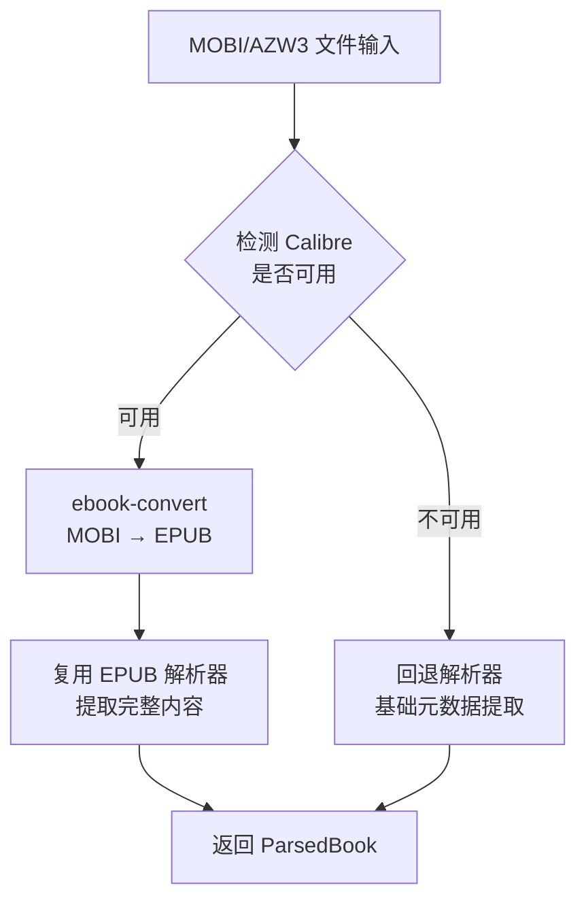
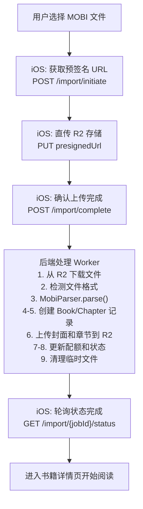
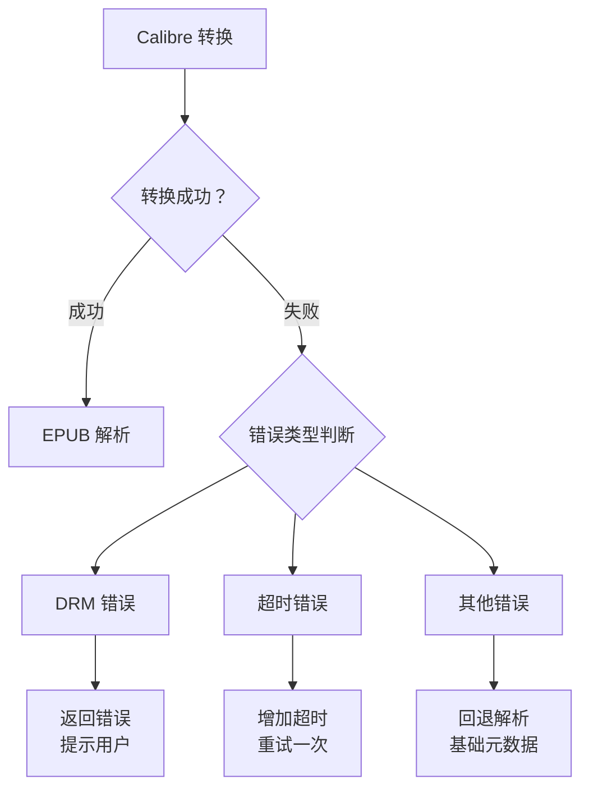

# MOBI/AZW3 格式电子书导入详细设计文档

> 文档版本: v1.0
> 创建日期: 2025-12-28
> 状态: 已实现

---

## 目录

1. [概述](#一概述)
2. [格式技术分析](#二格式技术分析)
3. [技术方案选型](#三技术方案选型)
4. [后端实现设计](#四后端实现设计)
5. [iOS 客户端适配](#五ios-客户端适配)
6. [API 设计](#六api-设计)
7. [解析流程详解](#七解析流程详解)
8. [错误处理策略](#八错误处理策略)
9. [性能优化](#九性能优化)
10. [测试策略](#十测试策略)
11. [部署与运维](#十一部署与运维)
12. [附录](#十二附录)

---

## 一、概述

### 1.1 背景

MOBI 和 AZW3 是 Amazon Kindle 设备使用的专有电子书格式。许多用户拥有大量 Kindle 格式的电子书，希望能够在 Readmigo 中阅读这些书籍并使用 AI 辅助功能。

### 1.2 目标

- 支持用户导入 MOBI、AZW、AZW3 格式的电子书
- 保持与现有 EPUB 导入流程一致的用户体验
- 实现完整的元数据提取和章节解析
- 支持与平台书籍相同的阅读器功能

### 1.3 范围

| 项目 | 包含 | 不包含 |
|-----|------|--------|
| 文件格式 | MOBI, AZW, AZW3 | KFX (Kindle Format 10) |
| DRM | 无 DRM 保护的书籍 | DRM 加密书籍 |
| 内容类型 | 文本书籍 | 杂志、漫画等固定布局 |

### 1.4 当前实现状态

| 模块 | 状态 | 说明 |
|-----|------|------|
| 后端 MOBI 解析器 | ✅ 已完成 | `scripts/book-ingestion/processors/mobi-parser.ts` |
| iOS 客户端支持 | ✅ 已完成 | MIME 类型、文件选择器已更新 |
| 格式转换 | ✅ 已完成 | Calibre ebook-convert 集成 |
| 回退解析 | ✅ 已完成 | 基础元数据提取 |

---

## 二、格式技术分析

### 2.1 MOBI 格式概述

MOBI (Mobipocket) 是基于 PalmDOC 数据库格式的电子书格式，由 Mobipocket SA 开发，后被 Amazon 收购。

```
MOBI 文件结构:
┌─────────────────────────────────────┐
│         PDB Header (78 bytes)        │  ← 数据库头，包含基本信息
├─────────────────────────────────────┤
│      Record Info List (8 × N)        │  ← 记录索引表
├─────────────────────────────────────┤
│        PalmDOC Header (16 bytes)     │  ← 压缩信息
├─────────────────────────────────────┤
│         MOBI Header (≥232 bytes)     │  ← 格式版本、编码等
├─────────────────────────────────────┤
│      EXTH Header (Optional)          │  ← 扩展元数据（作者、描述等）
├─────────────────────────────────────┤
│         Text Records                 │  ← 压缩的文本内容
├─────────────────────────────────────┤
│         Image Records                │  ← 图片资源
├─────────────────────────────────────┤
│          Other Records               │  ← 其他资源（字体等）
└─────────────────────────────────────┘
```

### 2.2 AZW3/KF8 格式概述

AZW3 (也称为 KF8 - Kindle Format 8) 是 Amazon 推出的增强格式，本质上是一个容器文件：

```
AZW3 文件结构:
┌─────────────────────────────────────┐
│       PDB/MOBI Container             │
├─────────────────────────────────────┤
│    ┌─────────────────────────────┐  │
│    │       RESC Section          │  │  ← 资源部分
│    │  ┌─────────────────────┐   │  │
│    │  │   EPUB-like Content │   │  │  ← 类似 EPUB 的 HTML/CSS
│    │  └─────────────────────┘   │  │
│    └─────────────────────────────┘  │
└─────────────────────────────────────┘
```

### 2.3 关键技术参数

| 参数 | MOBI | AZW3 |
|-----|------|------|
| 文件标识符 | `BOOKMOBI` / `TEXtREAd` | `BOOKMOBI` + KF8 标记 |
| 压缩方式 | PalmDOC (LZ77 变体) | 无压缩 / PalmDOC |
| HTML 版本 | 基础 HTML | HTML5 + CSS3 |
| 图片格式 | JPEG, GIF | JPEG, GIF, PNG |
| 最大文件大小 | 无限制 | 无限制 |
| DRM 支持 | Mobipocket DRM | Amazon DRM (ADEPT) |

### 2.4 EXTH 记录类型（元数据）

---

## 三、技术方案选型

### 3.1 方案对比

| 方案 | 描述 | 优点 | 缺点 | 推荐度 |
|-----|------|------|------|--------|
| **Calibre 转换** | 使用 Calibre 转 EPUB | 完整支持、稳定可靠 | 需安装依赖 | ★★★★★ |
| **纯 JS 解析** | 自研 MOBI 解析器 | 无外部依赖 | 开发成本高、兼容性差 | ★★☆☆☆ |
| **KindleUnpack** | Python 库解包 | 功能完整 | Python 依赖、性能一般 | ★★★☆☆ |
| **mobi-js** | npm 库解析 | 易集成 | 功能有限、不活跃 | ★★☆☆☆ |

### 3.2 最终方案：Calibre 转换 + 回退解析



### 3.3 方案优势

1. **完整性**: Calibre 是业界最成熟的电子书转换工具，支持几乎所有边缘情况
2. **可维护性**: 复用现有 EPUB 解析器，减少代码重复
3. **容错性**: 提供回退机制，即使 Calibre 不可用也能提取基础信息
4. **扩展性**: 未来可轻松添加其他格式支持

---

## 四、后端实现设计

### 4.1 模块架构

```
scripts/book-ingestion/processors/
├── epub-parser.ts          # EPUB 解析器（核心）
├── mobi-parser.ts          # MOBI/AZW3 解析器（新增）
└── index.ts                # 统一导出

src/modules/user-books/
├── processors/
│   └── book-processor.ts   # 书籍处理入口
└── ...
```

### 4.2 MobiParser 类设计

### 4.3 MOBI Header 解析

### 4.4 格式检测工具

### 4.5 书籍处理入口

---

## 五、iOS 客户端适配

### 5.1 支持的文件类型

### 5.2 MIME 类型映射

### 5.3 格式徽章显示

### 5.4 用户界面流程

```
┌─────────────────────────────────────────────────────────────┐
│                      导入界面                                │
├─────────────────────────────────────────────────────────────┤
│                                                             │
│           ┌──────────────────────────────────┐              │
│           │          📥 导入                  │              │
│           │      Import Your Books           │              │
│           └──────────────────────────────────┘              │
│                                                             │
│           ┌──────────────────────────────────┐              │
│           │ 📂  从文件导入                    │              │
│           │     Select from your files       │              │
│           └──────────────────────────────────┘              │
│                                                             │
│           ┌──────────────────────────────────┐              │
│           │ 支持的格式:                       │              │
│           │                                  │              │
│           │ [EPUB] [TXT] [PDF] [MOBI] [AZW3] │              │
│           │                                  │              │
│           └──────────────────────────────────┘              │
│                                                             │
└─────────────────────────────────────────────────────────────┘
```

---

## 六、API 设计

### 6.1 导入发起 API

```http
POST /api/user-books/import/initiate

Request:
{
  "filename": "kindle-book.mobi",
  "fileSize": 5242880,
  "contentType": "application/x-mobipocket-ebook",
  "md5": "abc123..."  // optional
}

Response:
{
  "jobId": "uuid",
  "uploadUrl": "https://r2.../presigned-url",
  "uploadKey": "user-uploads/{userId}/{jobId}/kindle-book.mobi",
  "expiresIn": 600
}

支持的 Content-Type:
- application/epub+zip
- text/plain
- application/pdf
- application/x-mobipocket-ebook     ← MOBI
- application/vnd.amazon.ebook       ← AZW/AZW3
- application/octet-stream           ← 通用二进制
```

### 6.2 格式验证逻辑

### 6.3 文件大小限制

| 格式 | 最大文件大小 | 说明 |
|-----|-------------|------|
| EPUB | 100 MB | 标准限制 |
| TXT | 50 MB | 纯文本 |
| PDF | 100 MB | 可能包含图片 |
| MOBI | 100 MB | 与 EPUB 相同 |
| AZW3 | 100 MB | 与 EPUB 相同 |

---

## 七、解析流程详解

### 7.1 完整流程图



### 7.2 Calibre 转换命令

### 7.3 转换时间预估

| 文件大小 | 预估转换时间 | 说明 |
|---------|-------------|------|
| < 1 MB | < 5 秒 | 小型书籍 |
| 1-5 MB | 5-15 秒 | 中型书籍 |
| 5-20 MB | 15-45 秒 | 大型书籍 |
| 20-50 MB | 45-90 秒 | 特大书籍 |
| > 50 MB | > 90 秒 | 可能超时 |

### 7.4 进度更新节点

---

## 八、错误处理策略

### 8.1 错误类型分类

### 8.2 错误处理映射

| 错误类型 | 用户提示 | 处理策略 |
|---------|---------|---------|
| `FILE_NOT_FOUND` | "文件不存在，请重新上传" | 重试上传 |
| `UNSUPPORTED_FORMAT` | "不支持的文件格式" | 引导用户转换 |
| `DRM_PROTECTED` | "此书籍受版权保护，无法导入" | 说明限制 |
| `CONVERSION_FAILED` | "文件转换失败，请确认文件完整性" | 尝试回退解析 |
| `CONVERSION_TIMEOUT` | "文件处理超时，请尝试较小的文件" | 建议拆分 |
| `PARSE_FAILED` | "文件解析失败，格式可能损坏" | 建议重新下载 |
| `INVALID_STRUCTURE` | "文件结构异常" | 回退解析 |

### 8.3 DRM 检测

### 8.4 错误恢复流程



---

## 九、性能优化

### 9.1 并发处理

### 9.2 临时文件管理

### 9.3 内存管理

---

## 十、测试策略

### 10.1 单元测试

### 10.2 集成测试

### 10.3 测试文件集

| 文件名 | 格式 | 大小 | 测试目的 |
|-------|------|------|---------|
| `sample-minimal.mobi` | MOBI | < 100 KB | 基础解析 |
| `sample-with-images.mobi` | MOBI | 1-5 MB | 图片提取 |
| `sample-chinese.mobi` | MOBI | 1-2 MB | 中文编码 |
| `sample-large.mobi` | MOBI | > 20 MB | 大文件处理 |
| `sample-azw3.azw3` | AZW3 | 1-5 MB | KF8 格式 |
| `sample-drm.mobi` | MOBI | - | DRM 检测 |
| `sample-corrupt.mobi` | MOBI | - | 错误处理 |

---

## 十一、部署与运维

### 11.1 服务器依赖安装

### 11.2 Docker 部署

### 11.3 监控指标

### 11.4 告警规则

| 指标 | 阈值 | 严重级别 |
|-----|------|---------|
| 导入成功率 | < 90% | P2 |
| 平均转换时间 | > 60s | P3 |
| 回退率 | > 10% | P2 |
| 队列积压 | > 50 | P1 |

### 11.5 日志记录

---

## 十二、附录

### A. MOBI 格式规范参考

- [MobileRead Wiki - MOBI](https://wiki.mobileread.com/wiki/MOBI)
- [MobileRead Wiki - PDB](https://wiki.mobileread.com/wiki/PDB)
- [EXTH Records](https://wiki.mobileread.com/wiki/MOBI#EXTH_Header)

### B. Calibre 相关资源

- [Calibre 官网](https://calibre-ebook.com/)
- [ebook-convert 命令参考](https://manual.calibre-ebook.com/generated/en/ebook-convert.html)
- [Calibre FAQ](https://calibre-ebook.com/help)

### C. 相关文档

- [local-import.md](./local-import.md) - 本地文件导入功能完整方案
- [book-formats-analysis.md](./book-formats-analysis.md) - 电子书格式分析
- [epub-architecture.md](./epub-architecture.md) - EPUB 架构设计
- [user-book-import-status.md](../ios/user-book-import-status.md) - iOS 导入功能状态

### D. 版本历史

| 版本 | 日期 | 变更说明 |
|-----|------|---------|
| v1.0 | 2025-12-28 | 初始版本，Calibre 转换方案 |

---

## 总结

MOBI/AZW3 格式支持已完整实现，采用 **Calibre 转换 + EPUB 解析** 的技术方案：

1. **后端**：`MobiParser` 类实现转换和解析逻辑
2. **回退**：无 Calibre 时提供基础元数据提取
3. **iOS**：已更新文件选择器和 MIME 类型支持
4. **用户体验**：与 EPUB 导入流程一致

主要限制：
- 需要服务器安装 Calibre
- 不支持 DRM 保护的书籍
- 大文件转换可能较慢
