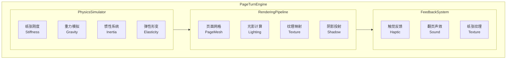

# 物理级翻页动画系统

> 目标: 实现业界最逼真的翻页动画，包含物理模拟、光影效果、声音反馈

---

## 架构概述

---

## 翻页模式全集

---

## 物理仿真翻页引擎

> 独创功能：真实物理模拟

---

## 3D 渲染管线

使用 Metal 着色器实现逼真的光影效果：

---

## 翻页声效系统

---

## 触觉反馈系统

---

## 翻页设置

---

## 相关文档

- [渲染引擎](./rendering-engine.md) - 多格式渲染引擎设计
- [字体管理](./font-management.md) - 超级字体管理系统
- [阅读器架构](./architecture.md) - 核心架构设计

---

*最后更新: 2025-12-26*
