# 多格式渲染引擎

> 目标: 支持业界最全的电子书格式，远超 Kindle 的格式支持

---

## 架构概述

```mermaid
flowchart TD
    subgraph Engine["UniversalBookEngine"]
        FD["FormatDetector<br>自动检测文件格式（魔数检测 + 扩展名 + 内容分析）"]
        FD --> Parsers

        subgraph Parsers["格式解析器矩阵"]
            EP["EPUBParser<br>(主力引擎)"]
            PP["PDFParser<br>(PDFKit+自研渲染)"]
            TP["TXTParser<br>(智能排版)"]
            MP["MOBIParser<br>(兼容Kindle)"]
            CP["CBZParser<br>(漫画优化)"]
            FB["FB2Parser<br>(俄语书籍)"]
            HP["HTMLParser<br>(网页书籍)"]
            RP["RTFParser<br>(富文本)"]
            DP["DOCXParser<br>(Office)"]
            AP["AZWParser<br>(Amazon)"]
        end

        Parsers --> UCM["UnifiedContentModel<br>统一的内容模型：章节 + 段落 + 样式 + 媒体 + 元数据"]

        UCM --> Renderers

        subgraph Renderers["渲染引擎选择器"]
            WK["WKWebView<br>(流式内容)"]
            PR["PDFRenderer<br>(固定版式)"]
            IR["ImageRenderer<br>(漫画/图片书)"]
        end
    end
```

---

## 支持格式详情

| 格式 | 优先级 | 渲染方式 | 特色功能 | 竞品对比 |
|------|--------|----------|----------|----------|
| **EPUB3** | P0 | WKWebView | 完整 EPUB3 支持，音视频、交互式内容 | ✅ 超越 Apple Books |
| **EPUB2** | P0 | WKWebView | 向后兼容，自动升级渲染 | ✅ 完全支持 |
| **PDF** | P0 | PDFKit + 自研 | 重排模式、夜间模式、批注 | ✅ 超越 Kindle |
| **TXT** | P0 | WKWebView | 智能分章、段落识别、编码检测 | ✅ 超越所有竞品 |
| **MOBI** | P1 | 转换 + WKWebView | 完美兼容 Kindle 书籍 | ✅ 独有功能 |
| **AZW/AZW3** | P1 | 转换 + WKWebView | Amazon 格式支持 | ✅ 独有功能 |
| **CBZ/CBR** | P1 | ImageRenderer | 漫画优化，双页模式 | ✅ 超越专业漫画App |
| **FB2** | P2 | 转换 + WKWebView | 俄语书籍支持 | ✅ 独有功能 |
| **HTML** | P2 | WKWebView | 网页书籍，自动清洁 | ✅ 完全支持 |
| **RTF** | P2 | 转换 + WKWebView | 富文本支持 | ✅ 独有功能 |
| **DOCX** | P3 | 转换 + WKWebView | Office 文档阅读 | ✅ 独有功能 |

---

## 核心数据模型

---

## 格式检测器

---

## PDF 渲染引擎

> 独创功能：PDF 重排模式

---

## TXT 智能渲染引擎

> 功能：智能编码检测、智能章节检测、智能段落格式化

---

## 漫画阅读引擎

> 功能：智能双页拼接、页面切割、条漫模式

---

## 格式转换器

---

## 相关文档

- [格式支持](./format-support.md) - 支持的电子书格式
- [翻页动画](./page-turning.md) - 物理级翻页动画系统
- [字体管理](./font-management.md) - 超级字体管理系统
- [阅读器架构](./architecture.md) - 核心架构设计

---

*最后更新: 2025-12-26*
