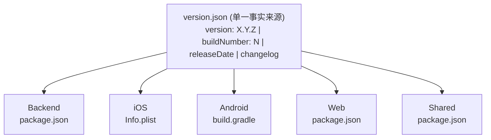

# Readmigo 版本发布历史

> 全栈版本管理 | 功能快照 | Bug 追溯

---

## 一、版本管理规范



### 1.1 版本号规范

| 组成部分 | 说明 | 递增时机 |
|----------|------|----------|
| **MAJOR** (X) | 主版本号 | 破坏性变更、重大功能重构 |
| **MINOR** (Y) | 次版本号 | 新功能添加 (向后兼容) |
| **PATCH** (Z) | 修订号 | Bug 修复、小改进 |
| **Build** (N) | 构建号 | 每次构建递增 |

### 1.2 版本文件位置

| 平台/模块 | 文件路径 | 版本字段 |
|-----------|----------|----------|
| **统一来源** | `/version.json` | version, buildNumber |
| Backend | `/apps/backend/package.json` | version |
| iOS | `/ios/Readmigo/Info.plist` | CFBundleShortVersionString, CFBundleVersion |
| Android | `/android/app/build.gradle` | versionName, versionCode |
| Web | `/apps/web/package.json` | version |
| Shared | `/packages/shared/package.json` | version |
| Database | `/packages/database/package.json` | version |

### 1.3 版本同步命令

```bash
# 递增版本号
pnpm version:patch    # 1.0.0 → 1.0.1
pnpm version:minor    # 1.0.0 → 1.1.0
pnpm version:major    # 1.0.0 → 2.0.0
pnpm version:build    # 仅递增 build 号

# 同步到所有平台
pnpm sync:version
```

---

## 二、版本发布记录

### 版本快照索引

| 版本 | 发布日期 | 类型 | 主要变更 | 快照链接 |
|------|----------|------|----------|----------|
| **v1.0.0** | 2024-12-21 | 大版本 | 首次发布 | [详情](#v100---首次发布) |

---

## v1.0.0 - 首次发布

> 发布日期: 2024-12-21 | Build: 1 | 类型: 大版本 (Major)

### 版本信息

```
┌─────────────────────────────────────────────────────────────────────────────────────┐
│                              v1.0.0 版本配置                                          │
├─────────────────────────────────────────────────────────────────────────────────────┤
│                                                                                       │
│   version.json:                                                                       │
│   ┌─────────────────────────────────────────────────────────────────────────────┐   │
│   │  version: "1.0.0"                                                            │   │
│   │  buildNumber: 1                                                              │   │
│   │  releaseDate: "2024-12-21"                                                   │   │
│   │  minSupportedVersion: "1.0.0"                                                │   │
│   │  changelog: { en: "Initial release", zh: "首次发布" }                         │   │
│   └─────────────────────────────────────────────────────────────────────────────┘   │
│                                                                                       │
└─────────────────────────────────────────────────────────────────────────────────────┘
```

### 各端版本号

| 平台 | 版本号 | Build/Code | 状态 |
|------|--------|------------|------|
| Backend | 1.0.0 | - | - |
| iOS | 1.0.0 | Build 1 | - |
| Android | 1.0.0 | versionCode 1 | - |
| Web | 0.1.0 | - | 开发中 |

### 技术栈快照

```
┌─────────────────────────────────────────────────────────────────────────────────────┐
│                              v1.0.0 技术栈                                            │
├─────────────────────────────────────────────────────────────────────────────────────┤
│                                                                                       │
│   移动端                        后端                         基础设施                 │
│   ┌─────────────────┐         ┌─────────────────┐         ┌─────────────────┐       │
│   │ React Native    │         │ NestJS 10.4.0   │         │ PostgreSQL      │       │
│   │ 0.81.5          │         │ Node.js ≥20.0.0 │         │ Prisma 5.22.0   │       │
│   │                 │         │                 │         │                 │       │
│   │ Expo 54.0.30    │         │ TypeScript 5.x  │         │ Fly.io          │       │
│   └─────────────────┘         └─────────────────┘         └─────────────────┘       │
│                                                                                       │
│   Web                          包管理                                                 │
│   ┌─────────────────┐         ┌─────────────────┐                                   │
│   │ Next.js 16.1.1  │         │ pnpm 9.14.2     │                                   │
│   │ React 19.2.3    │         │                 │                                   │
│   └─────────────────┘         └─────────────────┘                                   │
│                                                                                       │
└─────────────────────────────────────────────────────────────────────────────────────┘
```

### 功能模块快照

#### iOS 客户端功能

| 模块 | 功能 | 状态 |
|------|------|:----:|
| **首页 (Discover)** | 书籍推荐、分类浏览、搜索 | ✅ |
| **书架 (Library)** | 我的书籍、阅读进度、收藏 | ✅ |
| **阅读器** | 章节阅读、进度同步、笔记高亮 | ✅ |
| **社区 (Agora)** | 书评、动态、讨论 | ✅ |
| **个人中心 (Me)** | 用户信息、设置、偏好 | ✅ |
| **认证** | 登录、注册、游客模式 | ✅ |

#### Android 客户端功能

| 模块 | 功能 | 状态 |
|------|------|:----:|
| **首页 (Discover)** | 书籍推荐、分类浏览、搜索 | ✅ |
| **书架 (Library)** | 我的书籍、阅读进度、收藏 | ✅ |
| **阅读器** | 章节阅读、进度同步、笔记高亮 | ✅ |
| **社区 (Agora)** | 书评、动态、讨论 | ✅ |
| **个人中心 (Me)** | 用户信息、设置、偏好 | ✅ |
| **认证** | 登录、注册、游客模式 | ✅ |

#### Backend API 模块

| 模块 | 端点前缀 | 功能 |
|------|----------|------|
| **认证** | `/api/v1/auth` | 登录、注册、Token 管理 |
| **用户** | `/api/v1/users` | 用户信息、偏好设置 |
| **书籍** | `/api/v1/books` | 书籍列表、详情、搜索 |
| **章节** | `/api/v1/chapters` | 章节内容、阅读进度 |
| **书架** | `/api/v1/library` | 用户书架管理 |
| **社区** | `/api/v1/agora` | 书评、动态、评论 |
| **作者** | `/api/v1/authors` | 作者信息、金句 |
| **健康检查** | `/api/v1/health` | 服务状态 |

### 数据库 Schema 版本

| 表/模型 | 状态 | 备注 |
|---------|:----:|------|
| User | ✅ | 用户基础信息 |
| Book | ✅ | 书籍元数据 |
| Chapter | ✅ | 章节内容 |
| Author | ✅ | 作者信息 |
| Quote | ✅ | 作者金句 |
| ReadingProgress | ✅ | 阅读进度 |
| Bookmark | ✅ | 书签 |
| Highlight | ✅ | 高亮笔记 |
| Post | ✅ | 社区动态 |
| Comment | ✅ | 评论 |

### Git 信息

| 项目 | 值 |
|------|-----|
| 分支 | main |
| Tag | v1.0.0 |
| 最近提交 | - |

### 已知问题 & 限制

| 问题 | 描述 | 优先级 |
|------|------|:------:|
| - | - | - |

---

## 三、版本追溯指南

### 3.1 查询特定版本代码

```bash
# 切换到特定版本
git checkout v1.0.0

# 查看版本 tag 列表
git tag -l "v*"

# 查看版本详情
git show v1.0.0
```

### 3.2 版本对比

```bash
# 对比两个版本的差异
git diff v1.0.0..v1.1.0

# 查看版本间的提交记录
git log v1.0.0..v1.1.0 --oneline
```

### 3.3 Bug 追溯


---

## 四、新版本发布模板

发布新版本时，复制以下模板并填写:

```markdown
## vX.Y.Z - 版本标题

> 发布日期: YYYY-MM-DD | Build: N | 类型: 大版本/小版本

### 版本信息

| 平台 | 版本号 | Build/Code |
|------|--------|------------|
| Backend | X.Y.Z | - |
| iOS | X.Y.Z | Build N |
| Android | X.Y.Z | versionCode N |
| Web | X.Y.Z | - |

### 变更内容

#### 新功能
-

#### 改进
-

#### Bug 修复
-

### Git 信息

| 项目 | 值 |
|------|-----|
| Tag | vX.Y.Z |
| 基准分支 | main |
| 发布提交 | <commit-hash> |

### 已知问题
-
```

---

## 五、相关文档

| 文档 | 描述 |
|------|------|
| [P004-fullstack-release.md](../pipeline/P004-fullstack-release.md) | 全栈发版流水线 |
| [pipeline-system.md](../pipeline/pipeline-system.md) | 流水线系统总览 |
| `/version.json` | 版本配置文件 |
| `/scripts/bump-version.js` | 版本递增脚本 |
| `/scripts/sync-version.sh` | 版本同步脚本 |
