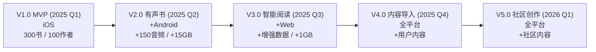
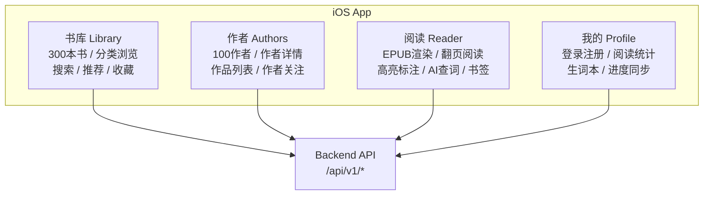
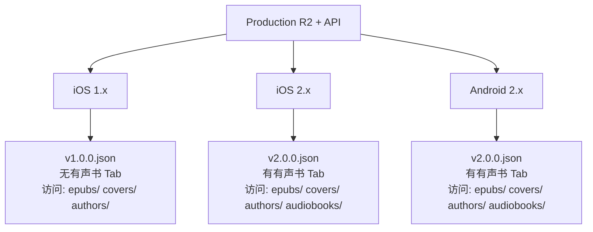
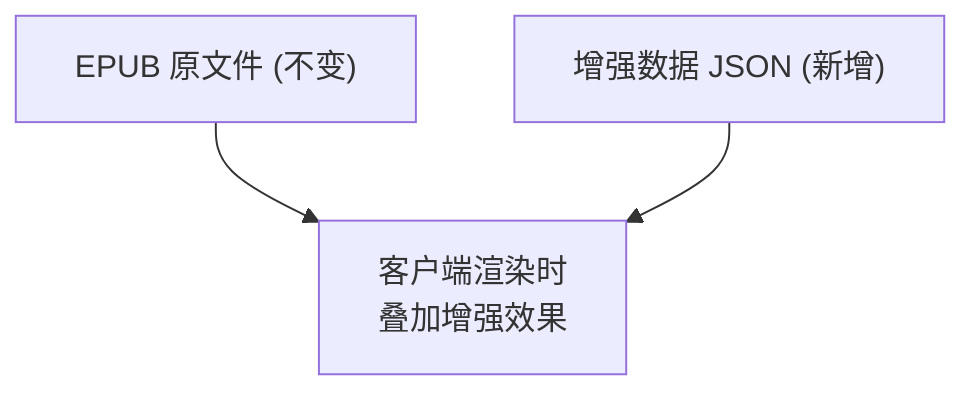
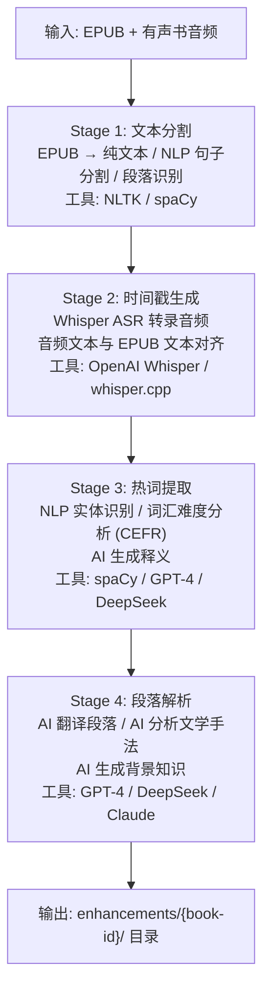
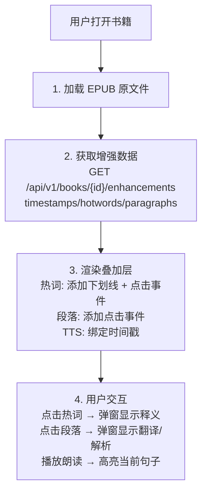
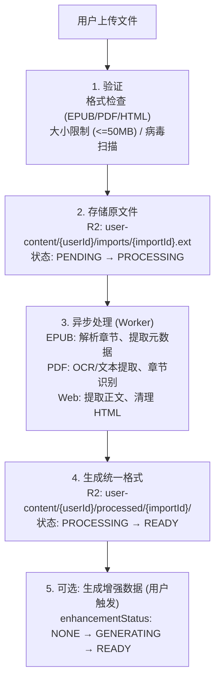

# Readmigo 完整版本路线图 V1-V5

> 全栈产品演进规划 | 平台扩展 | 存储策略 | API 版本管理

---

## 一、版本全景总览

### 1.1 版本定义

| 版本 | 代号 | 核心目标 | 平台 | 发布时间 |
|------|------|----------|------|----------|
| **V1.0** | Foundation | 电子书阅读 MVP | iOS | 2025 Q1 |
| **V2.0** | Audio | 有声书 + Android | iOS + Android | 2025 Q2 |
| **V3.0** | Smart | 智能阅读增强 + Web | 全平台 | 2025 Q3 |
| **V4.0** | Import | 用户内容导入 | 全平台 | 2025 Q4 |
| **V5.0** | Community | 社区与创作 | 全平台 | 2026 Q1 |

### 1.2 平台支持矩阵

| 版本 | iOS | Android | Web App | Dashboard |
|------|:---:|:-------:|:-------:|:---------:|
| V1.0 | ✅ | ❌ | ❌ | ✅ |
| V2.0 | ✅ | ✅ | ❌ | ✅ |
| V3.0 | ✅ | ✅ | ✅ | ✅ |
| V4.0 | ✅ | ✅ | ✅ | ✅ |
| V5.0 | ✅ | ✅ | ✅ | ✅ |

---

## 二、V1.0 - Foundation (电子书 MVP)

### 2.1 功能范围

### 2.2 内容规模

| 内容类型 | 数量 | 来源 | 说明 |
|----------|------|------|------|
| 电子书 | 300 本 | Standard Ebooks | P0核心 + P1高优先 |
| 作者 | 100 位 | Wikidata | 文学巨匠 + 热门作家 |
| 章节 | ~5,000 章 | EPUB 解析 | 自动提取 |
| 分类 | 15 个 | 预定义 | 冻结 |

### 2.3 API 端点

| 模块 | 端点 | 方法 | 说明 |
|------|------|------|------|
| 认证 | /auth/apple | POST | Apple 登录 |
| | /auth/google | POST | Google 登录 |
| | /auth/guest | POST | 游客登录 |
| 书籍 | /books | GET | 书籍列表 |
| | /books/:id | GET | 书籍详情 |
| | /books/:id/chapters | GET | 章节列表 |
| | /books/:id/content | GET | 章节内容 |
| 作者 | /authors | GET | 作者列表 |
| | /authors/:id | GET | 作者详情 |
| 阅读 | /reading/progress | GET/PATCH | 阅读进度 |
| | /reading/stats | GET | 阅读统计 |
| 词汇 | /vocabulary | GET/POST | 生词本 |
| AI | /ai/explain | POST | 词汇解释 |
| | /ai/translate | POST | 翻译 |
| 版本 | /version/check | GET | 版本检查 |

### 2.4 R2 存储结构

### 2.5 发布检查清单

---

## 三、V2.0 - Audio (有声书 + Android)

### 3.1 功能范围

### 3.2 内容增量

| 内容类型 | V1 数量 | V2 新增 | V2 总计 |
|----------|---------|---------|---------|
| 电子书 | 300 本 | 0 | 300 本 |
| 作者 | 100 位 | 0 | 100 位 |
| 有声书 | 0 | 150 本 | 150 本 |
| 音频章节 | 0 | ~1,500 章 | ~1,500 章 |

### 3.3 新增 API 端点

| 模块 | 端点 | 方法 | 说明 |
|------|------|------|------|
| 有声书 | /audiobooks | GET | 有声书列表 |
| | /audiobooks/:id | GET | 有声书详情 |
| | /audiobooks/:id/chapters | GET | 章节列表 |
| | /audiobooks/:id/progress | GET/PATCH | 播放进度 |
| | /audiobooks/:id/download | GET | 下载链接 |

### 3.4 R2 存储增量

### 3.5 版本清单对比

### 3.6 多版本客户端并存

### 3.7 发布检查清单

---

## 四、V3.0 - Smart (智能阅读 + Web)

### 4.1 功能范围

### 4.2 核心设计原则

### 4.3 增强数据结构

### 4.4 增强数据详细格式

#### timestamps.json (边读边听)

#### hotwords.json (热词标注)

#### paragraphs.json (段落解析)

### 4.5 数据生成流水线

### 4.6 存储估算

| 数据类型 | 单书大小 | 300 书总量 |
|----------|----------|------------|
| timestamps.json | ~500KB | ~150MB |
| hotwords.json | ~1MB | ~300MB |
| paragraphs.json | ~2MB | ~600MB |
| TTS 人声 (可选) | ~50MB | ~15GB |
| **总计 (无人声)** | ~3.5MB | **~1GB** |
| **总计 (含人声)** | ~53MB | **~16GB** |

### 4.7 客户端渲染流程

### 4.8 发布检查清单

---

## 五、V4.0 - Import (用户内容导入)

### 5.1 功能范围

### 5.2 存储架构

### 5.3 数据模型

### 5.4 导入处理流程

### 5.5 存储配额

| 用户等级 | 导入数量 | 总存储 | 增强数据 |
|----------|----------|--------|----------|
| 免费用户 | 5 本 | 100MB | 不支持 |
| 订阅用户 | 50 本 | 1GB | 5 本/月 |
| 高级用户 | 无限 | 10GB | 无限 |

### 5.6 新增 API 端点

| 端点 | 方法 | 说明 |
|------|------|------|
| /imports | POST | 上传文件 |
| /imports | GET | 导入列表 |
| /imports/:id | GET | 导入详情 |
| /imports/:id | DELETE | 删除导入 |
| /imports/:id/content | GET | 获取内容 |
| /imports/:id/enhance | POST | 生成增强数据 |

---

## 六、V5.0 - Community (社区与创作)

### 6.1 功能范围

### 6.2 存储架构

### 6.3 数据模型

### 6.4 富文本格式 (ProseMirror/TipTap)

### 6.5 新增 API 端点

| 模块 | 端点 | 方法 | 说明 |
|------|------|------|------|
| 博客 | /posts | GET/POST | 文章列表/创建 |
| | /posts/:id | GET/PATCH/DELETE | 文章操作 |
| 划线 | /highlight-shares | GET/POST | 划线分享 |
| 想法 | /thoughts | GET/POST | 想法列表/创建 |
| 评论 | /comments | GET/POST | 评论操作 |
| 日志 | /journals | GET/POST | 日志操作 |
| Feed | /feed | GET | 社区动态流 |
| | /feed/following | GET | 关注动态 |

---

## 七、存储总览

### 7.1 各版本存储增量

### 7.2 版本清单演进

| 版本 | content.ebooks | content.audiobooks | content.enhancements | features |
|------|----------------|--------------------|-----------------------|----------|
| V1 | 300 | 0 | - | 基础阅读 |
| V2 | 300 | 150 | - | +有声书 |
| V3 | 300 | 150 | 300 | +智能阅读 |
| V4 | 300 | 150 | 300 | +用户导入 |
| V5 | 300 | 150 | 300 | +社区创作 |

---

## 八、API 版本策略

### 8.1 统一 API 版本

### 8.2 破坏性变更处理

如果需要破坏性 API 变更:

---

## 九、小版本 (Minor Version) 策略

### 9.1 版本命名规范

### 9.2 小版本全景图

```mermaid
flowchart TD
    subgraph V1["V1.x Foundation"]
        V10["1.0.0<br>MVP"] --> V11["1.1.0<br>阅读增强"] --> V12["1.2.0<br>AI优化"] --> V13["1.3.0<br>个人中心"] --> V14["1.4.0<br>稳定化"]
        V10 -.-> P10["iOS"]
        V11 -.-> P11["iOS"]
        V12 -.-> P12["iOS"]
        V13 -.-> P13["iOS"]
        V14 -.-> P14["iOS"]
    end
    subgraph V2["V2.x Audio"]
        V20["2.0.0<br>有声书"] --> V21["2.1.0<br>Android"] --> V22["2.2.0<br>播放增强"] --> V23["2.3.0<br>离线下载"] --> V24["2.4.0<br>关联优化"]
        V20 -.-> P20["iOS"]
        V21 -.-> P21["iOS+Andr"]
        V22 -.-> P22["iOS+Andr"]
        V23 -.-> P23["iOS+Andr"]
        V24 -.-> P24["iOS+Andr"]
    end
    subgraph V3["V3.x Smart"]
        V30["3.0.0<br>系统TTS"] --> V31["3.1.0<br>热词标注"] --> V32["3.2.0<br>段落解析"] --> V33["3.3.0<br>边读边听"] --> V34["3.4.0<br>Web App"]
        V30 -.-> P30["iOS+Andr"]
        V31 -.-> P31["iOS+Andr"]
        V32 -.-> P32["iOS+Andr"]
        V33 -.-> P33["iOS+Andr"]
        V34 -.-> P34["全平台"]
    end
    subgraph V4["V4.x Import"]
        V40["4.0.0<br>EPUB导入"] --> V41["4.1.0<br>PDF导入"] --> V42["4.2.0<br>网页保存"] --> V43["4.3.0<br>导入增强"] --> V44["4.4.0<br>批量同步"]
        V40 -.-> P40["全平台"]
        V41 -.-> P41["全平台"]
        V42 -.-> P42["全平台"]
        V43 -.-> P43["全平台"]
        V44 -.-> P44["全平台"]
    end
    subgraph V5["V5.x Community"]
        V50["5.0.0<br>划线分享"] --> V51["5.1.0<br>想法动态"] --> V52["5.2.0<br>评论系统"] --> V53["5.3.0<br>博客功能"] --> V54["5.4.0<br>个人日志"]
        V50 -.-> P50["全平台"]
        V51 -.-> P51["全平台"]
        V52 -.-> P52["全平台"]
        V53 -.-> P53["全平台"]
        V54 -.-> P54["全平台"]
    end
```

### 9.3 V1.x 小版本详细规划

| 版本 | 代号 | 核心功能 | 内容增量 | 平台 |
|------|------|----------|----------|------|
| **1.0.0** | MVP | 核心阅读体验 | 300书/100作者 | iOS |
| **1.1.0** | Reader+ | 阅读器增强 | - | iOS |
| **1.2.0** | AI | AI功能优化 | - | iOS |
| **1.3.0** | Profile | 个人中心增强 | - | iOS |
| **1.4.0** | Stable | 稳定性优化 | - | iOS |

#### V1.0.0 - MVP (首发)

#### V1.1.0 - Reader+ (阅读器增强)

#### V1.2.0 - AI (AI功能优化)

#### V1.3.0 - Profile (个人中心增强)

#### V1.4.0 - Stable (稳定性优化)

### 9.4 V2.x 小版本详细规划

| 版本 | 代号 | 核心功能 | 内容增量 | 平台 |
|------|------|----------|----------|------|
| **2.0.0** | Audio | 有声书基础 | +150有声书 | iOS |
| **2.1.0** | Android | Android发布 | - | iOS+Android |
| **2.2.0** | Player+ | 播放器增强 | - | iOS+Android |
| **2.3.0** | Offline | 离线下载 | - | iOS+Android |
| **2.4.0** | Link | 书籍关联 | - | iOS+Android |

#### V2.0.0 - Audio (有声书基础)

#### V2.1.0 - Android (Android客户端)

#### V2.2.0 - Player+ (播放器增强)

#### V2.3.0 - Offline (离线下载)

#### V2.4.0 - Link (书籍关联优化)

### 9.5 V3.x 小版本详细规划

| 版本 | 代号 | 核心功能 | 数据增量 | 平台 |
|------|------|----------|----------|------|
| **3.0.0** | TTS | 系统TTS朗读 | - | iOS+Android |
| **3.1.0** | Hotword | 热词标注 | +hotwords.json | iOS+Android |
| **3.2.0** | Paragraph | 段落解析 | +paragraphs.json | iOS+Android |
| **3.3.0** | ReadAlong | 边读边听 | +timestamps.json | iOS+Android |
| **3.4.0** | WebApp | Web应用 | - | 全平台 |

#### V3.0.0 - TTS (系统TTS)

#### V3.1.0 - Hotword (热词标注)

#### V3.2.0 - Paragraph (段落解析)

#### V3.3.0 - ReadAlong (边读边听)

#### V3.4.0 - WebApp (Web应用)

### 9.6 V4.x 小版本详细规划

| 版本 | 代号 | 核心功能 | 存储增量 | 平台 |
|------|------|----------|----------|------|
| **4.0.0** | ImportEPUB | EPUB导入 | user-content/ | 全平台 |
| **4.1.0** | ImportPDF | PDF导入 | +PDF处理 | 全平台 |
| **4.2.0** | WebClip | 网页保存 | +网页内容 | 全平台 |
| **4.3.0** | UserEnhance | 导入增强 | +用户增强数据 | 全平台 |
| **4.4.0** | Sync | 批量同步 | - | 全平台 |

#### V4.0.0 - ImportEPUB (EPUB导入)

#### V4.1.0 - ImportPDF (PDF导入)

#### V4.2.0 - WebClip (网页保存)

#### V4.3.0 - UserEnhance (导入内容增强)

#### V4.4.0 - Sync (批量同步)

### 9.7 V5.x 小版本详细规划

| 版本 | 代号 | 核心功能 | 存储增量 | 平台 |
|------|------|----------|----------|------|
| **5.0.0** | Share | 划线分享 | community/highlights/ | 全平台 |
| **5.1.0** | Thought | 想法动态 | community/thoughts/ | 全平台 |
| **5.2.0** | Comment | 评论系统 | +评论数据 | 全平台 |
| **5.3.0** | Blog | 博客功能 | community/posts/ | 全平台 |
| **5.4.0** | Journal | 个人日志 | community/journals/ | 全平台 |

#### V5.0.0 - Share (划线分享)

#### V5.1.0 - Thought (想法动态)

#### V5.2.0 - Comment (评论系统)

#### V5.3.0 - Blog (博客功能)

#### V5.4.0 - Journal (个人日志)

### 9.8 Manifest 版本对应关系

### 9.9 Manifest v3.json 示例

### 9.10 客户端兼容性策略

### 9.11 小版本数据增量策略

### 9.12 小版本发布流程

### 9.13 Patch版本策略

---

## 十、执行优先级

---

*文档版本: 2.0*
*创建日期: 2025-12-31*
*更新日期: 2025-12-31*
*状态: 规划中*
