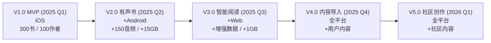
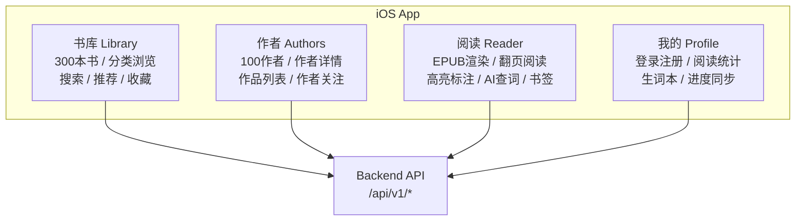
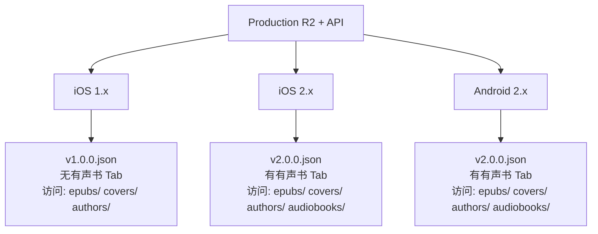
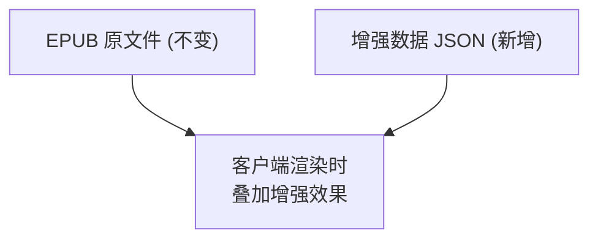
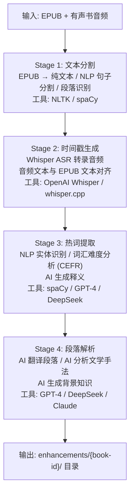
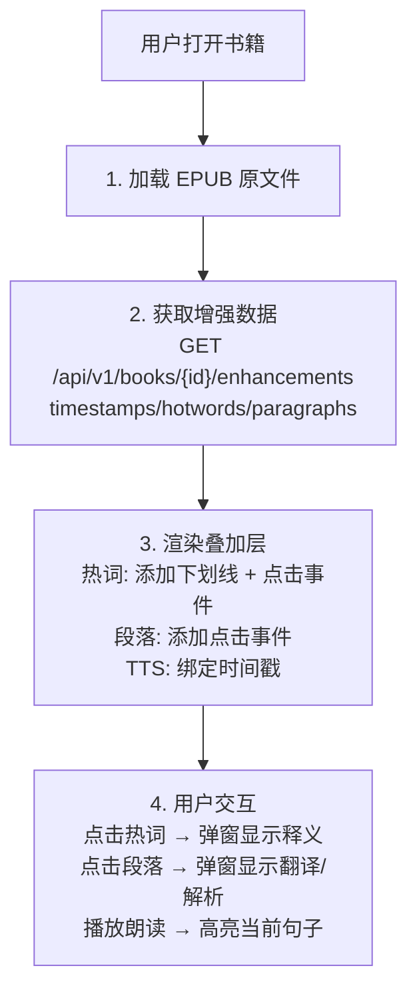
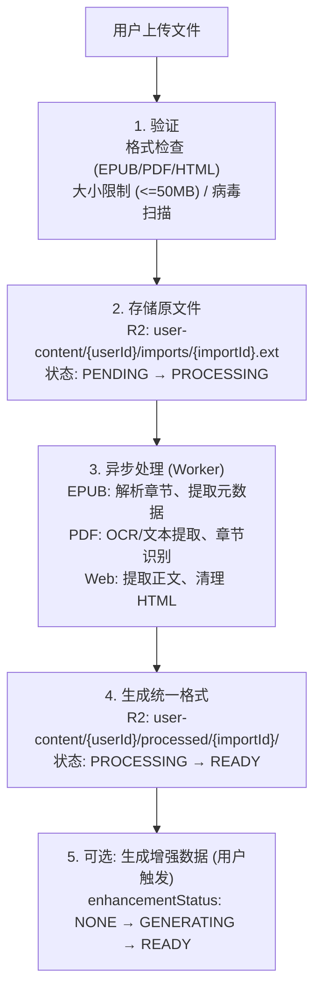

# Readmigo 完整版本路线图 V1-V5

> 全栈产品演进规划 | 平台扩展 | 存储策略 | API 版本管理

---

## 一、版本全景总览



### 1.1 版本定义

| 版本 | 代号 | 核心目标 | 平台 | 发布时间 |
|------|------|----------|------|----------|
| **V1.0** | Foundation | 电子书阅读 MVP | iOS | 2025 Q1 |
| **V2.0** | Audio | 有声书 + Android | iOS + Android | 2025 Q2 |
| **V3.0** | Smart | 智能阅读增强 + Web | 全平台 | 2025 Q3 |
| **V4.0** | Import | 用户内容导入 | 全平台 | 2025 Q4 |
| **V5.0** | Community | 社区与创作 | 全平台 | 2026 Q1 |

### 1.2 平台支持矩阵

| 版本 | iOS | Android | Web App | Dashboard |
|------|:---:|:-------:|:-------:|:---------:|
| V1.0 | ✅ | ❌ | ❌ | ✅ |
| V2.0 | ✅ | ✅ | ❌ | ✅ |
| V3.0 | ✅ | ✅ | ✅ | ✅ |
| V4.0 | ✅ | ✅ | ✅ | ✅ |
| V5.0 | ✅ | ✅ | ✅ | ✅ |

---

## 二、V1.0 - Foundation (电子书 MVP)

### 2.1 功能范围



### 2.2 内容规模

| 内容类型 | 数量 | 来源 | 说明 |
|----------|------|------|------|
| 电子书 | 300 本 | Standard Ebooks | P0核心 + P1高优先 |
| 作者 | 100 位 | Wikidata | 文学巨匠 + 热门作家 |
| 章节 | ~5,000 章 | EPUB 解析 | 自动提取 |
| 分类 | 15 个 | 预定义 | 冻结 |

### 2.3 API 端点

| 模块 | 端点 | 方法 | 说明 |
|------|------|------|------|
| 认证 | /auth/apple | POST | Apple 登录 |
| | /auth/google | POST | Google 登录 |
| | /auth/guest | POST | 游客登录 |
| 书籍 | /books | GET | 书籍列表 |
| | /books/:id | GET | 书籍详情 |
| | /books/:id/chapters | GET | 章节列表 |
| | /books/:id/content | GET | 章节内容 |
| 作者 | /authors | GET | 作者列表 |
| | /authors/:id | GET | 作者详情 |
| 阅读 | /reading/progress | GET/PATCH | 阅读进度 |
| | /reading/stats | GET | 阅读统计 |
| 词汇 | /vocabulary | GET/POST | 生词本 |
| AI | /ai/explain | POST | 词汇解释 |
| | /ai/translate | POST | 翻译 |
| 版本 | /version/check | GET | 版本检查 |

### 2.4 R2 存储结构

```
readmigo/                          # Production Bucket
├── manifests/
│   └── v1.0.0.json               # V1 版本清单
│
├── epubs/                         # 电子书文件
│   └── {book-id}.epub            # 300 个文件, ~150MB
│
├── covers/
│   └── books/                     # 书籍封面
│       ├── {book-id}.jpg         # 原图
│       └── {book-id}-thumb.jpg   # 缩略图
│                                  # 300 × 2 = 600 文件, ~60MB
│
└── authors/                       # 作者资源
    └── {author-id}/
        ├── portrait.jpg
        └── portrait-thumb.jpg
                                   # 100 × 2 = 200 文件, ~20MB

总计: ~230MB
```

### 2.5 发布检查清单

```
□ 数据准备
  □ 300 本电子书导入完成
  □ 100 位作者信息完整
  □ EPUB 文件上传 R2
  □ 封面图片上传 R2
  □ 章节解析正确

□ 功能验证
  □ 书籍列表加载
  □ 阅读器功能
  □ 高亮标注
  □ AI 查词
  □ 进度同步
  □ 登录流程

□ 发布准备
  □ Production 环境部署
  □ v1.0.0 manifest 上传
  □ App Store 提审
  □ 创建 Git Tag
```

---

## 三、V2.0 - Audio (有声书 + Android)

### 3.1 功能范围

```
┌─────────────────────────────────────────────────────────────────┐
│                      V2.0 新增功能                               │
├─────────────────────────────────────────────────────────────────┤
│                                                                   │
│   V1.0 全部功能 ────────────────────────────────────────────►   │
│                                                                   │
│   ┌───────────────────────────────────────────────────────────┐ │
│   │                   新增: 有声书模块                         │ │
│   ├───────────────────────────────────────────────────────────┤ │
│   │                                                             │ │
│   │   ┌─────────────┐     ┌─────────────┐                     │ │
│   │   │  有声书列表  │     │  播放器界面  │                     │ │
│   │   │             │     │             │                     │ │
│   │   │ • 150本音频 │ ──► │ • 播放/暂停 │                     │ │
│   │   │ • 分类筛选  │     │ • 进度条    │                     │ │
│   │   │ • 书电关联  │     │ • 变速播放  │                     │ │
│   │   └─────────────┘     │ • 章节切换  │                     │ │
│   │                       │ • 睡眠定时  │                     │ │
│   │                       │ • 后台播放  │                     │ │
│   │                       │ • 离线下载  │                     │ │
│   │                       └─────────────┘                     │ │
│   │                                                             │ │
│   └───────────────────────────────────────────────────────────┘ │
│                                                                   │
│   ┌───────────────────────────────────────────────────────────┐ │
│   │                   新增: Android 客户端                     │ │
│   ├───────────────────────────────────────────────────────────┤ │
│   │   • Kotlin + Jetpack Compose                              │ │
│   │   • 与 iOS 功能对等                                       │ │
│   │   • Material Design 3                                     │ │
│   │   • Google Play 发布                                      │ │
│   └───────────────────────────────────────────────────────────┘ │
│                                                                   │
└─────────────────────────────────────────────────────────────────┘
```

### 3.2 内容增量

| 内容类型 | V1 数量 | V2 新增 | V2 总计 |
|----------|---------|---------|---------|
| 电子书 | 300 本 | 0 | 300 本 |
| 作者 | 100 位 | 0 | 100 位 |
| 有声书 | 0 | 150 本 | 150 本 |
| 音频章节 | 0 | ~1,500 章 | ~1,500 章 |

### 3.3 新增 API 端点

| 模块 | 端点 | 方法 | 说明 |
|------|------|------|------|
| 有声书 | /audiobooks | GET | 有声书列表 |
| | /audiobooks/:id | GET | 有声书详情 |
| | /audiobooks/:id/chapters | GET | 章节列表 |
| | /audiobooks/:id/progress | GET/PATCH | 播放进度 |
| | /audiobooks/:id/download | GET | 下载链接 |

### 3.4 R2 存储增量

```
readmigo/
├── manifests/
│   ├── v1.0.0.json               # 保留
│   └── v2.0.0.json               # 新增
│
├── epubs/                         # 复用 V1
├── covers/
│   ├── books/                     # 复用 V1
│   └── audiobooks/                # 新增: 有声书封面
│       └── {audiobook-id}.jpg    # 150 文件, ~30MB
│
├── authors/                       # 复用 V1
│
└── audiobooks/                    # 新增: 音频文件
    └── {audiobook-id}/
        ├── chapter-01.mp3
        ├── chapter-02.mp3
        └── ...
                                   # 150 × 10章 × 50MB = ~15GB

V2 新增存储: ~15GB
V2 累计存储: ~15.2GB
```

### 3.5 版本清单对比

```json
// v1.0.0.json
{
  "version": "1.0.0",
  "content": {
    "ebooks": { "count": 300, "enabled": true },
    "authors": { "count": 100, "enabled": true },
    "audiobooks": { "count": 0, "enabled": false }
  },
  "features": {
    "audiobooks": false
  }
}

// v2.0.0.json
{
  "version": "2.0.0",
  "content": {
    "ebooks": { "count": 300, "enabled": true },
    "authors": { "count": 100, "enabled": true },
    "audiobooks": { "count": 150, "enabled": true }  // 新增
  },
  "features": {
    "audiobooks": true  // 启用
  }
}
```

### 3.6 多版本客户端并存



### 3.7 发布检查清单

```
□ 有声书数据
  □ 150 本有声书导入
  □ 音频文件上传 R2 (~15GB)
  □ Book ↔ Audiobook 关联
  □ 章节信息完整

□ Android 客户端
  □ 功能与 iOS 对等
  □ 性能测试通过
  □ Google Play 提审

□ iOS 更新
  □ 有声书 Tab 启用
  □ 播放器功能完整
  □ App Store 更新

□ 发布准备
  □ v2.0.0 manifest 上传
  □ 版本 API 配置更新
```

---

## 四、V3.0 - Smart (智能阅读 + Web)

### 4.1 功能范围

```
┌─────────────────────────────────────────────────────────────────┐
│                      V3.0 新增功能                               │
├─────────────────────────────────────────────────────────────────┤
│                                                                   │
│   V2.0 全部功能 ────────────────────────────────────────────►   │
│                                                                   │
│   ┌───────────────────────────────────────────────────────────┐ │
│   │                   新增: 智能阅读增强                       │ │
│   ├───────────────────────────────────────────────────────────┤ │
│   │                                                             │ │
│   │   ┌─────────────────────────────────────────────────────┐ │ │
│   │   │  TTS 朗读                                            │ │ │
│   │   │  • 系统 TTS 实时朗读 (免费)                         │ │ │
│   │   │  • 高质量人声朗读 (订阅)                            │ │ │
│   │   │  • 可调语速 0.5x - 2x                               │ │ │
│   │   └─────────────────────────────────────────────────────┘ │ │
│   │                                                             │ │
│   │   ┌─────────────────────────────────────────────────────┐ │ │
│   │   │  边读边听 (Read Along)                               │ │ │
│   │   │  • 朗读时高亮当前句子                               │ │ │
│   │   │  • 单词级高亮 (可选)                                │ │ │
│   │   │  • 点击句子跳转播放                                 │ │ │
│   │   └─────────────────────────────────────────────────────┘ │ │
│   │                                                             │ │
│   │   ┌─────────────────────────────────────────────────────┐ │ │
│   │   │  热词标注 (Hotwords)                                 │ │ │
│   │   │  • 重要词汇预先下划线                               │ │ │
│   │   │  • 人名/地名/术语识别                               │ │ │
│   │   │  • 点击显示释义弹窗                                 │ │ │
│   │   └─────────────────────────────────────────────────────┘ │ │
│   │                                                             │ │
│   │   ┌─────────────────────────────────────────────────────┐ │ │
│   │   │  段落解析 (Paragraph Analysis)                       │ │ │
│   │   │  • 点击段落显示翻译                                 │ │ │
│   │   │  • 文学手法分析                                     │ │ │
│   │   │  • 背景知识补充                                     │ │ │
│   │   └─────────────────────────────────────────────────────┘ │ │
│   │                                                             │ │
│   └───────────────────────────────────────────────────────────┘ │
│                                                                   │
│   ┌───────────────────────────────────────────────────────────┐ │
│   │                   新增: Web App                            │ │
│   ├───────────────────────────────────────────────────────────┤ │
│   │   • Next.js + React                                       │ │
│   │   • PWA 支持 (可安装)                                     │ │
│   │   • 响应式设计                                            │ │
│   │   • 与移动端功能对等                                      │ │
│   └───────────────────────────────────────────────────────────┘ │
│                                                                   │
└─────────────────────────────────────────────────────────────────┘
```

### 4.2 核心设计原则



### 4.3 增强数据结构

```
readmigo/
├── manifests/
│   ├── v1.0.0.json
│   ├── v2.0.0.json
│   └── v3.0.0.json               # 新增
│
├── epubs/                         # 复用
├── covers/                        # 复用
├── authors/                       # 复用
├── audiobooks/                    # 复用
│
└── enhancements/                  # V3 新增: 增强数据
    └── {book-id}/
        ├── meta.json             # 增强数据元信息
        ├── timestamps.json       # 时间戳 (边读边听)
        ├── hotwords.json         # 热词标注
        ├── paragraphs.json       # 段落解析
        └── tts/                  # 人声音频 (可选)
            ├── chapter-01.mp3
            └── chapter-02.mp3
```

### 4.4 增强数据详细格式

#### timestamps.json (边读边听)

```json
{
  "bookId": "book-042",
  "version": "1.0",
  "generatedAt": "2025-06-01T00:00:00Z",
  "source": "whisper-v3",
  "chapters": [
    {
      "chapterId": "chapter-01",
      "sentences": [
        {
          "index": 0,
          "text": "It was the best of times...",
          "startTime": 0.0,
          "endTime": 3.5,
          "startOffset": 0,
          "endOffset": 28,
          "words": [
            { "word": "It", "start": 0.0, "end": 0.2 },
            { "word": "was", "start": 0.25, "end": 0.5 }
          ]
        }
      ]
    }
  ]
}
// 大小: ~500KB/书
```

#### hotwords.json (热词标注)

```json
{
  "bookId": "book-042",
  "version": "1.0",
  "wordCount": 1523,
  "categories": {
    "vocabulary": 800,
    "person": 120,
    "place": 85,
    "concept": 200,
    "literary": 318
  },
  "chapters": [
    {
      "chapterId": "chapter-01",
      "hotwords": [
        {
          "word": "epoch",
          "category": "vocabulary",
          "cefrLevel": "C1",
          "positions": [
            { "startOffset": 15, "endOffset": 20 }
          ],
          "definition": {
            "en": "a period of time in history",
            "zh": "时代，纪元"
          },
          "pronunciation": "/ˈiːpɒk/"
        },
        {
          "word": "Mr. Lorry",
          "category": "person",
          "positions": [...],
          "description": {
            "en": "A banker at Tellson's Bank",
            "zh": "台尔森银行的银行家"
          },
          "role": "supporting"
        }
      ]
    }
  ]
}
// 大小: ~1MB/书
```

#### paragraphs.json (段落解析)

```json
{
  "bookId": "book-042",
  "version": "1.0",
  "chapters": [
    {
      "chapterId": "chapter-01",
      "paragraphs": [
        {
          "index": 0,
          "startOffset": 0,
          "endOffset": 450,
          "translation": {
            "zh": "那是最美好的时代..."
          },
          "analysis": {
            "summary": "Opening parallelism establishing duality",
            "literaryDevices": ["antithesis", "anaphora"],
            "themes": ["duality", "revolution"],
            "difficulty": "intermediate"
          },
          "context": {
            "historicalNote": "Refers to the French Revolution period",
            "authorIntent": "Dickens establishes moral complexity"
          }
        }
      ]
    }
  ]
}
// 大小: ~2MB/书
```

### 4.5 数据生成流水线



### 4.6 存储估算

| 数据类型 | 单书大小 | 300 书总量 |
|----------|----------|------------|
| timestamps.json | ~500KB | ~150MB |
| hotwords.json | ~1MB | ~300MB |
| paragraphs.json | ~2MB | ~600MB |
| TTS 人声 (可选) | ~50MB | ~15GB |
| **总计 (无人声)** | ~3.5MB | **~1GB** |
| **总计 (含人声)** | ~53MB | **~16GB** |

### 4.7 客户端渲染流程



### 4.8 发布检查清单

```
□ 增强数据生成
  □ 300 本书时间戳生成
  □ 300 本书热词提取
  □ 300 本书段落解析
  □ 上传到 R2 enhancements/

□ Web App
  □ Next.js 应用部署
  □ PWA 配置完成
  □ 功能与移动端对等
  □ 性能优化

□ 移动端更新
  □ 智能阅读功能集成
  □ 边读边听实现
  □ 热词渲染
  □ 段落弹窗

□ 发布准备
  □ v3.0.0 manifest 上传
  □ 新增 API 端点测试
```

---

## 五、V4.0 - Import (用户内容导入)

### 5.1 功能范围

```
┌─────────────────────────────────────────────────────────────────┐
│                      V4.0 新增功能                               │
├─────────────────────────────────────────────────────────────────┤
│                                                                   │
│   V3.0 全部功能 ────────────────────────────────────────────►   │
│                                                                   │
│   ┌───────────────────────────────────────────────────────────┐ │
│   │                   新增: 内容导入                           │ │
│   ├───────────────────────────────────────────────────────────┤ │
│   │                                                             │ │
│   │   支持格式:                                                │ │
│   │   ┌─────────┐  ┌─────────┐  ┌─────────┐                  │ │
│   │   │  EPUB   │  │   PDF   │  │ 网页文章 │                  │ │
│   │   │         │  │         │  │         │                  │ │
│   │   │ 直接解析 │  │ 转换处理 │  │ 内容提取 │                  │ │
│   │   └─────────┘  └─────────┘  └─────────┘                  │ │
│   │                                                             │ │
│   │   处理流程:                                                │ │
│   │   上传 ──► 验证 ──► 存储 ──► 异步处理 ──► 可阅读           │ │
│   │                                                             │ │
│   │   可选增强:                                                │ │
│   │   • 热词标注生成 (订阅功能)                                │ │
│   │   • 段落翻译生成 (订阅功能)                                │ │
│   │   • TTS 音频生成 (订阅功能)                                │ │
│   │                                                             │ │
│   └───────────────────────────────────────────────────────────┘ │
│                                                                   │
└─────────────────────────────────────────────────────────────────┘
```

### 5.2 存储架构

```
readmigo/
├── [V1-V3 目录复用]
│
└── user-content/                  # V4 新增: 用户内容
    └── {user-id}/
        │
        ├── imports/               # 导入的原文件
        │   ├── {import-id}.epub
        │   ├── {import-id}.pdf
        │   └── {import-id}.html
        │
        ├── processed/             # 处理后的统一格式
        │   └── {import-id}/
        │       ├── content.json   # 元数据
        │       ├── chapters/      # 章节内容
        │       │   ├── 01.html
        │       │   └── 02.html
        │       └── cover.jpg
        │
        └── enhancements/          # 导入内容的增强数据
            └── {import-id}/
                ├── hotwords.json
                ├── paragraphs.json
                └── tts/
```

### 5.3 数据模型

```
┌─────────────────────────────────────────────────────────────────┐
│                     UserImport 数据模型                          │
├─────────────────────────────────────────────────────────────────┤
│                                                                   │
│  UserImport                                                      │
│  ├── id: UUID                                                    │
│  ├── userId: String                                              │
│  ├── type: EPUB | PDF | WEB                                      │
│  ├── title: String                                               │
│  ├── author: String?                                             │
│  ├── originalUrl: String?                                        │
│  ├── originalFileName: String?                                   │
│  ├── fileSize: Int                                               │
│  ├── wordCount: Int                                              │
│  ├── language: String                                            │
│  │                                                               │
│  ├── storageKey: String            # R2 原文件路径              │
│  ├── processedKey: String?         # R2 处理后路径              │
│  ├── coverKey: String?             # R2 封面路径                │
│  │                                                               │
│  ├── status: PENDING | PROCESSING | READY | FAILED              │
│  ├── enhancementStatus: NONE | GENERATING | READY               │
│  │                                                               │
│  ├── createdAt: DateTime                                         │
│  └── updatedAt: DateTime                                         │
│                                                                   │
└─────────────────────────────────────────────────────────────────┘
```

### 5.4 导入处理流程



### 5.5 存储配额

| 用户等级 | 导入数量 | 总存储 | 增强数据 |
|----------|----------|--------|----------|
| 免费用户 | 5 本 | 100MB | 不支持 |
| 订阅用户 | 50 本 | 1GB | 5 本/月 |
| 高级用户 | 无限 | 10GB | 无限 |

### 5.6 新增 API 端点

| 端点 | 方法 | 说明 |
|------|------|------|
| /imports | POST | 上传文件 |
| /imports | GET | 导入列表 |
| /imports/:id | GET | 导入详情 |
| /imports/:id | DELETE | 删除导入 |
| /imports/:id/content | GET | 获取内容 |
| /imports/:id/enhance | POST | 生成增强数据 |

---

## 六、V5.0 - Community (社区与创作)

### 6.1 功能范围

```
┌─────────────────────────────────────────────────────────────────┐
│                      V5.0 新增功能                               │
├─────────────────────────────────────────────────────────────────┤
│                                                                   │
│   V4.0 全部功能 ────────────────────────────────────────────►   │
│                                                                   │
│   ┌───────────────────────────────────────────────────────────┐ │
│   │                   新增: 社区与创作                         │ │
│   ├───────────────────────────────────────────────────────────┤ │
│   │                                                             │ │
│   │   ┌─────────┐  ┌─────────┐  ┌─────────┐  ┌─────────┐     │ │
│   │   │  博客   │  │划线分享 │  │  想法   │  │  日志   │     │ │
│   │   │  Blog   │  │Highlight│  │ Thought │  │ Journal │     │ │
│   │   └────┬────┘  └────┬────┘  └────┬────┘  └────┬────┘     │ │
│   │        │            │            │            │           │ │
│   │        ▼            ▼            ▼            ▼           │ │
│   │   • 富文本编辑  • 分享精彩段落 • 短内容分享  • 私密日记    │ │
│   │   • 插入图片   • 添加评论    • 图片+标签   • 阅读记录    │ │
│   │   • 关联书籍   • 公开/私密   • 互动点赞    • 心情标签    │ │
│   │   • 标签分类                                              │ │
│   │                                                             │ │
│   │   ┌───────────────────────────────────────────────────┐   │ │
│   │   │                   评论系统                         │   │ │
│   │   │   • 对博客/想法/划线评论                          │   │ │
│   │   │   • 支持图片                                      │   │ │
│   │   │   • 支持回复                                      │   │ │
│   │   │   • 点赞互动                                      │   │ │
│   │   └───────────────────────────────────────────────────┘   │ │
│   │                                                             │ │
│   └───────────────────────────────────────────────────────────┘ │
│                                                                   │
└─────────────────────────────────────────────────────────────────┘
```

### 6.2 存储架构

```
readmigo/
├── [V1-V4 目录复用]
│
└── community/                     # V5 新增: 社区内容
    │
    ├── posts/                     # 博客文章
    │   └── {post-id}/
    │       ├── content.json      # 富文本内容
    │       └── images/
    │           └── {image-id}.jpg
    │
    ├── highlights/                # 划线分享
    │   └── {share-id}.json
    │
    ├── thoughts/                  # 想法
    │   └── {thought-id}/
    │       ├── content.json
    │       └── images/
    │
    └── journals/                  # 个人日志 (私密)
        └── {user-id}/
            └── {date}/
                ├── entry.json
                └── images/
```

### 6.3 数据模型

```
┌─────────────────────────────────────────────────────────────────┐
│                       V5 数据模型                                │
├─────────────────────────────────────────────────────────────────┤
│                                                                   │
│  Post (博客)                      HighlightShare (划线分享)      │
│  ├── id                           ├── id                         │
│  ├── userId                       ├── userId                     │
│  ├── title                        ├── highlightId                │
│  ├── content: JSON (富文本)       ├── bookId                     │
│  ├── excerpt                      ├── selectedText               │
│  ├── coverImage                   ├── comment                    │
│  ├── tags[]                       ├── tags[]                     │
│  ├── bookId?                      ├── likeCount                  │
│  ├── visibility                   └── createdAt                  │
│  ├── likeCount                                                   │
│  ├── commentCount                 Thought (想法)                 │
│  └── createdAt                    ├── id                         │
│                                   ├── userId                     │
│  Comment (评论)                   ├── content (≤500字)           │
│  ├── id                           ├── bookId?                    │
│  ├── userId                       ├── tags[]                     │
│  ├── targetType                   ├── images[] (≤4张)            │
│  ├── targetId                     ├── likeCount                  │
│  ├── content                      └── createdAt                  │
│  ├── images[] (≤2张)                                            │
│  ├── parentId? (回复)             Journal (日志)                 │
│  ├── likeCount                    ├── id                         │
│  └── createdAt                    ├── userId                     │
│                                   ├── date                       │
│                                   ├── content: JSON              │
│                                   ├── mood                       │
│                                   ├── readingTime                │
│                                   ├── images[]                   │
│                                   └── isEncrypted                │
│                                                                   │
└─────────────────────────────────────────────────────────────────┘
```

### 6.4 富文本格式 (ProseMirror/TipTap)

```json
{
  "type": "doc",
  "content": [
    {
      "type": "heading",
      "attrs": { "level": 1 },
      "content": [{ "type": "text", "text": "读书笔记标题" }]
    },
    {
      "type": "paragraph",
      "content": [
        { "type": "text", "text": "正文内容，" },
        { "type": "text", "marks": [{ "type": "bold" }], "text": "加粗" }
      ]
    },
    {
      "type": "blockquote",
      "content": [...],
      "attrs": {
        "bookId": "book-042",
        "highlightId": "highlight-123"
      }
    },
    {
      "type": "image",
      "attrs": {
        "src": "community/posts/{post-id}/images/{image-id}.jpg",
        "alt": "图片描述"
      }
    }
  ]
}
```

### 6.5 新增 API 端点

| 模块 | 端点 | 方法 | 说明 |
|------|------|------|------|
| 博客 | /posts | GET/POST | 文章列表/创建 |
| | /posts/:id | GET/PATCH/DELETE | 文章操作 |
| 划线 | /highlight-shares | GET/POST | 划线分享 |
| 想法 | /thoughts | GET/POST | 想法列表/创建 |
| 评论 | /comments | GET/POST | 评论操作 |
| 日志 | /journals | GET/POST | 日志操作 |
| Feed | /feed | GET | 社区动态流 |
| | /feed/following | GET | 关注动态 |

---

## 七、存储总览

### 7.1 各版本存储增量

```
┌─────────────────────────────────────────────────────────────────┐
│                      存储增量汇总                                │
├─────────────────────────────────────────────────────────────────┤
│                                                                   │
│  版本      存储目录               增量        累计               │
│  ────────────────────────────────────────────────────────────   │
│  V1.0     /epubs                  150MB                         │
│           /covers/books            60MB                         │
│           /authors                 20MB                         │
│           ────────────────────────────────                      │
│           小计                    230MB      230MB              │
│                                                                   │
│  V2.0     /audiobooks             15GB                          │
│           /covers/audiobooks       30MB                         │
│           ────────────────────────────────                      │
│           小计                    ~15GB      ~15.2GB            │
│                                                                   │
│  V3.0     /enhancements           ~1GB (无人声)                 │
│           ────────────────────────────────                      │
│           小计                    ~1GB       ~16.2GB            │
│                                                                   │
│  V4.0     /user-content           用户驱动                      │
│           ────────────────────────────────                      │
│           估算 (1K用户×100MB)     ~100GB     ~116GB             │
│                                                                   │
│  V5.0     /community              用户驱动                      │
│           ────────────────────────────────                      │
│           估算 (1K用户×50MB)      ~50GB      ~166GB             │
│                                                                   │
└─────────────────────────────────────────────────────────────────┘
```

### 7.2 版本清单演进

| 版本 | content.ebooks | content.audiobooks | content.enhancements | features |
|------|----------------|--------------------|-----------------------|----------|
| V1 | 300 | 0 | - | 基础阅读 |
| V2 | 300 | 150 | - | +有声书 |
| V3 | 300 | 150 | 300 | +智能阅读 |
| V4 | 300 | 150 | 300 | +用户导入 |
| V5 | 300 | 150 | 300 | +社区创作 |

---

## 八、API 版本策略

### 8.1 统一 API 版本

```
┌─────────────────────────────────────────────────────────────────┐
│                     API 版本策略                                 │
├─────────────────────────────────────────────────────────────────┤
│                                                                   │
│   所有版本 (V1-V5) 共用 /api/v1                                  │
│                                                                   │
│   通过 manifest features 控制客户端功能:                         │
│                                                                   │
│   V1: { audiobooks: false, smartReading: false, ... }           │
│   V2: { audiobooks: true, smartReading: false, ... }            │
│   V3: { audiobooks: true, smartReading: true, ... }             │
│   V4: { audiobooks: true, smartReading: true, import: true }    │
│   V5: { ..., community: true }                                  │
│                                                                   │
│   API 兼容性规则:                                                │
│   ✅ 新增端点                                                    │
│   ✅ 新增可选字段                                                │
│   ❌ 删除现有端点/字段                                           │
│   ❌ 修改响应结构                                                │
│                                                                   │
└─────────────────────────────────────────────────────────────────┘
```

### 8.2 破坏性变更处理

如果需要破坏性 API 变更:

```
1. 创建 /api/v2 新版本
2. v1 维护至 v2 发布后 12 个月
3. 通过 version/check API 推送强制更新
```

---

## 九、小版本 (Minor Version) 策略

### 9.1 版本命名规范

```
┌─────────────────────────────────────────────────────────────────┐
│                    语义化版本 (Semantic Versioning)               │
├─────────────────────────────────────────────────────────────────┤
│                                                                   │
│   格式: MAJOR.MINOR.PATCH                                        │
│                                                                   │
│   ┌────────────────┬─────────────────┬────────────────────────┐ │
│   │     MAJOR      │      MINOR      │         PATCH          │ │
│   ├────────────────┼─────────────────┼────────────────────────┤ │
│   │  大版本 (1-5)  │  功能迭代 (0-4) │    Bug修复/热修复      │ │
│   │  重大功能集    │  增量功能       │    不含新功能          │ │
│   │  可能不兼容    │  向后兼容       │    完全兼容            │ │
│   └────────────────┴─────────────────┴────────────────────────┘ │
│                                                                   │
│   示例:                                                          │
│   1.0.0 → V1 首发 (iOS MVP)                                     │
│   1.1.0 → V1 第一个功能迭代                                     │
│   1.1.3 → V1.1 的第3个Bug修复                                   │
│   2.0.0 → V2 大版本发布 (有声书)                                │
│                                                                   │
└─────────────────────────────────────────────────────────────────┘
```

### 9.2 小版本全景图

```mermaid
flowchart TD
    subgraph V1["V1.x Foundation"]
        V10["1.0.0<br>MVP"] --> V11["1.1.0<br>阅读增强"] --> V12["1.2.0<br>AI优化"] --> V13["1.3.0<br>个人中心"] --> V14["1.4.0<br>稳定化"]
        V10 -.-> P10["iOS"]
        V11 -.-> P11["iOS"]
        V12 -.-> P12["iOS"]
        V13 -.-> P13["iOS"]
        V14 -.-> P14["iOS"]
    end
    subgraph V2["V2.x Audio"]
        V20["2.0.0<br>有声书"] --> V21["2.1.0<br>Android"] --> V22["2.2.0<br>播放增强"] --> V23["2.3.0<br>离线下载"] --> V24["2.4.0<br>关联优化"]
        V20 -.-> P20["iOS"]
        V21 -.-> P21["iOS+Andr"]
        V22 -.-> P22["iOS+Andr"]
        V23 -.-> P23["iOS+Andr"]
        V24 -.-> P24["iOS+Andr"]
    end
    subgraph V3["V3.x Smart"]
        V30["3.0.0<br>系统TTS"] --> V31["3.1.0<br>热词标注"] --> V32["3.2.0<br>段落解析"] --> V33["3.3.0<br>边读边听"] --> V34["3.4.0<br>Web App"]
        V30 -.-> P30["iOS+Andr"]
        V31 -.-> P31["iOS+Andr"]
        V32 -.-> P32["iOS+Andr"]
        V33 -.-> P33["iOS+Andr"]
        V34 -.-> P34["全平台"]
    end
    subgraph V4["V4.x Import"]
        V40["4.0.0<br>EPUB导入"] --> V41["4.1.0<br>PDF导入"] --> V42["4.2.0<br>网页保存"] --> V43["4.3.0<br>导入增强"] --> V44["4.4.0<br>批量同步"]
        V40 -.-> P40["全平台"]
        V41 -.-> P41["全平台"]
        V42 -.-> P42["全平台"]
        V43 -.-> P43["全平台"]
        V44 -.-> P44["全平台"]
    end
    subgraph V5["V5.x Community"]
        V50["5.0.0<br>划线分享"] --> V51["5.1.0<br>想法动态"] --> V52["5.2.0<br>评论系统"] --> V53["5.3.0<br>博客功能"] --> V54["5.4.0<br>个人日志"]
        V50 -.-> P50["全平台"]
        V51 -.-> P51["全平台"]
        V52 -.-> P52["全平台"]
        V53 -.-> P53["全平台"]
        V54 -.-> P54["全平台"]
    end
```



### 9.3 V1.x 小版本详细规划

| 版本 | 代号 | 核心功能 | 内容增量 | 平台 |
|------|------|----------|----------|------|
| **1.0.0** | MVP | 核心阅读体验 | 300书/100作者 | iOS |
| **1.1.0** | Reader+ | 阅读器增强 | - | iOS |
| **1.2.0** | AI | AI功能优化 | - | iOS |
| **1.3.0** | Profile | 个人中心增强 | - | iOS |
| **1.4.0** | Stable | 稳定性优化 | - | iOS |

#### V1.0.0 - MVP (首发)
```
功能范围:
├── 书库浏览 (300本)
├── 作者页面 (100位)
├── EPUB阅读器
│   ├── 翻页模式
│   ├── 基础高亮
│   └── 书签
├── 搜索 (书名/作者)
├── 收藏
├── 登录 (Apple/Google/游客)
└── 进度同步
```

#### V1.1.0 - Reader+ (阅读器增强)
```
新增功能:
├── 高亮颜色扩展 (5种)
├── 高亮笔记
├── 阅读器设置
│   ├── 字体切换 (3种)
│   ├── 字号调节
│   ├── 行高/边距
│   └── 背景色 (白/米/黑)
├── 目录跳转优化
└── 阅读进度百分比显示
```

#### V1.2.0 - AI (AI功能优化)
```
新增功能:
├── AI查词增强
│   ├── 上下文释义
│   ├── 例句生成
│   └── 发音播放
├── 段落翻译
├── 句子翻译
├── 语法分析
└── 生词本导出
```

#### V1.3.0 - Profile (个人中心增强)
```
新增功能:
├── 阅读统计
│   ├── 阅读时长
│   ├── 阅读字数
│   └── 阅读日历
├── 设置页面
│   ├── 账号管理
│   ├── 数据同步
│   └── 隐私设置
├── 反馈系统
└── 版本更新提示
```

#### V1.4.0 - Stable (稳定性优化)
```
优化内容:
├── 性能优化
│   ├── 启动速度
│   ├── 翻页流畅度
│   └── 内存优化
├── Bug修复合集
├── 崩溃率降低
├── 离线阅读优化
└── V2.0准备
```

### 9.4 V2.x 小版本详细规划

| 版本 | 代号 | 核心功能 | 内容增量 | 平台 |
|------|------|----------|----------|------|
| **2.0.0** | Audio | 有声书基础 | +150有声书 | iOS |
| **2.1.0** | Android | Android发布 | - | iOS+Android |
| **2.2.0** | Player+ | 播放器增强 | - | iOS+Android |
| **2.3.0** | Offline | 离线下载 | - | iOS+Android |
| **2.4.0** | Link | 书籍关联 | - | iOS+Android |

#### V2.0.0 - Audio (有声书基础)
```
新增功能:
├── 有声书Tab
├── 有声书列表 (150本)
├── 播放器
│   ├── 播放/暂停
│   ├── 进度条
│   ├── 章节切换
│   └── 后台播放
├── 播放进度同步
└── 有声书详情页
```

#### V2.1.0 - Android (Android客户端)
```
新增功能:
├── Android客户端
│   ├── 与iOS V2.0功能对等
│   ├── Kotlin + Compose
│   └── Material Design 3
├── Google Play发布
└── 跨平台进度同步
```

#### V2.2.0 - Player+ (播放器增强)
```
新增功能:
├── 变速播放 (0.5x - 2x)
├── 睡眠定时
│   ├── 固定时长 (15/30/60分钟)
│   └── 章节结束后
├── 播放队列
├── CarPlay / Android Auto
└── 锁屏控制优化
```

#### V2.3.0 - Offline (离线下载)
```
新增功能:
├── 有声书下载
│   ├── 按章节下载
│   └── 整本下载
├── 下载管理
│   ├── 队列管理
│   ├── 存储空间提示
│   └── WiFi-only选项
├── 离线播放
└── 下载自动清理
```

#### V2.4.0 - Link (书籍关联优化)
```
新增功能:
├── 电子书↔有声书关联
│   ├── 书籍详情页显示关联
│   └── 一键切换阅读/收听
├── 进度关联同步
│   └── 阅读进度↔播放进度
├── 统一收藏
└── 推荐优化
```

### 9.5 V3.x 小版本详细规划

| 版本 | 代号 | 核心功能 | 数据增量 | 平台 |
|------|------|----------|----------|------|
| **3.0.0** | TTS | 系统TTS朗读 | - | iOS+Android |
| **3.1.0** | Hotword | 热词标注 | +hotwords.json | iOS+Android |
| **3.2.0** | Paragraph | 段落解析 | +paragraphs.json | iOS+Android |
| **3.3.0** | ReadAlong | 边读边听 | +timestamps.json | iOS+Android |
| **3.4.0** | WebApp | Web应用 | - | 全平台 |

#### V3.0.0 - TTS (系统TTS)
```
新增功能:
├── 系统TTS朗读
│   ├── 选中朗读
│   ├── 全文朗读
│   └── 语速调节
├── TTS语音选择
│   ├── 系统语音列表
│   └── 语言自动检测
├── 朗读控制
│   └── 播放/暂停/停止
└── 朗读设置
```

#### V3.1.0 - Hotword (热词标注)
```
新增功能:
├── 热词下划线标注
│   ├── 词汇 (CEFR分级)
│   ├── 人名
│   ├── 地名
│   └── 术语
├── 热词点击弹窗
│   ├── 释义
│   ├── 发音
│   └── 添加生词本
├── 热词设置
│   ├── 难度筛选
│   └── 类型开关
└── 数据: hotwords.json (~300MB)
```

#### V3.2.0 - Paragraph (段落解析)
```
新增功能:
├── 段落点击弹窗
│   ├── 中文翻译
│   ├── 文学手法分析
│   └── 背景知识
├── 段落难度标识
├── 段落收藏
└── 数据: paragraphs.json (~600MB)
```

#### V3.3.0 - ReadAlong (边读边听)
```
新增功能:
├── 句子级高亮同步
│   ├── 朗读时高亮当前句子
│   └── 点击句子跳转播放
├── 单词级高亮 (可选)
├── 阅读器+播放器联动
├── 人声朗读 (订阅功能)
└── 数据: timestamps.json (~150MB)
```

#### V3.4.0 - WebApp (Web应用)
```
新增功能:
├── Web应用发布
│   ├── Next.js + React
│   ├── 响应式设计
│   └── PWA支持
├── 功能对等
│   ├── 电子书阅读
│   ├── 有声书播放
│   └── 智能阅读功能
├── 跨端进度同步
└── 桌面端优化
```

### 9.6 V4.x 小版本详细规划

| 版本 | 代号 | 核心功能 | 存储增量 | 平台 |
|------|------|----------|----------|------|
| **4.0.0** | ImportEPUB | EPUB导入 | user-content/ | 全平台 |
| **4.1.0** | ImportPDF | PDF导入 | +PDF处理 | 全平台 |
| **4.2.0** | WebClip | 网页保存 | +网页内容 | 全平台 |
| **4.3.0** | UserEnhance | 导入增强 | +用户增强数据 | 全平台 |
| **4.4.0** | Sync | 批量同步 | - | 全平台 |

#### V4.0.0 - ImportEPUB (EPUB导入)
```
新增功能:
├── EPUB文件导入
│   ├── 本地文件选择
│   └── 云存储导入 (iCloud/Google Drive)
├── 导入处理
│   ├── 格式验证
│   ├── 元数据提取
│   └── 章节解析
├── 导入书库
│   └── 独立于官方书库
├── 导入配额
│   ├── 免费: 5本/100MB
│   └── 订阅: 50本/1GB
└── 存储: user-content/{userId}/imports/
```

#### V4.1.0 - ImportPDF (PDF导入)
```
新增功能:
├── PDF文件导入
├── PDF处理
│   ├── 文本提取
│   ├── OCR (图片PDF)
│   └── 章节识别
├── PDF阅读器
│   ├── 原生渲染
│   └── 文本重排 (可选)
└── 阅读标注
```

#### V4.2.0 - WebClip (网页保存)
```
新增功能:
├── 网页URL保存
├── 内容提取
│   ├── 正文识别
│   ├── 图片保存
│   └── 清理广告/导航
├── Share Extension
│   ├── iOS: Share Sheet
│   └── Android: Share Intent
├── 浏览器扩展 (Web)
└── 稍后阅读列表
```

#### V4.3.0 - UserEnhance (导入内容增强)
```
新增功能:
├── 导入内容增强数据生成
│   ├── 热词标注
│   ├── 段落翻译
│   └── TTS音频
├── 增强配额
│   ├── 免费: 不支持
│   └── 订阅: 5本/月
├── 增强进度显示
└── 增强数据管理
```

#### V4.4.0 - Sync (批量同步)
```
新增功能:
├── 批量导入
│   └── 文件夹选择
├── 云存储集成
│   ├── iCloud同步
│   ├── Google Drive
│   └── Dropbox
├── 跨设备导入同步
├── 导入历史
└── 存储管理
    ├── 清理提示
    └── 选择性同步
```

### 9.7 V5.x 小版本详细规划

| 版本 | 代号 | 核心功能 | 存储增量 | 平台 |
|------|------|----------|----------|------|
| **5.0.0** | Share | 划线分享 | community/highlights/ | 全平台 |
| **5.1.0** | Thought | 想法动态 | community/thoughts/ | 全平台 |
| **5.2.0** | Comment | 评论系统 | +评论数据 | 全平台 |
| **5.3.0** | Blog | 博客功能 | community/posts/ | 全平台 |
| **5.4.0** | Journal | 个人日志 | community/journals/ | 全平台 |

#### V5.0.0 - Share (划线分享)
```
新增功能:
├── 划线分享
│   ├── 公开分享
│   ├── 私密分享 (链接)
│   └── 分享卡片生成
├── 分享页面
│   ├── 原文显示
│   ├── 书籍信息
│   └── 评论区
├── 发现Tab (社区入口)
│   └── 热门划线
├── 个人主页
│   └── 我的分享
└── 存储: community/highlights/
```

#### V5.1.0 - Thought (想法动态)
```
新增功能:
├── 想法发布
│   ├── 短文本 (≤500字)
│   ├── 图片 (≤4张)
│   └── 标签
├── 关联书籍
│   └── 选择正在读的书
├── 想法列表
│   ├── 热门
│   ├── 最新
│   └── 关注
├── 点赞互动
└── 存储: community/thoughts/
```

#### V5.2.0 - Comment (评论系统)
```
新增功能:
├── 评论功能
│   ├── 对划线分享评论
│   ├── 对想法评论
│   └── 对博客评论
├── 评论内容
│   ├── 文字
│   ├── 图片 (≤2张)
│   └── 表情
├── 回复
│   └── 嵌套回复
├── 评论管理
│   ├── 删除
│   └── 举报
└── 通知系统
```

#### V5.3.0 - Blog (博客功能)
```
新增功能:
├── 博客编辑器
│   ├── 富文本编辑 (TipTap)
│   ├── 插入图片
│   ├── 插入划线引用
│   └── Markdown支持
├── 博客发布
│   ├── 封面图
│   ├── 标签
│   └── 关联书籍
├── 博客列表
│   └── 个人主页展示
├── 草稿箱
└── 存储: community/posts/
```

#### V5.4.0 - Journal (个人日志)
```
新增功能:
├── 阅读日志
│   ├── 日期选择
│   ├── 心情标签
│   └── 阅读时长记录
├── 日志内容
│   ├── 富文本编辑
│   ├── 图片
│   └── 书籍关联
├── 日志加密
│   └── 本地加密选项
├── 日志日历视图
├── 日志搜索
└── 存储: community/journals/{userId}/ (私密)
```

### 9.8 Manifest 版本对应关系

```
┌─────────────────────────────────────────────────────────────────┐
│                   Manifest 版本映射策略                          │
├─────────────────────────────────────────────────────────────────┤
│                                                                   │
│   策略: 小版本共享大版本Manifest，通过feature flags区分          │
│                                                                   │
│   manifests/                                                      │
│   ├── v1.json          # V1.0 - V1.4 共享                       │
│   ├── v2.json          # V2.0 - V2.4 共享                       │
│   ├── v3.json          # V3.0 - V3.4 共享                       │
│   ├── v4.json          # V4.0 - V4.4 共享                       │
│   └── v5.json          # V5.0 - V5.4 共享                       │
│                                                                   │
│   Manifest 结构:                                                 │
│   {                                                              │
│     "majorVersion": 3,                                           │
│     "minVersionRequired": "3.0.0",                               │
│     "content": {...},                                            │
│     "features": {                                                │
│       "systemTTS": { "since": "3.0.0" },                        │
│       "hotwords": { "since": "3.1.0" },                         │
│       "paragraphAnalysis": { "since": "3.2.0" },                │
│       "readAlong": { "since": "3.3.0" },                        │
│       "webApp": { "since": "3.4.0" }                            │
│     }                                                            │
│   }                                                              │
│                                                                   │
│   客户端根据自身版本号判断可用功能                                │
│                                                                   │
└─────────────────────────────────────────────────────────────────┘
```

### 9.9 Manifest v3.json 示例

```json
{
  "majorVersion": 3,
  "minVersionRequired": "3.0.0",
  "latestVersion": "3.4.0",
  "content": {
    "ebooks": { "count": 300, "enabled": true },
    "authors": { "count": 100, "enabled": true },
    "audiobooks": { "count": 150, "enabled": true },
    "enhancements": {
      "hotwords": { "count": 300, "since": "3.1.0" },
      "paragraphs": { "count": 300, "since": "3.2.0" },
      "timestamps": { "count": 150, "since": "3.3.0" }
    }
  },
  "features": {
    "audiobooks": { "since": "2.0.0", "enabled": true },
    "systemTTS": { "since": "3.0.0", "enabled": true },
    "hotwords": { "since": "3.1.0", "enabled": true },
    "paragraphAnalysis": { "since": "3.2.0", "enabled": true },
    "readAlong": { "since": "3.3.0", "enabled": true },
    "humanVoice": { "since": "3.3.0", "enabled": true, "subscription": true },
    "webApp": { "since": "3.4.0", "enabled": true }
  },
  "platforms": {
    "ios": { "minVersion": "3.0.0", "storeUrl": "..." },
    "android": { "minVersion": "3.0.0", "storeUrl": "..." },
    "web": { "minVersion": "3.4.0", "url": "..." }
  },
  "updatedAt": "2025-09-01T00:00:00Z"
}
```

### 9.10 客户端兼容性策略

```
┌─────────────────────────────────────────────────────────────────┐
│                    客户端兼容性规则                               │
├─────────────────────────────────────────────────────────────────┤
│                                                                   │
│  1. 同大版本内向后兼容                                           │
│     • V3.0客户端 可以访问 V3.x 的所有基础内容                    │
│     • V3.0客户端 无法使用 V3.1+ 新增功能                         │
│                                                                   │
│  2. API端点兼容性                                                │
│     ┌───────────────────────────────────────────────────────┐   │
│     │ 版本   │ 可用API                                       │   │
│     ├───────────────────────────────────────────────────────┤   │
│     │ 3.0.0  │ /tts/* (新增)                                │   │
│     │ 3.1.0  │ /books/:id/hotwords (新增)                   │   │
│     │ 3.2.0  │ /books/:id/paragraphs (新增)                 │   │
│     │ 3.3.0  │ /books/:id/timestamps (新增)                 │   │
│     │ 3.4.0  │ 无新增API (Web端复用)                        │   │
│     └───────────────────────────────────────────────────────┘   │
│                                                                   │
│  3. 功能降级策略                                                 │
│     • 旧版客户端请求新功能API → 返回404                          │
│     • 客户端检测API可用性 → 隐藏不支持的UI                      │
│                                                                   │
│  4. 强制更新触发                                                 │
│     • 大版本更新 (V2→V3): 建议更新，不强制                      │
│     • 安全漏洞: 强制更新                                        │
│     • API废弃: 提前12个月通知，强制更新                         │
│                                                                   │
└─────────────────────────────────────────────────────────────────┘
```

### 9.11 小版本数据增量策略

```
┌─────────────────────────────────────────────────────────────────┐
│                    小版本数据增量策略                             │
├─────────────────────────────────────────────────────────────────┤
│                                                                   │
│  V3.x 数据增量示例:                                              │
│                                                                   │
│  V3.0.0 发布时:                                                  │
│  └── 无新增数据文件 (使用系统TTS，无需预生成)                    │
│                                                                   │
│  V3.1.0 发布前:                                                  │
│  └── 预生成 300本书的 hotwords.json (~300MB)                    │
│  └── 上传至 R2: /enhancements/{book-id}/hotwords.json           │
│                                                                   │
│  V3.2.0 发布前:                                                  │
│  └── 预生成 300本书的 paragraphs.json (~600MB)                  │
│  └── 上传至 R2: /enhancements/{book-id}/paragraphs.json         │
│                                                                   │
│  V3.3.0 发布前:                                                  │
│  └── 预生成 150本有声书的 timestamps.json (~150MB)              │
│  └── 上传至 R2: /enhancements/{book-id}/timestamps.json         │
│                                                                   │
│  V3.4.0 发布时:                                                  │
│  └── 无新增数据 (Web端复用已有数据)                              │
│                                                                   │
│  数据生成时间线:                                                 │
│  ────────────────────────────────────────────────────────        │
│  V3.0发布 ──► 开始生成hotwords ──► V3.1发布                     │
│           ──► 开始生成paragraphs ──► V3.2发布                    │
│           ──► 开始生成timestamps ──► V3.3发布                    │
│                                                                   │
└─────────────────────────────────────────────────────────────────┘
```

### 9.12 小版本发布流程

```
┌─────────────────────────────────────────────────────────────────┐
│                    小版本发布流程                                 │
├─────────────────────────────────────────────────────────────────┤
│                                                                   │
│  1. 发布前准备 (T-7天)                                           │
│     □ 功能开发完成                                               │
│     □ 数据预生成完成 (如需)                                      │
│     □ 单元测试/集成测试通过                                      │
│     □ QA回归测试                                                 │
│                                                                   │
│  2. 预发布 (T-3天)                                               │
│     □ Staging环境部署                                            │
│     □ 数据上传至Staging R2                                       │
│     □ Manifest更新 (Staging)                                     │
│     □ TestFlight / Internal Testing                              │
│                                                                   │
│  3. 发布日 (T-0)                                                 │
│     □ 数据上传至Production R2                                    │
│     □ Manifest更新 (Production)                                  │
│     □ API部署                                                    │
│     □ 创建Git Tag (v3.1.0)                                      │
│     □ App Store / Play Store 发布                                │
│                                                                   │
│  4. 发布后监控 (T+7天)                                           │
│     □ 崩溃率监控                                                 │
│     □ API错误率监控                                              │
│     □ 用户反馈收集                                               │
│     □ Hotfix准备 (如需)                                          │
│                                                                   │
└─────────────────────────────────────────────────────────────────┘
```

### 9.13 Patch版本策略

```
┌─────────────────────────────────────────────────────────────────┐
│                    Patch版本策略 (X.Y.Z)                         │
├─────────────────────────────────────────────────────────────────┤
│                                                                   │
│  触发条件:                                                       │
│  • 严重Bug修复                                                   │
│  • 崩溃修复                                                      │
│  • 安全漏洞修复                                                  │
│  • 小型UI修复                                                    │
│                                                                   │
│  不包含:                                                         │
│  • 新功能                                                        │
│  • API变更                                                       │
│  • 数据结构变更                                                  │
│                                                                   │
│  发布流程 (快速):                                                │
│  1. 修复开发 (1-2天)                                             │
│  2. QA验证                                                       │
│  3. 创建Git Tag (v3.1.1)                                        │
│  4. 快速审核发布 (加急审核如需)                                  │
│                                                                   │
│  示例:                                                           │
│  v3.1.0 ──► v3.1.1 (崩溃修复)                                   │
│         ──► v3.1.2 (UI修复)                                      │
│         ──► v3.1.3 (安全修复)                                    │
│                                                                   │
└─────────────────────────────────────────────────────────────────┘
```

---

## 十、执行优先级

```
┌─────────────────────────────────────────────────────────────────┐
│                     执行优先级建议                               │
├─────────────────────────────────────────────────────────────────┤
│                                                                   │
│  V1.0 (关键路径)                                                 │
│  └── 完整发布 iOS MVP                                           │
│                                                                   │
│  V2.0 (分阶段)                                                   │
│  ├── V2.0: 有声书功能 (iOS)                                     │
│  └── V2.1: Android 客户端                                       │
│                                                                   │
│  V3.0 (分阶段)                                                   │
│  ├── V3.0: 系统 TTS (即时可用)                                  │
│  ├── V3.1: 热词标注                                             │
│  ├── V3.2: 段落解析                                             │
│  ├── V3.3: 边读边听                                             │
│  └── V3.4: Web App                                              │
│                                                                   │
│  V4.0 (分阶段)                                                   │
│  ├── V4.0: EPUB 导入                                            │
│  ├── V4.1: PDF 导入                                             │
│  └── V4.2: 网页保存                                             │
│                                                                   │
│  V5.0 (分阶段)                                                   │
│  ├── V5.0: 划线分享 + 想法                                      │
│  ├── V5.1: 评论系统                                             │
│  ├── V5.2: 博客功能                                             │
│  └── V5.3: 个人日志                                             │
│                                                                   │
└─────────────────────────────────────────────────────────────────┘
```

---

*文档版本: 2.0*
*创建日期: 2025-12-31*
*更新日期: 2025-12-31*
*状态: 规划中*
