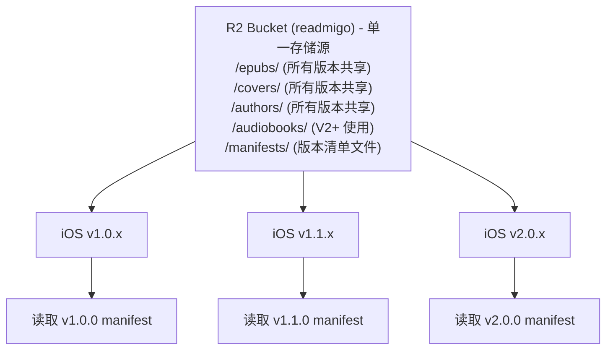
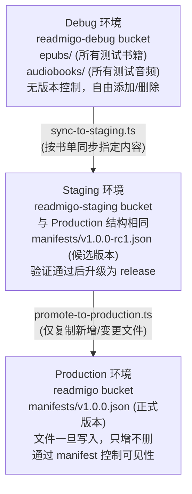
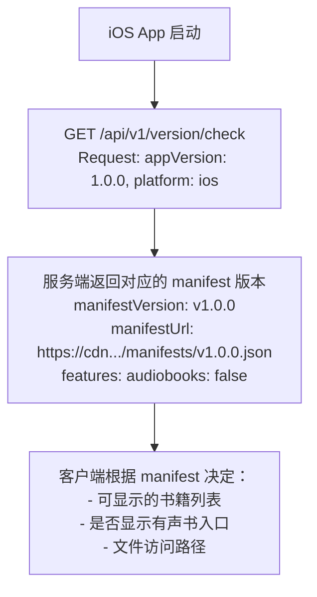
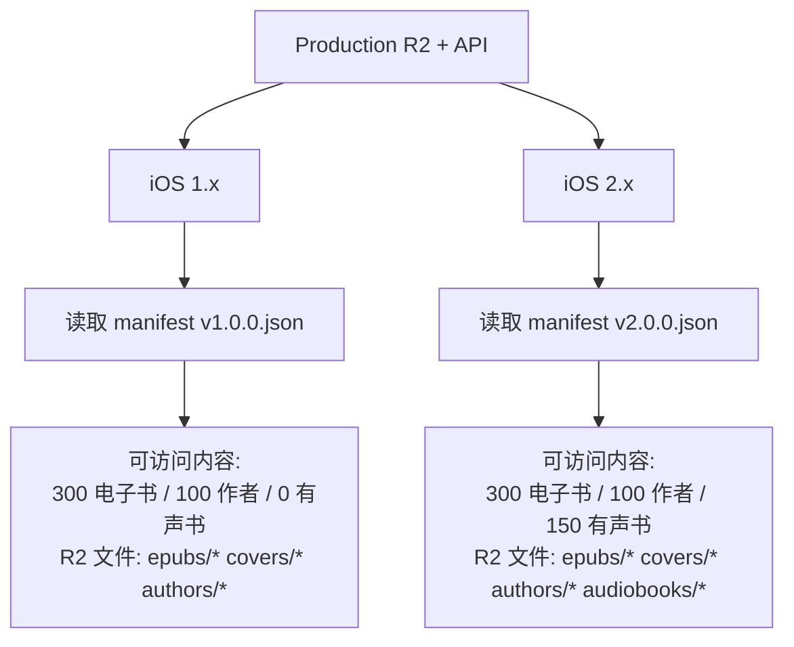
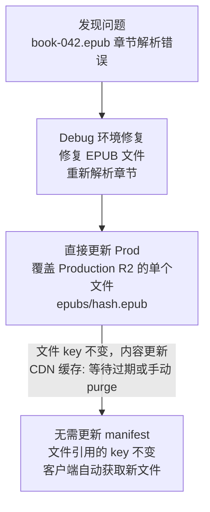

# R2 文件版本管理策略

> 解决多版本间文件重复问题，以 V1→V2（新增有声书）为例

---

## 一、问题分析

### 1.1 简单方案的问题

### 1.2 V1 与 V2 的内容差异

| 内容类型 | V1 | V2 | 差异 |
|----------|-----|-----|------|
| 电子书 | 300 本 | 300 本 | 相同 |
| 作者 | 100 位 | 100 位 | 相同 |
| 封面图 | 300 张 | 300 张 | 相同 |
| 有声书 | 0 本 | 150 本 | **新增** |
| 音频文件 | 0 | ~15GB | **新增** |

---

## 二、推荐方案：共享存储 + 版本清单

### 2.1 核心思路

### 2.2 目录结构设计

### 2.3 版本清单文件结构

---

## 三、版本控制流程

### 3.1 数据流向

### 3.2 客户端版本绑定

---

## 四、V1 → V2 升级推演（新增有声书）

### 4.1 升级前状态 (V1.0.0)

| 资源类型 | R2 文件 | 大小 | 状态 |
|----------|---------|------|------|
| EPUB 文件 | 300 个 | ~150MB | 已发布 |
| 书籍封面 | 300 张 | ~60MB | 已发布 |
| 作者头像 | 100 张 | ~20MB | 已发布 |
| 有声书音频 | 0 | 0 | 不存在 |
| **总计** | | **~230MB** | |

### 4.2 升级目标 (V2.0.0)

| 资源类型 | R2 文件 | 大小 | 变化 |
|----------|---------|------|------|
| EPUB 文件 | 300 个 | ~150MB | **复用** |
| 书籍封面 | 300 张 | ~60MB | **复用** |
| 作者头像 | 100 张 | ~20MB | **复用** |
| 有声书音频 | 150 本 × 10章 | ~15GB | **新增** |
| 有声书封面 | 150 张 | ~30MB | **新增** |
| **总计** | | **~15.26GB** | |

### 4.3 执行计划

### 4.4 文件同步详情

---

## 五、向后兼容保证

### 5.1 多版本客户端并存

### 5.2 API 版本映射

| 客户端版本 | API 版本 | Manifest 版本 | 有声书功能 |
|------------|----------|---------------|------------|
| iOS 1.0.x | /api/v1 | v1.0.0.json | 禁用 |
| iOS 1.1.x | /api/v1 | v1.1.0.json | 禁用 |
| iOS 2.0.x | /api/v1 | v2.0.0.json | 启用 |
| iOS 2.1.x | /api/v1 | v2.1.0.json | 启用 |

### 5.3 功能开关配置

---

## 六、文件修复与热更新

### 6.1 单文件修复流程

### 6.2 批量更新与版本升级

| 场景 | 处理方式 | 是否需要新 manifest |
|------|----------|-------------------|
| 修复单个 EPUB | 直接覆盖文件 | 否 |
| 修复多个封面 | 直接覆盖文件 | 否 |
| 新增 50 本书 | 添加文件 + 更新 manifest | 是 (v1.1.0) |
| 新增有声书功能 | 添加文件 + 新 manifest | 是 (v2.0.0) |
| 删除某本书 | 更新 manifest 移除引用 | 是 |

---

## 七、存储成本优化

### 7.1 各版本存储占用

| 版本 | 新增内容 | 新增存储 | 累计存储 |
|------|----------|----------|----------|
| V1.0.0 | 300 电子书 + 100 作者 | ~230MB | ~230MB |
| V1.1.0 | +200 电子书 | ~150MB | ~380MB |
| V2.0.0 | +150 有声书 | ~15GB | ~15.4GB |
| V2.1.0 | +50 有声书 | ~5GB | ~20.4GB |

### 7.2 成本对比

### 7.3 月度成本估算

| 阶段 | 存储量 | 存储费用 | 出站流量 | 流量费用 | 总计 |
|------|--------|----------|----------|----------|------|
| V1 发布 | 1GB | $0.015 | 50GB | $0 | ~$0.02 |
| V2 发布 | 20GB | $0.30 | 500GB | $0 | ~$0.35 |
| V2 成熟 | 50GB | $0.75 | 2TB | $0 | ~$0.80 |

> R2 出站流量免费是核心优势

---

## 八、执行检查清单

### 8.1 V2 发布前检查

---

*文档版本: 1.0*
*创建日期: 2025-12-31*
*关联文档: v1-fullstack-release-plan.md*
