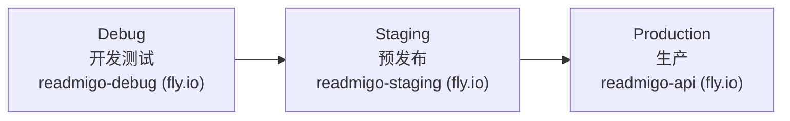
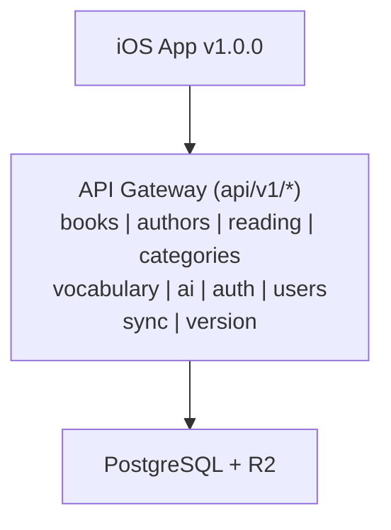
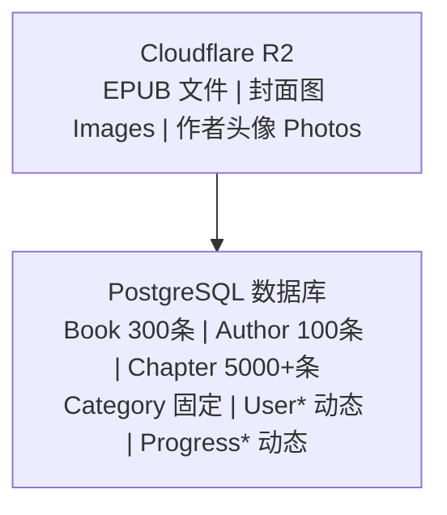
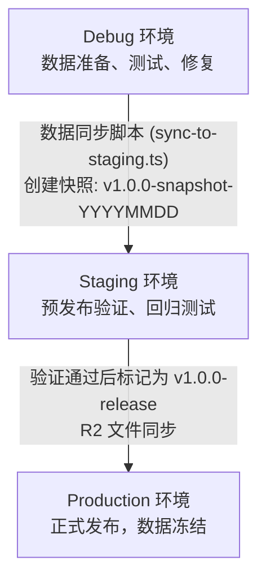
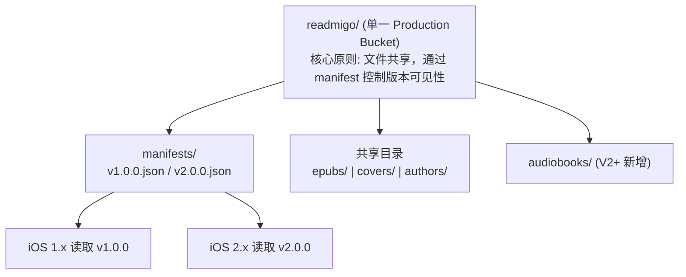
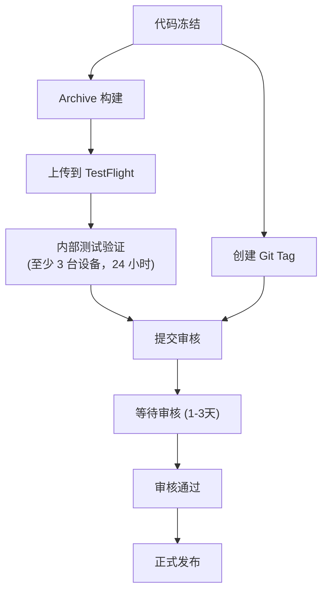
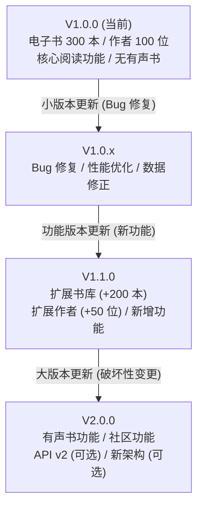
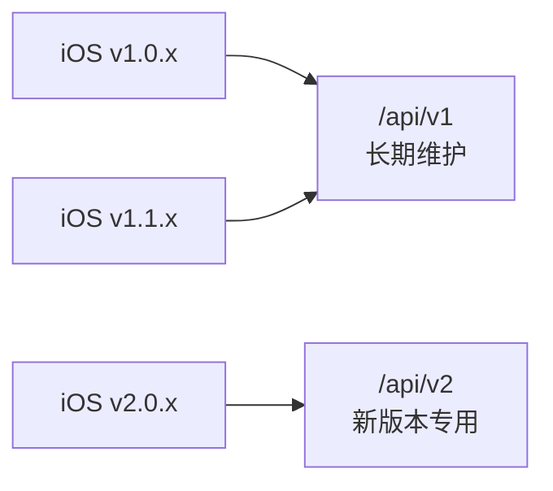
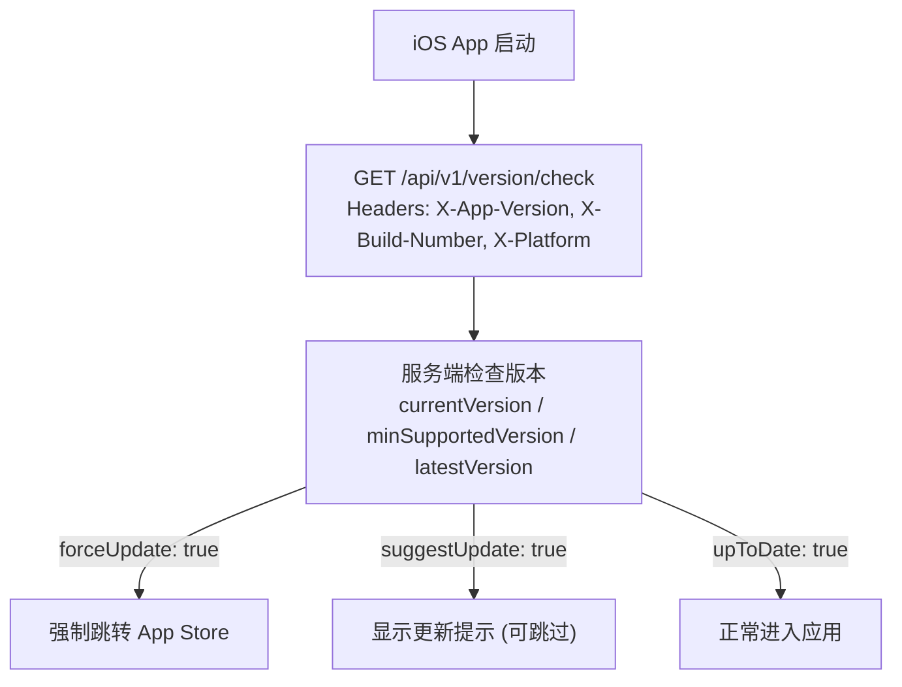

# Readmigo V1 全栈发布执行文档

> 版本: 1.0.0 | 功能范围: 电子书 + 作者 + 阅读 + 发现 | 无有声书
>
> **Release Notes**: [v1.0.0.md](./notes/v1.0.0.md) (GitHub Release 内容)

---

## 一、发布概览

### 1.1 版本范围定义

| 维度 | V1 范围 | 备注 |
|------|---------|------|
| **电子书** | 300 本 | P0 核心 + P1 高优先 |
| **作者** | 100 位 | 文学巨匠 + 热门作家 |
| **有声书** | 0 本 | V1 不包含，API 保留 |
| **平台** | iOS 优先 | Android/Web 后续 |

### 1.2 环境架构

### 1.3 关键里程碑

| 阶段 | 任务 | 状态 |
|------|------|------|
| Phase 0 | Debug 环境数据准备 (300书/100作者) | 进行中 |
| Phase 1 | Staging 环境数据同步与验证 | 待开始 |
| Phase 2 | Production 数据部署与 API 固定 | 待开始 |
| Phase 3 | iOS App Store 提审 | 待开始 |
| Phase 4 | V1 正式发布 | 待开始 |

---

## 二、API 版本管理策略

### 2.1 API 版本架构

### 2.2 V1 核心 API 端点清单

| 模块 | 端点 | 方法 | 用途 | V1 固定 |
|------|------|------|------|---------|
| **认证** | /api/v1/auth/apple | POST | Apple 登录 | ✅ |
| | /api/v1/auth/google | POST | Google 登录 | ✅ |
| | /api/v1/auth/guest | POST | 游客登录 | ✅ |
| | /api/v1/auth/refresh | POST | Token 刷新 | ✅ |
| **书籍** | /api/v1/books | GET | 书籍列表 | ✅ |
| | /api/v1/books/:id | GET | 书籍详情 | ✅ |
| | /api/v1/books/:id/chapters | GET | 章节列表 | ✅ |
| | /api/v1/books/:id/content | GET | 章节内容 | ✅ |
| **作者** | /api/v1/authors | GET | 作者列表 | ✅ |
| | /api/v1/authors/:id | GET | 作者详情 | ✅ |
| | /api/v1/authors/:id/books | GET | 作者作品 | ✅ |
| **阅读** | /api/v1/reading/progress | GET/PATCH | 阅读进度 | ✅ |
| | /api/v1/reading/history | GET | 阅读历史 | ✅ |
| | /api/v1/reading/stats | GET | 阅读统计 | ✅ |
| **发现** | /api/v1/categories | GET | 分类列表 | ✅ |
| | /api/v1/recommendation | GET | 推荐书籍 | ✅ |
| | /api/v1/search | GET | 搜索 | ✅ |
| **词汇** | /api/v1/vocabulary | GET/POST | 生词本 | ✅ |
| | /api/v1/vocabulary/review | GET | 复习列表 | ✅ |
| **AI** | /api/v1/ai/explain | POST | AI 查词 | ✅ |
| | /api/v1/ai/translate | POST | AI 翻译 | ✅ |
| **同步** | /api/v1/sync | POST | 数据同步 | ✅ |
| **版本** | /api/v1/version/check | GET | 版本检查 | ✅ |

### 2.3 V1 排除的 API 端点

| 模块 | 端点 | 状态 | 说明 |
|------|------|------|------|
| **有声书** | /api/v1/audiobooks/* | 保留但不暴露 | V2 启用 |
| **城邦社区** | /api/v1/agora/* | 保留但不暴露 | V2 启用 |
| **作者聊天** | /api/v1/author-chat/* | 保留但不暴露 | V2 启用 |

### 2.4 API 固定规则

---

## 三、数据固定策略

### 3.1 数据层架构

### 3.2 V1 内容数据固定清单

| 数据类型 | 数量 | 来源 | 固定时间 | 更新策略 |
|----------|------|------|----------|----------|
| 电子书 | 300 本 | Standard Ebooks | 发布前 | 仅修复，不新增 |
| 作者 | 100 位 | Wikidata + Wikipedia | 发布前 | 仅修复，不新增 |
| 章节 | ~5000 章 | EPUB 解析 | 发布前 | 随书籍修复 |
| 分类 | 15 个 | 预定义 | 发布前 | 冻结 |
| EPUB 文件 | 300 个 | Standard Ebooks | 发布前 | 仅修复 |
| 封面图 | 300 张 | Standard Ebooks | 发布前 | 仅修复 |
| 作者头像 | 100 张 | Wikidata | 发布前 | 仅修复 |

### 3.3 数据版本快照策略

### 3.4 数据库迁移规则

| 迁移类型 | 允许 | 说明 |
|----------|------|------|
| 新增表 | ✅ | 不影响现有功能 |
| 新增字段 (可选) | ✅ | 必须有默认值 |
| 新增字段 (必填) | ❌ | 破坏性变更 |
| 删除字段 | ❌ | 破坏性变更 |
| 修改字段类型 | ❌ | 破坏性变更 |
| 新增索引 | ✅ | 性能优化 |
| 数据修复 | ✅ | 修复错误数据 |

### 3.5 R2 文件版本管理

> 详细策略见 [R2 版本管理策略](./r2-versioning-strategy.md)

| 版本 | 新增内容 | 新增存储 | 累计存储 |
|------|----------|----------|----------|
| V1.0.0 | 300 电子书 + 100 作者 | ~230MB | ~230MB |
| V2.0.0 | +150 有声书 | ~15GB | ~15.2GB |

---

## 四、iOS 发布流程

### 4.1 发布前置检查清单

### 4.2 App Store 提审流程

### 4.3 版本号管理

| 字段 | V1 值 | 说明 |
|------|-------|------|
| Version | 1.0.0 | 语义化版本 |
| Build Number | 1 | 递增构建号 |
| Min iOS Version | 17.0 | 最低支持版本 |
| API Version | v1 | API 版本前缀 |

---

## 五、后续升级策略

### 5.1 版本升级路径

### 5.2 API 升级策略

| 升级类型 | 策略 | 影响 |
|----------|------|------|
| **向后兼容升级** | 直接在 v1 添加 | 不影响现有客户端 |
| **新功能 API** | 添加新端点到 v1 | 旧客户端不受影响 |
| **破坏性变更** | 创建 v2 版本 | v1 保持兼容运行 |

### 5.3 多版本 API 并存策略

### 5.4 数据升级策略

| 升级类型 | 策略 | 流程 |
|----------|------|------|
| **新增书籍** | 增量同步 | Debug → Staging → Production |
| **修复书籍** | 热修复 | 直接修复 Production |
| **新增作者** | 增量同步 | Debug → Staging → Production |
| **修复作者** | 热修复 | 直接修复 Production |
| **新增分类** | 版本绑定 | 需要 App 版本支持 |

### 5.5 强制更新机制

---

## 六、执行步骤

### 6.1 Phase 0: Debug 环境数据准备

| 步骤 | 任务 | 验收标准 |
|------|------|----------|
| 0.1 | 导入 300 本电子书 | 所有书籍可浏览、可阅读 |
| 0.2 | 导入 100 位作者 | 所有作者有头像、简介 |
| 0.3 | 上传 EPUB 到 R2 | 所有文件可访问 |
| 0.4 | 上传封面图到 R2 | 所有图片可显示 |
| 0.5 | 验证章节解析 | 章节数量和内容正确 |
| 0.6 | 验证分类关联 | 书籍分类正确 |

### 6.2 Phase 1: Staging 环境验证

| 步骤 | 任务 | 验收标准 |
|------|------|----------|
| 1.1 | 执行数据同步脚本 | 无错误完成 |
| 1.2 | 验证数据完整性 | 300 书 / 100 作者 |
| 1.3 | iOS 连接 Staging 测试 | 全功能正常 |
| 1.4 | 性能测试 | 满足性能指标 |
| 1.5 | 创建数据快照 | v1.0.0-staging-YYYYMMDD |

### 6.3 Phase 2: Production 部署

| 步骤 | 任务 | 验收标准 |
|------|------|----------|
| 2.1 | 同步数据到 Production | 无错误完成 |
| 2.2 | 同步 R2 文件到 Production | 所有文件可访问 |
| 2.3 | 验证 Production API | 所有端点正常 |
| 2.4 | 标记数据版本 | v1.0.0-release |
| 2.5 | 冻结数据变更 | 进入只读模式 |

### 6.4 Phase 3: iOS 提审

| 步骤 | 任务 | 验收标准 |
|------|------|----------|
| 3.1 | 切换 iOS 到 Production | 配置正确 |
| 3.2 | Archive 构建 | 构建成功 |
| 3.3 | 上传 TestFlight | 上传成功 |
| 3.4 | 内部测试 | 通过测试 |
| 3.5 | 提交 App Store 审核 | 提交成功 |

### 6.5 Phase 4: 正式发布

| 步骤 | 任务 | 验收标准 |
|------|------|----------|
| 4.1 | App Store 审核通过 | 状态变更 |
| 4.2 | 选择发布时间 | 确认发布 |
| 4.3 | 创建 Git Release Tag | v1.0.0 |
| 4.4 | 监控发布后指标 | 无异常 |

---

## 七、风险与回滚

### 7.1 风险清单

| 风险 | 影响 | 缓解措施 |
|------|------|----------|
| API 接口变更 | 客户端崩溃 | API 变更必须向后兼容 |
| 数据不完整 | 内容缺失 | 发布前完整验证 |
| 性能问题 | 用户体验差 | Staging 性能测试 |
| 审核被拒 | 发布延迟 | 遵循 Apple 指南 |

### 7.2 回滚策略

---

## 八、监控与告警

### 8.1 关键指标

| 指标 | 阈值 | 告警方式 |
|------|------|----------|
| API 响应时间 (P95) | < 500ms | Sentry |
| API 错误率 | < 1% | Sentry |
| 数据库连接数 | < 80% | Fly.io |
| 内存使用率 | < 80% | Fly.io |
| iOS 崩溃率 | < 0.1% | Sentry |

### 8.2 监控仪表盘

| 仪表盘 | 用途 | 访问方式 |
|--------|------|----------|
| Fly.io Dashboard | 服务器监控 | fly.io/apps/readmigo-api |
| Sentry | 错误追踪 | sentry.io |
| App Store Connect | iOS 分析 | appstoreconnect.apple.com |

---

*文档版本: 1.0*
*创建日期: 2025-12-31*
*状态: 待执行*
